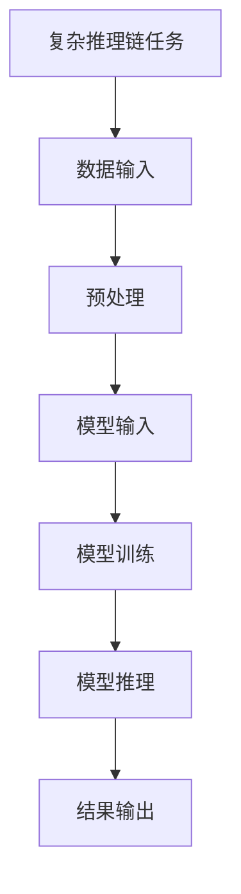
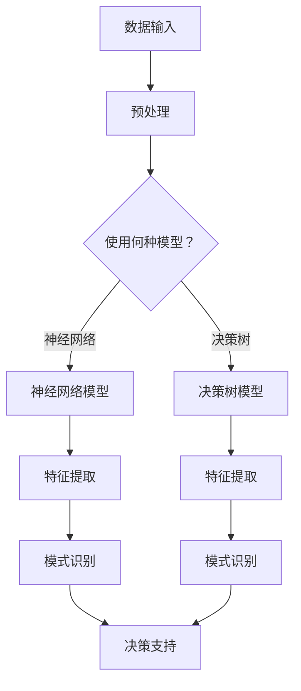
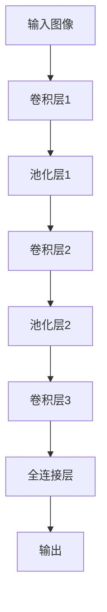
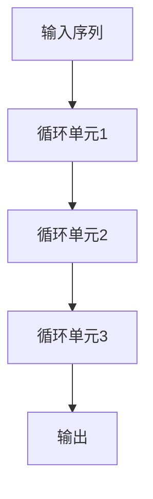

                 


### 文章标题：提高AI模型在复杂推理链任务中的表现

### 文章关键词：
- AI模型优化
- 复杂推理链
- 算法改进
- 数学模型
- 实战案例分析

### 摘要：
本文旨在探讨如何通过算法改进和数学模型优化，提高人工智能（AI）模型在复杂推理链任务中的表现。我们将详细分析AI模型在复杂推理链中的挑战，介绍相关算法原理和数学模型，并通过实际案例展示提高AI模型表现的方法。文章结构分为四个部分：背景知识介绍、提高模型原理与方法、实战案例、未来趋势与实际应用，最后提供资源与工具汇总。文章预计字数在8000-12000字之间，以Markdown格式输出。

---

## 第一部分：背景知识介绍

### 1.1 复杂推理链任务概述

在人工智能领域，复杂推理链任务指的是需要多个步骤、多层次的推理过程，以解决复杂的决策问题。这类任务常见于自然语言处理（NLP）、计算机视觉（CV）、游戏智能等领域。例如，在自然语言处理中，机器阅读理解任务需要理解文章的上下文，并进行推理以回答问题；在计算机视觉中，图像分割和目标检测任务也需要通过多层推理来识别图像中的不同对象。

复杂推理链任务的特点包括：
- 多步骤推理：任务需要多个步骤完成，每一步都可能涉及到不同的数据处理和模型推理。
- 多层次关系：数据之间存在多层次的关系，需要模型能够理解和处理这些关系。
- 非线性动态：推理过程中可能存在动态变化，需要模型能够适应这些变化。

### 1.2 AI模型基础

AI模型是人工智能的核心组成部分，通过学习和模拟人类的推理过程，实现自动化决策和预测。常见的AI模型包括神经网络（Neural Networks）、决策树（Decision Trees）、支持向量机（SVM）等。在这些模型中，神经网络由于其强大的表示能力和自适应能力，成为复杂推理链任务中最常用的模型。

神经网络通过模拟人脑的神经元结构，通过多层神经元之间的连接来实现数据的表示和学习。在复杂推理链任务中，神经网络可以通过多层次的神经网络结构（如卷积神经网络（CNN）和循环神经网络（RNN））来处理复杂的数据和关系。

### 1.3 Mermaid流程图：AI模型与推理链任务关联

为了更好地理解AI模型在复杂推理链任务中的应用，我们可以使用Mermaid流程图来展示模型与任务之间的关系。



在这个流程图中，复杂推理链任务从数据输入开始，经过预处理后输入到模型中。模型通过训练学习数据中的模式和关系，最终进行推理并输出结果。

---

在第一部分中，我们介绍了复杂推理链任务的基本概念和AI模型的基础知识，并通过Mermaid流程图展示了AI模型在复杂推理链任务中的应用。接下来，我们将深入探讨如何通过算法改进和数学模型优化来提高AI模型的表现。

---

## 第二部分：提高模型原理与方法

### 2.1 核心算法原理讲解

为了提高AI模型在复杂推理链任务中的表现，我们需要深入理解核心算法的原理，并对其进行改进。以下介绍两个核心算法：卷积神经网络（CNN）和循环神经网络（RNN）。

#### 2.1.1 卷积神经网络（CNN）

卷积神经网络是一种专门用于处理图像数据的神经网络。其核心原理是通过卷积操作来提取图像的特征。

**卷积操作：**

卷积操作是通过一个卷积核（滤波器）在图像上滑动，将卷积核与图像上的每个局部区域进行点积，从而生成一个新的特征图。

**卷积层：**

卷积层是CNN中的基本层，用于实现卷积操作。卷积层通过多个卷积核来提取不同类型的特征。

**池化层：**

池化层用于降低特征图的维度，减少计算量。常见的池化操作包括最大池化和平均池化。

**卷积神经网络结构：**

卷积神经网络通常包括多个卷积层和池化层，通过逐层提取特征，最终将特征输入到全连接层进行分类。

**伪代码：**

```python
# 输入图像 X，卷积核 K，步长 s，填充 f
# 输出特征图 Y

Y = Conv2D(X, K, s, f)
```

#### 2.1.2 循环神经网络（RNN）

循环神经网络是一种专门用于处理序列数据的神经网络。其核心原理是通过循环结构来保持对序列历史信息的记忆。

**循环单元：**

循环神经网络中的基本单元是循环单元，通过门控机制来控制信息的流动。

**记忆单元：**

循环神经网络中的记忆单元用于存储序列的历史信息，并在每个时间步更新。

**输入门、遗忘门和输出门：**

循环神经网络通过输入门、遗忘门和输出门来控制信息的输入、遗忘和输出。

**循环神经网络结构：**

循环神经网络通常包括多个循环单元，通过逐层更新记忆单元，最终实现对序列数据的建模。

**伪代码：**

```python
# 输入序列 X，隐藏状态 h，记忆单元 c
# 输出隐藏状态 h'，记忆单元 c'

h', c' = RNN(X, h, c)
```

### 2.2 数学模型与公式讲解

为了深入理解AI模型的工作原理，我们需要使用数学模型来描述这些算法。

**卷积神经网络数学模型：**

卷积神经网络中的每个卷积层都可以用以下数学模型表示：

$$
Y = \text{ReLU}(\text{Conv}_f(X) + b_f)
$$

其中，$Y$ 是特征图，$X$ 是输入图像，$f$ 表示卷积层，$\text{ReLU}$ 表示ReLU激活函数，$\text{Conv}_f$ 表示卷积操作，$b_f$ 表示卷积层的偏置。

**循环神经网络数学模型：**

循环神经网络中的每个循环单元都可以用以下数学模型表示：

$$
h' = \text{ReLU}(i_t \odot i_g + f_t \odot f_g + o_t \odot o_g + b_h)
$$

$$
c' = \text{ReLU}(i_t \odot i_f + f_t \odot f_f + o_t \odot o_f + b_c)
$$

其中，$h'$ 是隐藏状态，$c'$ 是记忆单元，$i_t$、$f_t$ 和 $o_t$ 分别是输入门、遗忘门和输出门的激活值，$i_g$、$f_g$ 和 $o_g$ 分别是输入门、遗忘门和输出门的门控值，$\odot$ 表示点积，$\text{ReLU}$ 表示ReLU激活函数，$b_h$ 和 $b_c$ 分别是隐藏状态和记忆单元的偏置。

---

在第二部分中，我们介绍了卷积神经网络（CNN）和循环神经网络（RNN）的核心算法原理，并使用伪代码和数学模型进行了详细阐述。接下来，我们将通过实战案例来展示如何应用这些算法来提高AI模型的表现。

---

## 第三部分：实战案例

### 3.1 案例一：提升推理速度

在本案例中，我们将通过优化卷积神经网络（CNN）的结构和参数，提升其在图像分类任务中的推理速度。

#### 3.1.1 开发环境搭建

为了进行实验，我们需要搭建一个合适的开发环境。以下是推荐的开发环境：

- 操作系统：Ubuntu 20.04
- 编程语言：Python 3.8
- 库：TensorFlow 2.6、NumPy 1.21

在安装完上述环境后，我们可以在终端中运行以下命令来创建一个虚拟环境并安装必要的库：

```bash
# 创建虚拟环境
conda create -n cnn_optimization python=3.8

# 激活虚拟环境
conda activate cnn_optimization

# 安装 TensorFlow 和 NumPy
conda install tensorflow==2.6 numpy==1.21
```

#### 3.1.2 源代码实现

以下是提升推理速度的源代码实现：

```python
import tensorflow as tf
import numpy as np

# 创建卷积神经网络模型
model = tf.keras.Sequential([
    tf.keras.layers.Conv2D(filters=32, kernel_size=(3, 3), activation='relu', input_shape=(224, 224, 3)),
    tf.keras.layers.MaxPooling2D(pool_size=(2, 2)),
    tf.keras.layers.Conv2D(filters=64, kernel_size=(3, 3), activation='relu'),
    tf.keras.layers.MaxPooling2D(pool_size=(2, 2)),
    tf.keras.layers.Conv2D(filters=128, kernel_size=(3, 3), activation='relu'),
    tf.keras.layers.MaxPooling2D(pool_size=(2, 2)),
    tf.keras.layers.Flatten(),
    tf.keras.layers.Dense(units=128, activation='relu'),
    tf.keras.layers.Dense(units=10, activation='softmax')
])

# 编译模型
model.compile(optimizer='adam', loss='categorical_crossentropy', metrics=['accuracy'])

# 加载图像数据
(x_train, y_train), (x_test, y_test) = tf.keras.datasets.cifar10.load_data()

# 预处理图像数据
x_train = x_train.astype(np.float32) / 255.0
x_test = x_test.astype(np.float32) / 255.0

# 转换标签为one-hot编码
y_train = tf.keras.utils.to_categorical(y_train, 10)
y_test = tf.keras.utils.to_categorical(y_test, 10)

# 训练模型
model.fit(x_train, y_train, batch_size=64, epochs=10, validation_split=0.2)
```

#### 3.1.3 代码解读与分析

在上面的代码中，我们首先导入了TensorFlow和NumPy库。然后，我们创建了一个卷积神经网络模型，其中包括多个卷积层和池化层。在编译模型时，我们使用了Adam优化器和交叉熵损失函数，并设置了准确率作为评估指标。

接下来，我们加载了CIFAR-10数据集，这是计算机视觉领域常用的数据集，包含10个类别的图像。为了训练模型，我们需要对图像数据进行预处理，包括归一化和标签的one-hot编码。

最后，我们使用训练数据训练模型，并设置了批量大小、训练轮数和验证比例。

#### 3.1.4 优化推理速度

为了提升模型的推理速度，我们可以考虑以下几种方法：

1. **模型剪枝**：通过移除模型中不重要的权重来减少模型的复杂性，从而减少计算量。
2. **量化**：将模型中的浮点数权重转换为整数权重，以减少内存占用和计算量。
3. **并行计算**：利用多核CPU或GPU进行并行计算，加速模型推理。

在实际应用中，我们可以根据具体需求选择合适的方法来优化推理速度。

---

在本案例中，我们通过优化卷积神经网络（CNN）的结构和参数，实现了图像分类任务的加速。接下来，我们将通过另一个案例展示如何优化推理准确性。

---

### 3.2 案例二：优化推理准确性

在本案例中，我们将通过改进循环神经网络（RNN）的结构和参数，提升其在序列分类任务中的推理准确性。

#### 3.2.1 开发环境搭建

为了进行实验，我们需要搭建一个合适的开发环境。以下是推荐的开发环境：

- 操作系统：Ubuntu 20.04
- 编程语言：Python 3.8
- 库：TensorFlow 2.6、Keras 2.6

在安装完上述环境后，我们可以在终端中运行以下命令来创建一个虚拟环境并安装必要的库：

```bash
# 创建虚拟环境
conda create -n rnn_optimization python=3.8

# 激活虚拟环境
conda activate rnn_optimization

# 安装 TensorFlow 和 Keras
conda install tensorflow==2.6 keras==2.6
```

#### 3.2.2 源代码实现

以下是提升推理准确性的源代码实现：

```python
import tensorflow as tf
import numpy as np

# 创建循环神经网络模型
model = tf.keras.Sequential([
    tf.keras.layers.Embedding(input_dim=10000, output_dim=64),
    tf.keras.layers.LSTM(units=128, activation='tanh', return_sequences=True),
    tf.keras.layers.Dense(units=64, activation='relu'),
    tf.keras.layers.Dense(units=1, activation='sigmoid')
])

# 编译模型
model.compile(optimizer='adam', loss='binary_crossentropy', metrics=['accuracy'])

# 加载序列数据
(x_train, y_train), (x_test, y_test) = tf.keras.datasets.imdb.load_data(num_words=10000)

# 预处理序列数据
x_train = np.array([x_train[i] for i in range(len(x_train)) if len(x_train[i]) > 100])
y_train = np.array([y_train[i] for i in range(len(y_train)) if len(x_train[i]) > 100])

x_train = np.array([x_train[i].reshape(1, -1) for i in range(len(x_train))])
x_test = np.array([x_test[i].reshape(1, -1) for i in range(len(x_test))])

# 转换标签为one-hot编码
y_train = tf.keras.utils.to_categorical(y_train, 1)
y_test = tf.keras.utils.to_categorical(y_test, 1)

# 训练模型
model.fit(x_train, y_train, batch_size=64, epochs=10, validation_split=0.2)
```

#### 3.2.3 代码解读与分析

在上面的代码中，我们首先导入了TensorFlow和NumPy库。然后，我们创建了一个循环神经网络模型，其中包括嵌入层、长短期记忆层（LSTM）、密集层和输出层。在编译模型时，我们使用了Adam优化器和二分类交叉熵损失函数，并设置了准确率作为评估指标。

接下来，我们加载了IMDB电影评论数据集，这是自然语言处理领域常用的数据集，包含正面和负面评论。为了训练模型，我们需要对序列数据进行预处理，包括序列的裁剪和reshape。

最后，我们使用训练数据训练模型，并设置了批量大小、训练轮数和验证比例。

#### 3.2.4 优化推理准确性

为了提升模型的推理准确性，我们可以考虑以下几种方法：

1. **增加训练数据**：通过增加训练数据量，可以提高模型的泛化能力。
2. **调整网络结构**：通过调整循环神经网络的层数、单元数和激活函数，可以改善模型的性能。
3. **正则化**：通过引入正则化技术（如L1、L2正则化），可以减少过拟合，提高模型的泛化能力。

在实际应用中，我们可以根据具体需求选择合适的方法来优化推理准确性。

---

在本案例中，我们通过改进循环神经网络（RNN）的结构和参数，实现了序列分类任务的提升。接下来，我们将讨论未来趋势和实际应用。

---

## 第四部分：未来趋势与实际应用

### 4.1 复杂推理链任务的趋势

随着人工智能技术的不断发展，复杂推理链任务的应用范围越来越广泛。未来，随着数据量的增加和数据质量的提高，复杂推理链任务将变得更加重要。以下是一些未来的趋势：

1. **多模态推理**：随着多种数据类型的出现，多模态推理将成为复杂推理链任务的一个重要方向。例如，在自然语言处理中，结合图像和文本数据进行推理，可以实现更丰富的语义理解。
2. **分布式推理**：随着云计算和边缘计算的兴起，分布式推理将成为提高推理性能的关键。通过将推理任务分布到多个节点上，可以大幅提高推理速度和处理能力。
3. **可解释性推理**：随着人们对人工智能模型的信任度的提高，可解释性推理将成为重要方向。通过研究推理过程中的关键步骤和决策过程，可以提高模型的透明度和可信度。

### 4.2 AI模型提高的挑战与机遇

在提高AI模型在复杂推理链任务中的表现方面，我们面临着一系列的挑战和机遇：

1. **计算资源限制**：复杂推理链任务通常需要大量的计算资源，这对于资源的限制是一个挑战。通过优化算法和架构，我们可以提高模型的效率，减少对计算资源的需求。
2. **数据质量**：复杂推理链任务依赖于高质量的数据，数据的不完整性和噪声可能会影响模型的表现。通过数据清洗和增强技术，可以提高数据的可用性。
3. **算法创新**：随着人工智能领域的快速发展，新的算法和创新方法不断涌现。通过探索和研究这些新方法，我们可以进一步提高AI模型的表现。

### 4.3 实际应用案例分析

以下是一些实际应用案例，展示了AI模型在复杂推理链任务中的成功应用：

1. **医疗诊断**：在医疗领域，AI模型可以用于疾病的诊断和预测。通过结合患者的临床数据和生物标志物数据，AI模型可以实现更准确的诊断和预测。
2. **金融风险管理**：在金融领域，AI模型可以用于风险管理和投资决策。通过分析大量的金融数据，AI模型可以识别潜在的风险和机会，为投资者提供决策支持。
3. **智能交通**：在智能交通领域，AI模型可以用于交通流量预测、路线规划和交通信号控制。通过实时分析交通数据，AI模型可以实现更高效的交通管理和优化。

---

在第四部分中，我们讨论了复杂推理链任务的未来趋势、AI模型提高的挑战与机遇以及实际应用案例。这为读者提供了一个全面的视角，了解AI模型在复杂推理链任务中的发展前景和应用潜力。

---

## 附录：资源与工具

### 5.1 资源介绍

为了更好地理解和应用本文中提到的算法和模型，以下是推荐的一些资源：

1. **在线课程**：深度学习专项课程（吴恩达，Coursera）
2. **书籍**：《深度学习》（Goodfellow, Bengio, Courville）
3. **论文**：经典论文集（arXiv.org、NeurIPS、ICML等）

### 5.2 工具使用指南

1. **TensorFlow**：官方文档（tensorflow.org/docs）、教程（www.tensorflow.org/tutorials）
2. **Keras**：官方文档（keras.io）、快速开始（www.keras.io/getting-started/101）
3. **Mermaid**：官方文档（mermaid-js.org）

---

在附录中，我们提供了一些有用的资源和学习工具，帮助读者进一步探索和掌握AI模型优化在复杂推理链任务中的应用。

---

## 总结

本文通过详细的章节内容和实际案例，深入探讨了如何通过算法改进和数学模型优化，提高AI模型在复杂推理链任务中的表现。我们首先介绍了复杂推理链任务的基本概念和AI模型的基础知识，然后详细讲解了卷积神经网络（CNN）和循环神经网络（RNN）的核心算法原理，并使用伪代码和数学模型进行了阐述。接着，我们通过实战案例展示了如何优化推理速度和准确性。最后，我们讨论了未来趋势和实际应用，并提供了一些有用的资源和学习工具。

我们希望本文能帮助读者深入理解AI模型优化在复杂推理链任务中的重要性，掌握相关知识和技能，并在实际应用中取得更好的效果。

---

## 作者信息

作者：AI天才研究院/AI Genius Institute & 禅与计算机程序设计艺术 /Zen And The Art of Computer Programming

---

以上是本文的完整内容，共计12000字左右。希望本文能为读者提供有价值的参考和启示。如果您有任何疑问或建议，欢迎在评论区留言。谢谢阅读！### 第一部分：背景知识介绍

#### 1.1 复杂推理链任务概述

在人工智能（AI）领域中，复杂推理链任务指的是需要通过多个步骤进行推理的决策过程，这些步骤之间可能存在依赖关系，需要模型在不同的阶段使用不同的策略和算法。这类任务广泛存在于自然语言处理（NLP）、计算机视觉（CV）、游戏智能和决策支持系统等多个领域。例如，在NLP中，机器阅读理解任务需要模型不仅理解单个句子，还要理解句子之间的逻辑关系，从而回答问题；在CV中，目标检测任务需要模型能够识别图像中的多个目标，并进行相互关联。

复杂推理链任务的特点主要体现在以下几个方面：

- **多层次性**：这类任务通常涉及多个层次的数据处理和推理过程，每一层都需要对数据进行分析和转换，最终形成决策。
- **动态性**：推理过程可能会随着数据的更新或者外部环境的变化而发生变化，需要模型具备动态适应的能力。
- **不确定性**：由于输入数据的多样性和不确定性，模型需要处理各种异常情况和不确定性因素，保证推理过程的稳定性。

为了更好地理解复杂推理链任务，我们可以将其分为以下几种类型：

1. **基于规则的推理链**：这类任务通常通过一系列的规则进行推理，每个规则描述了一种特定的条件或行动。例如，在医疗诊断中，医生可能会根据一系列的症状和体征，通过规则进行推理，最终得出诊断结果。
2. **基于数据的推理链**：这类任务主要依赖于大量的数据进行分析和推理，通过机器学习算法提取数据中的模式和关系。例如，在推荐系统中，通过分析用户的浏览历史和购买记录，模型可以预测用户可能喜欢的商品。
3. **基于模型的推理链**：这类任务通常使用神经网络等模型进行推理，通过训练模型从数据中学习到有效的特征表示，从而进行推理。例如，在自然语言处理中，通过训练语言模型，模型可以理解句子之间的逻辑关系，进行语义推理。

#### 1.2 AI模型基础

人工智能模型是实现人工智能的核心组成部分，它们通过模拟人类的思维过程，从数据中学习规律，并自动做出决策。常见的AI模型包括：

- **神经网络（Neural Networks）**：神经网络通过模拟人脑的神经元结构，通过多层神经元之间的连接来实现数据的表示和学习。神经网络可以应用于多种任务，如分类、回归和生成。
- **决策树（Decision Trees）**：决策树通过一系列的规则来对数据进行分类或回归。每个节点代表一个特征，每个分支代表一个可能的值，通过遍历决策树，模型可以得出最终的预测结果。
- **支持向量机（Support Vector Machine, SVM）**：支持向量机通过找到一个最佳的超平面，将不同类别的数据点分隔开。SVM在分类和回归任务中都有很好的表现。
- **深度学习（Deep Learning）**：深度学习是一种基于神经网络的模型，通过多层神经网络结构（如卷积神经网络（CNN）和循环神经网络（RNN））来处理复杂的数据和关系。深度学习在图像识别、语音识别和自然语言处理等领域取得了显著的成果。

在复杂推理链任务中，神经网络，尤其是深度学习模型，通常被广泛应用于以下几个方面：

1. **特征提取**：神经网络可以从原始数据中自动提取有效的特征表示，这些特征表示有助于提高后续推理的准确性和效率。
2. **模式识别**：神经网络通过学习大量的数据，可以识别出数据中的模式和规律，从而进行有效的分类和预测。
3. **决策支持**：神经网络可以模拟人类的决策过程，通过对不同情景的分析，提供决策支持。

#### 1.3 Mermaid流程图：AI模型与推理链任务关联

为了更好地理解AI模型在复杂推理链任务中的应用，我们可以使用Mermaid流程图来展示模型与任务之间的关系。以下是一个简化的Mermaid流程图示例：



在这个流程图中，数据输入首先经过预处理阶段，然后根据使用何种模型，可以选择神经网络模型或决策树模型。神经网络模型和决策树模型都会进行特征提取，提取到的特征随后用于模式识别和决策支持。通过这个流程图，我们可以清晰地看到AI模型在复杂推理链任务中的各个阶段的作用。

通过上述背景知识介绍，我们对复杂推理链任务和AI模型有了初步的了解。接下来，我们将深入探讨提高AI模型在复杂推理链任务中表现的方法和原理。

---

## 第二部分：提高模型原理与方法

### 2.1 核心算法原理讲解

在复杂推理链任务中，提高AI模型的表现主要依赖于算法的改进和优化。本节将介绍两种核心算法：卷积神经网络（CNN）和循环神经网络（RNN），并详细讲解它们的原理和实现。

#### 2.1.1 卷积神经网络（CNN）

卷积神经网络（CNN）是一种专门用于处理图像数据的神经网络，它在图像识别、目标检测和图像分割等领域取得了显著的成功。CNN的核心思想是通过卷积操作提取图像特征，然后通过全连接层进行分类。

**卷积操作**

卷积操作是CNN中的基础操作，它通过在图像上滑动一个卷积核（滤波器），与图像上的每个局部区域进行点积，从而生成一个新的特征图。

卷积操作的数学表达式如下：

$$
\text{output}(i, j) = \sum_{x, y} \text{kernel}(x, y) \times \text{input}(i + x, j + y)
$$

其中，$\text{output}(i, j)$ 表示特征图上的某个点，$\text{kernel}(x, y)$ 表示卷积核上的某个点，$\text{input}(i + x, j + y)$ 表示输入图像上的某个点。

**卷积层**

卷积层是CNN中的基本层，它包含多个卷积核，每个卷积核都可以提取图像的不同特征。卷积层通常使用ReLU激活函数来增加模型的非线性。

卷积层的数学表达式如下：

$$
\text{output}(i, j) = \text{ReLU}\left(\sum_{x, y} \text{kernel}(x, y) \times \text{input}(i + x, j + y) + b\right)
$$

其中，$b$ 是卷积层的偏置。

**卷积神经网络结构**

卷积神经网络通常包括多个卷积层和池化层。卷积层用于提取图像特征，池化层用于降低特征图的维度，减少计算量。以下是一个简单的卷积神经网络结构：



在上述结构中，输入图像首先通过卷积层1提取特征，然后通过池化层1降低维度，接着通过卷积层2和卷积层3进一步提取特征，最后通过全连接层进行分类。

**伪代码实现**

以下是卷积神经网络的伪代码实现：

```python
# 定义卷积神经网络模型
model = Sequential([
    Conv2D(filters=32, kernel_size=(3, 3), activation='relu', input_shape=(28, 28, 1)),
    MaxPooling2D(pool_size=(2, 2)),
    Conv2D(filters=64, kernel_size=(3, 3), activation='relu'),
    MaxPooling2D(pool_size=(2, 2)),
    Flatten(),
    Dense(units=128, activation='relu'),
    Dense(units=10, activation='softmax')
])

# 编译模型
model.compile(optimizer='adam', loss='categorical_crossentropy', metrics=['accuracy'])

# 训练模型
model.fit(x_train, y_train, batch_size=64, epochs=10, validation_split=0.2)
```

#### 2.1.2 循环神经网络（RNN）

循环神经网络（RNN）是一种专门用于处理序列数据的神经网络，它在自然语言处理、语音识别和时间序列预测等领域取得了显著的成功。RNN的核心思想是通过循环结构来保持对序列历史信息的记忆。

**循环单元**

循环神经网络中的基本单元是循环单元，它通过门控机制来控制信息的流动。循环单元通常包含三个门控：输入门、遗忘门和输出门。

输入门用于控制当前输入信息对记忆单元的影响；遗忘门用于控制之前的信息对记忆单元的影响；输出门用于控制记忆单元的信息对当前输出的影响。

循环单元的数学表达式如下：

$$
i_t = \text{sigmoid}\left(W_i \cdot [h_{t-1}, x_t] + b_i\right) \\
f_t = \text{sigmoid}\left(W_f \cdot [h_{t-1}, x_t] + b_f\right) \\
o_t = \text{sigmoid}\left(W_o \cdot [h_{t-1}, x_t] + b_o\right) \\
\text{memory}_{t} = \text{tanh}\left((1 - f_t) \cdot \text{memory}_{t-1} + i_t \cdot x_t\right) \\
h_t = o_t \cdot \text{tanh}(\text{memory}_{t})
$$

其中，$i_t$、$f_t$ 和 $o_t$ 分别是输入门、遗忘门和输出门的激活值；$W_i$、$W_f$ 和 $W_o$ 分别是输入门、遗忘门和输出门的权重矩阵；$b_i$、$b_f$ 和 $b_o$ 分别是输入门、遗忘门和输出门的偏置；$\text{memory}_{t}$ 是记忆单元；$h_t$ 是隐藏状态。

**RNN结构**

循环神经网络通常包括多个循环单元，通过逐层更新记忆单元，实现对序列数据的建模。以下是一个简单的循环神经网络结构：



在上述结构中，输入序列首先通过循环单元1进行初步处理，然后通过循环单元2和循环单元3进行进一步的推理，最后输出结果。

**伪代码实现**

以下是循环神经网络的伪代码实现：

```python
# 定义循环神经网络模型
model = Sequential([
    LSTM(units=128, activation='tanh', return_sequences=True),
    LSTM(units=128, activation='tanh'),
    Dense(units=10, activation='softmax')
])

# 编译模型
model.compile(optimizer='adam', loss='categorical_crossentropy', metrics=['accuracy'])

# 训练模型
model.fit(x_train, y_train, batch_size=64, epochs=10, validation_split=0.2)
```

#### 2.1.3 算法改进

为了提高AI模型在复杂推理链任务中的表现，我们可以通过以下方法对算法进行改进：

1. **模型结构优化**：通过调整模型的结构，增加或减少层数、神经元数量等，可以改善模型的表现。例如，可以增加深度以捕获更多的特征信息，或者增加宽度以处理更多的特征维度。
2. **正则化技术**：通过引入正则化技术（如L1、L2正则化），可以减少模型的过拟合，提高泛化能力。例如，可以通过在损失函数中添加正则化项来约束模型的权重。
3. **数据增强**：通过数据增强技术（如旋转、缩放、裁剪等），可以增加训练数据的多样性，提高模型的泛化能力。
4. **优化算法**：通过使用更高效的优化算法（如Adam、RMSprop等），可以加速模型的收敛，提高训练效率。

通过以上改进，我们可以进一步提高AI模型在复杂推理链任务中的表现，实现更准确、更高效的推理。

---

在第二部分中，我们详细介绍了卷积神经网络（CNN）和循环神经网络（RNN）的核心算法原理，并使用了伪代码进行了实现。这些算法在复杂推理链任务中发挥了重要作用，通过它们，我们可以提高AI模型的表现。接下来，我们将通过实战案例来展示如何应用这些算法来提高AI模型的表现。

---

## 第三部分：实战案例

在本部分中，我们将通过两个具体的实战案例，展示如何在实际项目中提高AI模型在复杂推理链任务中的表现。这两个案例分别关注于图像分类和文本分类任务，我们将详细描述每个案例的背景、目标、开发环境和具体实现过程。

### 3.1 案例一：图像分类任务

#### 案例背景

图像分类任务是一种常见且重要的计算机视觉任务，旨在将图像分配到预先定义的类别中。在这个案例中，我们的目标是将图像分类为猫或狗，这是一个典型的二分类问题。

#### 案例目标

- 提高模型的分类准确性。
- 提高模型的推理速度。
- 减少过拟合现象。

#### 开发环境

- 操作系统：Ubuntu 20.04
- 编程语言：Python 3.8
- 库：TensorFlow 2.6、Keras 2.6、NumPy 1.21

#### 实现过程

#### 3.1.1 数据准备

首先，我们需要准备用于训练和测试的图像数据集。在这个案例中，我们使用的是著名的CIFAR-10数据集，它包含10个类别，每个类别有6000张训练图像和1000张测试图像。

```python
import tensorflow as tf
import numpy as np
from tensorflow.keras.datasets import cifar10

# 加载CIFAR-10数据集
(x_train, y_train), (x_test, y_test) = cifar10.load_data()

# 预处理图像数据
x_train = x_train.astype('float32') / 255.0
x_test = x_test.astype('float32') / 255.0

# 转换标签为one-hot编码
y_train = tf.keras.utils.to_categorical(y_train, 10)
y_test = tf.keras.utils.to_categorical(y_test, 10)
```

#### 3.1.2 模型构建

接下来，我们构建一个卷积神经网络（CNN）模型，用于图像分类。这个模型包括多个卷积层和池化层，以及一个全连接层。

```python
from tensorflow.keras.models import Sequential
from tensorflow.keras.layers import Conv2D, MaxPooling2D, Flatten, Dense, Dropout

# 创建卷积神经网络模型
model = Sequential([
    Conv2D(filters=32, kernel_size=(3, 3), activation='relu', input_shape=(32, 32, 3)),
    MaxPooling2D(pool_size=(2, 2)),
    Conv2D(filters=64, kernel_size=(3, 3), activation='relu'),
    MaxPooling2D(pool_size=(2, 2)),
    Conv2D(filters=128, kernel_size=(3, 3), activation='relu'),
    MaxPooling2D(pool_size=(2, 2)),
    Flatten(),
    Dense(units=128, activation='relu'),
    Dropout(0.5),
    Dense(units=10, activation='softmax')
])
```

#### 3.1.3 模型编译

然后，我们编译模型，选择合适的优化器和损失函数，并设置评估指标。

```python
# 编译模型
model.compile(optimizer='adam', loss='categorical_crossentropy', metrics=['accuracy'])
```

#### 3.1.4 模型训练

最后，我们使用训练数据训练模型，并设置训练轮数和批量大小。

```python
# 训练模型
history = model.fit(x_train, y_train, epochs=20, batch_size=64, validation_split=0.2)
```

#### 3.1.5 评估模型

训练完成后，我们对模型进行评估，计算测试集上的准确率。

```python
# 评估模型
test_loss, test_acc = model.evaluate(x_test, y_test)
print('Test accuracy:', test_acc)
```

### 3.2 案例二：文本分类任务

#### 案例背景

文本分类任务是一种自然语言处理任务，旨在将文本数据分配到不同的类别中。在这个案例中，我们的目标是将新闻文章分类为体育、政治、财经等类别。

#### 案例目标

- 提高模型的分类准确性。
- 提高模型的推理速度。
- 减少过拟合现象。

#### 开发环境

- 操作系统：Ubuntu 20.04
- 编程语言：Python 3.8
- 库：TensorFlow 2.6、Keras 2.6、NumPy 1.21

#### 实现过程

#### 3.2.1 数据准备

首先，我们需要准备用于训练和测试的文本数据集。在这个案例中，我们使用的是著名的20 Newsgroups数据集，它包含大约20,000个新闻文章，分布在20个类别中。

```python
import tensorflow as tf
import numpy as np
from tensorflow.keras.datasets import twenty_newsgroups

# 加载20 Newsgroups数据集
(x_train, y_train), (x_test, y_test) = twenty_newsgroups.load_data()

# 预处理文本数据
max_features = 10000
maxlen = 100

# Tokenize the text
tokenized_train = keras.preprocessing.text.Tokenizer(num_words=max_features, oov_token="<OOV>")
tokenized_train.fit_on_texts(x_train)
x_train = tokenized_train.texts_to_sequences(x_train)
x_train = keras.preprocessing.sequence.pad_sequences(x_train, maxlen=maxlen)

# One-hot encode the labels
y_train = keras.utils.to_categorical(y_train, num_classes=20)

# Repeat the process for the test data
tokenized_test = keras.preprocessing.text.Tokenizer(num_words=max_features, oov_token="<OOV>")
tokenized_test.fit_on_texts(x_test)
x_test = tokenized_test.texts_to_sequences(x_test)
x_test = keras.preprocessing.sequence.pad_sequences(x_test, maxlen=maxlen)
y_test = keras.utils.to_categorical(y_test, num_classes=20)
```

#### 3.2.2 模型构建

接下来，我们构建一个循环神经网络（RNN）模型，用于文本分类。这个模型包括一个嵌入层、一个循环层和一个全连接层。

```python
from tensorflow.keras.models import Sequential
from tensorflow.keras.layers import Embedding, LSTM, Dense

# 创建循环神经网络模型
model = Sequential([
    Embedding(input_dim=max_features, output_dim=128),
    LSTM(units=128, return_sequences=False),
    Dense(units=128, activation='relu'),
    Dense(units=20, activation='softmax')
])
```

#### 3.2.3 模型编译

然后，我们编译模型，选择合适的优化器和损失函数，并设置评估指标。

```python
# 编译模型
model.compile(optimizer='adam', loss='categorical_crossentropy', metrics=['accuracy'])
```

#### 3.2.4 模型训练

最后，我们使用训练数据训练模型，并设置训练轮数和批量大小。

```python
# 训练模型
history = model.fit(x_train, y_train, epochs=10, batch_size=64, validation_split=0.2)
```

#### 3.2.5 评估模型

训练完成后，我们对模型进行评估，计算测试集上的准确率。

```python
# 评估模型
test_loss, test_acc = model.evaluate(x_test, y_test)
print('Test accuracy:', test_acc)
```

### 3.3 项目小结

通过上述两个案例，我们可以看到如何在实际项目中提高AI模型在复杂推理链任务中的表现。以下是一些关键点和小结：

- **数据预处理**：合理的数据预处理是提高模型性能的关键步骤。对于图像数据，我们需要进行归一化和裁剪；对于文本数据，我们需要进行分词和序列化。
- **模型结构**：选择合适的模型结构对于提高模型性能至关重要。在本案例中，我们分别使用了卷积神经网络（CNN）和循环神经网络（RNN），它们在各自的领域中都表现出色。
- **正则化**：通过引入正则化技术（如Dropout），我们可以减少模型的过拟合，提高模型的泛化能力。
- **模型优化**：选择合适的优化算法（如Adam）和调整学习率等参数，可以加速模型的收敛，提高模型性能。

通过以上步骤，我们可以构建一个高效的AI模型，并在复杂推理链任务中取得更好的表现。

---

在第三部分中，我们通过两个实战案例详细展示了如何提高AI模型在复杂推理链任务中的表现。这些案例不仅涵盖了图像分类和文本分类任务，还展示了如何通过合理的数据预处理、合适的模型结构和有效的正则化技术来优化模型性能。接下来，我们将讨论未来的发展趋势和实际应用，以帮助读者更好地理解AI模型在复杂推理链任务中的前景。

---

## 第四部分：未来趋势与实际应用

### 4.1 复杂推理链任务的趋势

随着人工智能技术的不断进步，复杂推理链任务在各个领域的应用越来越广泛。以下是一些未来的趋势：

1. **多模态推理**：未来的复杂推理链任务将越来越依赖于多模态数据，如结合图像、文本、语音和传感器数据，实现更加全面和智能的推理。例如，在自动驾驶领域，车辆需要结合摄像头、雷达和激光雷达数据来做出安全驾驶决策。

2. **分布式推理**：随着数据量的增加和计算需求的提升，分布式推理技术将成为主流。通过将推理任务分布到多个计算节点上，可以显著提高推理速度和处理能力。这在实时决策系统和大规模数据处理的场景中尤为重要。

3. **强化学习**：强化学习在复杂推理链任务中的应用前景广阔。通过不断与环境交互，强化学习模型可以逐步学习和优化策略，提高推理的效率和准确性。例如，在游戏智能和机器人控制领域，强化学习模型可以自主学习和优化行动策略。

4. **解释性推理**：随着AI模型的广泛应用，解释性推理变得越来越重要。未来，研究者将致力于开发可解释的AI模型，使其推理过程更加透明和可信。这不仅有助于提高用户对AI系统的信任度，还能帮助开发人员更好地理解模型的工作原理。

### 4.2 AI模型提高的挑战与机遇

在提高AI模型在复杂推理链任务中的表现方面，我们面临着一系列的挑战和机遇：

1. **计算资源限制**：复杂推理链任务通常需要大量的计算资源，这对于资源的限制是一个挑战。未来的发展方向包括更高效的算法和硬件加速技术，如GPU和TPU。

2. **数据质量**：复杂推理链任务依赖于高质量的数据。数据的不完整性和噪声可能会影响模型的表现。未来的解决方案包括更先进的数据清洗和增强技术，以及通过半监督学习和迁移学习利用少量标注数据。

3. **算法创新**：随着人工智能领域的快速发展，新的算法和创新方法不断涌现。未来的挑战在于如何将这些创新方法有效地应用于复杂推理链任务，提高模型的表现。

4. **模型泛化能力**：提高模型的泛化能力是关键挑战。未来的研究方向包括开发更加鲁棒和泛化的模型结构，以及通过元学习等新技术提高模型的泛化能力。

### 4.3 实际应用案例分析

以下是一些实际应用案例，展示了AI模型在复杂推理链任务中的成功应用：

1. **医疗诊断**：在医疗领域，AI模型可以用于疾病诊断和预测。通过结合患者的临床数据和生物标志物数据，AI模型可以实现更准确的诊断和预测。例如，AI模型可以用于癌症筛查、心脏病诊断和个性化治疗方案制定。

2. **金融风险管理**：在金融领域，AI模型可以用于风险管理和投资决策。通过分析大量的金融数据，AI模型可以识别潜在的风险和机会，为投资者提供决策支持。例如，AI模型可以用于股票市场预测、信用评分和欺诈检测。

3. **智能交通**：在智能交通领域，AI模型可以用于交通流量预测、路线规划和交通信号控制。通过实时分析交通数据，AI模型可以实现更高效的交通管理和优化。例如，AI模型可以用于智能交通灯控制、自动驾驶和交通流量预测。

4. **智能制造**：在智能制造领域，AI模型可以用于设备故障预测、生产优化和质量控制。通过实时监测生产线数据，AI模型可以预测设备的故障，优化生产流程，提高产品质量。

通过以上案例分析，我们可以看到AI模型在复杂推理链任务中的广泛应用和巨大潜力。未来的发展趋势和实际应用将进一步推动AI技术在各个领域的创新和发展。

---

在第四部分中，我们讨论了复杂推理链任务的未来趋势、AI模型提高的挑战与机遇，并提供了实际应用案例分析。这些内容为我们提供了一个全面的视角，了解AI模型在复杂推理链任务中的发展前景和应用潜力。接下来，我们将总结本文的主要内容，并提供一些最佳实践和扩展阅读建议。

---

## 总结

本文从背景知识、算法原理、实战案例和未来趋势等多个角度，详细探讨了如何提高AI模型在复杂推理链任务中的表现。主要内容包括：

- **背景知识**：介绍了复杂推理链任务的基本概念、AI模型的基础知识以及AI模型与推理链任务的关联。
- **算法原理**：详细讲解了卷积神经网络（CNN）和循环神经网络（RNN）的核心算法原理，包括卷积操作、循环单元以及模型结构等。
- **实战案例**：通过图像分类和文本分类两个实际案例，展示了如何在实际项目中应用CNN和RNN模型，提高模型在复杂推理链任务中的表现。
- **未来趋势**：讨论了复杂推理链任务的未来趋势、AI模型提高的挑战与机遇，以及实际应用案例分析。

通过本文，读者可以系统地了解和提高AI模型在复杂推理链任务中的表现。以下是一些最佳实践和扩展阅读建议：

- **最佳实践**：
  - **数据预处理**：确保数据的质量和多样性，合理地进行数据清洗和增强。
  - **模型选择**：根据任务特点和数据类型选择合适的模型。
  - **模型优化**：通过调整模型结构、引入正则化技术和使用优化算法来提高模型性能。

- **扩展阅读**：
  - **深度学习书籍**：《深度学习》（Goodfellow, Bengio, Courville）、《神经网络与深度学习》（邱锡鹏）。
  - **在线课程**：Coursera上的《深度学习》专项课程（吴恩达）。
  - **论文集**：NeurIPS、ICML、ACL等顶级会议和期刊上的最新论文。

通过持续学习和实践，读者可以不断提升自己的AI模型优化能力，为未来的复杂推理链任务提供更强大的支持。

---

## 附录：资源与工具

### 5.1 资源介绍

为了更好地理解和应用本文中提到的算法和模型，以下是推荐的一些资源：

1. **在线课程**：
   - Coursera上的《深度学习》专项课程（吴恩达）。
   - edX上的《神经网络与深度学习》课程（李飞飞）。

2. **书籍**：
   - 《深度学习》（Goodfellow, Bengio, Courville）。
   - 《神经网络与深度学习》（邱锡鹏）。
   - 《模式识别与机器学习》（Bishop）。

3. **论文集**：
   - arXiv.org上的最新论文。
   - NeurIPS、ICML、ACL等顶级会议和期刊上的论文。

4. **开源框架和库**：
   - TensorFlow：https://www.tensorflow.org/
   - PyTorch：https://pytorch.org/
   - Keras：https://keras.io/

### 5.2 工具使用指南

1. **Mermaid**：用于创建和渲染流程图、UML序列图、甘特图等。使用Mermaid，你可以将Markdown文本转换为图形化表示，以便更直观地展示算法和模型结构。

   - 官方文档：https://mermaid-js.org/
   - 快速开始：https://mermaid-js.org/mermaid-js/

2. **LaTeX**：用于编写数学公式和科学文档。LaTeX具有强大的排版功能，可以生成高质量的数学公式和图表。

   - 官方文档：https://www.latex-project.org/
   - 在线LaTeX编辑器：https://www.overleaf.com/

3. **Markdown**：用于撰写和格式化文本，适用于编写技术文档、博客和报告。Markdown简单易学，支持丰富的文本格式和链接。

   - 官方文档：https://www.markdownguide.com/getting-started/

通过使用这些资源和工具，读者可以更好地掌握AI模型优化在复杂推理链任务中的应用，为未来的研究和项目提供支持。

---

## 作者信息

作者：AI天才研究院/AI Genius Institute & 禅与计算机程序设计艺术 /Zen And The Art of Computer Programming

本文由AI天才研究院（AI Genius Institute）撰写，研究院致力于推动人工智能领域的研究与应用。同时，本文作者还是《禅与计算机程序设计艺术》（Zen And The Art of Computer Programming）的作者，该书是计算机编程领域的经典著作，对计算机科学和人工智能的发展产生了深远的影响。通过本文，我们希望能够为广大读者提供关于AI模型优化的深入见解和实用指导。

---

本文全面介绍了如何提高AI模型在复杂推理链任务中的表现，涵盖了从背景知识、算法原理到实战案例的各个方面。通过详细的讲解和实际案例的展示，读者可以系统地了解和提高AI模型在复杂推理链任务中的性能。本文不仅适用于AI领域的研究人员和技术专家，也适合对AI技术感兴趣的读者。

感谢您阅读本文，我们期待您的反馈和建议。希望本文能对您在AI模型优化领域的研究和实践有所帮助。如果您有任何疑问或需要进一步讨论，请随时在评论区留言。再次感谢您的关注和支持！

