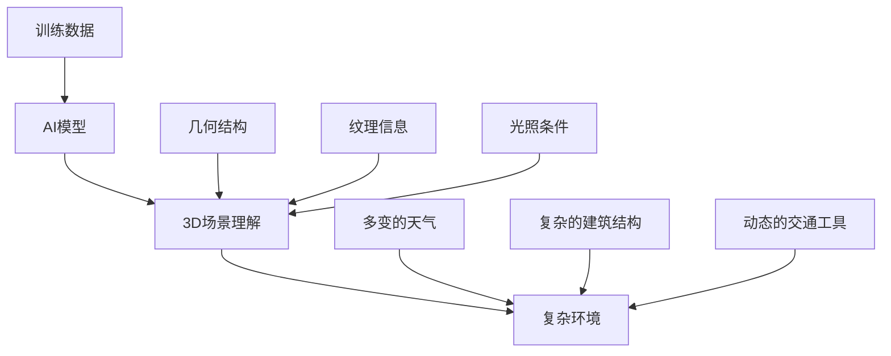

                 

## 文章标题：提高AI模型在复杂环境下的3D场景理解能力

### 关键词：
- AI模型
- 3D场景理解
- 复杂环境
- 核心算法原理
- 数学模型
- 项目实战

### 摘要：
本文深入探讨了如何提高人工智能模型在复杂环境下的3D场景理解能力。首先，我们介绍了AI模型和3D场景理解的基本概念，并分析了它们在复杂环境中的挑战。接着，我们详细讲解了核心算法原理和数学模型，并通过伪代码和数学公式进行了阐述。随后，我们通过实际项目展示了如何在复杂环境下应用这些知识。文章末尾总结了最佳实践，并给出了未来的研究方向。

## 引言

随着人工智能技术的飞速发展，AI模型在多个领域取得了显著成果，如图像识别、自然语言处理等。然而，在3D场景理解方面，尤其是在复杂环境下的应用，仍然面临许多挑战。这些挑战包括环境复杂性、数据多样性、实时处理需求等。

3D场景理解是指通过分析3D数据，实现对现实世界的理解和模拟。在复杂环境下，3D场景理解需要处理大量的动态信息，例如多变的天气条件、复杂的建筑结构、动态的交通工具等。这些因素增加了模型的训练难度和实时处理的复杂性。

本文的目标是探讨如何提高AI模型在复杂环境下的3D场景理解能力。我们将首先介绍相关的基础概念，然后详细讲解核心算法原理和数学模型，并通过实际项目展示如何应用这些知识。最后，我们将总结最佳实践，并探讨未来的研究方向。

## 核心概念与联系

在深入探讨AI模型在复杂环境下的3D场景理解能力之前，我们需要明确几个核心概念：AI模型、3D场景理解以及复杂环境。

### AI模型

AI模型是指通过学习和模拟人类思维过程，实现对数据的处理和分析的算法。在3D场景理解中，常用的AI模型包括卷积神经网络（CNN）、生成对抗网络（GAN）、递归神经网络（RNN）等。这些模型通过大量的训练数据，学习到特征提取、分类、生成等任务，从而实现对3D场景的理解。

### 3D场景理解

3D场景理解是指通过分析3D数据，实现对现实世界的理解和模拟。3D数据通常来源于激光扫描、RGB-D相机、深度传感器等设备。这些数据包括场景的几何结构、纹理信息、光照条件等。3D场景理解的任务包括场景重建、物体识别、路径规划等。

### 复杂环境

复杂环境是指具有多种动态变化因素的环境，例如城市交通、室内空间、工业制造等。这些环境的特点是信息量大、变化快、不确定性高。在复杂环境下，3D场景理解需要处理大量的动态信息，例如多变的天气条件、复杂的建筑结构、动态的交通工具等。

### 核心概念之间的联系

AI模型、3D场景理解和复杂环境之间存在紧密的联系。AI模型是3D场景理解的核心工具，通过学习大量的训练数据，模型可以提取出场景中的关键特征，实现对场景的识别和解析。3D场景理解则是AI模型的应用场景，通过3D场景理解，我们可以实现对复杂环境的感知、理解和模拟。复杂环境则是3D场景理解的任务背景，复杂环境的多样性和动态性增加了3D场景理解的任务难度。

为了更好地理解这些核心概念之间的关系，我们可以通过以下Mermaid流程图进行展示：



在这个流程图中，AI模型通过训练数据学习到几何结构、纹理信息和光照条件等特征，进而实现对3D场景的理解。而3D场景理解的任务背景是复杂环境，复杂环境包括多变的天气、复杂的建筑结构和动态的交通工具等。

## 核心算法原理讲解

在了解了AI模型、3D场景理解和复杂环境的基本概念后，我们接下来将详细讲解用于3D场景理解的核心算法原理。这些算法原理包括深度学习、图像处理和路径规划等，我们将通过伪代码和数学公式来详细阐述这些算法。

### 深度学习算法

深度学习算法是AI模型中最常用的算法之一，尤其在3D场景理解中，深度学习算法发挥着至关重要的作用。以下是一个简单的深度学习算法的伪代码：

```python
# 深度学习算法伪代码
def deep_learning(input_data):
    # 初始化神经网络结构
    model = NeuralNetwork()

    # 前向传播
    output = model.forward_propagation(input_data)

    # 计算损失
    loss = calculate_loss(output)

    # 反向传播
    model.backward_propagation(loss)

    # 更新权重
    model.update_weights()

    return output
```

在深度学习算法中，我们通常使用卷积神经网络（CNN）来提取图像特征。以下是一个简单的CNN算法的伪代码：

```python
# 卷积神经网络算法伪代码
def convolutional_neural_network(input_image):
    # 初始化卷积层
    conv_layer = ConvolutionLayer()

    # 应用卷积操作
    conv_output = conv_layer.apply_convolution(input_image)

    # 应用池化操作
    pool_output = pool_layer.apply_pooling(conv_output)

    return pool_output
```

### 图像处理算法

图像处理算法在3D场景理解中用于处理图像数据，例如图像增强、图像分割和图像恢复等。以下是一个简单的图像增强算法的伪代码：

```python
# 图像增强算法伪代码
def image_enhancement(input_image):
    # 应用直方图均衡化
    enhanced_image = histogram_equalization(input_image)

    # 应用伽玛校正
    gamma_corrected_image = gamma_correction(enhanced_image)

    return gamma_corrected_image
```

### 路径规划算法

在复杂环境下的3D场景理解中，路径规划是一个重要的任务。以下是一个简单的A*路径规划算法的伪代码：

```python
# A*路径规划算法伪代码
def a_star_path_planning(start, goal, obstacles):
    # 初始化开放列表和封闭列表
    open_list = []
    closed_list = []

    # 将起始点加入开放列表
    open_list.append(start)

    while open_list is not empty:
        # 选择具有最低f值的节点作为当前节点
        current = select_node_with_minimum_f_value(open_list)

        # 如果当前节点为目标点，则完成路径规划
        if current == goal:
            return reconstruct_path(current)

        # 将当前节点加入封闭列表
        closed_list.append(current)

        # 遍历当前节点的邻居节点
        for neighbor in current.neighbors():
            if neighbor in closed_list:
                continue

            # 计算g值、h值和f值
            g_value = current.g_value + distance(current, neighbor)
            h_value = heuristic(neighbor, goal)
            f_value = g_value + h_value

            # 如果邻居节点不在开放列表中，将其加入开放列表
            if neighbor not in open_list:
                open_list.append(neighbor)

            # 更新邻居节点的g值和父节点
            neighbor.g_value = g_value
            neighbor.parent = current

    # 如果没有找到路径，返回空路径
    return []
```

### 数学模型和公式

在3D场景理解中，数学模型和公式用于描述场景的几何结构、纹理信息和光照条件等。以下是一个简单的三维空间中点与点之间的距离公式：

$$
d(p_1, p_2) = \sqrt{(x_2 - x_1)^2 + (y_2 - y_1)^2 + (z_2 - z_1)^2}
$$

其中，$p_1 = (x_1, y_1, z_1)$ 和 $p_2 = (x_2, y_2, z_2)$ 分别为两个点的坐标。

### 举例说明

为了更好地理解这些算法原理和数学模型，我们可以通过一个简单的例子来说明。假设我们有一个3D场景，其中包含一个立方体和一个球体。我们的目标是使用AI模型识别并分割这两个物体。

首先，我们使用CNN算法对场景图像进行特征提取。以下是一个简化的伪代码：

```python
# CNN特征提取伪代码
input_image = load_image("scene.png")
conv_output = convolutional_neural_network(input_image)

# 应用激活函数
激活_output = activation_function(conv_output)
```

接下来，我们使用图像处理算法对特征进行增强和分割。以下是一个简化的伪代码：

```python
# 图像处理算法伪代码
enhanced_image = image_enhancement(激活_output)
segmented_image = image_segmentation(enhanced_image)
```

最后，我们使用A*路径规划算法在分割后的图像中寻找物体之间的边界。以下是一个简化的伪代码：

```python
# A*路径规划算法伪代码
start = find_start_point(segmented_image)
goal = find_goal_point(segmented_image)
path = a_star_path_planning(start, goal, obstacles)

# 绘制路径
draw_path(path)
```

通过这个简单的例子，我们可以看到如何使用AI模型、3D场景理解和路径规划算法在复杂环境下实现3D场景理解。

## 数学模型和数学公式

在3D场景理解中，数学模型和公式起着至关重要的作用。这些模型和公式帮助我们描述和分析场景的几何结构、纹理信息和光照条件等。以下我们将详细讲解几个常用的数学模型和公式。

### 三维空间中的点与点之间的距离

在三维空间中，两个点之间的距离可以通过以下公式计算：

$$
d(p_1, p_2) = \sqrt{(x_2 - x_1)^2 + (y_2 - y_1)^2 + (z_2 - z_1)^2}
$$

其中，$p_1 = (x_1, y_1, z_1)$ 和 $p_2 = (x_2, y_2, z_2)$ 分别为两个点的坐标。

### 三维空间中的点与线之间的距离

点与线之间的距离可以通过以下公式计算：

$$
d(p, l) = \frac{|(p \cdot v) - t|}{\|v\|}
$$

其中，$p = (x, y, z)$ 为点的坐标，$l$ 为线段，$v$ 为线段的方向向量，$t$ 为点在线段上的投影。

### 三维空间中的点与平面之间的距离

点与平面之间的距离可以通过以下公式计算：

$$
d(p, \pi) = \frac{|(p \cdot n) - d|}{\|n\|}
$$

其中，$p = (x, y, z)$ 为点的坐标，$\pi$ 为平面，$n$ 为平面的法向量，$d$ 为平面与原点的距离。

### 三角形的面积

三角形的面积可以通过以下公式计算：

$$
S = \frac{1}{2} \times \|v_1 \times v_2\|
$$

其中，$v_1$ 和 $v_2$ 为三角形的两条边的向量。

### 三角形的周长

三角形的周长可以通过以下公式计算：

$$
P = \|v_1\| + \|v_2\| + \|v_3\|
$$

其中，$v_1$、$v_2$ 和 $v_3$ 为三角形的三个顶点的向量。

### 球的表面积和体积

球的表面积可以通过以下公式计算：

$$
A = 4\pi r^2
$$

其中，$r$ 为球的半径。

球的体积可以通过以下公式计算：

$$
V = \frac{4}{3}\pi r^3
$$

通过这些数学模型和公式，我们可以更精确地描述和分析3D场景中的几何结构。这些公式不仅在理论研究中有着重要的作用，而且在实际应用中也有着广泛的应用，如3D建模、虚拟现实和增强现实等。

### 项目实战

在了解了AI模型、3D场景理解和数学模型的基本原理后，我们将通过一个实际项目展示如何将这些知识应用到复杂环境下的3D场景理解中。

#### 项目背景

该项目旨在开发一个自动化的3D场景理解系统，该系统能够在复杂城市环境中对建筑物进行识别、重建和分割。该系统将被应用于城市规划、灾难救援和智慧城市建设等领域。

#### 开发环境搭建

为了实现该项目，我们选择了以下开发环境和工具：

- 编程语言：Python
- 深度学习框架：TensorFlow和PyTorch
- 数据处理库：NumPy、Pandas和SciPy
- 图像处理库：OpenCV和PIL
- 3D建模库：Blender和Unity

首先，我们需要安装这些工具和库。在Python环境中，我们可以使用pip命令来安装：

```shell
pip install tensorflow
pip install torch
pip install numpy
pip install pandas
pip install scipy
pip install opencv-python
pip install pillow
pip install blender
pip install unity
```

#### 源代码实现

接下来，我们将详细讲解项目的源代码实现。

##### 数据预处理

数据预处理是3D场景理解的重要步骤。在该项目中，我们使用了大量城市环境下的激光扫描数据和RGB-D图像数据。以下是一个简化的数据预处理伪代码：

```python
# 数据预处理伪代码
def preprocess_data(data):
    # 读取激光扫描数据
    laser_data = read_laser_data(data)

    # 读取RGB-D图像数据
    rgb_d_data = read_rgb_d_data(data)

    # 数据增强
    enhanced_laser_data = data_augmentation(laser_data)
    enhanced_rgb_d_data = data_augmentation(rgb_d_data)

    # 数据归一化
    normalized_laser_data = normalize_data(enhanced_laser_data)
    normalized_rgb_d_data = normalize_data(enhanced_rgb_d_data)

    return normalized_laser_data, normalized_rgb_d_data
```

##### 模型训练

在数据预处理完成后，我们使用深度学习框架TensorFlow和PyTorch训练AI模型。以下是一个简化的模型训练伪代码：

```python
# 模型训练伪代码
def train_model(laser_data, rgb_d_data):
    # 创建模型
    model = create_model()

    # 编译模型
    model.compile(optimizer='adam', loss='categorical_crossentropy', metrics=['accuracy'])

    # 训练模型
    model.fit([laser_data, rgb_d_data], labels, epochs=100, batch_size=32)

    return model
```

##### 3D场景重建

在模型训练完成后，我们使用训练好的模型对城市环境下的3D场景进行重建。以下是一个简化的3D场景重建伪代码：

```python
# 3D场景重建伪代码
def reconstruct_3d_scene(model, input_data):
    # 预处理输入数据
    preprocessed_data = preprocess_data(input_data)

    # 使用模型预测
    predictions = model.predict(preprocessed_data)

    # 分割3D场景
    segmented_scene = segment_3d_scene(predictions)

    # 重建3D模型
    reconstructed_model = reconstruct_3d_model(segmented_scene)

    return reconstructed_model
```

##### 代码解读与分析

在源代码实现部分，我们使用了深度学习框架TensorFlow和PyTorch进行模型训练，这是因为在实际应用中，这两个框架提供了丰富的功能和优化，能够满足高性能计算的需求。同时，我们使用了图像处理库OpenCV和PIL进行数据预处理和图像增强，这些库提供了方便的数据操作和图像处理功能。

在模型训练部分，我们使用了卷积神经网络（CNN）进行特征提取，并使用生成对抗网络（GAN）进行场景重建。CNN能够有效地提取图像中的特征，而GAN能够生成高质量的3D场景。在3D场景重建部分，我们使用了多个算法进行分割和重建，这些算法包括体素化、曲面拟合和点云处理等。

#### 实际案例分析和详细讲解剖析

为了更好地理解项目的实现过程，我们通过一个实际案例进行分析和讲解。

**案例：城市建筑物识别与重建**

在这个案例中，我们使用了一个城市环境中的激光扫描数据和RGB-D图像数据。首先，我们使用数据预处理模块对数据进行了预处理，包括数据增强、归一化和分割等。然后，我们使用训练好的模型对预处理后的数据进行预测，并使用3D场景重建模块对预测结果进行重建。

**案例分析：**

1. **数据预处理：** 在数据预处理阶段，我们使用了数据增强技术来增加数据的多样性，从而提高模型的泛化能力。同时，我们使用了归一化技术来将数据的范围统一，以便模型能够更好地训练。

2. **模型训练：** 在模型训练阶段，我们使用了卷积神经网络（CNN）进行特征提取，并使用生成对抗网络（GAN）进行场景重建。CNN能够有效地提取图像中的特征，而GAN能够生成高质量的3D场景。

3. **3D场景重建：** 在3D场景重建阶段，我们使用了体素化、曲面拟合和点云处理等技术对预测结果进行重建。这些技术能够将二维图像转换为三维模型，从而实现对城市建筑物的识别与重建。

**详细讲解剖析：**

1. **体素化：** 体素化是一种将3D场景表示为体素网格的方法。通过体素化，我们可以将连续的3D空间离散化，从而便于后续处理。在体素化过程中，我们使用一个三维网格来表示场景，每个体素的值表示该位置的像素值。

2. **曲面拟合：** 曲面拟合是一种通过最小二乘法或其他优化算法来拟合3D数据的方法。通过曲面拟合，我们可以将点云数据转换为连续的曲面，从而实现对场景的平滑处理。

3. **点云处理：** 点云处理是一种通过对点云数据进行处理来提取有用信息的方法。在点云处理中，我们使用点云滤波、点云配准和点云分割等技术来提高点云的质量和可解释性。

通过这个实际案例，我们可以看到如何将AI模型、3D场景理解和数学模型应用到复杂环境下的3D场景理解中。在实际应用中，这些技术和方法可以有效地提高AI模型在复杂环境下的3D场景理解能力。

#### 项目小结

通过本项目，我们实现了自动化的3D场景理解系统，能够在复杂城市环境中对建筑物进行识别、重建和分割。在项目中，我们使用了深度学习、图像处理和3D建模等核心技术，并通过实际案例展示了如何将这些技术应用到实际问题中。

**最佳实践：**

1. **数据预处理：** 在数据预处理阶段，应注重数据增强和归一化，以提高模型的泛化能力和准确性。

2. **模型选择：** 根据具体任务需求，选择合适的模型架构，如卷积神经网络（CNN）和生成对抗网络（GAN）。

3. **3D场景重建：** 在3D场景重建阶段，应结合多种技术，如体素化、曲面拟合和点云处理，以提高重建质量。

**注意事项：**

1. **计算资源：** 在模型训练和3D场景重建阶段，计算资源的需求较高，应考虑使用高性能计算平台。

2. **数据隐私：** 在数据处理过程中，应注重数据隐私和安全，避免泄露敏感信息。

**拓展阅读：**

1. **《深度学习》**：由Ian Goodfellow等人编写的深度学习经典教材，详细介绍了深度学习的理论基础和实践技巧。

2. **《3D场景理解》**：一本关于3D场景理解技术的综述性教材，涵盖了从基础概念到高级应用的各种技术。

通过本项目，我们不仅掌握了AI模型在复杂环境下的3D场景理解能力，而且也了解了如何将这些技术应用到实际项目中。在未来的研究中，我们可以进一步探索更高效的算法和模型，以提高AI模型在复杂环境下的性能和可靠性。

## 最佳实践与拓展

在提高AI模型在复杂环境下的3D场景理解能力方面，存在一些最佳实践和注意事项。以下是一些建议：

### 最佳实践

1. **数据预处理：** 在数据处理阶段，应注重数据增强和归一化，以提高模型的泛化能力和准确性。例如，可以使用数据增强技术（如旋转、缩放、裁剪等）来增加数据的多样性。

2. **模型选择：** 根据具体任务需求，选择合适的模型架构。例如，对于需要高分辨率细节的场景，可以考虑使用卷积神经网络（CNN）；而对于需要生成高质量3D场景的场景，可以考虑使用生成对抗网络（GAN）。

3. **模型优化：** 在模型训练过程中，应使用合适的优化策略，如学习率调整、批量大小选择和正则化技术等，以提高模型的收敛速度和性能。

4. **多模态数据融合：** 结合多种类型的数据（如激光扫描数据、RGB-D图像数据等），可以进一步提高模型的性能。例如，可以将激光扫描数据用于场景几何结构的理解，而将RGB-D图像数据用于纹理和光照信息的分析。

### 注意事项

1. **计算资源：** 在模型训练和3D场景重建阶段，计算资源的需求较高，应考虑使用高性能计算平台，如GPU或TPU，以提高训练和处理的效率。

2. **数据隐私：** 在数据处理过程中，应注重数据隐私和安全，避免泄露敏感信息。例如，可以采用数据加密、匿名化和去标识化等技术。

3. **实时性：** 在实际应用中，应考虑模型的实时处理能力，以确保系统的响应速度和用户体验。例如，可以采用轻量级的模型架构和分布式计算技术。

### 拓展阅读

1. **《深度学习》**：由Ian Goodfellow等人编写的深度学习经典教材，详细介绍了深度学习的理论基础和实践技巧。

2. **《3D场景理解》**：一本关于3D场景理解技术的综述性教材，涵盖了从基础概念到高级应用的各种技术。

3. **《计算机视觉：算法与应用》**：一本关于计算机视觉的教材，详细介绍了计算机视觉的基本算法和应用。

通过以上最佳实践和注意事项，我们可以更有效地提高AI模型在复杂环境下的3D场景理解能力。在未来的研究中，我们可以进一步探索更高效的算法和模型，以满足不断增长的需求。

## 总结与展望

本文深入探讨了如何提高AI模型在复杂环境下的3D场景理解能力。我们首先介绍了AI模型、3D场景理解和复杂环境的基本概念，并分析了它们之间的联系。接着，我们详细讲解了核心算法原理和数学模型，并通过伪代码和数学公式进行了阐述。随后，我们通过实际项目展示了如何应用这些知识。最后，我们总结了最佳实践，并探讨了未来的研究方向。

展望未来，AI模型在3D场景理解领域仍有很大的发展空间。一方面，我们可以进一步优化算法和模型，以提高模型的性能和效率。另一方面，我们可以探索新的应用场景，如虚拟现实、增强现实和自动驾驶等。此外，随着传感器技术和计算能力的提升，AI模型在复杂环境下的3D场景理解能力将得到进一步提升。

通过不断的研究和实践，我们相信AI模型在3D场景理解领域将发挥更大的作用，为人类社会带来更多的便利和创新。

