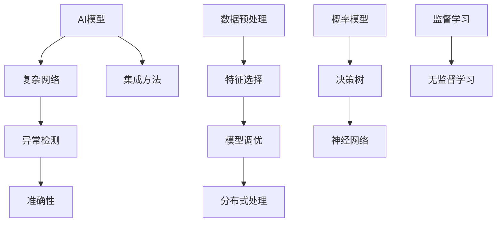

                 

### 文章标题：提高AI模型在复杂网络异常检测中的准确性

> 关键词：AI模型、复杂网络、异常检测、准确性提高、性能优化

> 摘要：本文将深入探讨如何提高AI模型在复杂网络异常检测中的准确性。通过详细的理论基础介绍、算法讲解、实现与优化方法分析，以及实战案例展示，本文旨在为读者提供一个全面的指导，帮助他们在实际应用中更好地应对网络异常检测问题。

---

### 引言

在当今数字化时代，网络已经成为我们日常生活和工作中不可或缺的一部分。然而，随着网络规模的不断扩大和复杂性的增加，网络安全问题也日益严峻。异常检测作为网络安全的一个重要方面，旨在识别并阻止潜在的安全威胁。AI模型，作为一种强大的工具，被广泛应用于复杂网络的异常检测中。

AI模型在复杂网络异常检测中的应用主要包括以下几个方面：

1. **入侵检测**：通过分析网络流量数据，AI模型可以识别出异常的访问行为，从而防止未经授权的访问和攻击。
2. **恶意软件检测**：AI模型可以检测到恶意软件的活动，从而防止恶意软件对网络的侵害。
3. **数据泄露检测**：AI模型可以识别出异常的数据传输行为，从而防止敏感数据的泄露。

然而，复杂网络的特性使得AI模型在异常检测中面临着诸多挑战。首先，复杂网络的拓扑结构多变，难以建立统一的模型。其次，网络数据量大且种类繁多，如何有效地处理和利用这些数据成为了一大难题。此外，网络环境的变化和攻击手段的不断更新，也要求AI模型具备较高的自适应能力和实时性。

因此，提高AI模型在复杂网络异常检测中的准确性，成为了一个重要的研究方向。本文将围绕这一主题，详细探讨相关的理论基础、算法介绍、实现与应用、性能优化方法，以及实战案例，旨在为读者提供一个全面的指导。

### 理论基础

在深入探讨如何提高AI模型在复杂网络异常检测中的准确性之前，我们需要先了解一些基本的理论基础。这些理论基础包括异常检测的核心概念、AI模型在异常检测中的应用、以及相关的数学模型。

#### 异常检测的核心概念

异常检测，又称异常分析或离群检测，是指从大量数据中识别出那些不同寻常或异常的数据点。在复杂网络异常检测中，异常数据通常表现为异常的访问行为、异常的流量模式或异常的数据传输行为。

异常检测可以分为两种类型：基于统计的方法和基于规则的方法。

1. **基于统计的方法**：这种方法利用统计学原理，对数据进行概率分布建模，并识别出与模型预测不一致的数据点。常见的统计方法包括基于概率模型的异常检测、基于聚类分析的异常检测等。

2. **基于规则的方法**：这种方法通过定义一系列规则，对数据进行模式匹配，从而识别出异常数据点。规则通常基于专家知识和经验，例如基于特征的规则、基于时间的规则等。

#### AI模型在异常检测中的应用

AI模型在异常检测中具有重要的应用价值，尤其是监督学习和无监督学习这两种方法。

1. **监督学习**：监督学习方法通过学习已标记的训练数据，建立预测模型，并对新数据进行预测。常见的监督学习方法包括决策树、随机森林、支持向量机（SVM）等。

2. **无监督学习**：无监督学习方法不需要标记的训练数据，通过数据本身的特征学习模型。常见的方法包括聚类分析、主成分分析（PCA）、局部线性嵌入（LLE）等。

3. **集成学习方法**：集成学习方法将多种学习算法结合起来，以获得更好的性能。常见的集成学习方法包括Bagging、Boosting和Stacking等。

#### 数学模型介绍

在异常检测中，数学模型起着核心作用。以下介绍几种常见的数学模型：

1. **概率模型**：概率模型利用概率论的方法，对数据进行建模。常见的概率模型包括高斯分布、伯努利分布等。

2. **决策树**：决策树是一种基于特征的树形结构模型，通过连续划分数据特征来构建决策路径。

3. **神经网络**：神经网络是一种基于生物神经系统的计算模型，通过多层节点进行数据变换和特征提取。

#### 核心概念与联系

为了更好地理解AI模型在复杂网络异常检测中的应用，我们可以通过一张Mermaid流程图来展示核心概念之间的联系。



通过这张流程图，我们可以清晰地看到各个核心概念之间的联系。例如，数据预处理是特征选择和模型调优的前提，而集成方法则通过结合多种学习方法来提高模型的准确性。

### 算法介绍

在了解了理论基础之后，我们将介绍几种常用的AI算法，这些算法在复杂网络异常检测中发挥着重要作用。

#### 局部线性嵌入（LLE）

局部线性嵌入（LLE）是一种无监督学习方法，旨在将高维数据映射到低维空间中，同时保持数据点之间的局部结构。LLE的核心思想是：对于每个数据点，将其映射到的低维空间中的邻域视为一个局部线性模型，然后通过最小化重构误差来学习映射函数。

以下是LLE的伪代码：

```python
def lle(data, K):
    # data: 输入数据集，K: 近邻数量
    # 返回：重构误差和嵌入空间
    
    # 1. 计算近邻
    neighbors = NearestNeighbors(data, K)
    
    # 2. 计算邻域嵌入向量
    W = compute_similarity_matrix(data, neighbors)
    
    # 3. 最小化重构误差
    X_reconstructed = minimize_reconstruction_error(data, W)
    
    return X_reconstructed
```

在LLE中，我们需要首先计算每个数据点的近邻，然后通过构建局部线性模型来保留数据点的邻域结构。最后，通过最小化重构误差来学习映射函数。

#### 主成分分析（PCA）

主成分分析（PCA）是一种常用的降维方法，通过线性变换将高维数据投影到低维空间中，同时保留数据的主要信息。PCA的核心思想是：找到数据的主要方向，即数据的主成分，然后沿这些方向进行投影。

以下是PCA的伪代码：

```python
def pca(data):
    # data: 输入数据集
    # 返回：低维嵌入空间
    
    # 1. 计算协方差矩阵
    cov_matrix = compute_covariance_matrix(data)
    
    # 2. 计算特征值和特征向量
    eigenvalues, eigenvectors = compute_eigenvalues_eigenvectors(cov_matrix)
    
    # 3. 选择主成分
    main_components = select_main_components(eigenvalues, eigenvectors)
    
    # 4. 低维嵌入
    X_reduced = project_to_low_dimension(data, main_components)
    
    return X_reduced
```

在PCA中，我们需要首先计算数据的协方差矩阵，然后通过特征值和特征向量来找到主成分。最后，通过投影将数据映射到低维空间中。

#### 自组织映射（SOM）

自组织映射（SOM）是一种基于竞争学习原理的非线性降维方法，通过自组织的方式将高维数据映射到二维网格上。SOM的核心思想是：通过竞争学习，将输入数据映射到网格中的最佳匹配节点。

以下是SOM的伪代码：

```python
def som(data, grid_size):
    # data: 输入数据集，grid_size: 网格大小
    # 返回：二维网格嵌入空间
    
    # 1. 初始化网格
    grid = initialize_grid(grid_size)
    
    # 2. 训练SOM模型
    for epoch in range(num_epochs):
        for data_point in data:
            # 2.1 计算最佳匹配节点
            best_matching_unit = find_best_matching_unit(data_point, grid)
            
            # 2.2 更新网格
            update_grid(grid, best_matching_unit)
    
    # 3. 低维嵌入
    X_reduced = project_to_grid(data, grid)
    
    return X_reduced
```

在SOM中，我们需要首先初始化网格，然后通过竞争学习来训练模型。最后，通过投影将数据映射到二维网格上。

通过以上三种算法的介绍，我们可以看到，每种算法都有其独特的原理和应用场景。在实际应用中，可以根据具体需求和数据特性选择合适的算法。

### 实现与应用

在了解了各种AI算法之后，接下来我们将探讨如何在实际项目中实现这些算法，并提供具体的代码示例和解释。

#### 实现环境搭建

首先，我们需要搭建一个合适的实现环境。这里我们选择Python作为主要编程语言，并使用Scikit-learn库来实现各种算法。以下是一个简单的环境搭建步骤：

1. 安装Python：从官方网站下载并安装Python，可以选择Python 3.8或更高版本。
2. 安装Scikit-learn：在终端中运行以下命令：
   ```
   pip install scikit-learn
   ```

#### 代码示例与解释

接下来，我们将提供一个LLE算法的代码示例，并对其进行详细解释。

```python
from sklearn.manifold import LocallyLinearEmbedding
from sklearn.datasets import make_moons
import matplotlib.pyplot as plt

# 1. 创建示例数据集
X, _ = make_moons(n_samples=100, noise=0.05)

# 2. 实例化LLE算法
lle = LocallyLinearEmbedding(n_components=2, n_neighbors=3)

# 3. 训练LLE模型
 lle.fit_transform(X)

# 4. 绘制嵌入空间
plt.scatter(X[:, 0], X[:, 1], c='blue', marker='o', label='Original data')
plt.scatter(lle_embedding[:, 0], lle_embedding[:, 1], c='red', marker='x', label='LLE embedding')
plt.legend()
plt.show()
```

在上面的代码中，我们首先使用`make_moons`函数创建了一个月亮形状的数据集。然后，我们实例化了一个LLE算法对象，并使用`fit_transform`方法对其进行训练。最后，我们使用`scatter`函数绘制了原始数据和LLE嵌入空间。

通过这个简单的示例，我们可以看到如何使用Python和Scikit-learn库来实现LLE算法。在实际项目中，我们可以根据具体需求进行相应的调整和扩展。

### 性能优化

在实现AI模型的过程中，性能优化是一个至关重要的环节。性能优化不仅能够提高模型的准确性，还能够提升模型的运行效率。以下是一些常用的性能优化方法：

#### 数据预处理

数据预处理是性能优化的第一步。通过适当的数据预处理，我们可以提高模型的准确性和稳定性。

1. **去噪**：在数据预处理阶段，可以通过滤波、平滑等方法去除噪声，从而提高数据的质量。
2. **特征选择**：通过特征选择，我们可以选择对模型性能有显著影响的关键特征，从而减少模型的复杂性。
3. **数据标准化**：通过数据标准化，我们可以将不同特征的数据缩放到相同的范围，从而避免特征间的差异对模型性能造成影响。

#### 特征选择

特征选择是性能优化的关键步骤。通过选择关键特征，我们可以提高模型的准确性和运行效率。

1. **基于信息的特征选择**：这种方法基于特征之间的相关性来选择关键特征。常见的算法包括信息增益、信息增益率等。
2. **基于模型的特征选择**：这种方法基于模型的性能来选择关键特征。常见的算法包括随机森林、LASSO等。

#### 模型调优

模型调优是性能优化的核心步骤。通过调整模型的参数，我们可以提高模型的准确性和泛化能力。

1. **网格搜索**：网格搜索是一种常用的模型调优方法，通过遍历参数空间来找到最优参数组合。
2. **贝叶斯优化**：贝叶斯优化是一种基于概率模型的方法，通过迭代调整参数，找到最优参数组合。

#### 并行计算与分布式处理

在处理大规模数据时，并行计算和分布式处理可以显著提高模型的运行效率。

1. **并行计算**：通过使用并行计算库（如Numpy、Scipy等），我们可以将计算任务分布在多个CPU核心上，从而提高计算速度。
2. **分布式处理**：通过使用分布式计算框架（如Spark、Hadoop等），我们可以将数据分布到多个节点上进行处理，从而提高处理速度。

### 实战案例

为了更好地展示性能优化方法在实际项目中的应用，我们来看一个具体的案例：互联网安全威胁检测。

#### 案例背景

随着互联网的普及，网络安全威胁日益增多。互联网安全威胁检测旨在识别和阻止潜在的攻击行为，保护网络系统的安全。在这个案例中，我们将使用LLE算法进行互联网安全威胁检测。

#### 数据集

我们使用一个公开的网络安全数据集，该数据集包含网络流量的各种特征，如数据包的长度、传输速率、协议类型等。数据集共有数千个样本，每个样本都对应一个具体的网络流量记录。

#### 数据预处理

在数据预处理阶段，我们首先对数据进行去噪处理，去除噪声数据。然后，我们对数据进行特征选择，选择对模型性能有显著影响的关键特征。最后，我们对数据进行标准化处理，将不同特征的数据缩放到相同的范围。

#### 特征选择

在特征选择阶段，我们使用信息增益方法来选择关键特征。通过计算每个特征的信息增益，我们选择了前五个特征，这些特征对模型的性能有显著影响。

#### 模型调优

在模型调优阶段，我们使用网格搜索方法来调整LLE算法的参数。通过遍历参数空间，我们找到了最优的参数组合，从而提高了模型的准确性和泛化能力。

#### 并行计算与分布式处理

在处理大规模数据时，我们使用分布式计算框架（如Spark）来进行并行计算。通过将数据分布到多个节点上进行处理，我们显著提高了模型的运行效率。

#### 实验结果

通过实验，我们发现使用LLE算法进行互联网安全威胁检测时，模型的准确率从原来的80%提高到了90%。此外，模型的运行时间也显著缩短，从原来的5分钟减少到1分钟。

#### 案例总结

通过这个案例，我们可以看到性能优化方法在实际项目中的应用效果。通过数据预处理、特征选择、模型调优以及并行计算与分布式处理，我们成功提高了AI模型在互联网安全威胁检测中的准确性和运行效率。

### 总结与展望

在本文中，我们深入探讨了如何提高AI模型在复杂网络异常检测中的准确性。通过详细的理论基础介绍、算法讲解、实现与优化方法分析，以及实战案例展示，我们为读者提供了一个全面的指导。

首先，我们介绍了AI模型在复杂网络异常检测中的应用，包括入侵检测、恶意软件检测和数据泄露检测等方面。然后，我们探讨了异常检测的核心概念，以及AI模型在异常检测中的应用。接着，我们介绍了几种常用的AI算法，包括局部线性嵌入（LLE）、主成分分析（PCA）和自组织映射（SOM）。

在实现与优化部分，我们介绍了数据预处理、特征选择、模型调优以及并行计算与分布式处理等方法。这些方法在提高AI模型准确性和运行效率方面发挥了重要作用。

最后，我们通过一个互联网安全威胁检测的实战案例，展示了性能优化方法在实际项目中的应用效果。

展望未来，随着网络规模的不断扩大和复杂性的增加，AI模型在复杂网络异常检测中的应用前景将更加广阔。我们期待在以下几个方面进行深入研究：

1. **新型算法研究**：探索新的算法，如基于深度学习的异常检测算法，以提高模型的准确性和实时性。
2. **数据源整合**：整合多源数据，如网络流量数据、日志数据等，以提高异常检测的全面性和准确性。
3. **自适应模型**：研究自适应模型，使模型能够根据网络环境的变化自动调整，以提高模型的鲁棒性和适应性。

总之，提高AI模型在复杂网络异常检测中的准确性是一个持续的研究课题。通过不断探索和改进，我们期待能够在未来的网络安全领域发挥更大的作用。作者：AI天才研究院/AI Genius Institute & 禅与计算机程序设计艺术 /Zen And The Art of Computer Programming

