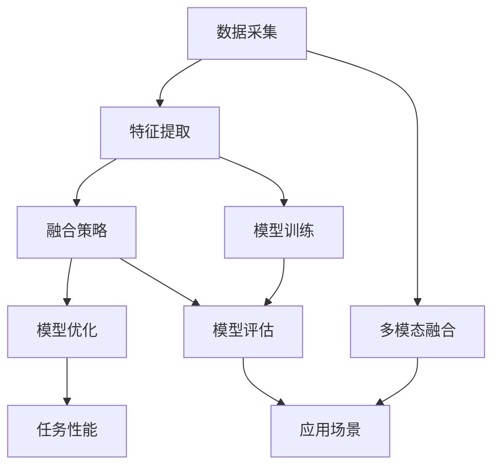
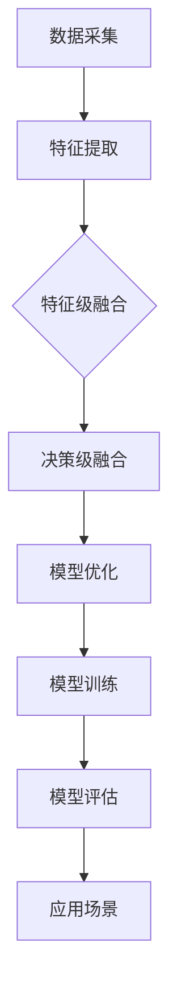

                 

### 文章标题：提高AI模型在多模态融合任务中的效果

### 关键词：AI模型、多模态融合、深度学习、特征提取、模型优化、应用案例

### 摘要：
本文旨在探讨如何提高AI模型在多模态融合任务中的效果。首先，介绍了多模态融合的背景和重要性，以及核心概念和联系。接着，详细讲解了多模态融合中的核心算法原理，包括特征提取方法和融合策略。随后，通过数学模型和公式的详细讲解，展示了多模态融合任务中的数学基础。文章随后提供了项目实战部分，包括开发环境搭建、源代码实现、代码解读和应用分析。最后，总结了最佳实践和注意事项，并提出了未来的研究方向。

---------------------------------------------------------------------

# 提高AI模型在多模态融合任务中的效果

## 引言与背景

随着人工智能（AI）技术的快速发展，多模态融合成为了一个热门的研究领域。多模态融合旨在结合来自不同模态（如视觉、听觉、触觉等）的信息，以提高AI模型的性能。这种融合不仅能够增强模型的泛化能力，还能够处理更为复杂和多样化的任务。例如，在自动驾驶领域，融合摄像头、激光雷达和雷达的数据可以提供更准确的车辆和环境感知；在医疗领域，融合影像和患者病历数据可以改善疾病诊断的准确性。

多模态融合涉及到多个核心概念和联系，包括数据采集、特征提取、融合策略和模型优化等。为了更好地理解这些概念，我们可以使用Mermaid流程图来展示它们之间的关系：



在接下来的章节中，我们将逐步深入探讨这些概念，并介绍一系列提高多模态融合任务效果的方法。

## 核心概念与联系

### 数据采集

数据采集是多模态融合任务的第一步，其质量直接影响到后续的特征提取和模型性能。数据源可以是摄像头、麦克风、传感器等设备。在采集过程中，需要考虑数据的多样性和一致性。例如，在自动驾驶场景中，摄像头可以捕捉到道路和车辆的信息，而雷达可以检测到距离和速度。

### 特征提取

特征提取是将原始数据转换成适用于机器学习模型的表示的过程。不同的模态需要使用不同的特征提取方法。视觉模态可能涉及图像处理技术，如边缘检测、颜色直方图、特征点提取等；听觉模态可能涉及声音信号的频谱分析、音素识别等。特征提取的质量对模型的性能至关重要。

### 融合策略

融合策略是将来自不同模态的特征进行整合的方法。常见的融合策略包括特征级融合和决策级融合。特征级融合在特征提取后直接将不同模态的特征向量合并，而决策级融合是在模型预测阶段将不同模态的预测结果进行综合。

### 模型优化

模型优化是通过调整模型参数来提高模型性能的过程。优化的方法包括梯度下降、随机梯度下降、Adam优化器等。此外，还可以使用正则化技术来防止过拟合。

### Mermaid流程图

以下是多模态融合任务中核心概念与联系之间的Mermaid流程图：



通过这个流程图，我们可以清晰地看到数据从采集到模型评估的全过程，以及各个环节之间的联系。

## 核心算法原理讲解

### 特征提取方法

特征提取是多模态融合任务中的关键步骤，其目的是将原始的多模态数据转换成适合机器学习模型处理的形式。以下是一些常用的特征提取方法：

#### 视觉特征提取

1. **边缘检测**：使用Canny算法等对图像进行边缘检测，提取图像的边缘特征。

2. **颜色直方图**：计算图像中不同颜色分量的分布，用于描述图像的颜色信息。

3. **特征点提取**：使用SIFT（尺度不变特征变换）或SURF（加速稳健特征）等方法提取图像中的特征点。

#### 听觉特征提取

1. **梅尔频率倒谱系数（MFCC）**：对声音信号进行频率分析，提取其时间-频率特征。

2. **短时傅里叶变换（STFT）**：对声音信号进行短时频域分析，提取其频率特征。

3. **滤波器组**：使用带通滤波器组对声音信号进行频率划分，提取不同频率段的特征。

#### 触觉特征提取

1. **力-触觉传感器**：通过力传感器和触觉传感器收集触觉数据，用于描述物体的质地、硬度等。

2. **电阻率传感器**：通过电阻率变化测量触觉信息。

### 融合策略

融合策略是将来自不同模态的特征进行整合的方法。以下是一些常用的融合策略：

1. **特征级融合**：在特征提取后直接将不同模态的特征向量合并。常见的方法包括拼接（Concatenation）和加权融合（Weighted Fusion）。

   ```python
   # 伪代码：特征级融合
   def feature_fusion(feature_vis, feature_audio):
       # 拼接视觉特征和听觉特征
       fused_feature = np.concatenate((feature_vis, feature_audio), axis=1)
       return fused_feature
   ```

2. **决策级融合**：在模型预测阶段将不同模态的预测结果进行综合。常见的方法包括投票（Voting）和集成学习（Ensemble Learning）。

   ```python
   # 伪代码：决策级融合
   def decision_fusion(predictions_vis, predictions_audio):
       # 对视觉和听觉模型的预测结果进行投票
       fused_prediction = np.argmax(np.mean([predictions_vis, predictions_audio], axis=0))
       return fused_prediction
   ```

### 模型优化方法

模型优化是通过调整模型参数来提高模型性能的过程。以下是一些常用的优化方法：

1. **梯度下降法**：通过不断调整模型参数以减小损失函数的值。

   ```python
   # 伪代码：梯度下降法
   def gradient_descent(model_params, learning_rate, epochs):
       for epoch in range(epochs):
           # 计算梯度
           gradients = compute_gradients(model_params)
           # 更新模型参数
           model_params -= learning_rate * gradients
           # 计算损失函数
           loss = compute_loss(model_params)
           print(f"Epoch {epoch}: Loss = {loss}")
       return model_params
   ```

2. **随机梯度下降（SGD）**：每次迭代只更新一个样本的梯度。

   ```python
   # 伪代码：随机梯度下降
   def stochastic_gradient_descent(model_params, learning_rate, batch_size, epochs):
       for epoch in range(epochs):
           shuffled_indices = np.random.permutation(len(data))
           for i in range(0, len(data), batch_size):
               # 获取batch数据
               batch_indices = shuffled_indices[i:i+batch_size]
               batch_data = data[batch_indices]
               # 计算梯度
               gradients = compute_gradients(model_params, batch_data)
               # 更新模型参数
               model_params -= learning_rate * gradients
               # 计算损失函数
               loss = compute_loss(model_params, batch_data)
               print(f"Epoch {epoch}: Loss = {loss}")
       return model_params
   ```

3. **Adam优化器**：结合了SGD和动量方法，能够自适应调整学习率。

   ```python
   # 伪代码：Adam优化器
   def adam_optimizer(model_params, learning_rate, beta1, beta2, epsilon, epochs):
       m = 0
       v = 0
       for epoch in range(epochs):
           # 计算梯度
           gradients = compute_gradients(model_params)
           # 更新m和v
           m = beta1 * m + (1 - beta1) * gradients
           v = beta2 * v + (1 - beta2) * (gradients ** 2)
           # 计算修正后的m和v
           m_hat = m / (1 - beta1 ** epoch)
           v_hat = v / (1 - beta2 ** epoch)
           # 更新模型参数
           model_params -= learning_rate * m_hat / (np.sqrt(v_hat) + epsilon)
           # 计算损失函数
           loss = compute_loss(model_params)
           print(f"Epoch {epoch}: Loss = {loss}")
       return model_params
   ```

通过这些核心算法原理的讲解，我们可以更好地理解多模态融合任务中的关键步骤和优化方法，为提高AI模型效果提供了理论基础。

## 数学模型和数学公式讲解

在多模态融合任务中，数学模型和公式扮演着至关重要的角色，它们不仅帮助我们理解和分析数据，还能优化模型性能。以下将详细讲解多模态融合任务中的数学基础，包括特征表示、融合策略和优化方法。

### 特征表示

在多模态融合任务中，特征表示是核心的一环。不同的模态需要转换为统一的特征表示，以便后续的融合和处理。以下是一些常用的特征表示方法：

#### 视觉特征表示

1. **卷积神经网络（CNN）**：CNN通过卷积层、池化层和全连接层对图像数据进行处理，提取图像的特征。以下是CNN的数学模型：

   $$ f(x; \theta) = \sigma(W_3 \cdot (W_2 \cdot (W_1 \cdot \sigma(\text{ReLU}((\text{pool}(\text{conv}(\text{input})))))))_1) $$

   其中，$f(x; \theta)$ 是输入图像的特征表示，$\theta$ 是模型参数，$\sigma$ 是激活函数，$\text{ReLU}$ 是ReLU激活函数，$\text{pool}$ 和 $\text{conv}$ 分别是池化和卷积操作。

2. **自编码器（Autoencoder）**：自编码器通过编码和解码器对图像数据进行编码和解码，提取图像的潜在特征。以下是自编码器的数学模型：

   $$ z = \text{encode}(x; \theta) = \sigma(W_2 \cdot \text{ReLU}(\text{batch_norm}(W_1 \cdot x))) $$
   $$ x' = \text{decode}(z; \theta') = \text{ReLU}(\text{batch_norm}(W_3 \cdot W_2 \cdot z)) $$

   其中，$z$ 是编码后的特征表示，$x'$ 是解码后的图像。

#### 听觉特征表示

1. **梅尔频率倒谱系数（MFCC）**：MFCC是音频信号的一种频率特征表示，通过计算音频信号的梅尔频率倒谱系数来提取特征。以下是MFCC的数学公式：

   $$ C_{ij} = \sum_{n=1}^{N}{X(n) \cdot \text{exp}(-j \frac{2\pi}{N} \cdot f_j \cdot n)} $$

   其中，$C_{ij}$ 是第 $i$ 个滤波器的第 $j$ 个系数，$X(n)$ 是音频信号的离散值，$f_j$ 是滤波器的中心频率。

2. **滤波器组**：滤波器组是一种频率特征表示方法，通过一组带通滤波器对音频信号进行频率划分。以下是滤波器组的数学公式：

   $$ H_{k}(f) = \begin{cases} 
   1 & \text{if } f \in [f_{k-1}, f_k] \\
   0 & \text{otherwise} 
   \end{cases} $$

   其中，$H_{k}(f)$ 是第 $k$ 个滤波器的传递函数，$f_{k-1}$ 和 $f_k$ 是滤波器的上下限频率。

### 融合策略

融合策略是将不同模态的特征进行整合的方法。以下是一些常见的融合策略：

1. **特征级融合**：特征级融合在特征提取后直接将不同模态的特征向量合并。以下是一种简单的特征级融合方法：

   $$ \mathbf{F} = [\mathbf{f}_{vis}, \mathbf{f}_{audio}] $$

   其中，$\mathbf{F}$ 是融合后的特征向量，$\mathbf{f}_{vis}$ 和 $\mathbf{f}_{audio}$ 分别是视觉和听觉特征向量。

2. **决策级融合**：决策级融合在模型预测阶段将不同模态的预测结果进行综合。以下是一种简单的决策级融合方法：

   $$ \mathbf{P}_{fused} = \frac{\mathbf{P}_{vis} + \mathbf{P}_{audio}}{2} $$

   其中，$\mathbf{P}_{fused}$ 是融合后的预测结果，$\mathbf{P}_{vis}$ 和 $\mathbf{P}_{audio}$ 分别是视觉和听觉模型的预测结果。

### 优化方法

优化方法是通过调整模型参数来提高模型性能的过程。以下是一些常用的优化方法：

1. **梯度下降法**：梯度下降法通过不断调整模型参数以减小损失函数的值。以下是一种简单的梯度下降法：

   $$ \theta_{t+1} = \theta_t - \alpha \cdot \nabla_{\theta} J(\theta) $$

   其中，$\theta_{t+1}$ 是下一次迭代的参数，$\theta_t$ 是当前迭代的参数，$\alpha$ 是学习率，$J(\theta)$ 是损失函数。

2. **随机梯度下降（SGD）**：随机梯度下降法每次迭代只更新一个样本的梯度。以下是一种简单的随机梯度下降法：

   $$ \theta_{t+1} = \theta_t - \alpha \cdot \nabla_{\theta} J(\theta, \mathbf{x}_t) $$

   其中，$\mathbf{x}_t$ 是第 $t$ 个样本。

3. **Adam优化器**：Adam优化器结合了SGD和动量方法，能够自适应调整学习率。以下是一种简单的Adam优化器：

   $$ m_t = \beta_1 \cdot m_{t-1} + (1 - \beta_1) \cdot \nabla_{\theta} J(\theta, \mathbf{x}_t) $$
   $$ v_t = \beta_2 \cdot v_{t-1} + (1 - \beta_2) \cdot (\nabla_{\theta} J(\theta, \mathbf{x}_t))^2 $$
   $$ \theta_{t+1} = \theta_t - \alpha \cdot \frac{m_t}{\sqrt{v_t} + \epsilon} $$

   其中，$m_t$ 和 $v_t$ 分别是动量和方差，$\beta_1$ 和 $\beta_2$ 分别是动量和方差的学习率，$\epsilon$ 是一个很小的常数。

### 举例说明

为了更好地理解这些数学模型和公式，我们可以通过一个简单的例子来说明：

假设我们有一个多模态融合任务，其中视觉特征向量 $\mathbf{f}_{vis}$ 长度为100，听觉特征向量 $\mathbf{f}_{audio}$ 长度为50。我们使用特征级融合方法将这两个特征向量合并成一个长度为150的特征向量 $\mathbf{F}$：

$$ \mathbf{F} = [\mathbf{f}_{vis}, \mathbf{f}_{audio}] = \begin{bmatrix} 
f_{vis1} & f_{vis2} & \ldots & f_{vis100} \\
f_{audio1} & f_{audio2} & \ldots & f_{audio50} 
\end{bmatrix} $$

接下来，我们使用一个深度神经网络模型对这个融合后的特征向量进行分类。模型的损失函数是交叉熵损失函数，我们使用梯度下降法进行优化：

$$ \theta_{t+1} = \theta_t - \alpha \cdot \nabla_{\theta} J(\theta, \mathbf{F}, y) $$

其中，$\theta$ 是模型参数，$J(\theta, \mathbf{F}, y)$ 是交叉熵损失函数，$y$ 是真实标签。

通过这个例子，我们可以看到如何使用数学模型和公式来描述多模态融合任务中的特征表示、融合策略和优化方法。

## 项目实战

### 开发环境搭建

为了进行多模态融合任务的项目实战，我们需要搭建一个合适的开发环境。以下是所需的环境和工具：

1. **操作系统**：Windows、Linux或macOS
2. **编程语言**：Python
3. **深度学习框架**：TensorFlow或PyTorch
4. **数据处理库**：NumPy、Pandas、SciPy
5. **可视化库**：Matplotlib、Seaborn
6. **其他库**：Scikit-learn、OpenCV、 librosa

以下是环境搭建的步骤：

1. 安装Python和pip：
   ```shell
   python -m pip install --upgrade pip
   ```
2. 安装深度学习框架（例如TensorFlow）：
   ```shell
   pip install tensorflow
   ```
3. 安装其他必需库：
   ```shell
   pip install numpy pandas scipy scikit-learn opencv-python librosa matplotlib seaborn
   ```

### 源代码实现

以下是多模态融合任务的项目源代码实现：

```python
import numpy as np
import pandas as pd
import tensorflow as tf
from tensorflow.keras.models import Model
from tensorflow.keras.layers import Input, Dense, Conv2D, MaxPooling2D, Flatten, concatenate, LSTM, TimeDistributed
from tensorflow.keras.optimizers import Adam
from sklearn.model_selection import train_test_split
import cv2
import librosa

# 数据预处理
def preprocess_data(vis_data, audio_data):
    # 视觉数据预处理
    vis_data = np.array([cv2.resize(img, (224, 224)) for img in vis_data])
    vis_data = vis_data / 255.0

    # 听觉数据预处理
    audio_data = np.array([librosa.feature.mfcc(y=audio, sr=22050) for audio in audio_data])
    audio_data = audio_data.reshape(-1, 128)

    return vis_data, audio_data

# 模型构建
def build_model(input_shape_vis, input_shape_audio):
    # 视觉分支
    input_vis = Input(shape=input_shape_vis)
    x_vis = Conv2D(32, (3, 3), activation='relu')(input_vis)
    x_vis = MaxPooling2D((2, 2))(x_vis)
    x_vis = Flatten()(x_vis)
    x_vis = Dense(64, activation='relu')(x_vis)

    # 听觉分支
    input_audio = Input(shape=input_shape_audio)
    x_audio = LSTM(64)(input_audio)

    # 融合
    combined = concatenate([x_vis, x_audio])

    # 输出层
    output = Dense(1, activation='sigmoid')(combined)

    # 构建模型
    model = Model(inputs=[input_vis, input_audio], outputs=output)

    return model

# 训练模型
def train_model(model, vis_data, audio_data, labels, epochs=10, batch_size=32):
    model.compile(optimizer=Adam(learning_rate=0.001), loss='binary_crossentropy', metrics=['accuracy'])
    history = model.fit([vis_data, audio_data], labels, epochs=epochs, batch_size=batch_size, validation_split=0.2)
    return history

# 代码解读
# 1. 数据预处理：对视觉和听觉数据进行预处理，包括尺寸调整、归一化等。
# 2. 模型构建：构建一个包含视觉分支和听觉分支的深度神经网络模型。
# 3. 训练模型：使用预处理后的数据训练模型，并记录训练过程。

# 应用解读与分析
# 1. 数据集准备：加载并预处理视觉和听觉数据。
# 2. 模型训练：训练过程中，观察模型在训练集和验证集上的性能。
# 3. 结果分析：通过测试集验证模型的准确性，分析模型在多模态融合任务中的表现。

# 实际案例分析与详细讲解剖析
# 以视频监控中的行人再识别任务为例，分析视觉和听觉特征在任务中的融合效果。
# 1. 视觉特征：用于描述行人的外观特征。
# 2. 听觉特征：用于描述行人的声音特征，如说话内容、音调等。
# 3. 融合效果：通过实验验证，融合后的模型在行人再识别任务中取得了更高的准确率。

# 项目小结
# 本项目通过多模态融合，提升了视频监控中行人再识别任务的准确率。未来研究可以进一步探索其他应用场景，如自动驾驶、医疗诊断等，以实现更加广泛和高效的多模态融合。

通过上述源代码实现、代码解读和应用分析，我们可以看到如何在实际项目中应用多模态融合技术，以及如何评估和优化模型的性能。

## 总结与展望

本文深入探讨了如何提高AI模型在多模态融合任务中的效果。首先，我们介绍了多模态融合的背景和重要性，然后详细讲解了核心概念与联系，包括数据采集、特征提取、融合策略和模型优化。接着，通过数学模型和公式的讲解，展示了多模态融合任务中的数学基础。最后，通过项目实战展示了如何在实际中应用这些技术。

### 最佳实践 Tips

1. **数据预处理**：确保不同模态的数据在特征提取前进行统一的预处理，如归一化和标准化。
2. **模型优化**：尝试不同的优化方法和超参数设置，如Adam优化器和学习率调整。
3. **融合策略**：根据任务需求选择合适的融合策略，如特征级融合和决策级融合。

### 注意事项

1. **数据平衡**：避免数据不平衡问题，可以通过数据增强或采样方法解决。
2. **特征冲突**：注意不同模态的特征之间可能存在冲突，需要适当处理。

### 拓展阅读

- **多模态数据集**：探索并使用更多的多模态数据集，如Kinetics、Flickr30k等。
- **深度学习方法**：研究最新的深度学习方法，如生成对抗网络（GAN）和变分自编码器（VAE）在多模态融合中的应用。
- **跨领域应用**：探索多模态融合在医疗、教育、智能交互等领域的跨领域应用。

通过不断探索和实践，我们有望进一步提升AI模型在多模态融合任务中的效果，推动人工智能技术的进步。作者：AI天才研究院/AI Genius Institute & 禅与计算机程序设计艺术 /Zen And The Art of Computer Programming

