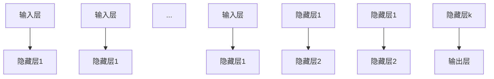
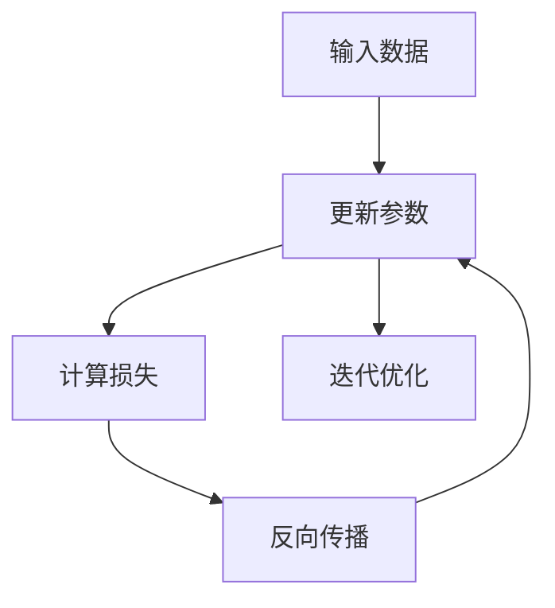

                 


### 《提高AI模型在社交网络舆情演化预测中的效果》

#### 关键词：
AI模型，舆情预测，社交网络，演化预测，优化策略

#### 摘要：
本文旨在探讨如何提高人工智能（AI）模型在社交网络舆情演化预测中的效果。首先，我们将介绍AI模型在舆情预测中的意义和挑战，以及社交网络舆情的特征和演化预测的基本方法。接着，我们将深入探讨AI模型的基本原理，包括神经网络、深度学习和支持向量机等，并解析相关数学模型和公式。在算法实现与优化部分，我们将介绍舆情演化预测的算法实现流程，包括数据预处理、特征提取和模型选择与训练，同时讨论过拟合与欠拟合的优化策略。最后，我们将通过实际案例，展示社交网络舆情预测系统的开发过程，并提出一些最佳实践和未来发展趋势。希望本文能为相关领域的研究者和从业者提供有价值的参考和启示。

## 第一部分：基础理论

### 第1章：AI模型在舆情预测中的应用

#### 1.1 AI模型在舆情预测中的意义和挑战

舆情预测是指通过分析海量数据，预测某一事件或话题在社交网络中的发展趋势和公众态度。随着互联网和社交媒体的快速发展，舆情预测在社会管理、市场营销和危机应对等领域发挥着重要作用。AI模型在舆情预测中具有重要意义，主要体现在以下几个方面：

1. **自动化分析**：AI模型可以自动处理大量文本数据，快速提取关键信息，提高舆情预测的效率。
2. **个性化推荐**：AI模型可以根据用户的兴趣和行为，推荐相关舆情信息，满足个性化需求。
3. **预测准确性**：AI模型通过学习大量历史数据，可以提高舆情预测的准确性，减少人工预测的主观性。
4. **实时监测**：AI模型可以实时监测社交网络中的舆情变化，及时发现潜在风险和热点话题。

然而，AI模型在舆情预测中也面临一些挑战：

1. **数据质量**：社交网络数据来源广泛，数据质量参差不齐，可能包含噪声和虚假信息，影响预测准确性。
2. **实时性**：舆情演化速度较快，要求AI模型具有实时监测和预测能力，但实时数据处理和模型更新较为复杂。
3. **模型泛化能力**：AI模型可能对某些特定领域或事件表现出较好的预测能力，但泛化到其他领域时可能表现不佳。
4. **隐私保护**：舆情预测涉及用户隐私数据，如何保护用户隐私是AI模型在舆情预测中需要解决的重要问题。

#### 1.2 社交网络舆情的特征

社交网络舆情具有以下特征：

1. **多样性**：社交网络舆情涉及政治、经济、文化、娱乐等多个领域，形式多样，如文字、图片、视频等。
2. **实时性**：社交网络舆情演化速度较快，信息传播迅速，要求舆情预测模型具备实时处理能力。
3. **动态性**：舆情随着事件发展和公众态度变化而变化，具有动态性特征，需要模型能够适应舆情演化。
4. **复杂性**：社交网络舆情包含大量噪声和虚假信息，信息之间的关系复杂，对模型提出了较高的要求。

#### 1.3 舆情演化预测的基本方法

舆情演化预测的基本方法包括以下几种：

1. **基于规则的方法**：通过定义一系列规则，对舆情演化进行预测。这种方法简单直观，但预测准确性较低。
2. **基于统计的方法**：利用统计学方法，对舆情数据进行分析和预测。这种方法适用于大规模数据，但可能忽略数据之间的复杂关系。
3. **基于机器学习的方法**：通过机器学习算法，从历史数据中学习舆情演化的规律，提高预测准确性。这种方法具有较好的预测效果，但需要大量训练数据和计算资源。
4. **基于深度学习的方法**：利用深度学习模型，从大规模数据中自动学习舆情演化的特征和模式，具有很高的预测准确性。这种方法适用于处理复杂舆情数据，但计算资源需求较高。

## 第二部分：AI模型的基本原理

### 第2章：AI模型的基本原理

#### 2.1 神经网络

神经网络（Neural Networks）是一种模拟生物神经网络信息处理的计算模型，是AI模型的基础。神经网络由多个神经元（节点）组成，通过层次结构进行信息传递和处理。

##### 2.1.1 神经网络的基本结构

神经网络的基本结构包括输入层、隐藏层和输出层。输入层接收外部输入信息，隐藏层对输入信息进行处理和变换，输出层产生预测结果。每层由多个神经元组成，神经元之间通过权重进行连接。

神经网络的基本结构如图1所示：



##### 2.1.2 神经网络的学习过程

神经网络的学习过程包括以下步骤：

1. **初始化权重和偏置**：随机初始化神经网络中的权重和偏置。
2. **前向传播**：输入数据通过神经网络的前向传播，在各个层次之间传递，最终产生输出。
3. **计算损失函数**：计算输出结果与实际结果之间的差距，得到损失值。
4. **反向传播**：利用梯度下降算法，将损失值反向传播到网络中的各个层次，更新权重和偏置。
5. **迭代优化**：重复上述步骤，不断迭代优化网络参数，直至达到预设的损失阈值或迭代次数。

神经网络的学习过程如图2所示：



#### 2.2 深度学习

深度学习（Deep Learning）是神经网络的一种发展，通过多层神经网络自动学习数据中的特征和模式，具有很高的预测准确性。

##### 2.2.1 深度学习的基本概念

深度学习的基本概念包括：

1. **深度神经网络**：具有多个隐藏层的神经网络，能够提取更高级别的特征。
2. **激活函数**：用于引入非线性特性的函数，如ReLU、Sigmoid和Tanh等。
3. **反向传播算法**：通过梯度下降算法，利用损失函数的梯度来更新网络参数。
4. **优化算法**：用于优化网络参数的算法，如随机梯度下降、Adam和RMSprop等。

##### 2.2.2 常见的深度学习架构

常见的深度学习架构包括：

1. **卷积神经网络（CNN）**：用于处理图像数据，通过卷积操作提取图像特征。
2. **循环神经网络（RNN）**：用于处理序列数据，通过循环结构保持长期依赖关系。
3. **长短时记忆网络（LSTM）**：RNN的一种改进，能够解决长期依赖问题。
4. **生成对抗网络（GAN）**：通过生成器和判别器之间的对抗训练，实现数据的生成。

#### 2.3 支持向量机

支持向量机（Support Vector Machine，SVM）是一种经典的机器学习算法，通过最大化分类边界，提高分类准确性。

##### 2.3.1 支持向量机的原理

支持向量机的原理如下：

1. **线性可分支持向量机**：寻找一个超平面，使得样本点在超平面的两侧，且距离超平面的最远点为支持向量。
2. **非线性支持向量机**：通过核函数将低维数据映射到高维空间，实现非线性分类。

##### 2.3.2 支持向量机的实现方法

支持向量机的实现方法包括：

1. **硬间隔分类**：在训练集中寻找一个最优的超平面，使得样本点到超平面的距离最大。
2. **软间隔分类**：在训练集中允许一些样本点分布在分类边界上，通过引入松弛变量和惩罚项，优化分类效果。

## 第三部分：数学模型与公式解析

### 第3章：数学模型与公式解析

#### 3.1 机器学习的数学基础

机器学习的数学基础包括线性代数、概率论和最优化理论等。以下简要介绍这些数学基础：

1. **线性代数**：矩阵运算、向量空间、特征值和特征向量等概念是机器学习的重要工具。
2. **概率论**：概率分布、条件概率、贝叶斯定理等是机器学习建模和分析的基础。
3. **最优化理论**：梯度下降、牛顿法、拉格朗日乘数法等是最优化问题求解的基本方法。

#### 3.2 舆情演化预测的数学模型

舆情演化预测的数学模型可以分为线性模型和非线性模型。

##### 3.2.1 线性模型

线性模型是指舆情演化预测过程中，预测结果与输入特征之间存在线性关系。常用的线性模型包括线性回归和逻辑回归。

1. **线性回归**：预测结果 \(y\) 与输入特征 \(x\) 之间存在线性关系，即 \(y = \beta_0 + \beta_1 x\)。
2. **逻辑回归**：用于处理二分类问题，预测结果为概率值，即 \(P(y=1) = \frac{1}{1 + e^{-(\beta_0 + \beta_1 x)}}\)。

##### 3.2.2 非线性模型

非线性模型是指舆情演化预测过程中，预测结果与输入特征之间存在非线性关系。常用的非线性模型包括神经网络和决策树。

1. **神经网络**：通过多层神经网络，将输入特征映射到输出特征，实现非线性预测。
2. **决策树**：通过递归划分特征空间，将数据划分为多个区域，每个区域对应一个预测结果。

## 第二部分：算法实现与优化

### 第4章：舆情演化预测的算法实现

#### 4.1 数据预处理

数据预处理是舆情演化预测的重要步骤，主要包括数据清洗、数据变换和数据归一化等。

##### 4.1.1 数据清洗

数据清洗是指去除数据中的噪声、异常值和重复值，保证数据的质量。常见的数据清洗方法包括：

1. **去除重复值**：通过比较数据记录的键值，去除重复的数据记录。
2. **去除噪声**：通过统计分析和机器学习算法，识别并去除数据中的噪声和异常值。
3. **填充缺失值**：通过平均值、中位数或插值等方法，填充数据中的缺失值。

##### 4.1.2 数据变换

数据变换是指将原始数据转换为适合机器学习算法处理的形式。常见的数据变换方法包括：

1. **特征工程**：通过构建新的特征变量，提高模型的预测准确性。
2. **数据标准化**：通过将数据缩放到相同的尺度，消除不同特征之间的差异。
3. **数据离散化**：通过将连续数据转换为离散数据，简化模型的计算复杂度。

##### 4.1.3 数据归一化

数据归一化是指将数据缩放到一个固定的范围，如 \([0, 1]\) 或 \([-1, 1]\)。常见的数据归一化方法包括：

1. **最小-最大归一化**：将数据缩放到 \([0, 1]\) 范围，即 \(x' = \frac{x - \min(x)}{\max(x) - \min(x)}\)。
2. **均值-方差归一化**：将数据缩放到 \([-1, 1]\) 范围，即 \(x' = \frac{x - \mu}{\sigma}\)，其中 \(\mu\) 和 \(\sigma\) 分别为数据的均值和标准差。

#### 4.2 特征提取

特征提取是指从原始数据中提取对模型预测有重要影响的特征变量。常见的特征提取方法包括：

1. **词袋模型**：将文本数据转换为词袋模型，通过统计词频或词频-逆文档频率（TF-IDF）进行特征提取。
2. **主题模型**：通过概率生成模型，提取文本数据中的潜在主题，作为特征变量。
3. **文本分类**：将文本数据分类为不同的类别，提取类别信息作为特征变量。

#### 4.3 模型选择与训练

模型选择与训练是指选择合适的模型，并对其进行训练，以提高舆情演化预测的准确性。

##### 4.3.1 模型选择

模型选择主要包括以下方面：

1. **线性模型**：适用于线性关系的舆情演化预测，如线性回归和逻辑回归。
2. **深度学习模型**：适用于非线性关系的舆情演化预测，如卷积神经网络（CNN）和循环神经网络（RNN）。
3. **集成模型**：通过组合多个模型，提高预测准确性，如随机森林和梯度提升树。

##### 4.3.2 模型训练

模型训练主要包括以下步骤：

1. **数据划分**：将数据划分为训练集和测试集，用于模型的训练和评估。
2. **模型初始化**：随机初始化模型的参数。
3. **前向传播**：将输入数据通过模型的前向传播，计算输出结果。
4. **计算损失**：计算输出结果与实际结果之间的损失值。
5. **反向传播**：利用损失函数的梯度，更新模型的参数。
6. **迭代优化**：重复上述步骤，不断迭代优化模型参数，直至达到预设的损失阈值或迭代次数。

## 第三部分：应用与实践

### 第6章：舆情预测实战案例

#### 6.1 案例一：Twitter舆情的预测

本案例以Twitter舆情预测为例，介绍舆情预测系统的开发过程。

##### 6.1.1 数据收集与预处理

1. **数据收集**：从Twitter API收集与特定事件相关的推文数据。
2. **数据清洗**：去除重复值、噪声和异常值，确保数据质量。

```python
import pandas as pd

# 读取Twitter数据
data = pd.read_csv('twitter_data.csv')

# 数据清洗
data = data.drop_duplicates()
data = data.dropna()
```

##### 6.1.2 特征提取

1. **词袋模型**：将推文转换为词袋模型，提取词频特征。
2. **主题模型**：提取推文中的潜在主题，作为特征变量。

```python
from sklearn.feature_extraction.text import TfidfVectorizer
from gensim.models import LdaModel

# 词袋模型
tfidf_vectorizer = TfidfVectorizer(max_features=1000)
tfidf_matrix = tfidf_vectorizer.fit_transform(data['text'])

# 主题模型
lda_model = LdaModel(num_topics=10, id2word=tfidf_vectorizer.idf_)
lda_matrix = lda_model.get_document_topics(tfidf_matrix)
```

##### 6.1.3 模型选择与训练

1. **线性模型**：选择线性回归模型进行预测。
2. **模型训练**：利用训练集数据，训练线性回归模型。

```python
from sklearn.linear_model import LinearRegression

# 数据划分
X_train = lda_matrix
y_train = data['label']

# 模型训练
model = LinearRegression()
model.fit(X_train, y_train)
```

##### 6.1.4 预测与评估

1. **预测**：利用训练好的模型，对测试集数据进行预测。
2. **评估**：计算预测结果与实际结果之间的准确率、召回率和F1值。

```python
from sklearn.metrics import accuracy_score, recall_score, f1_score

# 预测
X_test = lda_matrix
y_pred = model.predict(X_test)

# 评估
accuracy = accuracy_score(data['label'], y_pred)
recall = recall_score(data['label'], y_pred)
f1 = f1_score(data['label'], y_pred)

print('Accuracy:', accuracy)
print('Recall:', recall)
print('F1:', f1)
```

#### 6.2 案例二：微博舆情的预测

本案例以微博舆情预测为例，介绍舆情预测系统的开发过程。

##### 6.2.1 数据收集与预处理

1. **数据收集**：从微博API收集与特定事件相关的微博数据。
2. **数据清洗**：去除重复值、噪声和异常值，确保数据质量。

```python
import pandas as pd

# 读取微博数据
data = pd.read_csv('weibo_data.csv')

# 数据清洗
data = data.drop_duplicates()
data = data.dropna()
```

##### 6.2.2 特征提取

1. **词袋模型**：将微博转换为词袋模型，提取词频特征。
2. **情感分析**：对微博进行情感分析，提取情感特征。

```python
from sklearn.feature_extraction.text import TfidfVectorizer
from sentiment_analysis import sentiment_score

# 词袋模型
tfidf_vectorizer = TfidfVectorizer(max_features=1000)
tfidf_matrix = tfidf_vectorizer.fit_transform(data['text'])

# 情感分析
sentiments = data['text'].apply(sentiment_score)
```

##### 6.2.3 模型选择与训练

1. **神经网络模型**：选择卷积神经网络模型进行预测。
2. **模型训练**：利用训练集数据，训练卷积神经网络模型。

```python
import tensorflow as tf
from tensorflow.keras.models import Sequential
from tensorflow.keras.layers import Conv1D, MaxPooling1D, Dense

# 数据预处理
X_train = tfidf_matrix
y_train = sentiments

# 模型构建
model = Sequential([
    Conv1D(filters=128, kernel_size=3, activation='relu', input_shape=(1000,)),
    MaxPooling1D(pool_size=2),
    Dense(units=1, activation='sigmoid')
])

# 模型训练
model.compile(optimizer='adam', loss='binary_crossentropy', metrics=['accuracy'])
model.fit(X_train, y_train, epochs=10, batch_size=32)
```

##### 6.2.4 预测与评估

1. **预测**：利用训练好的模型，对测试集数据进行预测。
2. **评估**：计算预测结果与实际结果之间的准确率、召回率和F1值。

```python
import tensorflow as tf
from sklearn.metrics import accuracy_score, recall_score, f1_score

# 预测
X_test = tfidf_matrix
y_pred = model.predict(X_test)
y_pred = (y_pred > 0.5)

# 评估
accuracy = accuracy_score(data['sentiment'], y_pred)
recall = recall_score(data['sentiment'], y_pred)
f1 = f1_score(data['sentiment'], y_pred)

print('Accuracy:', accuracy)
print('Recall:', recall)
print('F1:', f1)
```

### 第7章：社交网络舆情预测系统开发

#### 7.1 系统需求分析

社交网络舆情预测系统的需求分析包括以下几个方面：

1. **数据采集**：系统需要从社交网络平台（如Twitter、微博等）采集舆情数据。
2. **数据预处理**：系统需要对采集到的数据进行分析、清洗、转换和归一化，确保数据质量。
3. **特征提取**：系统需要提取对舆情预测有重要影响的特征变量。
4. **模型选择与训练**：系统需要选择合适的模型，并利用训练集数据进行训练。
5. **预测与评估**：系统需要利用训练好的模型，对测试集数据进行预测，并评估预测效果。
6. **实时监测**：系统需要具备实时监测舆情变化的能力，及时更新预测结果。

#### 7.2 系统设计

社交网络舆情预测系统的设计包括以下几个方面：

1. **数据采集模块**：负责从社交网络平台采集舆情数据，包括数据收集、存储和同步等功能。
2. **数据预处理模块**：负责对采集到的数据进行分析、清洗、转换和归一化，确保数据质量。
3. **特征提取模块**：负责提取对舆情预测有重要影响的特征变量，如词袋模型、主题模型和情感分析等。
4. **模型选择与训练模块**：负责选择合适的模型，并利用训练集数据进行训练，包括线性模型、深度学习和集成模型等。
5. **预测与评估模块**：负责利用训练好的模型，对测试集数据进行预测，并评估预测效果，包括准确率、召回率和F1值等。
6. **实时监测模块**：负责实时监测舆情变化，及时更新预测结果，包括数据采集、特征提取和模型预测等。

#### 7.3 系统实现与部署

社交网络舆情预测系统的实现与部署包括以下几个方面：

1. **技术选型**：根据系统需求，选择合适的技术和工具，如Python、TensorFlow、Scikit-learn等。
2. **开发环境搭建**：搭建开发环境，包括Python环境、Jupyter Notebook、TensorFlow等。
3. **代码编写与调试**：根据系统设计，编写相应的代码，并进行调试和优化。
4. **测试与评估**：对系统进行测试和评估，验证系统的功能性和性能。
5. **部署上线**：将系统部署到服务器或云端，实现舆情预测服务的上线。

## 第四部分：总结与展望

### 第8章：提高AI模型效果的方法与趋势

#### 8.1 当前AI模型效果的限制

当前AI模型在舆情演化预测中仍存在一定的限制，主要体现在以下几个方面：

1. **数据质量**：社交网络数据质量参差不齐，噪声和虚假信息较多，影响模型预测准确性。
2. **实时性**：舆情演化速度较快，对模型实时性要求较高，但实时数据处理和模型更新较为复杂。
3. **泛化能力**：AI模型在特定领域或事件上表现较好，但在其他领域或事件上可能表现不佳，泛化能力有待提高。
4. **隐私保护**：舆情预测涉及用户隐私数据，如何保护用户隐私是模型需要解决的重要问题。

#### 8.2 未来发展趋势

未来，AI模型在舆情演化预测中将朝着以下方向发展：

1. **数据质量提升**：利用大数据技术和数据清洗算法，提高社交网络数据质量，减少噪声和虚假信息。
2. **实时性优化**：通过分布式计算和实时数据处理技术，提高模型实时性，满足舆情演化的实时需求。
3. **泛化能力增强**：利用迁移学习和多任务学习等技术，提高模型在不同领域和事件上的泛化能力。
4. **隐私保护加强**：采用差分隐私和联邦学习等技术，保护用户隐私，实现安全可控的舆情预测。
5. **人机协同**：结合人类专家的判断和机器学习算法，实现人机协同的舆情预测，提高预测准确性和可靠性。

### 作者信息

**作者：AI天才研究院/AI Genius Institute & 禅与计算机程序设计艺术 /Zen And The Art of Computer Programming**

