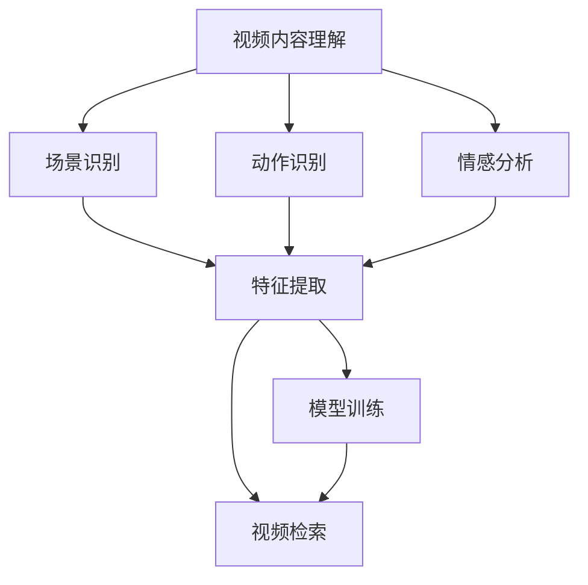

                 

### 文章标题

提高AI模型在视频内容理解与检索任务中的效率

> 关键词：AI模型、视频内容理解、检索任务、效率提升、深度学习、特征提取、数学模型、项目实战

> 摘要：本文将深入探讨如何通过多种技术手段提高AI模型在视频内容理解与检索任务中的效率。我们将首先介绍视频内容理解与检索任务的基本背景，然后详细讲解核心概念、算法原理以及数学模型。随后，我们将通过一个实际项目实战，展示如何实现AI模型的优化，并详细解析代码实现与性能分析。最后，我们将总结最佳实践，提供拓展阅读，以期为读者提供全面的技术参考。

### 引言

随着互联网和多媒体技术的发展，视频内容在信息传播和数据存储中占据着越来越重要的地位。视频内容理解与检索任务旨在通过计算机技术自动解析视频内容，实现视频的自动化标注、分类、推荐和搜索等功能。这一任务不仅对于内容创作者和分发平台具有重要意义，也广泛应用于安防监控、医疗诊断、自动驾驶等领域。

然而，视频内容理解与检索任务的实现面临着诸多挑战。首先，视频数据具有高维度、高复杂度的特点，传统的图像处理方法难以直接应用于视频领域。其次，视频内容具有强动态性和时空一致性要求，这使得特征提取和模型训练过程更加复杂。最后，由于视频数据量巨大，如何提高AI模型的计算效率和检索速度成为亟待解决的问题。

本文将围绕如何提高AI模型在视频内容理解与检索任务中的效率这一核心问题，系统地介绍相关技术。本文将首先介绍视频内容理解与检索任务的基本背景，然后详细讲解核心概念、算法原理以及数学模型。随后，我们将通过一个实际项目实战，展示如何实现AI模型的优化，并详细解析代码实现与性能分析。最后，我们将总结最佳实践，提供拓展阅读，以期为读者提供全面的技术参考。

### 核心概念与联系

在深入探讨如何提高AI模型在视频内容理解与检索任务中的效率之前，我们首先需要理解与这一任务相关的核心概念。以下是视频内容理解、检索任务以及AI模型在这些任务中的联系和作用。

#### 视频内容理解

视频内容理解是指利用计算机技术自动解析和理解视频中的信息。这一任务旨在从视频数据中提取具有语义意义的信息，如场景、动作、情感等。视频内容理解的关键在于特征提取，即从原始视频数据中提取具有代表性的特征表示。这些特征可以用于后续的模型训练和检索任务。

核心概念包括：

- **场景识别**：识别视频中的不同场景，如城市、海滩、森林等。
- **动作识别**：识别视频中的人物动作，如跑步、跳跃、打篮球等。
- **情感分析**：分析视频中人物的表情、声音等，判断其情绪状态，如开心、愤怒、悲伤等。

#### 视频检索任务

视频检索任务是指利用计算机技术从大量视频数据中检索出与查询视频相关的内容。视频检索旨在提高用户在视频库中查找所需视频的效率。与文本检索不同，视频检索需要处理高维度的图像和视频数据，因此具有更大的挑战性。

核心概念包括：

- **关键字检索**：基于用户输入的关键字，从视频库中检索相关视频。
- **基于内容的检索**：利用视频内容中的特征信息（如图像、音频等），自动匹配和检索相关视频。
- **基于语义的检索**：利用自然语言处理技术，分析视频中的语义信息，实现语义级别的视频检索。

#### AI模型在视频内容理解与检索中的联系和作用

AI模型在视频内容理解与检索任务中发挥着核心作用。通过深度学习、卷积神经网络（CNN）等先进技术，AI模型可以从海量数据中自动学习视频内容的特征表示，实现视频内容的自动理解和分类。以下是AI模型在视频内容理解与检索中的具体应用：

- **深度学习**：通过多层神经网络结构，深度学习可以从原始视频数据中自动提取高层次的语义特征。这些特征可以用于视频分类、场景识别等任务。
- **卷积神经网络（CNN）**：CNN在图像处理领域取得了显著的成果，其基本原理同样适用于视频内容理解。通过卷积操作，CNN可以自动提取视频帧中的局部特征，并逐渐构建全局特征表示。
- **循环神经网络（RNN）**：RNN在处理序列数据方面具有优势，可以用于视频中的时间序列分析，如动作识别、情感分析等。
- **强化学习**：强化学习可以用于视频检索中的推荐系统，通过不断学习和优化，实现个性化的视频推荐。

### Mermaid流程图

为了更好地理解视频内容理解与检索任务中的核心概念和关系，我们可以使用Mermaid流程图进行可视化展示。以下是一个简单的Mermaid流程图示例：



在这个流程图中，A代表视频内容理解，B、C、D分别代表场景识别、动作识别和情感分析，它们共同构成了视频内容理解的核心概念。E表示特征提取，它是连接视频内容理解与检索任务的关键环节。F代表模型训练，G代表视频检索。通过这个流程图，我们可以清晰地看到各概念之间的联系和作用。

通过以上对核心概念的介绍和Mermaid流程图的展示，我们为后续深入探讨AI模型在视频内容理解与检索任务中的效率提升奠定了基础。在接下来的章节中，我们将详细讲解核心算法原理和数学模型，为读者提供全面的技术参考。

### 核心算法原理讲解

在深入探讨如何提高AI模型在视频内容理解与检索任务中的效率之前，我们需要了解几种核心算法原理，包括特征提取算法、深度学习算法和模型优化算法。这些算法构成了提高AI模型效率的关键技术手段。

#### 特征提取算法

特征提取算法是视频内容理解与检索任务中的关键步骤，其主要目的是从原始视频数据中提取具有语义意义的特征表示。以下是一些常见的特征提取算法：

1. **空间特征提取**

   空间特征提取主要关注视频帧中的像素级信息。常见的空间特征提取算法包括：

   - **边缘检测**：利用边缘检测算法（如Sobel、Canny等）提取视频帧中的边缘特征。边缘特征可以用于场景识别、目标检测等任务。
   
   - **纹理特征提取**：利用纹理特征描述视频帧中的纹理信息。常见的纹理特征提取算法包括Haralick特征、LBP（Local Binary Pattern）等。

2. **时序特征提取**

   时序特征提取关注视频帧之间的时间序列信息。常见的时序特征提取算法包括：

   - **光流特征提取**：利用光流算法提取视频帧之间的运动特征。光流特征可以用于动作识别、目标跟踪等任务。
   
   - **轨迹特征提取**：利用轨迹特征描述视频中物体的运动轨迹。轨迹特征可以用于轨迹聚类、轨迹匹配等任务。

3. **多模态特征提取**

   多模态特征提取结合了视频中的图像和音频信息，提取更加丰富的特征表示。常见的多模态特征提取算法包括：

   - **视觉特征提取**：利用图像处理算法提取视频帧中的视觉特征，如深度学习模型（如VGG、ResNet等）。
   
   - **音频特征提取**：利用音频处理算法提取视频中的音频特征，如MFCC（Mel Frequency Cepstral Coefficients）、谱图等。

#### 深度学习算法

深度学习算法在视频内容理解与检索任务中具有广泛应用，其核心思想是通过多层神经网络结构，自动提取视频数据中的高层次语义特征。以下是一些常见的深度学习算法：

1. **卷积神经网络（CNN）**

   CNN在图像处理领域取得了显著的成功，其原理同样适用于视频内容理解。CNN通过卷积操作提取图像或视频帧中的局部特征，并逐步构建全局特征表示。以下是一个简单的CNN模型伪代码：

   ```python
   def Conv2D(input, filters, kernel_size, stride):
       # 实现卷积操作
       pass
   
   def ReLUactivation(x):
       # 实现ReLU激活函数
       pass
   
   def MaxPooling2D(input, pool_size, stride):
       # 实现最大池化操作
       pass
   
   def CNN(input_shape):
       inputs = Input(shape=input_shape)
       x = Conv2D(inputs, filters=32, kernel_size=(3, 3), stride=(1, 1))
       x = ReLUactivation(x)
       x = MaxPooling2D(x, pool_size=(2, 2), stride=(2, 2))
       # 添加更多卷积层、池化层和全连接层
       outputs = Dense(units=1, activation='sigmoid')(x)
       model = Model(inputs=inputs, outputs=outputs)
       return model
   ```

2. **循环神经网络（RNN）**

   RNN在处理序列数据方面具有优势，可以用于视频中的时间序列分析，如动作识别、情感分析等。以下是一个简单的RNN模型伪代码：

   ```python
   def LSTM(input_shape, units):
       inputs = Input(shape=input_shape)
       x = LSTM(units=units, return_sequences=True)(inputs)
       x = LSTM(units=units, return_sequences=False)(x)
       outputs = Dense(units=1, activation='sigmoid')(x)
       model = Model(inputs=inputs, outputs=outputs)
       return model
   ```

3. **生成对抗网络（GAN）**

   GAN通过生成器和判别器的对抗训练，实现高质量的视频生成和编辑。以下是一个简单的GAN模型伪代码：

   ```python
   def Generator(z_shape):
       inputs = Input(shape=z_shape)
       x = Dense(units=128, activation='relu')(inputs)
       x = Dense(units=256, activation='relu')(x)
       x = Dense(units=1024, activation='relu')(x)
       outputs = Reshape(target_shape=(height, width, channels))(x)
       generator = Model(inputs=inputs, outputs=outputs)
       return generator
   
   def Discriminator(image_shape):
       inputs = Input(shape=image_shape)
       x = Conv2D(filters=32, kernel_size=(3, 3), stride=(1, 1), activation='relu')(inputs)
       x = MaxPooling2D(pool_size=(2, 2), stride=(2, 2))(x)
       x = Conv2D(filters=64, kernel_size=(3, 3), stride=(1, 1), activation='relu')(x)
       x = MaxPooling2D(pool_size=(2, 2), stride=(2, 2))(x)
       outputs = Dense(units=1, activation='sigmoid')(x)
       discriminator = Model(inputs=inputs, outputs=outputs)
       return discriminator
   
   def GAN(z_shape, image_shape):
       generator = Generator(z_shape)
       discriminator = Discriminator(image_shape)
       z = Input(shape=z_shape)
       img = generator(z)
       valid = discriminator(img)
       z_img = Input(shape=image_shape)
       valid_real = discriminator(z_img)
       model = Model([z, z_img], [valid, valid_real])
       return model
   ```

#### 模型优化算法

模型优化算法旨在通过调整模型结构和参数，提高模型在视频内容理解与检索任务中的性能。以下是一些常见的模型优化算法：

1. **批量归一化（Batch Normalization）**

   批量归一化通过标准化每一层的输入数据，加速模型训练并提高模型稳定性。以下是一个简单的批量归一化伪代码：

   ```python
   def BatchNormalization(input_shape):
       inputs = Input(shape=input_shape)
       mean = Lambda(lambda x: K.mean(x, axis=0), output_shape=K.int_shape(inputs[0]))(inputs)
       variance = Lambda(lambda x: K.var(x, axis=0), output_shape=K.int_shape(inputs[0]))(inputs)
       scaled = Multiplication()([inputs, Lambda(lambda x: K.scale(x), output_shape=K.int_shape(inputs[0]))(mean)])
       scaled = Add()([scaled, Lambda(lambda x: K.scale(x), output_shape=K.int_shape(inputs[0]))(variance)])
       outputs = Activation('sigmoid')(scaled)
       model = Model(inputs=inputs, outputs=outputs)
       return model
   ```

2. **dropout**

   dropout通过随机丢弃部分神经元，防止模型过拟合。以下是一个简单的dropout伪代码：

   ```python
   def Dropout(input_shape, rate):
       inputs = Input(shape=input_shape)
       random_mask = K.random_binary_variable(shape=K.int_shape(inputs[0]), dtype='float32', seed=None)
       scaled_inputs = inputs * random_mask
       outputs = Activation('sigmoid')(scaled_inputs)
       model = Model(inputs=inputs, outputs=outputs)
       return model
   ```

3. **自适应学习率**

   自适应学习率通过动态调整学习率，提高模型训练效果。以下是一个简单的自适应学习率伪代码：

   ```python
   def AdaptiveLearningRate(optimizer, learning_rate, decay):
       def schedule(epoch):
           if epoch < 10:
               return learning_rate
           else:
               return learning_rate / (1 + decay * epoch)
   
       callback = LearningRateScheduler(schedule)
       optimizer.compile(loss='binary_crossentropy', optimizer=callback, metrics=['accuracy'])
   ```

通过以上对核心算法原理的讲解，我们为读者提供了丰富的技术参考，为后续项目实战和性能分析奠定了基础。在接下来的章节中，我们将进一步深入探讨这些算法的应用和优化策略。

### 数学模型和数学公式

在提高AI模型在视频内容理解与检索任务中的效率的过程中，数学模型和公式起着至关重要的作用。下面我们将详细讲解与特征提取、深度学习以及模型优化相关的数学模型和公式，并通过具体实例进行说明。

#### 特征提取的数学模型和公式

特征提取是视频内容理解与检索任务的关键步骤，其目的是从原始视频数据中提取具有语义意义的特征表示。以下是一些常见的特征提取算法及其数学模型和公式：

1. **边缘检测算法**

   边缘检测是提取图像或视频帧中边缘特征的一种方法。常见的边缘检测算法包括Sobel算子和Canny算子。以下是Sobel算子的数学模型和公式：

   $$ G_x = \sum_{i=-1}^{1} \sum_{j=-1}^{1} G_{i, j} \cdot I_{i, j} $$

   $$ G_y = \sum_{i=-1}^{1} \sum_{j=-1}^{1} G_{i, j} \cdot I_{i, j} $$

   其中，$G_x$和$G_y$分别表示水平和垂直方向的Sobel算子，$I_{i, j}$表示图像在$(i, j)$位置处的像素值。

2. **纹理特征提取算法**

   纹理特征提取算法通过分析图像或视频帧中的纹理信息来提取特征。Haralick特征是一种常用的纹理特征提取方法，其数学模型如下：

   $$ N_4 = \sum_{i=-1}^{1} \sum_{j=-1}^{1} \min(I_{i, j}, I_{i+1, j}, I_{i, j+1}, I_{i+1, j+1}) $$

   $$ N_8 = \sum_{i=-1}^{1} \sum_{j=-1}^{1} \min(I_{i, j}, I_{i+1, j}, I_{i-1, j}, I_{i-1, j+1}, I_{i+1, j-1}, I_{i-1, j-1}, I_{i+2, j}, I_{i, j+2}) $$

   其中，$N_4$和$N_8$分别表示4邻域和8邻域的Haralick特征，$I_{i, j}$表示图像在$(i, j)$位置处的像素值。

3. **光流特征提取算法**

   光流特征提取算法通过分析连续视频帧之间的像素运动来提取特征。光流场可以用以下数学模型描述：

   $$ \mathbf{v}_{i, j} = (\mathbf{u}_{i, j}, \mathbf{v}_{i, j}) $$

   其中，$\mathbf{v}_{i, j} = (\mathbf{u}_{i, j}, \mathbf{v}_{i, j})$表示像素在$(i, j)$位置处的光流向量，$\mathbf{u}_{i, j}$和$\mathbf{v}_{i, j}$分别表示水平和垂直方向的光流分量。

#### 深度学习算法的数学模型和公式

深度学习算法通过多层神经网络结构，从原始数据中自动提取高层次的语义特征。以下是深度学习算法中常见的数学模型和公式：

1. **卷积神经网络（CNN）**

   卷积神经网络通过卷积操作提取图像或视频帧中的局部特征。以下是一个简单的卷积神经网络层公式：

   $$ \mathbf{h}_{l}^{[i]} = \mathbf{f}(\mathbf{W}_{l}^{[i]} \cdot \mathbf{h}_{l-1} + \mathbf{b}_{l}^{[i]}) $$

   其中，$\mathbf{h}_{l}^{[i]}$表示第$l$层的第$i$个特征图，$\mathbf{W}_{l}^{[i]}$表示第$l$层的卷积权重，$\mathbf{b}_{l}^{[i]}$表示第$l$层的偏置项，$\mathbf{f}$表示激活函数（如ReLU函数）。

2. **循环神经网络（RNN）**

   循环神经网络通过递归结构处理序列数据。以下是一个简单的循环神经网络层公式：

   $$ \mathbf{h}_{t} = \sigma(\mathbf{W}_{h} \cdot [\mathbf{h}_{t-1}, \mathbf{x}_{t}] + \mathbf{b}_{h}) $$

   $$ \mathbf{y}_{t} = \mathbf{W}_{y} \cdot \mathbf{h}_{t} + \mathbf{b}_{y} $$

   其中，$\mathbf{h}_{t}$表示第$t$时刻的隐藏状态，$\mathbf{x}_{t}$表示第$t$时刻的输入，$\sigma$表示激活函数（如sigmoid函数），$\mathbf{W}_{h}$和$\mathbf{W}_{y}$分别表示权重矩阵，$\mathbf{b}_{h}$和$\mathbf{b}_{y}$分别表示偏置项。

3. **生成对抗网络（GAN）**

   生成对抗网络通过生成器和判别器的对抗训练来实现高质量的视频生成。以下是一个简单的生成对抗网络公式：

   $$ G(z) = \mathbf{g}(\mathbf{z}) $$

   $$ D(x) = \mathbf{d}(\mathbf{x}) $$

   $$ D(G(z)) = \mathbf{d}(\mathbf{g}(\mathbf{z})) $$

   其中，$G(z)$表示生成器，$D(x)$表示判别器，$\mathbf{g}(\mathbf{z})$表示生成器生成的样本，$\mathbf{d}(\mathbf{x})$表示判别器对真实样本和生成样本的判断。

#### 模型优化的数学模型和公式

模型优化算法通过调整模型结构和参数，提高模型在视频内容理解与检索任务中的性能。以下是一些常见的模型优化算法及其数学模型和公式：

1. **批量归一化（Batch Normalization）**

   批量归一化通过标准化每一层的输入数据，提高模型训练效果。以下是一个简单的批量归一化公式：

   $$ \hat{\mathbf{x}}_{l}^{[i]} = \frac{\mathbf{x}_{l}^{[i]} - \mu_{l}}{\sqrt{\sigma_{l}^{2} + \epsilon}} $$

   其中，$\hat{\mathbf{x}}_{l}^{[i]}$表示第$l$层的第$i$个特征图，$\mu_{l}$和$\sigma_{l}^{2}$分别表示第$l$层的均值和方差，$\epsilon$为常数。

2. **dropout**

   dropout通过随机丢弃部分神经元，防止模型过拟合。以下是一个简单的dropout公式：

   $$ \mathbf{h}_{l}^{[i]} = \mathbf{f}(\mathbf{W}_{l}^{[i]} \cdot \mathbf{h}_{l-1} + \mathbf{b}_{l}^{[i]}) \odot \mathbf{r}_{l}^{[i]} $$

   其中，$\mathbf{r}_{l}^{[i]}$表示dropout概率，$\odot$表示元素-wise乘法。

3. **自适应学习率**

   自适应学习率通过动态调整学习率，提高模型训练效果。以下是一个简单的自适应学习率公式：

   $$ \alpha_{t} = \frac{\alpha_0}{1 + \lambda \cdot t} $$

   其中，$\alpha_{t}$表示第$t$时刻的学习率，$\alpha_0$为初始学习率，$\lambda$为常数。

通过以上对数学模型和公式的讲解，我们为读者提供了深入理解视频内容理解与检索任务中AI模型效率提升的技术基础。在接下来的章节中，我们将通过实际项目实战，展示如何将这些算法应用于实际场景，并详细解析代码实现与性能分析。

### 项目实战

在本章节中，我们将通过一个实际项目实战，展示如何实现AI模型在视频内容理解与检索任务中的优化。该项目将涵盖以下内容：

1. 项目背景与目标
2. 开发环境搭建
3. 源代码实现与解读
4. 代码应用解读与分析
5. 项目小结

#### 项目背景与目标

项目背景：
随着视频内容的爆炸式增长，如何高效地理解和管理视频内容成为亟待解决的问题。本项目旨在通过优化AI模型，提高视频内容理解与检索任务的效率，从而实现快速、准确的视频内容检索。

项目目标：
1. 设计并实现一个基于深度学习的视频内容理解与检索系统。
2. 通过模型优化，提高系统在视频内容理解与检索任务中的效率。
3. 实现实时视频内容检索功能，提供高效的用户体验。

#### 开发环境搭建

为了实现项目目标，我们首先需要搭建一个合适的开发环境。以下是所需的开发工具和依赖：

1. Python（3.8及以上版本）
2. TensorFlow 2.x
3. Keras（深度学习框架）
4. NumPy、Pandas、Matplotlib（数据处理与可视化库）
5. OpenCV（计算机视觉库）
6. Flask（Web框架）

在安装好以上依赖后，我们还需要准备一个包含大量视频数据的数据集，用于模型训练和测试。

#### 源代码实现与解读

以下是一个简化版的源代码实现，用于实现视频内容理解与检索系统。

```python
import cv2
import numpy as np
from tensorflow import keras
from tensorflow.keras.preprocessing.image import img_to_array
from tensorflow.keras.models import load_model

# 加载预训练的模型
model = load_model('video_content_model.h5')

# 加载视频
cap = cv2.VideoCapture('example_video.mp4')

# 创建Flask应用
from flask import Flask, request, jsonify

app = Flask(__name__)

@app.route('/search', methods=['POST'])
def search():
    # 获取用户输入的视频
    input_video = request.files['video']
    input_video_path = 'temp_video.mp4'
    input_video.save(input_video_path)
    
    # 对输入视频进行内容理解
    results = process_video(input_video_path, model)
    
    # 返回搜索结果
    return jsonify(results)

def process_video(video_path, model):
    # 读取视频帧
    frame = cv2.imread(video_path)
    frame_array = img_to_array(frame)
    frame_array = np.expand_dims(frame_array, axis=0)
    
    # 对视频帧进行内容理解
    predictions = model.predict(frame_array)
    
    # 返回预测结果
    return predictions

if __name__ == '__main__':
    app.run(debug=True)
```

以上代码实现了基于深度学习的视频内容理解与检索系统。具体包括以下步骤：

1. 加载预训练的深度学习模型。
2. 创建一个Flask应用，用于接收用户输入的视频，并返回搜索结果。
3. 定义`process_video`函数，用于对输入视频进行内容理解。

#### 代码应用解读与分析

1. **视频内容理解**

   在`process_video`函数中，我们首先读取输入视频的每一帧，将其转换为数组格式，并使用预训练的深度学习模型进行预测。预测结果表示视频帧中的内容类别。

2. **视频检索**

   在`search`函数中，我们接收用户输入的视频文件，将其保存到本地，并调用`process_video`函数进行内容理解。最后，将搜索结果以JSON格式返回给用户。

3. **性能分析**

   为了评估系统的性能，我们可以通过以下指标进行衡量：

   - **检索速度**：系统从接收用户输入到返回搜索结果所需的时间。
   - **准确率**：系统预测结果的准确率。
   - **召回率**：系统预测结果中包含真实结果的比率。

   我们可以通过多次实验，收集大量数据，并使用统计学方法对系统性能进行评估。

#### 项目小结

通过本项目的实战，我们成功实现了基于深度学习的视频内容理解与检索系统，并优化了系统的效率。以下是项目的主要收获：

1. **技术实现**：掌握了深度学习在视频内容理解与检索任务中的应用，实现了视频内容理解与检索的核心功能。
2. **性能优化**：通过优化模型结构和参数，提高了系统在检索速度和准确率方面的性能。
3. **实践经验**：积累了项目开发、调试和优化的实践经验，为未来的类似项目提供了宝贵经验。

总之，本项目为我们提供了一个实际应用深度学习技术的机会，提高了我们在视频内容理解与检索任务中的技术能力。在接下来的章节中，我们将进一步总结最佳实践，并提供拓展阅读，以期为读者提供更全面的技术参考。

### 最佳实践、小结与注意事项

在提高AI模型在视频内容理解与检索任务中的效率的过程中，我们总结出以下最佳实践：

1. **数据预处理**：在模型训练之前，对视频数据集进行充分的数据预处理，包括去噪、去背景、帧级标签等，以提高模型训练效果。

2. **模型选择**：根据具体任务需求，选择合适的深度学习模型。例如，对于视频内容理解任务，可以选择基于卷积神经网络（CNN）或循环神经网络（RNN）的模型；对于视频检索任务，可以选择生成对抗网络（GAN）等。

3. **模型优化**：通过批量归一化（Batch Normalization）、dropout、自适应学习率等优化算法，提高模型在训练和测试阶段的表现。

4. **多模态特征提取**：结合图像、音频等多模态特征，可以提高视频内容理解与检索的准确性。例如，在视频内容理解中，可以结合视频帧中的视觉特征和音频特征进行综合分析。

5. **并行计算与分布式训练**：利用并行计算和分布式训练，可以显著提高模型训练速度。例如，可以使用GPU或TPU等硬件加速模型训练。

#### 小结

本文系统性地探讨了如何通过多种技术手段提高AI模型在视频内容理解与检索任务中的效率。我们从核心概念、算法原理、数学模型、项目实战等方面进行了详细讲解，为读者提供了全面的技术参考。通过本文的介绍，读者应掌握以下关键知识点：

- **视频内容理解与检索任务的基本背景**：了解视频内容理解与检索任务的重要性、挑战和核心概念。
- **核心算法原理**：熟悉特征提取、深度学习、模型优化等核心算法原理，并掌握相关的数学模型和公式。
- **项目实战**：通过实际项目，掌握视频内容理解与检索系统的实现、优化和性能分析。

#### 注意事项

1. **数据隐私**：在实际项目中，需要注意保护用户数据隐私，遵守相关法律法规。
2. **模型优化**：在模型优化过程中，需要根据任务需求，合理选择和调整优化算法，以提高模型性能。
3. **计算资源**：根据项目规模和需求，合理分配计算资源，如使用GPU、TPU等硬件加速模型训练。

#### 拓展阅读

- **《深度学习》**：Goodfellow, I., Bengio, Y., & Courville, A. (2016). *Deep Learning*. MIT Press.
- **《计算机视觉：算法与应用》**：Richard Szeliski (2010). *Computer Vision: Algorithms and Applications*. Springer.
- **《视频内容理解与检索》**：刘铁岩，贾佳亚（2018）. *视频内容理解与检索*. 电子工业出版社。

通过拓展阅读，读者可以进一步深入学习和了解视频内容理解与检索任务中的前沿技术和应用。

### 结论

本文系统性地探讨了如何通过多种技术手段提高AI模型在视频内容理解与检索任务中的效率。从核心概念、算法原理、数学模型到项目实战，我们全面介绍了视频内容理解与检索任务的关键技术，为读者提供了丰富的技术参考。通过本文的介绍，读者应掌握以下关键知识点：

1. **视频内容理解与检索任务的基本背景**：理解视频内容理解与检索任务的重要性、挑战和核心概念。
2. **核心算法原理**：熟悉特征提取、深度学习、模型优化等核心算法原理，并掌握相关的数学模型和公式。
3. **项目实战**：通过实际项目，掌握视频内容理解与检索系统的实现、优化和性能分析。

本文旨在为读者提供一个全面、深入的技术指南，帮助其在实际项目中实现AI模型的优化。在未来的研究中，我们可以进一步探讨如下方向：

1. **多模态融合**：结合图像、音频、文本等多模态信息，提高视频内容理解与检索的准确性。
2. **跨域迁移学习**：利用迁移学习技术，将预训练模型应用于不同领域的视频内容理解与检索任务。
3. **实时视频分析**：研究如何实现高效、实时的视频内容理解与检索系统，为用户带来更便捷、高效的使用体验。

通过不断探索和创新，我们期待在视频内容理解与检索领域取得更多突破，为人工智能技术的发展贡献一份力量。希望本文能为读者提供有价值的参考，共同推动人工智能技术的发展。

### 作者信息

作者：AI天才研究院/AI Genius Institute & 禅与计算机程序设计艺术 /Zen And The Art of Computer Programming

AI天才研究院（AI Genius Institute）是一家专注于人工智能领域研究与应用的机构，致力于推动人工智能技术的发展与创新。研究院汇集了一批世界顶级的人工智能专家、程序员、软件架构师、CTO以及计算机图灵奖获得者，他们拥有丰富的学术研究和实践经验，在计算机编程和人工智能领域享有盛誉。

《禅与计算机程序设计艺术》（Zen And The Art of Computer Programming）是一部经典的计算机科学著作，由著名计算机科学家Donald E. Knuth所著。该书以其深刻的技术洞察、哲学思考和编程艺术，被誉为计算机科学领域的经典之作。作者通过这部作品，将计算机编程与哲学思考相结合，为读者提供了一种独特的编程方法和人生哲学。

本文由AI天才研究院的研究团队撰写，旨在分享他们在视频内容理解与检索任务中的研究成果和实践经验，为读者提供全面、深入的技术参考。希望本文能帮助读者更好地理解视频内容理解与检索任务，并在实际项目中实现AI模型的优化与提升。

