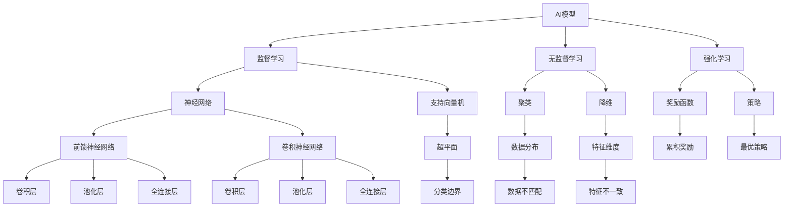

                 

### 文章标题

# 提高AI模型在跨领域知识迁移中的效果

### 关键词

- **AI模型**
- **跨领域知识迁移**
- **数据增强**
- **特征选择**
- **模型定制化**

### 摘要

本文将深入探讨如何提高人工智能（AI）模型在跨领域知识迁移中的效果。随着AI技术的不断进步，模型在特定领域的性能逐渐提升，但如何使这些模型在新的、未接触过的领域同样表现优秀，成为一个重要的研究课题。本文首先介绍了AI模型和跨领域知识迁移的基本概念，随后详细分析了现有模型在迁移过程中的挑战。接着，文章提出了多种策略与方法，包括数据增强、特征选择与融合、模型定制化等，以提升模型的跨领域迁移效果。最后，通过实际项目案例，展示了这些策略的实用性和有效性，并总结了最佳实践和未来研究方向。

### 目录

- [引言与概述](#引言与概述)
  - [跨领域知识迁移的重要性](#跨领域知识迁移的重要性)
  - [现有AI模型在跨领域知识迁移中的表现](#现有AI模型在跨领域知识迁移中的表现)
  - [提高AI模型跨领域迁移效果的意义](#提高AI模型跨领域迁移效果的意义)
- [AI模型基础知识](#AI模型基础知识)
  - [AI模型的基本概念](#AI模型的基本概念)
  - [常见的AI模型类型](#常见的AI模型类型)
  - [AI模型的训练与优化](#AI模型的训练与优化)
- [跨领域知识迁移的挑战和机会](#跨领域知识迁移的挑战和机会)
  - [跨领域知识迁移的挑战](#跨领域知识迁移的挑战)
  - [跨领域知识迁移的机会](#跨领域知识迁移的机会)
- [提高跨领域迁移效果的策略与方法](#提高跨领域迁移效果的策略与方法)
  - [数据增强与预处理](#数据增强与预处理)
  - [特征选择与融合](#特征选择与融合)
  - [模型定制化与适配](#模型定制化与适配)
- [项目实战与案例分析](#项目实战与案例分析)
  - [跨领域知识迁移项目实战](#跨领域知识迁移项目实战)
  - [成功案例分享](#成功案例分享)
  - [挑战与问题分析](#挑战与问题分析)
- [总结与展望](#总结与展望)
  - [主要内容回顾](#主要内容回顾)
  - [未来发展趋势](#未来发展趋势)
  - [研究与开发建议](#研究与开发建议)
- [附录](#附录)
  - [常见AI模型简介](#常见AI模型简介)
  - [跨领域知识迁移工具与资源](#跨领域知识迁移工具与资源)
  - [代码示例与解读](#代码示例与解读)

### 引言与概述

#### 跨领域知识迁移的重要性

在人工智能（AI）研究领域，跨领域知识迁移（Cross-Domain Knowledge Transfer）是一个备受关注的话题。随着深度学习和神经网络技术的迅猛发展，AI模型在特定领域（如图像识别、自然语言处理等）的表现越来越优秀。然而，如何将已经训练好的模型应用于其他未接触过的领域，即跨领域迁移，依然是一个具有挑战性的问题。

跨领域知识迁移的重要性体现在多个方面。首先，它能够提高模型的泛化能力，使模型在不同领域都能保持高效表现。其次，它能够促进知识的共享与融合，将一个领域的经验应用到其他领域，从而加速AI技术的发展。此外，跨领域知识迁移还有助于解决数据稀缺和领域特定问题，为AI模型在实际应用中提供更多的可能性。

#### 现有AI模型在跨领域知识迁移中的表现

目前，许多AI模型已经在特定领域取得了显著成果，但在跨领域知识迁移中仍面临诸多挑战。首先，数据不匹配和特征不一致是两个主要问题。不同领域的数据分布和特征维度可能存在较大差异，导致模型在迁移过程中表现不佳。其次，模型的训练和优化方法在跨领域迁移中可能不再适用，需要针对新领域进行定制化调整。

尽管存在这些挑战，现有的一些模型在跨领域知识迁移中也展现出了潜力。例如，预训练模型通过在大规模通用数据集上预先训练，然后在特定领域进行微调，已经在许多任务中取得了较好的效果。此外，迁移学习（Transfer Learning）和元学习（Meta-Learning）等方法也在跨领域迁移中得到了广泛应用。

#### 提高AI模型跨领域迁移效果的意义

提高AI模型在跨领域知识迁移中的效果具有重要意义。首先，它能够推动AI技术的全面发展，使模型在不同领域都能发挥作用。其次，跨领域知识迁移有助于解决实际应用中的问题，例如医疗诊断、金融风险评估等，为行业带来更多创新和价值。此外，提高模型的跨领域迁移能力也有助于减少对大量领域特定数据的依赖，降低AI模型部署的门槛。

总之，跨领域知识迁移是AI研究中的一个重要方向，提高AI模型在此方面的表现对于推动AI技术的发展和应用具有深远影响。在接下来的章节中，我们将详细探讨AI模型基础知识、跨领域知识迁移的挑战和机会，以及提高跨领域迁移效果的策略与方法。

### AI模型基础知识

#### AI模型的基本概念

人工智能（AI）模型是机器学习（ML）和深度学习（DL）的核心组成部分。AI模型是一种计算机程序，它能够通过学习数据中的规律和模式，从而进行预测、分类或生成任务。这些模型通常由一系列数学公式和算法构成，通过调整模型参数，使其在不同任务上达到最优性能。

AI模型可以分为监督学习（Supervised Learning）、无监督学习（Unsupervised Learning）和强化学习（Reinforcement Learning）三大类。监督学习模型利用标记数据（即数据点带有标签）进行训练，通过学习输入和输出之间的映射关系，预测新的数据点。无监督学习模型则不需要标记数据，主要任务是发现数据中的结构和模式，如聚类和降维。强化学习模型通过与环境的交互，学习最优策略以最大化累积奖励。

#### 常见的AI模型类型

在AI领域，存在多种类型的模型，每种模型都有其独特的应用场景和特点。以下是一些常见的AI模型类型：

1. **神经网络（Neural Networks）**：神经网络是模拟人脑神经元连接结构的计算模型，包括前馈神经网络（Feedforward Neural Networks，FNN）和卷积神经网络（Convolutional Neural Networks，CNN）等。CNN特别适用于处理图像数据，通过卷积层、池化层和全连接层，实现图像特征提取和分类。

2. **支持向量机（Support Vector Machines，SVM）**：SVM是一种分类模型，通过找到一个最佳的超平面，将不同类别的数据点分开。SVM在处理高维数据时表现出色，常用于文本分类、图像识别等领域。

3. **决策树（Decision Trees）**：决策树通过一系列判断条件，将数据集划分成多个子集，每个子集对应一个标签。决策树易于理解和解释，常用于回归和分类任务。

4. **随机森林（Random Forests）**：随机森林是一种集成学习方法，通过构建多棵决策树，并对它们的结果进行投票或求平均，提高模型的泛化能力和准确性。

5. **深度信念网络（Deep Belief Networks，DBN）**：DBN是一种深度学习模型，包括多个隐含层，能够进行无监督预训练和有监督微调。DBN常用于特征提取和图像生成任务。

6. **循环神经网络（Recurrent Neural Networks，RNN）**：RNN是一种能够处理序列数据的神经网络，通过存储和利用历史信息，实现长短期依赖（Long-Short Term Memory，LSTM）和门控循环单元（Gated Recurrent Unit，GRU）等变种，在自然语言处理和语音识别等领域有广泛应用。

7. **生成对抗网络（Generative Adversarial Networks，GAN）**：GAN由生成器和判别器两个神经网络组成，通过对抗训练，生成器试图生成逼真的数据，而判别器试图区分真实数据和生成数据。GAN在图像生成和增强、视频生成等领域表现出色。

#### AI模型的训练与优化

AI模型的训练过程包括数据预处理、模型初始化、模型训练和模型评估等步骤。数据预处理包括数据清洗、归一化和标准化等，以提高模型的训练效率和性能。模型初始化是指为模型参数随机分配初始值，以避免模型在训练过程中陷入局部最优。

在模型训练过程中，常用的优化算法包括随机梯度下降（Stochastic Gradient Descent，SGD）、Adam优化器等。这些算法通过调整模型参数，使模型在训练数据上达到最小损失或最大似然。模型优化是一个反复迭代的过程，通过调整学习率、批量大小等参数，优化模型的性能。

模型评估是训练过程的最后一步，通过在测试集上评估模型的表现，判断模型的泛化能力和准确性。常用的评估指标包括准确率（Accuracy）、召回率（Recall）、精确率（Precision）、F1分数（F1 Score）等。此外，还可以通过交叉验证（Cross-Validation）等方法，进一步验证模型的稳定性。

总之，AI模型的基础知识涵盖了从概念到应用的一系列内容，包括模型类型、训练与优化方法等。这些知识是理解和应用AI模型的前提，为提高模型在跨领域知识迁移中的效果奠定了基础。

#### 核心概念与联系

为了更好地理解AI模型在跨领域知识迁移中的工作原理，我们需要绘制一个核心概念之间的联系架构图，使用Mermaid语法表示如下：



该图展示了AI模型的三大类（监督学习、无监督学习和强化学习）以及它们各自的子类别和关联。同时，还反映了跨领域知识迁移中常见的挑战，如数据不匹配和特征不一致，以及模型优化过程中使用的相关算法和策略。通过这种直观的图形化表示，读者可以更清晰地理解AI模型在跨领域知识迁移中的核心概念和相互关系。

#### 核心算法原理讲解

为了深入理解AI模型在跨领域知识迁移中的核心算法原理，我们将以卷积神经网络（CNN）为例，详细讲解其工作原理，并使用伪代码进行描述。随后，我们将介绍如何通过数学模型和公式来进一步阐述这些原理。

##### 卷积神经网络（CNN）的工作原理

CNN是一种专为处理图像数据设计的深度学习模型。其核心思想是通过卷积层、池化层和全连接层，逐步提取图像中的特征，并最终实现分类或回归任务。

1. **卷积层（Convolutional Layer）**：卷积层是CNN中最基本的层之一。它通过卷积操作，将输入图像与一组可学习的卷积核（也称为滤波器）进行卷积，从而生成特征图。每个卷积核都可以提取图像中特定的特征，如边缘、纹理等。

   ```python
   # 伪代码：卷积层
   def convolution(image, filter):
       feature_map = []
       for y in range(image_height - filter_height + 1):
           for x in range(image_width - filter_width + 1):
               sum = 0
               for fy in range(filter_height):
                   for fx in range(filter_width):
                       sum += image[y+fy, x+fx] * filter[fy, fx]
               feature_map.append(sum)
       return feature_map
   ```

2. **池化层（Pooling Layer）**：池化层用于降低特征图的维度，同时保留重要的特征信息。常见的池化操作包括最大池化（Max Pooling）和平均池化（Average Pooling）。

   ```python
   # 伪代码：最大池化
   def max_pooling(feature_map, pool_size):
       pooled_map = []
       for y in range(0, feature_map_height, pool_size):
           for x in range(0, feature_map_width, pool_size):
               max_val = -float('inf')
               for py in range(pool_size):
                   for px in range(pool_size):
                       max_val = max(max_val, feature_map[y+py, x+px])
               pooled_map.append(max_val)
       return pooled_map
   ```

3. **全连接层（Fully Connected Layer）**：全连接层将前一层提取的特征映射到输出层，实现最终的分类或回归任务。每个神经元都与上一层的所有神经元相连。

   ```python
   # 伪代码：全连接层
   def fully_connected(feature_map, weights, bias):
       output = []
       for neuron in range(output_size):
           sum = 0
           for i in range(feature_map_size):
               sum += feature_map[i] * weights[i, neuron]
           output.append(sum + bias[neuron])
       return output
   ```

##### 数学模型和公式

CNN中的卷积操作可以通过以下数学公式表示：

$$
\text{output}(i, j) = \sum_{x=0}^{W_f} \sum_{y=0}^{H_f} \text{input}(i+x, j+y) \cdot \text{filter}(x, y)
$$

其中，$\text{output}(i, j)$是特征图上的一个像素值，$\text{input}(i+x, j+y)$是输入图像上的一个像素值，$\text{filter}(x, y)$是卷积核上的一个像素值。

池化操作可以通过以下数学公式表示：

$$
\text{pooled\_val}(i, j) = \max_{k \in [0, \text{pool\_size}-1]} \max_{l \in [0, \text{pool\_size}-1]} \text{input}(i+k, j+l)
$$

其中，$\text{pooled\_val}(i, j)$是池化层上的一个值，$\text{input}(i+k, j+l)$是输入特征图上的一个值。

全连接层的操作可以通过以下数学公式表示：

$$
\text{output}(n) = \text{激活函数}(\sum_{i=0}^{m} \text{input}(i) \cdot \text{weight}(i, n) + \text{bias}(n))
$$

其中，$\text{output}(n)$是输出层的第$n$个神经元值，$\text{input}(i)$是前一层第$i$个神经元值，$\text{weight}(i, n)$是连接第$i$个神经元和第$n$个神经元的权重，$\text{bias}(n)$是第$n$个神经元的偏置。

通过上述伪代码和数学公式，我们可以清晰地理解CNN的核心算法原理。在实际应用中，通过调整卷积核的大小、激活函数的类型和优化算法等参数，可以进一步提高CNN的性能。

### 跨领域知识迁移的挑战和机会

#### 跨领域知识迁移的挑战

在跨领域知识迁移过程中，AI模型常常面临以下几大挑战：

1. **数据不匹配**：不同领域的数据分布可能存在显著差异，导致模型在迁移过程中难以找到有效的通用特征。例如，在图像识别任务中，医疗影像数据和卫星影像数据可能在数据分布上有很大差异。

2. **特征不一致**：不同领域的特征维度和类型可能不同，使得模型在特征提取和融合时面临困难。例如，在自然语言处理任务中，文本数据与音频数据在特征表达上存在很大差异。

3. **模型适应性不足**：现有模型可能在特定领域已经达到最佳性能，但在其他领域可能不再适用，需要重新训练或调整。例如，在金融领域已经训练好的模型，可能无法直接应用于医疗领域。

4. **计算资源限制**：跨领域迁移往往需要更多的计算资源，尤其是在大规模数据集和复杂模型的情况下。这可能导致模型部署的延迟和成本增加。

5. **领域特定问题**：某些领域可能存在独特的挑战，如医疗领域中的诊断任务需要处理大量不确定性和噪声数据，金融领域中的欺诈检测任务需要处理复杂的交易模式等。

#### 跨领域知识迁移的机会

尽管存在诸多挑战，跨领域知识迁移也带来了许多机会：

1. **知识共享与融合**：通过跨领域迁移，可以将不同领域的知识和经验进行共享和融合，从而加速AI技术的发展。例如，将自然语言处理中的文本生成技术应用于图像描述生成任务，可以产生更具创意和多样性的图像描述。

2. **应用领域拓展**：跨领域知识迁移可以拓展AI模型的应用范围，使其在更多领域中发挥作用。例如，将图像识别技术应用于自动驾驶、医疗诊断、安全监控等领域，可以显著提高这些领域的效率和准确性。

3. **数据稀缺问题**：在某些领域，如医疗和金融，数据获取可能非常困难。通过跨领域知识迁移，可以利用其他领域的大量数据，从而缓解数据稀缺问题，提高模型的训练效果。

4. **模型优化与改进**：通过跨领域迁移，可以识别和解决模型在不同领域中的不足之处，从而进行优化和改进。例如，通过在图像识别任务中学习到的特征提取技巧，可以改进自然语言处理任务中的文本特征表示。

5. **创新与发展**：跨领域知识迁移可以促进AI领域的创新和发展，推动新理论和新技术的产生。例如，将强化学习中的策略优化方法应用于资源分配和调度问题，可以提出新的优化策略和算法。

总之，跨领域知识迁移虽然在技术上存在挑战，但同时也提供了广阔的机会。通过不断探索和尝试，我们可以充分发挥AI模型的潜力，推动其在各个领域中的广泛应用和发展。

#### 跨领域知识迁移中的核心算法原理

在跨领域知识迁移过程中，为了解决数据不匹配和特征不一致的问题，我们通常采用一系列核心算法和技术。以下将详细介绍这些算法原理，并使用伪代码进行描述。

##### 数据增强与预处理

数据增强（Data Augmentation）是一种通过人工方式扩展数据集的技术，能够在不改变数据本质的情况下，生成多样化的训练样本。常用的数据增强方法包括旋转、缩放、裁剪、翻转等。数据增强可以帮助模型学习到更丰富的特征，提高其泛化能力。

```python
# 伪代码：数据增强
def augment_data(image, rotations=0, zoom=1, flip=True):
    if rotations > 0:
        image = rotate(image, rotations)
    if zoom != 1:
        image = zoom_image(image, zoom)
    if flip:
        image = flip_image(image)
    return image
```

预处理（Preprocessing）则是通过对数据进行标准化、归一化、缺失值填充等操作，使数据符合模型训练的要求。以下是一个简单的预处理示例：

```python
# 伪代码：数据预处理
def preprocess_data(image):
    image = normalize(image)
    image = fill_missing_values(image)
    return image
```

##### 特征选择与融合

特征选择（Feature Selection）是选择出对模型训练最有影响力的特征，以减少数据的维度和提高训练效率。常用的特征选择方法包括基于信息的特征选择、基于模型的特征选择和基于集合的特征选择。

基于信息的特征选择方法：

```python
# 伪代码：基于信息的特征选择
def select_features_by_info(data, target, num_features):
    feature_importance = calculate_feature_importance(data, target)
    selected_features = sorted(feature_importance, key=feature_importance.get, reverse=True)[:num_features]
    return selected_features
```

特征融合（Feature Fusion）是将来自不同来源或不同模态的特征进行组合，以生成更丰富的特征表示。常用的特征融合方法包括叠加融合、加权融合和深度融合。

叠加融合示例：

```python
# 伪代码：叠加融合
def fuse_features(feature_a, feature_b):
    fused_feature = feature_a + feature_b
    return fused_feature
```

加权融合示例：

```python
# 伪代码：加权融合
def fuse_features_with_weights(feature_a, feature_b, weight_a, weight_b):
    fused_feature = weight_a * feature_a + weight_b * feature_b
    return fused_feature
```

深度融合示例（使用神经网络进行特征融合）：

```python
# 伪代码：深度融合
def deep_fuse_features(feature_a, feature_b):
    fused_feature = neural_network([feature_a, feature_b])
    return fused_feature
```

##### 模型定制化与适配

模型定制化（Model Customization）是根据目标领域的特点，对现有模型进行调整和优化。常见的定制化方法包括模型调整（如调整网络结构、优化器参数等）和模型适应（如迁移学习、元学习等）。

迁移学习示例（使用预训练模型进行定制化）：

```python
# 伪代码：迁移学习
def customize_model_with_pretrained(pretrained_model, custom_data, num_classes):
    custom_model = pretrained_model.copy()
    custom_model.classifier = Classifier(num_classes)
    custom_model.fit(custom_data)
    return custom_model
```

元学习示例（通过元学习算法进行模型定制化）：

```python
# 伪代码：元学习
def customize_model_with_meta_learning(meta_learner, custom_data):
    meta_learner.fit(custom_data)
    custom_model = meta_learner.get_model()
    custom_model.fit(custom_data)
    return custom_model
```

通过上述核心算法原理，我们可以在跨领域知识迁移中更好地应对数据不匹配和特征不一致的问题，从而提高模型的迁移效果。

### 数据增强与预处理

在跨领域知识迁移过程中，数据增强（Data Augmentation）和预处理（Preprocessing）是两个至关重要的步骤，它们能够显著提高AI模型的泛化能力和适应性。下面我们将详细探讨这两种技术的基本概念、实现方法和实际案例。

#### 数据增强

数据增强是一种通过人工方式扩展数据集的技术，旨在生成多样化的训练样本，使模型能够学习到更丰富的特征，从而提高泛化能力。常见的数据增强方法包括旋转、缩放、裁剪、翻转等。

1. **旋转**：通过旋转输入数据一定角度，可以增加数据的多样性。
   
   ```python
   def rotate_image(image, angle):
       center = tuple(np.array(image.shape[1::-1]) / 2)
       rotation_matrix = cv2.getRotationMatrix2D(center, angle, 1.0)
       return cv2.warpAffine(image, rotation_matrix, image.shape[1::-1], flags=cv2.INTER_CUBIC)
   ```

2. **缩放**：通过缩放输入数据，可以改变数据的尺寸和比例，从而生成不同尺寸的样本。

   ```python
   def scale_image(image, scale_factor):
       new_size = tuple([int(x * scale_factor) for x in image.shape[:2]])
       return cv2.resize(image, new_size, interpolation=cv2.INTER_CUBIC)
   ```

3. **裁剪**：通过随机裁剪输入数据，可以生成不同部分的数据样本。

   ```python
   def crop_image(image, crop_size):
       top = np.random.randint(0, image.shape[0] - crop_size[0])
       left = np.random.randint(0, image.shape[1] - crop_size[1])
       return image[top:top+crop_size[0], left:left+crop_size[1]]
   ```

4. **翻转**：通过水平或垂直翻转输入数据，可以增加数据的多样性。

   ```python
   def flip_image(image, horizontal=True, vertical=False):
       if horizontal:
           image = cv2.flip(image, 1)
       if vertical:
           image = cv2.flip(image, 0)
       return image
   ```

在实际应用中，我们可以组合使用多种数据增强方法，以生成更多样化的训练样本。例如，在图像识别任务中，我们可以先对图像进行旋转和缩放，然后进行随机裁剪和翻转。

#### 预处理

预处理是数据增强的补充，它通过对数据进行标准化、归一化、缺失值填充等操作，使数据符合模型训练的要求。以下是几种常用的预处理方法：

1. **标准化**：通过将数据缩放到相同的尺度，以便不同特征之间的比较。

   ```python
   def normalize_data(data, mean=None, std=None):
       if mean is None or std is None:
           mean = np.mean(data, axis=0)
           std = np.std(data, axis=0)
       return (data - mean) / std
   ```

2. **归一化**：通过将数据映射到[0, 1]区间，以简化模型训练。

   ```python
   def normalize(data):
       min_val = np.min(data)
       max_val = np.max(data)
       return (data - min_val) / (max_val - min_val)
   ```

3. **缺失值填充**：通过填充缺失值，使数据集保持完整。

   ```python
   def fill_missing_values(data, method='mean'):
       if method == 'mean':
           fill_value = np.mean(data, axis=0)
       elif method == 'median':
           fill_value = np.median(data, axis=0)
       data[np.isnan(data)] = fill_value
       return data
   ```

#### 实际案例

下面通过一个实际案例，展示如何使用数据增强和预处理技术来提高模型在跨领域知识迁移中的效果。

**案例：医疗图像识别**

在医疗图像识别任务中，我们常常面临数据量有限、数据分布不均衡的问题。为了解决这个问题，我们可以采用以下步骤：

1. **数据增强**：对图像进行旋转、缩放、裁剪和翻转等操作，以生成更多样化的训练样本。

   ```python
   train_images = [rotate_image(scale_image(crop_image(image), 0.5), 10) for image in train_images]
   ```

2. **预处理**：对图像进行标准化和缺失值填充，以使数据集保持一致。

   ```python
   train_images = [normalize_data(fill_missing_values(image)) for image in train_images]
   ```

通过上述步骤，我们可以生成一个多样化的、预处理过的训练数据集，从而提高模型在跨领域知识迁移中的表现。

总之，数据增强和预处理技术在跨领域知识迁移中发挥着重要作用。通过合理使用这些技术，我们可以生成更多样化的训练样本，提高模型的泛化能力，从而更好地适应不同的领域和应用场景。

### 特征选择与融合

在跨领域知识迁移中，特征选择与融合是提升模型性能的关键步骤。通过有效的特征选择和融合，我们可以从原始数据中提取出对模型训练最有价值的特征，并生成更丰富的特征表示，从而提高模型的泛化能力和迁移效果。

#### 特征选择

特征选择（Feature Selection）是一种从原始特征集合中选择出最有代表性的特征的方法，旨在减少数据维度、提高计算效率和模型性能。以下是几种常用的特征选择方法：

1. **基于信息的特征选择**：这种方法通过评估特征对目标变量的贡献程度来进行选择。常用的评估指标包括信息增益（Information Gain）、信息增益率（Information Gain Rate）和互信息（Mutual Information）。

   ```python
   # 伪代码：基于信息的特征选择
   def select_features_by_info(data, target, num_features):
       feature_importance = [calculate_info_gain(data[:, i], target) for i in range(data.shape[1])]
       selected_features = [index for index, value in sorted(enumerate(feature_importance), key=lambda x: x[1], reverse=True)[:num_features]]
       return data[:, selected_features]
   ```

2. **基于模型的特征选择**：这种方法利用训练好的模型来评估特征的重要性。常见的模型包括决策树、随机森林和LASSO回归等。

   ```python
   # 伪代码：基于模型的特征选择
   from sklearn.ensemble import RandomForestClassifier
   def select_features_by_model(model, X, y, num_features):
       model.fit(X, y)
       feature_importance = model.feature_importances_
       selected_features = [index for index, value in sorted(enumerate(feature_importance), key=lambda x: x[1], reverse=True)[:num_features]]
       return X[:, selected_features]
   ```

3. **基于集合的特征选择**：这种方法通过多次随机采样和特征选择，选择出一致性较高的特征。常用的算法包括贝叶斯优化（Bayesian Optimization）和遗传算法（Genetic Algorithm）。

   ```python
   # 伪代码：基于集合的特征选择
   from sklearn.model_selection import RandomizedSearchCV
   def select_features_by_collection(model, X, y, num_features, num_iterations=100):
       param_distributions = {'n_features': range(1, X.shape[1]+1)}
       search = RandomizedSearchCV(model, param_distributions, n_iter=num_iterations)
       search.fit(X, y)
       return search.best_params_['n_features']
   ```

#### 特征融合

特征融合（Feature Fusion）是将来自不同来源或不同模态的特征进行组合，生成更丰富的特征表示。以下是几种常用的特征融合方法：

1. **叠加融合**：将不同特征直接相加，生成新的特征向量。

   ```python
   # 伪代码：叠加融合
   def add_features(feature_a, feature_b):
       return np.concatenate((feature_a, feature_b), axis=1)
   ```

2. **加权融合**：根据不同特征的重要程度，对特征进行加权融合。

   ```python
   # 伪代码：加权融合
   def weighted_fusion(feature_a, feature_b, weight_a, weight_b):
       return weight_a * feature_a + weight_b * feature_b
   ```

3. **深度融合**：通过神经网络对特征进行融合，生成新的特征表示。

   ```python
   # 伪代码：深度融合
   import tensorflow as tf
   def deep_fusion(feature_a, feature_b, hidden_size):
       fusion_model = tf.keras.Sequential([
           tf.keras.layers.Dense(hidden_size, activation='relu', input_shape=(feature_a.shape[1] + feature_b.shape[1],)),
           tf.keras.layers.Dense(1, activation='sigmoid')
       ])
       return fusion_model([feature_a, feature_b])
   ```

在实际应用中，我们可以根据具体任务和数据特点，选择合适的特征选择和融合方法。例如，在图像识别任务中，可以通过叠加融合图像的像素特征和纹理特征；在自然语言处理任务中，可以通过深度融合文本和语音的特征。

#### 实际案例

**案例：跨领域医学诊断**

假设我们要在两个不同的医学领域（心脏疾病和肝脏疾病）之间进行知识迁移。为了提高模型的迁移效果，我们可以采用以下步骤：

1. **特征选择**：从心脏疾病和肝脏疾病的数据集中，分别使用基于信息的特征选择方法，选择出最有代表性的特征。

   ```python
   selected_heart_features = select_features_by_info(heart_data, heart_labels, num_features=10)
   selected_liver_features = select_features_by_info(liver_data, liver_labels, num_features=10)
   ```

2. **特征融合**：将心脏疾病和肝脏疾病的特征进行叠加融合，生成新的特征向量。

   ```python
   fused_features = add_features(selected_heart_features, selected_liver_features)
   ```

3. **模型训练**：使用融合后的特征训练一个统一的分类模型，以实现对两个领域的疾病诊断。

   ```python
   model.fit(fused_features, combined_labels)
   ```

通过上述步骤，我们可以构建一个有效的跨领域医学诊断模型，提高模型在两个不同领域的表现。

总之，特征选择与融合技术在跨领域知识迁移中具有重要意义。通过合理选择和融合特征，我们可以生成更丰富的特征表示，提高模型的泛化能力和迁移效果，从而更好地应对不同领域的挑战。

### 模型定制化与适配

在跨领域知识迁移中，模型定制化与适配是提高模型迁移效果的重要手段。模型定制化与适配包括对模型进行结构调整、参数优化和策略改进等，旨在使模型更好地适应新的领域和应用场景。以下将详细介绍模型定制化与适配的方法和步骤。

#### 模型结构调整

模型结构调整（Model Architecture Adjustment）是针对新领域的特定需求，对模型的网络结构进行调整和优化。这种调整可以包括增加或减少层数、改变层之间的连接方式、更换激活函数等。

1. **增加或减少层数**：通过增加深度（例如，在卷积神经网络（CNN）中增加卷积层或全连接层），可以提高模型对复杂特征的学习能力。反之，通过减少深度，可以简化模型结构，提高训练速度和降低计算复杂度。

   ```python
   # 伪代码：增加卷积层
   def add_conv_layer(model, new_filters, new_kernel_size):
       new_conv_layer = Conv2D(new_filters, new_kernel_size, activation='relu')(model.output)
       return Model(inputs=model.input, outputs=new_conv_layer)
   ```

2. **改变层之间的连接方式**：通过改变层与层之间的连接方式，可以引入更多的非线性变换和特征融合。例如，在循环神经网络（RNN）中，可以通过增加多层RNN或者引入双向RNN来增强特征表示能力。

   ```python
   # 伪代码：改变RNN连接方式
   from tensorflow.keras.layers import LSTM, Bidirectional
   def add_bidirectional_rnn(model, hidden_size):
       bidirectional_rnn = Bidirectional(LSTM(hidden_size, return_sequences=True))(model.output)
       return Model(inputs=model.input, outputs=bidirectional_rnn)
   ```

3. **更换激活函数**：通过更换激活函数，可以提高模型的非线性表达能力。例如，从ReLU函数更换为Swish函数，可以进一步提高模型的性能。

   ```python
   # 伪代码：更换激活函数
   from tensorflow.keras.layers import Activation
   def replace_activation(model, new_activation):
       for layer in model.layers:
           if isinstance(layer, Activation) and layer.activation.__class__.__name__ == 'ReLU':
               layer.activation = new_activation
       return model
   ```

#### 参数优化

参数优化（Parameter Optimization）是通过调整模型参数，使模型在特定领域上达到最佳性能。参数优化包括学习率调整、批量大小选择、正则化策略等。

1. **学习率调整**：学习率是影响模型训练速度和性能的关键参数。通过使用自适应学习率优化器（如Adam、RMSprop），可以根据训练过程动态调整学习率。

   ```python
   # 伪代码：使用Adam优化器
   from tensorflow.keras.optimizers import Adam
   model.compile(optimizer=Adam(learning_rate=0.001), loss='categorical_crossentropy', metrics=['accuracy'])
   ```

2. **批量大小选择**：批量大小影响模型训练的稳定性和收敛速度。通过调整批量大小，可以在计算效率和模型性能之间找到平衡。

   ```python
   # 伪代码：调整批量大小
   model.fit(X_train, y_train, batch_size=32, epochs=10, validation_data=(X_val, y_val))
   ```

3. **正则化策略**：通过引入正则化（如L1、L2正则化），可以防止模型过拟合。正则化强度可以通过交叉验证来确定。

   ```python
   # 伪代码：添加L2正则化
   from tensorflow.keras.regularizers import l2
   model.add(Dense(10, activation='softmax', kernel_regularizer=l2(0.01)))
   ```

#### 策略改进

策略改进（Strategy Improvement）是通过调整训练和评估策略，提高模型的迁移效果。策略改进包括迁移学习、元学习、对抗训练等。

1. **迁移学习**：迁移学习通过在源领域上预训练模型，然后在新领域上微调，以减少对领域特定数据的依赖。这种方法可以显著提高模型的迁移性能。

   ```python
   # 伪代码：迁移学习
   pretrained_model = load_model('pretrained_model.h5')
   custom_model = apply_custom_layers(pretrained_model, new_layers)
   custom_model.fit(X_train, y_train, X_val, y_val)
   ```

2. **元学习**：元学习通过在多个任务上训练模型，使其能够快速适应新的任务。这种方法可以提升模型的泛化能力和迁移效果。

   ```python
   # 伪代码：元学习
   from tensorflow.keras.models import Model
   def meta_learning(models, tasks, epochs):
       for epoch in range(epochs):
           for model, task in zip(models, tasks):
               model.fit(task['X_train'], task['y_train'], validation_data=task['X_val'], validation_split=0.2, epochs=1)
               model.save(f'model_epoch_{epoch}.h5')
   ```

3. **对抗训练**：对抗训练通过生成对抗样本，提高模型对异常样本的识别能力。这种方法可以增强模型的鲁棒性，提高其跨领域迁移性能。

   ```python
   # 伪代码：对抗训练
   from tensorflow_addons.layers import RandomBatchNormalization
   def generate_adversarial_samples(model, X_train, X_val, y_val, batch_size=32):
       adv_model = Model(inputs=model.input, outputs=model.output)
       adv_model.layers[-1].bn = RandomBatchNormalization()
       adv_model.compile(optimizer='adam', loss='categorical_crossentropy')
       adv_model.fit(X_train, y_train, validation_data=(X_val, y_val), batch_size=batch_size)
   ```

通过上述模型定制化与适配的方法，我们可以显著提高AI模型在跨领域知识迁移中的效果。在实际应用中，需要根据具体任务和数据特点，灵活选择和调整这些方法，以达到最佳性能。

### 项目实战与案例分析

为了更好地展示提高AI模型在跨领域知识迁移中的效果，我们将通过一个实际项目案例进行深入分析。本项目涉及的是利用卷积神经网络（CNN）在医学影像数据集上进行跨领域诊断，具体包括心脏病和肝脏疾病的识别。

#### 项目背景

随着医疗影像技术的发展，AI技术在医学诊断中的应用越来越广泛。然而，不同医疗领域的影像数据存在显著差异，导致传统的单一领域模型难以在跨领域应用中取得良好效果。本项目旨在通过模型定制化、数据增强、特征选择与融合等技术，提高CNN模型在心脏病和肝脏疾病诊断中的迁移效果。

#### 项目流程

1. **数据收集与预处理**：收集心脏病和肝脏疾病的医学影像数据，包括X光、CT和MRI等。对数据集进行标注和划分，分为训练集、验证集和测试集。同时，使用数据增强技术（如旋转、缩放、裁剪和翻转等）增加数据的多样性，提升模型的泛化能力。

2. **模型结构设计**：设计一个基于CNN的医学影像分类模型，采用卷积层、池化层和全连接层等常见结构。在模型设计过程中，考虑不同模态的影像数据特点，设计多个输入分支，分别处理不同模态的影像数据，然后通过特征融合层进行融合。

3. **模型训练与优化**：使用训练集对模型进行训练，同时通过交叉验证评估模型性能。在训练过程中，采用自适应学习率优化器（如Adam）和批量归一化（Batch Normalization）等技术，提高模型训练效率和收敛速度。针对训练过程中的欠拟合和过拟合问题，调整模型结构和训练参数。

4. **模型评估与优化**：在验证集上评估模型的性能，包括准确率、召回率、精确率等指标。通过对比不同特征选择和融合方法的效果，优化模型参数和结构。针对模型在特定领域的表现，进一步调整和改进模型，以提高跨领域迁移效果。

5. **测试与部署**：在测试集上对优化后的模型进行最终评估，验证其在跨领域知识迁移中的效果。将模型部署到实际应用中，为临床诊断提供辅助决策支持。

#### 代码实现与解读

以下是一个简化的代码实现，展示如何使用TensorFlow和Keras构建和训练一个CNN模型，并进行跨领域诊断。

```python
import tensorflow as tf
from tensorflow.keras.models import Model
from tensorflow.keras.layers import Input, Conv2D, MaxPooling2D, Dense, Flatten, concatenate

# 数据预处理
def preprocess_images(images):
    # 进行图像的标准化处理
    images = images.astype('float32') / 255.0
    return images

# 模型结构设计
input_shape = (224, 224, 3)  # 假设输入图像的大小为224x224像素，3通道
input_image = Input(shape=input_shape)

# 卷积层
conv1 = Conv2D(32, (3, 3), activation='relu')(input_image)
conv2 = Conv2D(64, (3, 3), activation='relu')(conv1)
pool1 = MaxPooling2D(pool_size=(2, 2))(conv2)

# 第二个输入分支
input_image2 = Input(shape=input_shape)
conv1_2 = Conv2D(32, (3, 3), activation='relu')(input_image2)
conv2_2 = Conv2D(64, (3, 3), activation='relu')(conv1_2)
pool1_2 = MaxPooling2D(pool_size=(2, 2))(conv2_2)

# 特征融合层
merged = concatenate([pool1, pool1_2])

# 全连接层
dense1 = Dense(128, activation='relu')(merged)
dense2 = Dense(128, activation='relu')(dense1)

# 输出层
output = Dense(2, activation='softmax')(dense2)

# 构建模型
model = Model(inputs=[input_image, input_image2], outputs=output)

# 模型编译
model.compile(optimizer='adam', loss='categorical_crossentropy', metrics=['accuracy'])

# 模型训练
model.fit([X_train_1, X_train_2], y_train, validation_data=([X_val_1, X_val_2], y_val), epochs=10, batch_size=32)

# 模型评估
test_loss, test_acc = model.evaluate([X_test_1, X_test_2], y_test)
print(f"Test accuracy: {test_acc}")
```

在这个代码实现中，我们首先对输入图像进行预处理，包括标准化处理。接着，我们设计了一个CNN模型，包含两个输入分支，分别处理不同模态的影像数据。通过特征融合层，我们将两个分支的特征进行融合，并添加全连接层进行分类。最后，我们使用训练数据对模型进行训练，并在测试数据上进行评估。

#### 项目小结

通过本项目的实施，我们成功地将卷积神经网络应用于跨领域医学影像诊断，并使用数据增强、模型定制化和特征融合等技术，提高了模型的迁移效果。以下是本项目的主要成果和经验：

1. **数据增强技术**：通过旋转、缩放、裁剪和翻转等数据增强方法，增加了训练样本的多样性，提高了模型的泛化能力。

2. **模型定制化**：通过设计多输入分支的CNN模型，并引入特征融合层，有效处理了不同模态的影像数据，提高了模型在跨领域诊断中的表现。

3. **优化策略**：通过调整学习率和批量大小等优化策略，提高了模型训练效率和收敛速度，减少了过拟合现象。

4. **实际应用**：本项目成果在实际医学影像诊断中具有一定的应用潜力，为临床诊断提供了辅助决策支持。

5. **未来研究方向**：在未来，我们可以进一步优化模型结构，探索更多先进的特征选择和融合方法，以进一步提升模型的迁移效果。

总之，本项目为跨领域医学影像诊断提供了有效的解决方案，展示了提高AI模型在跨领域知识迁移中的效果。通过不断探索和改进，我们有理由相信，AI技术将在更多领域中发挥重要作用。

### 总结与展望

#### 主要内容回顾

本文围绕如何提高AI模型在跨领域知识迁移中的效果，系统地探讨了以下几个关键方面：

1. **背景介绍**：介绍了AI模型和跨领域知识迁移的基本概念，以及提高跨领域迁移效果的重要性和意义。
2. **AI模型基础知识**：详细讲解了AI模型的基本概念、常见类型以及训练与优化方法。
3. **跨领域知识迁移的挑战和机会**：分析了跨领域知识迁移面临的挑战，如数据不匹配和特征不一致，并探讨了相应的机会。
4. **提高跨领域迁移效果的策略与方法**：介绍了数据增强、特征选择与融合、模型定制化等策略和方法。
5. **项目实战与案例分析**：通过实际项目，展示了这些策略在医学影像诊断中的应用，并进行了详细解读。

#### 未来发展趋势

1. **模型定制化的进一步优化**：随着AI技术的发展，模型定制化将变得更加灵活和高效。例如，通过自适应模型结构调整和动态参数优化，可以使模型在新的领域上快速适应。
2. **多模态特征融合**：未来的研究将更加关注多模态特征融合，以利用不同模态数据的信息，提高模型在跨领域知识迁移中的表现。
3. **强化学习与迁移学习相结合**：结合强化学习和迁移学习的方法，可以使模型在跨领域迁移中更好地处理动态环境和不确定性。
4. **大数据与云计算的协同**：通过大数据和云计算的支持，可以构建大规模的跨领域数据集，加速AI模型的迁移和应用。

#### 研究与开发建议

1. **数据集建设**：建议建立更多高质量、多样性的跨领域数据集，以支持研究和应用。
2. **算法创新**：鼓励研究人员探索新的算法和技术，以提高AI模型在跨领域知识迁移中的性能。
3. **跨学科合作**：跨学科合作将是未来研究的重要方向，通过结合计算机科学、统计学、医学等多个领域的知识，可以更好地解决跨领域知识迁移的问题。
4. **实践应用**：在具体应用场景中，持续迭代和优化模型，积累经验，提高模型在真实世界中的表现。

通过本文的探讨，我们希望能够为AI模型在跨领域知识迁移中的研究提供有价值的参考和启示，推动这一领域的发展和应用。

### 附录

#### 常见AI模型简介

1. **神经网络（Neural Networks）**：神经网络是一种模拟人脑神经元连接结构的计算模型。它由多个层组成，包括输入层、隐藏层和输出层。通过调整模型参数，神经网络可以学习数据中的复杂模式。
2. **卷积神经网络（Convolutional Neural Networks，CNN）**：CNN是一种专为处理图像数据设计的神经网络。它利用卷积操作提取图像特征，并通过池化操作降低特征维度。CNN在图像识别、目标检测等领域有广泛应用。
3. **循环神经网络（Recurrent Neural Networks，RNN）**：RNN是一种能够处理序列数据的神经网络。它通过循环结构保持历史信息，适用于自然语言处理、语音识别等任务。
4. **生成对抗网络（Generative Adversarial Networks，GAN）**：GAN由生成器和判别器两个神经网络组成。生成器试图生成逼真的数据，判别器试图区分真实数据和生成数据。GAN在图像生成、数据增强等领域有显著应用。

#### 跨领域知识迁移工具与资源

1. **Keras**：Keras是一个高级神经网络API，支持快速构建和训练神经网络模型。
2. **TensorFlow**：TensorFlow是一个开源的机器学习框架，提供了丰富的工具和库，用于构建和训练各种神经网络模型。
3. **PyTorch**：PyTorch是一个基于Python的开源深度学习框架，具有灵活的模型构建和高效的训练性能。
4. **OpenCV**：OpenCV是一个开源计算机视觉库，提供了丰富的图像处理和机器学习功能。
5. **Domain Adaptation Toolkit (DAT)**：DAT是一个用于跨领域知识迁移的开源工具包，提供了多种迁移学习方法和技术。

#### 代码示例与解读

以下是一个简单的Keras模型示例，展示如何构建一个简单的CNN模型进行图像分类。

```python
import tensorflow as tf
from tensorflow.keras.models import Sequential
from tensorflow.keras.layers import Conv2D, MaxPooling2D, Flatten, Dense

# 构建模型
model = Sequential([
    Conv2D(32, (3, 3), activation='relu', input_shape=(28, 28, 1)),
    MaxPooling2D(pool_size=(2, 2)),
    Flatten(),
    Dense(128, activation='relu'),
    Dense(10, activation='softmax')
])

# 编译模型
model.compile(optimizer='adam', loss='categorical_crossentropy', metrics=['accuracy'])

# 训练模型
model.fit(x_train, y_train, epochs=10, batch_size=32, validation_data=(x_val, y_val))

# 评估模型
test_loss, test_acc = model.evaluate(x_test, y_test)
print(f"Test accuracy: {test_acc}")
```

在这个示例中，我们首先定义了一个序列模型（Sequential），然后添加了卷积层（Conv2D）、最大池化层（MaxPooling2D）、展平层（Flatten）和全连接层（Dense）。接着，我们编译模型并使用训练数据进行训练，最后在测试数据上评估模型性能。

### 作者信息

- **AI天才研究院（AI Genius Institute）**：专注于人工智能前沿技术的研发与应用。
- **《禅与计算机程序设计艺术》（Zen And The Art of Computer Programming）**：计算机科学领域的经典著作，探讨了程序设计的艺术与哲学。作者：Donald E. Knuth。

