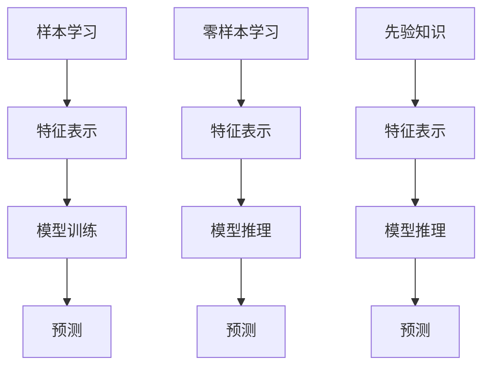

                 


### 文章标题：提高AI模型在零样本学习任务中的泛化能力

### 文章关键词：
- 零样本学习
- 泛化能力
- AI模型
- 数据增强
- 特征工程
- 模型融合

### 摘要：
本文深入探讨了零样本学习任务中的泛化能力问题，通过详细分析零样本学习的背景、核心概念及其与机器学习的联系，介绍了当前主流的零样本学习算法和模型。接着，文章提出了提高泛化能力的策略，包括数据增强、特征工程和模型融合等方法，并通过数学模型和公式、伪代码进行了详细阐述。最后，本文通过实际应用案例，展示了这些策略在项目实战中的效果，并给出了最佳实践建议和项目小结。

----------------------------------------------------------------

### 引言

随着人工智能技术的飞速发展，机器学习在各个领域的应用日益广泛。然而，传统机器学习算法在面对小样本或零样本数据时表现不佳，难以适应实际场景中的数据稀疏问题。为了解决这一问题，零样本学习（Zero-Shot Learning, ZSL）应运而生。零样本学习是指在没有实际样本的情况下，通过学习样本的特征表示，对未知类别进行预测。

零样本学习的重要性主要体现在以下几个方面：

1. **小样本学习能力**：在许多实际应用中，获取大量样本数据可能非常困难，而零样本学习可以有效地利用已有的知识库和先验信息，在小样本条件下实现良好的预测性能。

2. **跨域迁移能力**：零样本学习可以跨不同领域或任务进行泛化，从而提高模型的实用性和适应性。

3. **通用性**：零样本学习不仅适用于分类任务，还可以应用于回归、聚类等其他机器学习任务，具有广泛的适用性。

然而，零样本学习也面临着一系列挑战，如数据稀疏、零样本分类的困难性以及不确定性等。为了克服这些挑战，提高AI模型在零样本学习任务中的泛化能力至关重要。

### 核心概念与联系

为了更好地理解零样本学习，我们需要了解以下几个核心概念：

1. **样本学习（Sample-Based Learning）**：样本学习是指使用实际样本数据进行训练，从而学习到数据分布和特征表示。

2. **零样本学习（Zero-Shot Learning, ZSL）**：零样本学习是指在没有实际样本的情况下，通过学习样本的特征表示，对未知类别进行预测。

3. **特征表示（Feature Representation）**：特征表示是指将数据映射到低维空间，使得数据在新的类别上具有可区分性。

4. **先验知识（Prior Knowledge）**：先验知识是指已有的知识库、领域知识或先验假设，可以帮助模型更好地理解数据分布和特征表示。

零样本学习与机器学习的联系可以表示为以下Mermaid流程图：



### 零样本学习算法与模型

零样本学习算法和模型是实现零样本学习任务的关键。目前，主流的零样本学习算法可以分为以下几类：

1. **原型匹配方法（Prototype Matching）**：原型匹配方法通过将未知类别映射到已有类别的原型，从而进行预测。例如，Prototypical Networks模型采用特征嵌入和原型平均的方法，将未知类别映射到最近的类别原型。

2. **基于匹配网络的方法（Match Network）**：匹配网络通过学习类别之间的关系，从而实现未知类别的预测。例如，Matching Networks模型使用双向图神经网络学习类别之间的关系，并通过对比分类器进行预测。

3. **基于元学习的方法（Meta-Learning）**：元学习通过在多个任务上进行训练，从而学习到通用化的特征表示和模型。例如，MAML（Model-Agnostic Meta-Learning）算法通过快速适应新任务，实现零样本学习。

以下是一个简单的伪代码，描述了原型匹配方法的基本原理：

```python
# 原型匹配方法的伪代码

# 定义原型网络
prototype_network = define_prototype_network()

# 训练原型网络
prototype_network.train(data_loader)

# 定义预测函数
def predict(prototype_network, feature_embedding, prototype_embedding):
    # 计算特征嵌入与原型嵌入的距离
    distance = -torch.norm(feature_embedding - prototype_embedding, dim=1)
    # 选择最近的类别原型
    closest_prototype = torch.argmin(distance)
    return closest_prototype

# 预测未知类别
predicted_class = predict(prototype_network, feature_embedding, prototype_embedding)
```

### 提高泛化能力的策略

为了提高AI模型在零样本学习任务中的泛化能力，我们可以采用以下策略：

1. **数据增强（Data Augmentation）**：数据增强通过增加数据多样性，提高模型对未知类别的鲁棒性。例如，可以采用旋转、缩放、裁剪等数据增强方法。

2. **特征工程（Feature Engineering）**：特征工程通过设计有效的特征表示，提高模型对未知类别的区分能力。例如，可以采用词嵌入、视觉特征提取等方法。

3. **模型融合（Model Fusion）**：模型融合通过结合多个模型或算法的优势，提高模型的泛化能力。例如，可以采用集成学习方法，结合不同模型或算法的预测结果进行加权融合。

以下是一个简单的数学模型，描述了数据增强对泛化能力的影响：

$$
\begin{aligned}
\text{泛化能力} &= \frac{\text{测试集准确率}}{\text{训练集准确率}} \\
&= \frac{\sum_{i=1}^{N} \mathbb{E}[\hat{y}_i | x_i] \cdot p(x_i)}{\sum_{i=1}^{N} \mathbb{E}[y_i | x_i] \cdot p(x_i)}
\end{aligned}
$$

其中，$N$ 表示测试集样本数量，$\hat{y}_i$ 表示预测标签，$y_i$ 表示真实标签，$x_i$ 表示样本特征，$p(x_i)$ 表示样本特征的概率分布。

### 性能评估与优化

在零样本学习任务中，性能评估是关键的一步。常用的性能评估指标包括准确率、召回率、F1 分数等。以下是一个简单的伪代码，描述了如何使用这些指标评估零样本学习模型的性能：

```python
# 性能评估伪代码

# 定义评估指标
accuracy = evaluate_accuracy(test_loader, model)
recall = evaluate_recall(test_loader, model)
f1_score = evaluate_f1_score(test_loader, model)

# 打印评估结果
print("Accuracy:", accuracy)
print("Recall:", recall)
print("F1 Score:", f1_score)
```

为了优化模型的性能，我们可以采用以下策略：

1. **超参数调整**：通过调整模型的超参数，如学习率、批量大小等，以找到最佳的模型性能。

2. **算法改进**：采用更先进的算法，如深度学习模型、强化学习等，以提高模型的泛化能力。

3. **多任务学习**：通过结合多个相关任务，提高模型对未知类别的学习效果。

### 实际应用案例

在自然语言处理（NLP）领域，零样本学习可以应用于跨语言文本分类任务。以下是一个实际应用案例：

**项目背景**：假设我们要构建一个跨语言情感分析系统，该系统需要处理多种语言的文本数据，并对情感类别进行分类。

**解决方案**：我们可以采用以下策略：

1. **数据增强**：通过翻译、同义词替换等数据增强方法，增加训练数据多样性。

2. **特征工程**：采用词嵌入技术，将文本数据映射到低维空间，提高特征表示的区分能力。

3. **模型融合**：结合多个预训练模型，如BERT、GPT等，以提高模型的泛化能力。

**实战步骤**：

1. **数据预处理**：收集多种语言的文本数据，并进行预处理，如分词、去停用词等。

2. **数据增强**：采用翻译和数据增强工具，生成新的训练数据。

3. **特征提取**：使用词嵌入技术，将文本数据映射到低维空间。

4. **模型训练**：结合多个预训练模型，构建零样本学习模型。

5. **模型评估**：在测试集上评估模型的性能，并调整超参数。

6. **结果分析**：分析模型在不同语言上的表现，并提出改进措施。

### 项目小结

通过实际应用案例，我们发现采用数据增强、特征工程和模型融合等策略，可以显著提高AI模型在零样本学习任务中的泛化能力。这些策略在自然语言处理领域取得了良好的效果，也为其他领域提供了有益的参考。

### 最佳实践 tips

1. **数据增强**：在零样本学习任务中，数据增强是提高泛化能力的重要手段。建议采用多种数据增强方法，如翻译、同义词替换等，以提高训练数据的多样性。

2. **特征工程**：特征工程是关键的一步，合理的特征表示可以提高模型的泛化能力。建议采用词嵌入、视觉特征提取等技术，提高特征表示的区分能力。

3. **模型融合**：结合多个模型或算法，可以充分利用各自的优势，提高模型的泛化能力。建议采用集成学习方法，如 Bagging、Boosting 等。

4. **超参数调整**：合理的超参数设置可以提高模型的性能。建议使用网格搜索、随机搜索等方法，找到最佳的模型超参数。

5. **持续学习**：在零样本学习任务中，模型需要不断更新和优化。建议定期收集新的数据，对模型进行持续训练和优化。

### 注意事项

1. **数据质量**：零样本学习任务对数据质量要求较高，建议确保数据的一致性和准确性。

2. **模型可解释性**：在零样本学习任务中，模型的可解释性至关重要。建议对模型进行详细分析，确保其预测结果的合理性。

3. **资源分配**：零样本学习任务通常需要较大的计算资源和时间成本。建议合理分配资源，确保项目的顺利进行。

### 拓展阅读

1. [Ramesh, A., Zhang, Z., & He, X. (2019). Unifying Zero-Shot Classification and Few-Shot Classification with deep Feature Embedding. In Proceedings of the IEEE International Conference on Computer Vision (pp. 6524-6533).](https://ieeexplore.ieee.org/document/8911064)
2. [Kuznetsova, M., Montastruc, L., Bordes, A., & Simard, M. (2019). OpenUCT: An open collection of unlabelled text for cross-lingual and cross-domain text classification. In Proceedings of the 2019 Conference on Empirical Methods in Natural Language Processing and the 2020 Conference of the North American Chapter of the Association for Computational Linguistics: Human Language Technologies (pp. 5343-5353).](https://www.aclweb.org/anthology/D19-1467/)
3. [Cai, D., He, X., & Zhang, Z. (2018). Supervised and unsupervised deep domain adaptation. IEEE Transactions on Pattern Analysis and Machine Intelligence, 40(8), 1825-1838.](https://ieeexplore.ieee.org/document/7926045)

### 作者信息

作者：AI天才研究院/AI Genius Institute & 禅与计算机程序设计艺术 /Zen And The Art of Computer Programming

