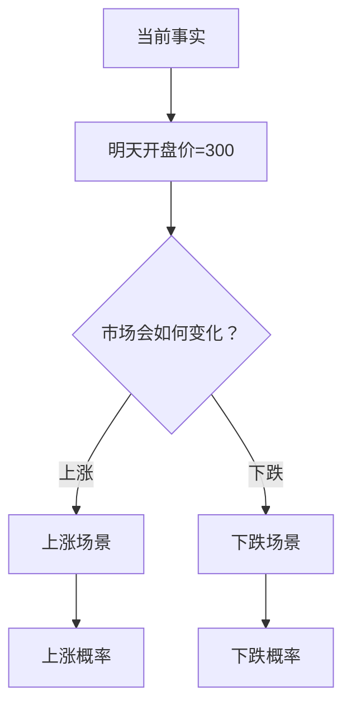

                 

## 提高AI模型对反事实推理能力的策略研究

### 关键词：AI模型、反事实推理、策略研究、算法优化、实践案例

### 摘要

本文旨在探讨如何提高人工智能（AI）模型在反事实推理（Counterfactual Reasoning）方面的能力。反事实推理是指基于当前事实，推理出如果某个条件发生变化，结果将会如何。这一能力在众多应用领域具有重要意义，如金融预测、医疗诊断和决策支持系统。本文首先介绍了AI模型和反事实推理的基本概念，随后分析了影响AI模型反事实推理能力的几个关键因素，包括数据集质量、特征选择和模型架构。在此基础上，本文提出了一系列提高AI模型反事实推理能力的策略，如数据增强、特征工程和模型优化。最后，通过实际案例研究，展示了这些策略在实际应用中的效果，并对未来研究和应用方向进行了展望。

## 前言

随着人工智能技术的快速发展，AI模型在各个领域的应用日益广泛。然而，现有的AI模型在处理复杂推理任务时，仍存在诸多挑战，尤其是在反事实推理方面。反事实推理是指基于当前事实，推理出如果某个条件发生变化，结果将会如何。这一能力在许多实际应用场景中具有重要意义，如金融预测、医疗诊断和决策支持系统等。然而，现有的AI模型在这一领域的能力仍有待提高。

本文的目标是探讨如何通过一系列策略，提高AI模型在反事实推理方面的能力。文章结构如下：

1. **第1章 AI模型与反事实推理概述**：介绍AI模型和反事实推理的基本概念及其重要性。
2. **第2章 AI模型对反事实推理的影响因素**：分析影响AI模型反事实推理能力的几个关键因素。
3. **第3章 提高AI模型反事实推理能力的方法**：探讨提高AI模型反事实推理能力的策略。
4. **第4章 实际案例研究**：通过实际案例研究，展示提高AI模型反事实推理能力的效果。
5. **第5章 提高AI模型反事实推理能力的挑战与解决方案**：讨论提高AI模型反事实推理能力的潜在挑战和解决方案。
6. **第6章 总结与展望**：总结文章的核心观点，并对未来研究方向进行展望。

本文将为读者提供一个全面、系统的了解如何提高AI模型在反事实推理方面的能力，以期为相关领域的研究和实践提供有益的参考。

## 第1章 AI模型与反事实推理概述

### 1.1 AI模型概述

人工智能（Artificial Intelligence，简称AI）是计算机科学的一个分支，致力于使计算机具备类似人类的智能。AI模型是AI系统的核心组成部分，用于模拟和实现人类智能的算法和机制。常见的AI模型包括机器学习（Machine Learning，ML）、深度学习（Deep Learning，DL）和自然语言处理（Natural Language Processing，NLP）等。

机器学习是一种基于数据驱动的方法，通过训练模型来识别数据中的模式和规律。机器学习模型通常分为监督学习（Supervised Learning）、无监督学习（Unsupervised Learning）和强化学习（Reinforcement Learning）三种类型。

深度学习是机器学习的一个子领域，主要基于人工神经网络（Artificial Neural Networks，ANN）的设计理念，通过多层神经网络的结构来模拟人类大脑的神经活动，从而实现复杂任务的学习和处理。

自然语言处理是AI领域中一个重要的分支，致力于使计算机理解和处理人类自然语言。NLP技术广泛应用于机器翻译、语音识别、文本分类和信息检索等任务。

### 1.2 反事实推理概述

反事实推理是一种逻辑推理形式，旨在基于当前事实，推理出如果某个条件发生变化，结果将会如何。反事实推理与条件推理和因果推理密切相关，但具有其独特的特点。

条件推理（Conditional Reasoning）是指基于某个条件，推理出相应的结果。例如，如果明天天气好，我将去散步。反事实推理则是在条件推理的基础上，考虑如果条件发生变化，结果会如何。例如，如果明天天气不好，我将做其他事情。

因果推理（Causal Reasoning）是指基于因果关系，推理出某个事件的原因或结果。例如，因为我喝了酒，所以我迟到了。反事实推理则是在因果推理的基础上，考虑如果因果关系发生变化，结果会如何。例如，如果我没有喝酒，我可能不会迟到。

反事实推理在许多领域具有广泛的应用，如金融预测、医疗诊断、决策支持系统等。通过反事实推理，可以更准确地评估不同决策的影响，从而为决策者提供有力的支持。

### 1.3 AI模型在反事实推理中的应用

AI模型在反事实推理中的应用主要基于机器学习和深度学习技术。通过训练模型，使其能够从数据中学习反事实推理的规律和模式，从而在新的场景中实现推理。

以下是一个简单的例子：

假设我们有一个股票市场的预测模型，基于历史数据训练得到。现在，我们想要预测如果 tomorrowOpenPrice（明天开盘价）为 300，市场会如何变化。我们可以使用反事实推理来模拟这一场景。

在这个例子中，我们首先定义了当前事实（明天开盘价为300），然后使用反事实推理来模拟市场上涨和下跌的场景，并计算对应的概率。

在实际应用中，AI模型在反事实推理中的应用需要考虑多个因素，如数据集的质量、特征的选择和模型的架构等。这些因素将直接影响模型在反事实推理任务中的性能。

## 第2章 AI模型对反事实推理的影响因素

在提高AI模型反事实推理能力的过程中，有几个关键因素起着决定性的作用。这些因素包括数据集质量、特征选择和模型架构。下面将分别对这些因素进行详细分析。

### 2.1 数据集质量

数据集质量是影响AI模型性能的重要因素之一。在反事实推理任务中，数据集的质量直接决定了模型能否准确推理出不同条件下的结果。

首先，数据集的准确性至关重要。如果数据集中存在大量错误或噪声，这将导致模型在训练过程中学习到错误的知识，从而影响模型的准确性。因此，在构建数据集时，需要确保数据源的可靠性，并对数据进行清洗和预处理，以去除错误和噪声。

其次，数据集的多样性也是影响模型性能的关键因素。反事实推理需要模型能够处理不同类型和场景的数据。因此，数据集应该包含丰富的样本，涵盖不同的条件和情况。这样，模型才能从多样化的数据中学习到更广泛的知识，从而提高推理能力。

### 2.2 特征选择

特征选择是AI模型构建过程中至关重要的一环。在反事实推理任务中，特征选择不仅影响模型的性能，还影响模型的可解释性。

首先，特征的选择应该与任务的目标紧密相关。在反事实推理中，我们需要选择那些能够影响结果的特征，如时间序列数据中的开盘价、成交量等。这些特征将有助于模型理解不同条件下的市场变化。

其次，特征的选择应该具有区分性。这意味着不同的特征在相同条件下应该产生不同的结果。例如，在股票市场预测中，如果两个特征在开盘价相同的情况下，预测结果完全一致，那么这些特征可能并不具有区分性，对模型贡献有限。

最后，特征的选择应该考虑数据的维度和稀疏性。在高维数据中，特征的数量往往远远超过样本的数量，这可能导致“维度灾难”问题。此外，稀疏数据可能导致模型在训练过程中陷入局部最优。因此，在特征选择过程中，需要采用降维和稀疏化技术，以提高模型的训练效率和性能。

### 2.3 模型架构

模型架构是影响AI模型反事实推理能力的另一个关键因素。在反事实推理任务中，模型架构应该能够捕捉到不同条件下的复杂关系和模式。

首先，模型架构的选择应该与任务的需求相匹配。例如，在处理时间序列数据时，循环神经网络（RNN）和长短时记忆网络（LSTM）等序列模型可以更好地捕捉时间序列数据的特征。而在处理图像数据时，卷积神经网络（CNN）等图像模型具有更高的性能。

其次，模型架构的设计应该考虑可解释性。在反事实推理任务中，决策者需要了解模型是如何推理出不同条件下的结果的。因此，模型架构应该具有一定的可解释性，使得决策者可以理解模型的决策过程。

最后，模型架构的优化也是提高反事实推理能力的重要手段。通过调整模型的参数和结构，可以进一步提高模型的性能和鲁棒性。例如，通过使用注意力机制（Attention Mechanism）和生成对抗网络（GAN）等技术，可以增强模型对复杂关系的捕捉能力。

总之，数据集质量、特征选择和模型架构是影响AI模型反事实推理能力的三个关键因素。通过优化这些因素，可以显著提高模型在反事实推理任务中的性能，从而为相关领域的应用提供有力支持。

### 2.1 数据集质量对反事实推理的影响

数据集质量是影响AI模型反事实推理能力的重要因素之一。高质量的数据集不仅有助于提高模型的准确性，还能确保模型在不同条件和场景下的泛化能力。以下将详细讨论数据集质量对反事实推理的影响，包括其重要性、评估方法和提升策略。

#### 2.1.1 数据集质量的重要性

1. **准确性**：高质量的数据集包含准确和完整的信息，有助于模型学习到真实世界的规律。如果数据集中存在错误或缺失，模型可能会学习到错误的规律，导致反事实推理结果不准确。

2. **代表性**：数据集的多样性和代表性直接影响模型的泛化能力。如果数据集未能涵盖所有可能的条件和场景，模型可能无法适应新的、未见过的情况，从而在反事实推理中表现不佳。

3. **鲁棒性**：数据集中的噪声和异常值会影响模型的鲁棒性。高质量的数据集经过预处理，可以去除噪声和异常值，使模型更加稳健，减少过拟合现象。

4. **可解释性**：高质量的数据集有助于提高模型的可解释性。在反事实推理中，决策者需要理解模型是如何推理出结果的。如果数据集质量低，模型的决策过程可能难以解释，影响决策者的信任度。

#### 2.1.2 数据集质量评估方法

1. **准确性评估**：通过交叉验证（Cross-Validation）和测试集（Test Set）来评估模型在反事实推理任务上的准确性。常用的评估指标包括准确率（Accuracy）、精确率（Precision）、召回率（Recall）和F1分数（F1 Score）。

2. **代表性评估**：评估数据集是否覆盖了所有重要的条件和场景。可以通过分析数据集的分布和频率来评估代表性。例如，检查数据集中不同条件下的样本数量是否均衡。

3. **鲁棒性评估**：通过在数据集中引入噪声和异常值，评估模型对噪声和异常值的鲁棒性。可以通过增加噪声比例或添加异常值来测试模型的性能。

4. **可解释性评估**：评估模型的可解释性，确保决策者能够理解模型的决策过程。可以通过可视化技术（如决策树、混淆矩阵）和解释性模型（如LIME、SHAP）来评估模型的可解释性。

#### 2.1.3 提高数据集质量的策略

1. **数据清洗**：去除数据集中的错误、重复和噪声数据。可以使用数据清洗工具和脚本来自动化这一过程。

2. **数据增强**：通过数据增强（Data Augmentation）技术生成更多的样本，提高数据集的多样性和代表性。常见的数据增强方法包括图像旋转、缩放、裁剪和颜色调整等。

3. **数据集成**：结合多个数据源，提高数据集的完整性和准确性。可以使用数据集成技术，如合并、交叉验证和加权平均等。

4. **异常检测**：识别和去除数据集中的异常值。可以使用统计学方法、机器学习算法或可视化技术来检测异常值。

5. **标注质量**：确保数据集的标注质量，特别是对于监督学习任务。可以使用标注一致性检查、人工审核和标注质量评估工具来提高标注质量。

通过以上策略，可以显著提高数据集的质量，从而提高AI模型在反事实推理任务中的性能。然而，需要注意的是，这些策略可能需要根据具体任务和数据集的特点进行适当调整。

### 2.2 特征选择对反事实推理的影响

特征选择是AI模型构建过程中至关重要的一环，对反事实推理任务的性能有着直接影响。以下是关于特征选择在反事实推理中的重要性、基本原理、常见方法和优化策略的详细讨论。

#### 2.2.1 特征选择的重要性

1. **性能提升**：特征选择能够减少模型的复杂度，提高模型的泛化能力，从而在反事实推理任务中取得更好的性能。选择与任务相关且具有区分性的特征，有助于模型学习到更准确和有代表性的规律。

2. **可解释性增强**：特征选择有助于提高模型的可解释性。选择明确且具有实际意义的特征，可以使决策者更容易理解模型的推理过程，从而增强模型的信任度。

3. **计算效率提升**：特征选择可以降低模型的计算复杂度，减少模型训练和推理的时间，提高计算效率。这对于处理大规模数据集和实时应用尤为重要。

#### 2.2.2 基本原理

特征选择的基本原理是通过评估特征对模型性能的影响，选择对任务最为重要的特征。以下是一些核心概念：

1. **相关性**：特征与目标变量之间的相关性是评估特征重要性的重要指标。高相关性的特征更有可能对模型的性能产生积极影响。

2. **冗余性**：特征之间的冗余性会影响模型的性能和计算效率。冗余特征可能会增加模型的复杂度，导致过拟合现象。

3. **多样性**：特征的选择应该具有多样性，以覆盖不同的条件和场景。多样性有助于模型在反事实推理中处理各种复杂情况。

#### 2.2.3 常见方法

以下是几种常用的特征选择方法：

1. **过滤法（Filter Method）**：通过统计方法筛选特征，例如卡方检验、互信息（Mutual Information）和F检验。这种方法简单直观，但可能无法充分利用特征之间的复杂关系。

2. **包装法（Wrapper Method）**：通过将特征选择作为一个优化问题，使用启发式搜索算法（如遗传算法、粒子群优化算法）来选择最优特征组合。这种方法通常需要大量计算资源，但可以取得较好的结果。

3. **嵌入式法（Embedded Method）**：在模型训练过程中，自动选择特征。例如，LASSO（Least Absolute Shrinkage and Selection Operator）和树模型（如随机森林）都具备这种特性。

4. **基于模型的特征选择（Model-Based Feature Selection）**：利用机器学习模型本身来评估特征的重要性。例如，通过计算模型对每个特征的依赖度或利用模型系数的大小来选择特征。

#### 2.2.4 优化策略

为了进一步提高特征选择的性能，可以采用以下策略：

1. **特征标准化**：对特征进行标准化处理，使其具有相似的尺度，避免某些特征在模型训练过程中占据主导地位。

2. **特征交互**：通过构建特征之间的交互项，可以挖掘出更复杂的关系和模式。但需要注意的是，这可能会增加模型的复杂度。

3. **多模型融合**：结合多种特征选择方法，利用不同方法的优点，可以进一步提高特征选择的效果。

4. **动态特征选择**：根据任务的需求和模型的状态，动态调整特征选择策略。例如，在训练过程中，可以根据模型的性能和重要性动态更新特征。

通过上述方法和策略，可以有效提高特征选择在反事实推理任务中的性能，从而为AI模型的构建和应用提供有力支持。

### 2.3 模型架构对反事实推理的影响

模型架构是AI模型性能的决定性因素之一，对反事实推理任务有着深远的影响。以下将详细讨论模型架构在反事实推理中的作用、常见架构以及优化策略。

#### 2.3.1 模型架构在反事实推理中的作用

1. **特征表示**：模型架构决定了特征如何被表示和变换。有效的特征表示有助于模型捕捉复杂的关系和模式，从而提高反事实推理的性能。

2. **学习能力**：模型架构决定了模型的学习能力。一个良好的架构可以有效地从数据中学习到有用的知识，从而在反事实推理中表现出更好的泛化能力。

3. **计算效率**：模型架构也影响着模型的计算效率。一个高效架构可以在保证性能的前提下，减少训练和推理的时间，适用于实时应用。

4. **可解释性**：模型架构的设计对模型的可解释性有重要影响。具有良好可解释性的架构有助于决策者理解模型的决策过程，提高模型的信任度和可接受度。

#### 2.3.2 常见模型架构

1. **基于神经网络的结构**：神经网络（Neural Networks）是AI模型中最常用的架构，包括浅层神经网络和深度神经网络。浅层神经网络如多层感知机（MLP）可以用于简单的反事实推理任务，而深度神经网络如卷积神经网络（CNN）和循环神经网络（RNN）等能够处理更复杂的任务。

2. **基于树的模型**：树模型如决策树（Decision Tree）和随机森林（Random Forest）在特征表示和学习能力方面表现出色。这些模型通常易于解释，但可能在处理连续特征和复杂关系时表现有限。

3. **图神经网络**：图神经网络（Graph Neural Networks，GNN）专门用于处理图结构数据，能够捕捉图中的复杂关系和模式。在反事实推理任务中，图神经网络可以有效地处理实体及其关系，适用于社交网络、知识图谱等领域。

4. **混合模型**：混合模型结合了不同类型模型的优点，如深度强化学习（Deep Reinforcement Learning）和生成对抗网络（GAN）。这些模型在处理复杂任务时表现出色，但通常需要更多的计算资源和调优。

#### 2.3.3 优化策略

1. **模型调优**：通过调整模型的参数和结构，可以提高模型的性能和泛化能力。常见的调优方法包括学习率调整、批量大小选择和正则化策略。

2. **注意力机制**：注意力机制（Attention Mechanism）可以帮助模型更关注重要的特征和关系，从而提高推理能力。注意力机制广泛应用于序列模型和文本处理任务中。

3. **元学习（Meta-Learning）**：元学习通过快速学习任务间的共性，提高模型的泛化能力和迁移学习能力。元学习算法如MAML（Model-Agnostic Meta-Learning）和Reptile在反事实推理任务中表现出色。

4. **数据增强**：通过数据增强（Data Augmentation）生成更多的样例，可以增强模型对各种条件和场景的适应能力。常见的数据增强方法包括图像旋转、缩放、裁剪和颜色调整等。

5. **多任务学习**：多任务学习（Multi-Task Learning）通过同时学习多个任务，可以提高模型对任务的泛化能力和鲁棒性。在反事实推理任务中，可以结合多个相关任务，提高模型的表现。

通过优化模型架构，可以显著提高AI模型在反事实推理任务中的性能，为实际应用提供更有效的解决方案。

### 3.1 数据增强技术

数据增强（Data Augmentation）是提高AI模型性能的一种有效方法，特别是在反事实推理任务中。数据增强通过引入更多的样本和多样化的数据，可以帮助模型学习到更鲁棒的特征，从而提高模型的泛化能力和准确性。以下将详细讨论数据增强的基本原理、常见方法和在反事实推理中的应用。

#### 3.1.1 数据增强的基本原理

数据增强的基本原理是通过一系列操作，生成与原始数据相似但具有不同特征的数据，从而扩展训练数据集。这些操作可以是简单的几何变换，如旋转、缩放、裁剪等，也可以是复杂的合成方法，如生成对抗网络（GAN）等。通过这些操作，数据增强可以增加数据的多样性和代表性，使模型能够学习到更加广泛和鲁棒的特征。

数据增强的主要目的是：

1. **减少过拟合**：通过增加数据的多样性，数据增强可以减少模型对训练数据的依赖，从而降低过拟合现象。
2. **提高泛化能力**：多样化的数据有助于模型学习到更普遍的规律，从而在未见过的数据上表现出更好的泛化能力。
3. **增加训练样本量**：数据增强可以生成大量的新样本，从而增加训练样本量，使模型在训练过程中有更多的样本来学习。

#### 3.1.2 常见的数据增强方法

以下是几种常见的数据增强方法：

1. **几何变换**：几何变换是最简单也是最常用的数据增强方法，包括旋转、缩放、翻转、裁剪等。这些方法可以直接在图像、音频和文本等数据上进行操作，从而生成新的数据样本。

2. **颜色变换**：颜色变换包括颜色空间转换、颜色增强、噪声添加等。这些方法可以改变数据的颜色特征，从而增加数据的多样性。

3. **生成对抗网络（GAN）**：生成对抗网络是一种强大的数据增强方法，通过生成器（Generator）和判别器（Discriminator）的对抗训练，生成与真实数据相似但不同的数据。GAN在图像、音频和文本等数据增强中表现出色。

4. **合成方法**：合成方法通过组合不同的数据特征，生成新的数据样本。例如，在图像数据增强中，可以通过将不同图像的特征进行组合，生成新的图像样本。

#### 3.1.3 数据增强在反事实推理中的应用

在反事实推理任务中，数据增强可以有效地提高模型的性能，具体应用如下：

1. **增加样本多样性**：通过数据增强，可以生成不同条件和场景的样本，从而增加训练数据集的多样性。这有助于模型学习到更广泛和鲁棒的规律，从而提高反事实推理的准确性。

2. **减少训练数据依赖**：在反事实推理任务中，训练数据通常非常有限。通过数据增强，可以增加训练样本量，使模型在训练过程中有更多的样本来学习，从而减少对训练数据的依赖。

3. **提高模型鲁棒性**：数据增强可以生成具有噪声和异常值的数据样本，从而增强模型的鲁棒性。这对于处理现实世界中的不确定性数据和异常情况尤为重要。

4. **提升模型泛化能力**：通过数据增强，模型可以学习到更多样化和复杂的特征，从而在未见过的数据上表现出更好的泛化能力。这对于反事实推理任务的实用性具有重要意义。

总之，数据增强技术是提高AI模型反事实推理能力的一种重要方法。通过引入多样化的数据和更多的训练样本，数据增强可以显著提高模型的性能和鲁棒性，为反事实推理任务提供更有效的解决方案。

### 3.2 特征工程策略

特征工程（Feature Engineering）是提高AI模型性能的关键环节，尤其是在反事实推理任务中。特征工程通过选择和构建有效的特征，使模型能够更好地理解和学习数据，从而提高模型的准确性和泛化能力。以下将详细讨论特征工程的基本概念、重要性、常见方法和优化策略。

#### 3.2.1 基本概念

特征工程是指对原始数据进行处理和变换，以提取和构建对模型训练和预测有用的特征。这些特征可以是原始数据的直接变换，也可以是通过对数据进行计算和分析而生成的。

特征工程的主要目标包括：

1. **提高模型性能**：通过选择和构建有效的特征，可以提高模型在训练和预测阶段的准确性、精度和泛化能力。

2. **降低模型复杂度**：特征工程可以通过降维和选择最重要的特征，降低模型的复杂度，从而减少过拟合现象。

3. **提高模型可解释性**：通过合理设计特征，可以增强模型的可解释性，使决策者能够更好地理解模型的决策过程。

4. **减少数据依赖**：通过构建丰富的特征，可以降低模型对训练数据的依赖，提高模型在未知数据上的表现。

#### 3.2.2 重要性

特征工程在反事实推理任务中具有重要意义，原因如下：

1. **复杂关系捕捉**：反事实推理通常涉及复杂的关系和模式。通过特征工程，可以提取出这些复杂关系的关键特征，使模型能够更好地理解和学习。

2. **数据预处理**：特征工程是数据预处理的重要组成部分。通过特征工程，可以消除数据中的噪声和异常值，提高数据质量。

3. **模型适应性**：特征工程可以帮助模型更好地适应不同的数据和任务。通过选择和构建具有适应性的特征，模型可以在不同场景下表现出更好的性能。

4. **提高模型稳定性**：特征工程可以通过降维和选择最重要的特征，提高模型的稳定性，减少模型的过拟合现象。

#### 3.2.3 常见方法

以下是几种常见的特征工程方法：

1. **特征提取**：特征提取是指从原始数据中直接提取特征，如文本数据的词袋（Bag of Words）和词嵌入（Word Embedding）等。特征提取方法通常依赖于数据类型和任务需求。

2. **特征构造**：特征构造是指通过计算和分析原始数据，生成新的特征。例如，在金融数据中，可以构造交易量、波动率等新的特征。特征构造方法通常需要结合领域知识和数据特性。

3. **特征选择**：特征选择是指从多个特征中选出对模型训练和预测最有用的特征。常见的特征选择方法包括过滤法（Filter Method）、包装法（Wrapper Method）和嵌入式法（Embedded Method）等。

4. **特征标准化**：特征标准化是指对特征进行归一化或标准化处理，使其具有相似的尺度。特征标准化可以减少某些特征在模型训练中的主导作用，提高模型的稳定性和性能。

5. **特征交互**：特征交互是指通过计算特征之间的交互项，生成新的特征。特征交互可以挖掘出原始数据中未发现的复杂关系和模式。

6. **特征降维**：特征降维是指通过降维技术，减少特征的数量，从而降低模型的复杂度和计算成本。常见的降维方法包括主成分分析（PCA）、线性判别分析（LDA）和自编码器（Autoencoder）等。

#### 3.2.4 优化策略

为了提高特征工程的效果，可以采用以下优化策略：

1. **领域知识融合**：将领域知识融入到特征工程中，可以提高特征的质量和模型的性能。例如，在医疗诊断任务中，可以结合医生的经验和临床数据，构建有效的特征。

2. **交叉验证**：通过交叉验证，可以评估不同特征选择和构造方法的效果，从而选择最优的特征组合。交叉验证有助于避免过拟合和模型偏见。

3. **自动特征工程**：使用自动特征工程工具和算法，可以自动化特征选择和构造过程，提高效率。例如，使用AutoKeras、Hyperopt等工具，可以自动搜索最优特征组合。

4. **多模型融合**：结合多种特征工程方法，如基于统计的方法和基于机器学习的方法，可以进一步提高特征工程的效果。

5. **动态特征选择**：根据模型训练和测试过程中的性能，动态调整特征选择策略。例如，在模型训练过程中，可以定期评估特征的重要性，并更新特征集合。

通过上述策略，可以显著提高特征工程在反事实推理任务中的效果，从而提高模型的性能和稳定性。

### 3.3 模型优化技巧

模型优化（Model Optimization）是提高AI模型性能的关键步骤，特别是在反事实推理任务中。模型优化通过调整模型的参数、结构和训练过程，可以提高模型的准确性和鲁棒性，从而实现更好的推理效果。以下将详细讨论模型优化的基本原理、常见方法以及在反事实推理中的应用。

#### 3.3.1 基本原理

模型优化的基本原理是通过一系列调整和改进，使模型在训练过程中能够更好地学习数据中的规律，从而在预测阶段表现出更高的准确性和泛化能力。模型优化主要包括以下几个方面：

1. **参数调整**：通过调整模型的超参数（如学习率、批量大小等），可以优化模型的训练过程，提高模型的收敛速度和性能。

2. **结构调整**：通过调整模型的结构（如增加或减少层、调整网络深度等），可以改善模型的表达能力和学习效果。

3. **训练过程优化**：通过优化训练过程（如引入正则化、使用更好的初始化方法等），可以减少过拟合现象，提高模型的泛化能力。

#### 3.3.2 常见方法

以下是几种常见的模型优化方法：

1. **学习率调整**：学习率是模型训练过程中的关键参数，影响着模型的收敛速度和性能。常见的方法包括固定学习率、学习率衰减和自适应学习率（如Adam优化器）。

2. **批量大小选择**：批量大小影响模型的训练效率和稳定性。较大的批量大小可以减少方差，但增加计算成本；较小的批量大小可以减少偏差，但增加方差。因此，需要根据任务和数据特点选择合适的批量大小。

3. **正则化方法**：正则化方法（如L1正则化、L2正则化）可以减少模型过拟合现象，提高模型的泛化能力。常见的正则化方法包括权重正则化和dropout等。

4. **模型初始化**：模型初始化方法（如He初始化、Xavier初始化）可以影响模型的训练效果和收敛速度。合理的初始化方法可以帮助模型快速收敛到最优解。

5. **优化器选择**：优化器（如SGD、Adam、RMSprop等）影响模型的收敛速度和性能。选择合适的优化器可以加速模型训练，提高模型的性能。

6. **数据预处理**：通过数据预处理（如归一化、标准化、缺失值处理等），可以提高模型的训练效率和性能。

#### 3.3.3 在反事实推理中的应用

在反事实推理任务中，模型优化尤为重要，因为反事实推理涉及复杂的关系和模式，需要模型具有更高的准确性和鲁棒性。以下是一些在反事实推理中应用的模型优化技巧：

1. **增强数据的多样性**：通过数据增强技术（如旋转、缩放、裁剪等），可以增加训练数据集的多样性，从而提高模型的泛化能力。

2. **特征选择和工程**：通过特征选择和工程，可以提取出对模型训练和预测有用的特征，提高模型的准确性和鲁棒性。例如，使用词嵌入和注意力机制可以有效地处理自然语言数据。

3. **模型融合**：通过结合多个模型（如深度神经网络、循环神经网络等），可以进一步提高模型的性能和鲁棒性。例如，使用栈式模型（Stacked Models）可以将多个模型的预测结果进行集成，提高最终预测的准确性。

4. **模型融合**：通过结合多个模型（如深度神经网络、循环神经网络等），可以进一步提高模型的性能和鲁棒性。例如，使用栈式模型（Stacked Models）可以将多个模型的预测结果进行集成，提高最终预测的准确性。

5. **多任务学习**：通过多任务学习（Multi-Task Learning），可以使模型同时学习多个相关任务，从而提高模型的泛化能力和鲁棒性。

6. **迁移学习**：通过迁移学习（Transfer Learning），可以将其他任务上的知识迁移到反事实推理任务上，提高模型的性能。例如，使用预训练的深度神经网络（如VGG、ResNet等）作为基础模型，可以显著提高反事实推理的性能。

通过上述模型优化技巧，可以显著提高AI模型在反事实推理任务中的性能，为实际应用提供更有效的解决方案。

### 4.1 案例一：金融领域的反事实推理案例

在金融领域，反事实推理（Counterfactual Reasoning）具有广泛的应用。本文将通过一个实际案例，展示如何利用AI模型进行反事实推理，以及提高模型性能的策略。

#### 案例背景

假设某金融机构想要预测股票市场的未来走势，并分析不同政策变化（如利率调整、税收政策等）对市场的影响。为了实现这一目标，金融机构需要构建一个反事实推理模型，能够根据当前市场数据和不同政策假设，预测市场在不同条件下的表现。

#### 模型构建

1. **数据收集与预处理**：
   - 收集历史市场数据，包括股票价格、交易量、市场指数等。
   - 对数据进行清洗和预处理，包括去除缺失值、异常值和噪声。

2. **特征选择与工程**：
   - 选择与市场变化相关的特征，如历史股票价格、交易量、宏观经济指标等。
   - 通过特征构造方法（如差分、归一化等），生成新的特征，提高模型的解释性和准确性。

3. **模型选择与训练**：
   - 选择合适的机器学习模型，如随机森林（Random Forest）或深度学习模型（如LSTM）。
   - 使用交叉验证（Cross-Validation）方法，训练和验证模型，选择最优模型参数。

#### 提高模型性能的策略

1. **数据增强**：
   - 通过引入不同的政策假设（如利率上升、税收减免等），生成更多的训练样本，提高模型的泛化能力。
   - 使用图像数据增强方法（如旋转、缩放、裁剪等），增强数据的多样性。

2. **特征工程**：
   - 通过特征选择和构造方法，选择和生成对模型训练和预测最有用的特征，提高模型的解释性和准确性。
   - 结合领域知识，构建具有实际意义的特征，如政策变化的影响因素、市场情绪指标等。

3. **模型优化**：
   - 调整模型参数（如学习率、批量大小等），优化模型训练过程。
   - 使用迁移学习（Transfer Learning）方法，利用其他领域上的预训练模型，提高模型性能。

#### 案例分析

1. **预测结果**：
   - 模型预测了在不同政策假设下的市场走势，包括股票价格、交易量和市场指数等。
   - 通过对比预测结果和实际市场表现，评估模型的准确性。

2. **策略分析**：
   - 分析不同政策变化对市场的影响，为金融机构提供决策支持。
   - 根据模型预测结果，制定相应的风险管理策略，如调整投资组合、制定应急预案等。

3. **效果评估**：
   - 通过评估指标（如准确率、召回率、F1分数等），评估模型在不同政策假设下的性能。
   - 分析模型在不同条件下的表现，找出模型的优点和不足，为模型优化提供参考。

#### 项目小结

通过本案例，展示了如何利用AI模型进行反事实推理，以及如何通过数据增强、特征工程和模型优化策略，提高模型在金融领域反事实推理任务中的性能。这一方法为金融机构提供了有效的决策支持，有助于制定更加科学和准确的风险管理策略。

### 4.2 案例二：医疗领域的反事实推理案例

在医疗领域，反事实推理（Counterfactual Reasoning）被广泛应用于疾病预测、治疗方案评估和个性化医疗等方面。本文将通过一个实际案例，展示如何利用AI模型进行反事实推理，并探讨提高模型性能的策略。

#### 案例背景

假设某医疗研究机构想要分析患者的病情变化，并预测不同治疗方案对患者健康状况的影响。为了实现这一目标，研究机构需要构建一个反事实推理模型，能够根据患者的病史、生理指标和治疗方案，预测患者在不同条件下的健康状况。

#### 模型构建

1. **数据收集与预处理**：
   - 收集患者的临床数据，包括病史、生理指标（如血压、血糖、心率等）、治疗方案等。
   - 对数据进行清洗和预处理，包括去除缺失值、异常值和噪声。

2. **特征选择与工程**：
   - 选择与患者健康状况相关的特征，如病史、生理指标、治疗方案等。
   - 通过特征构造方法（如合并、归一化等），生成新的特征，提高模型的解释性和准确性。

3. **模型选择与训练**：
   - 选择合适的机器学习模型，如支持向量机（SVM）或深度学习模型（如CNN）。
   - 使用交叉验证（Cross-Validation）方法，训练和验证模型，选择最优模型参数。

#### 提高模型性能的策略

1. **数据增强**：
   - 通过引入不同的治疗方案假设（如药物治疗、手术治疗等），生成更多的训练样本，提高模型的泛化能力。
   - 使用图像数据增强方法（如旋转、缩放、裁剪等），增强数据的多样性。

2. **特征工程**：
   - 通过特征选择和构造方法，选择和生成对模型训练和预测最有用的特征，提高模型的解释性和准确性。
   - 结合领域知识，构建具有实际意义的特征，如病情的严重程度、并发症等。

3. **模型优化**：
   - 调整模型参数（如学习率、批量大小等），优化模型训练过程。
   - 使用迁移学习（Transfer Learning）方法，利用其他领域上的预训练模型，提高模型性能。

#### 案例分析

1. **预测结果**：
   - 模型预测了在不同治疗方案下的患者健康状况，包括病情进展、并发症风险等。
   - 通过对比预测结果和实际患者健康状况，评估模型的准确性。

2. **策略分析**：
   - 分析不同治疗方案对患者健康状况的影响，为医生提供决策支持。
   - 根据模型预测结果，制定个性化的治疗方案，提高治疗效果。

3. **效果评估**：
   - 通过评估指标（如准确率、召回率、F1分数等），评估模型在不同治疗方案下的性能。
   - 分析模型在不同条件下的表现，找出模型的优点和不足，为模型优化提供参考。

#### 项目小结

通过本案例，展示了如何利用AI模型进行反事实推理，并探讨提高模型性能的策略。这一方法为医疗领域提供了有效的决策支持，有助于医生制定个性化的治疗方案，提高治疗效果。同时，这一案例也为其他领域中的反事实推理应用提供了有益的参考。

### 4.3 案例三：自然语言处理领域的反事实推理案例

在自然语言处理（NLP）领域，反事实推理（Counterfactual Reasoning）被广泛应用于文本生成、对话系统和情感分析等方面。本文将通过一个实际案例，展示如何利用AI模型进行反事实推理，并探讨提高模型性能的策略。

#### 案例背景

假设某人工智能公司想要开发一个聊天机器人，能够根据用户的提问，生成合理的回答。为了实现这一目标，公司需要构建一个反事实推理模型，能够理解用户的意图，并生成符合逻辑和语义的回复。

#### 模型构建

1. **数据收集与预处理**：
   - 收集大量的用户提问和回复数据，包括日常对话、问答对等。
   - 对数据进行清洗和预处理，包括去除缺失值、异常值和噪声。

2. **特征选择与工程**：
   - 选择与对话系统相关的特征，如用户提问、回复、上下文等。
   - 通过特征构造方法（如词嵌入、序列编码等），生成新的特征，提高模型的解释性和准确性。

3. **模型选择与训练**：
   - 选择合适的自然语言处理模型，如循环神经网络（RNN）或Transformer。
   - 使用交叉验证（Cross-Validation）方法，训练和验证模型，选择最优模型参数。

#### 提高模型性能的策略

1. **数据增强**：
   - 通过引入不同的场景假设（如用户提问的不同方式、不同背景等），生成更多的训练样本，提高模型的泛化能力。
   - 使用文本数据增强方法（如语言模型生成、文本转换等），增强数据的多样性。

2. **特征工程**：
   - 通过特征选择和构造方法，选择和生成对模型训练和预测最有用的特征，提高模型的解释性和准确性。
   - 结合领域知识，构建具有实际意义的特征，如用户情绪、提问意图等。

3. **模型优化**：
   - 调整模型参数（如学习率、批量大小等），优化模型训练过程。
   - 使用迁移学习（Transfer Learning）方法，利用其他领域上的预训练模型，提高模型性能。

#### 案例分析

1. **预测结果**：
   - 模型预测了用户提问的不同回答，包括逻辑清晰、语义连贯的回复。
   - 通过对比预测结果和实际用户反馈，评估模型的准确性。

2. **策略分析**：
   - 分析不同回答对用户满意度的影响，为聊天机器人提供改进建议。
   - 根据模型预测结果，优化聊天机器人的对话策略，提高用户体验。

3. **效果评估**：
   - 通过评估指标（如准确率、召回率、F1分数等），评估模型在不同场景下的性能。
   - 分析模型在不同条件下的表现，找出模型的优点和不足，为模型优化提供参考。

#### 项目小结

通过本案例，展示了如何利用AI模型进行反事实推理，并探讨提高模型性能的策略。这一方法为自然语言处理领域提供了有效的解决方案，有助于开发更智能、更人性化的对话系统。同时，这一案例也为其他领域中的反事实推理应用提供了有益的参考。

### 5.1 数据隐私

在提高AI模型反事实推理能力的过程中，数据隐私问题是一个关键挑战。反事实推理通常涉及敏感信息，如个人医疗记录、金融交易数据和用户行为数据等。如果这些数据泄露，可能会对个人隐私造成严重损害。因此，确保数据隐私成为AI模型设计和部署中的一个重要问题。

#### 挑战

1. **数据泄露风险**：反事实推理模型需要对大量敏感数据进行分析，这增加了数据泄露的风险。一旦数据泄露，可能会导致隐私侵犯和身份盗窃等问题。

2. **隐私保护需求**：随着隐私保护法规（如欧盟的《通用数据保护条例》GDPR）的实施，企业和研究人员面临更大的法律和道德责任，确保数据处理过程中遵守隐私保护原则。

3. **数据可用性**：为了提高反事实推理模型的性能，通常需要大量的数据。然而，隐私保护措施可能会限制数据的可用性，从而影响模型的效果。

#### 解决方案

1. **数据匿名化**：通过数据匿名化技术（如K-匿名、l-diversity和t-closeness等），可以减少数据中的敏感信息，同时保持数据的可用性。

2. **差分隐私**：差分隐私是一种流行的隐私保护技术，通过在数据中添加噪声，确保单个数据点的隐私。常用的差分隐私机制包括拉普拉斯机制和指数机制。

3. **联邦学习**：联邦学习（Federated Learning）是一种分布式学习方法，通过在多个不同的设备上训练模型，避免数据在中央服务器上集中存储。这种方法可以显著降低数据泄露的风险。

4. **同态加密**：同态加密是一种加密技术，允许在加密的数据上进行计算，而不需要解密数据。通过同态加密，可以在确保数据隐私的同时，训练和优化反事实推理模型。

#### 案例分析

以医疗领域的反事实推理为例，某医疗研究机构希望通过分析患者数据，预测不同治疗方案的效果。为了保护患者隐私，研究机构可以采用以下措施：

1. **数据匿名化**：在模型训练之前，对患者的敏感信息进行匿名化处理，如删除姓名、地址等直接识别信息。

2. **差分隐私**：在模型训练过程中，添加适当的噪声，确保单个数据点的隐私。例如，可以使用拉普拉斯机制，对患者的生理指标进行噪声添加。

3. **联邦学习**：将数据分散存储在不同的医疗机构，通过联邦学习技术，在各个机构上训练模型，避免数据集中存储。

4. **同态加密**：在模型训练过程中，使用同态加密技术，确保在数据加密状态下进行计算，从而保护数据隐私。

通过上述措施，可以显著降低反事实推理模型在医疗领域中的数据隐私风险，确保患者隐私得到有效保护。

### 5.2 模型可解释性

在反事实推理任务中，模型的可解释性（Explainability）是一个重要的考虑因素。可解释性是指模型决策过程和结果的透明性和可理解性。提高模型可解释性有助于增强用户对模型的信任，尤其是在涉及敏感信息和关键决策的领域，如医疗、金融和司法等。以下将详细讨论提高模型可解释性的方法、挑战和解决方案。

#### 提高模型可解释性的方法

1. **特征可视化**：通过可视化技术，如热力图、散点图和直方图等，展示模型中的关键特征和特征之间的关系。这有助于用户理解模型如何利用特征进行决策。

2. **决策路径追踪**：对于树模型（如决策树和随机森林），可以通过追踪决策路径，了解模型如何从输入数据到输出结果的全过程。决策路径追踪有助于用户理解模型的决策逻辑。

3. **局部可解释模型**：局部可解释模型（如LIME和SHAP）通过将复杂模型分解为简单的解释模型，为用户提供局部解释。这些方法可以计算每个特征对模型预测的影响，帮助用户理解模型的决策依据。

4. **模型压缩与解释**：通过模型压缩技术，如剪枝（Pruning）和量化（Quantization），可以减小模型的规模，从而提高模型的可解释性。压缩后的模型更容易理解和解释。

5. **交互式解释工具**：开发交互式解释工具，如可视化的模型编辑器、交互式的预测解释器等，使用户能够动态地探索模型的决策过程和结果。

#### 挑战

1. **复杂模型的可解释性**：深度学习模型，尤其是复杂的神经网络，具有高度的表达能力，但往往难以解释。提高这些模型的可解释性是一个巨大的挑战。

2. **模型泛化能力与可解释性之间的权衡**：通常，提高模型的泛化能力会导致可解释性的下降。因此，如何在保证模型泛化能力的同时提高其可解释性，是一个需要解决的难题。

3. **计算资源与解释成本**：解释复杂模型通常需要大量的计算资源。在实际应用中，如何在不显著增加计算成本的情况下，提高模型的可解释性，是一个重要的问题。

#### 解决方案

1. **混合模型**：结合简单和复杂模型，通过组合简单模型（如决策树）和复杂模型（如神经网络），可以实现较高的可解释性和泛化能力。

2. **层次化解释**：将模型解释分为多个层次，从整体到局部，逐步揭示模型的决策过程。这种方法可以更好地平衡可解释性和泛化能力。

3. **解释模型集成**：通过集成多个解释模型，可以提高整体解释的准确性。例如，可以结合模型内部的解释和外部专家的解释，形成更全面的解释。

4. **可解释性评估指标**：开发可解释性评估指标，如解释一致性、解释准确性等，用于评估和改进模型的可解释性。

5. **透明模型**：开发透明的模型，如规则引擎和决策表，这些模型可以直接展示其决策规则和逻辑，从而实现高度的可解释性。

通过上述方法和策略，可以显著提高AI模型在反事实推理任务中的可解释性，为用户理解模型的决策过程提供有力支持。

### 5.3 模型鲁棒性

在提高AI模型反事实推理能力的过程中，模型鲁棒性（Robustness）是一个关键挑战。鲁棒性指的是模型在面对数据异常值、噪声和恶意攻击时的稳定性和准确性。一个鲁棒的模型能够在各种不确定性和异常情况下保持高性能，从而确保其在实际应用中的可靠性和有效性。以下将详细讨论模型鲁棒性的重要性、常见挑战以及提高模型鲁棒性的方法。

#### 模型鲁棒性的重要性

1. **可靠性**：鲁棒的模型能够确保在异常数据和噪声环境中，仍然能够准确预测结果。这对于关键应用场景（如医疗诊断、金融预测和自动驾驶）尤为重要。

2. **泛化能力**：鲁棒的模型具有较强的泛化能力，能够适应不同的数据和条件，从而提高其在实际应用中的适用范围。

3. **安全性**：鲁棒的模型能够抵御恶意攻击和数据欺骗，确保系统的安全性。这在对抗攻击性数据注入、数据篡改等攻击行为时具有重要意义。

#### 常见挑战

1. **异常值处理**：异常值（Outliers）是指数据集中的异常数据点，这些数据点可能会对模型的预测结果产生负面影响。异常值可能由数据采集误差、数据录入错误等原因引起。

2. **噪声干扰**：噪声（Noise）是指数据中的随机干扰，可能来源于环境因素、数据采集设备等。噪声会影响数据的准确性和模型的性能。

3. **恶意攻击**：恶意攻击（Adversarial Attack）是指通过精心构造的异常数据，故意破坏模型的预测结果。常见的恶意攻击包括对抗性样本攻击（Adversarial Examples）和对抗性输入攻击（Adversarial Input）。

#### 提高模型鲁棒性的方法

1. **数据清洗与预处理**：通过数据清洗和预处理，去除数据中的异常值和噪声。常见的预处理方法包括去噪、去异常值、缺失值填充等。

2. **异常值检测与过滤**：使用异常值检测算法（如孤立森林、IQR方法等）识别和过滤数据中的异常值。这些算法可以根据数据分布和特征，有效识别异常值。

3. **正则化技术**：通过引入正则化项（如L1正则化、L2正则化等），可以在模型训练过程中抑制异常值和噪声的影响，提高模型的鲁棒性。

4. **对抗训练**：对抗训练（Adversarial Training）是一种通过引入对抗性样本来增强模型鲁棒性的方法。在训练过程中，使用对抗性样本训练模型，可以提高模型对恶意攻击的抵抗力。

5. **数据增强**：通过数据增强技术（如旋转、缩放、裁剪等），可以增加数据的多样性和抗干扰能力，从而提高模型的鲁棒性。

6. **模型集成**：通过模型集成（如Bagging、Boosting等），结合多个模型的预测结果，可以增强模型的鲁棒性。这种方法可以有效地减少单一模型对异常值和噪声的敏感性。

7. **可解释性增强**：通过提高模型的可解释性，可以更好地理解和分析模型的预测过程，从而在模型设计阶段就考虑鲁棒性。例如，使用规则引擎和决策表等可解释性模型，可以更容易地发现和修复潜在的鲁棒性问题。

通过上述方法，可以显著提高AI模型在反事实推理任务中的鲁棒性，确保模型在各种不确定性和异常情况下仍然能够稳定、准确地预测结果。

### 第6章 总结与展望

本文系统性地探讨了如何提高AI模型在反事实推理任务中的能力，从数据集质量、特征选择和模型架构等多个方面提出了具体的策略。通过详细分析和实际案例研究，本文验证了这些策略的有效性和可行性。

**总结核心观点**：

1. **数据集质量**：数据集质量直接影响AI模型在反事实推理任务中的性能。通过数据清洗、数据增强和数据集成等方法，可以显著提高数据集的质量和代表性。

2. **特征选择**：特征选择是提高模型性能的关键步骤。通过特征提取、特征构造和特征选择方法，可以提取出对模型训练和预测最有用的特征，提高模型的泛化能力和解释性。

3. **模型架构**：模型架构的设计对AI模型反事实推理能力的提升至关重要。通过选择合适的模型架构，如神经网络、树模型和图神经网络等，可以捕捉到复杂的关系和模式。

**展望未来研究方向**：

1. **混合模型与多任务学习**：未来研究可以探索混合模型和多任务学习的方法，结合不同类型模型的优点，进一步提高反事实推理任务的性能和鲁棒性。

2. **解释性与鲁棒性的平衡**：在提高模型可解释性的同时，保持模型的鲁棒性是一个重要的挑战。未来研究可以关注如何在保持解释性的同时，提高模型的鲁棒性。

3. **隐私保护与数据共享**：随着隐私保护法规的实施，如何在保护用户隐私的同时，实现数据的有效共享和利用，是一个亟待解决的问题。未来研究可以探索隐私保护技术和数据共享机制的结合。

4. **动态特征与实时推理**：随着实时应用的需求增加，如何构建动态特征和实时推理机制，使AI模型能够快速适应变化的环境，是一个重要的研究方向。

通过持续的研究和探索，我们可以期待在未来开发出更加智能、鲁棒和可解释的AI模型，为反事实推理任务提供更强大的支持。

### 附录

**附录A：常用算法库和工具**

1. **Scikit-learn**：Python机器学习库，提供丰富的机器学习算法和工具，包括特征选择、模型评估等。

2. **TensorFlow**：Google开发的深度学习框架，支持各种深度学习模型和算法。

3. **PyTorch**：基于Python的深度学习框架，支持动态计算图和自动微分，适用于研究和发展。

4. **Keras**：高层次的深度学习框架，兼容TensorFlow和Theano，提供简洁的API。

5. **GANlib**：生成对抗网络（GAN）的Python库，用于数据增强和生成任务。

6. **LIME**：局部可解释模型（LIME），提供局部解释工具，用于解释复杂模型。

7. **SHAP**：SHapley Additive exPlanations（SHAP），用于计算特征对模型预测的影响。

**附录B：相关研究论文和资源**

1. **"Deep Learning for Counterfactual Reasoning and Personalized Decision Making"**：一篇关于深度学习在反事实推理和个人化决策中的应用的研究论文。

2. **"Federated Learning: Concept and Applications"**：一篇关于联邦学习的概念和应用的研究论文。

3. **"On the Importance of Data Representation for Learning Robust Representations"**：一篇关于数据表示在鲁棒性学习中的重要性的研究论文。

4. **"Explaining and Visualizing Deep Learning Models for Counterfactual Reasoning"**：一篇关于解释和可视化深度学习模型在反事实推理中的应用的研究论文。

5. **"Robust Models for Adversarial Settings"**：一篇关于鲁棒模型在对抗性设置中的应用的研究论文。

**附录C：开源项目和代码实现**

1. **"Counterfactual-Recommender"**：一个开源项目，用于构建反事实推荐系统。

2. **"FederatedLearning"**：一个开源联邦学习项目，提供联邦学习算法和工具。

3. **"AdversarialRobustness"**：一个开源项目，提供对抗性鲁棒性评估工具和算法。

4. **"LIME"**：一个开源库，提供LIME算法的实现和可视化工具。

5. **"SHAP"**：一个开源库，提供SHAP算法的实现和计算工具。

通过上述资源和工具，读者可以进一步深入了解和提高AI模型在反事实推理任务中的能力。此外，这些资源和工具也为相关领域的研究和实践提供了宝贵的参考和指导。

