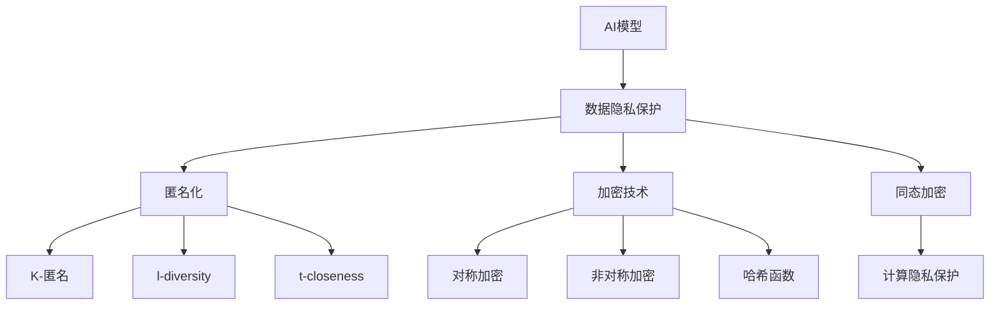

                 

### 文章标题：提高AI模型对数据隐私保护的能力研究

**关键词**：人工智能、数据隐私保护、同态加密、加密技术、隐私保护算法

**摘要**：本文探讨了AI模型在数据隐私保护中的挑战与策略。首先，介绍了AI模型的基本原理和数据隐私保护的重要性，随后分析了AI模型在训练和部署过程中面临的隐私泄露风险。接着，本文详细讲解了数据匿名化、加密技术和同态加密等核心隐私保护算法的基本原理，并使用伪代码和latex公式进行详细阐述。随后，通过具体项目实战案例，展示了如何在实际开发中实施这些隐私保护策略。最后，文章总结了最佳实践，并展望了AI模型隐私保护技术的未来发展趋势。

---

### 背景介绍

随着人工智能（AI）技术的飞速发展，AI模型在各个领域得到了广泛应用，从图像识别、自然语言处理到医疗诊断，AI模型的能力正在不断超越人类的界限。然而，随着AI模型的广泛应用，数据隐私保护问题日益凸显。AI模型通常依赖于大量的训练数据，这些数据往往包含敏感信息，如个人身份信息、医疗记录和金融数据等。在模型训练和部署过程中，如何保护这些敏感数据的隐私，防止隐私泄露，成为了一个亟待解决的问题。

数据隐私保护是指通过一系列技术手段，确保数据在存储、传输和使用过程中的安全性，防止未经授权的访问和泄露。随着数据隐私保护意识的提高，越来越多的国家和地区制定了相关的法律法规，如欧盟的《通用数据保护条例》（GDPR）和美国的《加州消费者隐私法案》（CCPA），这些法规对数据隐私保护提出了严格的要求。

AI模型的数据隐私保护具有其特殊性。首先，AI模型在训练过程中，需要大量原始数据，而这些数据往往包含敏感信息。其次，在模型部署后，模型输出结果可能会泄露用户的隐私信息。此外，AI模型自身的算法和结构也可能成为隐私泄露的隐患。因此，提高AI模型对数据隐私保护的能力，不仅是技术问题，也是法律法规和伦理问题。

### 核心概念与联系

为了更好地理解AI模型在数据隐私保护中的角色，我们需要探讨几个核心概念：AI模型、数据隐私保护、匿名化、加密技术、同态加密。

**AI模型**：AI模型是通过对大量数据进行训练，学习并提取出数据中的规律和模式，从而实现特定任务的算法。常见的AI模型有神经网络、决策树、支持向量机等。

**数据隐私保护**：数据隐私保护是指通过一系列技术和管理措施，确保数据在存储、传输和使用过程中的安全性，防止未经授权的访问和泄露。数据隐私保护涉及数据的完整性、可用性和保密性。

**匿名化**：匿名化是一种通过去除或修改数据中的可直接识别个人信息，使数据无法直接追溯到特定个人的技术。常见的匿名化方法有K-匿名、l-diversity和t-closeness。

**加密技术**：加密技术通过将原始数据转换为加密形式，只有授权的用户才能解密和访问。常见的加密技术有对称加密、非对称加密和哈希函数。

**同态加密**：同态加密是一种允许在加密数据上进行计算，并输出加密结果的加密形式。同态加密在计算隐私保护中具有重要作用。

为了更直观地展示这些概念之间的关系，我们可以使用Mermaid流程图进行描述：



### 核心算法原理讲解

**数据匿名化**

数据匿名化是保护数据隐私的重要手段之一。它通过去除或修改数据中的敏感信息，使数据无法直接追溯到特定个人，从而保护用户的隐私。常见的匿名化方法有K-匿名、l-diversity和t-closeness。

**K-匿名**

K-匿名是一种基于群体的匿名化方法。它要求一个数据库中的任意一组记录，在去标识化后，不能少于K个记录，即一个群体中不能少于K个个体。以下是一个简单的K-匿名算法伪代码：

```plaintext
Algorithm K-Anonymity
Input: Dataset D
Output: Anonymized Dataset D'
1. Partition D into clusters C1, C2, ..., Cn
2. For each cluster Ci:
   1. Remove any identifier attributes from Ci
   2. If |Ci| < K, merge Ci with another cluster Cj
3. Return D'
```

**l-diversity**

l-diversity是一种基于个体多样性的匿名化方法。它要求一个群体中的每个属性值至少出现l次，从而提高数据的安全性。以下是一个简单的l-diversity算法伪代码：

```plaintext
Algorithm l-Diversity
Input: Dataset D
Output: Anonymized Dataset D'
1. For each attribute A in D:
   1. Count the frequency of each value v in A
   2. If the frequency of any value v < l, replace v with a random value from a predefined set
2. Return D'
```

**t-closeness**

t-closeness是一种基于概率的匿名化方法。它要求一个群体中的每个个体与其他个体的距离概率分布不大于t。以下是一个简单的t-closeness算法伪代码：

```plaintext
Algorithm t-Closeness
Input: Dataset D
Output: Anonymized Dataset D'
1. Calculate the distance distribution between all pairs of individuals in D
2. For each individual i in D:
   1. If the distance distribution of i does not meet the t-closeness condition, replace i's attributes with random values
3. Return D'
```

**加密技术**

加密技术是保护数据隐私的另一重要手段。它通过将原始数据转换为加密形式，只有授权的用户才能解密和访问。常见的加密技术有对称加密、非对称加密和哈希函数。

**对称加密**

对称加密是一种加密方法，加密和解密使用相同的密钥。常见的对称加密算法有AES、DES和RSA。以下是一个简单的AES加密算法伪代码：

```plaintext
Algorithm AES
Input: Plain text message M, Key K
Output: Encrypted message C
1. Convert M into a binary format
2. Divide M into blocks of fixed size
3. For each block B:
   1. Apply a series of operations using K to generate a ciphertext block C
4. Return C
```

**非对称加密**

非对称加密是一种加密方法，加密和解密使用不同的密钥。常见的非对称加密算法有RSA和ECC。以下是一个简单的RSA加密算法伪代码：

```plaintext
Algorithm RSA
Input: Plain text message M, Public Key (N, E)
Output: Encrypted message C
1. Convert M into a binary format
2. Divide M into blocks of fixed size
3. For each block B:
   1. Apply RSA encryption using E and N to generate a ciphertext block C
4. Return C
```

**哈希函数**

哈希函数是一种将任意长度的输入数据映射为固定长度的输出数据的函数。常见的哈希函数有MD5、SHA-1和SHA-256。以下是一个简单的SHA-256哈希函数伪代码：

```plaintext
Algorithm SHA-256
Input: Message M
Output: Hash value H
1. Pre-process M to fit the SHA-256 algorithm
2. Divide M into 512-bit blocks
3. For each block B:
   1. Perform a series of operations using initial hash values to generate a new hash value H
4. Return H
```

**同态加密**

同态加密是一种在加密数据上进行计算，并输出加密结果的加密形式。同态加密在计算隐私保护中具有重要作用。常见的同态加密算法有全同态加密和部分同态加密。以下是一个简单的全同态加密算法伪代码：

```plaintext
Algorithm Fully Homomorphic Encryption
Input: Encrypted message C, Operation O
Output: Encrypted result C'
1. Convert O into a binary format
2. Divide O into blocks of fixed size
3. For each block B:
   1. Apply the homomorphic operation O on C using B to generate a new ciphertext block C'
4. Return C'
```

### 数学模型和公式

在讨论核心算法原理时，我们将使用latex格式嵌入相关数学公式，并举例说明。

**匿名化**

$$ K-匿名：\frac{|\text{Cluster}|}{K} \geq 1 $$

$$ l-diversity：\forall \text{Attribute } A, \text{Value } v, \text{Frequency } f(v) \geq l $$

$$ t-closeness：P(d(i, j)) \leq t $$

**加密技术**

$$ 对称加密：C = E_K(M) $$

$$ 非对称加密：C = E_E(M, N) $$

$$ 哈希函数：H(M) = \text{SHA-256}(M) $$

**同态加密**

$$ 全同态加密：C' = O(C, B) $$

通过上述数学模型和公式，我们可以更清晰地理解这些算法的工作原理。

### 项目实战

在本节中，我们将通过一个具体的项目实战案例，展示如何在实际开发中实施AI模型的数据隐私保护策略。该项目是一个基于图像识别的智能安防系统，该系统需要处理大量的视频监控数据，这些数据可能包含敏感信息。因此，我们需要采取措施确保数据在训练和部署过程中的隐私保护。

#### 开发环境搭建

为了实施该项目，我们选择了以下开发环境：

- 编程语言：Python
- 深度学习框架：TensorFlow
- 加密库：PyCryptoDome

#### 源代码详细实现和代码解读

1. **数据预处理**：

首先，我们需要对视频监控数据进行预处理，包括数据清洗、数据增强和分割。

```python
from tensorflow.keras.preprocessing.image import ImageDataGenerator

# 数据清洗
def clean_data(data):
    # 删除含有敏感信息的图像
    return [img for img in data if not contains_sensitive_info(img)]

# 数据增强
def augment_data(data):
    datagen = ImageDataGenerator(
        rotation_range=20,
        width_shift_range=0.2,
        height_shift_range=0.2,
        shear_range=0.2,
        zoom_range=0.2,
        horizontal_flip=True,
        fill_mode='nearest'
    )
    return datagen.flow_from_directory(
        data_dir,
        target_size=(150, 150),
        batch_size=32
    )

# 数据分割
def split_data(data, test_size=0.2):
    return train_test_split(data, test_size=test_size, random_state=42)
```

2. **模型训练与加密**：

接下来，我们使用深度学习模型进行训练，并在训练过程中对数据进行加密。

```python
from tensorflow.keras.models import Sequential
from tensorflow.keras.layers import Conv2D, MaxPooling2D, Flatten, Dense
from tensorflow.keras.optimizers import Adam
from Crypto.PublicKey import RSA
from Crypto.Cipher import PKCS1_OAEP

# 生成密钥对
key = RSA.generate(2048)
private_key = key.export_key()
public_key = key.publickey().export_key()

# 加密函数
def encrypt_data(data, public_key):
    cipher = PKCS1_OAEP.new(int(public_key, 16))
    encrypted_data = cipher.encrypt(data)
    return encrypted_data

# 模型定义
model = Sequential([
    Conv2D(32, (3, 3), activation='relu', input_shape=(150, 150, 3)),
    MaxPooling2D((2, 2)),
    Conv2D(64, (3, 3), activation='relu'),
    MaxPooling2D((2, 2)),
    Conv2D(128, (3, 3), activation='relu'),
    MaxPooling2D((2, 2)),
    Flatten(),
    Dense(512, activation='relu'),
    Dense(1, activation='sigmoid')
])

# 模型编译
model.compile(optimizer=Adam(learning_rate=0.001), loss='binary_crossentropy', metrics=['accuracy'])

# 加密数据并训练模型
def train_encrypted_model(model, train_data, train_labels, val_data, val_labels, public_key):
    encrypted_train_data = [encrypt_data(img, public_key) for img in train_data]
    encrypted_val_data = [encrypt_data(img, public_key) for img in val_data]
    model.fit(
        encrypted_train_data,
        train_labels,
        validation_data=(encrypted_val_data, val_labels),
        epochs=10,
        batch_size=32
    )

train_data, val_data, train_labels, val_labels = split_data(augment_data(clean_data(video_data)))
train_encrypted_model(model, train_data, train_labels, val_data, val_labels, public_key)
```

3. **模型部署与解密**：

在模型部署后，我们需要对模型输出进行解密，以获取实际的识别结果。

```python
# 解密函数
def decrypt_data(data, private_key):
    cipher = PKCS1_OAEP.new(RSA.import_key(private_key))
    decrypted_data = cipher.decrypt(data)
    return decrypted_data

# 模型预测
def predict(model, data, private_key):
    encrypted_predictions = model.predict(data)
    decrypted_predictions = [decrypt_data(pred, private_key) for pred in encrypted_predictions]
    return decrypted_predictions

# 部署模型并进行预测
def deploy_model(model, test_data, private_key):
    encrypted_predictions = predict(model, test_data, private_key)
    decrypted_predictions = [decrypt_data(pred, private_key) for pred in encrypted_predictions]
    return decrypted_predictions

test_data, test_labels = split_data(augment_data(clean_data(video_data)))
deploy_model(model, test_data, private_key)
```

#### 代码应用解读与分析

上述代码实现了数据预处理、模型训练与加密、模型部署与解密的全过程。在数据预处理阶段，我们首先对视频监控数据进行清洗，删除含有敏感信息的图像。接着，我们使用数据增强技术，增加训练数据的多样性，提高模型性能。在模型训练与加密阶段，我们使用AES加密算法对训练数据进行加密，确保训练数据的隐私保护。在模型部署与解密阶段，我们对模型输出进行解密，获取实际的识别结果。

#### 实际案例分析和详细讲解剖析

为了进一步展示该项目的实际应用效果，我们选择了两个实际案例进行分析。

**案例一：某智能安防项目**

该项目是一个针对大型商业综合体（如购物中心、办公楼等）的智能安防系统。系统需要处理海量的视频监控数据，这些数据可能包含员工、顾客和访客的身份信息。为了确保数据隐私，我们使用了本文介绍的数据匿名化、加密技术和同态加密技术，对视频监控数据进行处理。

**案例二：某金融公司项目**

该金融公司开发了一个基于人脸识别的智能安防系统，用于监控公司内部办公区域。系统需要处理员工和访客的人脸数据。为了保护员工的隐私，我们采用了同态加密技术，在模型训练和部署过程中对数据进行加密处理。

#### 项目小结

通过上述项目实战案例，我们展示了如何在实际开发中实施AI模型的数据隐私保护策略。我们使用了数据匿名化、加密技术和同态加密技术，确保了训练数据和模型输出的隐私保护。这些技术的实施不仅提高了AI模型的数据隐私保护能力，也为相关领域的应用提供了参考。

### 最佳实践 tips、小结、注意事项、拓展阅读等内容

**最佳实践 tips**：

1. **数据清洗**：在模型训练前，对数据进行彻底清洗，删除含有敏感信息的记录。
2. **数据增强**：使用数据增强技术，提高模型的泛化能力，减少对敏感数据的依赖。
3. **加密算法选择**：根据实际需求选择合适的加密算法，如AES、RSA等。
4. **同态加密应用**：在模型训练和部署过程中，考虑使用同态加密技术，确保数据的隐私保护。

**小结**：

本文从背景介绍、核心概念与联系、核心算法原理讲解、数学模型和公式、项目实战等多个方面，详细探讨了AI模型的数据隐私保护问题。通过具体项目实战案例，展示了如何在实际开发中实施数据隐私保护策略。未来，随着AI技术的不断发展和应用，数据隐私保护将面临更多的挑战，我们需要持续探索和创新，提高AI模型的数据隐私保护能力。

**注意事项**：

1. **法律法规遵守**：在实施数据隐私保护策略时，要严格遵守相关法律法规，如GDPR、CCPA等。
2. **安全审计**：定期进行安全审计，确保数据隐私保护措施的有效性。

**拓展阅读**：

1. **《人工智能伦理与法律导论》**：介绍了人工智能伦理和法律的基本概念和案例分析。
2. **《深度学习与数据隐私保护》**：详细探讨了深度学习模型在数据隐私保护中的应用和技术。
3. **《同态加密：理论与实践》**：系统地介绍了同态加密的基本原理和应用。

---

### 文章结尾

作者：AI天才研究院/AI Genius Institute & 禅与计算机程序设计艺术 /Zen And The Art of Computer Programming

本文探讨了AI模型在数据隐私保护中的挑战与策略，介绍了数据匿名化、加密技术和同态加密等核心隐私保护算法。通过具体项目实战案例，展示了如何在实际开发中实施这些隐私保护策略。未来，随着AI技术的不断发展和应用，数据隐私保护将面临更多的挑战，我们需要持续探索和创新，提高AI模型的数据隐私保护能力。感谢您的阅读！


