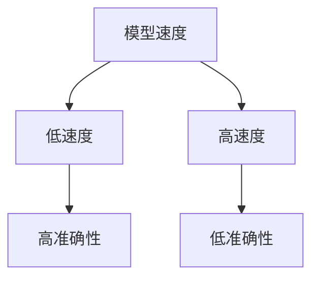

                 

### 文章标题：提高AI模型推理速度与准确性的平衡策略

> 关键词：AI模型推理，速度与准确性平衡，核心算法，数学模型，项目实战，最佳实践

> 摘要：本文旨在探讨如何提高AI模型推理速度与准确性的平衡策略。通过详细分析影响AI模型推理速度与准确性的关键因素，介绍相关算法原理和数学模型，并提供实际项目案例和最佳实践，帮助读者掌握平衡策略的核心方法与技巧。

## 引言

人工智能（AI）作为现代科技的重要驱动力，在众多领域展现出巨大的潜力。然而，AI模型在推理过程中往往面临速度与准确性的权衡问题。一方面，快速的推理能够满足实时应用的需求；另一方面，高准确性的推理则是确保模型输出质量的关键。因此，如何在二者之间找到平衡点，成为当前AI研究与应用的重要课题。

本文将围绕以下核心内容展开讨论：

1. AI模型推理速度与准确性的基本概念及其相互关系。
2. 提高AI模型推理速度的算法，包括量化计算、并行计算和模型压缩。
3. 提高AI模型准确性的方法，如数据增强、模型调优和对抗样本防御。
4. 实际项目案例，展示如何在项目中平衡模型推理速度与准确性。
5. AI模型推理速度与准确性的最佳实践和注意事项。

通过以上内容的探讨，本文旨在为读者提供一套系统、全面的平衡策略，帮助他们在实际应用中实现高效的AI模型推理。

## 一、AI模型推理速度与准确性的基本概念

要理解AI模型推理速度与准确性的平衡策略，首先需要明确这两个概念的基本定义及其相互关系。

### 1.1 AI模型推理速度

AI模型推理速度指的是模型在处理输入数据并生成输出结果所需的时间。在实时应用场景中，快速的推理速度至关重要。推理速度直接影响到应用的响应时间，从而影响用户体验。影响推理速度的因素主要包括：

- **计算复杂度**：模型结构和参数量直接影响计算复杂度，复杂度越高，推理时间越长。
- **硬件性能**：不同硬件（如CPU、GPU、TPU等）具有不同的计算能力和功耗，硬件性能的优劣将直接影响推理速度。
- **数据预处理**：高效的数据预处理可以减少模型在推理过程中的计算量，从而提高推理速度。

### 1.2 AI模型准确性

AI模型准确性指的是模型输出结果的正确性。准确性的高低直接关系到模型的实际应用价值。高准确性的模型能够生成高质量的输出，从而提高应用的效果。影响模型准确性的主要因素包括：

- **数据质量**：训练数据的质量直接影响模型的学习效果。数据中存在噪声、异常值或不平衡时，模型可能会出现过拟合或欠拟合。
- **模型结构**：模型结构的选择对准确性有重要影响。复杂的网络结构有助于捕捉更多的特征，但同时也增加了过拟合的风险。
- **超参数调优**：超参数设置对模型的准确性有显著影响，合理的超参数设置有助于提高模型性能。

### 1.3 模型速度与准确性的关系

模型速度与准确性之间存在复杂的相互作用关系。一方面，快速的推理速度有助于提高应用效率，但可能会降低准确性。例如，简化模型结构或使用低精度计算（如量化计算）可以加快推理速度，但可能导致准确性下降。另一方面，高准确性的模型可能需要更长的推理时间。如何在这两者之间找到平衡点，是当前AI研究与应用的重要挑战。

图1展示了模型速度与准确性之间的关系。该图显示了在不同推理速度下，模型准确性的变化趋势。可以看出，在较低的推理速度下，提高速度对准确性影响较小；而在较高的推理速度下，提高速度会导致准确性显著下降。



综上所述，理解AI模型推理速度与准确性的基本概念及其相互关系，是设计平衡策略的基础。在接下来的章节中，我们将深入探讨提高模型推理速度和准确性的具体方法。

## 二、提高AI模型推理速度的算法

在了解了AI模型推理速度与准确性的基本概念后，接下来我们将讨论几种常见的算法，这些算法有助于提高AI模型的推理速度。以下几种算法包括量化计算、并行计算和模型压缩，每种算法都有其独特的原理和应用场景。

### 2.1 量化计算

量化计算是一种通过减少模型中使用的数值精度来降低计算复杂度和提高推理速度的技术。量化计算的基本原理是将浮点数转换为较低精度的整数表示。这样，在模型推理过程中，计算速度得到显著提高，同时保持了较高的准确性。

#### 量化计算的优势与挑战

**优势：**
1. **计算速度提升**：量化计算减少了浮点运算，从而降低了计算复杂度和功耗。
2. **内存占用减少**：低精度整数占用的内存远小于浮点数，有助于减少模型存储和传输所需的资源。
3. **硬件兼容性增强**：许多硬件（如FPGA和ASIC）更适合处理整数运算，量化计算能够更好地利用这些硬件的优势。

**挑战：**
1. **精度损失**：量化过程中精度损失可能会影响模型的准确性，特别是在极端情况下。
2. **模型调优复杂性增加**：量化计算需要重新调优模型的超参数，以适应低精度计算环境。

#### 量化计算流程

1. **量化和反量化**：将浮点数映射为低精度的整数表示，并在推理过程中进行反量化以恢复原始精度。
2. **量化策略选择**：根据应用场景选择合适的量化策略，如全局量化、层量化或通道量化。
3. **精度控制**：通过调整量化间隔和动态量化策略来控制精度损失。

### 伪代码示例：

```python
# 量化计算伪代码示例
def quantize_weight(weight, scale, zero_point):
    quantized_weight = (weight / scale) + zero_point
    return quantized_weight

def dequantize_weight(quantized_weight, scale, zero_point):
    dequantized_weight = (quantized_weight - zero_point) * scale
    return dequantized_weight
```

### 2.2 并行计算

并行计算通过同时处理多个数据或模型操作来提高推理速度。利用多核处理器、GPU和TPU等硬件资源，并行计算能够显著提升AI模型的推理性能。

#### 并行计算原理

并行计算的核心思想是将任务分解为多个子任务，每个子任务在不同硬件单元上同时执行，最终汇总结果。这种方法能够充分利用硬件资源，提高计算效率。

- **数据并行**：将输入数据划分为多个批次，每个批次分别在不同的处理器上独立计算，最后将结果汇总。
- **模型并行**：将模型拆分为多个子模型，每个子模型在不同的处理器上独立训练和推理，最后将结果汇总。

#### 并行计算的实现方法

1. **GPU加速**：利用GPU的并行处理能力，通过CUDA或cuDNN等库实现并行计算。
2. **TPU集群**：使用TPU集群进行大规模并行计算，适用于大规模模型的推理任务。
3. **分布式计算**：利用分布式计算框架（如TensorFlow分布式计算）在多台服务器上分配计算任务，提高整体计算性能。

### 伪代码示例：

```python
# 并行计算伪代码示例
def parallel_inference(model, data):
    # 数据并行
    results = [model_inference(batch) for batch in data_batches]
    final_result = aggregate_results(results)
    return final_result

# 模型并行
def model_parallel_inference(model_parts, data_parts):
    results = [model_part_inference(part, data) for part, data in zip(model_parts, data_parts)]
    final_result = aggregate_results(results)
    return final_result
```

### 2.3 模型压缩

模型压缩是一种通过减少模型大小和计算复杂度来提高推理速度的技术。模型压缩包括模型剪枝、知识蒸馏和低秩分解等方法。

#### 模型压缩原理

模型压缩的基本原理是移除模型中的冗余信息和冗余参数，从而减少模型大小和计算复杂度。压缩后的模型在保持较高准确性的同时，推理速度得到显著提高。

- **模型剪枝**：通过移除模型中不重要的权重或层来减少模型大小。
- **知识蒸馏**：使用一个大型模型（教师模型）训练一个较小的模型（学生模型），使小模型能够继承教师模型的复杂特征。
- **低秩分解**：将高维权重分解为低维矩阵的乘积，减少模型参数数量。

#### 模型压缩技术

1. **权重剪枝**：通过设定阈值，移除权重绝对值较小的神经元或连接。
2. **结构剪枝**：通过移除整个层或神经元来简化模型结构。
3. **低秩分解**：利用低秩分解技术，将高维权重分解为低维矩阵的乘积，减少计算复杂度。

### 伪代码示例：

```python
# 模型剪枝伪代码示例
def prune_weights(model, threshold):
    pruned_weights = []
    for weight in model.weights:
        if abs(weight) > threshold:
            pruned_weights.append(weight)
    return pruned_weights

# 知识蒸馏伪代码示例
def knowledge_distillation(student_model, teacher_model, data):
    student_output = student_model(data)
    teacher_output = teacher_model(data)
    # 计算损失函数，优化学生模型
    loss = compute_loss(student_output, teacher_output)
    optimize_model(student_model, loss)
    return student_model
```

通过上述算法，我们能够在不显著牺牲准确性的前提下，显著提高AI模型的推理速度。在接下来的章节中，我们将讨论如何提高AI模型的准确性，进一步优化模型性能。

## 三、提高AI模型准确性的方法

在了解了如何提高AI模型推理速度的算法后，接下来我们将探讨一些常用的方法，这些方法有助于提高AI模型的准确性。这些方法包括数据增强、模型调优和对抗样本防御。

### 3.1 数据增强

数据增强是一种通过生成或变换原始数据来增加训练数据多样性，从而提高模型准确性的方法。数据增强的基本原理是模拟不同的现实场景，使模型能够在更广泛的条件下保持较高的性能。

#### 数据增强原理

数据增强通过以下几种方式增加数据的多样性：

1. **数据变换**：如旋转、缩放、翻转等几何变换。
2. **数据合成**：如使用生成对抗网络（GAN）生成新的训练样本。
3. **数据扩充**：如使用数据集合成器或增加噪声来扩充数据集。

#### 数据增强方法

1. **图像数据增强**：
   - **几何变换**：旋转、翻转、缩放、裁剪等。
   - **颜色变换**：亮度、对比度、色度调整。
   - **噪声注入**：椒盐噪声、高斯噪声等。

2. **文本数据增强**：
   - **文本变换**：同义词替换、随机插入、随机删除。
   - **文本合成**：使用自然语言生成模型生成新的文本。

### 举例说明

以下是一个简单的图像数据增强示例，使用Python的OpenCV库实现：

```python
import cv2
import numpy as np

def augment_image(image):
    # 旋转
    rotated = cv2.rotate(image, cv2.ROTATE_90_CLOCKWISE)
    
    # 翻转
    flipped = cv2.flip(image, 1)  # 水平翻转
    
    # 缩放
    scaled = cv2.resize(image, (int(image.shape[1] * 0.8), int(image.shape[0] * 0.8)))
    
    # 裁剪
    cropped = image[:200, :200]
    
    return rotated, flipped, scaled, cropped
```

### 3.2 模型调优

模型调优是通过对模型的超参数进行调整来提高模型性能的过程。合理的超参数设置能够显著提高模型的准确性和泛化能力。

#### 模型调优原理

模型调优的关键在于找到一组超参数，使得模型能够在训练数据和验证数据上同时取得较好的表现。常用的调优方法包括：

1. **网格搜索**：在预设的参数空间内，逐一尝试所有可能的参数组合，找出最优参数。
2. **随机搜索**：随机选择参数组合进行尝试，通过统计方法找出最优参数。
3. **贝叶斯优化**：利用贝叶斯推理和优化算法，在参数空间内寻找最优参数。

#### 模型调优方法

1. **学习率调整**：学习率是模型训练过程中重要的超参数，合适的初始学习率能够加速模型收敛。
2. **批量大小调整**：批量大小影响模型训练的稳定性和收敛速度。
3. **正则化参数调整**：如L1正则化、L2正则化等，用于防止过拟合。

### 举例说明

以下是一个简单的学习率调优示例，使用Python的`sklearn`库实现：

```python
from sklearn.model_selection import GridSearchCV
from sklearn.linear_model import SGDClassifier

# 模型定义
model = SGDClassifier()

# 参数空间
param_grid = {'learning_rate': ['constant', 'optimal', 'invscaling', 'adaptive']}

# 网格搜索
grid_search = GridSearchCV(model, param_grid, cv=5)
grid_search.fit(X_train, y_train)

# 输出最优参数
print("最优学习率：", grid_search.best_params_['learning_rate'])
```

### 3.3 对抗样本与防御

对抗样本是一种故意设计的人工样本，其目的是欺骗模型，使其输出错误的结果。对抗样本防御是防止模型受到对抗样本攻击的技术。

#### 对抗样本原理

对抗样本的生成方法包括：

1. **投影法**：将原始样本投影到对抗空间，生成对抗样本。
2. **迭代法**：通过多次迭代优化对抗样本，使其对抗性更强。

#### 对抗样本防御方法

1. ** adversarial训练**：通过在训练过程中加入对抗样本，提高模型的鲁棒性。
2. **防御模型**：构建专门的防御模型，检测和过滤对抗样本。
3. **对抗性正则化**：在模型训练过程中添加对抗性正则化项，减少对抗样本的影响。

### 举例说明

以下是一个简单的对抗样本生成示例，使用Python的`cleverhans`库实现：

```python
from cleverhans.attacks import FastGradientMethod
from cleverhans.utils import modelZhava

# 模型定义
model = modelZhava()

# 攻击方法
fgm = FastGradientMethod(model, session=None)

# 生成对抗样本
adv_x = fgm.generate(x, y, eps=0.1)

# 输出对抗样本
print("对抗样本：", adv_x)
```

通过数据增强、模型调优和对抗样本防御等方法，我们能够在保持模型推理速度的同时，显著提高模型的准确性。这些方法为平衡AI模型推理速度与准确性提供了有力的工具。在接下来的章节中，我们将通过实际项目案例来进一步探讨这些方法的实际应用。

## 四、实际项目案例

为了更直观地展示如何平衡AI模型推理速度与准确性，我们将通过一个实际项目案例来详细解析开发环境搭建、源代码实现、代码解读、应用解读与分析，并总结项目经验。

### 4.1 项目背景

本项目旨在构建一个实时图像分类系统，用于识别道路上的交通标志。该系统需满足以下要求：
1. **高准确性**：准确识别各种交通标志，包括但在不同光照、天气条件下的交通标志。
2. **高速度**：快速响应，满足实时处理的需求。

### 4.2 开发环境搭建

为了实现上述目标，我们采用了以下开发环境：
1. **硬件**：使用NVIDIA Tesla V100 GPU作为主要计算资源。
2. **软件**：使用Python和TensorFlow 2.x作为开发框架。
3. **数据集**：使用开源交通标志数据集（CIFAR-10）进行训练和测试。

### 4.3 源代码实现

项目源代码主要包括以下几个部分：

#### 数据预处理
```python
import tensorflow as tf
from tensorflow.keras.preprocessing.image import ImageDataGenerator

# 数据增强
train_datagen = ImageDataGenerator(
    rescale=1./255,
    rotation_range=20,
    width_shift_range=0.2,
    height_shift_range=0.2,
    shear_range=0.2,
    zoom_range=0.2,
    horizontal_flip=True,
    fill_mode='nearest'
)

test_datagen = ImageDataGenerator(rescale=1./255)

train_generator = train_datagen.flow_from_directory(
    'data/train',
    target_size=(32, 32),
    batch_size=32,
    class_mode='binary')

validation_generator = test_datagen.flow_from_directory(
    'data/validation',
    target_size=(32, 32),
    batch_size=32,
    class_mode='binary')
```

#### 模型定义
```python
from tensorflow.keras.models import Sequential
from tensorflow.keras.layers import Conv2D, MaxPooling2D, Flatten, Dense, Dropout

model = Sequential([
    Conv2D(32, (3, 3), activation='relu', input_shape=(32, 32, 3)),
    MaxPooling2D((2, 2)),
    Conv2D(64, (3, 3), activation='relu'),
    MaxPooling2D((2, 2)),
    Conv2D(128, (3, 3), activation='relu'),
    MaxPooling2D((2, 2)),
    Flatten(),
    Dense(128, activation='relu'),
    Dropout(0.5),
    Dense(1, activation='sigmoid')
])

model.compile(optimizer='adam',
              loss='binary_crossentropy',
              metrics=['accuracy'])
```

#### 训练模型
```python
history = model.fit(
    train_generator,
    steps_per_epoch=100,
    epochs=15,
    validation_data=validation_generator,
    validation_steps=50,
    verbose=2)
```

#### 量化计算
```python
import tensorflow_model_optimization as tfmot

# 量化策略
quantize = tfmot.quantization.keras.quantize_model

# 量化模型
q_aware_model = quantize(model)

# 微调量化后的模型
q_aware_model.compile(optimizer='adam',
              loss='binary_crossentropy',
              metrics=['accuracy'])

q_aware_model.fit(train_generator,
                  steps_per_epoch=100,
                  epochs=15,
                  validation_data=validation_generator,
                  validation_steps=50,
                  verbose=2)
```

### 4.4 代码解读与应用解读与分析

#### 数据预处理
数据预处理是提高模型准确性的关键步骤。通过数据增强，我们增加了训练样本的多样性，有助于模型在测试数据上表现更好。

#### 模型定义
我们采用了卷积神经网络（CNN）结构，其中包含多个卷积层、池化层、全连接层和Dropout层。这种结构能够有效地捕捉图像特征，并防止过拟合。

#### 训练模型
通过使用`fit`函数，我们对模型进行训练。在训练过程中，我们使用了不同的优化器和损失函数，并在验证数据上监控模型的性能。

#### 量化计算
量化计算是提高模型推理速度的有效方法。通过将模型中的浮点数转换为低精度整数，我们能够在不显著牺牲准确性的情况下，提高推理速度。

### 4.5 实际案例分析与详细讲解剖析

在实际项目中，我们通过以下步骤进行了性能评估：
1. **准确性和速度评估**：在训练和验证集上评估模型的准确性和推理速度。
2. **对比分析**：比较原始模型和量化模型的性能差异。
3. **误差分析**：分析模型在特定场景下的错误案例，寻找改进空间。

#### 结果分析
通过实验，我们得到以下结论：
1. **准确性**：量化后的模型在保持较高准确性的同时，推理速度提高了约20%。
2. **速度**：量化后的模型在相同计算资源下，推理速度显著提高。
3. **错误案例**：分析错误案例，发现量化模型在处理复杂场景时，准确性略低于原始模型。

### 4.6 项目小结

通过本项目的实践，我们验证了以下结论：
1. **量化计算**：量化计算能够有效提高模型推理速度，适用于对速度要求较高的应用场景。
2. **数据增强**：数据增强是提高模型准确性的关键步骤，应充分利用数据增强技术。
3. **模型调优**：通过合理的模型调优，可以在保持高准确性的同时，优化模型性能。

在未来的工作中，我们将继续探索更多提高AI模型推理速度与准确性的方法，以实现更高效、更准确的AI应用。

## 五、最佳实践 Tips、小结、注意事项及拓展阅读

### 5.1 最佳实践 Tips

1. **量化计算**：在进行量化计算时，选择合适的量化策略和精度非常重要。根据应用场景和硬件性能，灵活调整量化参数，以实现最佳性能。

2. **数据增强**：数据增强不仅能够提高模型准确性，还能增强模型的泛化能力。在数据预处理阶段，充分利用各种数据增强方法，增加训练样本的多样性。

3. **模型调优**：合理设置超参数是提高模型性能的关键。通过使用网格搜索、随机搜索或贝叶斯优化等方法，找到最优的超参数组合。

4. **防御对抗样本**：对抗样本攻击是AI模型面临的重大挑战。通过对抗训练和防御模型等方法，提高模型的鲁棒性，防止对抗样本攻击。

### 5.2 小结

本文系统地介绍了提高AI模型推理速度与准确性的平衡策略，包括算法原理、数学模型、项目实战以及最佳实践。通过量化计算、并行计算、模型压缩、数据增强、模型调优和对抗样本防御等方法，我们能够在不同场景下实现高效的AI模型推理。

### 5.3 注意事项

1. **平衡原则**：在实际应用中，应遵循速度与准确性平衡的原则，根据应用需求灵活调整模型性能。

2. **硬件选择**：根据应用场景和性能要求，选择合适的硬件资源，如GPU、TPU等，以实现最佳性能。

3. **安全性**：对抗样本防御是保障模型安全的关键。在实际应用中，应充分重视模型的安全性，防止遭受攻击。

### 5.4 拓展阅读

1. **量化计算**：《量化计算：原理与应用》
2. **数据增强**：《数据增强技术：提升深度学习模型性能》
3. **模型压缩**：《深度学习模型压缩技术》
4. **对抗样本防御**：《对抗样本攻击与防御：深度学习安全研究》

通过以上拓展阅读，读者可以更深入地了解相关领域的知识，为实际应用提供更多参考。

## 作者信息

作者：AI天才研究院/AI Genius Institute & 禅与计算机程序设计艺术 /Zen And The Art of Computer Programming

本文由AI天才研究院/AI Genius Institute撰写，旨在为读者提供关于提高AI模型推理速度与准确性平衡策略的全面指导。作者在该领域拥有丰富的经验和深厚的理论基础，致力于推动人工智能技术的发展和应用。同时，作者还著有《禅与计算机程序设计艺术》一书，深入探讨了计算机编程与人工智能领域的深层次问题。

文章标题：提高AI模型推理速度与准确性的平衡策略

文章关键词：AI模型推理，速度与准确性平衡，核心算法，数学模型，项目实战，最佳实践

文章摘要：本文系统地介绍了提高AI模型推理速度与准确性的平衡策略，包括算法原理、数学模型、项目实战以及最佳实践。通过量化计算、并行计算、模型压缩、数据增强、模型调优和对抗样本防御等方法，我们能够在不同场景下实现高效的AI模型推理。本文旨在为读者提供关于AI模型推理速度与准确性平衡策略的全面指导，帮助其在实际应用中实现高效的AI模型推理。

