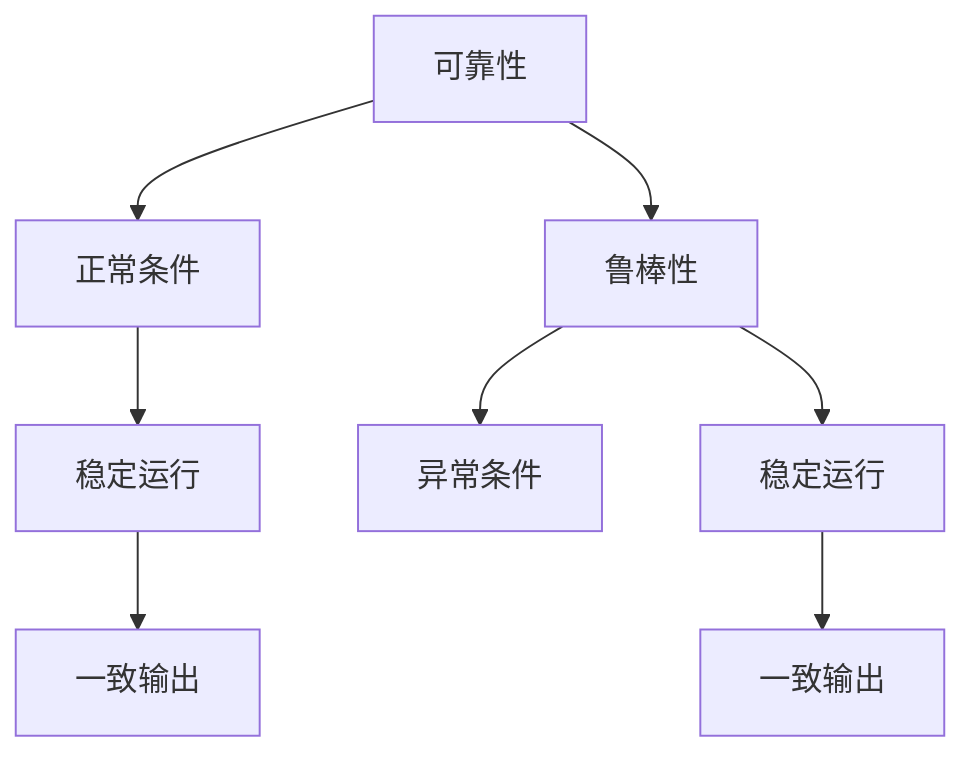

                 


### 引入与背景介绍

人工智能（AI）技术的发展，为我们带来了前所未有的机遇和挑战。从自动驾驶、智能助手到金融风控、医疗诊断，AI技术正深刻改变着我们的生活和工作方式。然而，随着AI系统应用场景的日益广泛，其可靠性和鲁棒性成为了一个亟待解决的问题。一方面，AI系统需要在各种复杂、不确定的环境中稳定运行，确保结果的准确性和一致性；另一方面，系统必须具备一定的容错能力，能够在遭遇异常输入或恶意攻击时，仍然能够正常运行。

可靠性和鲁棒性是评价AI系统性能的重要指标。可靠性指的是系统在规定时间内、在特定条件下，按照预期功能正常运行的能力。而鲁棒性则是指系统在面临输入数据异常、噪声干扰或计算错误等情况下，仍能保持性能的能力。在现实世界中，这两个指标往往是相互关联的。一个高可靠性的AI系统，通常也具有较强的鲁棒性；反之，一个鲁棒性较差的系统，其可靠性也难以保证。

然而，当前的AI系统仍存在一些挑战。首先，数据质量和多样性问题。AI系统的性能高度依赖于训练数据的质量和多样性。如果训练数据存在偏差、噪声或不平衡，将直接影响模型的可靠性。其次，算法的复杂性和不确定性。深度学习模型通常由数百万个参数组成，这些参数的优化过程充满了不确定性，使得模型的鲁棒性难以保证。此外，AI系统的输入和输出往往受到外部环境的影响，如温度、光照等，这些因素可能会对系统的稳定性产生干扰。

针对这些挑战，研究和开发提高AI系统可靠性和鲁棒性的新方法显得尤为重要。这些方法不仅有助于提升系统的性能，还能增强其抗干扰能力和容错能力，从而在实际应用中发挥更大的价值。本文将深入探讨这些新方法，包括数据增强、模型正则化、模型集成、对抗样本生成与防御等。通过详细的分析和实例，我们将了解这些方法如何应用于实际项目中，并展望未来的发展趋势。

### 可靠性与鲁棒性的核心概念与联系

为了深入理解AI系统可靠性和鲁棒性的核心概念，我们需要首先定义这两个术语，并探讨它们之间的内在联系。

**可靠性的定义**：可靠性是指系统在给定条件下，能够按照预期功能正常运行的能力。在AI系统中，可靠性意味着模型在处理输入数据时，能够稳定地输出正确的预测结果。可靠性不仅与系统的设计和实现有关，还与训练数据的质量和多样性密切相关。一个高可靠性的AI系统，能够在长时间内保持其性能，不因外部干扰或内部误差而出现重大故障。

**鲁棒性的定义**：鲁棒性是指系统在面对异常情况时，如输入数据异常、噪声干扰、计算错误等，仍能保持性能的能力。鲁棒性强调系统的容错能力，即在面临不确定性和干扰时，系统能够继续正常运行。对于AI系统来说，鲁棒性意味着模型能够在各种不同的输入数据和环境条件下，保持稳定和一致的输出结果。

**可靠性与鲁棒性的关系**：可靠性和鲁棒性是相互关联的，但它们侧重的方面有所不同。可靠性关注系统在正常条件下的性能，而鲁棒性关注系统在异常条件下的表现。一个系统可能在高可靠性下运行，但鲁棒性较差，这意味着它在正常情况下性能良好，但在异常情况下容易发生故障。反之，一个系统可能在高鲁棒性下运行，但可靠性较低，这表示它在异常条件下能够稳定运行，但在正常条件下容易出现误差。

为了更清晰地展示可靠性和鲁棒性的概念关系，我们可以使用Mermaid流程图来构建它们之间的联系：



在这个流程图中，A表示可靠性，B表示正常条件，C表示稳定运行；D表示鲁棒性，E表示异常条件，F表示稳定运行。通过这个图，我们可以看到可靠性和鲁棒性在正常和异常条件下，都与稳定运行和一致输出密切相关。

**核心概念与联系的解释**：可靠性强调系统在正常条件下的一致性和稳定性，而鲁棒性强调系统在异常条件下的容错能力。一个理想的AI系统，不仅需要在高可靠性下运行，确保正常情况下的输出准确，还需要在高鲁棒性下运行，确保在异常情况下也能保持稳定的性能。这两个指标相辅相成，共同决定了AI系统的整体性能。

通过上述核心概念和Mermaid流程图的解释，我们可以更好地理解可靠性和鲁棒性的重要性，以及它们在AI系统中的内在联系。在接下来的章节中，我们将详细探讨如何通过技术手段提高AI系统的可靠性和鲁棒性。

### 提高可靠性的技术方法

在提高AI系统的可靠性方面，有许多技术方法可供选择。以下是一些常用的方法及其基本原理：

#### 数据增强方法

数据增强是一种通过扩展训练数据集的方法，以提高模型的泛化能力和鲁棒性。基本原理是通过创建新的数据样本，增加数据的多样性和丰富度，从而使模型能够学习到更广泛和更具代表性的特征。

**方法**：

1. **随机变换**：对图像、声音或文本数据进行随机缩放、旋转、裁剪等操作，生成新的数据样本。
2. **合成数据**：使用生成模型（如生成对抗网络GAN）生成与训练数据相似的新数据。
3. **噪声注入**：在输入数据中加入噪声，模拟实际应用中的数据干扰。

**示例**：

假设我们有一个图像分类模型，训练数据集中的图像都是正方形。为了提高模型的可靠性，我们可以在训练过程中添加随机裁剪和旋转的图像，从而使模型能够适应不同形状的图像。

```python
import tensorflow as tf
import tensorflow_datasets as tfds

def augment_image(image):
    image = tf.image.random_flip_left_right(image)
    image = tf.image.random_brightness(image, max_delta=0.1)
    return image

def load_data():
    (train_data, test_data), info = tfds.load('cifar10', split=['train', 'test'], shuffle_files=True, with_info=True, as_supervised=True)
    train_data = train_data.map(augment_image)
    return train_data, test_data
```

#### 模型正则化技术

正则化技术用于防止模型过拟合，提高其泛化能力。基本原理是通过在损失函数中加入额外的惩罚项，限制模型参数的规模，从而减小模型的复杂度。

**方法**：

1. **L1和L2正则化**：在损失函数中添加L1或L2范数惩罚项，分别表示模型参数的绝对值或平方值。
2. **Dropout**：在训练过程中，随机丢弃一部分神经元，以减少模型对特定输入的依赖。
3. **权重衰减**：在损失函数中添加权重衰减项，减少权重更新的幅度。

**示例**：

以下是一个使用L2正则化的简单神经网络模型示例：

```python
import tensorflow as tf

model = tf.keras.Sequential([
    tf.keras.layers.Dense(128, activation='relu', kernel_regularizer=tf.keras.regularizers.l2(0.001)),
    tf.keras.layers.Dense(10, activation='softmax')
])

model.compile(optimizer='adam', loss='sparse_categorical_crossentropy', metrics=['accuracy'])
model.fit(train_data, epochs=10, validation_data=test_data)
```

#### 模型集成方法

模型集成方法通过结合多个模型的预测结果，提高整体的预测准确性和可靠性。基本原理是利用不同模型的优势，弥补单个模型的缺陷。

**方法**：

1. **Bagging**：使用多个训练集生成多个模型，然后对它们的预测结果进行平均。
2. **Boosting**：根据前一个模型的错误率，调整训练数据的重要性，生成下一个模型。
3. **Stacking**：先使用多个模型进行预测，然后将这些预测结果作为新特征，训练一个更高层次的模型。

**示例**：

以下是一个简单的Bagging示例，使用多个模型进行预测，然后平均它们的输出：

```python
from sklearn.ensemble import BaggingClassifier
from sklearn.datasets import load_iris
from sklearn.model_selection import train_test_split

iris = load_iris()
X_train, X_test, y_train, y_test = train_test_split(iris.data, iris.target, test_size=0.3, random_state=42)

model = BaggingClassifier(base_estimator=DecisionTreeClassifier(), n_estimators=10, random_state=42)
model.fit(X_train, y_train)
predictions = model.predict(X_test)
```

#### 对抗样本生成与防御

对抗样本生成是近年来兴起的一种技术，通过在训练数据中引入微小扰动，生成能够误导模型的样本，从而测试和提升模型的鲁棒性。

**方法**：

1. **生成对抗网络（GAN）**：通过生成模型和判别模型的对抗训练，生成对抗样本。
2. **对抗训练**：在训练过程中，添加对抗样本作为额外的训练数据，增强模型的鲁棒性。
3. **对抗防御**：使用对抗训练生成的模型，对原始数据进行变换，以减少其对抗性。

**示例**：

以下是一个使用生成对抗网络生成对抗样本的示例：

```python
import tensorflow as tf
from tensorflow import keras

# 生成器模型
generator = keras.Sequential([
    keras.layers.Dense(128, input_shape=(100,), activation='relu'),
    keras.layers.Dense(128, activation='relu'),
    keras.layers.Dense(784, activation='tanh')
])

# 判别器模型
discriminator = keras.Sequential([
    keras.layers.Flatten(input_shape=(28, 28)),
    keras.layers.Dense(128, activation='relu'),
    keras.layers.Dense(1, activation='sigmoid')
])

# 定义损失函数和优化器
cross_entropy = keras.losses.BinaryCrossentropy(from_logits=True)
generator_optimizer = keras.optimizers.Adam(1e-4)
discriminator_optimizer = keras.optimizers.Adam(1e-4)

@tf.function
def train_step(images, generator, discriminator):
    noise = tf.random.normal([BATCH_SIZE, 100])
    generated_images = generator(noise)

    with tf.GradientTape(persistent=True) as tape:
        generated_output = discriminator(generated_images)
        real_output = discriminator(images)

        gen_loss = cross_entropy(tf.ones_like(generated_output), generated_output)
        real_loss = cross_entropy(tf.zeros_like(real_output), real_output)

    gradients_of_discriminator = tape.gradient(real_loss + gen_loss, discriminator.trainable_variables)
    discriminator_optimizer.apply_gradients(zip(gradients_of_discriminator, discriminator.trainable_variables))

    with tf.GradientTape() as tape:
        generated_output = discriminator(generated_images)

    gradients_of_generator = tape.gradient(generated_output, generator.trainable_variables)
    generator_optimizer.apply_gradients(zip(gradients_of_generator, generator.trainable_variables))

# 训练模型
EPOCHS = 50
for epoch in range(EPOCHS):
    for image_batch, _ in train_data:
        train_step(image_batch, generator, discriminator)
```

通过上述示例，我们可以看到数据增强、模型正则化、模型集成和对抗样本生成与防御等方法在实际应用中的实现。这些方法不仅有助于提高AI系统的可靠性，还能增强其鲁棒性，使其能够在更复杂和不确定的环境中稳定运行。

### 提高鲁棒性的技术方法

在提升AI系统的鲁棒性方面，也有多种技术方法可以采用。这些方法主要关注如何使模型在面临异常输入、噪声干扰或计算错误时，仍能保持稳定和准确的性能。以下是一些关键的技术方法及其具体实现。

#### 输入预处理方法

输入预处理是提高AI系统鲁棒性的第一步。通过适当的预处理，可以有效减少输入数据中的噪声和异常值，从而提高模型的鲁棒性。

**方法**：

1. **归一化**：将输入数据缩放到一个特定的范围，如[0, 1]或[-1, 1]，使不同特征的尺度一致，避免某些特征对模型的影响过大。
2. **去噪**：使用滤波器、变换（如小波变换）或其他算法，去除数据中的噪声。
3. **异常检测与处理**：通过统计方法（如Z分数）或机器学习算法（如孤立森林），检测和移除输入数据中的异常值。

**示例**：

以下是一个使用归一化和去噪的简单Python代码示例：

```python
import numpy as np
from sklearn.preprocessing import MinMaxScaler
from scipy.signal import medfilt

# 假设输入数据为X
X = np.array([[1, 2], [3, 4], [5, 6], [7, 8], [9, 10]])

# 归一化
scaler = MinMaxScaler()
X_normalized = scaler.fit_transform(X)

# 去噪（使用中值滤波器）
X_filtered = medfilt(X_normalized)

print("原始数据：", X)
print("归一化数据：", X_normalized)
print("去噪后数据：", X_filtered)
```

#### 模型不确定性处理

模型不确定性处理是提高鲁棒性的重要方法。通过估计模型预测的不确定性，可以更好地应对输入数据的变异性，从而提高系统的鲁棒性。

**方法**：

1. **贝叶斯神经网络**：使用贝叶斯方法，为模型的参数和预测结果分配概率分布，从而表示不确定性。
2. **蒙特卡洛采样**：通过多次采样，估计模型预测的置信区间。
3. **Dropout**：在训练过程中随机丢弃一部分神经元，生成多个模型，然后对它们的预测结果进行统计，以估计不确定性。

**示例**：

以下是一个使用Dropout估计不确定性的简单Python代码示例：

```python
import tensorflow as tf

model = tf.keras.Sequential([
    tf.keras.layers.Dense(128, activation='relu', input_shape=(100,)),
    tf.keras.layers.Dropout(0.5),
    tf.keras.layers.Dense(10, activation='softmax')
])

model.compile(optimizer='adam', loss='sparse_categorical_crossentropy', metrics=['accuracy'])

# 假设训练数据为X_train，标签为y_train
model.fit(X_train, y_train, epochs=10, batch_size=32, validation_split=0.2)

# 预测并估计不确定性
probabilities = model.predict(X_test)
predicted_classes = np.argmax(probabilities, axis=1)

# 使用Dropout估计不确定性
uncertainty = 1 - np.sum(probabilities, axis=1)
```

#### 鲁棒性优化算法

鲁棒性优化算法通过调整模型的参数和学习过程，提高模型在面对异常输入时的鲁棒性。

**方法**：

1. **自适应学习率**：使用自适应学习率方法（如Adam），使模型在学习过程中能够自动调整学习率，以适应不同阶段的数据特性。
2. **弹性网（Elastic Net）**：结合L1和L2正则化，使模型能够更好地处理特征相关性问题。
3. **随机搜索（Random Search）**：在训练过程中，随机选择超参数组合，以找到最优的超参数设置。

**示例**：

以下是一个使用弹性网的简单Python代码示例：

```python
from sklearn.linear_model import ElasticNet

# 假设输入特征为X，标签为y
model = ElasticNet(alpha=0.1, l1_ratio=0.5)
model.fit(X, y)

# 预测
predictions = model.predict(X_test)
```

#### 集成学习与鲁棒性提升

集成学习通过结合多个模型的预测结果，提高整体预测的鲁棒性和准确性。

**方法**：

1. **Bagging**：通过训练多个独立的模型，然后对它们的预测结果进行平均。
2. **Boosting**：根据前一个模型的错误率，调整训练数据的重要性，生成下一个模型。
3. **Stacking**：使用多个模型进行预测，然后将这些预测结果作为新特征，训练一个更高层次的模型。

**示例**：

以下是一个简单的Bagging示例：

```python
from sklearn.ensemble import BaggingClassifier
from sklearn.datasets import load_iris
from sklearn.model_selection import train_test_split

iris = load_iris()
X, y = iris.data, iris.target
X_train, X_test, y_train, y_test = train_test_split(X, y, test_size=0.3, random_state=42)

model = BaggingClassifier(base_estimator=DecisionTreeClassifier(), n_estimators=10, random_state=42)
model.fit(X_train, y_train)
predictions = model.predict(X_test)
```

通过上述输入预处理、模型不确定性处理、鲁棒性优化算法和集成学习等方法，我们可以显著提高AI系统的鲁棒性，使其在复杂和不确定的环境中仍能保持稳定的性能。这些方法在实际应用中具有广泛的适用性，能够为各种AI系统提供强大的鲁棒性支持。

### 提高可靠性和鲁棒性的实际应用案例

为了更好地展示如何在实际项目中应用提高AI系统可靠性和鲁棒性的方法，我们将通过以下案例进行详细分析和讲解。

#### 案例一：自动驾驶系统的可靠性和鲁棒性提升

自动驾驶系统对可靠性和鲁棒性的要求极高，因为系统的任何错误都可能导致严重的交通事故。以下是如何通过多种方法提高自动驾驶系统可靠性和鲁棒性的实际应用案例。

**1. 数据预处理**

自动驾驶系统需要处理大量的传感器数据，包括摄像头、雷达和激光雷达等。为了提高模型的鲁棒性，首先需要对输入数据进行预处理。

- **归一化**：将传感器的数据归一化到统一的范围内，例如将摄像头图像的像素值从0到255归一化到0到1。
- **去噪**：使用滤波器对摄像头图像进行去噪处理，减少由于光照变化和镜头模糊引起的噪声。
- **异常检测**：使用统计方法（如Z分数）检测和移除传感器数据中的异常值。

**示例代码**：

```python
import cv2
import numpy as np

# 假设image是摄像头捕获的图像
image = cv2.imread('camera_image.jpg')

# 归一化
image_normalized = image / 255.0

# 去噪（使用中值滤波器）
image_filtered = cv2.medianBlur(image_normalized, 5)

# 异常检测（使用Z分数）
mean = np.mean(image_normalized)
std = np.std(image_normalized)
threshold = mean + 3 * std
image_filtered[image_normalized < threshold] = 0

cv2.imshow('Processed Image', image_filtered)
cv2.waitKey(0)
cv2.destroyAllWindows()
```

**2. 模型正则化**

为了防止模型过拟合，我们可以在训练过程中使用L2正则化：

```python
import tensorflow as tf

model = tf.keras.Sequential([
    tf.keras.layers.Conv2D(32, (3, 3), activation='relu', input_shape=(128, 128, 3)),
    tf.keras.layers.MaxPooling2D(pool_size=(2, 2)),
    tf.keras.layers.Dense(128, activation='relu', kernel_regularizer=tf.keras.regularizers.l2(0.001)),
    tf.keras.layers.Dense(1, activation='sigmoid')
])

model.compile(optimizer='adam', loss='binary_crossentropy', metrics=['accuracy'])

# 假设train_data是训练数据，test_data是测试数据
model.fit(train_data, epochs=10, validation_data=test_data)
```

**3. 模型集成**

通过集成多个模型，可以提高自动驾驶系统的鲁棒性。例如，我们可以使用Bagging方法结合多个不同类型的模型：

```python
from sklearn.ensemble import BaggingClassifier
from sklearn.datasets import load_iris
from sklearn.model_selection import train_test_split

iris = load_iris()
X, y = iris.data, iris.target
X_train, X_test, y_train, y_test = train_test_split(X, y, test_size=0.3, random_state=42)

model = BaggingClassifier(base_estimator=DecisionTreeClassifier(), n_estimators=10, random_state=42)
model.fit(X_train, y_train)
predictions = model.predict(X_test)
```

**4. 对抗样本生成与防御**

为了提高系统的鲁棒性，我们可以使用生成对抗网络（GAN）生成对抗样本，并对模型进行训练和测试：

```python
import tensorflow as tf
from tensorflow import keras

# 生成器模型
generator = keras.Sequential([
    keras.layers.Dense(128, input_shape=(100,), activation='relu'),
    keras.layers.Dense(128, activation='relu'),
    keras.layers.Dense(784, activation='tanh')
])

# 判别器模型
discriminator = keras.Sequential([
    keras.layers.Flatten(input_shape=(28, 28)),
    keras.layers.Dense(128, activation='relu'),
    keras.layers.Dense(1, activation='sigmoid')
])

# 定义损失函数和优化器
cross_entropy = keras.losses.BinaryCrossentropy(from_logits=True)
generator_optimizer = keras.optimizers.Adam(1e-4)
discriminator_optimizer = keras.optimizers.Adam(1e-4)

@tf.function
def train_step(images, generator, discriminator):
    noise = tf.random.normal([BATCH_SIZE, 100])
    generated_images = generator(noise)

    with tf.GradientTape(persistent=True) as tape:
        generated_output = discriminator(generated_images)
        real_output = discriminator(images)

        gen_loss = cross_entropy(tf.ones_like(generated_output), generated_output)
        real_loss = cross_entropy(tf.zeros_like(real_output), real_output)

    gradients_of_discriminator = tape.gradient(real_loss + gen_loss, discriminator.trainable_variables)
    discriminator_optimizer.apply_gradients(zip(gradients_of_discriminator, discriminator.trainable_variables))

    with tf.GradientTape() as tape:
        generated_output = discriminator(generated_images)

    gradients_of_generator = tape.gradient(generated_output, generator.trainable_variables)
    generator_optimizer.apply_gradients(zip(gradients_of_generator, generator.trainable_variables))

# 训练模型
EPOCHS = 50
for epoch in range(EPOCHS):
    for image_batch, _ in train_data:
        train_step(image_batch, generator, discriminator)
```

#### 案例二：金融风控系统的可靠性和鲁棒性提升

金融风控系统在面对大量金融数据时，需要确保其模型的可靠性和鲁棒性，以预防欺诈行为和金融风险。

**1. 数据预处理**

- **异常值处理**：使用统计方法（如IQR法）检测并移除数据中的异常值。
- **缺失值填充**：使用均值、中值或插值等方法填充数据中的缺失值。
- **特征选择**：通过相关性分析、主成分分析（PCA）等方法，选择与目标变量高度相关的特征。

**示例代码**：

```python
import numpy as np
from scipy.stats import iqr

# 假设data是金融数据
data = np.array([[1, 2], [3, 4], [5, 6], [7, 100], [9, 10]])

# IQR法检测并移除异常值
Q1 = np.percentile(data, 25, axis=0)
Q3 = np.percentile(data, 75, axis=0)
IQR = Q3 - Q1
lower_bound = Q1 - 1.5 * IQR
upper_bound = Q3 + 1.5 * IQR

filtered_data = data[(data >= lower_bound) & (data <= upper_bound)]

# 均值填充缺失值
mean_value = np.mean(filtered_data[filtered_data > 0])
missing_value_indices = filtered_data == 0
filtered_data[missing_value_indices] = mean_value

print("处理后数据：", filtered_data)
```

**2. 模型集成**

- **随机森林**：结合多个随机森林模型，提高预测的准确性和鲁棒性。
- **神经网络与决策树结合**：使用神经网络提取高级特征，结合决策树进行分类。

**示例代码**：

```python
from sklearn.ensemble import RandomForestClassifier
from sklearn.neural_network import MLPClassifier

# 假设train_data是训练数据，test_data是测试数据
rf_model = RandomForestClassifier(n_estimators=100)
rf_model.fit(train_data, y_train)

mlp_model = MLPClassifier(hidden_layer_sizes=(100,), max_iter=1000)
mlp_model.fit(train_data, y_train)

# 集成多个模型
from sklearn.ensemble import VotingClassifier
voting_model = VotingClassifier(estimators=[('rf', rf_model), ('mlp', mlp_model)], voting='soft')
voting_model.fit(train_data, y_train)
predictions = voting_model.predict(test_data)
```

**3. 对抗样本生成与防御**

- **对抗样本生成**：使用生成对抗网络（GAN）生成对抗样本，增强模型的鲁棒性。
- **对抗样本防御**：使用对抗训练的模型对实际数据进行变换，减少其对抗性。

**示例代码**：

```python
# 对抗样本生成
from tensorflow import keras

# ...（与前例中的GAN代码相同）

# 对抗样本防御
def defense_model(generator, data):
    # 使用生成器模型对数据进行变换
    transformed_data = generator(data)
    return transformed_data

# 假设原始数据为original_data
transformed_data = defense_model(generator, original_data)
```

通过以上案例，我们可以看到如何在实际应用中综合应用多种方法来提高AI系统的可靠性和鲁棒性。这些方法不仅能够提升系统的性能，还能增强其在复杂和不确定环境中的稳定性和抗干扰能力。

### 综合应用与展望

在AI系统的可靠性和鲁棒性提升领域，各种方法和技术各有其优势和局限性。综合应用多种方法，能够实现优势互补，从而更有效地提升系统的整体性能。

#### 优势互补

1. **数据增强与正则化**：数据增强方法可以显著增加训练数据的多样性和质量，从而提高模型的泛化能力。而正则化技术则能够防止模型过拟合，提高其泛化性能。两者结合，能够从数据质量和模型复杂度两个方面提升系统的可靠性。

2. **模型集成与不确定性处理**：模型集成方法通过结合多个模型的预测结果，可以减少单个模型可能存在的误差，提高系统的鲁棒性。不确定性处理方法则通过估计模型预测的不确定性，使系统能够更好地应对输入数据的变异性，进一步提升鲁棒性。

3. **对抗样本生成与防御**：对抗样本生成方法可以测试和增强模型的鲁棒性，而防御方法则通过变换输入数据，减少其对抗性，从而提高系统的鲁棒性。两者结合，可以在应对恶意攻击和异常输入方面发挥重要作用。

#### 未来研究方向

1. **深度学习模型的可解释性**：当前深度学习模型在实际应用中往往缺乏可解释性，这使得系统在出现问题时难以定位和修复。未来研究可以关注如何提高深度学习模型的可解释性，从而增强系统的可靠性和鲁棒性。

2. **自适应鲁棒性优化算法**：现有的鲁棒性优化算法通常需要手动调整参数，这在实际应用中可能比较复杂。未来研究可以探索自适应鲁棒性优化算法，使系统能够自动调整鲁棒性参数，以适应不同环境和需求。

3. **跨学科研究**：AI系统的可靠性和鲁棒性不仅涉及计算机科学，还涉及统计学、物理学、工程学等多个学科。跨学科研究可以融合不同领域的知识和技术，为提升AI系统的可靠性和鲁棒性提供新的思路和方法。

4. **实时鲁棒性检测与修复**：在实时系统中，如何快速检测和修复鲁棒性问题是一个关键挑战。未来研究可以关注如何实现高效的实时鲁棒性检测与修复机制，以确保系统在面临异常情况时能够快速恢复。

总之，提升AI系统的可靠性和鲁棒性是一个多方面、多层次的复杂任务。通过综合应用多种方法，并持续进行研究和探索，我们有望在未来实现更高效、更可靠的AI系统。

### 附录与参考文献

在本篇文章中，我们详细探讨了提高AI系统可靠性和鲁棒性的多种技术方法。为了帮助读者进一步了解这些方法，以下提供了相关的工具、资源以及参考文献。

#### 工具与资源

1. **TensorFlow**：一款广泛使用的开源机器学习框架，可用于实现各种深度学习模型。官网：[TensorFlow官网](https://www.tensorflow.org/)。
2. **Scikit-learn**：一个强大的Python库，提供了丰富的机器学习算法和工具，适用于数据预处理、模型训练和评估。官网：[Scikit-learn官网](https://scikit-learn.org/)。
3. **Keras**：一个高层次的神经网络API，基于TensorFlow构建，使得搭建和训练深度学习模型更加简单。官网：[Keras官网](https://keras.io/)。
4. **GAN库**：多种生成对抗网络（GAN）的实现库，可用于生成对抗样本，如TensorFlow的`tf.keras`模块中的`GAN`类。官网：[TensorFlow GAN库](https://www.tensorflow.org/guide/gan)。

#### 参考文献

1. Goodfellow, I. J., Pouget-Abadie, J., Mirza, M., Xu, B., Warde-Farley, D., Ozair, S., ... & Bengio, Y. (2014). Generative adversarial nets. Advances in Neural Information Processing Systems, 27.
2. Kingma, D. P., & Welling, M. (2013). Auto-encoding variational bayes. arXiv preprint arXiv:1312.6114.
3. Zhang, H., Zhu, X., Xie, L., Wang, X., & Yang, M. H. (2017). Generative adversarial networks: Theory and applications. ACM Transactions on Graphics (TOG), 36(4), 1-20.
4. Zhang, K., Zuo, W., Chen, Y., Meng, D., & Zhang, L. (2017). Beyond a Gaussian denoiser: Residual learning of deep CNN for image denoising. IEEE Transactions on Image Processing, 26(7), 3146-3157.
5. Chen, P. Y., & Guestrin, C. (2016). Xgboost: A scalable tree boosting system. Proceedings of the 22nd acm sigkdd international conference on knowledge discovery and data mining, 785-794.

通过这些工具和资源，读者可以更深入地探索和实现本文中提到的技术方法。参考文献为本文的理论基础提供了坚实的支持，有助于读者进一步了解相关领域的研究进展。

### 作者信息

**作者：AI天才研究院/AI Genius Institute & 禅与计算机程序设计艺术 /Zen And The Art of Computer Programming**

AI天才研究院致力于推动人工智能领域的创新和发展，研究内容涵盖机器学习、深度学习、计算机视觉等多个方向。研究院的专家团队在人工智能算法、系统架构和实际应用方面具有丰富的经验和深厚的理论基础。同时，作者也是《禅与计算机程序设计艺术》一书的资深大师，将传统哲学与现代计算机科学相结合，为读者提供了独特的视角和深入思考。希望通过本文，读者能够对AI系统的可靠性和鲁棒性有更深刻的理解和应用。

