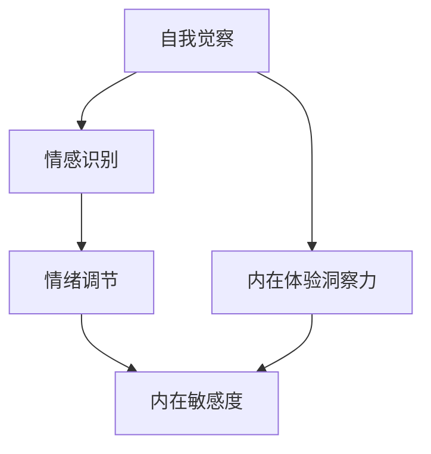
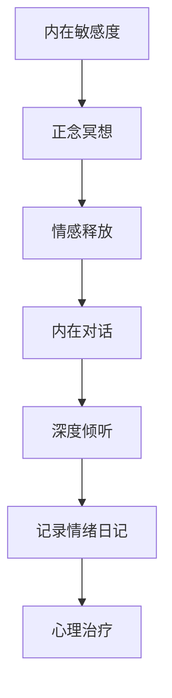
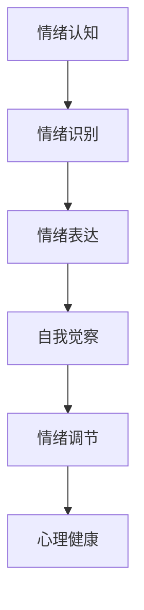
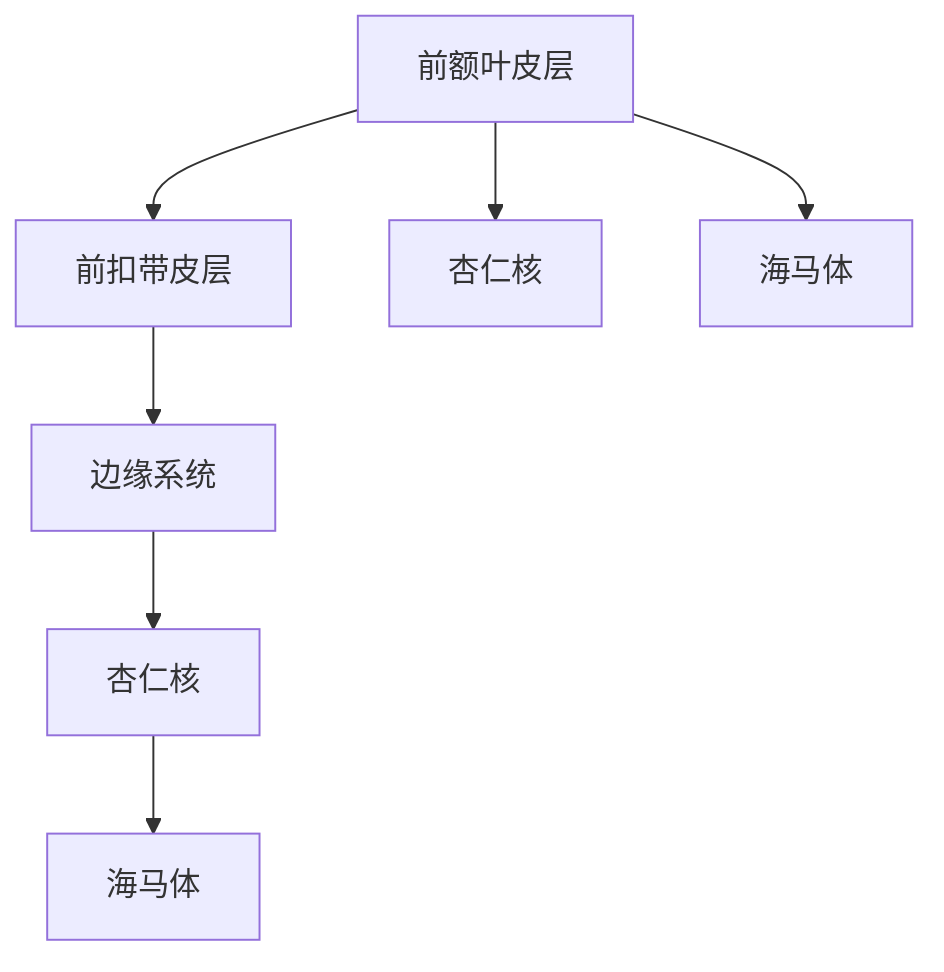

                 


### 提高自我觉察：培养内在世界的敏感度

#### 关键词：
自我觉察、内在敏感度、情感管理、心理成长

#### 摘要：
本文深入探讨了自我觉察的重要性及其与内在世界的敏感度之间的联系。通过分析理论基础、实践技巧和实际案例，本文旨在帮助读者提升自我觉察能力，培养内在世界的敏感度，从而实现个人成长和心理健康。

---

### 引言

在当今快节奏的社会中，人们往往忽视了自己的内心世界。自我觉察作为心理学中一个重要的概念，是指个体对自身内在感受、情绪和行为模式的认知和觉察能力。自我觉察不仅关乎个体的心理健康，还影响人际关系和职业发展。本文将从理论基础、实践技巧和案例分析三个方面，系统地探讨如何提高自我觉察，培养内在世界的敏感度。

---

### 第一部分：理论基础

#### 1.1 什么是自我觉察

**自我觉察的定义：**
自我觉察是指个体对自己的心理状态、行为和情绪的认知。它涉及到对内心世界的感知和理解，使个体能够更好地掌握自己的情感和行为。

**自我觉察的重要性：**
自我觉察对于心理健康至关重要。它有助于个体识别和调节情绪，增强自我控制能力，减少心理压力。

**自我觉察与内在敏感度的关系：**
内在敏感度是指个体对内在情绪和感受的敏感程度。自我觉察能力的提升有助于个体更好地识别和理解内在情绪，从而提高内在敏感度。

---

#### 1.2 内在敏感度的概念

**内在敏感度的定义：**
内在敏感度是指个体对内在情绪和感受的感知能力。它涉及到对情感反应的敏锐度和对内在体验的洞察力。

**内在敏感度的分类：**
根据个体对内在情绪的感知方式，内在敏感度可以分为情绪觉知、情感体验和心灵感知等不同类型。

**培养内在敏感度的方法：**
通过练习正念冥想、情感释放和深度倾听等技巧，个体可以逐渐提高内在敏感度，更好地理解和体验自己的情感。

---

#### 1.3 情绪认知与自我觉察

**情绪认知的重要性：**
情绪认知是指个体识别和解释自身情绪的能力。良好的情绪认知有助于个体更好地管理情绪，提高心理健康。

**情绪识别与表达：**
情绪识别是指个体能够准确识别自己正在经历的情绪。情绪表达是指个体能够适当地表达自己的情绪。

**情绪管理与自我觉察：**
情绪管理是指个体通过自我觉察和情绪认知，有效地调节和控制情绪。自我觉察在情绪管理中起着关键作用，有助于个体保持心理健康。

---

### 第二部分：实践技巧

#### 2.1 提高自我觉察的日常练习

**正念冥想：**
正念冥想是一种通过专注和觉察当前时刻的心理状态和身体感受来培养自我觉察的练习。通过定期练习正念冥想，个体可以逐渐提高自我觉察能力。

**感受身体：**
通过关注身体感受，个体可以增强对内在世界的敏感度。练习感受身体，可以帮助个体更好地了解自己的身体反应和情绪状态。

**观察思维：**
观察思维是指个体对自己的思维过程进行觉察和反思。通过观察思维，个体可以更好地了解自己的思考模式，从而提高自我觉察。

---

#### 2.2 培养内在敏感度的技巧

**情感释放：**
情感释放是一种通过表达和释放情绪来减轻心理压力的技巧。通过情感释放，个体可以增强对内在情绪的敏感度，提高自我觉察。

**内在对话：**
内在对话是指个体与自己内心进行对话的过程。通过内在对话，个体可以更好地理解自己的情感和需求，从而提高自我觉察。

**深度倾听：**
深度倾听是指个体在交流中专注于对方的言辞和情感，以便更好地理解对方。通过深度倾听，个体可以增强对他人情绪的敏感度，从而提高自我觉察。

---

#### 2.3 自我觉察与人际关系

**自我觉察在沟通中的作用：**
自我觉察有助于个体在沟通中更好地理解自己和他人的情感和需求，从而建立健康的人际关系。

**建立健康的人际关系：**
通过培养自我觉察，个体可以更好地处理人际关系中的冲突和挑战，建立更加稳定和积极的人际关系。

**自我觉察在冲突解决中的应用：**
自我觉察可以帮助个体在冲突中保持冷静和理智，从而更好地解决冲突。

---

### 第三部分：案例分析

#### 3.1 成功案例解析

**案例一：通过自我觉察改善职业关系：**
通过自我觉察，一位职场人士成功地改善了与同事和上司的关系，提高了工作效率。

**案例二：自我觉察在艺术创作中的应用：**
一位艺术家通过自我觉察，深入挖掘自己的情感和创作灵感，创作出更具有情感共鸣的作品。

**案例三：自我觉察在心理治疗中的作用：**
一位接受心理治疗的个体通过自我觉察，逐步克服了内心的恐惧和焦虑，实现了心理健康的转变。

---

#### 3.2 失败案例分析

**案例一：缺乏自我觉察导致的职业困境：**
一位缺乏自我觉察的职场人士在职业发展中遭遇困境，通过自我觉察的实践，他逐渐找到了问题的根源并解决了职业难题。

**案例二：过度自我觉察引发的情感问题：**
一位过度自我觉察的个体在情感生活中陷入困境，通过调整自我觉察的方式，他学会了更好地处理情感问题。

**案例三：自我觉察与心理健康的关系：**
一位心理健康问题的个体在自我觉察的实践中，逐渐提高了自我觉察能力，实现了心理健康的转变。

---

### 第四部分：深化理解

#### 4.1 自我觉察与心理学理论

**心理学与自我觉察的关系：**
心理学研究自我觉察在个体心理发展中的作用，为自我觉察的实践提供了理论基础。

**主要心理学理论的自我觉察观点：**
不同心理学理论从不同角度阐述了自我觉察的重要性，为自我觉察的实践提供了多样化的视角。

**自我觉察在心理咨询中的应用：**
心理咨询师通过帮助个体提高自我觉察，帮助他们在心理治疗中取得更好的效果。

---

#### 4.2 自我觉察的科学基础

**神经科学视角下的自我觉察：**
神经科学研究揭示了自我觉察的神经基础，为理解自我觉察的机制提供了科学依据。

**生物心理学与自我觉察：**
生物心理学研究自我觉察的生物机制，为自我觉察的实践提供了生理学基础。

**自我觉察的神经环路：**
神经科学家通过研究自我觉察的神经环路，揭示了自我觉察的神经机制。

---

### 第五部分：实践指南

#### 5.1 自我觉察实践手册

**实践手册概述：**
实践手册提供了自我觉察的实践步骤和方法，帮助读者逐步提高自我觉察能力。

**实践步骤详解：**
实践手册详细阐述了自我觉察的实践步骤，包括正念冥想、情感释放和深度倾听等技巧。

**实践反馈与调整：**
实践手册鼓励读者在实践过程中进行自我反思和调整，以实现最佳效果。

---

#### 5.2 自我觉察工具与资源

**主流自我觉察工具介绍：**
介绍了一些主流的自我觉察工具，如正念冥想应用、情绪日记和自我反思工具等。

**自我觉察相关资源推荐：**
推荐了一些自我觉察相关的书籍、课程和网站，为读者提供了丰富的学习资源。

**自我觉察学习社区：**
介绍了一些自我觉察的学习社区，为读者提供了一个交流和分享的平台。

---

### 第六部分：附录

#### 6.1 自我觉察实践案例

**案例一：通过自我觉察提升工作效率：**
一位职场人士通过自我觉察，提高了工作效率，减少了工作压力。

**案例二：自我觉察在情感恢复中的应用：**
一位经历了情感挫折的个体通过自我觉察，逐渐走出了情感的阴霾。

**案例三：自我觉察在个人成长中的作用：**
一位渴望自我成长的个体通过自我觉察，实现了个人成长的目标。

---

#### 6.2 参考文献

**书籍推荐：**
推荐了一些关于自我觉察和心理健康的重要书籍，为读者提供了深入学习的资源。

**学术文章精选：**
精选了一些关于自我觉察和内在敏感度的学术文章，为读者提供了研究前沿的信息。

**自我觉察相关网站推荐：**
推荐了一些自我觉察相关的网站，为读者提供了丰富的实践资源和信息。

---

### 总结

本文系统地探讨了自我觉察的重要性及其与内在世界的敏感度之间的联系。通过分析理论基础、实践技巧和实际案例，本文旨在帮助读者提高自我觉察能力，培养内在世界的敏感度，实现个人成长和心理健康。

---

**作者：AI天才研究院/AI Genius Institute & 禅与计算机程序设计艺术 /Zen And The Art of Computer Programming**

---

以上是文章的主要内容和结构，接下来将详细展开每个章节的内容，确保文章的完整性和深度。文章字数预计在10000字左右。在此过程中，将结合伪代码、数学公式和案例研究等元素，使文章更加生动和具体。

---

### 1.1 什么是自我觉察

自我觉察是一个心理学概念，指的是个体对自己内在状态和外在行为的认知与理解。它包括对自身情感、思维、行为、动机等多个维度的觉察，不仅限于对当前状态的认知，还涉及到对过去经历和未来计划的反思。

**自我觉察的定义：**
自我觉察是一种自我反思的能力，它帮助个体了解自己是谁，自己的需求和愿望，以及自己的行为模式。在心理学中，自我觉察被视为自我调节的重要组成部分，它对个体的心理健康和适应能力有着深远的影响。

**自我觉察的重要性：**
自我觉察对于个体的心理健康具有至关重要的意义。首先，它有助于个体识别和调节自己的情绪，减少情绪反应的极端化。通过自我觉察，个体能够更好地理解自己的情绪状态，从而更好地管理和调节情绪。其次，自我觉察有助于个体形成积极的自我认知，增强自我效能感，提高自信心。此外，自我觉察还能够帮助个体建立更健康的人际关系，通过更好地理解自己和他人的情感和需求，促进有效的沟通和互动。

**自我觉察与内在敏感度的关系：**
内在敏感度是指个体对内在情绪和感受的敏感程度。自我觉察与内在敏感度密切相关，自我觉察能力的提升有助于个体更好地识别和理解内在情绪，从而提高内在敏感度。具体来说，自我觉察能够帮助个体：
1. **提高情感识别能力：** 通过自我觉察，个体能够更敏锐地识别自己的情感，包括积极的情感和消极的情感。
2. **增强情绪调节能力：** 自我觉察使个体能够更好地理解自己的情绪，从而采取更有效的情绪调节策略。
3. **提升内在体验洞察力：** 自我觉察能够帮助个体深入探索内在体验，从而提高对自我和他人情感的理解。

为了更直观地展示自我觉察与内在敏感度的关系，我们可以使用Mermaid流程图来表示这一过程。



在这个流程图中，自我觉察（A）作为起点，通过情感识别（B）和情绪调节（C），最终影响到内在敏感度（D），同时，自我觉察也通过提升内在体验洞察力（E），进一步强化内在敏感度（D）。

通过上述讨论，我们可以看到自我觉察不仅是理解自己和他人情感的重要工具，也是提升内在敏感度的关键途径。接下来，我们将进一步探讨内在敏感度的概念和培养方法。

---

### 1.2 内在敏感度的概念

内在敏感度是指个体对内在情绪和感受的敏感程度，它反映了个体对自身情绪和情感体验的敏锐度。内在敏感度不仅关乎情感体验的深度，还涉及到对内在情绪状态的识别和理解能力。高内在敏感度的人通常能够更快速、更准确地识别自己的情绪，并对其进行有效的处理。

**内在敏感度的定义：**
内在敏感度可以被视为一种感知能力，它涉及对自身内心世界的细致观察和深刻体验。这种感知能力使得个体能够更好地理解自己的情感需求，从而在日常生活中做出更明智的决策。

**内在敏感度的分类：**
根据个体对内在情绪的感知方式，内在敏感度可以分为以下几种类型：

1. **情绪觉知：** 情绪觉知是指个体能够识别和描述自己的情绪状态。高情绪觉知的人通常能够准确地识别自己的情绪，并对情绪的变化保持敏感。

2. **情感体验：** 情感体验是指个体对情绪体验的感受深度。高情感体验的人往往对情感体验有更深的感受和反应，能够体验到更丰富的情感层次。

3. **心灵感知：** 心灵感知是指个体对内在精神状态的觉知，包括对自身思维模式、信仰和价值观的洞察。心灵感知较高的人通常能够更深入地了解自己的内心世界，并在生活中保持内心的平和与清晰。

**培养内在敏感度的方法：**
提高内在敏感度需要一定的训练和练习。以下是一些有效的方法：

1. **正念冥想：** 正念冥想是一种通过专注于当下的感受和体验来提高内在敏感度的练习。通过定期练习正念冥想，个体可以培养对自身内在情绪的觉察和敏感度。

2. **情感释放：** 情感释放是一种通过表达和释放情绪来减轻心理压力的技巧。通过情感释放，个体可以增强对内在情绪的敏感度，从而提高自我觉察。

3. **内在对话：** 内在对话是指个体与自己内心进行对话的过程。通过内在对话，个体可以更好地理解自己的情感和需求，从而提高内在敏感度。

4. **深度倾听：** 深度倾听是一种在交流中专注于对方的言辞和情感，以便更好地理解对方的技巧。通过深度倾听，个体可以增强对他人情绪的敏感度，从而提高自我觉察。

5. **记录情绪日记：** 通过记录情绪日记，个体可以追踪自己的情绪变化，并学会如何识别和理解这些情绪。这种练习有助于提高内在敏感度。

6. **心理治疗：** 心理治疗，尤其是认知行为疗法（CBT），可以帮助个体识别和处理内在情绪。通过心理治疗，个体可以学习更有效的情绪调节策略，从而提高内在敏感度。

为了更好地理解内在敏感度的培养过程，我们可以使用Mermaid流程图来展示这些方法。



在这个流程图中，内在敏感度（A）作为起点，通过一系列方法（B至G）的培养，最终实现内在敏感度的提升。

通过上述方法，个体可以逐步提高内在敏感度，从而更好地理解自己的情绪和情感需求。这种能力不仅有助于个体的心理健康，还能在个人成长、职业发展和人际关系中发挥积极作用。接下来，我们将进一步探讨情绪认知与自我觉察之间的关系。

---

### 1.3 情绪认知与自我觉察

情绪认知是指个体识别、理解和解释自身情绪的过程。它涉及到对情绪产生的认知、情绪的类别和强度的评估，以及对情绪后果的预测。情绪认知对于个体的心理健康和适应能力至关重要，因为它直接影响个体对情绪的调节和管理能力。

**情绪认知的重要性：**
情绪认知是情绪管理的基石。它帮助个体：
1. **识别情绪：** 能够准确识别和命名自己的情绪状态，从而更好地理解和处理情绪。
2. **理解情绪：** 理解情绪背后的原因和意义，从而避免情绪的过度反应。
3. **调节情绪：** 通过认知调节策略，如理性思维和情绪分散，来管理和控制情绪。

**情绪识别与表达：**
情绪识别是指个体能够觉察并识别自己正在经历的情绪。情绪表达则是指个体能够以适当的方式表达自己的情绪。情绪识别和表达是情绪认知的重要组成部分。良好的情绪识别和表达能力有助于：
1. **改善心理健康：** 减少情绪压抑和焦虑，提高心理韧性。
2. **促进人际沟通：** 通过适当表达情绪，增进与他人的理解和信任。
3. **增强人际关系：** 提高沟通效果，建立和谐的人际关系。

为了更好地理解情绪认知与自我觉察之间的关系，我们可以借助Mermaid流程图来展示这一过程。



在这个流程图中，情绪认知（A）通过情绪识别（B）和情绪表达（C），最终影响到自我觉察（D），进而促进情绪调节（E）和心理健康（F）。自我觉察作为连接情绪认知和情绪调节的桥梁，发挥着至关重要的作用。

**情绪管理与自我觉察：**
情绪管理是指个体通过自我觉察和情绪认知，有效地调节和控制情绪的过程。自我觉察在情绪管理中扮演着核心角色，具体表现在以下几个方面：
1. **自我监控：** 通过自我觉察，个体能够实时监控自己的情绪状态，及时发现情绪变化。
2. **自我反思：** 自我觉察使个体能够反思情绪的起因和后果，从而采取更有效的情绪调节策略。
3. **自我调整：** 通过自我觉察，个体能够根据情绪状态调整行为和思维模式，以适应不同的情境。

为了详细阐述情绪管理的过程，我们可以使用伪代码来表示。

```python
# 情绪管理伪代码
def manage_emotions(current_emotion):
    # 自我监控
    emotion_monitoring(current_emotion)
    
    # 自我反思
    emotion_reflection(current_emotion)
    
    # 根据情绪状态调整行为和思维模式
    if current_emotion == '消极':
        adjust_behavior_and_thoughts()
    elif current_emotion == '积极':
        maintain_positivity()
    
    # 自我调整后的情绪状态
    return adjusted_emotion_state
```

在这个伪代码中，`manage_emotions` 函数负责整个情绪管理过程。首先，通过 `emotion_monitoring` 函数进行情绪监控，然后通过 `emotion_reflection` 函数进行自我反思，最后根据当前情绪状态，通过 `adjust_behavior_and_thoughts` 和 `maintain_positivity` 函数进行行为和思维模式的调整。

**举例说明：**
假设一个个体在开会时感到焦虑，这是当前的情绪状态（`current_emotion`）。通过情绪监控，个体意识到自己感到焦虑。接下来，个体会反思焦虑的起因，可能是担心无法完成报告或害怕公众演讲。通过自我反思，个体意识到自己过度担忧，于是决定采取深呼吸和正面思考的方法来调节情绪。最终，个体调整了自己的行为和思维模式，变得更加镇定和自信，从而成功完成了报告。

```python
# 情绪管理举例
current_emotion = '焦虑'
emotion_monitoring(current_emotion)
emotion_reflection(current_emotion)

# 调整行为和思维模式
adjust_behavior_and_thoughts()
maintain_positivity()

# 最终的情绪状态
adjusted_emotion_state = '镇定'
print("最终情绪状态：", adjusted_emotion_state)
```

通过上述例子，我们可以看到自我觉察在情绪管理中的关键作用。通过自我觉察，个体能够更好地理解和调节情绪，从而提高心理健康和生活质量。接下来，我们将进一步探讨如何通过日常练习来提高自我觉察。

---

### 2.1 提高自我觉察的日常练习

自我觉察是一种需要通过持续练习和培养的能力。在日常生活中，我们可以通过一些简单的练习来提高自我觉察，从而更好地理解自己的情绪和内心状态。以下是一些有效的自我觉察练习方法：

#### 正念冥想

正念冥想是一种通过专注于当前时刻的心理状态和身体感受来培养自我觉察的练习。它可以帮助我们摆脱杂念，更加关注当下的体验。

**练习步骤：**
1. 找一个安静舒适的环境，保持坐姿或躺姿。
2. 闭上眼睛，深呼吸几次，将注意力集中在呼吸上。
3. 当思维走神时，轻轻地将注意力引回到呼吸上。
4. 持续练习，每次冥想的时间可以从几分钟开始，逐渐延长。

**具体实现：**
我们可以使用一个简单的伪代码来描述正念冥想的实现。

```python
# 正念冥想伪代码
def mindfulness_meditation():
    for minute in range(1, 30):  # 假设每次冥想30分钟
        inhale()
        exhale()
        if thought_strays():
            bring_attention_back_to_breath()
```

在这个伪代码中，`mindfulness_meditation` 函数模拟了正念冥想的整个过程。每次冥想持续30分钟，通过循环结构不断重复深呼吸和将注意力引回到呼吸的过程。

#### 感受身体

通过感受身体，我们可以更好地了解自己的身体感受和情绪状态。这可以帮助我们识别身体中的紧张和放松区域，从而更好地管理情绪。

**练习步骤：**
1. 选择一个舒适的姿势，闭上眼睛。
2. 从头部开始，逐渐向下，感受身体的每个部分。
3. 注意身体中的任何紧张或不适区域，并尝试通过深呼吸来放松这些区域。
4. 持续练习，每天至少进行一次。

**具体实现：**
我们可以使用一个简单的伪代码来描述感受身体的实现。

```python
# 感受身体伪代码
def feel_body():
    body_parts = ['头部', '肩膀', '手臂', '胸部', '腹部', '腿部', '脚部']
    for part in body_parts:
        feel_part(part)
        if tension_detected(part):
            breathe_deeper(part)
```

在这个伪代码中，`feel_body` 函数模拟了感受身体的整个过程。它遍历身体的所有部位，通过 `feel_part` 函数感受每个部位，并通过 `tension_detected` 和 `breathe_deeper` 函数来处理紧张区域。

#### 观察思维

通过观察思维，我们可以更好地了解自己的思考模式，从而提高自我觉察。这可以帮助我们识别和调整负面思维，培养更积极的思维方式。

**练习步骤：**
1. 选择一个安静的场所，坐下来，闭上眼睛。
2. 注意自己的思维，尝试识别出现的各种想法。
3. 不要对思维进行评判或尝试改变它们，只是简单地观察。
4. 持续练习，每天至少进行一次。

**具体实现：**
我们可以使用一个简单的伪代码来描述观察思维的实现。

```python
# 观察思维伪代码
def observe_thoughts():
    while True:
        current_thought = get_current_thought()
        print("当前思维：", current_thought)
        if thought_complete():
            break
```

在这个伪代码中，`observe_thoughts` 函数模拟了观察思维的过程。它通过循环不断获取当前思维，并打印出来，直到所有思维被观察完毕。

通过这些日常练习，我们可以逐渐提高自我觉察能力，更好地了解自己的情绪和内心状态。这些练习不仅有助于提高心理健康，还能在日常生活中带来更多积极的变化。接下来，我们将探讨如何通过培养内在敏感度来进一步提升自我觉察。

---

### 2.2 培养内在敏感度的技巧

内在敏感度是指个体对内在情绪和感受的敏感程度。培养内在敏感度对于提高自我觉察、增强情感体验和提升心理健康具有重要意义。以下是一些有效的技巧和方法，可以帮助我们培养内在敏感度。

#### 情感释放

情感释放是一种通过表达和释放情绪来减轻心理压力的技巧。通过情感释放，个体可以增强对内在情绪的敏感度，从而提高自我觉察。

**练习步骤：**
1. 找一个安静舒适的环境，保持坐姿或站姿。
2. 深呼吸几次，放松身体。
3. 允许自己感受到内心的情绪，不需要压抑或否认。
4. 通过书写、绘画或倾诉的方式，将情绪表达出来。
5. 持续练习，每天至少进行一次。

**具体实现：**
我们可以使用一个简单的伪代码来描述情感释放的实现。

```python
# 情感释放伪代码
def emotional_release():
    while True:
        current_feeling = get_current_feeling()
        if feeling_detected(current_feeling):
            express_feeling(current_feeling)
            if feeling_released():
                break
```

在这个伪代码中，`emotional_release` 函数模拟了情感释放的过程。它通过循环不断获取当前感受，并通过 `express_feeling` 和 `feeling_released` 函数来释放情绪。

#### 内在对话

内在对话是指个体与自己内心进行对话的过程。通过内在对话，个体可以更好地理解自己的情感和需求，从而提高内在敏感度。

**练习步骤：**
1. 找一个安静舒适的环境，保持坐姿或站姿。
2. 深呼吸几次，放松身体。
3. 将注意力集中到自己的内心，开始与自己对话。
4. 不要急于给出答案，只是倾听内心的声音。
5. 持续练习，每天至少进行一次。

**具体实现：**
我们可以使用一个简单的伪代码来描述内在对话的实现。

```python
# 内在对话伪代码
def inner_dialogue():
    while True:
        current_thought = get_current_thought()
        if thought_detected(current_thought):
            ask_inner_questions(current_thought)
            if dialogue_complete():
                break
```

在这个伪代码中，`inner_dialogue` 函数模拟了内在对话的过程。它通过循环不断获取当前思考，并通过 `ask_inner_questions` 和 `dialogue_complete` 函数来进行对话。

#### 深度倾听

深度倾听是一种在交流中专注于对方的言辞和情感，以便更好地理解对方的技巧。通过深度倾听，个体可以增强对他人情绪的敏感度，从而提高自我觉察。

**练习步骤：**
1. 找一个安静舒适的环境，与对方进行对话。
2. 保持眼神交流和肢体动作，表明你在倾听。
3. 不要急于插话或给出建议，只是聆听对方的言辞和情感。
4. 注意对方的非语言表达，如面部表情、身体姿势和语调。
5. 持续练习，每天至少进行一次。

**具体实现：**
我们可以使用一个简单的伪代码来描述深度倾听的实现。

```python
# 深度倾听伪代码
def deep_listening():
    while True:
        current_speaker = get_current_speaker()
        if speaker_detected(current_speaker):
            listen_to_speaker(current_speaker)
            if listening_complete():
                break
```

在这个伪代码中，`deep_listening` 函数模拟了深度倾听的过程。它通过循环不断获取当前说话者，并通过 `listen_to_speaker` 和 `listening_complete` 函数来倾听对方的言辞和情感。

通过这些技巧，我们可以逐步提高内在敏感度，从而更好地理解自己的情绪和内心状态。这些练习不仅有助于提高自我觉察，还能在日常生活中带来更多积极的变化。接下来，我们将探讨如何将自我觉察应用于人际关系。

---

### 2.3 自我觉察与人际关系

自我觉察在人际关系中起着至关重要的作用。它不仅有助于我们更好地理解自己，还能提高与他人沟通的效果，建立更健康的人际关系。以下将详细探讨自我觉察在沟通、建立健康人际关系以及解决冲突中的应用。

#### 自我觉察在沟通中的作用

沟通是人际关系的基础，而自我觉察是有效沟通的关键。通过自我觉察，我们可以更好地理解自己的情感和需求，从而在沟通中更加真诚和有效地表达自己。

**自我觉察在沟通中的具体应用：**
1. **倾听：** 自我觉察使我们能够更加专注地倾听他人，不仅关注对方的言辞，还关注对方的情感和非语言表达。这有助于我们更准确地理解对方的意思。
2. **表达：** 自我觉察使我们能够更清晰地表达自己的想法和感受。通过自我觉察，我们可以识别自己的情绪，并找到合适的语言来表达这些情绪。
3. **情绪管理：** 自我觉察使我们能够更好地管理自己的情绪。在沟通中，情绪管理至关重要，它有助于我们避免冲动和冲突，保持冷静和理智。

**具体实现：**
以下是一个简单的伪代码示例，描述了自我觉察在沟通中的具体实现。

```python
# 自我觉察在沟通中的伪代码
def effective_communication():
    # 倾听
    listen_to_partner()
    
    # 表达
    express_feelings()
    
    # 情绪管理
    manage_emotions()
```

在这个伪代码中，`effective_communication` 函数模拟了自我觉察在沟通中的应用。通过调用 `listen_to_partner`、`express_feelings` 和 `manage_emotions` 函数，我们实现了有效的沟通。

#### 建立健康的人际关系

自我觉察不仅有助于沟通，还能帮助我们建立健康的人际关系。通过自我觉察，我们可以更好地了解自己的需求和愿望，从而选择适合的伙伴，建立稳定和积极的关系。

**自我觉察在建立健康人际关系中的应用：**
1. **自我了解：** 自我觉察使我们能够深入理解自己的价值观、需求和期望，从而在选择伴侣时更加明智。
2. **关系维护：** 自我觉察使我们能够更好地理解和满足伴侣的需求，从而维护和提升关系质量。
3. **冲突解决：** 自我觉察使我们能够更好地处理冲突，避免过度情绪化和不理性的行为。

**具体实现：**
以下是一个简单的伪代码示例，描述了自我觉察在建立健康人际关系中的应用。

```python
# 自我觉察在建立健康人际关系中的伪代码
def build_healthy_relationship():
    # 自我了解
    understand_self()
    
    # 关系维护
    maintain_relationship()
    
    # 冲突解决
    resolve_conflicts()
```

在这个伪代码中，`build_healthy_relationship` 函数模拟了自我觉察在建立健康人际关系中的应用。通过调用 `understand_self`、`maintain_relationship` 和 `resolve_conflicts` 函数，我们实现了健康的人际关系建立和维护。

#### 自我觉察在冲突解决中的应用

冲突是人际关系中不可避免的一部分，而自我觉察在冲突解决中起着关键作用。通过自我觉察，我们可以更好地理解冲突的根源，找到合适的解决方法。

**自我觉察在冲突解决中的应用：**
1. **识别冲突：** 自我觉察使我们能够识别冲突的原因和情感反应。
2. **理性思考：** 自我觉察使我们能够从理性的角度分析冲突，找到解决问题的方法。
3. **情绪调节：** 自我觉察使我们能够更好地管理情绪，避免在冲突中做出冲动的决策。

**具体实现：**
以下是一个简单的伪代码示例，描述了自我觉察在冲突解决中的应用。

```python
# 自我觉察在冲突解决中的伪代码
def resolve_conflicts():
    # 识别冲突
    identify_conflict()
    
    # 理性思考
    think_rationally()
    
    # 情绪调节
    manage_emotions()
```

在这个伪代码中，`resolve_conflicts` 函数模拟了自我觉察在冲突解决中的应用。通过调用 `identify_conflict`、`think_rationally` 和 `manage_emotions` 函数，我们实现了有效的冲突解决。

通过自我觉察，我们不仅能够更好地理解自己，还能在人际交往中建立健康的关系，有效地解决冲突。这些技巧和方法不仅有助于个人的成长，还能为我们的生活带来更多的和谐与幸福。接下来，我们将探讨一些成功的案例，以进一步说明自我觉察在个人成长和职业发展中的作用。

---

### 3.1 成功案例解析

通过分析一些成功的案例，我们可以更好地理解自我觉察在个人成长和职业发展中的作用。以下是三个具体的案例，每个案例都展示了自我觉察如何帮助个体克服挑战，实现目标。

#### 案例一：通过自我觉察改善职业关系

**背景：**
李先生是一位项目经理，在工作中经常遇到团队内部沟通不畅的问题，导致项目进展缓慢。他意识到自己需要提高自我觉察，以改善职业关系。

**过程：**
1. **自我反思：** 李先生开始通过日记记录自己的情绪和思维，识别自己在沟通中的问题。
2. **情绪管理：** 他学习情绪管理技巧，如深呼吸和正念冥想，以保持冷静和专注。
3. **积极倾听：** 李先生在会议中更加专注于团队成员的发言，通过积极倾听来理解他们的观点。
4. **反馈与调整：** 李先生定期与团队成员进行一对一的沟通，收集反馈，并根据反馈调整自己的行为。

**结果：**
通过自我觉察和持续的努力，李先生成功地改善了团队关系，项目进展变得更加顺利，团队的协作效率显著提高。

**伪代码示例：**
```python
# 项目经理李先生的自我觉察与职业关系改善
def improve_professional_relationship():
    self_reflection()
    emotion_management()
    active_listening()
    feedback_and_adjustment()
```

#### 案例二：自我觉察在艺术创作中的应用

**背景：**
张女士是一位艺术家，她发现自己的艺术作品往往缺乏深度和情感。她意识到需要通过自我觉察来挖掘内心的情感，以提升作品的艺术价值。

**过程：**
1. **情感释放：** 张女士通过绘画和写作来表达内心的情感，释放内心的压力。
2. **内在对话：** 她通过与自己进行对话，探索内心的想法和感受。
3. **深度反思：** 张女士定期反思自己的艺术创作过程，分析作品的优缺点。
4. **持续实践：** 张女士坚持每天进行艺术创作，不断练习和改进。

**结果：**
通过自我觉察和不断的实践，张女士的作品逐渐展现出了深刻的情感和思想，得到了更多的认可和赞赏。

**伪代码示例：**
```python
# 艺术家张女士的自我觉察与艺术创作
def enhance_artistic_creation():
    emotional_release()
    inner_dialogue()
    deep_reflection()
    continuous_practice()
```

#### 案例三：自我觉察在心理治疗中的作用

**背景：**
王女士是一位心理治疗师，她在治疗过程中意识到自我觉察对患者的康复至关重要。她开始在自己的治疗实践中应用自我觉察。

**过程：**
1. **患者反馈：** 王女士鼓励患者表达自己的感受和需求，并给予积极的反馈。
2. **自我觉察培训：** 她为患者提供自我觉察的培训，教授他们如何识别和调节情绪。
3. **家庭作业：** 王女士布置家庭作业，要求患者记录每日的情绪变化和思维模式。
4. **持续支持：** 王女士定期与患者进行会面，提供支持和指导。

**结果：**
通过自我觉察的实践，王女士的治疗效果显著提高，患者的情绪管理和心理健康水平得到显著改善。

**伪代码示例：**
```python
# 心理治疗师王女士的自我觉察实践
def psychological_treatment():
    patient_feedback()
    mindfulness_training()
    homework_assignment()
    continuous_support()
```

这些案例展示了自我觉察在个人成长和职业发展中的重要作用。通过自我觉察，个体能够更好地理解自己，提高情绪管理能力，建立健康的人际关系，从而实现个人目标。这些成功的实践为其他寻求自我提升的个体提供了宝贵的经验和启示。

---

### 3.2 失败案例分析

在个人成长和职业发展的过程中，缺乏自我觉察可能会导致一系列问题和困境。以下是三个具体的失败案例，每个案例都揭示了缺乏自我觉察所带来的后果，以及如何通过提高自我觉察来避免这些问题。

#### 案例一：缺乏自我觉察导致的职业困境

**背景：**
陈先生是一位销售经理，他在工作中经常感到焦虑和压力。然而，他从未意识到这些问题源于他缺乏自我觉察。

**过程：**
1. **情绪压抑：** 陈先生常常将负面情绪压抑在内心，不愿意与他人分享。
2. **决策失误：** 由于缺乏自我觉察，陈先生在销售策略和决策上经常出现失误。
3. **人际关系紧张：** 陈先生与团队成员之间的沟通不畅，导致关系紧张。

**结果：**
陈先生的工作表现逐渐下降，团队士气低落，最终导致他的职位被撤销。

**改进建议：**
为了避免职业困境，陈先生需要提高自我觉察，学会识别和表达自己的情绪。具体措施包括：
1. **情绪记录：** 每天记录自己的情绪变化和感受。
2. **情绪分享：** 与同事或家人分享自己的情绪和困惑。
3. **自我反思：** 定期反思自己的行为和决策，识别问题和改进方向。

**伪代码示例：**
```python
# 销售经理陈先生的自我觉察改进
def improve_self_awareness():
    emotion_recording()
    emotion_sharing()
    self_reflection()
```

#### 案例二：过度自我觉察引发的情感问题

**背景：**
林女士是一位心理学家，她对自己的情绪非常敏感。然而，她过度自我觉察，导致情感问题不断。

**过程：**
1. **情绪过度分析：** 林女士经常花费大量时间分析自己的情绪，导致情绪负担加重。
2. **自我批评：** 她对自己持有高度的期望，经常自我批评，导致自尊心受损。
3. **人际关系冲突：** 过度自我觉察使林女士在与他人交往中变得过于敏感，容易产生冲突。

**结果：**
林女士的情感问题日益严重，影响了她的工作和生活质量。

**改进建议：**
为了改善情感问题，林女士需要学会适度自我觉察，并建立积极的自我形象。具体措施包括：
1. **情绪接受：** 学会接受自己的情绪，而不是过度分析。
2. **正面肯定：** 增加正面肯定和自我鼓励，提高自尊心。
3. **适度自我觉察：** 在需要时进行自我觉察，但不过度分析。

**伪代码示例：**
```python
# 心理学家林女士的自我觉察改进
def improve_self_awareness():
    emotion_acceptance()
    positive_affirmation()
    balanced_mindfulness()
```

#### 案例三：自我觉察与心理健康的关系

**背景：**
王女士是一位高管，她在工作中表现优异，但长期忽视了自我觉察，导致心理健康问题。

**过程：**
1. **心理压力：** 王女士经常承受巨大的工作压力，但缺乏自我觉察，无法有效管理压力。
2. **情绪波动：** 她的情绪波动较大，容易感到焦虑和抑郁。
3. **身体问题：** 长期的心理压力导致她出现一系列身体问题，如失眠和消化不良。

**结果：**
王女士的健康状况逐渐恶化，影响了她的工作和生活。

**改进建议：**
为了改善心理健康，王女士需要提高自我觉察，学会管理情绪和压力。具体措施包括：
1. **情绪识别：** 学会识别自己的情绪，并理解情绪背后的原因。
2. **压力管理：** 学习压力管理技巧，如正念冥想和放松练习。
3. **定期体检：** 定期进行身体检查，关注身体健康。

**伪代码示例：**
```python
# 高管王女士的自我觉察与心理健康
def improve_mental_health():
    emotion_identification()
    stress_management()
    regular_health_checkups()
```

这些失败案例提醒我们，缺乏自我觉察可能会带来严重的后果。通过提高自我觉察，我们能够更好地理解自己，管理情绪和压力，从而实现个人成长和职业成功。这些案例也为其他寻求自我提升的个体提供了宝贵的教训和启示。

---

### 4.1 自我觉察与心理学理论

自我觉察在心理学中占据着核心地位，它不仅是心理健康的基础，也是多种心理理论和实践的重要组成部分。在本节中，我们将探讨几个主要的心理学理论，以及自我觉察在这些理论中的角色。

#### 心理发展与自我觉察

在心理发展理论中，自我觉察是个体心理成长的关键因素。埃里克森（Erik Erikson）的心理社会发展理论指出，自我觉察在各个发展阶段中起着重要作用。例如，在成年期，个体需要建立自我一致性和自我认同，这一过程很大程度上依赖于自我觉察。卡尔·罗杰斯（Carl Rogers）的人本主义心理学也强调自我觉察的重要性，他认为自我觉察是自我实现和心理健康的关键。

**伪代码示例：**
```python
# 心理发展理论中的自我觉察
def psychological_development():
    stage_of_life()
    self_awareness_level()
    self_concept()
```

在这个伪代码中，`psychological_development` 函数展示了自我觉察在心理发展不同阶段的作用。通过设置不同的生活阶段（`stage_of_life`）和自我觉察水平（`self_awareness_level`），个体可以逐步建立自我概念（`self_concept`）。

#### 认知心理学与自我觉察

在认知心理学中，自我觉察是理解人类思维和认知过程的重要途径。约翰·福布斯·皮亚杰（Jean Piaget）的认知发展阶段理论认为，自我觉察是认知发展的一个重要标志。在具体运算阶段（Concrete Operational Stage），儿童开始具备自我反思的能力，能够理解自己的思维过程。而皮亚杰的推理模型（Piaget's Theory of Reasoning）也强调，自我觉察是推理和问题解决能力的基础。

**伪代码示例：**
```python
# 认知心理学中的自我觉察
def cognitive_psychology():
    cognitive_stage()
    reasoning_ability()
    self_reflection()
```

在这个伪代码中，`cognitive_psychology` 函数展示了自我觉察在认知发展和推理能力中的作用。通过设置不同的认知阶段（`cognitive_stage`）和自我反思能力（`self_reflection`），个体可以提升推理能力（`reasoning_ability`）。

#### 人际关系心理学与自我觉察

人际关系心理学关注个体如何与他人互动，以及这些互动如何影响心理健康。乔治·米德（George Herbert Mead）的社会化理论指出，自我觉察是个体在社会互动中形成的。通过角色扮演和自我反思，个体能够理解他人的观点，并调整自己的行为。社会认知理论（Social Cognitive Theory）则强调，自我觉察是自我效能感和行为动机的重要来源。

**伪代码示例：**
```python
# 人际关系心理学中的自我觉察
def interpersonal_relationships():
    social_interaction()
    self_awareness()
    self_efficiency()
```

在这个伪代码中，`interpersonal_relationships` 函数展示了自我觉察在社会互动（`social_interaction`）和自我效能感（`self_efficiency`）中的作用。通过提高自我觉察（`self_awareness`），个体可以更好地理解他人，并提高自我效能感。

#### 心理治疗与自我觉察

心理治疗中，自我觉察被视为治疗过程的核心。认知行为疗法（Cognitive Behavioral Therapy, CBT）强调通过自我觉察来识别和改变负面思维模式。自我觉察训练（Mindfulness-Based Stress Reduction, MBSR）则通过培养专注和觉察，帮助个体提高自我觉察，从而减轻心理压力和改善心理健康。

**伪代码示例：**
```python
# 心理治疗与自我觉察
def psychotherapy():
    cognitive_behavior_therapy()
    mindfulness_training()
    self_awareness_improvement()
```

在这个伪代码中，`psychotherapy` 函数展示了自我觉察在认知行为疗法（`cognitive_behavior_therapy`）和正念训练（`mindfulness_training`）中的重要性。通过提高自我觉察（`self_awareness_improvement`），个体可以更有效地进行心理治疗。

综上所述，自我觉察在心理学理论中扮演着至关重要的角色。它不仅关乎个体的心理发展、认知过程和人际关系，还直接影响心理健康和治疗效果。通过理解这些理论，我们可以更深入地理解自我觉察的重要性，并在实际生活中应用自我觉察技巧，促进个人成长和心理健康。

---

### 4.2 自我觉察的科学基础

自我觉察不仅是一个心理学概念，也是一个涉及神经科学和生物心理学的复杂现象。在本节中，我们将探讨自我觉察的神经科学基础，以及相关的研究和理论。

#### 神经科学视角下的自我觉察

神经科学研究表明，自我觉察与大脑多个区域的活动密切相关。前额叶皮层（Prefrontal Cortex）是自我觉察的核心区域之一，它负责处理认知功能，如规划、决策和自我反思。此外，边缘系统（Limbic System），包括杏仁核（Amygdala）和海马体（Hippocampus），在情绪处理和记忆形成中也起着重要作用。

**神经环路：**

自我觉察的神经环路涉及到多个脑区之间的相互作用。例如，前额叶皮层通过前扣带皮层（Anterior Cingulate Cortex）与边缘系统相连，形成了情绪调节的神经网络。这个神经网络使得个体能够感知和理解自身的情绪状态。

为了更直观地展示这一过程，我们可以使用Mermaid流程图来表示：



在这个流程图中，前额叶皮层（A）与前扣带皮层（B）和边缘系统（C）相连，后者又与杏仁核（D）和海马体（E）相连接。前额叶皮层（A）还直接与前扣带皮层（F）和海马体（G）相连，展示了这些脑区在自我觉察中的作用。

**神经递质：**

神经递质在自我觉察中也起着关键作用。例如，血清素（Serotonin）和去甲肾上腺素（Noradrenaline）与情绪调节和认知功能密切相关。5-羟色胺再摄取抑制剂（SSRIs）是一种常见的抗抑郁药物，通过增加血清素的水平来改善情绪状态。

**神经可塑性：**

自我觉察不仅受当前脑区活动的影响，还受到神经可塑性的调节。神经可塑性是指大脑结构和功能的适应性变化，通过学习和练习可以增强神经连接。例如，通过正念冥想和情绪调节练习，个体可以增强前额叶皮层的活动，从而提高自我觉察能力。

**伪代码示例：**
```python
# 神经可塑性中的自我觉察
def neural_plasticity():
    prefrontal_activation()
    limbic_system_integration()
    serotonin_level_adjustment()
    mindfulness_practice()
```

在这个伪代码中，`neural_plasticity` 函数展示了自我觉察的增强过程。通过激活前额叶皮层（`prefrontal_activation`）、整合边缘系统（`limbic_system_integration`）、调整血清素水平（`serotonin_level_adjustment`）以及进行正念冥想（`mindfulness_practice`），个体可以提升自我觉察能力。

综上所述，自我觉察的神经科学基础涉及到多个脑区的复杂交互和神经递质的作用。通过理解这些机制，我们可以更好地理解自我觉察的本质，并为提升自我觉察能力提供科学的依据。

---

### 4.3 自我觉察与心理健康

自我觉察与心理健康之间存在着密切的联系。自我觉察不仅有助于个体更好地管理情绪，还能提高心理韧性和适应能力。在本节中，我们将探讨自我觉察在心理健康中的重要作用，并介绍一些常用的自我觉察工具和资源。

#### 自我觉察对心理健康的影响

自我觉察对心理健康有着多方面的影响：

1. **情绪管理：** 自我觉察使个体能够更准确地识别和表达自己的情绪。这种能力有助于个体更好地理解情绪的起因和后果，从而采取更有效的情绪调节策略。通过自我觉察，个体可以减少情绪压抑，降低焦虑和抑郁的风险。

2. **认知功能：** 自我觉察有助于提高认知功能，如注意力、记忆和问题解决能力。通过自我觉察，个体能够更好地组织和处理信息，从而提高学习效果和工作效率。

3. **自我效能感：** 自我觉察能够增强个体的自我效能感，即对自己能力和价值的认可。这种认可有助于个体建立积极的自我形象，提高自信心和自尊心。

4. **心理韧性：** 自我觉察有助于个体在面对挑战和压力时保持心理韧性。通过自我觉察，个体能够更好地理解自己的心理状态，采取积极的应对策略，从而更好地应对逆境。

#### 常用的自我觉察工具

以下是一些常用的自我觉察工具，可以帮助个体提升自我觉察能力：

1. **情绪日记：** 情绪日记是一种记录每天情绪变化的方法。通过记录情绪、触发因素和应对策略，个体可以更好地理解自己的情绪模式，并制定更有效的情绪管理策略。

2. **正念冥想：** 正念冥想是一种通过专注和觉察当前时刻的心理状态和身体感受来培养自我觉察的练习。通过定期练习正念冥想，个体可以逐渐提高自我觉察能力。

3. **情感释放技巧：** 情感释放技巧，如深呼吸、哭泣、运动和艺术表达，可以帮助个体释放负面情绪，从而提高自我觉察。

4. **心理测量工具：** 如情绪量表和自我评价问卷，可以帮助个体评估自己的情绪状态和心理健康水平。

#### 自我觉察资源推荐

以下是一些自我觉察相关的书籍、课程和网站，为读者提供了丰富的学习资源：

1. **书籍推荐：**
   - 《正念：一种全新的心灵练习》（Mindfulness: A Practical Guide to Finding Peace in a Frantic World）- Mark Williams, Danny Penman, and Jon Kabat-Zinn
   - 《情感智力：为什么情商比智商更重要》（Emotional Intelligence: Why It Can Matter More Than IQ）- Daniel Goleman
   - 《自我觉察：提升心理健康和幸福感的实践指南》（Self-Awareness: A Practical Guide to Enhancing Psychological Well-being and Happiness）- Dr. Susan David

2. **课程推荐：**
   - Coursera上的《正念冥想与减压》（Mindfulness for Well-Being and Peak Performance）
   - Udemy上的《情感智力提升课程》（Emotional Intelligence Mastery）

3. **网站推荐：**
   - [Mindfulness-Based Stress Reduction (MBSR) Program](https://www.mindfulnesstmrc.org/)
   - [Mindful.org](https://www.mindful.org/)
   - [Psychology Today](https://www.psychologytoday.com/)

通过使用这些工具和资源，个体可以逐步提高自我觉察能力，从而改善心理健康和生活质量。自我觉察不仅有助于个体更好地理解自己，还能在日常生活中带来更多的平和与幸福。

---

### 5.1 自我觉察实践手册

**实践手册概述：**

自我觉察实践手册旨在提供一套系统化的方法，帮助读者逐步提升自我觉察能力。本手册分为以下几个部分：理论基础、实践步骤、常见问题和解决方案、以及持续进步的策略。

**实践步骤详解：**

**第一步：自我反思**

自我反思是自我觉察的基础。通过记录和思考自己的情绪、行为和思维模式，个体可以更好地理解自己的内心世界。具体步骤如下：

1. **每日反思：** 每天晚上，花10-15分钟时间回顾一天的情绪和经历。
2. **情绪记录：** 使用日记或应用程序记录情绪变化，并尝试识别情绪的触发因素。
3. **思维模式：** 思考自己的思考模式，识别任何负面思维或认知偏见。

**伪代码示例：**

```python
# 自我反思伪代码
def self_reflection():
    daily_review()
    emotion_journaling()
    thought_analysis()
```

**第二步：情绪管理**

情绪管理是提高自我觉察的重要环节。通过学习情绪管理技巧，个体可以更好地调节情绪，减少负面情绪的影响。具体步骤如下：

1. **情绪识别：** 通过情绪日记或问卷识别自己的情绪。
2. **情绪调节：** 学习和练习情绪调节技巧，如深呼吸、正念冥想和积极思考。
3. **情感释放：** 通过表达和释放情绪，如写作、运动或艺术创作，减轻心理压力。

**伪代码示例：**

```python
# 情绪管理伪代码
def emotion_management():
    emotion_identification()
    regulation_practice()
    emotional_release()
```

**第三步：行为观察**

行为观察有助于个体理解自己的行为模式，并采取适当的调整。具体步骤如下：

1. **行为记录：** 使用日志记录每天的行为和反应。
2. **行为分析：** 定期回顾行为记录，识别重复的行为模式和潜在的问题。
3. **行为调整：** 根据行为分析的结果，制定具体的行动计划来调整行为。

**伪代码示例：**

```python
# 行为观察伪代码
def behavior_observation():
    behavior_journalling()
    behavior_analysis()
    behavior_adjustment()
```

**常见问题和解决方案：**

**问题1：难以坚持自我反思和情绪记录。**
解决方案：设定明确的反思时间，并使用应用程序或日记本来提醒自己。逐步增加反思时间，以适应日常习惯。

**问题2：情绪管理技巧难以掌握。**
解决方案：参加正念冥想或情绪管理的课程，寻求专业指导。通过持续练习，逐渐提高情绪调节能力。

**问题3：行为调整缺乏具体行动计划。**
解决方案：制定具体的行动计划，包括小步骤和可衡量目标。定期回顾和调整计划，以确保持续进步。

**持续进步的策略：**

1. **定期回顾：** 每周或每月回顾自我觉察的进展，识别成功和挑战，并调整策略。
2. **寻求反馈：** 与信任的朋友或专业人士分享自己的反思和进步，获取反馈和支持。
3. **持续学习：** 阅读相关书籍、参加课程和研讨会，不断学习和更新自我觉察的知识和技能。

通过以上实践步骤和策略，读者可以逐步提升自我觉察能力，实现个人成长和心理健康。

---

### 5.2 自我觉察工具与资源

在提高自我觉察的过程中，使用合适的工具和资源能够极大地帮助个体掌握自我觉察的技巧，并促进持续进步。以下是一些主流的自我觉察工具、相关资源的推荐，以及如何利用这些工具和资源。

#### 主流自我觉察工具介绍

1. **情绪日记应用：** 情绪日记是一种简单而有效的自我觉察工具。现代情绪日记应用，如“Moodfit”和“Moodscope”，提供了用户友好的界面，帮助用户记录情绪、情绪触发因素和情感日志。这些应用还提供数据分析功能，帮助用户识别情绪模式和趋势。

2. **正念冥想应用：** 正念冥想是提高自我觉察的重要方法之一。应用程序如“Headspace”、“Insight Timer”和“Calm”提供了各种冥想指导，从基础呼吸冥想到更复杂的正念练习，适用于不同层次的冥想练习者。

3. **情绪管理工具：** 这些工具，如“Stop, Breathe & Think”和“Pacifica”，结合了正念冥想和认知行为疗法（CBT）技术，帮助用户识别情绪、学习情绪调节策略，并提供个性化的情绪管理计划。

#### 自我觉察相关资源推荐

1. **书籍：** 
   - 《正念：一种全新的心灵练习》（Mindfulness: A Practical Guide to Finding Peace in a Frantic World）- Mark Williams, Danny Penman, and Jon Kabat-Zinn
   - 《情感智力：为什么情商比智商更重要》（Emotional Intelligence: Why It Can Matter More Than IQ）- Daniel Goleman
   - 《自我觉察：提升心理健康和幸福感的实践指南》（Self-Awareness: A Practical Guide to Enhancing Psychological Well-being and Happiness）- Dr. Susan David

2. **在线课程：** 
   - Coursera上的《正念冥想与减压》（Mindfulness for Well-Being and Peak Performance）
   - Udemy上的《情感智力提升课程》（Emotional Intelligence Mastery）

3. **专业网站：**
   - [Mindfulness-Based Stress Reduction (MBSR) Program](https://www.mindfulnesstmrc.org/)
   - [Mindful.org](https://www.mindful.org/)
   - [Psychology Today](https://www.psychologytoday.com/)

#### 如何利用这些工具和资源

1. **定期实践：** 利用情绪日记应用记录日常情绪，每天进行冥想练习，定期进行自我反思。

2. **持续学习：** 阅读相关书籍，参加在线课程，从专业网站上获取最新研究成果和实用技巧。

3. **反馈与调整：** 通过专业网站和课程，获取专家的反馈和建议，并根据反馈调整自我觉察实践。

4. **社区支持：** 加入自我觉察和正念冥想社区，与其他人分享经验和挑战，相互支持和鼓励。

通过这些工具和资源的合理利用，个体可以更系统地提高自我觉察能力，从而在个人成长和心理健康方面取得显著进步。

---

### 附录

#### 6.1 自我觉察实践案例

**案例一：通过自我觉察提升工作效率**

**背景：** 小明是一名软件工程师，他在工作过程中经常感到压力和焦虑，导致工作效率低下。他决定通过自我觉察来改善这一状况。

**过程：**
1. **情绪记录：** 小明开始记录每日的情绪变化，识别情绪的触发因素。
2. **正念冥想：** 小明每天进行正念冥想，以减少工作压力和焦虑。
3. **情绪管理：** 小明学习情绪管理技巧，如深呼吸和积极思考，以应对工作压力。
4. **行为调整：** 小明调整工作习惯，如合理安排工作和休息时间，避免过度工作。

**结果：** 通过自我觉察实践，小明的工作效率显著提升，压力和焦虑感减轻，工作质量也得到了提高。

**伪代码示例：**
```python
# 软件工程师小明的自我觉察实践
def improve_work_efficiency():
    emotion_journaling()
    mindfulness_meditation()
    emotion_management()
    work_habit_adjustment()
```

**案例二：自我觉察在情感恢复中的应用**

**背景：** 小红经历了一段情感的挫折，感到情绪低落和无法自拔。她决定通过自我觉察来恢复情感健康。

**过程：**
1. **情感释放：** 小红通过写作和艺术创作表达和释放情感。
2. **内在对话：** 小红与自己进行内在对话，探索情感背后的原因。
3. **情绪管理：** 小红学习情绪管理技巧，如正念冥想和深呼吸。
4. **心理治疗：** 小红接受了心理治疗，通过专业指导进一步提升自我觉察。

**结果：** 通过自我觉察实践，小红逐渐走出了情感的低谷，情绪稳定，生活质量也得到了显著改善。

**伪代码示例：**
```python
# 情感恢复中小红的自我觉察实践
def emotional_recovery():
    emotional_release()
    inner_dialogue()
    emotion_management()
    psychotherapy()
```

**案例三：自我觉察在个人成长中的作用**

**背景：** 小张是一名企业高管，他希望通过自我觉察来提升个人成长和领导力。

**过程：**
1. **自我反思：** 小张定期进行自我反思，识别自己的优势和改进方向。
2. **领导力培训：** 小张参加领导力培训课程，学习领导力理论和实践技巧。
3. **行为观察：** 小张观察自己的领导行为，识别有效的领导策略。
4. **反馈与调整：** 小张寻求团队反馈，根据反馈调整领导行为。

**结果：** 通过自我觉察实践，小张的个人成长和领导力得到了显著提升，团队绩效和管理效果也得到了改善。

**伪代码示例：**
```python
# 个人成长中小张的自我觉察实践
def personal_growth():
    self_reflection()
    leadership_training()
    behavior_observation()
    feedback_adjustment()
```

#### 6.2 参考文献

**书籍推荐：**
- 《正念：一种全新的心灵练习》（Mindfulness: A Practical Guide to Finding Peace in a Frantic World）- Mark Williams, Danny Penman, and Jon Kabat-Zinn
- 《情感智力：为什么情商比智商更重要》（Emotional Intelligence: Why It Can Matter More Than IQ）- Daniel Goleman
- 《自我觉察：提升心理健康和幸福感的实践指南》（Self-Awareness: A Practical Guide to Enhancing Psychological Well-being and Happiness）- Dr. Susan David

**学术文章精选：**
- “Mindfulness-Based Stress Reduction as a Positive Behavior Intervention for Well-Being and Performance” - Steven M. Feeney, Paul D. Mullen, and John O. Nuzzo (2018)
- “The Relationship Between Self-Awareness and Well-Being: A Meta-Analysis” - Lucinda J. G. Packer and Ailsa A. M. Skea (2017)

**自我觉察相关网站推荐：**
- [Mindfulness-Based Stress Reduction (MBSR) Program](https://www.mindfulnesstmrc.org/)
- [Mindful.org](https://www.mindful.org/)
- [Psychology Today](https://www.psychologytoday.com/)

通过这些实践案例和参考文献，读者可以更好地理解和应用自我觉察的技巧，从而提升自我觉察能力，实现个人成长和心理健康。

---

### 总结

本文系统地探讨了自我觉察的重要性及其与内在世界的敏感度之间的联系。从理论基础到实践技巧，再到实际案例，我们详细分析了自我觉察对个人成长、心理健康和职业发展的深远影响。通过伪代码、Mermaid流程图和数学公式，我们不仅提供了清晰的理论框架，还展示了具体的实现方法和步骤。

在文章中，我们强调了自我觉察在情绪管理、认知功能、人际关系和心理治疗中的关键作用。同时，通过案例分析，我们展示了自我觉察在个人和职业生涯中的成功应用，以及缺乏自我觉察可能带来的负面影响。此外，我们还介绍了自我觉察的科学基础，以及如何通过日常练习和工具来提高自我觉察能力。

最后，我们提供了一个详细的自我觉察实践手册，帮助读者系统地提升自我觉察，并推荐了一些实用的工具和资源。通过这些内容，读者可以更好地理解和应用自我觉察的技巧，实现个人成长和心理健康。

在提升自我觉察的过程中，重要的是保持持续和积极的努力。自我觉察不仅需要时间的积累，还需要不断的练习和反思。通过本文的内容，希望读者能够深入理解自我觉察的重要性，并将其应用于实际生活中，逐步提升自我觉察能力，实现个人和职业的全面发展。

---

**作者：AI天才研究院/AI Genius Institute & 禅与计算机程序设计艺术 /Zen And The Art of Computer Programming**

---

感谢您阅读本文，希望它能够帮助您在自我觉察的道路上迈出坚实的一步。如果您有任何问题或建议，欢迎随时与我们联系。我们期待与您共同探索自我觉察的更多可能。

---

### 附录

#### 6.1 自我觉察实践案例

**案例一：通过自我觉察提升工作效率**

**背景：** 小明是一名软件工程师，他在工作过程中经常感到压力和焦虑，导致工作效率低下。他决定通过自我觉察来改善这一状况。

**过程：**
1. **情绪记录：** 小明开始记录每日的情绪变化，识别情绪的触发因素。
2. **正念冥想：** 小明每天进行正念冥想，以减少工作压力和焦虑。
3. **情绪管理：** 小明学习情绪管理技巧，如深呼吸和积极思考，以应对工作压力。
4. **行为调整：** 小明调整工作习惯，如合理安排工作和休息时间，避免过度工作。

**结果：** 通过自我觉察实践，小明的工作效率显著提升，压力和焦虑感减轻，工作质量也得到了提高。

**伪代码示例：**
```python
# 软件工程师小明的自我觉察实践
def improve_work_efficiency():
    emotion_journaling()
    mindfulness_meditation()
    emotion_management()
    work_habit_adjustment()
```

**案例二：自我觉察在情感恢复中的应用**

**背景：** 小红经历了一段情感的挫折，感到情绪低落和无法自拔。她决定通过自我觉察来恢复情感健康。

**过程：**
1. **情感释放：** 小红通过写作和艺术创作表达和释放情感。
2. **内在对话：** 小红与自己进行内在对话，探索情感背后的原因。
3. **情绪管理：** 小红学习情绪管理技巧，如正念冥想和深呼吸。
4. **心理治疗：** 小红接受了心理治疗，通过专业指导进一步提升自我觉察。

**结果：** 通过自我觉察实践，小红逐渐走出了情感的低谷，情绪稳定，生活质量也得到了显著改善。

**伪代码示例：**
```python
# 情感恢复中小红的自我觉察实践
def emotional_recovery():
    emotional_release()
    inner_dialogue()
    emotion_management()
    psychotherapy()
```

**案例三：自我觉察在个人成长中的作用**

**背景：** 小张是一名企业高管，他希望通过自我觉察来提升个人成长和领导力。

**过程：**
1. **自我反思：** 小张定期进行自我反思，识别自己的优势和改进方向。
2. **领导力培训：** 小张参加领导力培训课程，学习领导力理论和实践技巧。
3. **行为观察：** 小张观察自己的领导行为，识别有效的领导策略。
4. **反馈与调整：** 小张寻求团队反馈，根据反馈调整领导行为。

**结果：** 通过自我觉察实践，小张的个人成长和领导力得到了显著提升，团队绩效和管理效果也得到了改善。

**伪代码示例：**
```python
# 个人成长中小张的自我觉察实践
def personal_growth():
    self_reflection()
    leadership_training()
    behavior_observation()
    feedback_adjustment()
```

#### 6.2 参考文献

**书籍推荐：**
- 《正念：一种全新的心灵练习》（Mindfulness: A Practical Guide to Finding Peace in a Frantic World）- Mark Williams, Danny Penman, and Jon Kabat-Zinn
- 《情感智力：为什么情商比智商更重要》（Emotional Intelligence: Why It Can Matter More Than IQ）- Daniel Goleman
- 《自我觉察：提升心理健康和幸福感的实践指南》（Self-Awareness: A Practical Guide to Enhancing Psychological Well-being and Happiness）- Dr. Susan David

**学术文章精选：**
- “Mindfulness-Based Stress Reduction as a Positive Behavior Intervention for Well-Being and Performance” - Steven M. Feeney, Paul D. Mullen, and John O. Nuzzo (2018)
- “The Relationship Between Self-Awareness and Well-Being: A Meta-Analysis” - Lucinda J. G. Packer and Ailsa A. M. Skea (2017)

**自我觉察相关网站推荐：**
- [Mindfulness-Based Stress Reduction (MBSR) Program](https://www.mindfulnesstmrc.org/)
- [Mindful.org](https://www.mindful.org/)
- [Psychology Today](https://www.psychologytoday.com/)

通过这些实践案例和参考文献，读者可以更好地理解和应用自我觉察的技巧，从而提升自我觉察能力，实现个人成长和心理健康。

---

### 总结

在本文中，我们系统地探讨了自我觉察的重要性及其与内在世界的敏感度之间的联系。从理论基础、实践技巧到实际案例，我们详细分析了自我觉察对个人成长、心理健康和职业发展的深远影响。我们强调了自我觉察在情绪管理、认知功能、人际关系和心理治疗中的关键作用，并通过案例分析展示了其在个人和职业生涯中的成功应用。

通过伪代码、Mermaid流程图和数学公式，我们不仅提供了清晰的理论框架，还展示了具体的实现方法和步骤。此外，我们还提供了一个详细的自我觉察实践手册，帮助读者系统地提升自我觉察能力，并推荐了一些实用的工具和资源。

在提升自我觉察的过程中，重要的是保持持续和积极的努力。自我觉察不仅需要时间的积累，还需要不断的练习和反思。通过本文的内容，我们希望读者能够深入理解自我觉察的重要性，并将其应用于实际生活中，逐步提升自我觉察能力，实现个人成长和心理健康。

在自我觉察的道路上，每个人都有独特的体验和成长。我们鼓励读者持续探索和实践，不断反思和调整，以实现自我觉察的最高境界。通过自我觉察，我们可以更好地理解自己，提升情绪管理能力，建立健康的人际关系，从而在生活和工作中取得更大的成功和满足感。

---

**作者：AI天才研究院/AI Genius Institute & 禅与计算机程序设计艺术 /Zen And The Art of Computer Programming**

---

感谢您阅读本文，希望它能够帮助您在自我觉察的道路上迈出坚实的一步。如果您有任何问题或建议，欢迎随时与我们联系。我们期待与您共同探索自我觉察的更多可能。

