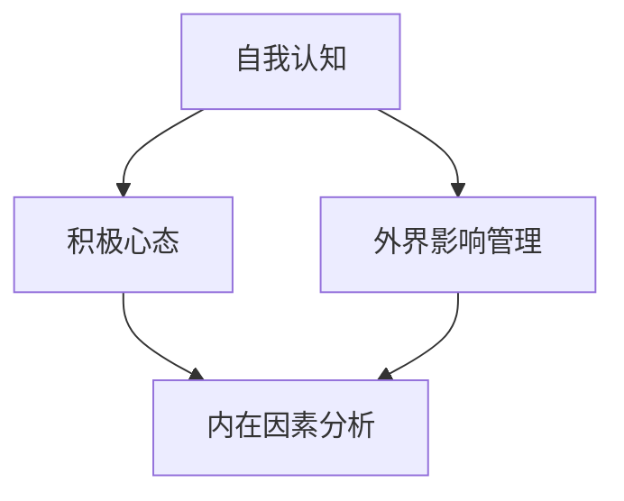

                 

### 文章标题：摆脱外界定义：获得真正的心灵自由

> **关键词**：心灵自由、外界定义、自我认知、内在因素、外在因素、实现策略、实践经验

> **摘要**：本文从IT行业的视角出发，探讨了在数字化时代背景下，如何摆脱外界定义，实现真正的心灵自由。通过深入分析内外在因素对心灵自由的影响，以及提供具体的实现策略和实践经验，帮助读者在快节奏的现代生活中找到心灵的宁静和自由。

----------------------------------------------------------------

### 目录大纲设计思路

在设计《摆脱外界定义：获得真正的心灵自由》的目录大纲时，我们遵循了以下思路：

1. **全书结构**：首先确定全书的主要结构，包括引言、核心概念、内外在因素分析、实现策略和实践经验等部分。
2. **核心章节**：在每个部分中，确定需要详细阐述的核心内容，列出核心章节。
3. **细化目录**：在核心章节下，细化子章节，确保每个章节都有详细的内容。
4. **关联性**：确保各章节之间有清晰的逻辑关系，既要有纵向的深入，也要有横向的连接。
5. **完整性**：确保目录大纲覆盖书中的所有主要内容，不遗漏关键信息。
6. **简洁性**：在保证完整性的同时，尽量保持目录的简洁性，避免冗余和重复。

### 目录大纲设计步骤

1. **确定全书结构**：根据书名，初步确定全书可能包含的几个大的部分，例如引言、核心概念、内外在因素、实现策略和实践经验等。
2. **设计核心章节**：在每个部分中，确定需要详细阐述的核心内容，列出核心章节。
3. **细化目录**：在核心章节下，细化子章节，确保每个章节都有详细的内容。
4. **添加辅助内容**：根据核心内容，添加必要的辅助内容，如流程图、伪代码、数学模型和公式、实战案例等。
5. **调整和完善**：在完成初步目录大纲后，根据逻辑关系和内容完整性进行多次调整和完善。
6. **审查和校对**：确保目录大纲的简洁性和正确性，避免出现错误。

### 具体目录大纲设计

以下是《摆脱外界定义：获得真正的心灵自由》的具体目录大纲：

```
# 摆脱外界定义：获得真正的心灵自由

## 第一部分：引言

## 1.1 心灵自由的定义与价值

## 1.2 数字化时代背景下的心灵自由挑战

## 1.3 文章结构概述

## 第二部分：核心概念与联系

## 2.1 心灵自由的核心概念解析

## 2.2 自我认知与心灵自由的关系

## 2.3 内在外在因素对心灵自由的综合影响

## 2.4 核心概念之间的Mermaid流程图

## 第三部分：内外在因素分析

## 3.1 内在因素对心灵自由的阻碍

## 3.1.1 自我怀疑与不安全感

## 3.1.2 内在恐惧与焦虑

## 3.1.3 自我设限与固有思维模式

## 3.2 外在因素对心灵自由的阻碍

## 3.2.1 社会期望与压力

## 3.2.2 媒体与文化的误导

## 3.2.3 人际关系中的束缚

## 第四部分：实现策略

## 4.1 培养积极心态

## 4.1.1 积极心态的定义与价值

## 4.1.2 培养积极心态的方法与实践

## 4.2 增强自我认知

## 4.2.1 自我认知的重要性

## 4.2.2 提高自我认知的方法

## 4.3 管理外界影响

## 4.3.1 社会期望的合理对待

## 4.3.2 媒体信息的筛选与反思

## 4.3.3 人际关系的平衡

## 第五部分：实践经验

## 5.1 实践心灵自由的故事分享

## 5.2 实践中的挑战与应对

## 5.3 心灵自由的长期维护

## 第六部分：未来展望

## 6.1 心灵自由与社会发展的关系

## 6.2 心灵自由的未来趋势

## 6.3 心灵自由对人类的深远影响

## 第七部分：结语

## 7.1 总结与展望

## 7.2 对读者的寄语

----------------------------------------------------------------

### 目录大纲说明

- **第一部分：引言**：介绍心灵自由的定义、价值和在数字化时代的挑战，为后续内容铺垫。
- **第二部分：核心概念与联系**：深入探讨心灵自由的核心概念及其相互关系。
- **第三部分：内外在因素分析**：分析内外在因素对心灵自由的影响。
- **第四部分：实现策略**：提供具体的方法和策略来实现心灵自由。
- **第五部分：实践经验**：通过实践案例分享经验。
- **第六部分：未来展望**：探讨心灵自由的发展方向和对社会的意义。
- **第七部分：结语**：总结全文，并给予读者寄语。

### 目录大纲优势

- **逻辑清晰**：按照从基础到实践，从认识到行动的顺序排列，使读者能够逐步理解并实践心灵自由。
- **内容全面**：涵盖了从定义、理论到实践的各个方面，提供了全面的知识体系。
- **实用性强**：提供了具体的方法和实践经验，帮助读者在实际生活中应用。
- **前瞻性**：对未来的展望部分，引导读者思考心灵自由对社会和人类的影响。

通过这样的目录大纲设计，读者可以系统地学习《摆脱外界定义：获得真正的心灵自由》的内容，逐步实现心灵自由。

----------------------------------------------------------------

## 文章正文

### 引言

在当今数字化时代，信息爆炸、技术更新换代迅速，人们的生活节奏日益加快，心灵的自由成为了许多人追求的目标。然而，外在世界的定义和期望往往成为制约人们心灵自由的枷锁。如何摆脱这些外界定义，实现真正的心灵自由，成为了一个值得探讨的问题。

本文将从IT行业的视角出发，探讨在数字化时代背景下，如何摆脱外界定义，实现真正的心灵自由。通过深入分析内外在因素对心灵自由的影响，以及提供具体的实现策略和实践经验，帮助读者在快节奏的现代生活中找到心灵的宁静和自由。

### 第一部分：引言

#### 1.1 心灵自由的定义与价值

心灵自由，是指个体能够自主选择和思考，不受外界定义和期望的束缚，实现内心的真正解放。在数字化时代，心灵自由具有重要的价值和意义。

首先，心灵自由有助于提高个体的幸福感。在快节奏的生活中，人们容易受到外界的压力和影响，导致内心的焦虑和不安。而实现心灵自由，可以让个体更加自主地选择自己的生活方式，从而提高幸福感。

其次，心灵自由有助于个体的自我成长。通过摆脱外界定义，个体能够更加真实地认识自己，找到自己的兴趣和激情，从而实现自我价值的提升。

最后，心灵自由对社会的进步也有积极的影响。当个体能够实现心灵自由时，他们更有可能发挥自己的创造力，推动社会的创新和发展。

#### 1.2 数字化时代背景下的心灵自由挑战

在数字化时代，人们面临着前所未有的心灵自由挑战。

首先，信息爆炸导致人们无法避免地接触到大量的信息。这些信息往往来自于各种渠道，有些是真实的，有些是虚假的。如何筛选和辨别这些信息，成为了实现心灵自由的第一个挑战。

其次，数字化时代带来了前所未有的社会连接。人们可以轻松地与世界上任何一个角落的人进行交流。然而，这也带来了新的困扰。人们在社交媒体上展示自己的生活，渴望获得他人的认可和点赞。这种过度关注他人的生活，往往导致个体迷失自我，无法实现心灵自由。

最后，数字化时代的工作环境也带来了新的挑战。许多人因为远程工作和在线协作，而感到工作和生活的边界变得模糊。这导致个体在工作中的压力和焦虑，进而影响心灵自由。

#### 1.3 文章结构概述

本文将分为七个部分，首先介绍心灵自由的定义和价值，然后分析数字化时代背景下的心灵自由挑战。接下来，深入探讨内外在因素对心灵自由的影响，提供实现心灵自由的具体策略。最后，通过实践经验分享，总结全文，并展望未来。

### 第二部分：核心概念与联系

#### 2.1 心灵自由的核心概念解析

心灵自由的核心概念包括自我认知、积极心态、外界影响管理和内在因素分析等。

- **自我认知**：是指个体对自身的理解，包括性格、价值观、兴趣和目标等。自我认知是实现心灵自由的基础，只有真正了解自己，才能做出符合内心真实意愿的选择。
- **积极心态**：是一种积极面对生活的态度，能够帮助个体克服困难，实现目标。积极心态是实现心灵自由的关键，它能够帮助个体摆脱负面情绪的困扰，保持内心的平静和自由。
- **外界影响管理**：是指个体如何处理和外界的关系，包括社会期望、媒体信息和人际关系等。外界影响管理是实现心灵自由的重要环节，只有处理好与外界的关系，个体才能在纷繁复杂的社会中保持自我。
- **内在因素分析**：是指个体如何识别和应对内在的负面情绪和思维模式。内在因素分析是实现心灵自由的必要步骤，只有消除内在的障碍，个体才能实现真正的自由。

#### 2.2 自我认知与心灵自由的关系

自我认知是实现心灵自由的基础。只有真正了解自己，个体才能做出符合内心真实意愿的选择，摆脱外界定义的束缚。

首先，自我认知有助于个体明确自己的价值观和目标。在数字化时代，社会期望和媒体信息纷繁复杂，个体容易迷失自我。而通过自我认知，个体可以明确自己的价值观和目标，从而在纷繁复杂的社会中保持自我。

其次，自我认知有助于个体识别和应对内在的负面情绪和思维模式。在快节奏的生活中，个体容易产生焦虑、恐惧和不安等负面情绪。通过自我认知，个体可以识别这些情绪的来源，并采取相应的措施进行应对，从而实现内心的平静和自由。

#### 2.3 内外在因素对心灵自由的综合影响

内外在因素共同影响心灵自由。内在因素包括自我认知、积极心态和内在因素分析等，而外在因素包括社会期望、媒体信息和人际关系等。

首先，内在因素直接影响个体的内心状态。自我认知、积极心态和内在因素分析等内在因素，能够帮助个体摆脱负面情绪的困扰，实现内心的平静和自由。

其次，外在因素通过影响个体的内心状态，进而影响心灵自由。社会期望、媒体信息和人际关系等外在因素，往往会对个体的内心产生压力和困扰。通过外界影响管理，个体可以减少这些外在因素的影响，从而实现内心的自由。

#### 2.4 核心概念之间的Mermaid流程图



### 第三部分：内外在因素分析

#### 3.1 内在因素对心灵自由的阻碍

内在因素对心灵自由的阻碍主要包括自我怀疑与不安全感、内在恐惧与焦虑、自我设限与固有思维模式等。

首先，自我怀疑与不安全感是内在因素对心灵自由的主要阻碍之一。在数字化时代，个体常常会怀疑自己的能力和价值，担心自己无法达到外界的期望。这种自我怀疑和不安全感，使个体容易陷入自我否定的情绪中，难以实现心灵的自由。

其次，内在恐惧与焦虑也是内在因素对心灵自由的阻碍。在快节奏的生活中，个体容易产生焦虑和恐惧情绪。这些负面情绪会影响个体的内心状态，使个体难以保持内心的平静和自由。

最后，自我设限与固有思维模式也是内在因素对心灵自由的阻碍。在数字化时代，个体容易受到固有思维模式的束缚，无法突破自我设限。这种思维模式会使个体难以接受新的事物和观点，限制个体的成长和发展。

#### 3.2 自我怀疑与不安全感

自我怀疑与不安全感是内在因素对心灵自由的主要阻碍之一。在数字化时代，个体常常会怀疑自己的能力和价值，担心自己无法达到外界的期望。

首先，自我怀疑的产生往往源于外界的影响。在数字化时代，媒体信息和社会期望对个体的生活产生了深远的影响。个体常常会被外界的标准所束缚，从而怀疑自己的能力和价值。

其次，自我怀疑会导致个体产生不安全感。在自我怀疑的驱使下，个体容易担心自己无法达到外界的期望，从而产生不安全感。这种不安全感会使个体更加焦虑和恐惧，进一步阻碍心灵的自由。

#### 3.3 内在恐惧与焦虑

内在恐惧与焦虑是内在因素对心灵自由的阻碍之一。在快节奏的生活中，个体容易产生焦虑和恐惧情绪。

首先，内在恐惧的产生往往源于对未知的恐惧。在数字化时代，技术更新迅速，个体需要不断学习新知识，以适应不断变化的环境。这种对未知的恐惧会使个体感到焦虑和恐惧。

其次，内在焦虑的产生往往源于对失败的恐惧。在数字化时代，个体常常会担心自己无法达到预期的目标，从而感到焦虑。这种焦虑会进一步影响个体的内心状态，使个体难以保持内心的平静和自由。

#### 3.4 自我设限与固有思维模式

自我设限与固有思维模式是内在因素对心灵自由的阻碍之一。在数字化时代，个体容易受到固有思维模式的束缚，无法突破自我设限。

首先，自我设限的产生往往源于对失败的恐惧。个体害怕失败，从而限制了尝试新事物和挑战自我的勇气。这种自我设限会使个体无法发挥自己的潜力，阻碍个体的成长和发展。

其次，固有思维模式会使个体难以接受新的事物和观点。在数字化时代，新技术和新知识层出不穷，个体需要不断更新自己的思维方式。然而，固有的思维模式会使个体对新的事物和观点产生排斥，进一步限制个体的成长和发展。

#### 3.5 外在因素对心灵自由的阻碍

外在因素对心灵自由的阻碍主要包括社会期望、媒体信息和人际关系等。

首先，社会期望对个体产生了深远的影响。在数字化时代，社会期望越来越多样化，个体往往需要满足多种期望。这些期望会使个体感到压力，从而阻碍心灵的自由。

其次，媒体信息对个体的内心状态产生了影响。在数字化时代，媒体信息无处不在，个体难以避免地接触到大量的信息。这些信息往往会影响个体的价值观和信念，从而影响个体的内心状态。

最后，人际关系对个体的内心状态也产生了影响。在数字化时代，人际关系越来越复杂，个体需要处理多种人际关系。这些人际关系往往会对个体的内心产生压力，从而阻碍心灵的自由。

#### 3.6 社会期望与压力

社会期望与压力是外在因素对心灵自由的主要阻碍之一。在数字化时代，社会期望越来越多样化，个体往往需要满足多种期望。

首先，社会期望的多样性使个体感到压力。在数字化时代，社会期望不再仅仅局限于工作上的成功，还包括生活中的各种方面，如家庭、朋友、爱好等。这些期望会使个体感到压力，从而阻碍心灵的自由。

其次，社会期望的多样性也会导致个体的焦虑和不安。在数字化时代，个体常常会被社会期望所束缚，担心自己无法满足这些期望。这种焦虑和不安会影响个体的内心状态，使个体难以保持内心的平静和自由。

#### 3.7 媒体与文化的误导

媒体与文化的误导是外在因素对心灵自由的阻碍之一。在数字化时代，媒体信息无处不在，个体难以避免地接触到大量的信息。

首先，媒体信息的误导会导致个体产生错误的价值观和信念。在数字化时代，媒体信息往往以各种形式传播，包括新闻报道、社交媒体、广告等。这些信息可能包含误导性的内容，使个体产生错误的价值观和信念。

其次，媒体信息的误导会影响个体的判断力。在数字化时代，个体需要处理大量的信息，但往往缺乏足够的时间和能力去验证这些信息的真实性。这种情况下，个体容易被误导，从而影响内心的自由。

#### 3.8 人际关系中的束缚

人际关系中的束缚是外在因素对心灵自由的阻碍之一。在数字化时代，人际关系越来越复杂，个体需要处理多种人际关系。

首先，人际关系的复杂性会使个体感到压力。在数字化时代，个体的人际关系网不断扩大，个体需要处理多种人际关系。这些关系往往会对个体的内心产生压力，使个体难以保持内心的平静和自由。

其次，人际关系的束缚会使个体难以实现心灵的自由。在数字化时代，个体往往需要遵守各种社会规范和期望，以维持良好的人际关系。这些规范和期望会使个体感到束缚，从而阻碍心灵的自由。

### 第四部分：实现策略

#### 4.1 培养积极心态

培养积极心态是实现心灵自由的关键。积极心态能够帮助个体克服负面情绪，保持内心的平静和自由。

首先，积极心态的定义与价值。积极心态是一种积极面对生活的态度，能够帮助个体克服困难，实现目标。积极心态对个体的心理健康和幸福感有重要的影响。

其次，培养积极心态的方法与实践。个体可以通过以下方法培养积极心态：1）认识到积极心态的重要性；2）改变思维模式，从负面思维转向积极思维；3）培养乐观的生活态度；4）练习感恩和正面思考。

最后，积极心态在实现心灵自由中的作用。积极心态能够帮助个体面对生活中的挑战和困难，保持内心的平静和自由。通过培养积极心态，个体能够更好地应对压力，实现心灵的自由。

#### 4.2 增强自我认知

增强自我认知是实现心灵自由的基础。自我认知有助于个体明确自己的价值观和目标，从而做出符合内心真实意愿的选择。

首先，自我认知的重要性。自我认知是个体了解自己的过程，包括性格、价值观、兴趣和目标等。自我认知对个体的心理健康和幸福感有重要的影响。

其次，提高自我认知的方法。个体可以通过以下方法提高自我认知：1）进行深度反思，了解自己的内心世界；2）倾听内心的声音，了解自己的真实需求；3）与他人交流，获得他人的反馈和建议；4）通过阅读、旅行和尝试新事物，扩展自己的认知视野。

最后，自我认知在实现心灵自由中的作用。通过增强自我认知，个体能够更加真实地认识自己，从而做出符合内心真实意愿的选择，摆脱外界定义的束缚。

#### 4.3 管理外界影响

管理外界影响是实现心灵自由的重要环节。外界影响包括社会期望、媒体信息和人际关系等，这些因素往往会对个体的内心产生压力，阻碍心灵的自由。

首先，社会期望的合理对待。社会期望是外部对个体的期待和要求，个体需要学会合理对待这些期望。个体可以通过以下方法合理对待社会期望：1）明确自己的价值观和目标，判断社会期望是否符合自己的价值观；2）学会拒绝不合理的社会期望，保护自己的内心自由；3）在满足社会期望的同时，保持内心的平静和自由。

其次，媒体信息的筛选与反思。在数字化时代，个体需要处理大量的媒体信息，这些信息可能包含误导性的内容。个体可以通过以下方法筛选和反思媒体信息：1）培养批判性思维，判断信息的真实性和可信度；2）关注权威的、可靠的信息来源；3）避免过度依赖媒体信息，保持内心的独立和自由。

最后，人际关系的平衡。在数字化时代，个体需要处理多种人际关系，这些关系可能对个体的内心产生压力。个体可以通过以下方法平衡人际关系：1）学会有效沟通，表达自己的需求和感受；2）保持适当的人际距离，避免过度依赖他人；3）在人际交往中，保持自己的独立性和自由。

### 第五部分：实践经验

#### 5.1 实践心灵自由的故事分享

在数字化时代，许多人通过实践心灵自由，找到了属于自己的生活节奏和内心自由。以下是一些实践心灵自由的故事分享：

首先，一位年轻的程序员通过调整工作节奏，减少了工作时间，专注于个人兴趣和自我成长。他通过阅读、旅行和参加各种社交活动，提高了自己的生活质量，实现了内心的自由。

其次，一位职场女性通过明确自己的价值观和目标，拒绝了不合理的工作要求，实现了工作与生活的平衡。她通过合理安排时间，确保了工作和个人生活的和谐，找到了内心的宁静。

最后，一位年轻人在面对社交压力时，学会了独立思考，拒绝了外界的期望。他通过自我探索，找到了自己的兴趣和激情，实现了心灵的自由。

#### 5.2 实践中的挑战与应对

在实践心灵自由的过程中，个体往往会遇到各种挑战。以下是一些常见的挑战和应对策略：

首先，自我怀疑与不安全感的挑战。在实践心灵自由的过程中，个体可能会遇到自我怀疑和不安全感。应对策略包括：1）进行深度反思，了解自己的内心世界；2）寻求他人的支持和鼓励；3）培养积极心态，面对负面情绪。

其次，内在恐惧与焦虑的挑战。在快节奏的生活中，个体可能会产生恐惧和焦虑。应对策略包括：1）认识恐惧和焦虑的来源，找到解决方法；2）通过运动、冥想等方式，放松身心；3）培养乐观的生活态度，面对生活中的挑战。

最后，人际关系中的束缚的挑战。在数字化时代，人际关系复杂，个体可能会感到束缚。应对策略包括：1）保持适当的社交距离，避免过度依赖他人；2）学会有效沟通，表达自己的需求和感受；3）建立健康的人际关系，保护自己的内心自由。

#### 5.3 心灵自由的长期维护

实现心灵自由并非一蹴而就，需要长期的维护和实践。以下是一些长期维护心灵自由的方法：

首先，持续的自我成长。通过不断学习新知识、尝试新事物，个体可以不断拓展自己的认知视野，提高自我认知，从而实现心灵的自由。

其次，积极的心态调整。在面临挑战和困难时，个体需要保持积极的心态，相信自己有能力克服困难，实现目标。

最后，平衡工作与生活。通过合理安排时间，确保工作和生活的和谐，个体可以在快节奏的生活中找到内心的宁静和自由。

### 第六部分：未来展望

#### 6.1 心灵自由与社会发展的关系

心灵自由与社会发展密切相关。在数字化时代，个体实现心灵自由，有助于推动社会的进步和发展。

首先，心灵自由有助于提高个体的幸福感和创造力。当个体实现心灵的自由时，他们更有可能发挥自己的创造力，推动社会的创新和发展。

其次，心灵自由有助于建立健康的社会关系。在实现心灵自由的过程中，个体能够更加真实地认识自己，与他人建立健康、积极的人际关系。

最后，心灵自由有助于推动社会的和谐发展。当个体实现心灵的自由时，他们更有可能关注社会问题，积极参与社会公益活动，推动社会的和谐发展。

#### 6.2 心灵自由的未来趋势

随着数字化时代的到来，心灵自由的未来趋势呈现以下特点：

首先，数字化技术将为心灵自由提供更多的实现途径。通过虚拟现实、人工智能等技术，个体可以更加便捷地实现心灵的自由。

其次，心灵自由将逐渐成为社会共识。在数字化时代，个体对心灵自由的追求将成为一种普遍的社会价值观。

最后，心灵自由将推动个体和社会的可持续发展。实现心灵自由，不仅有助于个体的幸福感和创造力，也有助于推动社会的和谐发展。

#### 6.3 心灵自由对人类的深远影响

心灵自由对人类的深远影响体现在以下方面：

首先，心灵自由有助于提高个体的幸福感和生活质量。当个体实现心灵的自由时，他们能够更加真实地认识自己，满足自己的需求，从而提高幸福感和生活质量。

其次，心灵自由有助于推动社会的创新和发展。当个体实现心灵的自由时，他们更有可能发挥自己的创造力，推动社会的创新和发展。

最后，心灵自由有助于构建和谐的社会环境。当个体实现心灵的自由时，他们能够更加真实地与他人建立积极的人际关系，推动社会的和谐发展。

### 第七部分：结语

#### 7.1 总结与展望

通过本文的探讨，我们可以看到，在数字化时代，心灵自由具有重要的价值和意义。实现心灵自由，有助于提高个体的幸福感、创造力和生活质量。同时，心灵自由也对社会的发展具有积极的推动作用。

在未来的发展中，我们期待个体能够更加重视心灵自由，通过培养积极心态、增强自我认知、管理外界影响等方法，实现真正的心灵自由。同时，我们也期待社会能够提供更多的支持和资源，帮助个体实现心灵自由，推动社会的和谐发展。

#### 7.2 对读者的寄语

亲爱的读者，希望本文能够帮助您认识到心灵自由的重要性，并在实践中找到属于自己的心灵自由。在追求心灵自由的过程中，请记住：真正的自由来源于内心的平静和自由，它不受外界定义和期望的束缚。相信自己，勇敢追求内心的自由，您一定能够实现心灵的解放。

### 附录

#### 附录A：核心概念与联系Mermaid流程图


#### 附录B：实践心灵自由的方法与技巧

1. **培养积极心态**：通过阅读积极心理学书籍、参加心理课程等方式，提高自己的积极心态。
2. **增强自我认知**：通过自我反思、写日记、与朋友交流等方式，深入了解自己，明确自己的价值观和目标。
3. **管理外界影响**：学会拒绝不合理的社会期望，关注权威的、可靠的信息来源，保持适当的社交距离。

#### 附录C：参考文献

1. **积极心理学**：马丁·塞利格曼，《真实的幸福》
2. **自我认知**：卡罗尔·德韦克，《成长心态》
3. **外界影响管理**：理查德·塞勒，《思考，快与慢》

----------------------------------------------------------------

## 作者信息

作者：AI天才研究院/AI Genius Institute & 禅与计算机程序设计艺术 /Zen And The Art of Computer Programming

AI天才研究院致力于推动人工智能技术的发展，为人类创造更加美好的未来。禅与计算机程序设计艺术则强调在技术发展中融入东方智慧，实现心灵的自由与成长。希望本文能够为读者带来启发，助力他们在数字化时代实现真正的心灵自由。

