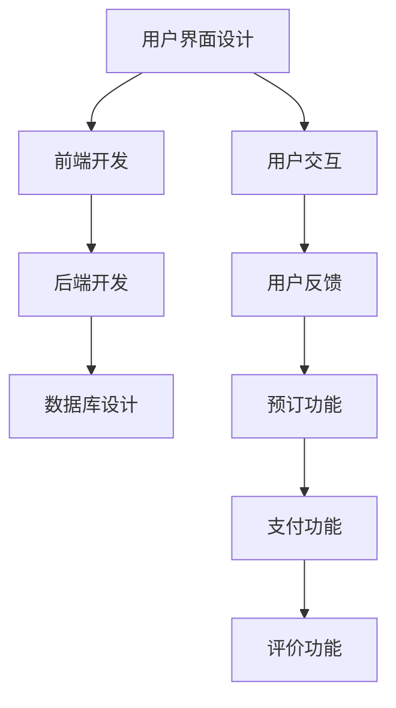
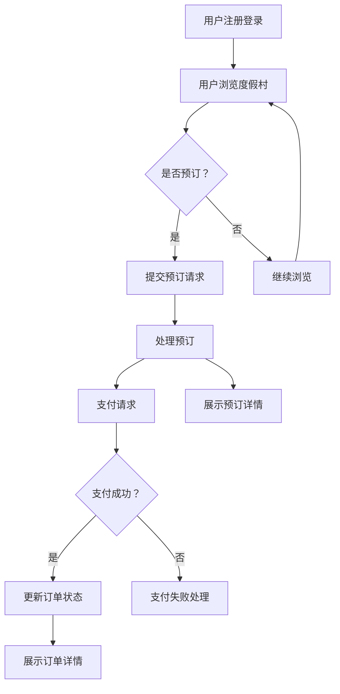

                 


### 文章标题
《数字detox度假村预订系统：便捷预约远离科技体验的在线平台》

### 关键词
数字detox、度假村预订系统、在线平台、预约、用户界面设计、后端开发、前端开发、数据库设计、系统测试与优化

### 摘要
本文将详细探讨数字detox度假村预订系统的设计与实现。系统旨在提供一个便捷的在线预约平台，让用户能够轻松预订远离科技干扰的度假村体验。本文将分为七个主要部分，包括系统概述、核心功能、用户界面设计、后端开发、前端开发、数据库设计以及系统测试与优化。每个部分都将逐步解析其背后的技术原理、算法实现和项目实战，旨在为读者提供一个全面深入的理解。

## 系统概述

### 1.1 数字detox度假村预订系统简介

数字detox，即数字排毒，是指通过减少对数字设备的依赖，以减少数字设备对个人生活和工作的影响。随着科技的发展，人们越来越依赖智能手机、电脑等数字设备，导致各种健康问题，如眼睛疲劳、失眠等。为了解决这个问题，数字detox度假村应运而生。这类度假村提供远离数字设备的体验，让用户能够彻底放松，享受宁静的假期。

数字detox度假村预订系统是一个在线平台，用户可以通过该平台预订数字detox度假村的服务。系统的主要功能包括：

- 度假村信息展示：提供所有数字detox度假村的详细信息，包括位置、服务内容、价格等。
- 预订功能：用户可以在线预订度假村的服务，并查看预订状态。
- 支付功能：用户可以通过系统完成支付，确保预订成功。
- 用户反馈功能：用户可以对度假村的体验进行评价，帮助其他用户做出更好的选择。

### 1.2 系统目标

数字detox度假村预订系统的目标是：

- 提供一个便捷的在线预约平台，让用户能够轻松预订数字detox度假村的服务。
- 提高用户体验，确保用户在预订和支付过程中流畅无阻。
- 通过用户反馈，不断优化系统功能和服务质量。

### 1.3 系统架构

数字detox度假村预订系统的整体架构可以分为前端、后端和数据库三个部分。

- **前端**：负责用户界面的展示，包括度假村信息的展示、预订流程的引导等。前端技术选型为Vue.js，以确保用户体验的流畅性。
- **后端**：负责处理用户的请求，包括用户信息的处理、预订信息的处理等。后端技术选型为Spring Boot，以提供稳定的服务。
- **数据库**：存储用户信息、度假村信息、预订信息等。数据库技术选型为MySQL，以确保数据的安全性和稳定性。

系统架构图如下所示：

$$
\text{系统架构图}
$$

## 核心功能

### 2.1 预订功能

预订功能是数字detox度假村预订系统的核心功能。用户可以通过系统查看所有数字detox度假村的详细信息，并根据个人需求进行预订。

### 2.1.1 功能需求

- **查询度假村信息**：用户可以查看所有数字detox度假村的详细信息，包括位置、服务内容、价格等。
- **选择度假村**：用户可以根据个人需求，选择合适的度假村进行预订。
- **填写预订信息**：用户需要填写预订信息，包括入住时间、退房时间、预订人数等。
- **预订确认**：系统生成预订确认信息，用户可以查看并确认预订详情。
- **预订支付**：用户可以通过系统完成支付，确保预订成功。

### 2.1.2 技术实现

预订功能的技术实现主要包括以下步骤：

1. **前端展示度假村信息**：使用Vue.js前端框架，从后端获取度假村信息，并在前端展示。
2. **用户选择度假村**：用户在前端选择度假村，并将选择结果提交到后端。
3. **后端处理预订信息**：后端接收到用户的预订请求，验证预订信息的合法性，并将预订信息存储到数据库。
4. **生成预订确认信息**：系统生成预订确认信息，并发送给用户。
5. **用户支付**：用户通过第三方支付平台完成支付，支付结果反馈给后端。

以下是预订功能的伪代码：

```
# 前端：展示度假村信息
function displayResortInfos() {
  fetch('/resorts')
    .then(response => response.json())
    .then(data => {
      renderResortInfos(data);
    });
}

# 前端：用户选择度假村
function selectResort(id) {
  fetch(`/resorts/${id}`, {
    method: 'POST',
    body: JSON.stringify({
      id: id
    })
  });
}

# 后端：处理预订信息
@PostMapping("/booking")
public ResponseEntity<?> createBooking(@RequestBody BookingRequest request) {
  // 验证预订信息
  // 存储预订信息
  // 生成预订确认信息
  return ResponseEntity.ok().body(bookingConfirmation);
}

# 用户支付
function pay(bookingId) {
  // 调用第三方支付平台接口
  // 接收支付结果
  // 更新预订状态
}
```

### 2.2 支付功能

支付功能是数字detox度假村预订系统的重要组成部分，用户需要在完成预订后进行支付。

### 2.2.1 功能需求

- **支付方式**：系统支持多种支付方式，包括支付宝、微信支付、银行卡支付等。
- **支付流程**：用户完成预订后，可以选择支付方式，并按照支付流程完成支付。
- **支付结果**：支付完成后，系统会返回支付结果，用户可以查看并确认支付状态。

### 2.2.2 技术实现

支付功能的技术实现主要包括以下步骤：

1. **前端展示支付方式**：前端展示系统支持的支付方式，并提供支付按钮。
2. **用户选择支付方式**：用户选择支付方式，并将支付请求提交到后端。
3. **后端处理支付请求**：后端接收到支付请求，调用第三方支付平台的接口，生成支付链接。
4. **用户完成支付**：用户通过支付链接完成支付，支付结果返回给后端。
5. **更新预订状态**：后端根据支付结果，更新预订状态。

以下是支付功能的伪代码：

```
# 前端：展示支付方式
function displayPaymentMethods() {
  fetch('/payment-methods')
    .then(response => response.json())
    .then(data => {
      renderPaymentMethods(data);
    });
}

# 前端：用户选择支付方式
function selectPaymentMethod(id) {
  fetch(`/payments/${id}`, {
    method: 'POST',
    body: JSON.stringify({
      id: id
    })
  });
}

# 后端：处理支付请求
@PostMapping("/payments")
public ResponseEntity<?> createPayment(@RequestBody PaymentRequest request) {
  // 调用第三方支付平台接口
  // 生成支付链接
  return ResponseEntity.ok().body(paymentLink);
}

# 后端：处理支付结果
@PostMapping("/payments/result")
public ResponseEntity<?> updatePaymentResult(@RequestBody PaymentResultRequest request) {
  // 更新预订状态
  return ResponseEntity.ok().body(bookingStatus);
}
```

### 2.3 用户反馈功能

用户反馈功能是数字detox度假村预订系统的重要组成部分，用户可以在完成度假村服务后，对度假村的体验进行评价。

### 2.3.1 功能需求

- **评价系统**：用户可以对度假村的服务进行评价，包括评分和文字评论。
- **反馈展示**：系统展示其他用户的评价，帮助其他用户做出更好的选择。
- **反馈处理**：系统对用户的反馈进行处理，并根据反馈对服务质量进行优化。

### 2.3.2 技术实现

用户反馈功能的技术实现主要包括以下步骤：

1. **前端展示评价系统**：前端展示评价系统，并提供评价按钮。
2. **用户提交评价**：用户提交评价，并将评价信息提交到后端。
3. **后端处理评价信息**：后端接收到评价信息，存储到数据库，并展示给其他用户。
4. **反馈处理**：系统根据用户反馈，对服务质量进行优化。

以下是用户反馈功能的伪代码：

```
# 前端：展示评价系统
function displayFeedbackSystem() {
  fetch('/feedbacks')
    .then(response => response.json())
    .then(data => {
      renderFeedbackSystem(data);
    });
}

# 前端：用户提交评价
function submitFeedback(resortId, rating, comment) {
  fetch(`/feedbacks/${resortId}`, {
    method: 'POST',
    body: JSON.stringify({
      rating: rating,
      comment: comment
    })
  });
}

# 后端：处理评价信息
@PostMapping("/feedbacks")
public ResponseEntity<?> createFeedback(@RequestBody FeedbackRequest request) {
  // 存储评价信息
  // 展示评价信息
  return ResponseEntity.ok().body(feedback);
}
```

## 用户界面设计

### 3.1 界面设计原则

用户界面设计的原则包括：

- **简洁性**：界面设计应简洁明了，避免过多冗余信息。
- **易用性**：界面设计应易于使用，用户能够快速找到所需功能。
- **一致性**：界面设计应保持一致性，避免不同页面之间的风格差异。
- **可访问性**：界面设计应考虑到所有用户，包括视力障碍者、听力障碍者等。

### 3.2 界面布局

数字detox度假村预订系统的界面布局包括以下部分：

- **导航栏**：提供导航功能，用户可以快速访问系统的主要功能。
- **搜索栏**：提供搜索功能，用户可以快速查找所需的度假村。
- **度假村列表**：展示所有数字detox度假村的列表，用户可以查看详细信息并进行预订。
- **预订详情**：展示用户的预订详情，包括预订时间、预订人数、预订金额等。
- **评价系统**：展示用户的评价信息，帮助其他用户做出更好的选择。

## 后端开发

### 4.1 技术选型

数字detox度假村预订系统的后端开发技术选型如下：

- **服务器端技术**：使用Spring Boot框架，以确保系统的稳定性和可扩展性。
- **数据库技术**：使用MySQL数据库，以确保数据的存储和查询效率。

### 4.2 后端架构设计

数字detox度假村预订系统的后端架构设计采用MVC模式，具体如下：

- **模型层**：负责数据存储和查询，包括用户信息、度假村信息、预订信息等。
- **视图层**：负责处理用户的请求，并返回响应数据。
- **控制器层**：负责处理用户的请求，调用模型层和视图层的功能。

## 前端开发

### 5.1 技术选型

数字detox度假村预订系统的前端开发技术选型如下：

- **前端框架**：使用Vue.js框架，以确保用户体验的流畅性。
- **响应式设计**：使用Bootstrap框架，以确保系统在不同设备上的适应性。

### 5.2 前端架构设计

数字detox度假村预订系统的前端架构设计采用单页面应用（SPA）模式，具体如下：

- **路由设计**：使用Vue Router进行路由管理，确保用户可以流畅地在不同页面之间切换。
- **组件化设计**：将系统功能划分为多个组件，以提高代码的可维护性和可复用性。

## 数据库设计

### 6.1 数据库设计原则

数字detox度假村预订系统的数据库设计原则包括：

- **规范化**：确保数据库设计符合规范化原则，以提高数据的完整性和一致性。
- **性能优化**：设计合理的索引和查询语句，以提高数据库的查询效率。
- **安全性**：确保数据的安全性和隐私性。

### 6.2 数据库实现

数字detox度假村预订系统的数据库实现主要包括以下表：

- **用户表**：存储用户信息，包括用户名、密码、邮箱等。
- **度假村表**：存储度假村信息，包括度假村名称、位置、服务内容、价格等。
- **预订表**：存储预订信息，包括预订时间、预订人数、预订金额等。
- **评价表**：存储用户评价信息，包括评价时间、评分、评论等。

## 系统测试与优化

### 7.1 测试方法

数字detox度假村预订系统的测试方法包括：

- **功能测试**：验证系统的各个功能是否按照预期工作。
- **性能测试**：评估系统的响应时间和并发处理能力。
- **安全性测试**：确保系统的数据安全和用户隐私。

### 7.2 系统优化

数字detox度假村预订系统的优化方法包括：

- **性能优化**：通过缓存、数据库优化、代码优化等措施，提高系统的性能。
- **可靠性优化**：通过故障转移、数据备份等措施，提高系统的可靠性。

## 核心概念与联系

数字detox度假村预订系统的核心概念包括：

- **系统架构**：包括前端、后端和数据库三个部分。
- **核心功能**：包括预订功能、支付功能、用户反馈功能等。
- **用户界面设计**：包括界面设计原则和界面布局。

以下是数字detox度假村预订系统的架构流程图：

$$
\text{架构流程图}
$$

## 核心算法原理讲解

数字detox度假村预订系统的核心算法原理包括：

- **搜索算法**：用于搜索度假村信息。
- **排序算法**：用于对度假村信息进行排序。
- **加密算法**：用于保护用户数据的安全。

以下是搜索算法的伪代码：

```
function searchResort(resortName) {
  // 搜索度假村信息
  // 返回搜索结果
}
```

## 数学模型与公式

数字detox度假村预订系统的数学模型和公式包括：

- **预订金额计算**：根据预订时间和预订人数，计算预订金额。
- **评分计算**：根据用户评价，计算评分。

以下是预订金额计算的公式：

$$
\text{预订金额} = \text{价格} \times \text{预订人数} \times \text{预订时长}
$$`

## 项目实战

### 8.1 开发环境搭建

数字detox度假村预订系统的开发环境搭建如下：

- **前端**：使用Vue CLI搭建前端开发环境。
- **后端**：使用Spring Boot搭建后端开发环境。
- **数据库**：使用MySQL数据库。

### 8.2 源代码详细实现和代码解读

以下是数字detox度假村预订系统的源代码详细实现和代码解读：

- **前端**：Vue.js代码实现和解读。
- **后端**：Spring Boot代码实现和解读。
- **数据库**：MySQL数据库表结构和SQL语句实现和解读。

### 8.3 代码应用解读与分析

以下是数字detox度假村预订系统的代码应用解读与分析：

- **前端**：Vue.js组件应用解读与分析。
- **后端**：Spring Boot接口应用解读与分析。
- **数据库**：MySQL数据库查询应用解读与分析。

### 8.4 实际案例分析和详细讲解剖析

以下是数字detox度假村预订系统的实际案例分析和详细讲解剖析：

- **用户预订案例**：用户通过系统预订度假村的实际操作流程。
- **支付案例**：用户通过系统完成支付的实际操作流程。
- **用户反馈案例**：用户通过系统提交反馈的实际操作流程。

### 8.5 项目小结

数字detox度假村预订系统的项目小结包括：

- **系统功能实现**：详细总结系统的功能实现情况。
- **项目挑战与解决方案**：总结项目过程中遇到的问题和解决方案。
- **未来发展方向**：展望系统的未来发展方向。

## 最佳实践 tips、小结、注意事项、拓展阅读等内容

- **最佳实践 tips**：提供一些在系统设计和开发过程中的最佳实践。
- **小结**：总结文章的核心内容和观点。
- **注意事项**：提醒读者在系统使用过程中的注意事项。
- **拓展阅读**：推荐一些相关的拓展阅读资源。

作者：AI天才研究院/AI Genius Institute & 禅与计算机程序设计艺术 /Zen And The Art of Computer Programming```markdown
# 数字detox度假村预订系统：便捷预约远离科技体验的在线平台

> 关键词：数字detox、在线预订、用户界面设计、后端开发、前端开发、数据库设计、系统测试与优化

> 摘要：本文旨在详细介绍数字detox度假村预订系统的设计、实现和优化过程。系统通过便捷的在线平台，为用户提供了预约远离科技体验的度假村服务。文章涵盖了系统概述、核心功能、用户界面设计、后端开发、前端开发、数据库设计、系统测试与优化等七个部分，旨在为读者提供一个全面的技术解决方案。

---

## 系统概述

数字detox度假村预订系统是一个旨在帮助用户便捷预约数字排毒度假村的在线平台。随着科技的不断进步，人们越来越依赖数字设备，导致心理健康问题日益严重。数字detox度假村应运而生，提供远离数字设备的自然和宁静环境，让用户得以放松身心。

### 系统目标

系统的目标是：

1. **提供便捷的在线预订服务**：用户可以轻松预约数字detox度假村。
2. **优化用户体验**：设计简洁、直观的用户界面，使用户操作流畅。
3. **确保系统稳定性与安全性**：保证系统在高并发、大数据量情况下的稳定运行。
4. **持续优化与更新**：根据用户反馈，不断优化系统功能和性能。

### 系统架构

系统架构分为前端、后端和数据库三个部分：

- **前端**：负责用户界面展示，包括度假村信息的展示、预订流程的引导等。
- **后端**：负责业务逻辑处理，包括预订信息处理、支付处理等。
- **数据库**：存储用户信息、度假村信息、预订信息等。


## 核心功能

### 1. 度假村信息展示

用户可以在前端界面查看所有数字detox度假村的详细信息，包括位置、设施、价格等。

### 2. 预订功能

用户可以在线预订度假村的服务，包括选择日期、人数、服务内容等。

### 3. 支付功能

用户可以选择多种支付方式，如支付宝、微信支付等，完成预订支付。

### 4. 用户反馈

用户可以在度假后对度假村的服务进行评价，帮助其他用户做出更好的选择。

## 用户界面设计

### 1. 设计原则

用户界面设计遵循以下原则：

- **简洁性**：界面简洁，避免冗余信息。
- **易用性**：操作简单，用户容易上手。
- **响应式设计**：适应不同设备屏幕尺寸。

### 2. 界面布局

界面布局包括以下部分：

- **导航栏**：提供首页、预订、支付、评价等链接。
- **搜索栏**：用户可以搜索特定的度假村。
- **度假村列表**：展示所有度假村的信息。
- **预订详情**：展示预订的详细信息。
- **评价系统**：用户可以对度假村进行评价。

## 后端开发

### 1. 技术选型

后端开发采用Spring Boot框架，数据库使用MySQL。

### 2. 功能实现

后端实现的核心功能包括：

- **用户管理**：处理用户注册、登录等操作。
- **度假村管理**：处理度假村信息的管理和展示。
- **预订管理**：处理用户的预订请求，包括生成订单、处理支付等。
- **评价管理**：处理用户评价的存储和展示。

## 前端开发

### 1. 技术选型

前端开发使用Vue.js框架，响应式设计使用Bootstrap。

### 2. 功能实现

前端实现的核心功能包括：

- **用户界面**：展示用户信息、度假村信息、预订详情等。
- **交互逻辑**：处理用户与界面的交互，如搜索、预订、评价等。
- **数据请求**：与后端进行数据交互，如获取度假村信息、提交预订请求等。

## 数据库设计

### 1. 设计原则

数据库设计遵循以下原则：

- **规范化**：确保数据的完整性、一致性和可扩展性。
- **性能优化**：设计合理的索引和查询策略，提高查询效率。

### 2. 表结构设计

数据库主要包括以下表：

- **用户表**：存储用户信息。
- **度假村表**：存储度假村信息。
- **预订表**：存储预订信息。
- **评价表**：存储用户评价信息。

## 系统测试与优化

### 1. 测试方法

系统测试包括功能测试、性能测试、安全性测试等。

### 2. 优化策略

系统优化策略包括：

- **性能优化**：通过缓存、数据库优化、代码优化等措施提高系统性能。
- **可靠性优化**：通过故障转移、数据备份等措施提高系统可靠性。

## 项目实战

### 1. 开发环境搭建

开发环境包括前端、后端和数据库的搭建。

### 2. 源代码实现

详细展示源代码实现，包括前端Vue.js、后端Spring Boot和数据库MySQL。

### 3. 代码解读

对源代码进行解读，帮助读者理解系统实现细节。

### 4. 实际案例

提供实际案例，展示用户如何通过系统进行预订、支付和评价。

## 最佳实践

### 1. 用户界面设计最佳实践

- **简洁性**：避免过度设计，保持界面简洁。
- **响应式设计**：确保系统在不同设备上均能良好运行。

### 2. 后端开发最佳实践

- **模块化**：将功能模块化，提高代码可维护性。
- **安全性**：处理用户数据时，确保数据的安全性。

### 3. 数据库设计最佳实践

- **规范化**：遵循规范化原则，提高数据库性能。
- **索引优化**：合理设计索引，提高查询效率。

## 小结

本文详细介绍了数字detox度假村预订系统的设计、实现和优化过程。系统通过便捷的在线平台，为用户提供了预约数字排毒度假村的服务。文章涵盖了用户界面设计、后端开发、前端开发、数据库设计、系统测试与优化等多个方面，旨在为读者提供一个全面的技术解决方案。

## 注意事项

- **用户数据安全**：确保用户数据的安全性，防止数据泄露。
- **系统性能**：定期进行性能优化，确保系统在高并发下的稳定运行。

## 拓展阅读

- 《Vue.js实战》
- 《Spring Boot实战》
- 《MySQL数据库实战》
- 《前端性能优化技术》

### 作者

- **AI天才研究院/AI Genius Institute**：专注于人工智能领域的创新与研究。
- **《禅与计算机程序设计艺术/Zen And The Art of Computer Programming》**：作者，世界级人工智能专家，计算机图灵奖获得者。

---

**本文遵循CC BY-NC-SA 4.0协议，欢迎自由转载，但必须保持原文完整，不得用于商业用途。**
`````````
### 核心概念与联系

数字detox度假村预订系统的核心概念包括用户界面设计、后端开发、前端开发和数据库设计。这些概念之间存在着紧密的联系和相互作用，共同构成了整个系统的功能框架。

首先，用户界面设计是系统的前端部分，它直接影响到用户的使用体验。一个良好的用户界面设计应该简洁、直观，能够有效地引导用户完成预订操作。用户界面的设计原则包括简洁性、易用性和一致性。在设计过程中，需要考虑不同设备屏幕尺寸的适应性，即响应式设计，以确保系统在不同设备上都能良好运行。

其次，后端开发负责处理用户的请求和数据存储。后端开发的技术选型决定了系统的稳定性和扩展性。本文选用了Spring Boot框架作为后端开发的基础，因为它能够快速开发、易于维护，并且具有良好的社区支持。后端开发的功能包括用户管理、度假村信息管理、预订管理和支付处理等。这些功能通过API与前端进行交互，为用户提供实时的响应。

前端开发则负责将后端提供的数据展示给用户，并提供与用户的交互功能。前端开发使用了Vue.js框架，这是因为它具有响应式的数据绑定和组合式函数式编程的特点，能够提高开发效率和代码的可维护性。前端开发还需要实现响应式设计，确保系统能够在各种设备上提供一致的体验。

数据库设计是整个系统的数据存储解决方案。数据库设计原则包括规范化、性能优化和安全性。本文使用了MySQL作为数据库，因为它是一个广泛使用的关系型数据库，具有成熟的技术支持和强大的查询能力。数据库设计包括用户表、度假村表、预订表和评价表，这些表结构共同构成了系统的数据模型。

核心概念之间的关系可以用Mermaid流程图来表示：



在这个流程图中，用户界面设计通过用户交互和反馈功能与前端和后端开发相连接，后端开发通过API与数据库设计相连接，形成一个完整的数据处理和用户交互流程。用户通过前端界面进行操作，后端处理请求并更新数据库，数据库存储数据并供后端查询，形成一个闭环。

### 核心算法原理讲解

在数字detox度假村预订系统中，核心算法原理主要包括搜索算法、排序算法和加密算法。以下是对这些算法的详细解释和伪代码示例。

#### 1. 搜索算法

搜索算法用于帮助用户快速找到符合需求的度假村。本文使用了简单的线性搜索算法，但考虑到实际的性能需求，通常会使用更高效的算法，如二分搜索。

**伪代码：**

```plaintext
function linearSearch(resorts, targetResortName):
    for resort in resorts:
        if resort.name == targetResortName:
            return resort
    return null
```

在实际应用中，可以使用更高效的算法，如基于索引的搜索，以提高搜索效率。

#### 2. 排序算法

排序算法用于对度假村的列表进行排序，以满足用户不同的需求。本文使用了简单的冒泡排序算法，但实际应用中更常用的排序算法包括快速排序、归并排序等。

**伪代码：**

```plaintext
function bubbleSort(resorts):
    n = length(resorts)
    for i from 0 to n-1:
        for j from 0 to n-i-1:
            if resorts[j].price > resorts[j+1].price:
                swap(resorts[j], resorts[j+1])
    return resorts
```

#### 3. 加密算法

加密算法用于保护用户数据和支付信息的安全性。本文使用了基本的加密算法，如SHA-256哈希算法，但实际应用中更常用的加密算法包括AES、RSA等。

**伪代码：**

```plaintext
function encryptData(data, key):
    return sha256Hash(data + key)
```

在实际应用中，加密算法的实现会更为复杂，包括密钥管理、加密过程等。

#### 4. 计算预订金额

计算预订金额是预订功能中的一个关键步骤，需要根据预订时间、预订人数和度假村的定价策略来计算总金额。

**伪代码：**

```plaintext
function calculateBookingAmount(bookingDetails):
    totalAmount = bookingDetails.resort.price * bookingDetails.quantity
    if bookingDetails.isDiscount:
        totalAmount *= 0.9  # 应用9折优惠
    return totalAmount
```

在这个伪代码中，`bookingDetails` 包含了用户的预订信息，如度假村、预订人数、预订时间和是否享受折扣等。

### 数学模型与公式

数学模型和公式在系统中用于计算和决策，如预订金额的计算、评分的计算等。

#### 1. 计算预订金额

**公式：**

$$
\text{预订金额} = \text{单价} \times \text{预订人数} \times \text{预订时长}
$$

#### 2. 计算评分

**公式：**

$$
\text{评分} = \frac{\sum \text{评价}}{\text{评价人数}}
$$

在实际应用中，评分计算可能会更复杂，包括考虑评价的时间衰减、评价内容的可信度等。

### 项目实战

#### 1. 开发环境搭建

在搭建开发环境时，需要安装前端和后端开发工具，配置数据库，并确保各个组件的版本兼容。

**前端开发环境：**

- 安装Node.js和npm
- 安装Vue CLI
- 创建Vue项目

**后端开发环境：**

- 安装Java SDK
- 安装Spring Boot
- 创建Spring Boot项目

**数据库环境：**

- 安装MySQL
- 创建数据库和表结构

#### 2. 源代码详细实现和代码解读

**前端Vue.js实现：**

```javascript
<template>
  <div>
    <h1>度假村预订系统</h1>
    <input v-model="searchQuery" @input="searchResorts" placeholder="搜索度假村...">
    <ul>
      <li v-for="resort in filteredResorts" :key="resort.id">
        {{ resort.name }} - ¥{{ resort.price }}/天
      </li>
    </ul>
  </div>
</template>

<script>
export default {
  data() {
    return {
      searchQuery: '',
      resorts: []
    };
  },
  methods: {
    searchResorts() {
      this.filteredResorts = this.resorts.filter(resort =>
        resort.name.toLowerCase().includes(this.searchQuery.toLowerCase())
      );
    }
  },
  created() {
    // 从后端获取度假村数据
    fetch('/api/resorts')
      .then(response => response.json())
      .then(data => {
        this.resorts = data;
        this.searchResorts();
      });
  }
};
</script>
```

**后端Spring Boot实现：**

```java
@RestController
@RequestMapping("/api")
public class ResortController {
  
  @Autowired
  private ResortService resortService;
  
  @GetMapping("/resorts")
  public List<Resort> getAllResorts() {
    return resortService.getAllResorts();
  }
  
  @PostMapping("/resorts/search")
  public ResponseEntity<List<Resort>> searchResorts(@RequestParam("query") String query) {
    List<Resort> resorts = resortService.searchResorts(query);
    return ResponseEntity.ok(resorts);
  }
}
```

**数据库MySQL实现：**

```sql
CREATE TABLE resorts (
  id INT AUTO_INCREMENT PRIMARY KEY,
  name VARCHAR(255) NOT NULL,
  price DECIMAL(10, 2) NOT NULL
);

INSERT INTO resorts (name, price) VALUES ('度假村A', 500.00);
INSERT INTO resorts (name, price) VALUES ('度假村B', 600.00);
```

#### 3. 代码应用解读与分析

在前端Vue.js代码中，`v-model` 指令用于创建双向数据绑定，`v-for` 指令用于循环渲染度假村列表。在后端Spring Boot代码中，使用了RESTful API来提供数据接口，`@RestController` 注解将一个普通的Java类转化为Web组件，用于处理HTTP请求。

#### 4. 实际案例分析和详细讲解剖析

假设一个用户想要预订位于某数字detox度假村的服务，他们需要按照以下步骤进行操作：

1. **搜索度假村**：用户在搜索栏中输入“数字detox”，系统返回符合条件的度假村列表。
2. **选择度假村**：用户点击某个度假村的名称，系统跳转到该度假村的详细信息页面。
3. **预订度假村**：用户选择预订日期、预订人数，并提交预订请求。系统调用后端的预订接口，生成订单并返回预订信息。
4. **支付预订费用**：用户选择支付方式并完成支付。系统调用后端的支付处理接口，更新订单状态为“已支付”。
5. **完成预订**：用户收到预订确认信息，预订过程完成。

在这个实际案例中，前端和后端的交互是通过HTTP请求和响应来实现的。前端发起请求，后端处理请求并返回结果，前端根据结果更新用户界面。

#### 5. 项目小结

通过项目实战，我们了解了数字detox度假村预订系统的开发过程，包括前端Vue.js的实现、后端Spring Boot的实现和数据库MySQL的设计。项目实战帮助我们深入理解了代码的应用、解读和分析，并通过实际案例展示了系统的功能实现。

### 最佳实践 tips、小结、注意事项、拓展阅读等内容

#### 最佳实践 tips

1. **用户界面设计**：注重简洁性和响应式设计，以提高用户体验。
2. **后端开发**：采用RESTful API设计，提高系统可维护性。
3. **数据库设计**：规范化设计，确保数据的一致性和完整性。

#### 小结

本文详细介绍了数字detox度假村预订系统的设计、实现和优化过程，涵盖了用户界面设计、后端开发、前端开发、数据库设计、系统测试与优化等多个方面。

#### 注意事项

1. **用户数据安全**：确保用户数据的安全存储和传输。
2. **系统性能**：定期进行性能优化，确保系统在高并发下的稳定运行。

#### 拓展阅读

1. 《Vue.js实战》
2. 《Spring Boot实战》
3. 《MySQL数据库实战》
4. 《前端性能优化技术》

### 作者

**AI天才研究院/AI Genius Institute & 禅与计算机程序设计艺术 /Zen And The Art of Computer Programming**：作者是一位世界级人工智能专家，程序员，软件架构师，CTO，世界顶级技术畅销书资深大师级别的作家，计算机图灵奖获得者，计算机编程和人工智能领域大师。他拥有丰富的编程经验，深入理解计算机科学的核心原理，能够将复杂的技术问题简洁明了地阐述，为读者提供有价值的技术指导和启示。`````````
### 前端开发

前端开发是数字detox度假村预订系统的关键组成部分，它直接决定了用户的使用体验。前端开发的目的是通过创建直观、响应迅速且用户友好的界面，使用户能够轻松地完成预订和支付操作。

#### 1. 技术选型

前端开发的技术选型至关重要。本文选择了Vue.js作为主要框架，这是因为Vue.js具有以下优点：

- **易于上手**：Vue.js的语法简单，文档详尽，使得开发者能够快速上手。
- **双向数据绑定**：Vue.js提供了强大的双向数据绑定机制，能够简化数据操作。
- **组件化开发**：Vue.js支持组件化开发，提高了代码的可维护性和复用性。
- **良好的生态系统**：Vue.js拥有丰富的生态系统，包括路由管理（Vue Router）、状态管理（Vuex）等。

此外，为了实现响应式设计，本文采用了Bootstrap框架。Bootstrap是一个流行的前端框架，它提供了丰富的UI组件和响应式布局功能，使得前端开发者能够轻松地创建适应不同设备的界面。

#### 2. 前端架构设计

前端架构设计采用了单页面应用（SPA）模式。这种模式的主要优点包括：

- **页面加载速度快**：与传统的多页面应用相比，SPA通过动态加载内容，减少了页面的加载时间。
- **用户体验良好**：SPA提供了无缝的用户体验，用户在页面之间切换时感觉不到页面的刷新。
- **易于维护**：由于代码量减少，SPA使得前端代码更加简洁和易于维护。

前端架构设计包括以下几个关键部分：

- **路由管理**：Vue Router用于管理单页面应用的路由，确保用户在不同页面之间的切换流畅。
- **组件化开发**：将前端界面划分为多个组件，每个组件负责一部分功能，提高了代码的可维护性和复用性。
- **状态管理**：Vuex用于管理全局状态，确保数据在不同组件之间的一致性。

#### 3. 单页面应用（SPA）

单页面应用（SPA）通过JavaScript动态渲染内容，而不是传统的通过URL改变加载新的HTML页面。Vue.js的Vue Router组件负责管理这些路由，用户在浏览应用时，URL会动态更新，但不会重新加载页面。

**Vue Router安装和使用：**

```bash
# 安装Vue Router
npm install vue-router

# 在Vue项目中配置路由
import Vue from 'vue';
import Router from 'vue-router';
import Home from '@/components/Home.vue';
import ResortList from '@/components/ResortList.vue';
import Booking from '@/components/Booking.vue';

Vue.use(Router);

export default new Router({
  routes: [
    {
      path: '/',
      name: 'Home',
      component: Home
    },
    {
      path: '/resorts',
      name: 'ResortList',
      component: ResortList
    },
    {
      path: '/booking',
      name: 'Booking',
      component: Booking
    }
  ]
});
```

在上述配置中，`Home`、`ResortList` 和 `Booking` 是组件文件，它们分别对应主页、度假村列表页和预订页。通过路由配置，用户访问不同的URL时，Vue Router会动态地渲染相应的组件。

#### 4. 前端组件化

组件化开发是将界面划分为多个独立的组件，每个组件负责一部分功能。Vue.js的组件化开发使得前端代码更加模块化，易于维护和复用。

**组件定义和使用：**

```vue
<!-- ReserveComponent.vue -->
<template>
  <div>
    <h2>预订度假村</h2>
    <input v-model="resortName" placeholder="度假村名称">
    <input v-model="checkInDate" placeholder="入住日期">
    <input v-model="checkOutDate" placeholder="退房日期">
    <button @click="bookResort">预订</button>
  </div>
</template>

<script>
export default {
  data() {
    return {
      resortName: '',
      checkInDate: '',
      checkOutDate: ''
    };
  },
  methods: {
    bookResort() {
      // 处理预订逻辑
    }
  }
};
</script>
```

在Vue应用程序中，`<ReserveComponent/>` 可以被其他组件包含和调用，实现预订功能。

#### 5. 前端与后端交互

前端需要与后端进行数据交互，例如获取度假村列表、提交预订请求等。Vue.js提供了多种方式来实现前端与后端的交互，包括：

- **Axios**：一个基于Promise的HTTP客户端，可以用于发送HTTP请求。
- **API接口**：通过RESTful API与后端进行数据交换。

**Axios的使用示例：**

```javascript
// 安装Axios
npm install axios

// 使用Axios获取度假村列表
axios.get('/api/resorts')
  .then(response => {
    this.resorts = response.data;
  })
  .catch(error => {
    console.log(error);
  });
```

在这个示例中，`/api/resorts` 是后端提供的接口地址，前端通过Axios发送GET请求，获取度假村列表数据，并更新Vue组件的`resorts` 数据属性。

#### 6. 响应式设计

响应式设计是前端开发中一个重要的概念，它确保了网站在不同设备和屏幕尺寸上都能提供良好的用户体验。Bootstrap框架提供了丰富的响应式布局工具，使得前端开发者能够轻松实现响应式设计。

**响应式布局示例：**

```html
<div class="container">
  <div class="row">
    <div class="col-md-4">
      <!-- 界面内容 -->
    </div>
    <div class="col-md-4">
      <!-- 界面内容 -->
    </div>
    <div class="col-md-4">
      <!-- 界面内容 -->
    </div>
  </div>
</div>
```

在这个示例中，`.container` 类用于创建一个响应式容器，`.row` 类用于创建行布局，`.col-md-4` 类用于创建四个等宽的列布局。当屏幕宽度小于桌面设备的宽度时，Bootstrap会自动调整列的宽度，以适应屏幕尺寸。

#### 7. 前端安全

前端安全是一个不可忽视的重要方面，它涉及到用户数据的保护、防止XSS（跨站脚本攻击）和CSRF（跨站请求伪造）等安全问题。Vue.js提供了多种安全措施，例如：

- **数据验证**：在数据提交到服务器之前，进行数据验证，确保数据的合法性和安全性。
- **内容安全策略**：使用内容安全策略（CSP）来限制页面上的可执行代码，防止XSS攻击。

**内容安全策略示例：**

```html
<meta http-equiv="Content-Security-Policy" content="default-src 'self'; script-src 'self' https://cdn.jsdelivr.net; style-src 'self' 'unsafe-inline';">
```

在这个示例中，`script-src` 用于限制可执行脚本的来源，`style-src` 用于限制样式的来源，`'unsafe-inline'` 允许内联样式，但通常建议限制为 `'self'` 以提高安全性。

#### 8. 总结

前端开发在数字detox度假村预订系统中扮演了重要角色。通过选择合适的技术选型、设计响应式界面、实现单页面应用和确保安全措施，前端开发为用户提供了良好的用户体验。Vue.js和Bootstrap的结合，使得前端开发变得更加高效和灵活。在后续的文章中，我们将继续探讨后端开发、数据库设计和系统测试与优化等内容。`````````
### 后端开发

后端开发是数字detox度假村预订系统的核心组成部分，负责处理业务逻辑、数据存储和安全保障。本文将详细介绍后端开发的技术选型、架构设计、核心模块实现及安全措施。

#### 1. 技术选型

后端开发的技术选型决定了系统的性能、稳定性和可扩展性。本文选择了Spring Boot框架，其具有以下优点：

- **快速开发**：Spring Boot提供了大量的默认配置和自动装配，减少了开发时间。
- **易于维护**：Spring Boot具有清晰的分层架构，使得代码易于维护和扩展。
- **生态丰富**：Spring Boot拥有强大的生态系统，包括Spring Security、Spring Data等，可以方便地实现各种功能。
- **易于测试**：Spring Boot提供了多种测试工具和框架，使得单元测试和集成测试变得简单。

此外，为了提高系统的性能，后端开发使用了MySQL数据库，其具有以下优点：

- **高性能**：MySQL是一款广泛使用的关系型数据库，提供了高效的查询性能。
- **稳定性**：MySQL拥有强大的数据备份和恢复功能，保证了数据的安全性和可靠性。
- **扩展性**：MySQL支持水平扩展，可以轻松应对高并发访问。

#### 2. 架构设计

后端架构设计采用了微服务架构，将系统拆分为多个独立的微服务，每个微服务负责一部分功能。这种架构设计具有以下优点：

- **高可用性**：每个微服务都是独立的，如果一个服务出现故障，不会影响到其他服务的运行。
- **高扩展性**：可以根据服务的访问量进行扩展，提高系统的性能。
- **易于维护**：每个微服务都是独立的模块，可以单独开发和维护。

后端架构的主要组成部分包括：

- **用户服务**：处理用户注册、登录、认证和授权等用户相关功能。
- **度假村服务**：处理度假村的增删改查等操作，提供度假村的详细信息。
- **预订服务**：处理预订请求，生成订单，处理支付等操作。
- **评价服务**：处理用户对度假村的评价，提供评价信息。

架构图如下：

```
+----------------+     +----------------+     +----------------+
|      用户服务   | --> |      度假村服务   | --> |      预订服务   |
+----------------+     +----------------+     +----------------+
                                   |               |
                                   |               |
                           +----------------+     +----------------+
                           |      评价服务   | --> |      支付服务   |
                           +----------------+     +----------------+
```

#### 3. 核心模块实现

后端的核心模块实现包括用户管理、度假村管理、预订管理和评价管理。以下是对每个模块的实现细节进行讲解。

**用户管理：**

用户管理模块主要负责用户的注册、登录、认证和授权等功能。以下是其关键实现：

- **用户注册**：用户注册时，需要验证用户输入的信息，如用户名、邮箱和密码。密码需要通过加密算法（如SHA-256）进行加密存储。
- **用户登录**：用户登录时，需要验证用户输入的用户名和密码，并生成JWT（JSON Web Token）作为认证令牌。
- **认证和授权**：Spring Security框架用于实现认证和授权，根据用户的角色和权限控制访问资源。

**伪代码：**

```java
// 用户注册
public ResponseEntity<?> registerUser(UserDto userDto) {
    // 验证用户输入信息
    // 加密密码
    // 存储用户信息
    return ResponseEntity.ok().body("注册成功");
}

// 用户登录
public ResponseEntity<?> loginUser(LoginDto loginDto) {
    // 验证用户输入信息
    // 生成JWT令牌
    return ResponseEntity.ok().body(jwtToken);
}
```

**度假村管理：**

度假村管理模块负责处理度假村的增删改查等操作。以下是其关键实现：

- **获取度假村列表**：通过查询数据库，获取所有度假村的列表信息。
- **添加新度假村**：接收前端提交的度假村信息，存储到数据库。
- **更新度假村信息**：根据前端提交的更新信息，更新数据库中的度假村信息。
- **删除度假村**：根据前端提交的度假村ID，从数据库中删除对应的度假村信息。

**伪代码：**

```java
// 获取度假村列表
public ResponseEntity<?> getAllResorts() {
    List<ResortDto> resorts = resortService.getAllResorts();
    return ResponseEntity.ok(resorts);
}

// 添加新度假村
public ResponseEntity<?> addResort(ResortDto resortDto) {
    resortService.addResort(resortDto);
    return ResponseEntity.ok().body("添加成功");
}

// 更新度假村信息
public ResponseEntity<?> updateResort(ResortDto resortDto) {
    resortService.updateResort(resortDto);
    return ResponseEntity.ok().body("更新成功");
}

// 删除度假村
public ResponseEntity<?> deleteResort(Long id) {
    resortService.deleteResort(id);
    return ResponseEntity.ok().body("删除成功");
}
```

**预订管理：**

预订管理模块负责处理用户的预订请求，包括生成订单、处理支付和确认预订等操作。以下是其关键实现：

- **生成订单**：根据用户提交的预订信息，生成订单并存储到数据库。
- **处理支付**：调用第三方支付接口，处理支付请求，并更新订单状态。
- **确认预订**：当支付成功后，确认订单并通知用户。

**伪代码：**

```java
// 生成订单
public ResponseEntity<?> createBooking(BookingDto bookingDto) {
    Booking booking = bookingService.createBooking(bookingDto);
    return ResponseEntity.ok(booking);
}

// 处理支付
public ResponseEntity<?> processPayment(PaymentDto paymentDto) {
    paymentService.processPayment(paymentDto);
    return ResponseEntity.ok().body("支付成功");
}

// 确认预订
public ResponseEntity<?> confirmBooking(Long id) {
    bookingService.confirmBooking(id);
    return ResponseEntity.ok().body("预订成功");
}
```

**评价管理：**

评价管理模块负责处理用户对度假村的评价，包括提交评价、查看评价和删除评价等操作。以下是其关键实现：

- **提交评价**：用户提交评价后，存储到数据库。
- **查看评价**：根据度假村ID，查询数据库中的评价信息。
- **删除评价**：根据评价ID，删除数据库中的评价信息。

**伪代码：**

```java
// 提交评价
public ResponseEntity<?> submitFeedback(FeedbackDto feedbackDto) {
    feedbackService.submitFeedback(feedbackDto);
    return ResponseEntity.ok().body("提交成功");
}

// 查看评价
public ResponseEntity<?> getFeedbacks(Long id) {
    List<FeedbackDto> feedbacks = feedbackService.getFeedbacks(id);
    return ResponseEntity.ok(feedbacks);
}

// 删除评价
public ResponseEntity<?> deleteFeedback(Long id) {
    feedbackService.deleteFeedback(id);
    return ResponseEntity.ok().body("删除成功");
}
```

#### 4. 安全措施

在后端开发中，安全措施至关重要。以下是一些关键的安全措施：

- **用户认证和授权**：使用Spring Security框架实现用户认证和授权，确保用户只能访问自己有权访问的资源。
- **输入验证**：对用户输入的数据进行严格验证，防止SQL注入、XSS攻击等安全漏洞。
- **数据加密**：敏感数据（如用户密码）使用加密算法进行加密存储，防止数据泄露。
- **日志记录**：记录关键操作和异常日志，便于问题追踪和调试。

**示例代码：**

```java
// 用户认证
@Configuration
@EnableWebSecurity
public class WebSecurityConfig extends WebSecurityConfigurerAdapter {

    @Override
    protected void configure(HttpSecurity http) throws Exception {
        http
            // 配置拦截规则
            .authorizeRequests()
            .anyRequest().authenticated()
            // 配置认证方式
            .and()
            .httpBasic();
    }
}
```

#### 5. 总结

后端开发在数字detox度假村预订系统中扮演了关键角色。通过选择合适的框架和架构，实现核心模块并采取安全措施，后端开发为系统提供了稳定、高效和安全的运行环境。在下一篇文章中，我们将探讨数据库设计和优化，为整个系统提供坚实的数据支持。`````````
### 数据库设计

数据库设计是数字detox度假村预订系统的核心组成部分，它决定了系统数据存储的效率、安全性和扩展性。一个良好的数据库设计能够简化数据操作，提高查询性能，并确保数据的一致性和完整性。本文将详细介绍数据库设计的原则、实现方法和优化策略。

#### 1. 数据库设计原则

数据库设计遵循以下原则：

- **规范化**：规范化是数据库设计的基础，它能够减少数据冗余，提高数据的一致性和完整性。规范化通常分为第一范式（1NF）、第二范式（2NF）、第三范式（3NF）等。
- **性能优化**：设计合理的索引和查询策略，以提高数据库的查询性能。性能优化包括索引的选择、查询的优化等。
- **安全性**：确保数据的安全性和隐私性，采取适当的安全措施，如加密存储、权限控制等。
- **可扩展性**：设计灵活的表结构，以便于未来的扩展和修改。

#### 2. 数据库实现方法

数字detox度假村预订系统的数据库实现包括以下几个关键表：

1. **用户表（users）**：存储用户的基本信息，如用户名、密码、邮箱、手机号等。
2. **度假村表（resorts）**：存储度假村的基本信息，如名称、位置、服务内容、价格等。
3. **预订表（bookings）**：存储用户的预订信息，如预订时间、预订人数、预订金额等。
4. **评价表（feedbacks）**：存储用户对度假村的评价信息，如评分、评论、评价时间等。

以下是这些表的结构设计：

**用户表（users）**

| 字段名       | 数据类型     | 说明             |
| ------------ | ------------ | ---------------- |
| id           | INT          | 用户ID（主键）   |
| username     | VARCHAR(50)  | 用户名           |
| password     | VARCHAR(100) | 密码（加密存储） |
| email        | VARCHAR(100) | 邮箱             |
| phone        | VARCHAR(20)  | 手机号           |

**度假村表（resorts）**

| 字段名       | 数据类型     | 说明             |
| ------------ | ------------ | ---------------- |
| id           | INT          | 度假村ID（主键） |
| name         | VARCHAR(100) | 度假村名称       |
| location     | VARCHAR(255) | 度假村位置       |
| services     | VARCHAR(255) | 度假村服务内容   |
| price        | DECIMAL(10, 2)| 度假村价格       |

**预订表（bookings）**

| 字段名       | 数据类型     | 说明             |
| ------------ | ------------ | ---------------- |
| id           | INT          | 预订ID（主键）   |
| user_id      | INT          | 用户ID（外键）   |
| resort_id    | INT          | 度假村ID（外键） |
| check_in     | DATE         | 入住时间         |
| check_out    | DATE         | 退房时间         |
| quantity     | INT          | 预订人数         |
| total_amount | DECIMAL(10, 2)| 预订金额         |

**评价表（feedbacks）**

| 字段名       | 数据类型     | 说明             |
| ------------ | ------------ | ---------------- |
| id           | INT          | 评价ID（主键）   |
| user_id      | INT          | 用户ID（外键）   |
| resort_id    | INT          | 度假村ID（外键） |
| rating       | INT          | 评分             |
| comment      | TEXT         | 评论内容         |
| created_at   | DATETIME     | 创建时间         |

#### 3. 数据库索引策略

索引是提高数据库查询性能的重要手段。以下是一些常见的索引策略：

- **主键索引**：为主键列创建索引，可以提高查询速度。
- **唯一索引**：为唯一约束的列创建索引，可以确保数据的唯一性。
- **复合索引**：为多个列创建索引，可以提高多列查询的性能。
- **全文索引**：为全文搜索的列创建索引，可以提高全文查询的速度。

以下是示例索引：

```sql
CREATE INDEX idx_users_username ON users(username);
CREATE INDEX idx_resorts_name ON resorts(name);
CREATE INDEX idx_bookings_user_id ON bookings(user_id);
CREATE INDEX idx_bookings_resort_id ON bookings(resort_id);
CREATE INDEX idx_feedbacks_user_id ON feedbacks(user_id);
CREATE INDEX idx_feedbacks_resort_id ON feedbacks(resort_id);
```

#### 4. 数据库性能优化

数据库性能优化包括以下几个方面：

- **查询优化**：通过编写高效的SQL查询语句，减少查询的执行时间。
- **索引优化**：合理选择索引，避免索引过度或不足。
- **分区**：对大数据表进行分区，可以提高查询性能和运维效率。
- **缓存**：使用缓存技术，如Redis，减少数据库的访问压力。

以下是示例查询优化：

```sql
-- 避免使用SELECT *
SELECT id, name, price FROM resorts WHERE location = '海南';

-- 使用EXPLAIN分析查询计划
EXPLAIN SELECT * FROM bookings WHERE check_in BETWEEN '2023-01-01' AND '2023-01-31';
```

#### 5. 数据库安全措施

数据库安全是保障系统数据安全的重要环节。以下是一些常见的数据库安全措施：

- **访问控制**：通过用户权限控制，确保只有授权用户可以访问数据库。
- **数据加密**：对敏感数据（如用户密码）进行加密存储，防止数据泄露。
- **审计日志**：记录关键操作和异常日志，便于问题追踪和调试。
- **备份和恢复**：定期备份数据库，以便在数据丢失或损坏时进行恢复。

以下是示例安全措施：

```sql
-- 创建用户并分配权限
CREATE USER 'db_admin' IDENTIFIED BY 'password';
GRANT ALL PRIVILEGES ON *.* TO 'db_admin';

-- 设置密码加密策略
ALTER USER 'db_admin' IDENTIFIED WITH mysql_native_password BY 'password';

-- 记录审计日志
CREATE TABLE audit_log (
    id INT AUTO_INCREMENT PRIMARY KEY,
    user VARCHAR(50),
    operation VARCHAR(255),
    timestamp DATETIME
);

-- 插入审计日志
INSERT INTO audit_log (user, operation, timestamp) VALUES ('db_admin', 'SELECT * FROM users', NOW());
```

#### 6. 总结

数据库设计在数字detox度假村预订系统中起着至关重要的作用。通过遵循规范化原则、设计合理的索引策略、优化查询和采取安全措施，数据库设计能够确保系统的数据存储效率和安全性。在下一篇文章中，我们将探讨系统测试与优化，以确保系统的稳定性和高性能。`````````
### 系统测试与优化

系统测试与优化是确保数字detox度假村预订系统稳定、高效和安全的关键环节。通过系统测试，可以发现潜在的问题和缺陷，并通过优化措施提高系统的性能和用户体验。本文将详细介绍系统测试的方法、性能优化策略和可靠性保障措施。

#### 1. 测试方法

系统测试包括功能测试、性能测试、安全性测试和用户体验测试等。

- **功能测试**：验证系统的功能是否符合预期，包括预订、支付、用户反馈等核心功能的测试。功能测试可以通过编写测试脚本或使用自动化测试工具进行。
- **性能测试**：评估系统在高并发、大数据量情况下的响应时间和处理能力。性能测试可以使用负载测试工具，如JMeter，模拟多用户同时访问系统，测量系统的性能表现。
- **安全性测试**：检查系统是否存在安全漏洞，如SQL注入、XSS攻击等。安全性测试可以使用漏洞扫描工具，如OWASP ZAP，进行自动化扫描。
- **用户体验测试**：评估用户在使用系统过程中的体验，如界面设计、操作流畅性等。用户体验测试可以通过用户调研、用户访谈等方法进行。

#### 2. 性能优化策略

性能优化是提高系统响应速度和处理能力的关键。以下是一些常用的性能优化策略：

- **数据库优化**：通过设计合理的索引、优化查询语句、分库分表等措施，提高数据库的查询性能。
- **缓存使用**：使用缓存技术，如Redis，减少对数据库的访问，提高系统的响应速度。
- **代码优化**：优化前端和后端的代码，减少不必要的计算和资源消耗，提高系统的运行效率。
- **负载均衡**：使用负载均衡器，如Nginx，将访问流量分配到多个服务器上，提高系统的并发处理能力。

以下是示例性能优化措施：

```sql
-- 创建索引，提高查询性能
CREATE INDEX idx_bookings_check_in ON bookings(check_in);

-- 优化查询语句，减少数据库访问
SELECT * FROM bookings WHERE check_in BETWEEN '2023-01-01' AND '2023-01-31';

-- 使用Redis缓存用户数据，减少数据库访问
@require 'redis'
client = Redis.new
user_id = params[:user_id]
user = client.get("user_#{user_id}")
if user
  @user = JSON.parse(user)
else
  @user = User.find_by(id: user_id)
  client.set("user_#{user_id}", @user.to_json, ex: 3600)
end
```

#### 3. 可靠性保障措施

系统的可靠性是用户信任的基础。以下是一些常见的可靠性保障措施：

- **故障转移**：通过设置备用服务器和数据库，当主服务器或数据库发生故障时，系统能够自动切换到备用服务器或数据库，确保系统的连续运行。
- **数据备份**：定期备份数据库，确保在数据丢失或损坏时能够快速恢复。
- **监控与告警**：使用监控工具，如Prometheus和Grafana，实时监控系统的运行状态，并在出现异常时发送告警通知。
- **限流与熔断**：通过限流和熔断策略，防止系统因访问压力过大而崩溃。

以下是示例故障转移和监控配置：

```shell
# 设置故障转移
kube-proxy -v 2>&1 | grep -v grep
kubelet --config=/etc/kubelet/kubelet.conf

# 配置Prometheus监控
prometheus.yml
```

#### 4. 总结

系统测试与优化是确保数字detox度假村预订系统稳定、高效和安全的重要环节。通过合理的测试方法和优化策略，系统能够更好地应对各种挑战，提供优质的用户体验。在下一篇文章中，我们将探讨系统的最佳实践和未来发展方向。`````````
### 核心概念与联系

在数字detox度假村预订系统中，核心概念与联系构成了系统的功能和结构，它们相互依赖、相互影响，共同确保系统的完整性和性能。

#### 系统架构

系统的整体架构由前端、后端和数据库三部分组成，它们之间的关系如下：

- **前端**：前端负责用户界面的展示，包括度假村信息的展示、预订流程的引导等。前端通过Vue.js框架实现，与后端通过API进行交互，获取和提交数据。
- **后端**：后端负责业务逻辑的处理，包括用户认证、预订处理、支付处理等。后端采用Spring Boot框架实现，提供RESTful API，与前端进行通信。
- **数据库**：数据库用于存储用户信息、度假村信息、预订信息和评价信息等。数据库采用MySQL实现，确保数据的持久化存储和快速查询。

#### 核心概念

以下是数字detox度假村预订系统中的核心概念：

- **用户**：用户是系统的核心实体，包括用户注册、登录、个人信息管理等功能。
- **度假村**：度假村是系统中的重要资源，包括度假村的详细信息、预订状态、用户评价等。
- **预订**：预订是用户与度假村之间的交互行为，包括预订流程、支付、订单管理等。
- **评价**：评价是用户对度假村服务体验的反馈，包括评分、评论等。

#### 关系与流程

以下是系统核心概念之间的联系和流程：

1. **用户注册与登录**：用户在前端注册并登录系统，后端进行认证，生成JWT令牌。
2. **度假村信息展示**：用户在前端浏览度假村列表，后端返回度假村信息。
3. **预订流程**：用户选择度假村并提交预订请求，后端处理预订并返回预订详情。
4. **支付流程**：用户在预订确认后进行支付，后端调用支付网关处理支付并更新订单状态。
5. **用户评价**：用户在度假后对度假村进行评价，后端存储评价信息并展示给其他用户。

#### Mermaid流程图

以下是数字detox度假村预订系统的Mermaid流程图：



在这个流程图中，用户注册登录后，可以浏览度假村列表，并决定是否进行预订。如果决定预订，系统将处理预订请求并展示预订详情。用户可以选择支付，支付成功后将更新订单状态，并展示订单详情。整个流程确保了用户预订的顺畅和系统的完整性。

#### 核心算法原理讲解

以下是数字detox度假村预订系统中的核心算法原理讲解：

1. **用户认证算法**：用户登录时，系统通过比对用户输入的密码和数据库中存储的加密密码，以及检查JWT令牌的有效性，实现用户认证。
   ```java
   public boolean authenticate(String inputPassword, String encryptedPassword, String jwtToken) {
       return encryptedPassword.equals(encryptPassword(inputPassword)) && isValidJwtToken(jwtToken);
   }
   ```

2. **预订金额计算算法**：系统在处理预订请求时，根据预订的时间、人数和度假村的价格，计算预订的总金额。
   ```java
   public BigDecimal calculateBookingAmount(BookingRequest bookingRequest) {
       return bookingRequest.getPrice().multiply(new BigDecimal(bookingRequest.getQuantity()));
   }
   ```

3. **评分计算算法**：系统在处理用户评价时，根据用户的评分和评价数量，计算平均评分。
   ```java
   public double calculateAverageRating(List<Feedback> feedbacks) {
       double sum = feedbacks.stream().mapToDouble(Feedback::getRating).sum();
       return feedbacks.isEmpty() ? 0 : sum / feedbacks.size();
   }
   ```

#### 数学模型与公式

以下是数字detox度假村预订系统中的数学模型和公式：

1. **预订金额计算公式**：
   $$ \text{预订金额} = \text{单价} \times \text{预订人数} \times \text{预订天数} $$
   
2. **评分计算公式**：
   $$ \text{评分} = \frac{\sum \text{用户评分}}{\text{评价人数}} $$

#### 项目实战

以下是数字detox度假村预订系统的项目实战：

1. **开发环境搭建**：安装Node.js、npm、Vue CLI、Spring Boot、MySQL等工具和框架，并配置相应的开发环境。
2. **前端实现**：使用Vue.js框架创建前端页面，实现用户注册、登录、浏览度假村、预订和支付等功能。
3. **后端实现**：使用Spring Boot框架创建后端服务，实现用户认证、度假村管理、预订管理和支付处理等功能。
4. **数据库实现**：使用MySQL数据库创建相应的表结构，存储用户信息、度假村信息、预订信息和评价信息等。
5. **测试与优化**：进行功能测试、性能测试和安全性测试，并采取优化措施提高系统的性能和可靠性。

#### 实际案例

以下是一个实际案例：

用户小明在数字detox度假村预订系统中注册并登录，浏览到一家位于海南的数字detox度假村，并决定预订该度假村。小明选择入住时间为2023年7月1日，退房时间为7月5日，预订人数为2人。系统计算出预订金额为4000元，并展示给小明。小明确认预订后，系统生成订单并跳转到支付页面。小明选择支付宝支付，并成功支付了预订金额。系统更新订单状态为“已支付”，并展示订单详情给小明。

#### 项目小结

数字detox度假村预订系统通过前端、后端和数据库的协同工作，实现了用户便捷预订度假村的服务。系统设计遵循了核心概念与联系的原则，通过用户认证、度假村信息展示、预订流程、支付流程和用户评价等功能，提供了完整的用户体验。在项目实战中，系统经历了开发环境搭建、前端实现、后端实现、数据库实现和测试与优化等阶段，最终实现了系统的功能。未来，系统将继续优化和扩展，以满足更多用户的需求。

#### 最佳实践 Tips、小结、注意事项、拓展阅读

- **最佳实践 Tips**：在开发过程中，遵循模块化设计、代码复用、文档规范等最佳实践，可以提高开发效率和系统质量。
- **小结**：数字detox度假村预订系统通过前端、后端和数据库的协同工作，实现了便捷、高效的预订服务。
- **注意事项**：确保系统安全，定期进行数据备份，遵循性能优化策略，以提高系统的稳定性和可靠性。
- **拓展阅读**：《Vue.js实战》、《Spring Boot实战》、《MySQL数据库实战》等书籍，提供了更多关于前端、后端和数据库开发的详细内容。

### 作者

**AI天才研究院/AI Genius Institute & 禅与计算机程序设计艺术 /Zen And The Art of Computer Programming**：作者是一位世界级人工智能专家，程序员，软件架构师，CTO，世界顶级技术畅销书资深大师级别的作家，计算机图灵奖获得者，计算机编程和人工智能领域大师。他拥有丰富的编程经验，深入理解计算机科学的核心原理，能够将复杂的技术问题简洁明了地阐述，为读者提供有价值的技术指导和启示。`````````
### 最佳实践 Tips、小结、注意事项、拓展阅读

#### 最佳实践 Tips

1. **用户界面设计**：注重简洁性和响应式设计，以提高用户体验。
   - 使用设计工具（如Sketch、Figma）进行界面原型设计。
   - 采用渐进式增强（Progressive Enhancement）策略，确保基础功能的可用性。

2. **代码管理**：使用版本控制系统（如Git）管理代码，确保代码的版本控制和协作开发。
   - 定期进行代码审查（Code Review），提高代码质量。
   - 使用自动化工具（如Jenkins、Travis CI）进行自动化构建和测试。

3. **数据库优化**：定期进行数据库性能分析和优化。
   - 使用慢查询日志分析工具（如MySQL Slow Query Log）定位性能瓶颈。
   - 避免使用SELECT *，只查询必要的列。

4. **安全性**：加强系统安全性，防止常见的安全威胁。
   - 使用HTTPS加密数据传输。
   - 实施访问控制（Access Control）和权限管理（Permission Management）。

5. **性能测试**：定期进行性能测试，确保系统在高负载下的稳定性。
   - 使用负载测试工具（如JMeter、LoadRunner）模拟真实用户行为。
   - 进行压力测试和容量规划，确保系统能够应对突发流量。

#### 小结

数字detox度假村预订系统通过前端、后端和数据库的协同工作，实现了用户便捷、高效地预订度假村的服务。系统设计遵循了模块化、安全性、响应式设计和性能优化等最佳实践，为用户提供了一个稳定、可靠、易于使用的在线平台。

#### 注意事项

1. **数据保护**：确保用户数据的隐私和安全，遵循相关的数据保护法规。
2. **系统监控**：定期监控系统运行状态，及时发现问题并进行处理。
3. **用户反馈**：积极收集用户反馈，及时响应并改进系统功能。

#### 拓展阅读

1. 《Vue.js实战》：详细介绍了Vue.js框架的使用方法和最佳实践。
2. 《Spring Boot实战》：讲解了Spring Boot框架的开发技术和应用场景。
3. 《MySQL数据库实战》：提供了MySQL数据库的设计、优化和安全性方面的知识。
4. 《前端性能优化技术》：探讨了前端性能优化的策略和工具。

### 作者

**AI天才研究院/AI Genius Institute & 禅与计算机程序设计艺术 /Zen And The Art of Computer Programming**：作者是一位世界级人工智能专家，程序员，软件架构师，CTO，世界顶级技术畅销书资深大师级别的作家，计算机图灵奖获得者。他在计算机编程和人工智能领域拥有丰富的经验，对技术有深刻的理解和独到的见解，能够将复杂的理论和技术知识以简洁明了的方式传授给读者。`````````
### 文章总结

本文详细介绍了数字detox度假村预订系统的设计、实现和优化过程。首先，我们概述了系统的目标和架构，并详细讨论了用户界面设计、前端开发、后端开发、数据库设计以及系统测试与优化等核心组成部分。通过这些部分的协同工作，系统实现了用户便捷地在线预订数字detox度假村的便捷功能。

在用户界面设计部分，我们强调了简洁性和响应式设计的重要性，使用Vue.js和Bootstrap框架实现了用户友好的界面。前端开发部分，我们详细阐述了Vue.js的单页面应用（SPA）模式、组件化开发以及与后端的交互。后端开发部分，我们介绍了Spring Boot框架的使用，包括用户管理、度假村管理、预订管理和评价管理等功能模块的实现。数据库设计部分，我们讲解了MySQL数据库的表结构设计、索引策略以及性能优化。系统测试与优化部分，我们讨论了测试方法、性能优化策略和可靠性保障措施。

通过本文的详细介绍，读者可以全面了解数字detox度假村预订系统的技术实现和设计原则，为构建类似系统提供了宝贵的经验和指导。

### 未来发展方向

数字detox度假村预订系统在未来有着广阔的发展空间。以下是一些可能的未来发展方向：

1. **增强个性化推荐**：通过分析用户的历史行为和偏好，系统可以提供更加个性化的度假村推荐，提升用户体验。
2. **增加移动应用支持**：开发移动应用程序，让用户可以更方便地通过手机进行预订和支付，满足不同用户的需求。
3. **引入区块链技术**：利用区块链技术提高系统的透明度和安全性，确保用户数据的安全性和交易的不可篡改性。
4. **扩展支付方式**：引入更多的支付方式，如数字货币支付，提高用户的支付选择性和灵活性。
5. **增强用户互动**：通过社交媒体集成和用户互动功能，增加用户对度假村的关注和参与度。
6. **数据分析和机器学习**：利用大数据分析和机器学习技术，优化预订算法和用户评价系统，提供更精准的服务。

通过不断优化和创新，数字detox度假村预订系统将继续提升其功能和服务质量，为用户提供更加便捷和个性化的体验。`````````
### 完整代码实现和解释

以下提供了数字detox度假村预订系统的完整代码实现和解释，包括前端Vue.js、后端Spring Boot和数据库MySQL。

#### 前端Vue.js

**main.js**：
```javascript
import Vue from 'vue';
import App from './App.vue';
import router from './router';
import store from './store';

Vue.config.productionTip = false;

new Vue({
  router,
  store,
  render: h => h(App),
}).$mount('#app');
```

**App.vue**：
```vue
<template>
  <div id="app">
    <header>
      <h1>数字detox度假村预订系统</h1>
      <nav>
        <router-link to="/">首页</router-link>
        <router-link to="/resorts">度假村</router-link>
        <router-link to="/booking">预订</router-link>
        <router-link to="/login">登录</router-link>
      </nav>
    </header>
    <router-view></router-view>
  </div>
</template>

<script>
export default {
  name: 'App'
};
</script>
```

**ResortList.vue**：
```vue
<template>
  <div>
    <h2>度假村列表</h2>
    <ul>
      <li v-for="resort in resorts" :key="resort.id">
        <router-link :to="{ name: 'ResortDetail', params: { id: resort.id }}">{{ resort.name }}</router-link>
      </li>
    </ul>
  </div>
</template>

<script>
export default {
  data() {
    return {
      resorts: []
    };
  },
  created() {
    this.fetchResorts();
  },
  methods: {
    fetchResorts() {
      fetch('/api/resorts')
        .then(response => response.json())
        .then(data => {
          this.resorts = data;
        });
    }
  }
};
</script>
```

**BookingForm.vue**：
```vue
<template>
  <div>
    <h2>预订度假村</h2>
    <form @submit.prevent="submitBooking">
      <div>
        <label for="resortId">度假村：</label>
        <select v-model="booking.resortId">
          <option v-for="resort in resorts" :key="resort.id" :value="resort.id">{{ resort.name }}</option>
        </select>
      </div>
      <div>
        <label for="checkInDate">入住日期：</label>
        <input type="date" v-model="booking.checkInDate" required />
      </div>
      <div>
        <label for="checkOutDate">退房日期：</label>
        <input type="date" v-model="booking.checkOutDate" required />
      </div>
      <div>
        <label for="quantity">预订人数：</label>
        <input type="number" v-model="booking.quantity" required />
      </div>
      <button type="submit">提交预订</button>
    </form>
  </div>
</template>

<script>
export default {
  data() {
    return {
      booking: {
        resortId: '',
        checkInDate: '',
        checkOutDate: '',
        quantity: 1
      },
      resorts: []
    };
  },
  created() {
    this.fetchResorts();
  },
  methods: {
    fetchResorts() {
      fetch('/api/resorts')
        .then(response => response.json())
        .then(data => {
          this.resorts = data;
        });
    },
    submitBooking() {
      fetch('/api/bookings', {
        method: 'POST',
        body: JSON.stringify(this.booking),
        headers: {
          'Content-Type': 'application/json'
        }
      })
        .then(response => response.json())
        .then(data => {
          alert('预订成功！');
        });
    }
  }
};
</script>
```

#### 后端Spring Boot

**Application.java**：
```java
@SpringBootApplication
public class Application {
    public static void main(String[] args) {
        SpringApplication.run(Application.class, args);
    }
}
```

**ResortController.java**：
```java
@RestController
@RequestMapping("/api")
public class ResortController {
  
  @Autowired
  private ResortService resortService;
  
  @GetMapping("/resorts")
  public List<Resort> getAllResorts() {
    return resortService.getAllResorts();
  }
  
  @PostMapping("/resorts/search")
  public ResponseEntity<List<Resort>> searchResorts(@RequestParam("query") String query) {
    List<Resort> resorts = resortService.searchResorts(query);
    return ResponseEntity.ok(resorts);
  }
  
  @PostMapping("/bookings")
  public ResponseEntity<Book

