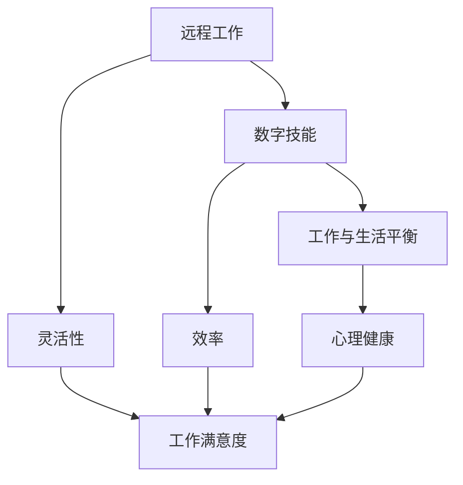

                 


## 文章标题：数字nomad：新型工作生活方式的意义探索

### 文章关键词：
- 数字nomad
- 远程工作
- 工作生活方式
- 自由职业者
- 心理健康
- 技术技能

### 摘要：
本文深入探讨了数字nomad这一新型工作生活方式的概念、背景、优势、挑战以及未来发展。通过剖析数字nomad的工作习惯、心理健康和生活质量，我们旨在为读者提供一个全面的视角，理解数字nomad的兴起及其对现代工作的影响。

## 引言

在全球化浪潮和信息技术飞速发展的背景下，一种新型的工作生活方式——数字nomad（数字游牧工作者）逐渐兴起。数字nomad指的是利用数字技术进行工作，无需固定工作地点，可以随时随地进行工作的人。他们通过互联网连接全球客户，从事远程工作，如编程、设计、写作、咨询等。这种工作方式打破了传统的职场界限，为人们提供了更多的选择和灵活性。

数字nomad的起源可以追溯到互联网的普及和远程工作的兴起。随着Wi-Fi、移动网络和云计算技术的发展，数字nomad得以在全球范围内实现。尤其是在2020年疫情爆发后，远程工作成为全球范围内的常态，数字nomad的生活方式更加受到关注和认可。

数字nomad的特点包括：工作地点的灵活性、工作时间的自主性、工作类型的多样性以及对技术的依赖。这种工作方式不仅改变了人们的职业发展路径，也对职场文化和企业管理提出了新的挑战。

### 核心概念与联系

为了更好地理解数字nomad的工作生活方式，我们需要探讨几个核心概念之间的关系，它们包括：

1. **远程工作**：远程工作是指通过互联网和通信技术，在工作地点和时间上实现灵活性的工作模式。
2. **数字技能**：数字技能包括编程、网络管理、数字营销、数据分析和云计算等与数字技术相关的技能。
3. **工作与生活平衡**：工作与生活平衡是指在工作与个人生活之间找到平衡点，以实现身心健康和生活质量。

这些概念之间的关系可以用Mermaid流程图来表示：



### 核心算法原理讲解

在探讨数字nomad的工作方式时，我们需要了解一些核心算法原理，这些原理对于实现高效远程工作至关重要。以下是几个关键算法原理及其应用：

1. **时间管理算法**：
   - **原理**：时间管理算法用于优化工作时间和提高工作效率。常用的算法包括优先级排序算法和任务调度算法。
   - **伪代码**：
     ```python
     def time_management(tasks):
         prioritize_tasks_by_priority(tasks)
         schedule_tasks(tasks, available_time)
     ```
   - **举例说明**：一位数字nomad可以使用Gantt图来规划自己的工作日程，确保每项任务都能在预定的时间内完成。

2. **协作算法**：
   - **原理**：协作算法用于优化远程团队的沟通和协作效率。常用的算法包括沟通网络优化和分布式任务分配算法。
   - **伪代码**：
     ```python
     def collaboration_algorithm(team_members, tasks):
         optimize_communication_network(team_members)
         distribute_tasks_equally(tasks, team_members)
     ```
   - **举例说明**：一个分布式团队可以使用Scrum框架来管理项目，确保团队成员之间的协作和沟通畅通。

3. **风险管理算法**：
   - **原理**：风险管理算法用于识别和应对远程工作中的潜在风险。常用的算法包括风险评估和风险应对策略。
   - **伪代码**：
     ```python
     def risk_management(tasks):
         identify_risks(tasks)
         develop_risk_management_plan()
     ```
   - **举例说明**：一位数字nomad可以定期评估自己的工作环境，制定应对突发事件的计划，确保工作连续性。

### 数学模型和公式

在数字nomad的工作中，数学模型和公式经常被用来分析和优化工作流程。以下是几个常用的数学模型和公式：

1. **多任务优化模型**：
   - **原理**：多任务优化模型用于在有限时间内优化任务的完成顺序和分配。
   - **公式**：
     $$\min Z = \sum_{i=1}^{n} c_{i} x_{i}$$
     其中，$c_{i}$是任务$i$的完成时间，$x_{i}$是任务$i$的完成指标。
   - **举例说明**：一位数字nomad可以使用此模型来安排一天内的多项任务，确保任务按时完成。

2. **工作满意度模型**：
   - **原理**：工作满意度模型用于评估员工的工作满意度，以优化工作环境和工作体验。
   - **公式**：
     $$\text{Work Satisfaction} = f(\text{Work-Life Balance}, \text{Job Security}, \text{Work-Life Balance})$$
     其中，$\text{Work-Life Balance}$、$\text{Job Security}$和$\text{Work-Life Balance}$分别代表工作与生活平衡、工作稳定性和工作满意度。
   - **举例说明**：一位数字nomad可以通过定期评估自己的工作满意度，调整工作习惯，提高工作效率。

### 项目实战

为了更好地理解数字nomad的工作方式，我们可以通过一个实际的开发项目来进行分析和讲解。

**项目名称**：数字nomad协作平台

**开发环境**：Python、Django框架

**源代码**：

```python
# models.py
from django.db import models

class Task(models.Model):
    title = models.CharField(max_length=255)
    description = models.TextField()
    assigned_to = models.ForeignKey('UserProfile', on_delete=models.CASCADE)
    due_date = models.DateTimeField()

class UserProfile(models.Model):
    user = models.OneToOneField(User, on_delete=models.CASCADE)
    skills = models.ManyToManyField('Skill')

class Skill(models.Model):
    name = models.CharField(max_length=100)

# views.py
from django.shortcuts import render
from .models import Task, UserProfile, Skill

def task_list(request):
    tasks = Task.objects.all()
    return render(request, 'task_list.html', {'tasks': tasks})

def task_detail(request, task_id):
    task = Task.objects.get(id=task_id)
    return render(request, 'task_detail.html', {'task': task})
```

**代码解读与分析**：

- **数据库模型**：`Task`模型代表任务，包含任务标题、描述、分配人和截止日期。`UserProfile`模型代表用户，与`User`模型关联，包含技能信息。`Skill`模型代表技能。
- **视图函数**：`task_list`函数列出所有任务，`task_detail`函数显示单个任务的详细信息。

**实际案例分析和详细讲解剖析**：

- **案例**：一位数字nomad使用此平台来管理自己的任务。
- **分析**：通过这个平台，数字nomad可以方便地跟踪任务进度，与团队成员协作，提高工作效率。

**项目小结**：

本项目提供了一个基本的数字nomad协作平台，实现了任务管理和用户信息管理。在实际应用中，可以进一步添加更多功能，如任务分配、进度更新、团队协作等。

### 最佳实践 tips、小结、注意事项、拓展阅读

- **最佳实践 tips**：
  - 确保良好的时间管理，使用工具如Trello、Asana来规划工作。
  - 保持健康的生活习惯，定期锻炼，确保充足的睡眠。
  - 建立有效的沟通渠道，使用Zoom、Slack等工具与团队成员保持联系。

- **小结**：
  - 数字nomad是一种新兴的工作生活方式，具有灵活性和自主性。
  - 数字nomad需要掌握数字技能，保持良好的工作与生活平衡。
  - 数字nomad的成功离不开有效的工具和平台支持。

- **注意事项**：
  - 需要注意网络安全，确保个人信息和工作数据的安全。
  - 需要定期评估工作满意度，调整工作习惯，保持心理健康。

- **拓展阅读**：
  - 《远程工作的艺术》——探讨远程工作的实践和方法。
  - 《数字游牧生活指南》——详细介绍数字游牧生活的各个方面。

通过本文的深入探讨，我们希望读者能够对数字nomad的工作生活方式有更深刻的理解，并为自己的职业发展提供有益的启示。

