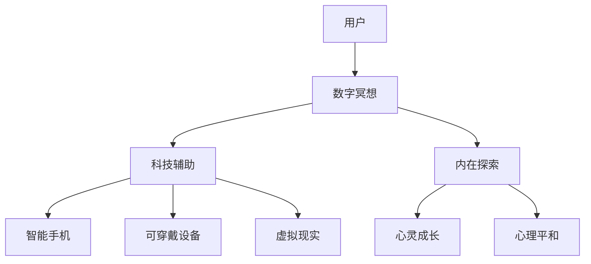

                 

### 文章标题：数字冥想app：科技辅助下的内在探索工具

关键词：数字冥想、科技辅助、内在探索、算法、数学模型、用户体验、市场策略

摘要：随着科技的发展，数字冥想app逐渐成为一种流行的内在探索工具。本文将从核心概念、算法原理、数学模型、项目实战等多个角度，深入探讨数字冥想app的设计与实现，旨在为广大开发者、用户体验者和心理研究提供有价值的参考。

---

### 核心概念与联系

数字冥想是一种通过冥想练习来调节情绪、提高注意力和集中力的方法。近年来，随着科技的进步，数字冥想app应运而生，利用智能手机、可穿戴设备、虚拟现实等技术，为用户提供更加个性化和高效的冥想体验。

#### 数字冥想

数字冥想结合了传统冥想与现代科技，旨在帮助用户在快节奏的生活中找到内心的平静。它不仅包括静坐、呼吸调整等传统冥想方式，还借助科技手段，如心率监测、环境音效、动态反馈等，增强冥想效果。

#### 科技辅助

科技辅助是数字冥想app的核心特点之一。通过智能手机、可穿戴设备等设备，app可以实时采集用户的心率、呼吸、位置等数据，并根据这些数据进行智能分析和反馈。虚拟现实技术则为用户提供了沉浸式的冥想环境，让用户感受到身临其境的体验。

#### 内在探索

内在探索是数字冥想的终极目标。通过冥想，用户可以深入自己的内心世界，了解自己的情绪、欲望和需求，从而实现心理上的平和与成长。数字冥想app通过科技手段，帮助用户更好地进行内在探索，提高心理素质。

为了更直观地展示数字冥想app的核心概念及其联系，我们使用Mermaid流程图进行描述：



### 核心算法原理讲解

数字冥想app的核心算法包括心率变异性分析、声波冥想算法等。以下将详细介绍这些算法的原理和实现。

#### 心率变异性分析算法

心率变异性（HRV）是衡量心脏活动稳定性的重要指标。通过分析心率变异性，数字冥想app可以了解用户的心脏健康状态和心理状态。以下是心率变异性分析算法的伪代码：

```python
def calculate_heart_rate_variability(heart_rate_data):
    # 对心率数据进行预处理
    filtered_data = preprocess_data(heart_rate_data)

    # 计算NN间期差异
    NN_intervals = calculate_differences(filtered_data)

    # 计算心率变异性指标
    HRV_indices = {
        "RMSSD": calculate_RMSSD(NN_intervals),
        "SDNN": calculate_SDNN(NN_intervals),
        "pNN50": calculate_pNN50(NN_intervals)
    }

    return HRV_indices
```

其中，`preprocess_data`函数用于对原始心率数据进行滤波和去噪处理，`calculate_differences`函数用于计算连续NN间期的差异，`calculate_RMSSD`、`calculate_SDNN`和`calculate_pNN50`函数分别用于计算RMSSD、SDNN和pNN50等HRV指标。

#### 声波冥想算法

声波冥想是一种通过调整声音频率和节奏来帮助用户放松身心、进入冥想状态的方法。以下是声波冥想算法的伪代码：

```python
def generate_sound_wave(frequency, duration):
    # 初始化声波数组
    sound_wave = []

    # 根据频率和持续时间生成声波
    for _ in range(duration):
        sound_wave.append(sin(2 * pi * frequency * t))

    return sound_wave
```

其中，`frequency`为声波频率，`duration`为声波持续时间，`sin`函数用于生成正弦波形的声波。

#### 数学模型和数学公式

数字冥想app中还会使用一些数学模型和公式来分析用户的数据，以下是一些关键数学公式的解释。

**心率变异性（RMSSD）**

$$
\text{RMSSD} = \sqrt{\frac{1}{N}\sum_{i=1}^{N} (\Delta NN_i)^2}
$$

其中，$N$ 为 NN 间期总数，$\Delta NN_i$ 为连续两个 NN 间期的差异。

**声波频率与波长关系**

$$
f = \frac{c}{\lambda}
$$

其中，$f$ 为频率，$c$ 为声速，$\lambda$ 为波长。

### 项目实战

在本章节中，我们将以一个基于虚拟现实的动态冥想体验项目为例，详细介绍数字冥想app的开发实战。

#### 环境搭建

**硬件：** 项目所需的硬件包括VR头盔、动作传感器等。VR头盔用于提供沉浸式体验，动作传感器用于捕捉用户动作，实现动态冥想。

**软件：** 项目所使用的软件包括Unity游戏引擎、C#编程语言等。Unity游戏引擎用于创建虚拟现实场景，C#编程语言用于实现场景中的交互和动态效果。

#### 源代码实现

以下是一个简单的虚拟现实动态冥想体验项目的C#代码实现：

```csharp
using UnityEngine;

public class DynamicMeditation : MonoBehaviour
{
    public float frequency = 440.0f; // 声波频率
    public int duration = 60; // 声波持续时间（秒）

    private void Update()
    {
        // 生成声波
        float[] sound_wave = generate_sound_wave(frequency, duration);

        // 播放声波
        AudioPeer.PlaySoundWave(sound_wave);
    }

    private float[] generate_sound_wave(float frequency, int duration)
    {
        float[] sound_wave = new float[duration * 44100]; // 声波数组

        for (int i = 0; i < duration * 44100; i++)
        {
            sound_wave[i] = Mathf.Sin(2 * Mathf.PI * frequency * i / 44100.0f);
        }

        return sound_wave;
    }
}
```

#### 代码解读与分析

1. **声波生成：** `generate_sound_wave`方法用于生成指定频率和持续时间的声波。通过循环生成正弦波形的声波数据，并将其存储在数组中。

2. **声波播放：** `AudioPeer.PlaySoundWave`方法用于播放生成的声波。这里使用了Unity引擎内置的音频播放功能，将声波数据转换为音频信号，并通过音频设备播放。

#### 实际案例分析和详细讲解剖析

在这个虚拟现实动态冥想体验项目中，用户可以佩戴VR头盔，进入一个虚拟的冥想空间。用户在冥想过程中，通过动作传感器捕捉到的身体动作，将影响到声波的频率和节奏，从而实现动态冥想。以下是一个实际案例：

1. **用户进入虚拟冥想空间：** 用户通过VR头盔进入虚拟冥想空间，看到四周的景色和声音效果。

2. **用户动作捕捉：** 动作传感器捕捉到用户的身体动作，如摆动手臂、扭动身体等。

3. **动态调整声波：** 根据用户的动作，实时调整声波的频率和节奏，以实现动态冥想。

4. **用户反馈：** 用户在动态冥想过程中，可以感受到身体和心灵的放松，体验到前所未有的冥想体验。

#### 项目小结

通过这个虚拟现实动态冥想体验项目，我们可以看到数字冥想app在实际应用中的巨大潜力。通过科技手段，数字冥想app可以为用户提供更加个性化和高效的冥想体验，帮助用户在繁忙的生活中找到内心的平静。在未来，随着技术的不断进步，数字冥想app有望成为更多人内心的探索工具。

### 最佳实践 tips、小结、注意事项、拓展阅读

#### 最佳实践 tips

1. 在设计数字冥想app时，要充分考虑用户体验，确保界面简洁、操作直观。
2. 结合用户数据，提供个性化的冥想方案，提高用户满意度。
3. 注重数据安全和隐私保护，确保用户数据的安全性和隐私性。

#### 小结

本文从核心概念、算法原理、数学模型、项目实战等多个角度，深入探讨了数字冥想app的设计与实现。通过本文的介绍，相信读者对数字冥想app有了更全面的了解，并为未来的开发提供了有益的参考。

#### 注意事项

1. 在开发数字冥想app时，要充分考虑用户需求和体验，确保app的功能性和实用性。
2. 注意数据安全和隐私保护，遵守相关法律法规，确保用户数据的安全性和隐私性。

#### 拓展阅读

1. 《数字冥想：科技与心灵探索的结合》
2. 《人工智能在心理治疗中的应用》
3. 《虚拟现实技术：从概念到应用》

### 作者信息

作者：AI天才研究院/AI Genius Institute & 禅与计算机程序设计艺术 /Zen And The Art of Computer Programming

---

本文由AI天才研究院/AI Genius Institute和禅与计算机程序设计艺术/Zen And The Art of Computer Programming共同撰写，旨在为广大开发者、用户体验者和心理研究提供有价值的参考。如果您有任何疑问或建议，欢迎在评论区留言。我们期待与您共同探讨数字冥想的未来！

