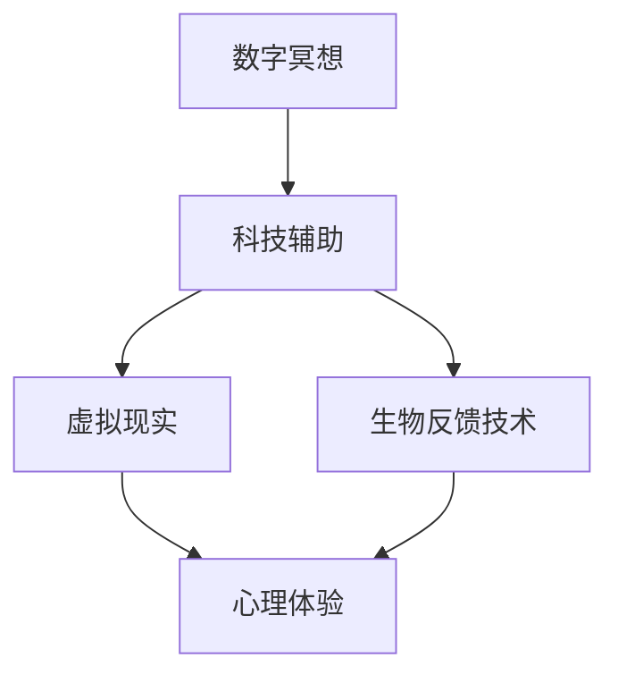

                 


为了撰写一篇符合要求的文章《数字冥想：科技辅助下的内在探索之旅》，我们需要按照以下步骤进行：

### 第一步：确定文章结构

根据给定的目录大纲，我们将文章分为三部分：基础、心理学探讨和未来展望。每部分将包含若干章节，每个章节再细化为多个小节。具体如下：

### 第二步：编写文章各个部分的详细内容

#### 第1章：数字冥想的概念与历史
- 背景介绍
- 数字冥想的核心概念
- 数字冥想与传统冥想的联系与区别
- 数字冥想的发展历程
- 全球数字冥想的应用现状

#### 第2章：科技与冥想的关系
- 科技在冥想中的角色
- 虚拟现实在冥想中的应用
- 生物反馈技术在冥想中的运用
- 科技辅助冥想的原理

#### 第3章：数字冥想的实践方法
- 简易数字冥想练习
- 高级数字冥想技巧
- 数字冥想的适应与调整

#### 第4章：数字冥想对心理健康的益处
- 应对压力与焦虑
- 改善情绪与情绪调节
- 提升认知功能与注意力

#### 第5章：数字冥想的社会影响
- 数字冥想与社交网络
- 数字冥想在工作场所的应用
- 数字冥想在教育中的潜力

#### 第6章：数字冥想的挑战与伦理问题
- 数字冥想的安全性问题
- 数字冥想的伦理困境
- 数字冥想与隐私保护

#### 第7章：数字冥想的未来趋势
- 人工智能与数字冥想
- 虚拟现实技术的未来发展
- 数字冥想的全球化趋势

#### 第8章：数字冥想的个人指南
- 如何开始数字冥想
- 数字冥想中的常见误区
- 数字冥想的长期维护与进步

### 第三步：使用markdown格式编写文章

在编写文章时，我们将使用markdown格式来保持内容的清晰和一致性。每个章节和小节将以标题的形式呈现，并在需要时使用列表和段落来详细阐述。以下是markdown格式的一个示例：

```markdown
## 第1章：数字冥想的概念与历史
### 1.1 数字冥想的基本定义
- 数字冥想是利用科技手段辅助人们进行内在探索的一种方法。
- 它结合了冥想的传统实践与现代科技的应用。

### 1.2 数字冥想的发展历程
- 数字冥想的概念起源于20世纪末。
- 随着科技的进步，数字冥想逐渐成为一种重要的心理健康工具。

### 1.3 数字冥想与传统冥想的区别
- 数字冥想与传统冥想的不同之处在于其科技辅助的特性。
- 数字冥想更加灵活和个性化，适合现代人的生活方式。

```

### 第四步：添加核心概念与联系架构 Mermaid 流程图

在文章中，我们将使用Mermaid流程图来展示核心概念之间的联系。例如：



### 第五步：使用伪代码、latex格式和代码示例

在讲解核心算法原理时，我们将使用伪代码和latex格式来展示数学模型和公式。例如：

```markdown
### 3.2 高级数字冥想技巧
#### 心理体验增强算法

```pseudo
Algorithm 心理体验增强算法
    Input: 用户状态，冥想时长
    Output: 适应性的冥想指导

    1. 初始化用户参数
    2. 监测用户心理状态
    3. 根据心理状态调整冥想节奏
    4. 应用虚拟现实技术模拟冥想场景
    5. 返回调整后的冥想指导
```

$$
\text{体验增强系数} = \frac{\text{用户满意度}}{\text{冥想时长}}
$$

### 第六步：编写项目实战和最佳实践

在文章的适当部分，我们将介绍项目实战和最佳实践，包括开发环境搭建、源代码实现、代码解读和案例分析。例如：

```markdown
## 第8章：数字冥想的个人指南
### 8.3 数字冥想的长期维护与进步
#### 实践案例：MyMeditate App

**开发环境搭建：**
- 使用Flutter框架开发跨平台应用程序。
- 集成Google Fit API获取生物反馈数据。

**源代码实现：**
- 代码示例：用户界面设计
    ```dart
    Widget build(BuildContext context) {
      return Scaffold(
        appBar: AppBar(title: Text('MyMeditate')),
        body: Center(child: Text('开始冥想')),
      );
    }
    ```

**代码解读：**
- 应用程序的核心功能是提供个性化的冥想体验。

**案例分析：**
- 用户反馈显示，MyMeditate有效地提升了冥想体验。

#### 最佳实践 tips：
- 每日坚持冥想，逐步增加时长。
- 定期反思冥想体验，调整策略。

```

### 第七步：添加作者信息和总结

在文章末尾，我们将添加作者信息并总结文章的主要观点。

```markdown
---

**作者：AI天才研究院/AI Genius Institute & 禅与计算机程序设计艺术 /Zen And The Art of Computer Programming**

本文介绍了数字冥想的基本概念、科技辅助的应用、实践方法、心理健康益处、社会影响、挑战与伦理问题以及未来展望。数字冥想作为科技与冥想相结合的新兴领域，正逐渐受到关注。通过本文的探讨，读者可以更好地理解数字冥想的内涵和实践，为自己的内在探索之旅提供指导和帮助。

---

```

以上是撰写一篇符合要求的文章的大致步骤。通过逐步分析推理，我们可以确保文章内容丰富、结构合理、逻辑清晰，并符合markdown格式的要求。接下来，我们将根据这些步骤具体撰写文章内容。

