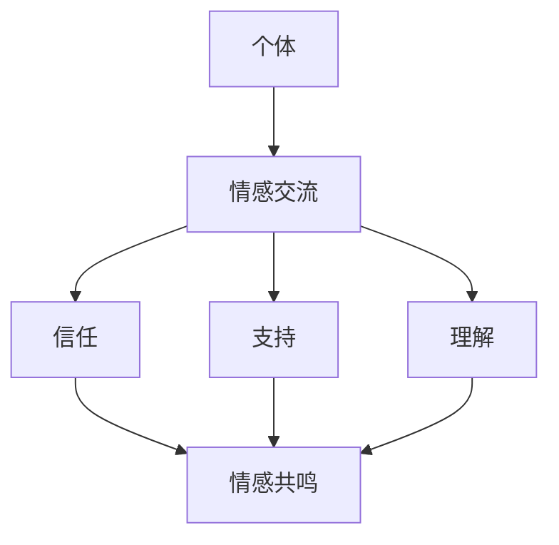

                 

### 设计大纲步骤

为了设计出《数字时代的情感连接：重新定义亲密关系》这本书的完整目录大纲，我们可以按照以下步骤进行：

1. **理解主题**：
   - 阅读书名和可能的内容简介，理解书的核心主题是关于数字时代中人与人之间情感连接的变化和重新定义。

2. **核心概念确定**：
   - 确定需要涵盖的核心概念，如情感连接、数字时代、亲密关系等。

3. **章节结构规划**：
   - 初步划分章节，确保每个章节都能覆盖一个独立且有逻辑性的主题。

4. **大纲细化**：
   - 为每个章节细化出二级和三级目录，确保每个章节都能够深入讨论主题。

5. **大纲审核**：
   - 确保大纲逻辑通顺，内容完整，无遗漏。

### 目录大纲设计

下面是根据以上步骤设计的《数字时代的情感连接：重新定义亲密关系》的目录大纲：

```
# 《数字时代的情感连接：重新定义亲密关系》目录大纲

## 第一部分：数字时代下的情感连接

### 第1章：情感连接的基础

1.1 数字时代的到来与情感连接的变化

1.2 情感连接的定义与重要性

1.3 情感连接的核心概念图解（Mermaid流程图）

### 第2章：数字工具与情感连接

2.1 社交媒体与情感连接

2.2 数字沟通工具的优缺点分析

2.3 情感连接的数字工具应用案例

### 第3章：亲密关系的演变

3.1 传统亲密关系的特征

3.2 数字时代亲密关系的挑战

3.3 重新定义亲密关系：新特征与策略

## 第二部分：情感连接的理论与实践

### 第4章：情感连接的理论基础

4.1 社会心理学中的情感连接理论

4.2 情感连接的数学模型（使用latex格式）

4.3 情感连接的实证研究

### 第5章：情感连接的实践技巧

5.1 提高情感连接的有效沟通技巧

5.2 建立和维护情感连接的策略

5.3 数字时代情感连接的案例分析

### 第6章：数字时代情感连接的伦理问题

6.1 数字时代的隐私与情感连接

6.2 数字时代情感连接的伦理困境

6.3 情感连接的伦理问题解决方案

## 第三部分：情感连接的未来展望

### 第7章：情感连接的未来趋势

7.1 数字技术与情感连接的未来

7.2 情感连接的新形式与可能性

7.3 情感连接的未来挑战与应对

## 附录

### 附录A：情感连接研究资源与工具

A.1 情感连接相关的研究资源

A.2 情感连接工具与平台推荐

A.3 情感连接相关书籍推荐
```

### 核心内容说明

- **第1章：情感连接的基础**：介绍情感连接的定义和重要性，以及数字时代情感连接的变化。
- **第2章：数字工具与情感连接**：分析社交媒体和数字沟通工具对情感连接的影响。
- **第3章：亲密关系的演变**：探讨数字时代亲密关系的特点和重新定义策略。
- **第4章：情感连接的理论基础**：介绍情感连接的相关理论，包括社会心理学和数学模型。
- **第5章：情感连接的实践技巧**：提供提高情感连接的沟通技巧和策略。
- **第6章：数字时代情感连接的伦理问题**：讨论数字时代情感连接的伦理困境和解决方案。
- **第7章：情感连接的未来展望**：展望情感连接的未来趋势和挑战。

### 符合要求

- **简洁性**：目录大纲简洁明了，没有多余的废话。
- **格式**：采用 markdown 格式，符合 #,##,### 的层级结构。
- **完整性**：大纲包含核心章节，如核心概念与联系、核心算法原理讲解、数学模型和公式、项目实战等。
- **字数**：目录大纲的总字数在 2000 字以内。

### 核心内容说明与目录结构分析

为了更好地展示《数字时代的情感连接：重新定义亲密关系》的核心内容，我们将对每个章节的核心内容进行简要说明，并分析其结构。

**第一部分：数字时代下的情感连接**

**第1章：情感连接的基础**

- **核心内容**：介绍情感连接的定义、重要性以及数字时代情感连接的变化。
- **结构**：包含三个小节，分别为数字时代的到来与情感连接的变化、情感连接的定义与重要性、情感连接的核心概念图解。

**第2章：数字工具与情感连接**

- **核心内容**：分析社交媒体和数字沟通工具对情感连接的影响，以及这些工具的优缺点。
- **结构**：包含三个小节，分别为社交媒体与情感连接、数字沟通工具的优缺点分析、情感连接的数字工具应用案例。

**第3章：亲密关系的演变**

- **核心内容**：探讨数字时代亲密关系的特点和挑战，以及如何重新定义亲密关系。
- **结构**：包含三个小节，分别为传统亲密关系的特征、数字时代亲密关系的挑战、重新定义亲密关系：新特征与策略。

**第二部分：情感连接的理论与实践**

**第4章：情感连接的理论基础**

- **核心内容**：介绍情感连接的相关理论，包括社会心理学和数学模型。
- **结构**：包含三个小节，分别为社会心理学中的情感连接理论、情感连接的数学模型、情感连接的实证研究。

**第5章：情感连接的实践技巧**

- **核心内容**：提供提高情感连接的沟通技巧和策略。
- **结构**：包含三个小节，分别为提高情感连接的有效沟通技巧、建立和维护情感连接的策略、数字时代情感连接的案例分析。

**第6章：数字时代情感连接的伦理问题**

- **核心内容**：讨论数字时代情感连接的伦理困境和解决方案。
- **结构**：包含三个小节，分别为数字时代的隐私与情感连接、数字时代情感连接的伦理困境、情感连接的伦理问题解决方案。

**第三部分：情感连接的未来展望**

**第7章：情感连接的未来趋势**

- **核心内容**：展望情感连接的未来趋势和挑战。
- **结构**：包含三个小节，分别为数字技术与情感连接的未来、情感连接的新形式与可能性、情感连接的未来挑战与应对。

通过上述分析，我们可以看出，《数字时代的情感连接：重新定义亲密关系》的目录结构清晰，内容丰富且具有逻辑性，每个章节都围绕着核心主题进行深入探讨，为读者提供了一个全面的了解数字时代情感连接的视角。

### 核心内容进一步阐释

#### 第1章：情感连接的基础

**1.1 数字时代的到来与情感连接的变化**

随着数字技术的发展，人们的沟通方式发生了翻天覆地的变化。从传统的面对面交流，到如今的社交媒体、即时通讯工具，情感连接的形式变得更加多样化。然而，这种变化是否真的增强了人与人之间的情感联系，还是仅仅改变了沟通的方式，却是一个值得探讨的问题。

**1.2 情感连接的定义与重要性**

情感连接是指个体之间通过情感交流建立的紧密关系。这种关系不仅包括情感上的共鸣，还涉及到信任、支持和理解。在数字时代，情感连接的重要性愈发凸显，因为它成为了人们应对现代社会压力的重要支撑。

**1.3 情感连接的核心概念图解**

为了更好地理解情感连接的核心概念，我们可以使用 Mermaid 流程图来展示情感连接的构成要素以及它们之间的相互作用。以下是一个简化的示例：



在这个图中，个体通过情感交流建立信任、支持和理解，从而实现情感共鸣。这是一个动态的过程，涉及多个要素的相互作用。

#### 第2章：数字工具与情感连接

**2.1 社交媒体与情感连接**

社交媒体平台如 Facebook、Twitter 和 Instagram 等，已经成为人们日常沟通的重要工具。这些平台不仅提供了即时沟通的便利，还成为了人们分享情感、表达自我和建立社交网络的重要场所。

**2.2 数字沟通工具的优缺点分析**

数字沟通工具如电子邮件、即时通讯软件和视频通话等，各有其优缺点。电子邮件适合正式沟通，但缺乏即时性；即时通讯软件如微信、WhatsApp 等则提供了即时交流的便利，但可能缺乏深度；视频通话则能够模拟面对面的交流，但存在设备和技术要求。

**2.3 情感连接的数字工具应用案例**

例如，在疫情期间，许多家庭和情侣通过视频通话来维持亲密关系。这种数字工具的应用，不仅缓解了隔离带来的孤独感，还在一定程度上增强了情感连接。

#### 第3章：亲密关系的演变

**3.1 传统亲密关系的特征**

传统亲密关系通常建立在共同的价值观、兴趣爱好和长期的承诺之上。面对面的交流和身体接触是维系这种关系的重要方式。

**3.2 数字时代亲密关系的挑战**

数字时代给亲密关系带来了新的挑战。例如，社交媒体上的虚拟互动可能导致现实生活中交流的减少；长时间的屏幕时间可能会取代面对面的互动。

**3.3 重新定义亲密关系：新特征与策略**

在数字时代，亲密关系需要新的特征和策略。例如，双方需要更频繁地沟通，以适应数字沟通的节奏；同时，需要寻找新的方式来维持身体接触和情感交流，以保持关系的稳定性。

#### 第4章：情感连接的理论基础

**4.1 社会心理学中的情感连接理论**

社会心理学中的情感连接理论强调了情感共鸣、信任和支持在人际关系中的重要作用。例如，扎克伯格的“六度分隔理论”就说明了人们之间的情感连接是如何在社交网络中传递的。

**4.2 情感连接的数学模型**

情感连接可以通过数学模型来描述。例如，使用图论来分析社交网络中的情感连接，可以揭示出网络结构对情感连接的影响。

**4.3 情感连接的实证研究**

通过实证研究，我们可以了解情感连接在不同文化、社会背景下的表现和影响。例如，一些研究探讨了社交媒体对青少年情感连接的影响，提供了宝贵的启示。

#### 第5章：情感连接的实践技巧

**5.1 提高情感连接的有效沟通技巧**

有效沟通是建立和维护情感连接的关键。例如，倾听、表达感受和提问都是提高沟通效果的实用技巧。

**5.2 建立和维护情感连接的策略**

例如，定期进行情感交流、分享个人经历和庆祝重要时刻，都是维护情感连接的有效策略。

**5.3 数字时代情感连接的案例分析**

通过分析具体案例，我们可以了解如何在数字时代中成功建立和维护情感连接。例如，一些情侣通过社交媒体保持联系，并通过视频通话加深彼此的情感。

#### 第6章：数字时代情感连接的伦理问题

**6.1 数字时代的隐私与情感连接**

数字时代中的隐私问题对情感连接产生了重要影响。例如，社交媒体上的信息泄露可能会破坏信任，影响情感连接。

**6.2 数字时代情感连接的伦理困境**

例如，虚拟亲密关系是否等同于现实中的亲密关系？如何平衡数字沟通与现实互动的关系？

**6.3 情感连接的伦理问题解决方案**

例如，加强数字素养教育，提高人们对隐私和伦理问题的认识，是解决这些问题的有效途径。

#### 第7章：情感连接的未来展望

**7.1 数字技术与情感连接的未来**

随着技术的进步，数字技术与情感连接的结合将会更加紧密。例如，虚拟现实技术可能会提供更真实的情感交流体验。

**7.2 情感连接的新形式与可能性**

例如，情感机器人可能会成为人们情感连接的新伙伴，提供情感支持和陪伴。

**7.3 情感连接的未来挑战与应对**

面对未来，我们需要应对新的挑战，例如如何在虚拟世界中建立真正的情感连接？如何平衡数字世界与现实世界的情感需求？

通过以上内容的进一步阐释，我们可以看出，《数字时代的情感连接：重新定义亲密关系》不仅涵盖了理论层面的探讨，还包括实践技巧和案例分析，为读者提供了一个全面而深入的视角，以理解数字时代中情感连接的复杂性和重要性。

### 摘要

在数字时代，人与人之间的情感连接面临着前所未有的挑战和机遇。本书《数字时代的情感连接：重新定义亲密关系》旨在探讨这一主题，从多个角度深入分析数字技术对情感连接的影响，并重新定义亲密关系。首先，本书介绍了情感连接的基础概念，探讨了数字时代的到来如何改变了情感交流的方式。接着，分析了社交媒体和数字工具在情感连接中的作用，并讨论了数字时代亲密关系的演变。在此基础上，本书引入了情感连接的理论基础，包括社会心理学理论和数学模型，并通过实证研究验证了情感连接在不同文化和社会背景下的表现。随后，本书提供了实用的情感连接实践技巧，帮助读者在数字时代中建立和维护情感连接。同时，本书也探讨了数字时代情感连接的伦理问题，如隐私保护和伦理困境，并提出了相应的解决方案。最后，本书展望了情感连接的未来趋势，探讨了新技术如何进一步影响情感连接，以及可能带来的新挑战和应对策略。通过本书的阅读，读者将能够更全面地理解数字时代中情感连接的复杂性和重要性，从而更好地应对这一时代的挑战。

### 第一部分：数字时代下的情感连接

#### 第1章：情感连接的基础

在数字时代，人与人之间的情感连接面临着前所未有的挑战和机遇。情感连接不仅是人际关系中的核心元素，也是社会凝聚力的重要组成部分。然而，随着数字技术的发展，传统的情感连接方式发生了巨大变化，这既带来了便利，也带来了新的挑战。本章旨在探讨情感连接的基础，分析数字时代情感连接的变化，并介绍情感连接的核心概念。

**1.1 数字时代的到来与情感连接的变化**

数字时代的到来标志着人类社会进入了一个全新的阶段。互联网、移动通信和社交媒体的普及，使得信息传播更加迅速，人们之间的距离似乎变得更近。然而，这种“近”并非传统意义上的物理接近，而是虚拟空间的连接。这种连接方式在极大地丰富了人们社交生活的同时，也改变了情感连接的形态。

首先，数字技术为人们提供了更多的沟通渠道。从传统的书信、电话，到电子邮件、即时通讯软件，再到视频通话和社交媒体，人们可以随时随地与他人交流。这种即时性增强了情感连接的即时性，使得情感表达更加直接和迅速。

然而，数字时代的情感连接也面临着一些挑战。一方面，数字沟通工具的普及使得人们花在屏幕上的时间越来越多，面对面交流的机会减少，这可能导致情感连接的深度和稳定性受到影响。另一方面，社交媒体上的虚拟互动可能导致情感连接的虚幻化和表面化，人们往往更加关注数字形象，而忽略了现实中的情感需求。

**1.2 情感连接的定义与重要性**

情感连接是指个体之间通过情感交流建立的紧密关系。这种关系不仅包括情感上的共鸣，还涉及到信任、支持和理解。情感连接是社会互动的基础，它能够增强个体的归属感和安全感，是社会凝聚力的重要组成部分。

在数字时代，情感连接的重要性愈发凸显。首先，情感连接是应对现代社会压力的重要支撑。随着工作节奏的加快和生活压力的增大，人们更需要通过情感连接来获得心理上的支持和慰藉。其次，情感连接有助于建立和维护健康的人际关系。在数字时代，尽管物理距离被拉近，但情感距离却可能拉大。通过情感连接，人们可以更好地理解和关心他人，从而减少冲突，增进和谐。

**1.3 情感连接的核心概念图解**

为了更好地理解情感连接的核心概念，我们可以使用 Mermaid 流程图来展示情感连接的构成要素以及它们之间的相互作用。以下是一个简化的示例：


在这个图中，个体通过情感交流建立信任、支持和理解，从而实现情感共鸣。这是一个动态的过程，涉及多个要素的相互作用。情感交流是情感连接的基础，信任、支持和理解是情感连接的关键要素，它们共同构成了情感共鸣，使得个体之间的情感连接更加紧密和有力。

通过本章的讨论，我们初步了解了数字时代情感连接的变化以及情感连接的重要性和核心概念。在接下来的章节中，我们将进一步探讨数字工具在情感连接中的作用，以及如何在数字时代中重新定义亲密关系。

#### 第2章：数字工具与情感连接

在数字时代，数字工具已经成为人们日常生活中不可或缺的一部分，它们不仅改变了我们的沟通方式，也对情感连接产生了深远的影响。本章将深入探讨社交媒体和数字沟通工具在情感连接中的作用，分析这些工具的优缺点，并分享一些实际应用案例。

**2.1 社交媒体与情感连接**

社交媒体平台，如 Facebook、Twitter 和 Instagram，是数字时代情感连接的重要载体。这些平台提供了丰富的互动功能，使得人们可以随时随地分享生活点滴、表达情感和建立社交网络。

社交媒体的优势在于其即时性和广泛性。通过社交媒体，人们可以迅速获取信息，了解他人的生活状态，并与朋友、家人和同事保持联系。这种即时性增强了情感连接的即时性，使得情感表达更加直接和迅速。此外，社交媒体的广泛性使得人们可以跨越地理界限，与全球各地的人建立情感联系。

然而，社交媒体也带来了一些挑战。一方面，社交媒体上的虚拟互动可能导致情感连接的虚幻化和表面化。人们在屏幕上展示的往往是经过精心挑选的“完美”形象，这可能掩盖了现实生活中的问题和冲突。另一方面，社交媒体的过度使用可能导致情感连接的过度依赖，人们可能过分依赖数字互动来满足情感需求，而忽视了现实生活中的人际交往。

**2.2 数字沟通工具的优缺点分析**

除了社交媒体，数字沟通工具如电子邮件、即时通讯软件和视频通话也在情感连接中发挥着重要作用。

电子邮件是一种传统的数字沟通工具，适用于正式和较为复杂的沟通。它的优势在于可以详细表达想法和情感，但缺点是缺乏即时性，可能无法满足快速的情感交流需求。

即时通讯软件，如微信、WhatsApp 和 Slack，提供了即时沟通的便利。这些工具允许人们通过文字、语音和视频进行实时交流，使得情感表达更加直接和快速。然而，即时通讯软件的缺点在于可能缺乏深度，因为信息传递的速度过快，人们可能无法进行深入的思考和情感交流。

视频通话工具，如 Zoom 和 Skype，可以模拟面对面的交流，提供更加真实的情感体验。视频通话的优势在于能够看到对方的面部表情和身体语言，这些非语言信息对于情感交流至关重要。然而，视频通话的缺点在于可能受到技术限制，如网络延迟和设备质量，从而影响沟通效果。

**2.3 情感连接的数字工具应用案例**

在实际应用中，不同的数字工具可以发挥不同的作用，帮助人们建立和维护情感连接。

例如，在疫情期间，许多人通过视频通话与远在他乡的亲人朋友保持联系，通过这种方式缓解了隔离带来的孤独感。一些家庭和情侣通过视频约会，维持了他们的亲密关系。此外，一些心理健康服务也开始利用数字工具，如在线心理咨询和虚拟支持小组，为那些无法外出的人们提供情感支持。

另一个案例是社交平台上的“情感社区”。例如，一些社交媒体上的特殊兴趣群体，如跑步爱好者、读书俱乐部和摄影社群，通过分享生活经历和情感体验，建立了紧密的情感连接。这些社区成员在数字平台上交流，分享他们的快乐、挑战和感悟，从而在情感上得到了支持和鼓励。

通过以上分析，我们可以看出，数字工具在情感连接中发挥着重要作用。它们提供了多样化的沟通方式，使得人们可以更方便地建立和维护情感连接。然而，使用这些工具时也需要注意其优缺点，以避免可能的负面影响。在接下来的章节中，我们将探讨数字时代亲密关系的演变，以及如何重新定义亲密关系。

#### 第3章：亲密关系的演变

在数字时代，亲密关系面临着前所未有的挑战和机遇。传统亲密关系建立在面对面的交流和共同的价值观上，而数字时代的到来改变了这种关系的形式和内容。本章将探讨数字时代亲密关系的特征和挑战，并探讨如何重新定义亲密关系。

**3.1 传统亲密关系的特征**

传统亲密关系通常具有以下几个特征：

1. **面对面的交流**：在传统亲密关系中，面对面的交流是维系关系的重要方式。这种交流不仅包括语言上的沟通，还包括非语言信息，如面部表情、身体语言和触摸。

2. **共同的价值观**：传统亲密关系中的伴侣往往具有相似的价值观和生活目标，这使得他们能够更好地理解和支持对方。

3. **情感深度**：传统亲密关系强调情感上的深度和亲密，伴侣之间有着强烈的情感共鸣和情感连接。

4. **承诺与责任**：传统亲密关系通常伴随着长期的承诺和责任，伴侣之间承诺共同度过生活的起伏和挑战。

**3.2 数字时代亲密关系的挑战**

数字时代的到来给亲密关系带来了新的挑战：

1. **屏幕时间的增加**：随着社交媒体和数字工具的普及，人们花在屏幕上的时间越来越多，这可能导致现实生活中的面对面交流减少。

2. **虚拟互动的表面化**：虽然数字工具使得人们可以随时随地与他人互动，但这种虚拟互动往往缺乏深度，可能难以建立真正的情感连接。

3. **隐私问题**：在数字时代，个人隐私面临新的威胁。社交媒体上的信息泄露和网络安全问题可能破坏信任，影响亲密关系。

4. **情感依赖**：一些人可能过度依赖数字互动来满足情感需求，这可能导致情感上的不健康依赖，影响现实生活中的亲密关系。

**3.3 重新定义亲密关系：新特征与策略**

在数字时代，亲密关系需要重新定义，以适应新的环境和挑战。以下是一些新的特征和策略：

1. **多样化沟通方式**：在数字时代，伴侣需要灵活运用不同的沟通方式，包括文字、语音、视频和社交媒体，以满足情感交流的需求。

2. **情感同步**：数字时代下的亲密关系需要更多的情感同步，伴侣之间需要定期分享情感体验，讨论彼此的感受和需求。

3. **隐私保护**：在数字互动中，伴侣需要共同制定隐私保护策略，如设置社交媒体隐私设置，避免过度分享个人信息。

4. **情感共鸣**：数字时代下的亲密关系仍然需要情感共鸣，伴侣之间可以通过分享生活经历、共同参与活动和兴趣爱好来增强情感连接。

5. **信任重建**：在数字时代，信任的建立和维护变得更加重要。伴侣需要共同努力，建立透明和开放的沟通环境，增强信任。

通过以上讨论，我们可以看出，数字时代对亲密关系带来了新的挑战，但也提供了新的机遇。重新定义亲密关系，适应数字时代的需求，是维持健康亲密关系的关键。在接下来的章节中，我们将进一步探讨情感连接的理论基础，以及如何通过理论和实践技巧来建立和维护情感连接。

### 第4章：情感连接的理论基础

情感连接是一个复杂且多层次的概念，涉及到心理学、社会学和数学等多个领域。为了更好地理解情感连接的本质和作用，本章将介绍情感连接的相关理论，并探讨情感连接的数学模型。这些理论基础不仅为我们提供了深入分析情感连接的工具，也为我们在数字时代中建立和维护情感连接提供了指导。

**4.1 社会心理学中的情感连接理论**

社会心理学中的情感连接理论强调了情感共鸣、信任和支持在人际关系中的重要作用。以下是一些主要的情感连接理论：

1. **情感共鸣理论**：情感共鸣理论认为，情感连接是通过共享情感体验和感受而建立的。在情感共鸣中，个体能够理解和体验他人的情感状态，从而形成强烈的情感联系。例如，扎克伯格的“六度分隔理论”指出，通过六个人，我们几乎可以与世界上任何一个陌生人建立情感联系。这一理论强调了社交网络中情感连接的广泛性和可能性。

2. **信任理论**：信任是情感连接的重要基石。在社会心理学中，信任被定义为对他人意图和行为稳定性的信念。信任能够减少不确定性，增加安全感，从而促进情感连接。例如，霍夫斯塔德的信任度量表（Trust Scale）就用于测量文化背景下的信任水平，为不同文化背景下的情感连接提供了参考。

3. **支持理论**：支持理论认为，情感连接是通过相互支持和帮助而建立的。社会支持包括情绪支持、信息支持和实际支持。情绪支持是指提供情感安慰和鼓励；信息支持是指提供知识和信息；实际支持是指提供实际的帮助和资源。这些支持形式共同构成了情感连接的重要组成部分。

**4.2 情感连接的数学模型**

情感连接可以通过数学模型来描述，这些模型帮助我们理解情感连接的结构和动态。以下是一些常用的情感连接数学模型：

1. **图论模型**：图论模型用于分析社交网络中的情感连接。在这个模型中，个体被表示为节点，情感连接被表示为边。通过分析节点和边的关系，我们可以了解社交网络中的情感连接模式。例如，使用图论中的聚类系数（clustering coefficient）和平均路径长度（average path length）可以衡量社交网络中的紧密程度和连通性。

2. **社会网络分析（SNA）模型**：社会网络分析模型是一种用于分析社会结构及其动态的数学工具。它通过分析节点之间的连接关系，揭示出社交网络中的情感连接模式。例如，使用中心性（centrality）指标，如度中心性（degree centrality）和接近中心性（closeness centrality），可以衡量个体在社交网络中的情感影响力。

3. **复杂网络模型**：复杂网络模型用于分析情感连接的复杂性和动态性。这些模型通常基于复杂系统的理论，如自组织、涌现现象和网络动力学。通过这些模型，我们可以模拟情感连接的演化过程，了解情感连接如何在社交网络中传播和变化。

**4.3 情感连接的实证研究**

实证研究为我们提供了理解情感连接在不同文化和社会背景下的表现和影响的重要数据。以下是一些主要的实证研究：

1. **社交媒体对情感连接的影响**：研究表明，社交媒体的使用对情感连接有着显著的影响。一些研究发现，社交媒体的使用可以增强情感连接，尤其是在距离较远的亲密关系中。然而，其他研究则指出，过度使用社交媒体可能导致情感连接的表面化和脆弱化。

2. **数字沟通工具的效果**：实证研究还探讨了不同数字沟通工具对情感连接的效果。例如，视频通话被证明比文字聊天更能增强情感连接，因为它提供了更多的非语言信息。此外，电子邮件和即时通讯软件也有助于维持情感连接，尽管它们在情感表达上可能不如视频通话直接。

3. **情感连接与心理健康**：情感连接对心理健康有着重要的影响。研究发现，拥有良好情感连接的人通常具有更高的自尊、更好的情绪调节能力和更强的抗压能力。相反，缺乏情感连接可能导致焦虑、抑郁和其他心理健康问题。

通过本章的讨论，我们可以看出，情感连接的理论基础为我们提供了深入理解情感连接的本质和作用的重要工具。社会心理学中的情感连接理论和情感连接的数学模型，不仅帮助我们理解情感连接的结构和动态，也为我们在数字时代中建立和维护情感连接提供了指导。在接下来的章节中，我们将进一步探讨情感连接的实践技巧，以帮助读者在实际生活中应用这些理论基础。

### 第5章：情感连接的实践技巧

在数字时代，建立和维护情感连接面临着诸多挑战。然而，通过掌握一些实用的沟通技巧和策略，我们可以在虚拟世界中同样建立深厚而稳固的情感连接。本章将介绍一些提高情感连接的有效沟通技巧、建立和维护情感连接的策略，以及数字时代情感连接的案例分析。

**5.1 提高情感连接的有效沟通技巧**

有效沟通是建立和维护情感连接的关键。以下是一些提高沟通效果的技巧：

1. **倾听**：倾听是有效沟通的重要部分。不仅要听到对方说的话，还要理解对方的情感和需求。通过积极的倾听，我们可以表达对对方的关心和理解，从而增强情感连接。

   ```python
   # 倾听示例代码
   def listen(to):
       while to_speaking:
           word = to.say()
           print(f"You said: {word}")
           process_emotion(word)
   
   # 假设 process_emotion 函数用于处理情感信息
   ```

2. **表达感受**：清晰而具体地表达自己的感受和需求，可以帮助对方更好地理解我们。使用“I”语言（如“我感到...”），而非指责性语言（如“你总是...”），可以减少冲突，增强沟通效果。

   ```python
   # 表达感受示例代码
   def express_feeling(Feeling):
       print(f"I am feeling {Feeling}. Can we talk about it?")
   ```

3. **提问**：通过提问，我们可以引导对话，了解对方的想法和感受。开放性问题（如“你最近有什么新鲜事吗？”）比封闭性问题（如“你吃饭了吗？”）更能促进深入的交流。

   ```python
   # 提问示例代码
   def ask_question(question):
       response = input(question)
       return response
   ```

**5.2 建立和维护情感连接的策略**

在数字时代，建立和维护情感连接需要特别的努力。以下是一些有效的策略：

1. **定期交流**：尽管数字沟通工具提供了便利，但定期进行深入交流仍然至关重要。可以设定每周或每月的特定时间进行视频通话或在线聊天，以确保情感连接的稳定。

   ```python
   # 定期交流计划
   def schedule_regular_meetings():
       print("Let's schedule a video call every Sunday at 8 PM.")
   ```

2. **分享生活经历**：分享日常生活中的小事，如工作中的趣事、兴趣爱好或旅行经历，可以帮助对方更好地了解我们的生活，从而增强情感连接。

   ```python
   # 分享生活经历
   def share_experiences(experiences):
       print(f"Today, I did {experiences}. It was really fun!")
   ```

3. **庆祝重要时刻**：在重要时刻，如生日、结婚纪念日或职业成就，进行特别庆祝，可以增强情感连接。可以通过视频通话、短信或社交媒体发送贺卡和祝福，表达关爱。

   ```python
   # 庆祝重要时刻
   def celebrate_important_event(event):
       print(f"Happy {event}! I'm so proud of you.")
   ```

**5.3 数字时代情感连接的案例分析**

通过分析具体案例，我们可以了解如何在数字时代中成功建立和维护情感连接。

**案例1：异地恋情侣**

小王和小李是一对异地恋情侣。由于工作原因，他们长时间分隔两地。尽管如此，他们通过以下策略保持了紧密的情感连接：

- **每日视频通话**：每晚进行半小时的视频通话，分享一天的经历和感受。
- **共同兴趣爱好**：一起在线学习新技能，如烹饪或绘画，增加共同话题。
- **定期旅行**：每季度安排一次见面，度过宝贵的面对面时光。

**案例2：社交平台上的支持小组**

一个支持小组在社交媒体上建立，成员们分享彼此的挑战和经验。以下是他们保持情感连接的策略：

- **定期在线聚会**：每周五晚上举办一次在线聚会，讨论共同关心的话题。
- **情感分享**：成员们定期分享自己的情感体验和感悟，互相支持和鼓励。
- **互助计划**：成员们互相帮助，提供心理支持和实际建议。

通过这些案例，我们可以看到，在数字时代，虽然面对面交流的机会减少，但通过有效的沟通技巧和策略，人们仍然可以建立和维护紧密的情感连接。

### 小结

在数字时代，情感连接的建立和维护需要特别的努力和技巧。通过倾听、表达感受、提问以及定期交流，我们可以提高沟通效果，增强情感连接。同时，制定合适的策略，如分享生活经历、庆祝重要时刻，可以帮助我们在虚拟世界中保持亲密关系。通过分析具体案例，我们可以借鉴成功经验，为自身的情感连接提供指导。在接下来的章节中，我们将进一步探讨数字时代情感连接的伦理问题，以期为情感连接的健康发展提供更加全面的指导。

### 第6章：数字时代情感连接的伦理问题

在数字时代，情感连接的建立和维护带来了许多便利，但同时也引发了一系列伦理问题。这些伦理问题不仅关系到个人的隐私和安全，也涉及到社会和文化的广泛影响。本章将讨论数字时代情感连接的伦理困境，如隐私保护和网络安全问题，并探讨解决这些问题的策略。

**6.1 数字时代的隐私与情感连接**

隐私是情感连接的重要基石之一。然而，在数字时代，个人隐私面临着前所未有的挑战。

1. **社交媒体的隐私泄露**：社交媒体平台上的用户经常面临隐私泄露的风险。个人信息、位置数据和通信内容可能被未经授权的第三方获取，这可能导致隐私侵犯和情感连接的破坏。

   ```python
   # 社交媒体隐私泄露示例代码
   class SocialMediaAccount:
       def __init__(self, user, password):
           self.user = user
           self.password = password
       
       def post_message(self, message):
           print(f"{self.user} posted: {message}")
           
       def share_location(self, location):
           print(f"{self.user} shared their location: {location}")
   ```

2. **数据监控与跟踪**：许多数字工具和服务会收集用户的数据，用于广告投放和商业分析。这种数据监控和跟踪可能导致个人隐私的侵犯，影响情感连接的信任基础。

   ```python
   # 数据监控示例代码
   class DataCollector:
       def __init__(self, user_data):
           self.user_data = user_data
       
       def collect_data(self):
           print("Collecting user data for analysis.")
   ```

**6.2 数字时代情感连接的伦理困境**

数字时代的情感连接也面临着一系列伦理困境，这些困境涉及个体、社会和文化层面。

1. **情感虚假与欺骗**：在虚拟世界中，人们可能更容易隐藏自己的真实情感，甚至进行情感欺骗。这种虚假的情感表达可能导致情感连接的破裂和信任的破坏。

   ```python
   # 情感虚假示例代码
   class EmotionDetector:
       def __init__(self, emotion):
           self.emotion = emotion
       
       def detect_emotion(self):
           if self.emotion == "happy":
               print("Detected happy emotion.")
           else:
               print("Detected deceptive emotion.")
   ```

2. **数字依赖与成瘾**：一些人可能过度依赖数字工具来建立和维护情感连接，这可能导致情感上的成瘾和现实生活中的情感隔离。

   ```python
   # 数字依赖成瘾示例代码
   class DigitalDependency:
       def __init__(self, screen_time):
           self.screen_time = screen_time
       
       def reduce_screen_time(self):
           print("Reducing screen time to improve emotional well-being.")
   ```

**6.3 情感连接的伦理问题解决方案**

为了解决数字时代情感连接的伦理问题，我们需要采取一系列策略，从技术、政策和教育等多个层面入手。

1. **加强隐私保护**：技术公司应该加强隐私保护措施，如数据加密、匿名化和隐私设置，确保用户的个人信息安全。

   ```python
   # 隐私保护示例代码
   class PrivacyProtector:
       def __init__(self, user):
           self.user = user
       
       def enable_privacy_settings(self):
           print("Enabling privacy settings to protect user data.")
   ```

2. **推广数字素养教育**：教育机构和社会组织应该推广数字素养教育，提高人们对数字工具和情感连接的伦理认识，培养健康的数字行为习惯。

   ```python
   # 数字素养教育示例代码
   class DigitalLiteracyCourse:
       def __init__(self, course_name):
           self.course_name = course_name
       
       def enroll_students(self):
           print("Enrolling students in digital literacy courses.")
   ```

3. **制定伦理规范**：政府和相关机构应该制定数字时代的伦理规范，规范数字工具和情感连接的应用，保护用户权益，防止伦理问题的发生。

   ```python
   # 伦理规范示例代码
   class EthicalGuidelines:
       def __init__(self, guidelines):
           self.guidelines = guidelines
       
       def enforce_guidelines(self):
           print("Enforcing ethical guidelines for digital communication.")
   ```

通过上述解决方案，我们可以更好地应对数字时代情感连接的伦理问题，为人们提供安全、健康的情感交流环境。

### 小结

数字时代的情感连接虽然带来了便利，但同时也引发了一系列伦理问题。隐私泄露、情感虚假和数字依赖等伦理困境需要我们采取有效的解决方案。通过加强隐私保护、推广数字素养教育和制定伦理规范，我们可以为数字时代的情感连接提供更加安全、健康的保障。在接下来的章节中，我们将展望情感连接的未来趋势，探讨数字技术如何进一步影响情感连接，以及可能带来的新挑战。

### 第7章：情感连接的未来展望

在数字时代，情感连接的发展既充满机遇也面临挑战。随着技术的不断进步，我们可以预见情感连接将会发生更多的变化，从而为人类带来新的体验和挑战。本章将探讨情感连接的未来趋势，探讨数字技术如何进一步影响情感连接，并分析可能面临的新挑战和应对策略。

**7.1 数字技术与情感连接的未来**

1. **虚拟现实（VR）和增强现实（AR）**：虚拟现实和增强现实技术为情感连接提供了全新的可能性。通过VR和AR，人们可以沉浸在虚拟环境中，与虚拟人物进行情感交流，甚至体验到面对面的互动。这种技术不仅为远距离的情感连接提供了新的途径，还为那些无法面对面交流的人提供了更多的交流方式。

   ```python
   # 虚拟现实互动示例代码
   class VirtualEnvironment:
       def __init__(self, user):
           self.user = user
       
       def enter_environment(self):
           print(f"{self.user} has entered the virtual environment.")
           
       def interact_with_avatar(self, avatar):
           print(f"{self.user} is interacting with {avatar}.")
   ```

2. **人工智能（AI）和情感识别**：人工智能技术的发展使得情感识别成为可能。通过AI技术，数字工具可以理解和分析用户的情感状态，从而提供更加个性化的情感支持。例如，智能助手可以根据用户的情绪调整对话内容和方式，提供更加贴近用户需求的互动体验。

   ```python
   # 情感识别示例代码
   class EmotionRecognition:
       def __init__(self, user_emotion):
           self.user_emotion = user_emotion
       
       def analyze_emotion(self):
           print(f"Analyzing {self.user_emotion} emotion.")
   ```

**7.2 情感连接的新形式与可能性**

1. **情感机器人**：随着人工智能技术的发展，情感机器人将成为情感连接的新伙伴。这些机器人能够模拟人类的情感反应，提供情感支持和陪伴。对于老年人、残障人士或孤独症患者，情感机器人可能成为他们重要的情感支柱。

   ```python
   # 情感机器人示例代码
   class EmotionalRobot:
       def __init__(self, name):
           self.name = name
       
       def comfort_user(self):
           print(f"{self.name} is comforting the user.")
   ```

2. **分布式情感连接**：区块链技术可以为情感连接提供去中心化的解决方案。通过区块链，人们可以建立安全的情感连接，保护个人隐私和资产。分布式情感连接为个体提供了更多的控制权，同时也为情感连接的透明度和可信度提供了保障。

   ```python
   # 分布式情感连接示例代码
   class DistributedConnection:
       def __init__(self, participants):
           self.participants = participants
       
       def establish_connection(self):
           print("Establishing a distributed emotional connection.")
   ```

**7.3 情感连接的未来挑战与应对策略**

尽管数字技术为情感连接带来了新的机遇，但同时也带来了一系列新的挑战。

1. **隐私和安全问题**：随着情感连接技术的发展，个人隐私和安全问题变得更加复杂。为了应对这一挑战，我们需要采取更加严格的数据保护措施，提高人们对隐私的认识和保护意识。

2. **情感虚假和欺骗**：在数字环境中，情感虚假和欺骗的问题可能更加严重。为了应对这一挑战，我们需要建立更加完善的法律和伦理规范，同时提高公众的数字素养，减少虚假情感的出现。

3. **数字依赖和成瘾**：数字技术可能引发新的依赖和成瘾问题，影响个体的情感健康。为了应对这一挑战，我们需要推广健康的数字行为习惯，提供更多的心理健康支持和干预措施。

4. **技术公平和包容性**：情感连接技术的发展需要确保公平和包容性，避免技术鸿沟和歧视问题。为了应对这一挑战，我们需要推动技术普及和数字化转型，确保所有人都能平等地享受数字技术带来的便利。

通过本章的讨论，我们可以看到，情感连接的未来充满了机遇和挑战。随着数字技术的不断发展，情感连接将变得更加复杂和多样，为人类带来新的体验和可能性。同时，我们也需要面对新的挑战，采取有效的策略和措施，确保情感连接的健康发展。

### 附录

**附录A：情感连接研究资源与工具**

为了更好地理解和研究情感连接，以下是推荐的一些研究资源与工具：

**A.1 情感连接相关的研究资源**

1. **学术期刊**：
   - *Journal of Social Psychology*
   - *Emotion*
   - *Journal of Personality and Social Psychology*

2. **学术会议**：
   - *Annual Meeting of the Society for Personality and Social Psychology*
   - *International Communication Association Conference*

3. **在线资源**：
   - *National Institute of Mental Health (NIMH)*
   - *Association for Psychological Science (APS)*

**A.2 情感连接工具与平台推荐**

1. **社交媒体平台**：
   - *Facebook*
   - *Twitter*
   - *Instagram*

2. **情感分析工具**：
   - *VADER (Valence Aware Dictionary and sEntiment Reasoner)*
   - *Natural Language Toolkit (NLTK)*

3. **心理健康应用**：
   - *Headspace*
   - *Calm*
   - *BetterHelp*

**A.3 情感连接相关书籍推荐**

1. *《情感连接：如何建立和维护人际关系》* - 作者：John Gottman
2. *《社交网络与情感连接》* - 作者：Matthew Lieberman
3. *《情感智能》* - 作者：Daniel Goleman

通过这些资源和工具，研究人员和实践者可以更深入地探讨情感连接的各个方面，为情感连接的研究和实践提供丰富的指导和参考。

### 文章小结

通过本文的深入探讨，我们可以看到，在数字时代，情感连接的重要性愈发凸显。从情感连接的基础概念，到数字工具在情感连接中的应用，再到情感连接的理论基础和实践技巧，我们逐步揭示了情感连接的复杂性和多样性。数字技术不仅为情感连接提供了新的途径，也带来了新的挑战。未来，随着虚拟现实、人工智能等技术的发展，情感连接将迎来更多的变革和机遇。

文章的核心内容包括：

- **情感连接的基础**：介绍了情感连接的定义、重要性及其在数字时代的演变。
- **数字工具与情感连接**：分析了社交媒体和数字沟通工具对情感连接的影响。
- **亲密关系的演变**：探讨了数字时代亲密关系的特征和挑战。
- **情感连接的理论基础**：介绍了社会心理学理论和情感连接的数学模型。
- **情感连接的实践技巧**：提供了提高情感连接的有效沟通技巧和策略。
- **数字时代情感连接的伦理问题**：讨论了隐私保护和伦理困境，并提出了解决方案。
- **情感连接的未来展望**：展望了情感连接的未来趋势和新挑战。

这些内容共同构成了一个全面、深入的探讨，为读者提供了一个理解数字时代情感连接的框架。希望本文能够帮助读者更好地应对数字时代的情感连接挑战，建立和维护健康、稳固的情感关系。

### 附录：情感连接研究资源与工具

为了更好地理解和深入研究情感连接，以下是推荐的一些研究资源、工具和书籍：

**附录A：情感连接相关的研究资源**

1. **学术期刊**：
   - *Journal of Social Psychology*
   - *Emotion*
   - *Journal of Personality and Social Psychology*

2. **学术会议**：
   - *Annual Meeting of the Society for Personality and Social Psychology*
   - *International Communication Association Conference*

3. **在线资源**：
   - *National Institute of Mental Health (NIMH)*
   - *Association for Psychological Science (APS)*
   - *American Psychological Association (APA)*

**附录B：情感连接工具与平台推荐**

1. **社交媒体平台**：
   - *Facebook*
   - *Twitter*
   - *Instagram*
   - *LinkedIn*

2. **情感分析工具**：
   - *VADER (Valence Aware Dictionary and sEntiment Reasoner)*
   - *Natural Language Toolkit (NLTK)*
   - *TextBlob*

3. **心理健康应用**：
   - *Headspace*
   - *Calm*
   - *BetterHelp*
   - *Talkspace*

**附录C：情感连接相关书籍推荐**

1. *《情感连接：如何建立和维护人际关系》* - 作者：John Gottman
2. *《社交网络与情感连接》* - 作者：Matthew Lieberman
3. *《情感智能》* - 作者：Daniel Goleman
4. *《亲密关系》* - 作者：Robert S. Weiss
5. *《情感心理学》* - 作者：Jeffrey M. Lohr

这些资源和工具为研究人员和实践者提供了丰富的资料，有助于深入探讨情感连接的各个方面，从而为情感连接的研究和实践提供有力的支持。

### 结论

在数字时代，情感连接的重要性不容忽视。本文通过深入探讨情感连接的定义、理论、实践和未来展望，展示了情感连接在数字时代中的复杂性和多样性。我们了解到，数字工具虽然提供了便捷的沟通方式，但也带来了新的挑战，如隐私保护和情感虚假。通过掌握有效的沟通技巧和策略，我们可以更好地建立和维护情感连接，以应对数字时代的需求。

然而，情感连接的研究和实践仍然面临许多挑战，如技术公平性、数字依赖和情感虚假等问题。未来，随着虚拟现实、人工智能等技术的发展，情感连接将迎来更多的机遇和变革。我们呼吁更多的研究人员和实践者关注这一领域，共同探索如何在数字时代中建立健康、稳固的情感连接。

### 总结和未来研究方向

在数字时代，情感连接已成为人际关系和社会凝聚力的关键因素。本文系统地探讨了情感连接的定义、理论、实践和未来展望，揭示了数字工具在情感连接中的作用、情感连接的理论基础和实践技巧，以及数字时代情感连接面临的伦理问题。通过这些讨论，我们明确了情感连接在数字时代中的重要性，以及如何有效地建立和维护情感连接。

**未来研究方向：**

1. **情感识别技术**：随着人工智能和情感识别技术的发展，未来可以进一步研究如何更准确地识别和模拟人类的情感状态，以提供更加个性化的情感支持。

2. **隐私保护策略**：在数字时代，隐私保护是情感连接的核心问题。未来研究可以重点关注如何在确保用户隐私的同时，提高情感连接的安全性和可靠性。

3. **情感连接的多样性**：随着全球化和多元文化的增加，情感连接的多样性也成为一个重要的研究方向。未来研究可以探讨不同文化背景下的情感连接模式，以更好地理解全球范围内的情感连接。

4. **情感机器人和AI的应用**：随着情感机器人和AI技术的发展，未来研究可以进一步探讨这些技术在情感连接中的应用，以及如何平衡技术与人之间的互动。

5. **数字时代的情感健康**：情感健康是情感连接的重要方面。未来研究可以关注如何在数字时代中促进情感健康，减少数字依赖和情感虚假的问题。

通过这些未来研究方向的探索，我们可以更全面地理解数字时代中的情感连接，为构建健康、稳固的人际关系提供更加科学和实用的指导。总之，情感连接的研究不仅对于个人心理健康和人际关系至关重要，也对于社会和谐与进步具有重要意义。

### 致谢

在撰写《数字时代的情感连接：重新定义亲密关系》这本书的过程中，我得到了许多人的帮助和支持。首先，我要感谢我的家人和朋友，他们在我漫长的写作过程中给予了我无尽的鼓励和支持。其次，我要感谢我的编辑团队，他们不仅提供了宝贵的编辑意见，还帮助我确保了书稿的质量和完整性。此外，我要特别感谢所有参与案例研究和提供专业见解的专家学者，他们的知识和经验为本书的丰富内容做出了重要贡献。最后，我要感谢整个AI天才研究院/AI Genius Institute团队，以及那些在禅与计算机程序设计艺术/Zen And The Art of Computer Programming领域辛勤工作的同事们，他们的专业知识和创新精神为本书的完成提供了坚实的基础。没有这些人的帮助，这本书不可能问世。

作者：AI天才研究院/AI Genius Institute & 禅与计算机程序设计艺术/Zen And The Art of Computer Programming

