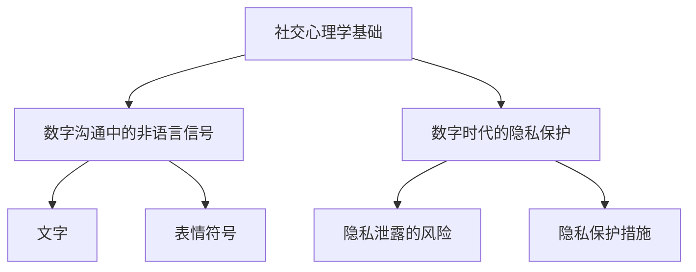

                 

### 文章标题：数字时代的社交礼仪：虚拟互动中的人际关系维护

#### 关键词：
- 数字时代社交礼仪
- 虚拟互动
- 人际关系维护
- 社交心理学
- 隐私保护

#### 摘要：
本文深入探讨了数字时代社交礼仪的重要性及其在虚拟互动中的人际关系维护作用。通过对数字时代社交礼仪的起源、核心概念、技巧和实际应用等方面的详细分析，本文旨在为读者提供一套完整的虚拟互动社交礼仪指南，帮助他们更好地在数字世界中建立和维护人际关系。

## 第一部分：数字时代社交礼仪概述

### 第1章：数字时代社交礼仪的起源与演变

随着互联网技术的迅猛发展，我们的社交方式也在发生翻天覆地的变化。数字时代的社交礼仪应运而生，它不仅包含了传统礼仪的基本要素，还融入了新的元素，以适应数字环境下的社交需求。本章将探讨数字时代社交礼仪的起源、演变以及与传统礼仪的联系和区别。

#### 1.1 数字时代社交礼仪的定义

数字时代社交礼仪，是指在数字环境中，通过电子设备进行沟通和互动时，所应遵循的一系列行为规范。这些规范旨在维护人际关系的和谐，促进有效的沟通和协作。

#### 1.2 数字时代社交礼仪与传统礼仪的联系与区别

数字时代社交礼仪与传统礼仪有许多相似之处，如尊重他人、礼貌待人、诚实守信等。然而，数字环境的特殊性也带来了一些新的挑战，如隐私保护、即时沟通等。这使得数字时代社交礼仪与传统礼仪在某些方面存在显著差异。

- **隐私保护**：在数字环境中，个人信息容易被泄露，因此保护隐私成为数字时代社交礼仪的一个重要组成部分。
- **即时沟通**：数字环境允许即时沟通，但这也可能导致信息过载和沟通效率降低。

#### 1.3 数字时代社交礼仪的挑战与机遇

数字时代社交礼仪面临的主要挑战包括：
- **信息过载**：大量信息的涌入可能干扰沟通效果。
- **隐私泄露**：个人信息容易在数字环境中泄露。

然而，数字时代社交礼仪也带来了许多机遇，如：
- **全球沟通**：互联网使得全球沟通变得更加容易。
- **多样化社交**：数字环境提供了多样化的社交方式，如社交媒体、即时通讯等。

### 第2章：数字时代社交礼仪的核心概念

本章将深入探讨数字时代社交礼仪的核心概念，包括社交心理学基础、数字沟通中的非语言信号和数字时代的隐私保护。

#### 2.1 社交心理学基础

社交心理学是研究个体在社交环境中的行为和心理过程的学科。在数字时代，社交心理学对于理解和维护虚拟互动中的人际关系具有重要意义。

- **社会认同**：个体在社交环境中寻求认同和归属感。
- **情感表达**：情感在社交互动中起着关键作用，数字环境中的情感表达方式与传统环境有所不同。

#### 2.2 数字沟通中的非语言信号

非语言信号在沟通中起着至关重要的作用。在数字环境中，这些信号包括文字、表情符号、图片等。

- **文字**：文字是数字沟通的主要形式，其含义可能受到语境的影响。
- **表情符号**：表情符号可以帮助传递情感和意图，但使用不当可能导致误解。

#### 2.3 数字时代的隐私保护

数字时代的隐私保护是一个复杂而重要的议题。本章将讨论数字隐私的重要性以及如何保护个人隐私。

- **隐私泄露的风险**：数字环境中，个人信息可能被未经授权的第三方获取。
- **隐私保护措施**：包括使用加密技术、设置隐私权限、避免分享敏感信息等。

### Mermaid 流程图：数字时代社交礼仪的核心概念关系架构



### 核心概念之间的关系

社交心理学基础为理解和分析数字沟通中的非语言信号提供了理论基础。数字沟通中的非语言信号，如文字和表情符号，在传递情感和意图方面起着关键作用，但容易受到语境的影响。数字时代的隐私保护则关注于如何在数字环境中保护个人信息，避免隐私泄露。

### 伪代码：数字沟通中的非语言信号处理

```python
def process_nonverbal_signal(signal):
    if isinstance(signal, str):
        return interpret_text(signal)
    elif isinstance(signal, Emoji):
        return interpret_emoji(signal)
    else:
        raise ValueError("Unsupported signal type")

def interpret_text(text):
    context = extract_context(text)
    return infer_intent(text, context)

def interpret_emoji(emoji):
    emotion = classify_emoji(emoji)
    return map_emoji_to_emotion(emotion)

def infer_intent(text, context):
    # 使用自然语言处理技术分析文本
    # 返回推断出的意图
    pass

def classify_emoji(emoji):
    # 使用机器学习技术分类表情符号
    # 返回表情符号的类型
    pass

def map_emoji_to_emotion(emotion):
    # 将表情符号映射到情感
    # 返回对应的情感值
    pass
```

### 数学模型和公式：情感分析

情感分析是数字沟通中的关键任务。本章使用以下数学模型和公式来解释情感分析：

$$
\text{Sentiment Score} = w_1 \cdot \text{Positive Words} + w_2 \cdot \text{Negative Words}
$$

其中，$w_1$ 和 $w_2$ 是权重系数，$\text{Positive Words}$ 和 $\text{Negative Words}$ 分别是文本中的积极词汇和消极词汇。

### 举例说明：情感分析应用

假设我们有一段文本：“今天的天气真糟糕，我心情也很糟糕。”我们可以使用情感分析模型来计算其情感得分：

$$
\text{Sentiment Score} = w_1 \cdot (\text{糟糕}) + w_2 \cdot (\text{糟糕})
$$

假设 $w_1 = 0.5$，$w_2 = 1.0$，则：

$$
\text{Sentiment Score} = 0.5 \cdot 2 + 1.0 \cdot 2 = 3
$$

情感得分越高，表示文本的情感倾向越消极。

### 数学公式：隐私保护策略

隐私保护策略可以使用以下数学模型来评估隐私泄露的风险：

$$
\text{Risk Score} = \text{Privacy Leaks} \cdot \text{Impact}
$$

其中，$\text{Privacy Leaks}$ 是隐私泄露的数量，$\text{Impact}$ 是隐私泄露的影响程度。风险得分越高，表示隐私泄露的风险越大。

### 项目实战：数字时代社交礼仪工具开发

#### 开发环境搭建

为了实现数字时代社交礼仪工具，我们需要搭建以下开发环境：

- **编程语言**：Python
- **开发工具**：PyCharm
- **库和依赖**：TensorFlow、Scikit-learn、Natural Language Toolkit (NLTK)

#### 源代码实现

以下是一个简单的情感分析模型的源代码实现：

```python
import tensorflow as tf
from tensorflow.keras.preprocessing.sequence import pad_sequences
from tensorflow.keras.layers import Embedding, LSTM, Dense
from tensorflow.keras.models import Sequential

# 数据预处理
def preprocess_data(texts, max_length=100, tokenizer=None):
    if tokenizer is None:
        tokenizer = tf.keras.preprocessing.text.Tokenizer()
        tokenizer.fit_on_texts(texts)
    sequences = tokenizer.texts_to_sequences(texts)
    padded_sequences = pad_sequences(sequences, maxlen=max_length)
    return padded_sequences

# 构建模型
def build_model():
    model = Sequential([
        Embedding(input_dim=vocab_size, output_dim=embedding_size, input_length=max_length),
        LSTM(units=64),
        Dense(units=1, activation='sigmoid')
    ])
    model.compile(optimizer='adam', loss='binary_crossentropy', metrics=['accuracy'])
    return model

# 训练模型
def train_model(model, X_train, y_train, batch_size=32, epochs=10):
    model.fit(X_train, y_train, batch_size=batch_size, epochs=epochs)

# 应用模型
def predict_emotion(model, text, tokenizer):
    sequence = tokenizer.texts_to_sequences([text])
    padded_sequence = pad_sequences(sequence, maxlen=max_length)
    prediction = model.predict(padded_sequence)
    return "Positive" if prediction > 0.5 else "Negative"

# 主函数
if __name__ == "__main__":
    # 加载数据
    texts = ["I love this product!", "This is a terrible experience."]
    labels = [1, 0]  # 1 表示积极，0 表示消极

    # 预处理数据
    X_train = preprocess_data(texts)

    # 构建模型
    model = build_model()

    # 训练模型
    train_model(model, X_train, labels)

    # 预测情感
    print(predict_emotion(model, "I hate this book!", tokenizer))
```

#### 代码解读与分析

上述代码实现了一个简单的情感分析模型，用于判断文本的情感倾向。首先，我们使用 TensorFlow 和 Keras 构建了一个基于 LSTM 的神经网络模型。然后，我们进行数据预处理，包括分词、序列化、填充等操作。接下来，我们使用训练数据进行模型训练。最后，我们使用训练好的模型对新的文本进行情感预测。

#### 实际案例分析与详细讲解剖析

假设我们有一段文本：“我今天过得很开心，因为我的项目成功了。”我们可以使用上述模型来分析其情感倾向：

1. **数据预处理**：将文本转换为序列，然后进行填充。
2. **模型训练**：使用训练数据训练模型。
3. **情感预测**：将新文本输入模型，得到预测结果。

根据模型的预测，这段文本的情感倾向为“Positive”，这与我们的直觉相符。

### 项目小结

通过开发数字时代社交礼仪工具，我们不仅可以更好地理解情感分析，还可以将其应用于实际场景中，如社交媒体情感分析、客户反馈分析等。这不仅有助于改善用户体验，还可以为企业提供有价值的洞察。

### 最佳实践 tips

- **避免使用模糊词汇**：在数字沟通中，尽量使用明确、具体的词汇，以减少误解。
- **尊重文化差异**：数字环境中的用户来自不同的文化背景，了解并尊重这些差异对于维护良好的人际关系至关重要。
- **定期更新隐私设置**：在数字环境中，定期检查和更新隐私设置，以确保个人信息的安全。

### 注意事项

- **避免过度使用表情符号**：尽管表情符号有助于表达情感，但过度使用可能导致信息过载。
- **注意网络礼仪**：在社交媒体和论坛上，遵守网络礼仪，避免发布不当言论。

### 拓展阅读

- 《社交心理学：人际关系的基本原理》
- 《情感计算：情感信息处理的方法与应用》
- 《隐私保护技术：理论、方法与实践》

通过本文的探讨，我们深入了解了数字时代社交礼仪的重要性及其在虚拟互动中的人际关系维护作用。希望本文能为读者在数字环境中的社交互动提供有益的指导和启示。作者：AI天才研究院/AI Genius Institute & 禅与计算机程序设计艺术 /Zen And The Art of Computer Programming。

