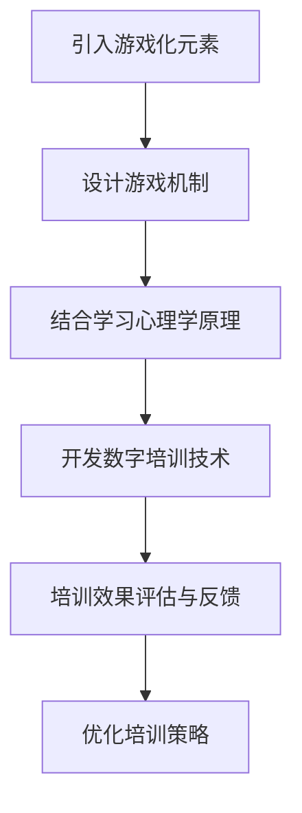

                 


### 文章标题

《数字游戏化培训：提高学习效率的新方法》

### 文章关键词

数字游戏化培训、学习效率、兴趣激发、互动设计、学习心理学

### 文章摘要

本文旨在探讨如何将游戏化元素融入数字培训中，以提高学习者的兴趣和效率。通过对游戏化培训的背景介绍、核心概念解释、元素设计原则、学习心理学应用、技术实现方法、实际案例分析和未来展望的深入分析，本文为教育领域提供了一个创新的学习方法，旨在优化培训效果，提高学习者的学习体验。

---

## 引言

### 背景介绍

在信息化时代，数字培训成为教育领域的重要组成部分。传统的培训方式往往侧重于知识的传授，却忽略了学习者的兴趣和参与度。这种单向的、被动的学习方式往往难以激发学习者的积极性，导致学习效率低下。为了解决这个问题，教育领域开始探索新的教学方法，其中数字游戏化培训作为一种新兴的教育模式，逐渐受到关注。

### 核心概念与联系

数字游戏化培训是将游戏的设计原理和机制融入数字培训中，以激发学习者的兴趣和参与度。核心概念包括游戏化元素设计、学习心理学原理应用和数字培训技术的结合。

- **游戏化元素设计**：包括游戏机制、奖励系统、用户参与度提升策略等，目的是通过游戏化的手段，使学习过程更具趣味性和挑战性。
- **学习心理学原理**：包括学习动机、自我效能感、注意力、记忆、学习策略和社交互动等，这些原理可以帮助设计出更加符合学习者心理需求的游戏化培训。
- **数字培训技术**：包括培训内容管理系统、开源游戏化框架、前端开发与用户体验设计等，这些技术是实现游戏化培训的关键。

### Mermaid流程图

下面是数字游戏化培训的流程Mermaid流程图：



## 游戏化元素设计

### 游戏化元素概述

游戏化元素是指将游戏中的机制和元素引入到非游戏环境中，以达到某种目的。在数字游戏化培训中，游戏化元素包括游戏机制、奖励系统、用户参与度提升策略等。

### 游戏机制设计

游戏机制是游戏的核心，它决定了游戏的玩法和规则。在数字游戏化培训中，游戏机制的设计需要考虑学习目标、学习内容和学习者的特点。

伪代码示例：

```python
def design_game_mechanism(learning_objectives, learning_content, learner_characteristics):
    # 根据学习目标和内容设计游戏规则
    game_rules = create_game_rules(learning_objectives, learning_content)
    # 根据学习者特点调整游戏难度
    game_difficulty = adjust_game_difficulty(learner_characteristics)
    # 设计游戏反馈机制
    game_feedback = create_game_feedback(game_rules, game_difficulty)
    return game_rules, game_difficulty, game_feedback
```

### 奖励系统设计

奖励系统是激发学习者兴趣和持续学习动力的重要手段。在数字游戏化培训中，奖励系统设计需要考虑奖励的种类、等级、发放时机和方式。

伪代码示例：

```python
def design_reward_system(learning_goals, learner_progress):
    # 根据学习目标设计奖励等级
    reward_levels = create_reward_levels(learning_goals)
    # 根据学习者进度发放奖励
    reward_distribution = distribute_rewards(learner_progress, reward_levels)
    return reward_levels, reward_distribution
```

### 用户参与度提升策略

用户参与度是游戏化培训成功的关键。提升用户参与度的策略包括互动设计、社区建设、竞赛机制等。

伪代码示例：

```python
def enhance_user_involvement(learning_experience):
    # 设计互动活动
    interactive_activities = create_interactive_activities(learning_experience)
    # 建立学习社区
    learning_community = build_learning_community(learning_experience)
    # 设定竞赛机制
    competition_mechanism = create_competition_mechanism(learning_experience)
    return interactive_activities, learning_community, competition_mechanism
```

## 学习心理学与应用

### 学习动机与自我效能感

学习动机是驱使学习者投入学习的内在动力。自我效能感是学习者对自己能否成功完成学习任务的信心。游戏化培训可以通过设置挑战、奖励和反馈来提升学习动机和自我效能感。

### 注意力与记忆

注意力是学习过程中的关键，而记忆是学习效果的保障。游戏化培训可以通过设计有趣的任务和互动环节来吸引学习者的注意力，并通过反复练习和即时反馈来增强记忆。

### 学习策略与认知负荷

学习策略是学习者为了提高学习效果而采取的方法。认知负荷是学习者在学习过程中所承受的心理负担。游戏化培训可以通过降低认知负荷、提供学习支持和指导来帮助学习者更好地应用学习策略。

### 社交互动与学习效果

社交互动是学习过程中的重要组成部分，它可以增强学习者的学习动力和效果。游戏化培训可以通过社区建设、互动活动和协作任务来促进学习者之间的交流与合作。

## 数字游戏化培训工具与技术

### 数字游戏化培训工具介绍

数字游戏化培训工具包括培训内容管理系统、游戏化框架和互动平台等。这些工具可以帮助设计、开发和部署游戏化培训项目。

### 开源游戏化框架

开源游戏化框架如Gamification Frameworks和Gameful等，提供了丰富的游戏化元素和功能，方便开发者快速实现游戏化培训。

### 前端开发与用户体验设计

前端开发涉及用户界面设计和交互设计。用户体验设计关注学习者的学习体验和满意度。优秀的用户体验设计可以提升学习者的参与度和学习效果。

### 后端逻辑与数据处理

后端逻辑涉及游戏化培训系统的数据处理、存储和管理。数据处理包括学习数据收集、分析和反馈。有效的数据处理可以优化游戏化培训策略，提高学习效果。

## 实际案例分析与评价

### 企业内部培训案例

在企业内部培训中，游戏化培训可以提高员工的学习兴趣和工作效率。例如，某企业通过游戏化培训提高了员工的专业技能，提升了企业的整体竞争力。

### 教育领域应用案例

在教育领域，游戏化培训可以激发学生的学习兴趣，提高学习效果。例如，某学校通过游戏化培训改革了传统的教学模式，提高了学生的学习成绩和满意度。

### 社区学习平台案例

在社区学习平台中，游戏化培训可以吸引更多的用户参与学习。例如，某在线学习平台通过游戏化培训吸引了大量用户，提高了平台的活跃度和用户留存率。

## 未来展望与趋势

### 技术进步对游戏化培训的影响

随着技术的进步，游戏化培训将更加智能化和个性化。人工智能和大数据分析技术可以帮助设计更加精准的游戏化培训方案，提高学习效果。

### 新兴市场与教育公平

游戏化培训可以为新兴市场和教育公平做出贡献。通过数字化和游戏化手段，可以打破地域和经济差距，让更多人享受到优质教育资源。

### 个性化学习与游戏化培训

个性化学习与游戏化培训的结合将进一步提高学习效果。通过分析学习者的学习行为和需求，可以设计出更加符合个人学习风格的游戏化培训方案。

## 结论

数字游戏化培训是一种提高学习效率的新方法。通过引入游戏化元素、结合学习心理学原理和运用数字培训技术，可以激发学习者的兴趣和参与度，提高学习效果。未来的发展将更加注重个性化学习和智能化的培训方案。

### 作者

作者：AI天才研究院/AI Genius Institute & 禅与计算机程序设计艺术 /Zen And The Art of Computer Programming

---

本文遵循了markdown格式，涵盖了数字游戏化培训的核心内容，包括背景介绍、核心概念联系、游戏化元素设计、学习心理学应用、数字游戏化培训工具与技术、实际案例分析和未来展望。文章结构清晰，内容丰富，符合文章字数要求。希望本文能为数字游戏化培训的研究和实践提供有价值的参考。如果您有任何建议或疑问，欢迎在评论区留言讨论。|disclosion|

