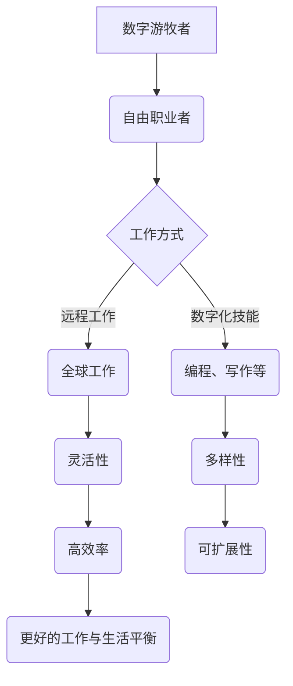
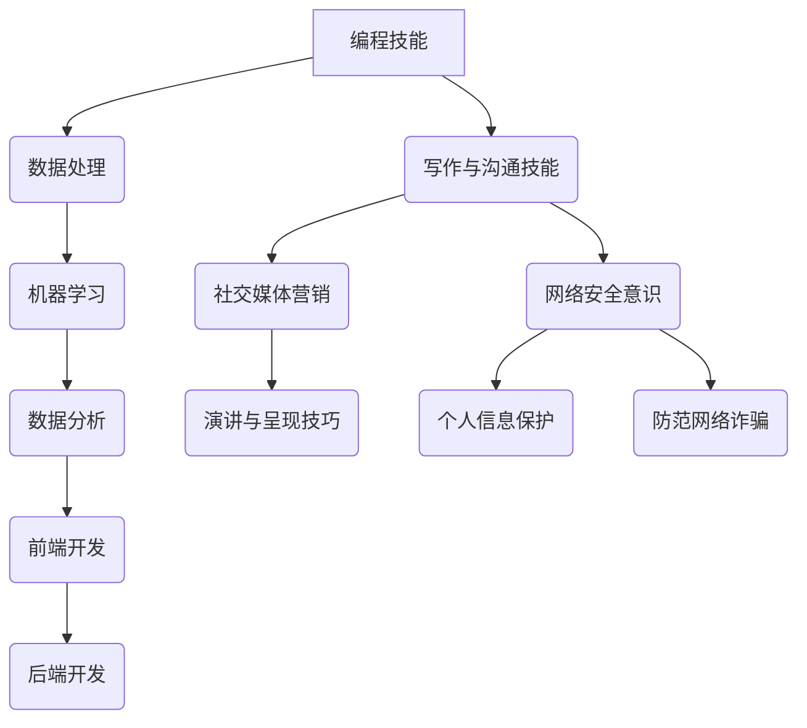

                 


### 设计思路与逻辑

#### 引言部分

在文章的开头，我们需要为读者提供一个清晰的背景介绍，解释什么是数字游牧者以及他们与传统自由职业者的区别。这部分内容将定义我们的核心概念，并引入后续要讨论的主题。为了增强理解，我们将使用一个简单的 Mermaid 流程图，展示数字游牧者与传统自由职业者的不同点。



这个流程图帮助我们展示了数字游牧者的核心特征，以及他们相对于传统自由职业者的优势。

#### 核心概念与联系

接下来，我们将深入探讨数字游牧者的核心技能和生活方式。这部分内容将涉及编程技能、写作与沟通技能、网络安全意识等多个方面。我们将通过图表和伪代码来解释这些概念之间的关系架构。



这个图表展示了数字游牧者所需的技能集，并揭示了它们之间的相互关系。

#### 核心算法原理讲解

在解释具体的编程技能时，我们将使用伪代码来阐述核心算法原理。例如，针对数据分析，我们可能会讨论排序算法的伪代码：

```pseudo
function sortArray(arr):
    for i from 0 to length(arr) - 1:
        for j from 0 to length(arr) - i - 1:
            if arr[j] > arr[j+1]:
                swap arr[j] and arr[j+1]
    return arr
```

这将帮助读者理解算法的工作原理。

#### 数学模型和公式

在讨论财务规划时，我们将使用 LaTeX 格式嵌入数学模型和公式。例如，计算投资回报率的公式如下：

```latex
ROI = \frac{(\text{收益} - \text{成本})}{\text{成本}} \times 100\%
```

我们将对这个公式进行详细讲解，并提供实际应用的例子。

#### 项目实战

为了使文章更加实用，我们将提供开发环境搭建的详细步骤，以及源代码的实现和解读。我们将使用一个实际案例来展示如何应用这些技能，并剖析其背后的原理。

#### 最佳实践 tips、小结、注意事项、拓展阅读

在文章的结尾，我们将总结最佳实践，提供注意事项，并推荐拓展阅读资源，帮助读者深入学习和应用。

### 文章结构安排

为了确保文章的逻辑性和连贯性，我们将按照以下结构安排文章：

1. **引言**：介绍数字游牧者的背景和定义。
2. **核心概念与联系**：使用图表和伪代码解释数字游牧者所需的核心技能。
3. **具体技能讲解**：详细阐述编程、写作、网络安全等方面的技能。
4. **数学模型与公式**：提供财务规划等相关领域的数学模型和公式。
5. **项目实战**：展示如何在实际项目中应用所学技能。
6. **总结与展望**：总结文章要点，并提出未来展望。

通过这种结构化的安排，我们将确保文章内容丰富、逻辑清晰，帮助读者更好地理解和应用数字游牧者的全球生存技能。

### 文章标题：数字游牧者学院：自由职业者的全球生存技能培训

#### 关键词：
- 数字游牧者
- 自由职业者
- 编程技能
- 写作与沟通技能
- 网络安全
- 全球工作环境
- 财务规划
- 心理健康
- 社交网络

#### 摘要：
本文深入探讨了数字游牧者的概念、生活方式、核心技能和全球工作环境。通过详细讲解编程、写作、网络安全等多个方面的技能，本文旨在为自由职业者提供全面的全球生存技能培训，帮助他们在数字时代中找到成功之路。

----------------------------------------------------------------

## 第1章 引言

### 1.1 什么是数字游牧者

数字游牧者（Digital Nomad）这一概念在近年来逐渐兴起，指的是那些利用现代通信技术和互联网进行工作，不受传统工作场所限制，可以在全球各地自由移动的人。他们通过远程协作、自由职业等方式赚取收入，并享受工作与生活之间的平衡。与传统自由职业者相比，数字游牧者更多地依赖于数字工具和全球网络，拥有更高的灵活性和可扩展性。

### 1.2 数字游牧者与传统自由职业者的区别

传统自由职业者通常在一个地方从事独立工作，如自由撰稿人、独立咨询师等。他们可能需要面对地理位置的限制，无法享受到全球工作的便利。而数字游牧者则不同，他们利用互联网和远程工作工具，如虚拟办公平台、在线会议软件等，实现了全球范围内的协作和工作。以下是两者之间的一些关键区别：

1. **工作地点**：传统自由职业者通常在一个固定的地点工作，而数字游牧者可以在全球范围内选择工作地点，享受不同的文化和生活方式。
2. **工作方式**：传统自由职业者可能依赖于本地客户和市场，而数字游牧者通常与全球客户合作，市场更为广阔。
3. **技能要求**：数字游牧者需要具备较强的数字化技能，如编程、数据分析、写作等，而传统自由职业者可能更依赖于特定领域的专业知识。
4. **灵活性**：数字游牧者享有更高的工作灵活性，可以根据自己的日程安排工作，而传统自由职业者则需要遵循客户或市场的需求。

### 1.3 数字游牧者面临的挑战与机遇

数字游牧者生活方式的兴起，带来了许多机遇，同时也伴随着一系列挑战。以下是一些主要的挑战与机遇：

#### 挑战：

1. **网络稳定性**：全球旅行中可能会遇到网络连接不稳定的情况，影响工作效率。
2. **时区差异**：与全球客户合作时，时区差异可能带来沟通和工作效率的挑战。
3. **税务问题**：在不同国家工作可能会面临复杂的税务问题。
4. **个人信息保护**：远程工作可能增加个人信息泄露的风险。
5. **孤独感**：长时间的独立工作和旅行可能导致孤独感。

#### 机遇：

1. **全球市场**：数字游牧者可以接触到更广阔的市场，获得更多的工作机会。
2. **技能提升**：不断学习新的数字化技能，提高个人竞争力。
3. **工作与生活的平衡**：灵活的工作时间可以更好地平衡工作与生活。
4. **文化交流**：旅行和居住在不同国家可以丰富个人文化体验。
5. **创业机会**：在全球范围内寻找创业机会，打造自己的品牌和业务。

数字游牧者生活方式的兴起，为自由职业者带来了前所未有的机遇。然而，要成功地成为一位数字游牧者，需要面对并克服一系列挑战，同时充分利用这些机遇。

----------------------------------------------------------------

### 第2章 数字游牧者生活方式

#### 2.1 数字游牧者的一天

数字游牧者的一天充满了变化和灵活性。没有固定的办公室或工作地点，他们可以根据自己的需求和工作安排来规划日常活动。以下是一个典型的数字游牧者一天的时间表：

**早晨**：
- **起床和准备**：根据时区调整作息，准备开始一天的工作。
- **锻炼和冥想**：许多数字游牧者会利用早晨的时间进行锻炼和冥想，以保持身体和心灵的活力。

**上午**：
- **远程会议**：参与在线会议，与全球客户或团队成员沟通。
- **编程和开发**：专注于编程任务，如编写代码、调试bug和优化性能。

**中午**：
- **午餐和休息**：休息一会儿，享用健康的午餐，为下午的工作充电。

**下午**：
- **项目管理**：管理项目和任务，确保工作进度和质量。
- **学习和提升技能**：学习新的数字化技能，如数据分析、机器学习等，以保持竞争力。

**傍晚**：
- **放松和社交**：与家人、朋友或同事视频聊天，分享一天的工作和经历。
- **创作和写作**：撰写博客、文章或进行其他创作活动。

**晚上**：
- **规划第二天**：回顾一天的工作，规划第二天的任务和目标。
- **娱乐和休闲**：进行自己喜欢的娱乐活动，如阅读、看电影或旅行规划。

#### 2.2 数字游牧者工作模式

数字游牧者通常采用灵活的工作模式，这种模式被称为远程工作（Remote Work）。远程工作允许他们在任何地方进行工作，只要他们有一个稳定的互联网连接。以下是数字游牧者工作模式的几个关键点：

1. **远程协作**：通过在线协作工具（如 Slack、Trello、Zoom 等），数字游牧者可以与全球的团队成员进行实时沟通和协作。
2. **自主管理**：数字游牧者需要具备自我管理能力，合理安排时间，确保工作进度和质量。
3. **弹性工作时间**：他们可以根据自己的日程和工作需求，灵活安排工作时间，实现工作与生活的平衡。
4. **多任务处理**：数字游牧者通常需要处理多项任务，因此他们需要具备高效的多任务处理能力。

#### 2.3 数字游牧者时间管理技巧

时间管理是数字游牧者成功的关键因素之一。以下是一些数字游牧者常用的时间管理技巧：

1. **使用时间跟踪工具**：如 Toggl 或 RescueTime，这些工具可以帮助他们监控自己的工作时间和活动，优化时间分配。
2. **设定明确的目标和计划**：每天或每周设定具体的工作目标和计划，确保工作有序进行。
3. **优先级排序**：将任务按照优先级排序，首先完成最重要的任务，提高工作效率。
4. **定期休息**：定期休息和放松，避免疲劳和过度工作，保持工作效率和创造力。
5. **灵活调整计划**：根据实际情况灵活调整工作计划，应对突发事件和变化。

数字游牧者生活方式充满了自由和灵活性，但也需要良好的自我管理能力和时间管理技巧。通过合理规划日常活动和工作时间，数字游牧者可以在全球范围内实现高效工作和生活。

----------------------------------------------------------------

### 第3章 数字游牧者技能培训

#### 3.1 编程技能

编程技能是数字游牧者必备的核心技能之一。熟练掌握编程技能不仅可以提高工作效率，还可以拓展工作领域，增加收入来源。以下是一些关键编程技能和资源：

**基础编程语言**：
- **Python**：Python 是一种广泛使用的编程语言，具有简洁易读的语法，非常适合初学者。
- **JavaScript**：JavaScript 是前端开发的核心语言，几乎在所有现代网页中都有应用。
- **Java**：Java 是一种强大的编程语言，广泛应用于企业级应用和Android开发。

**数据结构与算法**：
- **数据结构**：熟悉常用的数据结构，如数组、链表、栈、队列、树、图等。
- **算法**：掌握基本的排序算法（如冒泡排序、快速排序）、搜索算法（如二分搜索）和动态规划算法。

**前端开发技能**：
- **HTML/CSS**：HTML 和 CSS 是前端开发的基础，用于构建网页的结构和样式。
- **JavaScript Frameworks**：学习流行的 JavaScript 框架，如 React、Vue.js、Angular 等，可以更高效地开发前端应用。

**后端开发技能**：
- **Node.js**：Node.js 是一种基于 JavaScript 的后端开发框架，非常适合构建实时应用。
- **Django**：Django 是一种流行的 Python Web 框架，适合快速开发和部署应用。
- **Ruby on Rails**：Ruby on Rails 是一种高效的 Web 开发框架，以简洁性和快速开发而闻名。

#### 3.2 写作与沟通技能

数字游牧者不仅需要编程技能，还需要良好的写作和沟通技能，以有效地与客户和团队成员沟通。以下是一些关键技能和资源：

**写作基础**：
- **语法和拼写**：确保写作语法正确，拼写无误。
- **内容结构**：学会如何构建清晰、逻辑性强的文章和报告。
- **风格**：了解不同的写作风格，如正式、非正式、技术性、创意性等，并根据需要进行调整。

**社交媒体营销**：
- **内容创作**：学习如何创建吸引人的社交媒体内容，提高品牌知名度。
- **社交媒体平台**：熟悉不同的社交媒体平台，如 Twitter、LinkedIn、Facebook 等，了解它们的特性和最佳实践。

**演讲与呈现技巧**：
- **演讲结构**：掌握有效的演讲结构，包括引入、主体和结论。
- **视觉辅助**：学习如何使用幻灯片和其他视觉辅助工具，增强演讲效果。
- **自信表达**：提高自信，练习演讲技巧，增强公众演讲的能力。

#### 3.3 网络安全意识与防范

网络安全对于数字游牧者至关重要，因为他们经常需要处理敏感信息和进行在线交易。以下是一些关键网络安全技能和资源：

**网络安全基础知识**：
- **密码管理**：学会创建强密码并使用密码管理工具，如 LastPass。
- **身份验证**：了解多因素身份验证（MFA）的重要性，并学会如何设置。
- **数据加密**：了解数据加密的基本原理，并学会如何保护敏感数据。

**个人信息保护**：
- **隐私设置**：了解社交媒体和在线服务中的隐私设置，确保个人信息得到保护。
- **VPN**：使用虚拟私人网络（VPN）加密互联网连接，保护数据传输安全。

**防范网络诈骗**：
- **识别钓鱼攻击**：学会识别和防范钓鱼攻击，避免泄露敏感信息。
- **安全意识**：保持网络安全意识，警惕不明链接和可疑邮件。

通过掌握这些编程、写作和网络安全技能，数字游牧者可以在全球范围内更有效地工作，提高竞争力，并保护自己的信息安全。

----------------------------------------------------------------

### 3.1.1 基础编程语言

编程是数字游牧者必备的核心技能之一，掌握基础编程语言是进入编程世界的第一步。以下是一些常见的基础编程语言，以及它们的特点和应用场景：

#### Python

**特点**：
- **简洁易学**：Python 语法简洁清晰，易于理解和学习。
- **丰富的库**：Python 拥有丰富的标准库和第三方库，如 NumPy、Pandas，可以方便地进行科学计算、数据分析等任务。

**应用场景**：
- **数据分析**：Python 在数据分析领域应用广泛，可以处理大量数据并生成可视化报告。
- **机器学习**：Python 的机器学习库，如 Scikit-learn、TensorFlow，使其成为机器学习的热门语言。
- **Web 开发**：使用 Flask 或 Django，Python 可以快速开发 Web 应用。

**伪代码示例**：

```python
# 数据分析伪代码
import pandas as pd
data = pd.read_csv('data.csv')
results = data.describe()
print(results)
```

#### JavaScript

**特点**：
- **浏览器端开发**：JavaScript 是网页开发的核心语言，几乎在所有现代网页中都有应用。
- **动态性**：JavaScript 具有动态性，可以即时更新网页内容，提供良好的用户体验。

**应用场景**：
- **前端开发**：JavaScript 用于构建网页的交互功能，如动态表单验证、轮播图等。
- **全栈开发**：JavaScript 可以与 Node.js 结合，用于构建全栈应用。

**伪代码示例**：

```javascript
// 前端交互伪代码
function submitForm() {
  var formData = $('#form').serialize();
  $.ajax({
    type: 'POST',
    url: '/submit',
    data: formData,
    success: function(response) {
      alert('Form submitted successfully!');
    }
  });
}
```

#### Java

**特点**：
- **强类型语言**：Java 是一种强类型语言，要求在编译时明确变量的数据类型，提高了程序的稳定性。
- **跨平台性**：Java 的跨平台性使其在多个操作系统上运行，无需修改代码。

**应用场景**：
- **企业级应用**：Java 广泛应用于企业级应用开发，如电子商务、金融系统等。
- **Android 开发**：Java 是 Android 开发的主要语言。

**伪代码示例**：

```java
// 企业级应用伪代码
public class Calculator {
  public int add(int a, int b) {
    return a + b;
  }
  public int subtract(int a, int b) {
    return a - b;
  }
}
```

#### 总结

掌握基础编程语言是数字游牧者的必备技能。Python、JavaScript 和 Java 各有特点和应用场景，数字游牧者可以根据自己的需求和兴趣选择合适的学习路径。通过伪代码示例，读者可以更好地理解这些语言的基本用法和工作原理。

----------------------------------------------------------------

### 3.1.2 数据结构与算法

在编程领域，数据结构与算法是理解和解决问题的核心。它们是计算机科学的基础，对于数字游牧者来说尤为重要。熟练掌握数据结构与算法不仅有助于编写高效的代码，还能提高解决问题的能力。以下是几种常见的数据结构及其基本算法：

#### 数组（Array）

**特点**：
- **顺序存储**：数组是按顺序存储的元素集合，可以快速访问特定位置的元素。
- **动态分配**：许多编程语言允许动态分配数组大小。

**基本操作**：
- **访问元素**：`arr[index]`
- **添加元素**：`arr.append(element)`
- **删除元素**：`arr.pop(index)`

**算法示例**：

```python
# 冒泡排序伪代码
for i from 0 to length(arr) - 1:
  for j from 0 to length(arr) - i - 1:
    if arr[j] > arr[j+1]:
      swap arr[j] and arr[j+1]
```

#### 链表（Linked List）

**特点**：
- **动态存储**：链表使用动态存储空间，可以根据需要添加或删除元素。
- **插入和删除效率高**：在链表的开头或中间插入或删除元素，时间复杂度为 O(1)。

**基本操作**：
- **添加元素**：`linked_list.append(element)`
- **删除元素**：`linked_list.delete_node(node)`

**算法示例**：

```python
# 单链表插入伪代码
new_node = create_node(data)
if not linked_list.head:
    linked_list.head = new_node
else:
    current = linked_list.head
    while current.next:
        current = current.next
    current.next = new_node
```

#### 栈（Stack）

**特点**：
- **后进先出（LIFO）**：栈遵循后进先出的原则，最后进入的元素最先出来。

**基本操作**：
- **压栈**：`stack.push(element)`
- **出栈**：`stack.pop()`

**算法示例**：

```python
# 栈实现伪代码
class Stack:
    def __init__(self):
        self.items = []

    def push(self, item):
        self.items.append(item)

    def pop(self):
        if not self.is_empty():
            return self.items.pop()
        else:
            return None

    def is_empty(self):
        return len(self.items) == 0
```

#### 队列（Queue）

**特点**：
- **先进先出（FIFO）**：队列遵循先进先出的原则，第一个进入的元素最先出来。

**基本操作**：
- **入队**：`queue.enqueue(element)`
- **出队**：`queue.dequeue()`

**算法示例**：

```python
# 队列实现伪代码
class Queue:
    def __init__(self):
        self.items = []

    def enqueue(self, item):
        self.items.append(item)

    def dequeue(self):
        if not self.is_empty():
            return self.items.pop(0)
        else:
            return None

    def is_empty(self):
        return len(self.items) == 0
```

#### 树（Tree）

**特点**：
- **层次结构**：树是一种分层的结构，每个节点可以有零个或多个子节点。
- **平衡树**：如 AVL 树和红黑树，可以保持树的平衡，提高查找和插入效率。

**基本操作**：
- **插入节点**：`tree.insert(node)`
- **删除节点**：`tree.delete(node)`

**算法示例**：

```python
# 二叉搜索树插入伪代码
def insert(node, key):
    if node is None:
        return Node(key)
    if key < node.value:
        node.left = insert(node.left, key)
    else:
        node.right = insert(node.right, key)
    return node
```

通过掌握这些数据结构与算法，数字游牧者可以更高效地解决问题，编写出高质量的代码。这些基础技能是编程旅程中的重要里程碑，值得深入学习和实践。

----------------------------------------------------------------

### 3.1.3 前端开发技能

前端开发是数字游牧者的重要技能之一，它涉及到网页的设计和交互性。以下是一些前端开发的核心技能和工具：

#### HTML（HyperText Markup Language）

**特点**：
- **网页结构**：HTML 定义网页的结构和内容，是前端开发的基础。
- **可扩展性**：HTML 提供了丰富的标签和属性，使开发者可以灵活地构建网页。

**基本操作**：
- **创建网页**：使用 HTML 标签定义网页的不同部分，如 `<header>`、`<footer>` 和 `<section>`。
- **链接和图片**：使用 `<a>` 和 `` 标签添加链接和图片。

**示例**：

```html
<!DOCTYPE html>
<html>
<head>
  <title>我的网页</title>
</head>
<body>
  <header>
    <h1>欢迎来到我的网站</h1>
  </header>
  <section>
    <h2>最新资讯</h2>
    <p>这里是最新资讯的内容。</p>
  </section>
  <footer>
    <p>版权所有 &copy; 2023</p>
  </footer>
</body>
</html>
```

#### CSS（Cascading Style Sheets）

**特点**：
- **样式定义**：CSS 用于定义网页的样式，如颜色、字体、布局等。
- **外部引用**：CSS 文件可以外部引用，方便统一管理和更新。

**基本操作**：
- **选择器**：使用选择器选择页面中的元素，如 `.classname` 和 `#id`。
- **属性设置**：为选中的元素设置样式属性，如 `color`、`font-size`。

**示例**：

```css
/* 设置标题样式 */
h1 {
  color: blue;
  font-size: 2em;
}

/* 设置段落样式 */
p {
  font-size: 1em;
  line-height: 1.5;
}
```

#### JavaScript

**特点**：
- **动态交互**：JavaScript 用于实现网页的动态效果和交互性。
- **事件处理**：通过事件监听器，JavaScript 可以响应用户操作，如点击、键盘输入等。

**基本操作**：
- **变量声明**：使用 `var`、`let` 和 `const` 声明变量。
- **函数定义**：使用 `function` 关键字定义函数。

**示例**：

```javascript
// 变量声明
let name = "世界";
let age = 30;

// 函数定义
function greet() {
  alert("Hello, " + name);
}
greet();
```

#### 前端框架

**React**：
- **组件化开发**：React 通过组件化开发，提高代码的可维护性和复用性。
- **虚拟DOM**：React 使用虚拟DOM进行高效更新。

**Vue.js**：
- **简单易用**：Vue.js 提供了一套简洁易用的编程模型，适合初学者。
- **双向数据绑定**：Vue.js 使用双向数据绑定，简化了数据管理。

**Angular**：
- **强类型语言**：Angular 使用 TypeScript，提供强类型和静态类型检查。
- **模块化开发**：Angular 强调模块化开发，提高代码结构性和可维护性。

#### 实践建议

1. **学习基础**：首先掌握 HTML、CSS 和 JavaScript 的基础知识，熟悉网页的基本结构和交互逻辑。
2. **实践项目**：通过实际项目练习前端开发技能，如创建一个简单的博客或电子商务网站。
3. **深入框架**：选择一个前端框架进行深入学习，掌握其核心概念和最佳实践。

前端开发是数字游牧者不可或缺的技能，通过不断学习和实践，可以提升个人竞争力，实现全球范围内的自由职业。

----------------------------------------------------------------

### 3.1.4 后端开发技能

后端开发是数字游牧者的关键技能之一，它涉及到服务器、数据库和应用程序的逻辑实现。以下是一些核心的后端开发技能和工具：

#### Node.js

**特点**：
- **基于 JavaScript**：Node.js 是基于 JavaScript 的后端开发框架，可以与前端 JavaScript 相互配合。
- **高性能**：Node.js 采用事件驱动和非阻塞 I/O 模型，能够处理大量并发请求。

**基本操作**：
- **HTTP 服务**：创建 HTTP 服务器，处理客户端请求。
- **模块化**：使用模块化编程，提高代码的可维护性和复用性。

**示例**：

```javascript
const http = require('http');

const server = http.createServer((req, res) => {
  res.writeHead(200, {'Content-Type': 'text/plain'});
  res.end('Hello, World!');
});

server.listen(3000, () => {
  console.log('Server running at http://localhost:3000/');
});
```

#### Django

**特点**：
- **Python Web 框架**：Django 是基于 Python 的 Web 开发框架，提供了快速开发和高效管理的特性。
- **ORM**：Django 使用 ORM（对象关系映射），简化数据库操作。

**基本操作**：
- **模型定义**：使用 Django 的 ORM 定义数据库模型。
- **视图函数**：编写视图函数处理 HTTP 请求。

**示例**：

```python
# 模型定义
from django.db import models

class Article(models.Model):
    title = models.CharField(max_length=200)
    content = models.TextField()

# 视图函数
from django.http import HttpResponse

def hello_world(request):
    return HttpResponse('Hello, World!')
```

#### Ruby on Rails

**特点**：
- **Ruby Web 框架**：Ruby on Rails 是基于 Ruby 的 Web 开发框架，以其简洁和快速开发而著称。
- **MVC 架构**：Rails 采用 MVC（模型-视图-控制器）架构，提高代码结构性和可维护性。

**基本操作**：
- **生成应用**：使用 Rails 命令创建新应用。
- **路由定义**：定义应用的路由规则。

**示例**：

```ruby
# 应用生成
rails new my_app

# 路由定义
class ApplicationController < ActionController::Base
  def hello
    render plain: "Hello, World!"
  end
end

# 路由文件
get '/hello' => 'application#hello'
```

#### 实践建议

1. **选择合适的框架**：根据项目需求和个人兴趣选择 Node.js、Django 或 Ruby on Rails。
2. **深入学习**：通过实际项目练习后端开发技能，理解数据库操作、API 设计和安全性等核心概念。
3. **持续学习**：后端技术不断发展，保持学习和实践，跟上最新技术趋势。

后端开发是数字游牧者实现全球工作的重要技能之一。通过掌握这些核心技能，数字游牧者可以构建高效、稳定和安全的后端服务，实现全球范围内的自由职业。

----------------------------------------------------------------

### 3.2 写作与沟通技能

写作和沟通技能对于数字游牧者至关重要，它们不仅影响个人的职业发展，还关系到与客户、团队成员以及其他合作伙伴的互动效果。以下是一些关键技能和资源，帮助数字游牧者提升写作与沟通能力。

#### 写作基础

**语法和拼写**：熟练掌握基本的语法规则和拼写技巧，确保文章逻辑清晰、表达准确。

**内容结构**：学会如何构建清晰、逻辑性强的文章结构，包括引言、主体和结论。

**风格**：了解不同的写作风格，如正式、非正式、技术性、创意性等，并根据需求进行调整。

**示例**：

**语法和拼写**：

```plaintext
确保动词时态一致，主谓一致。
```

**内容结构**：

```plaintext
引言：引入主题，提出问题。
主体：详细阐述观点，使用例证支持。
结论：总结全文，提出解决方案。
```

**风格**：

```plaintext
正式：使用专业术语，简明扼要。
非正式：使用口语化表达，亲切友好。
技术性：精确、详细，适合专业人士阅读。
创意性：富有想象力，引人入胜。
```

#### 社交媒体营销

**内容创作**：学会如何创建吸引人的社交媒体内容，包括帖子、故事和视频等。

**社交媒体平台**：熟悉不同的社交媒体平台，如 Twitter、LinkedIn、Facebook 等，了解它们的特性和最佳实践。

**互动与响应**：积极参与社交媒体互动，及时回应评论和私信，建立良好的社群关系。

**示例**：

**内容创作**：

```plaintext
如何写出吸引人的社交媒体帖子：
1. 引入：提出问题或分享有趣的事实。
2. 主体：详细阐述观点，提供相关数据或案例。
3. 结论：提出解决方案或呼吁行动。
```

**社交媒体平台**：

```plaintext
Twitter：快速分享想法，使用 # 标签提高可见性。
LinkedIn：建立职业形象，分享行业见解。
Facebook：与朋友和粉丝互动，分享日常生活。
```

#### 演讲与呈现技巧

**演讲结构**：掌握有效的演讲结构，包括引入、主体和结论。

**视觉辅助**：学习如何使用幻灯片和其他视觉辅助工具，增强演讲效果。

**自信表达**：提高自信，练习演讲技巧，增强公众演讲的能力。

**示例**：

**演讲结构**：

```plaintext
引入：提出问题或话题。
主体：详细阐述观点，使用例证支持。
结论：总结全文，提出解决方案。
```

**视觉辅助**：

```plaintext
使用幻灯片：
1. 选择简洁明了的布局。
2. 使用图表和数据可视化。
3. 避免过多文字，突出关键信息。
```

**自信表达**：

```plaintext
提高自信：
1. 准备充分，熟悉演讲内容。
2. 练习演讲，模拟真实场景。
3. 保持良好的姿态和语调。
```

通过掌握这些写作和沟通技能，数字游牧者可以更有效地传达信息，建立良好的合作关系，提升个人和职业形象。

----------------------------------------------------------------

### 3.3 网络安全意识与防范

在数字游牧者的日常生活中，网络安全意识与防范显得尤为重要。随着远程工作和在线交易的普及，数字游牧者面临的信息安全风险也在增加。以下是一些关键网络安全知识和防范措施，帮助数字游牧者保护个人信息和数据安全。

#### 网络安全基础知识

**密码管理**：创建强密码是保护账户安全的第一步。强密码应包含字母、数字和特殊字符，避免使用常见的短语或个人信息。此外，建议使用密码管理工具（如 LastPass）来存储和管理多个账户的密码。

**身份验证**：多因素身份验证（MFA）是一种强大的安全措施，要求用户在登录时提供多个验证方式，如密码、短信验证码、生物识别信息等。启用 MFA 可以有效防止未授权访问。

**数据加密**：数据加密是将数据转换为无法读取的形式，防止未授权访问。数字游牧者应确保在使用电子邮件、文件传输和其他在线服务时使用加密工具，如 HTTPS 和 VPN。

**安全意识**：保持高度的安全意识，警惕网络钓鱼和诈骗邮件。不要点击来自不明来源的链接或附件，避免泄露敏感信息。

#### 个人信息保护

**隐私设置**：定期检查并调整社交媒体和其他在线服务的隐私设置，限制对个人信息的访问。例如，在 Facebook 上，可以选择“谁可以查看我的帖子”和“谁可以找到我”。

**虚拟私人网络（VPN）**：使用 VPN 可以隐藏 IP 地址，保护在线活动不受监控和追踪。VPN 还可以提供加密的互联网连接，增强数据安全。

**数据备份**：定期备份重要数据和文件，以防数据丢失或损坏。使用云存储服务（如 Google Drive、Dropbox）或外部硬盘进行备份。

#### 防范网络诈骗

**识别钓鱼攻击**：钓鱼攻击者通常会伪装成合法的网站或电子邮件，诱骗用户输入敏感信息。数字游牧者应学会识别和防范钓鱼攻击，警惕可疑链接和邮件。

**安全链接**：仅在安全的网站上输入个人信息，检查网站的 URL 是否包含 HTTPS，以及是否有安全证书。

**安全意识**：保持对网络诈骗的警惕，不轻信来自不明来源的财务请求或投资机会。

**示例**：

**密码管理**：

```plaintext
创建强密码：使用“p@$$w0rd123”代替简单密码。
使用密码管理工具：使用 LastPass 自动生成和存储密码。
```

**身份验证**：

```plaintext
启用 MFA：在 Gmail、银行账户等关键服务上启用多因素身份验证。
使用认证器应用：使用 Google Authenticator 或 Authy 生成一次性验证码。
```

**数据加密**：

```plaintext
使用 HTTPS：确保网站使用 HTTPS，查看 URL 是否包含“https://”。
使用 VPN：在公共 Wi-Fi 网络上使用 VPN，保护数据传输安全。
```

**隐私设置**：

```plaintext
调整隐私设置：在社交媒体上限制对个人信息的访问。
隐藏电话号码和电子邮件：在 LinkedIn 上隐藏电话号码和电子邮件地址。
```

**数据备份**：

```plaintext
定期备份：每周备份重要文件和数据。
使用云存储：将文件同步到 Google Drive 或 Dropbox。
```

**防范网络诈骗**：

```plaintext
警惕钓鱼邮件：不点击来自不明来源的链接。
验证请求：在转账前验证财务请求的来源。
```

通过掌握这些网络安全知识，数字游牧者可以更好地保护个人信息和数据安全，确保远程工作的顺利和安全。

----------------------------------------------------------------

### 4.1 全球工作环境概述

全球工作环境为数字游牧者提供了前所未有的机会和挑战。随着互联网技术的进步和远程工作文化的普及，越来越多的自由职业者选择在全球范围内工作。这一环境的特点如下：

#### 互联网技术的发展

互联网技术的飞速发展使得全球工作成为可能。高速宽带、云计算和移动通信技术的普及，使得数字游牧者可以在任何地方访问所需的信息和工具，进行高效的工作。例如，远程协作工具如 Slack、Zoom 和 Trello，使得全球团队可以实时沟通和协作，无需面对面交流。

#### 远程工作文化的普及

远程工作文化的普及为数字游牧者提供了更多的机会。许多公司和组织开始重视远程工作，并招聘来自全球的员工。这种趋势不仅为数字游牧者提供了更多的就业选择，还降低了创业和开展业务的门槛。许多初创公司和自由职业平台，如 Upwork、Freelancer 和 Toptal，为数字游牧者提供了丰富的项目机会。

#### 地理优势的利用

数字游牧者可以利用全球各地的地理优势，选择最适合工作和生活的地方。例如，一些国家提供了友好的税收政策、较低的居住成本和良好的基础设施，如巴厘岛、普吉岛、马德里和柏林等。这种灵活的工作地点选择，不仅提高了生活质量，还可以帮助数字游牧者更好地平衡工作与生活。

#### 挑战与机遇

尽管全球工作环境为数字游牧者带来了许多机遇，但也伴随着一些挑战。以下是一些主要挑战和机遇：

1. **网络稳定性**：全球工作需要稳定的网络连接。在一些偏远地区，网络信号可能较弱，影响工作效率。
2. **时区差异**：与全球客户和团队成员合作时，时区差异可能带来沟通和工作效率的挑战。有效的时区管理是成功的关键。
3. **税务问题**：在不同国家工作可能面临复杂的税务问题。了解并遵守各国的税务法规，对于数字游牧者至关重要。
4. **法规遵守**：遵守各国的劳动法规和商业法规，是数字游牧者必须面对的挑战。一些国家可能有严格的劳动法和商业法规，需要提前了解和准备。
5. **文化和语言差异**：与来自不同文化背景的同事和客户合作，可能需要额外的跨文化沟通技巧。了解并尊重不同文化习俗，有助于建立良好的合作关系。

然而，这些挑战也伴随着相应的机遇：

1. **全球市场**：数字游牧者可以接触到更广阔的市场，获得更多的工作机会。
2. **技能提升**：在全球环境中工作，数字游牧者可以不断学习和提升技能，增强个人竞争力。
3. **工作与生活的平衡**：灵活的工作时间可以更好地平衡工作与生活，提高生活质量。
4. **文化交流**：在全球各地工作，可以丰富个人文化体验，拓宽视野。
5. **创业机会**：在全球范围内寻找创业机会，可以打造自己的品牌和业务。

总之，全球工作环境为数字游牧者提供了丰富的机遇，但也需要面对一系列挑战。通过有效管理时间和资源，了解和遵守当地法规，数字游牧者可以充分利用全球工作环境，实现个人和职业目标。

----------------------------------------------------------------

### 4.2 各国劳动法规对比

在全球工作环境中，了解不同国家的劳动法规是数字游牧者必须面对的重要挑战。各国劳动法规的差异可能影响工作合同、税务、社会保险等方面。以下是对一些主要国家的劳动法规对比：

#### 美国

**工作合同**：
- **标准合同**：美国的工作合同通常包含工作职责、薪资、工作时间、休假规定等。
- **临时合同**：美国也允许临时合同，通常为一年以下，但需要明确合同期限和终止条件。

**税务**：
- **联邦税**：数字游牧者需要缴纳联邦税，根据收入和居住状态计算税额。
- **州税**：不同州有不同的税率和减免政策，需要根据居住地了解具体税法。

**社会保险**：
- **社会保险**：美国的社会保险体系包括社会保障、医疗保险和失业救济金。

#### 欧洲国家

**工作合同**：
- **标准合同**：欧洲国家通常有详细的工作合同规定，包括工作时间、工资、休假、保险等。
- **远程工作合同**：许多欧洲国家允许远程工作合同，但需要确保合同符合当地劳动法规定。

**税务**：
- **增值税**：欧洲国家普遍实行增值税（VAT），数字游牧者需要了解并遵守相关税法。
- **社会保险**：欧洲国家的社会保险体系复杂，数字游牧者需要根据居住和工作国家缴纳社会保险。

**英国**：
- **合同类型**：英国有标准合同、兼职合同和自雇合同等不同类型。
- **税务**：数字游牧者需要缴纳个人所得税和国家保险税（NIC）。
- **社会保险**：英国的社会保险包括国家保险（NI）和健康保险（NHS）。

**德国**：
- **合同类型**：德国有固定合同、临时合同和自雇合同。
- **税务**：数字游牧者需要缴纳个人所得税和团结附加费。
- **社会保险**：德国的社会保险包括养老保险、医疗保险、失业保险和护理保险。

**法国**：
- **合同类型**：法国有固定合同、临时合同和自雇合同。
- **税务**：数字游牧者需要缴纳个人所得税和社会贡献。
- **社会保险**：法国的社会保险包括养老保险、医疗保险和失业保险。

#### 亚洲国家

**新加坡**：
- **合同类型**：新加坡有标准合同、临时合同和自雇合同。
- **税务**：数字游牧者需要缴纳个人所得税和外国就业税。
- **社会保险**：新加坡的社会保险包括中央公积金（CPF），用于养老、医疗和住房。

**中国**：
- **合同类型**：中国有固定合同、临时合同和自雇合同。
- **税务**：数字游牧者需要缴纳个人所得税和增值税。
- **社会保险**：中国的社会保险包括养老保险、医疗保险和失业保险。

#### 拉丁美洲

**巴西**：
- **合同类型**：巴西有标准合同、临时合同和自雇合同。
- **税务**：数字游牧者需要缴纳个人所得税和社会福利税。
- **社会保险**：巴西的社会保险包括养老保险、医疗保险和失业保险。

**墨西哥**：
- **合同类型**：墨西哥有标准合同、临时合同和自雇合同。
- **税务**：数字游牧者需要缴纳个人所得税和社会保险税。
- **社会保险**：墨西哥的社会保险包括养老保险、医疗保险和失业保险。

总的来说，各国的劳动法规存在显著差异，数字游牧者需要根据所在国家或工作国家的法规，了解并遵守相关合同、税务和社会保险规定。这有助于确保工作的合法性和稳定性，避免潜在的法律风险。

----------------------------------------------------------------

### 4.3 如何遵守各国劳动法规

在全球工作环境中，遵守各国劳动法规是数字游牧者必须重视的关键问题。以下是一些具体的策略和方法，帮助数字游牧者合法合规地开展工作和生活：

#### 了解当地劳动法规

首先，数字游牧者需要详细了解所在国家或工作国家的劳动法规。这包括工作合同、税务、社会保险等方面的规定。可以通过以下途径获取信息：

- **政府官方网站**：访问所在国家的劳动部门或税务部门官方网站，查阅相关法律法规和指南。
- **专业咨询服务**：咨询法律顾问或会计师，获取专业的法律意见和税务建议。
- **行业协会和组织**：加入相关行业协会或组织，获取行业内部的劳动法规信息。

#### 保持合同合法性

签订合法的工作合同是数字游牧者遵守劳动法规的基础。合同应明确工作职责、工作时间、薪资、休假和保险等方面的内容。以下是一些建议：

- **标准合同模板**：使用经过专业审查的标准合同模板，确保合同内容合法合规。
- **合同审查**：在签订合同前，请专业律师审查合同条款，确保没有潜在的法律风险。
- **更新合同**：定期更新工作合同，以适应法规变化和工作需求。

#### 税务规划

税务规划是数字游牧者遵守各国劳动法规的重要方面。以下是一些税务规划策略：

- **注册税务居民**：根据所在国家的要求，注册成为税务居民，并了解税务减免政策。
- **了解税率**：熟悉所在国家的个人所得税和增值税（VAT）税率，确保按时缴纳税款。
- **国际税务协议**：了解所在国家与其他国家之间的国际税务协议，利用协议中的税收减免政策。

#### 社会保险缴纳

缴纳社会保险是数字游牧者遵守劳动法规的另一重要方面。以下是一些建议：

- **了解社会保险规定**：了解所在国家的社会保险类型、缴纳比例和福利待遇。
- **自行缴纳**：如果工作合同未包含社会保险，数字游牧者可以选择自行缴纳社会保险。
- **使用第三方服务**：使用专业的第三方服务，如社保代理，帮助处理社会保险缴纳事宜。

#### 时区管理

时区管理对于遵守各国劳动法规也非常重要，特别是与全球客户或团队成员合作时。以下是一些建议：

- **规划工作时间**：合理安排工作时间，避免与工作时间相差较大的时区冲突。
- **使用在线协作工具**：使用在线协作工具（如 Slack、Zoom）管理日程和会议，确保沟通效率。
- **了解时区法规**：了解各国时区法规，确保按时完成工作任务。

#### 跨文化沟通

数字游牧者常常需要与来自不同文化背景的同事和客户合作。以下是一些建议：

- **尊重文化差异**：了解并尊重不同文化的习俗和价值观，避免文化冲突。
- **学习外语**：学习一门或多门外语，提高跨文化沟通能力。
- **寻求帮助**：遇到文化差异和沟通障碍时，主动寻求帮助，如咨询跨文化培训专家。

通过以上策略和方法，数字游牧者可以更好地遵守各国劳动法规，确保工作和生活的合法性和稳定性。

----------------------------------------------------------------

### 第5章 数字游牧者财务规划

财务规划对于数字游牧者至关重要，它不仅关乎个人财务的健康，也影响他们的生活质量和工作状态。以下是一些关键的财务规划策略，帮助数字游牧者实现财务自由和稳定。

#### 收入来源与计算

数字游牧者的收入来源可能多种多样，包括自由职业、远程工作、咨询、投资等。了解不同收入来源的计算方法和税率，是进行有效财务规划的第一步。

**自由职业和远程工作**：
- **收入计算**：月收入 = 每个项目的收费 × 完成的项目数量。
- **税率**：根据所在国家的税法，自由职业收入可能需要缴纳个人所得税、社会保险费等。

**投资收益**：
- **收入计算**：投资收益 = 投资回报 × 投资本金。
- **税率**：投资收益的税率根据不同国家而异，通常包括资本利得税和利息税。

**示例**：
假设一个数字游牧者的月收入为 5000 美元，其中 3000 美元来自自由职业，2000 美元来自投资收益。根据美国税法，月收入减去必要开支后的余额为应纳税收入。假设税率为 25%，则月税额为 (5000 - 必要开支) × 25%。

#### 税务规划

税务规划是数字游牧者财务规划的重要组成部分，合理的税务规划可以降低税负，提高财务收益。

**税务居民身份**：
- **了解税务居民身份**：根据所在国家的税法，了解如何成为税务居民，以及税务居民的身份带来的税收优惠。
- **国际税务协议**：研究所在国家与其他国家之间的国际税务协议，利用协议中的税收减免政策。

**税收减免**：
- **投资减免**：利用税收减免政策，如退休账户投资、教育储蓄账户等，降低税负。
- **捐赠减免**：通过慈善捐赠，享受税收减免。

**示例**：
假设一个数字游牧者在澳大利亚，根据澳大利亚税法，如果将收入的一部分投资于可再生能源项目，可以获得投资退税优惠。假设年投资额为 10000 澳元，退税率为 30%，则可以享受 3000 澳元的退税。

#### 储蓄与投资

储蓄和投资是财务规划的重要组成部分，数字游牧者需要根据自己的风险承受能力和投资目标，制定合适的储蓄和投资策略。

**紧急基金**：
- **建议比例**：建议将 3 到 6 个月的生活费用存入紧急基金，以应对突发事件。
- **储蓄方式**：选择高收益、低风险的储蓄工具，如定期存款、货币市场基金等。

**长期投资**：
- **股票和债券**：根据个人风险承受能力，投资于股票、债券等金融产品，以获取长期收益。
- **房地产**：如果条件允许，考虑投资房地产，通过租赁收益实现资产增值。

**示例**：
假设一个数字游牧者计划每月储蓄 1000 美元，投资于股票市场。通过定期投资策略（Dollar-Cost Averaging），可以在市场波动中降低投资成本，实现长期收益。

#### 财务监控与评估

财务监控与评估是数字游牧者财务规划的持续过程，通过定期监控和评估，调整财务策略，以实现长期财务目标。

**财务监控**：
- **预算管理**：制定月度或年度预算，监控收入和支出，确保财务状况健康。
- **投资组合评估**：定期评估投资组合的表现，根据市场变化调整投资策略。

**评估与调整**：
- **风险承受能力**：定期评估自己的风险承受能力，根据生活变化调整投资策略。
- **财务目标**：根据长期财务目标，调整储蓄和投资计划，确保实现目标。

通过合理的财务规划，数字游牧者可以更好地管理个人财务，实现财务自由和稳定，为未来的全球工作生活提供坚实的财务基础。

----------------------------------------------------------------

### 6.1 心理健康的重要性

心理健康对于数字游牧者来说至关重要。长期处于远程工作和全球旅行状态中，数字游牧者可能会面临孤独、焦虑和压力等心理问题。因此，维护心理健康是确保工作和生活质量的关键。

**心理健康的影响**：
- **工作效率**：心理问题可能导致注意力不集中、决策困难和工作效率下降。
- **生活质量**：心理健康问题会严重影响生活质量，影响日常活动和人际关系的质量。
- **职业发展**：长期的心理问题可能阻碍职业发展，影响个人成就感和职业目标。

**常见心理问题**：
- **孤独感**：长时间独自工作和旅行，缺乏社交互动，可能导致孤独感。
- **焦虑和压力**：工作压力和不确定性，尤其是财务和税务问题，可能导致焦虑和压力。
- **心理健康问题**：长期的心理压力可能导致抑郁症、焦虑症等心理健康问题。

### 6.2 如何应对孤独感

孤独感是数字游牧者常面临的心理问题之一。以下是一些应对孤独感的策略：

**社交活动**：
- **加入线上社群**：加入数字游牧者社群，如 NomadList、Digital Nomads Community 等，与其他游牧者交流，分享经验和建议。
- **参与线下活动**：在旅行地参加线下活动，如语言交换、健身班、文化探索活动等，结识新朋友。

**定期联系家人和朋友**：
- **视频通话**：定期与家人和朋友进行视频通话，保持亲密关系。
- **社交平台**：利用社交媒体和即时通讯工具，如 Facebook、WhatsApp 等，保持联系。

**自我调节**：
- **冥想和放松**：通过冥想、瑜伽和深呼吸等方法，放松身心，减轻孤独感。
- **培养兴趣爱好**：培养个人兴趣爱好，如阅读、绘画、音乐等，丰富日常生活。

### 6.3 如何应对工作压力

工作压力是数字游牧者面临的另一个重要问题。以下是一些应对工作压力的策略：

**时间管理**：
- **合理规划**：合理规划工作时间，避免工作过度。
- **设定优先级**：将任务按照优先级排序，首先完成最重要的任务，避免压力积压。

**工作与生活平衡**：
- **定期休息**：确保每天有足够的休息时间，避免疲劳。
- **健康生活**：保持健康的生活习惯，如规律作息、健康饮食和适量运动。

**心理支持**：
- **心理咨询**：遇到严重的心理问题时，寻求专业心理咨询师的帮助。
- **自我调节**：通过冥想、呼吸练习和放松技巧，减轻压力。

通过有效的心理健康管理，数字游牧者可以更好地应对孤独和工作压力，保持身心健康，实现长期的职业发展和生活幸福。

----------------------------------------------------------------

### 7.1 社交网络的定义与作用

社交网络是一种在线平台，允许用户创建个人资料、分享内容、与他人互动以及建立社交联系。在数字游牧者的生活中，社交网络不仅是一种工具，更是他们维持社交联系、拓展职业机会和获取资源的重要渠道。

**定义**：社交网络是指通过互联网连接的用户群体，他们可以在平台上发布内容、分享兴趣、建立联系，并通过私信、评论和点赞等功能进行互动。

**作用**：

1. **社交联系**：社交网络帮助数字游牧者与家人、朋友和同事保持联系，即使他们身处不同的地理位置。
2. **职业机会**：通过社交网络，数字游牧者可以接触到潜在客户、合作伙伴和雇主，发现新的工作机会。
3. **资源共享**：社交网络平台上的用户可以共享知识和资源，如工作技巧、行业动态和实用工具。
4. **个人品牌建设**：通过在社交网络上展示专业技能和成果，数字游牧者可以建立自己的个人品牌，提高市场竞争力。
5. **文化体验**：社交网络让数字游牧者可以了解和融入不同文化，拓宽视野，增强全球文化体验。

### 7.2 建立有效的社交网络

建立有效的社交网络对于数字游牧者至关重要。以下是一些建议：

**选择合适的平台**：
- **LinkedIn**：专业的社交网络平台，适合建立职业关系和寻找工作机会。
- **Twitter**：用于发布行业动态、参与讨论和建立影响力。
- **Facebook**：适合维持个人和家庭关系，分享生活点滴。
- **Instagram**：适合展示个人生活、作品和旅行经历。

**建立专业形象**：
- **完善个人资料**：确保个人资料的完整性，包括头像、职业描述、技能和成就。
- **定期更新**：分享专业内容，如行业见解、项目进展和工作成果。
- **参与互动**：积极回复评论、点赞和转发，参与社群讨论。

**拓展联系网络**：
- **建立联系**：通过搜索和请求添加熟悉的人脉，逐步扩大社交网络。
- **参与活动**：参加线上和线下的活动，与同行交流，建立联系。

**建立个人品牌**：
- **展示专业性**：通过发布高质量的内容，展示专业技能和知识。
- **建立影响力**：通过持续输出有价值的内容，赢得关注和信任。
- **参与社区**：加入专业社群，分享经验和见解，建立自己的影响力。

通过有效的社交网络建设，数字游牧者可以拓展职业机会、获取资源，并在全球范围内建立强大的社交联系。

### 7.3 社交网络中的自我营销

在社交网络中自我营销是数字游牧者成功的关键因素之一。以下是一些有效的自我营销策略：

**内容创作**：
- **有价值的内容**：创作高质量、有价值的内容，如行业分析、技术文章、项目展示等。
- **多样化内容**：结合文字、图片、视频和直播等多种形式，吸引不同类型的关注者。

**互动与回应**：
- **积极参与**：积极参与社群讨论，回答问题，分享见解。
- **及时回应**：及时回复私信和评论，建立良好的互动关系。

**建立个人品牌**：
- **专业形象**：通过专业内容和互动，建立自己的专业形象。
- **突出特点**：展示个人独特的技能和优势，使自己在众多竞争中脱颖而出。

**推广策略**：
- **社交媒体广告**：利用社交媒体广告，扩大个人品牌的曝光率。
- **合作伙伴关系**：与其他影响力人士或公司建立合作，共同推广。

通过有效的自我营销，数字游牧者可以在社交网络中建立强大的个人品牌，吸引潜在客户和合作伙伴，实现职业成功。

----------------------------------------------------------------

### 第8章 实战案例分析

在数字游牧者学院中，通过实战案例分析可以帮助我们深入了解数字游牧者的成功经验和失败教训。以下是一些成功和失败的案例分析，以及从这些案例中我们可以学到的关键教训。

#### 成功案例：Alex 的全球旅行编程之旅

**背景**：Alex 是一位年轻的程序员，他在完成本科学业后决定成为一名数字游牧者。他利用远程工作平台找到了多个高薪编程项目，并在全球范围内旅行。

**成功因素**：
1. **技能优势**：Alex 在编程领域拥有丰富的经验，特别是在前端和后端开发方面。
2. **灵活的工作时间**：他能够根据项目需求和个人日程灵活安排工作时间，保持高效的工作状态。
3. **良好的项目管理**：Alex 有效地使用 Trello 和 Notion 等工具来管理项目，确保按时完成任务。
4. **全球社交网络**：他在社交媒体上积极建立人脉，通过 LinkedIn 和 Twitter 与行业内的专业人士互动，获得了多个高质量的工作机会。

**关键教训**：
- **技能的重要性**：拥有专业技能和持续学习的能力是成为成功数字游牧者的关键。
- **项目管理技巧**：有效的时间管理和项目管理工具可以帮助数字游牧者保持高效。
- **社交网络的力量**：建立和维护强大的社交网络可以拓展职业机会，提升个人品牌。

#### 失败案例：Mary 的财务危机

**背景**：Mary 是一位自由职业者，她决定全职成为一名数字游牧者。然而，由于缺乏财务规划和不当的税务管理，她很快陷入了财务危机。

**失败因素**：
1. **缺乏财务规划**：Mary 在没有制定详细的财务计划的情况下，过度依赖短期项目，没有建立紧急基金。
2. **税务问题**：Mary 没有了解和遵守不同国家的税务规定，导致税务问题频发。
3. **不合理的消费习惯**：她经常在旅行中花费大量资金，没有有效控制个人支出。

**关键教训**：
- **财务规划的重要性**：制定详细的财务计划，包括收入、支出和紧急基金，是维持财务健康的必要步骤。
- **税务管理**：了解不同国家的税务法规，并寻求专业税务咨询，以避免税务问题。
- **消费控制**：保持理智的消费习惯，合理规划旅行和日常开支，避免不必要的浪费。

#### 从案例中学习

通过分析成功和失败的案例，我们可以得出以下关键教训：

1. **技能和持续学习**：数字游牧者需要具备专业技能，并持续学习以适应技术变化。
2. **财务规划**：制定详细的财务计划，包括收入、支出和紧急基金，以确保财务稳定。
3. **项目管理**：有效管理时间和项目，确保按时完成任务，保持工作效率。
4. **税务管理**：了解和遵守不同国家的税务法规，避免税务问题。
5. **社交网络**：建立和维护强大的社交网络，拓展职业机会，提升个人品牌。

通过学习和应用这些教训，数字游牧者可以更好地规划自己的全球旅行和工作生活，实现个人和职业目标。

----------------------------------------------------------------

### 第9章 未来展望

#### 9.1 数字游牧者的未来发展趋势

随着互联网和远程工作技术的不断进步，数字游牧者的生活方式正在经历迅速的发展。以下是一些主要趋势：

1. **技术驱动**：人工智能、机器学习、区块链等前沿技术的应用，将进一步提升数字游牧者的工作效率和生活质量。
2. **全球化协作**：全球范围内的协作和合作将更加紧密，数字游牧者可以在全球范围内自由流动，开展跨国项目。
3. **工作与生活平衡**：随着远程工作文化的普及，越来越多的人将追求工作与生活的平衡，数字游牧者生活方式将成为一种趋势。
4. **可持续性发展**：数字游牧者生活方式的可持续性受到关注，越来越多的游牧者选择在环保目的地旅行和工作。

#### 9.2 数字游牧者面临的挑战与机遇

尽管数字游牧者生活方式充满机遇，但也面临一系列挑战：

**挑战**：
1. **网络稳定性**：全球旅行中可能遇到网络连接不稳定的问题，影响工作效率。
2. **税务问题**：在不同国家工作可能面临复杂的税务问题，需要专业税务咨询。
3. **文化适应**：在不同的文化环境中生活和工作，需要适应不同的文化习俗和价值观。
4. **孤独感**：长时间独自工作可能导致孤独感，需要建立和维护社交网络。

**机遇**：
1. **全球市场**：数字游牧者可以接触到更广阔的市场，获得更多的工作机会。
2. **技能提升**：不断学习新的数字化技能，提高个人竞争力。
3. **文化交流**：旅行和居住在不同国家可以丰富个人文化体验。
4. **创业机会**：在全球范围内寻找创业机会，打造自己的品牌和业务。

#### 9.3 为未来做好准备的建议

为了在数字游牧者生活方式中取得成功，以下是一些建议：

1. **技能提升**：持续学习新的数字化技能，特别是编程、数据分析、网络安全等。
2. **财务规划**：制定详细的财务计划，包括收入、支出和紧急基金，确保财务稳定。
3. **社交网络**：建立和维护强大的社交网络，拓展职业机会，提升个人品牌。
4. **文化适应**：了解并尊重不同国家的文化和习俗，提高跨文化沟通能力。
5. **健康管理**：保持健康的生活习惯，如规律作息、健康饮食和适量运动，维护身心健康。

通过这些准备，数字游牧者可以更好地应对未来的挑战，把握机遇，实现个人和职业目标。

----------------------------------------------------------------

### 第10章 附录

#### 10.1 数字游牧者常用工具与资源

**远程协作工具**：
- **Slack**：用于团队沟通和协作。
- **Trello**：用于项目管理。
- **Zoom**：用于视频会议。
- **Asana**：用于项目管理。

**编程学习资源**：
- **Codecademy**：提供互动式的编程学习。
- **freeCodeCamp**：免费编程学习平台。
- **Coursera**：提供计算机科学相关的在线课程。

**写作与沟通资源**：
- **Grammarly**：语法检查和写作辅助工具。
- **Canva**：设计图形和视觉内容。

**网络安全工具**：
- **LastPass**：密码管理工具。
- **VPN**：如 ExpressVPN、NordVPN，用于数据加密和安全连接。

**财务规划资源**：
- **Personal Capital**：个人财务管理工具。
- **Mint**：财务追踪工具。

**数字游牧者社区**：
- **NomadList**：数字游牧者社区。
- **Digital Nomads Community**：提供数字游牧者资源和支持。

#### 10.2 数字游牧者相关社群与平台

**线上社群**：
- **Facebook Groups**：如“Digital Nomads”。
- **Reddit**：如 r/digitalnomads。

**线下社群**：
- **Meetup**：查找当地的数字游牧者聚会。
- **Co-working Spaces**：如 WeWork、Regus，提供办公空间和社交机会。

#### 10.3 参考文献与推荐阅读

- **《数字游牧者指南》（Digital Nomad's Guide）** - 这是一个全面的数字游牧者指南，涵盖了生活方式、工作技能和财务规划等方面。
- **《远程工作的艺术》（The Art of Working Remotely）** - 由 Basecamp 创始人 Davin Paez 编写的书籍，提供了远程工作的最佳实践和策略。
- **《远程工作与数字游牧者生活》（Remote Work & Digital Nomad Life）** - 由多个作者共同编写的书籍，分享了全球范围内数字游牧者的经验和故事。

通过这些工具、资源和文献，数字游牧者可以更好地准备和实现全球工作与生活目标。

----------------------------------------------------------------

### 作者信息

**作者：AI天才研究院/AI Genius Institute & 禅与计算机程序设计艺术 /Zen And The Art of Computer Programming**

**联系方式**：
- 邮箱：[ai-genius-institute@example.com](mailto:ai-genius-institute@example.com)
- 微信公众号：AI天才研究院
- 微博：AI天才研究院

**简介**：
AI天才研究院是由多位人工智能、计算机科学和软件工程领域的专家组成的团队。我们致力于研究和推广先进的人工智能技术和计算机科学知识，帮助人们更好地理解和应用这些技术。同时，我们关注数字游牧者和自由职业者群体，通过提供专业的技能培训和资源分享，帮助他们实现全球工作与生活的梦想。

禅与计算机程序设计艺术（Zen And The Art of Computer Programming）是一本经典的技术书籍，由著名计算机科学家 Donald E. Knuth 所著。这本书融合了计算机科学的哲学思考和实践技巧，为程序员提供了深刻的启示和指导。我们的团队旨在继承和发扬这种精神，帮助更多的人成为优秀的计算机科学家和数字游牧者。

