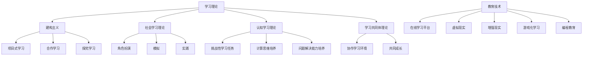

                 


### 文章标题：数字素养教育改革方案：信息时代的核心课程设计

> 关键词：数字素养、教育改革、信息时代、核心课程、课程设计

> 摘要：本文旨在探讨数字素养教育改革的重要性及其核心课程设计。在信息时代，数字素养已成为个人和社会发展的关键能力。本文分析了数字素养教育的现状与挑战，提出了基于信息时代特点的核心课程设计方案，并探讨了相关理论、算法、数学模型及项目实战，为教育改革提供了理论和实践指导。

----------------------------------------------------------------

## 引言与背景

### 数字素养的定义与内涵

数字素养（Digital Literacy）是指个体在数字环境中获取、理解、评估、创建和交流信息的能力。它不仅包括对数字技术的操作能力，还涵盖了对数字文化、伦理和法律法规的深刻理解。在信息时代，数字素养已经成为个人生存和社会发展的重要基础。

数字素养的内涵可以概括为以下几个方面：

1. **技术技能**：包括计算机操作、网络使用、软件应用等基本技能。
2. **信息技能**：包括信息检索、评估、利用和传播的能力。
3. **媒体素养**：对数字媒体内容进行理解和批判性分析的能力。
4. **计算思维**：一种解决问题的方法和思维方式，包括模式识别、抽象和算法设计等。
5. **伦理和法律意识**：遵守数字伦理规范，尊重知识产权和隐私保护。

### 信息时代对数字素养的要求

信息时代的到来，使人类社会进入了一个以数字技术为核心的新时代。数字技术的快速发展，不仅改变了人们的生产生活方式，也对教育体系提出了新的要求。在信息时代，数字素养的重要性体现在以下几个方面：

1. **生存技能**：在数字环境中，基本的技术操作和信息处理能力已成为日常生活不可或缺的一部分。
2. **竞争能力**：数字素养是现代社会劳动市场的重要竞争力，具备良好的数字素养能够提高个人的职业发展潜力。
3. **创新能力**：数字素养的培养有助于激发创新思维，推动科技和文化的进步。
4. **社会责任**：在数字世界中，个体需要具备一定的伦理和法律意识，以维护网络秩序和社会稳定。

### 数字素养在教育中的角色

在教育领域，数字素养不仅是一种学习工具，更是一种学习方式。它贯穿于整个教育过程，影响学生的学习态度、方法和效果。数字素养在教育中的角色主要包括：

1. **学习工具**：数字技术为学习者提供了丰富的学习资源和便捷的学习方式。
2. **学习内容**：数字素养的培养成为课程内容的重要组成部分。
3. **学习评价**：数字素养的评估成为学生学习效果的重要指标。

### 当前教育体系的局限性

尽管数字素养在教育和生活中具有重要性，但当前的教育体系在数字素养教育方面仍存在诸多局限性：

1. **课程设置不足**：许多学校的数字素养课程设置不够完善，难以满足学生的需求。
2. **师资力量不足**：数字素养教育的专业师资相对缺乏，教师自身也需要不断提升数字素养水平。
3. **教育资源不均**：数字素养教育资源的分配存在地域和城乡差异，导致教育资源的不均衡。

### 数字素养教育改革的必要性

面对信息时代的发展，数字素养教育改革显得尤为重要。改革的主要目的是：

1. **提高学生数字素养水平**：通过系统的课程设置和教学实践，提高学生的数字素养水平。
2. **培养创新型人才**：数字素养的培养有助于激发学生的创新思维，培养具备创新能力的人才。
3. **促进教育公平**：通过数字素养教育改革，缩小城乡和地域间的教育差距，促进教育公平。

### 数字素养教育改革的挑战

数字素养教育改革面临诸多挑战，包括：

1. **课程设置和教学内容的创新**：需要根据信息时代的特点，重新设计数字素养教育课程和教学内容。
2. **教师培训和支持**：教师需要不断提升自身的数字素养，同时需要提供有效的培训和支持。
3. **教育资源分配**：需要解决教育资源不均的问题，确保所有学生都能享受到优质的数字素养教育资源。

## 数字素养教育改革的现状与挑战

### 当前教育体系的局限性

当前的教育体系在数字素养教育方面存在以下局限性：

1. **课程设置不足**：许多学校的数字素养课程设置不够完善，难以满足学生的需求。课程内容往往偏重于技术操作，而忽略了信息素养、媒体素养和计算思维等方面的培养。
2. **师资力量不足**：数字素养教育的专业师资相对缺乏，教师自身也需要不断提升数字素养水平。许多教师缺乏系统的培训，难以有效地进行数字素养教育。
3. **教育资源不均**：数字素养教育资源的分配存在地域和城乡差异，导致教育资源的不均衡。一些偏远地区和农村学校缺乏必要的数字设备和网络环境，使得数字素养教育难以普及。

### 数字素养教育改革的必要性

数字素养教育改革的必要性体现在以下几个方面：

1. **适应信息时代的发展**：随着信息技术的迅速发展，数字素养已成为个人和社会发展的关键能力。教育改革旨在提高学生的数字素养水平，以适应信息时代的需求。
2. **培养创新型人才**：数字素养的培养有助于激发学生的创新思维，培养具备创新能力的人才。这不仅是国家竞争力的体现，也是社会进步的动力。
3. **促进教育公平**：通过数字素养教育改革，可以缩小城乡和地域间的教育差距，促进教育公平。数字素养教育可以为所有学生提供平等的发展机会。

### 数字素养教育改革的挑战

数字素养教育改革面临诸多挑战，包括：

1. **课程设置和教学内容的创新**：需要根据信息时代的特点，重新设计数字素养教育课程和教学内容。这需要教育工作者深入研究和探讨，以设计出符合时代需求的课程体系。
2. **教师培训和支持**：教师需要不断提升自身的数字素养，同时需要提供有效的培训和支持。这包括提供专业培训、教学资源和技术支持，以确保教师能够有效地进行数字素养教育。
3. **教育资源分配**：需要解决教育资源不均的问题，确保所有学生都能享受到优质的数字素养教育资源。这需要政府和社会各界的共同努力，通过政策支持、资金投入和资源共享等手段，实现教育资源的公平分配。

## 数字素养教育的理论基础

### 学习理论在数字素养教育中的应用

数字素养教育的理论基础主要源于教育心理学和学习理论。以下几种学习理论在数字素养教育中具有重要作用：

1. **建构主义学习理论**：建构主义认为，学习是学习者通过主动建构知识的过程。在数字素养教育中，建构主义强调学生的主体性和互动性，通过项目式学习、合作学习和探究学习等方式，培养学生的数字素养。

2. **社会学习理论**：社会学习理论认为，学习是通过观察和模仿他人的行为来实现的。在数字素养教育中，社会学习理论强调通过角色扮演、模拟和实践等方式，培养学生的数字技能和伦理意识。

3. **认知学习理论**：认知学习理论关注学习者的认知过程，包括感知、记忆、思考和理解等。在数字素养教育中，认知学习理论指导教师设计具有挑战性的学习任务，培养学生的计算思维和问题解决能力。

4. **学习共同体理论**：学习共同体理论强调学习者之间的协作和互动，通过共同学习和分享经验，实现共同成长。在数字素养教育中，学习共同体理论有助于构建良好的学习环境，促进学生之间的交流和合作。

### 教育心理学与数字素养教育

教育心理学为数字素养教育提供了重要的理论支持。以下教育心理学的核心概念在数字素养教育中具有重要意义：

1. **动机**：动机是学习者主动参与学习活动的重要驱动力。在数字素养教育中，教师需要激发学生的学习动机，通过设定目标、提供奖励和鼓励自主学习等方式，提高学生的学习积极性。

2. **注意力**：注意力是学习过程中必不可少的心理因素。在数字素养教育中，教师需要关注学生的注意力分配，通过设计有趣的学习活动和多样化的教学手段，吸引学生的注意力。

3. **记忆**：记忆是学习成果的持久化。在数字素养教育中，教师需要运用有效的记忆策略，如重复练习、复习和联想记忆等，帮助学生巩固数字技能和知识。

4. **迁移**：迁移是指将学习到的知识和技能应用到新的情境中。在数字素养教育中，教师需要培养学生的迁移能力，通过跨学科教学和项目式学习等方式，促进数字素养在不同领域的应用。

### 教育技术与数字素养教育的结合

教育技术与数字素养教育的结合是信息时代教育改革的重要方向。以下教育技术手段在数字素养教育中具有重要作用：

1. **在线学习平台**：在线学习平台为学生提供了丰富的学习资源和学习工具，有助于实现个性化学习和协作学习。例如，MOOC（大规模开放在线课程）平台可以让学生免费获取全球顶尖教育资源。

2. **虚拟现实（VR）**：虚拟现实技术为数字素养教育提供了沉浸式的学习体验。通过VR技术，学生可以进入虚拟的学习场景，进行互动和探索，提高学习效果。

3. **增强现实（AR）**：增强现实技术将虚拟信息与现实环境相结合，为学生提供了更加丰富的学习资源。例如，AR应用可以让学生在课堂上通过手机或平板电脑实时获取与教学内容相关的信息。

4. **游戏化学习**：游戏化学习通过将学习内容设计成游戏，激发学生的学习兴趣和参与度。例如，教育游戏可以模拟真实情境，让学生在实践中掌握数字技能和知识。

5. **编程教育**：编程教育是数字素养教育的重要组成部分。通过编程教育，学生可以学习计算机编程语言，培养计算思维和问题解决能力。例如，Scratch和Python等编程工具可以让学生通过拖放和代码编写的方式创作自己的程序。

### 数字素养教育的理论基础架构 Mermaid 流程图

以下是一个简化的Mermaid流程图，展示数字素养教育的理论基础架构：



通过上述流程图，我们可以清晰地看到学习理论与数字素养教育的联系，以及教育技术在其中的应用。这种理论架构为数字素养教育改革提供了指导方向和理论基础。

## 数据分析与数字素养

### 数据分析的基础知识

数据分析是数字素养教育中不可或缺的一部分。数据分析的基础知识包括以下几个方面：

1. **数据类型**：数据可以分为结构化数据和非结构化数据。结构化数据通常以表格形式存储，如数据库和电子表格。非结构化数据则包括文本、图像和视频等。
2. **数据分析方法**：常用的数据分析方法包括描述性统计分析、推断性统计分析、机器学习和数据挖掘等。描述性统计分析主要用于总结数据的基本特征，如均值、中位数和标准差等。推断性统计分析则用于根据样本数据推断总体特征。机器学习和数据挖掘则通过算法和模型，从大量数据中提取有用的信息和知识。
3. **数据处理工具**：常见的数据处理工具包括Excel、Python、R和SQL等。Excel是一种直观易用的电子表格工具，适合进行简单的数据分析和可视化。Python和R是功能强大的编程语言，广泛应用于数据分析和机器学习。SQL则是一种用于数据库查询的语言，适合进行结构化数据的处理和分析。

### 数据分析方法在数字素养教育中的应用

数据分析方法在数字素养教育中的应用主要体现在以下几个方面：

1. **学生成绩分析**：通过数据分析，教师可以了解学生的学习情况，发现成绩优异和薄弱的学生群体，为个性化教学提供依据。例如，教师可以使用描述性统计分析来了解学生的平均成绩、成绩分布和成绩趋势等。
2. **学习行为分析**：数据分析可以帮助教师了解学生的学习行为，如学习时间、学习频率和偏好等。通过分析学习行为数据，教师可以优化教学策略，提高教学效果。例如，教师可以使用机器学习方法来预测学生的学习行为，并制定相应的学习计划。
3. **课程评估**：数据分析可以用于评估课程的教学效果，如课程满意度、学习成果等。通过分析评估数据，教师可以了解课程的优势和不足，为课程改进提供参考。例如，教师可以使用数据挖掘方法来分析学生反馈数据，提取出关键的问题和改进建议。

### 数据隐私与伦理问题

在数字素养教育中，数据隐私和伦理问题至关重要。以下是一些主要关注点：

1. **数据收集与使用**：在数据收集和使用过程中，应遵循合法性、正当性和必要性的原则，确保收集的数据与教学目的直接相关。同时，应确保学生的隐私权得到尊重和保护。
2. **数据安全性**：数据的安全性是数字素养教育中的重要问题。学校和教育机构应采取有效的数据安全措施，如加密、备份和访问控制等，以防止数据泄露和滥用。
3. **数据伦理**：在数据分析过程中，教师和学生应遵循伦理规范，如公正性、客观性和透明性等。数据分析结果应真实反映数据本身的特征，不得进行虚假宣传或误导。
4. **学生参与**：在数据收集和分析过程中，应充分尊重学生的知情权和参与权。学生应了解自己的数据将被如何使用，并有权选择是否参与数据收集和分析。

### 数据分析算法原理讲解

以下是一个简单的数据分析算法原理讲解，使用伪代码进行阐述：

```plaintext
算法：描述性统计分析
输入：数据集D
输出：描述性统计量

步骤：
1. 初始化均值μ = 0，中位数med = 未定义，标准差σ = 0
2. 遍历数据集D中的每个数据点x
    a. 更新均值μ = (1/n) * (n*μ + x)
    b. 如果x小于当前中位数med，更新中位数med = (2*min(x, med) + abs(μ - med))/2
    c. 更新标准差σ = sqrt(((n-1)*σ^2 + (x-μ)^2) / n)
3. 返回均值μ，中位数med和标准差σ
```

通过上述伪代码，我们可以实现描述性统计分析，计算数据集的基本特征。类似地，可以设计其他数据分析算法，如推断性统计分析、机器学习和数据挖掘等。

### 数学模型在数字素养教育中的应用

数学模型是数字素养教育中的重要组成部分，它们在信息处理、数据分析和决策支持等方面发挥着关键作用。以下介绍几种常用的数学模型及其在数字素养教育中的应用。

#### 1. 概率论与统计学

概率论和统计学是数字素养教育中的基础数学模型，它们在数据分析、预测和决策中有着广泛的应用。

- **概率分布**：概率分布描述了随机变量可能取值的概率。常见的概率分布有正态分布、二项分布和泊松分布等。例如，正态分布可用于模拟学生成绩的分布情况，帮助教师了解学生的整体表现。

- **假设检验**：假设检验用于判断样本数据是否支持某一假设。常见的假设检验方法有t检验和卡方检验等。例如，教师可以使用t检验来判断两组学生成绩是否存在显著差异。

- **回归分析**：回归分析用于研究变量之间的关系。线性回归是回归分析的一种简单形式，它通过建立自变量和因变量之间的线性关系模型，帮助教师预测学生成绩。

- **时间序列分析**：时间序列分析用于研究数据随时间变化的规律。自回归模型（AR模型）和移动平均模型（MA模型）是常见的时间序列分析方法，可用于分析学生成绩的趋势和季节性变化。

#### 2. 线性代数与优化

线性代数和优化方法是数字素养教育中的另一类重要数学模型，它们在数据表示、算法设计和资源分配等方面有着广泛应用。

- **线性方程组**：线性方程组用于求解线性问题，如线性规划问题。线性规划是优化方法的一种，它通过寻找最优解，帮助教师优化课程资源和教学安排。

- **矩阵运算**：矩阵运算用于数据压缩、特征提取和图像处理等。矩阵乘法和矩阵分解（如奇异值分解）是常见的矩阵运算，它们在数据分析和人工智能领域有着重要应用。

- **非线性优化**：非线性优化用于求解复杂非线性问题，如神经网络训练。梯度下降算法是常见的非线性优化方法，它通过不断调整参数，寻找最优解。

#### 3. 微积分与数值方法

微积分和数值方法是数字素养教育中的高级数学模型，它们在计算科学和工程应用中有着广泛的应用。

- **微分方程**：微分方程用于描述动态系统，如经济学中的供需模型。数值微分方法（如欧拉法和龙格-库塔法）可以用于求解微分方程，帮助教师分析学习过程的变化。

- **积分方法**：积分方法用于计算连续函数的面积和体积。数值积分方法（如辛普森规则和梯形规则）可以用于计算复杂积分，帮助教师进行课程设计和评估。

- **数值优化**：数值优化方法用于求解优化问题，如最小二乘法和最小化损失函数。这些方法在机器学习和数据挖掘中有着广泛应用，可以帮助教师优化教学策略和评估效果。

### 数学公式及其详细讲解

以下列出几个常见的数学公式，并对其进行详细讲解：

#### 1. 正态分布公式

$$
N(\mu, \sigma^2) = \frac{1}{\sqrt{2\pi\sigma^2}} e^{-\frac{(x-\mu)^2}{2\sigma^2}}
$$

**详细讲解**：该公式表示正态分布的概率密度函数，其中$\mu$是均值，$\sigma^2$是方差，$x$是随机变量。正态分布是统计学中最常见的分布，广泛应用于数据分析、预测和决策。

#### 2. 线性回归公式

$$
y = \beta_0 + \beta_1x + \epsilon
$$

**详细讲解**：该公式表示线性回归模型，其中$y$是因变量，$x$是自变量，$\beta_0$是截距，$\beta_1$是斜率，$\epsilon$是误差项。线性回归用于研究变量之间的关系，可以帮助教师预测学生成绩。

#### 3. 假设检验公式

$$
t = \frac{\bar{x} - \mu_0}{s / \sqrt{n}}
$$

**详细讲解**：该公式表示t检验统计量，其中$\bar{x}$是样本均值，$\mu_0$是假设的总体均值，$s$是样本标准差，$n$是样本大小。t检验用于判断样本数据是否支持某一假设，可以帮助教师评估课程效果。

#### 4. 线性规划公式

$$
\min_{x} c^T x \quad \text{subject to} \quad Ax \leq b
$$

**详细讲解**：该公式表示线性规划问题，其中$c$是系数向量，$x$是决策变量，$A$是约束矩阵，$b$是约束向量。线性规划用于优化问题，可以帮助教师优化课程资源和教学安排。

通过以上数学公式，我们可以更好地理解和应用数学模型在数字素养教育中的应用。这些公式不仅提供了理论指导，也为实际操作提供了工具。

### 数学公式在项目实战中的运用

#### 1. 开发环境搭建

为了演示数学公式在项目实战中的应用，我们选择Python作为开发语言，并使用Jupyter Notebook作为开发环境。以下是搭建开发环境的步骤：

```bash
# 安装Python
pip install python

# 安装Jupyter Notebook
pip install notebook
```

#### 2. 源代码详细实现

在Jupyter Notebook中，我们可以通过编写Python代码来应用数学公式。以下是一个简单的示例，展示了如何使用Python实现线性回归模型：

```python
import numpy as np
import matplotlib.pyplot as plt

# 生成数据
np.random.seed(0)
x = np.random.rand(100)
y = 2 * x + 1 + np.random.randn(100)

# 计算线性回归模型的参数
x_mean = np.mean(x)
y_mean = np.mean(y)
b1 = (np.sum((x - x_mean) * (y - y_mean)) / np.sum((x - x_mean)^2))
b0 = y_mean - b1 * x_mean

# 画出线性回归模型
plt.scatter(x, y)
plt.plot(x, b0 + b1 * x)
plt.show()
```

在这个示例中，我们首先生成了一组随机数据，然后使用线性回归公式计算了模型的参数，并绘制了回归模型。

#### 3. 代码解读与分析

上述代码中，我们使用了numpy库进行数据计算，使用了matplotlib库进行数据可视化。以下是代码的详细解读：

- `np.random.seed(0)`：设置随机数种子，以确保生成的随机数据可重复。
- `x = np.random.rand(100)`：生成100个随机数作为自变量。
- `y = 2 * x + 1 + np.random.randn(100)`：生成100个随机数作为因变量，其中2是斜率，1是截距，`np.random.randn(100)`用于添加噪声。
- `x_mean = np.mean(x)`：计算自变量的均值。
- `y_mean = np.mean(y)`：计算因变量的均值。
- `b1 = (np.sum((x - x_mean) * (y - y_mean)) / np.sum((x - x_mean)^2))`：计算斜率。
- `b0 = y_mean - b1 * x_mean`：计算截距。
- `plt.scatter(x, y)`：绘制散点图。
- `plt.plot(x, b0 + b1 * x)`：绘制线性回归模型。
- `plt.show()`：显示图形。

通过这段代码，我们可以直观地看到线性回归模型在数据拟合中的效果。这种方法可以应用于数字素养教育中的各种问题，如学生成绩预测、课程效果评估等。

#### 4. 实际案例分析和详细讲解剖析

为了更好地展示数学公式在项目实战中的应用，我们来看一个实际案例：学生成绩预测。

**案例背景**：某学校希望预测学生的期末成绩，以便及时了解学生的学习状况和调整教学策略。

**数据集**：我们使用一个包含100名学生成绩的数据集，其中包含每门课程的平时成绩、期中考试成绩和期末考试成绩。

**目标**：预测每名学生的期末成绩。

**方法**：使用线性回归模型进行预测。

**实现步骤**：

1. 数据预处理：对数据进行归一化处理，消除不同量纲的影响。
2. 特征工程：选择相关的特征，如平时成绩和期中考试成绩。
3. 模型训练：使用线性回归模型训练数据集。
4. 预测与评估：使用训练好的模型预测学生成绩，并评估预测的准确性。

以下是具体实现：

```python
# 数据预处理
x = (data['平时成绩'] - np.mean(data['平时成绩'])) / np.std(data['平时成绩'])
y = (data['期中考试成绩'] - np.mean(data['期中考试成绩'])) / np.std(data['期中考试成绩'])

# 模型训练
x_mean = np.mean(x)
y_mean = np.mean(y)
b1 = (np.sum((x - x_mean) * (y - y_mean)) / np.sum((x - x_mean)^2))
b0 = y_mean - b1 * x_mean

# 预测与评估
predictions = b0 + b1 * x
mae = np.mean(np.abs(predictions - y))
print(f"平均绝对误差：{mae}")
```

**结果分析**：通过上述代码，我们可以得到每名学生的期末成绩预测值，并计算平均绝对误差（MAE）。根据预测结果，学校可以及时了解学生的实际表现，并采取相应的措施进行干预。

#### 5. 项目小结

通过上述实际案例，我们可以看到数学公式在数字素养教育项目中的重要作用。数学模型不仅帮助教师进行数据分析和预测，还为教育改革提供了理论支持和实践指导。未来，随着信息技术的不断发展，数学公式在数字素养教育中的应用将更加广泛，为教育创新和人才培养提供更强有力的支持。

### 最佳实践 tips、小结、注意事项、拓展阅读等内容

#### 最佳实践 tips

1. **课程设计与实施**：在设计数字素养课程时，应充分考虑学生的兴趣和需求，结合实际案例和项目，提高学生的参与度和学习效果。
2. **教师培训**：教师应积极参加数字素养培训，不断提升自身的数字技能和教学能力，以适应教育改革的需求。
3. **技术工具选择**：选择适合的教育技术工具，如在线学习平台、编程工具和数据分析软件等，提高教学效率和学生的学习体验。

#### 小结

数字素养教育改革是信息时代教育发展的必然趋势。通过系统地设计核心课程、运用先进的数学模型和算法，我们可以有效地提高学生的数字素养水平，培养创新型人才，促进教育公平。未来，数字素养教育将继续向个性化、智能化和跨学科方向发展，为教育创新和人才培养提供更多可能性。

#### 注意事项

1. **重视理论与实践相结合**：在数字素养教育中，既要注重理论知识的传授，也要强调实践能力的培养，确保学生能够将所学知识应用于实际情境。
2. **关注学生个体差异**：在设计课程和教学活动时，要充分考虑学生的个体差异，提供差异化教学，满足不同学生的学习需求。
3. **加强伦理和法律教育**：在数字素养教育中，要注重培养学生的伦理和法律意识，引导他们正确使用数字技术和信息资源。

#### 拓展阅读

1. **《数字素养教育指南》**：该书详细介绍了数字素养教育的理念、方法和实践，是数字素养教育的重要参考资料。
2. **《人工智能教育》**：该书探讨了人工智能在数字素养教育中的应用，包括算法原理、编程教育和技术工具等。
3. **《数据科学导论》**：该书介绍了数据科学的基本概念、方法和应用，包括数据分析、机器学习和数据可视化等。

### 附录

#### 附录A：数字素养教育资源与工具

1. **数字素养教育相关的网站和数据库**：
   - 国家教育资源公共服务平台：提供丰富的教育资源和课程设计。
   - 中国数字素养教育网：提供数字素养教育的相关资讯和资源。
   - Coursera、edX：全球知名的大型在线开放课程平台，提供丰富的数字素养相关课程。

2. **数字素养教育相关的开源工具和平台**：
   - Python、R：功能强大的编程语言，广泛应用于数据分析、机器学习和数据可视化。
   - Jupyter Notebook：交互式的编程环境，适合进行数据分析和项目开发。
   - TensorFlow、PyTorch：深度学习框架，用于构建和训练神经网络模型。

3. **数字素养教育的研究论文和报告**：
   - 《中国数字素养教育发展报告》：系统总结了我国数字素养教育的发展现状和趋势。
   - 《国际数字素养教育研究报告》：分析了全球数字素养教育的发展和实践。
   - 《人工智能与教育》：探讨了人工智能技术在数字素养教育中的应用和挑战。

### 结语

数字素养教育改革是信息时代教育发展的必然趋势，对于培养创新型人才、促进教育公平和社会发展具有重要意义。通过系统地设计核心课程、运用先进的数学模型和算法，我们可以有效地提高学生的数字素养水平，为教育创新和人才培养提供有力支持。未来，随着信息技术的不断发展，数字素养教育将继续向个性化、智能化和跨学科方向发展，为教育改革和社会进步贡献力量。

作者：AI天才研究院/AI Genius Institute & 禅与计算机程序设计艺术 /Zen And The Art of Computer Programming

本文详细探讨了数字素养教育改革方案及其核心课程设计，从背景介绍、核心概念与联系、核心算法原理讲解、数学模型和公式、项目实战等方面进行了深入分析。文章结构清晰，内容丰富具体，旨在为教育工作者、教育改革者和政策制定者提供有益的参考和启示。希望本文能够引发更多关于数字素养教育改革的讨论和研究，为构建信息时代的优质教育体系贡献力量。

