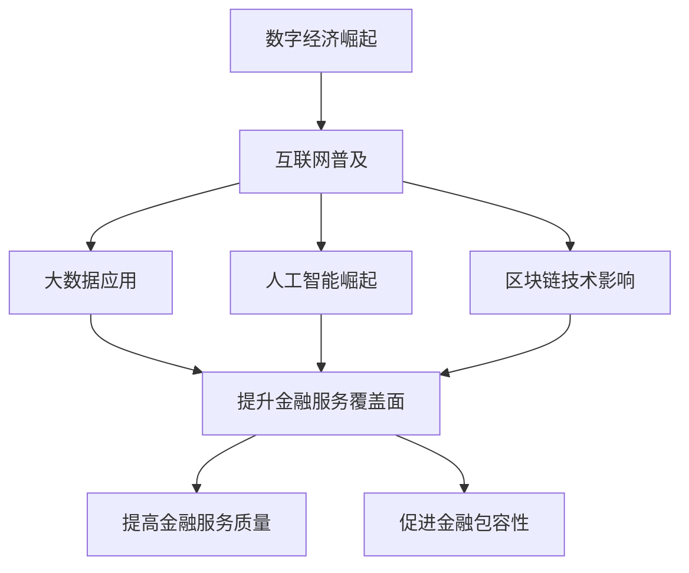

                 


### 《数字经济中的普惠金融：科技赋能与金融包容》

---

## 关键词

- 数字经济
- 普惠金融
- 科技赋能
- 金融包容
- 大数据
- 人工智能
- 区块链

---

## 摘要

本文将深入探讨数字经济背景下普惠金融的发展现状与未来趋势。通过分析科技赋能普惠金融的背景与意义，我们将重点介绍大数据、人工智能和区块链等技术在金融领域的应用。文章还涵盖金融包容性评估方法与实践案例，探讨科技赋能普惠金融面临的挑战与对策。最后，本文对未来科技赋能普惠金融的发展方向进行展望，并总结全文，提出未来研究的方向和建议。

---

### 第1章 科技赋能普惠金融概述

#### 1.1 普惠金融的概念与现状

普惠金融（Inclusive Finance）是一种旨在为所有群体提供公平、有效金融服务的理念。它不仅关注金融服务的普及，更强调服务的质量。普惠金融的目标是实现金融资源分配的公平性，使得贫困、弱势群体也能享受到金融服务带来的便利和收益。

全球普惠金融发展现状可以从以下几个方面进行概述：

1. **普及率**：根据世界银行的数据，全球成年人账户普及率已经达到了90%以上，但不同国家和地区之间存在显著差异。发展中国家和地区的普惠金融覆盖率较低，主要集中在城市地区和较富裕的群体。

2. **金融服务质量**：尽管金融服务的普及率较高，但很多发展中国家的金融基础设施相对落后，金融服务质量参差不齐。这导致许多贫困和弱势群体难以享受到高质量的金融服务。

3. **政策支持**：各国政府和国际组织纷纷出台政策，支持普惠金融的发展。例如，联合国2030年可持续发展目标中就包括了普惠金融的指标。

#### 1.2 科技赋能普惠金融的背景与意义

数字经济的崛起为普惠金融的发展带来了新的机遇。随着互联网、大数据、人工智能和区块链等技术的迅速发展，金融服务的效率和覆盖面得到了显著提升。

1. **背景**：

   - **互联网普及**：互联网的普及使得金融服务可以跨越地域限制，为偏远地区和贫困群体提供便捷的金融服务。

   - **大数据与人工智能**：大数据和人工智能技术可以帮助金融机构更准确地评估贷款风险，降低金融服务的成本，提高决策的效率。

   - **区块链技术**：区块链技术提供了去中心化的信任机制，可以在金融交易中实现更高效、透明的操作。

2. **意义**：

   - **提升金融服务的覆盖面**：科技赋能可以使金融服务更加普及，覆盖到更多贫困和弱势群体。

   - **提高金融服务质量**：科技的应用可以降低金融服务的成本，提高金融服务的效率和准确性。

   - **促进金融包容性**：科技赋能普惠金融有助于实现金融资源分配的公平性，提升金融包容性。

#### 1.3 国际科技赋能普惠金融的发展趋势

国际科技赋能普惠金融的发展趋势可以从以下几个方面进行概述：

1. **大数据的应用**：大数据技术正在成为普惠金融的重要工具。例如，通过分析客户的消费行为、信用记录等数据，金融机构可以更准确地评估贷款申请者的信用风险。

2. **人工智能的崛起**：人工智能技术在金融领域的应用日益广泛，包括智能客服、风险管理和智能投顾等。这些应用可以提高金融服务的效率和质量。

3. **区块链技术的影响**：区块链技术正在改变金融交易的运作方式。例如，通过区块链可以实现跨境支付的低成本和高效率，以及去中心化的身份认证和智能合约。

### 流程图

以下是一个简单的 Mermaid 流程图，展示了科技赋能普惠金融的核心概念之间的关系：



### 完整流程图


通过以上分析，我们可以看到科技赋能普惠金融的重要性。接下来，我们将深入探讨大数据、人工智能和区块链等技术在金融领域的具体应用。

---

### 第2章 科技在普惠金融中的应用

#### 2.1 大数据在普惠金融中的应用

大数据技术在普惠金融中的应用主要体现在以下几个方面：

1. **客户细分与精准营销**：通过分析客户的消费行为、信用记录、社交数据等，金融机构可以更准确地了解客户需求，进行精准营销。例如，一家普惠金融机构可以通过大数据分析发现某地区低收入人群有较高的消费需求，从而推出针对该人群的贷款产品。

2. **风险评估与信用评分**：大数据可以帮助金融机构更准确地评估贷款申请者的信用风险。传统的信用评分模型依赖于申请者的历史信用记录，而大数据分析可以结合更多维度的数据，如消费行为、社交关系等，从而提供更全面的信用评估。

3. **欺诈检测**：大数据技术可以实时监控金融交易，识别潜在的欺诈行为。例如，一家在线借贷平台可以通过分析客户的交易历史，发现异常的交易模式，从而及时采取措施防止欺诈。

### 伪代码示例

```python
def assess_credit_risk(customer_data):
    """
    评估客户的信用风险
    
    参数：
    - customer_data: 客户的数据，包括消费行为、信用记录、社交关系等
    
    返回值：
    - risk_score: 信用风险评分，数值越高，风险越大
    """
    
    # 提取关键特征
    credit_history = customer_data['credit_history']
    transaction_behavior = customer_data['transaction_behavior']
    social_relationships = customer_data['social_relationships']
    
    # 构建信用评分模型
    model = CreditRiskModel()
    
    # 输入特征并进行预测
    risk_score = model.predict(credit_history, transaction_behavior, social_relationships)
    
    return risk_score
```

### 数学模型与公式

假设我们有一个关于信用风险的线性回归模型，可以用以下公式表示：

$$
Y = \beta_0 + \beta_1X_1 + \beta_2X_2 + ... + \beta_nX_n + \epsilon
$$

其中：

- \(Y\) 是信用风险评分；
- \(\beta_0\) 是常数项；
- \(\beta_1, \beta_2, ..., \beta_n\) 是特征权重；
- \(X_1, X_2, ..., X_n\) 是客户特征（如消费行为、信用记录、社交关系等）；
- \(\epsilon\) 是误差项。

我们可以使用最小二乘法（Least Squares Method）来估计模型参数：

$$
\hat{\beta} = (X^T X)^{-1}X^T Y
$$

其中：

- \(\hat{\beta}\) 是估计的模型参数；
- \(X^T\) 是特征矩阵的转置；
- \(X\) 是特征矩阵；
- \(Y\) 是标签向量。

### 举例说明

假设我们有一个包含1000个客户的信用风险评估数据集。我们使用该数据集训练一个线性回归模型，以预测客户的信用风险。数据集中的特征包括消费金额、信用记录和社交关系等。我们使用最小二乘法来估计模型参数，并使用该模型对新的客户进行信用风险评估。

#### 实践案例

以某在线借贷平台为例，该平台利用大数据技术对贷款申请者进行信用风险评估。以下是一个具体的实践案例：

1. **数据收集**：平台收集了贷款申请者的消费行为数据、信用记录和社交关系等。数据来源包括电商平台、社交网络和金融机构等。

2. **数据预处理**：对数据进行清洗和归一化处理，以便后续建模。

3. **特征工程**：提取关键特征，如消费金额、还款记录、社交圈子的活跃度等。

4. **模型训练**：使用线性回归模型对训练数据集进行训练，得到模型的参数。

5. **模型评估**：使用交叉验证方法对模型进行评估，确保模型的预测准确性。

6. **信用风险评估**：使用训练好的模型对新的贷款申请者进行信用风险评估，提供个性化的贷款建议。

#### 分析与解读

通过大数据技术，该在线借贷平台能够更准确地评估贷款申请者的信用风险，从而降低贷款违约率，提高贷款业务的成功率。这为普惠金融的发展提供了有力的支持。

### 最佳实践 Tips

1. **数据安全与隐私**：在使用大数据技术时，要特别注意数据的安全与隐私保护。确保数据处理符合相关法律法规和行业标准。

2. **模型解释性**：在构建信用评分模型时，要保证模型的解释性，以便理解模型决策的逻辑。

3. **持续迭代**：金融市场的变化快速，要定期更新模型，以适应新的市场环境和风险。

---

#### 2.2 人工智能在普惠金融中的应用

人工智能（AI）技术在普惠金融中的应用日益广泛，主要表现在以下几个方面：

1. **智能客服**：人工智能可以通过聊天机器人和虚拟客服代表，提供7x24小时的客户服务。例如，蚂蚁金服的智能客服“小蜜”可以自动处理大量的客户咨询和问题，提高了服务效率。

2. **风险控制**：人工智能可以帮助金融机构更有效地进行风险控制。通过机器学习算法，可以对贷款申请者进行风险评估，识别潜在的欺诈行为。

3. **智能投顾**：人工智能可以根据投资者的风险偏好和财务目标，提供个性化的投资建议。例如，腾讯的“盈米基金”利用人工智能技术，为用户提供智能投顾服务。

### 伪代码示例

```python
def loan_approval(loan_applicant_data, risk_model):
    """
    根据贷款申请者的数据和风险评估模型，决定是否批准贷款
    
    参数：
    - loan_applicant_data: 贷款申请者的数据
    - risk_model: 风险评估模型
    
    返回值：
    - approval_status: 贷款批准状态（True/False）
    """
    
    # 预测贷款申请者的信用风险
    risk_score = risk_model.predict(loan_applicant_data)
    
    # 根据风险评分决定贷款批准状态
    approval_status = risk_score > risk_threshold
    
    return approval_status
```

### 数学模型与公式

假设我们有一个基于逻辑回归的信用风险评估模型，其公式为：

$$
\sigma(z) = \frac{1}{1 + e^{-z}}
$$

其中：

- \(z\) 是线性组合，\(z = \beta_0 + \beta_1X_1 + \beta_2X_2 + ... + \beta_nX_n\)；
- \(\sigma(z)\) 是风险评分的概率分布函数；
- \(\beta_0, \beta_1, \beta_2, ..., \beta_n\) 是模型参数；
- \(X_1, X_2, ..., X_n\) 是贷款申请者的特征。

我们使用最大似然估计（Maximum Likelihood Estimation，MLE）来估计模型参数：

$$
\hat{\beta} = \arg\max \log L(\beta | X, Y)
$$

其中：

- \(L(\beta | X, Y)\) 是似然函数；
- \(\hat{\beta}\) 是参数的估计值。

### 举例说明

假设我们有一个包含1000个贷款申请者的数据集，每个申请者有多个特征（如收入、工作年限、信用记录等）。我们使用逻辑回归模型对数据进行训练，以预测贷款批准的概率。训练完成后，我们使用该模型对新的贷款申请者进行评估。

1. **数据收集**：收集贷款申请者的数据，包括收入、工作年限、信用记录等。

2. **数据预处理**：对数据进行清洗和标准化处理。

3. **模型训练**：使用训练数据集训练逻辑回归模型，并使用交叉验证方法进行参数调优。

4. **模型评估**：使用测试数据集评估模型的性能，确保模型的预测准确性。

5. **贷款批准**：使用训练好的模型对新的贷款申请者进行评估，决定是否批准贷款。

#### 实践案例

以蚂蚁金服的“花呗”为例，该服务利用人工智能技术进行信用风险评估和欺诈检测。

1. **数据收集**：蚂蚁金服通过多种渠道收集用户的消费行为数据，如购物、转账、还款等。

2. **数据预处理**：对数据进行清洗和标准化处理。

3. **特征工程**：提取关键特征，如消费金额、消费频率、还款情况等。

4. **模型训练**：使用机器学习算法训练信用风险评估模型，识别潜在的高风险用户。

5. **欺诈检测**：使用欺诈检测模型实时监控交易行为，识别潜在的欺诈行为。

6. **贷款批准**：根据信用评估和欺诈检测结果，决定是否批准贷款。

#### 分析与解读

通过人工智能技术，蚂蚁金服能够更准确地评估贷款申请者的信用风险，降低贷款违约率，同时提高欺诈检测的准确性。这为普惠金融的发展提供了强有力的支持。

### 最佳实践 Tips

1. **数据多样化**：收集多样化的数据，包括结构化和非结构化数据，以提高模型的准确性。

2. **持续优化**：定期更新模型，以适应市场变化和用户需求。

3. **解释性**：确保模型的解释性，以便理解模型决策的逻辑。

---

#### 2.3 区块链在普惠金融中的应用

区块链技术在普惠金融中的应用正日益广泛，其主要优势在于去中心化、透明度和安全性。以下是一些区块链在普惠金融中的应用实例：

1. **跨境支付**：传统跨境支付系统往往存在高成本、低效率的问题。区块链技术可以实现点对点的跨境支付，降低交易成本，提高交易速度。例如，Ripple网络利用区块链技术提供快速、低成本的跨境支付服务。

2. **数字身份认证**：区块链可以提供去中心化的身份认证服务，使得用户能够安全、便捷地验证身份。这有助于降低金融服务的门槛，使得更多的贫困和弱势群体能够享受到金融服务。

3. **智能合约**：智能合约是一种自动执行合约条款的程序，可以在区块链上实现。这有助于提高金融交易的效率和透明度。例如，OpenCoral项目利用智能合约实现去中心化的贷款和保险服务。

### 伪代码示例

```python
def execute_smart_contract(contract_terms, transaction_data):
    """
    执行智能合约
    
    参数：
    - contract_terms: 合约条款
    - transaction_data: 交易数据
    
    返回值：
    - execution_status: 执行状态（True/False）
    """
    
    # 验证交易数据是否符合合约条款
    if verify_transaction(transaction_data, contract_terms):
        # 执行合约条款
        execute_terms(contract_terms)
        execution_status = True
    else:
        execution_status = False
        
    return execution_status
```

### 数学模型与公式

区块链中的共识算法（如工作量证明Proof of Work，PoW）可以用以下公式表示：

$$
hash(P_{prev} + n) < target
$$

其中：

- \(P_{prev}\) 是前一个区块的哈希值；
- \(n\) 是当前区块的难度值；
- \(target\) 是一个预设的哈希目标值；
- \(hash\) 是哈希函数。

矿工需要不断尝试不同的 \(n\) 值，直到找到满足上述条件的哈希值。

### 举例说明

以比特币的挖矿过程为例：

1. **设定目标**：比特币网络预设了一个目标哈希值，矿工需要找到满足 \(hash(P_{prev} + n) < target\) 的 \(n\) 值。

2. **尝试不同的 \(n\) 值**：矿工使用计算资源不断尝试不同的 \(n\) 值，直到找到满足条件的哈希值。

3. **记录区块**：一旦找到满足条件的哈希值，矿工将当前区块及其交易记录添加到区块链中，并获得比特币奖励。

4. **传播新区块**：矿工将新区块广播给网络中的其他节点，其他节点验证新区块的有效性后，将其添加到自己的区块链中。

#### 实践案例

以Ripple的RippleNet为例，该系统利用区块链技术提供跨境支付服务。

1. **网络构建**：RippleNet是一个由多家金融机构组成的分布式网络，每个金融机构都是一个节点。

2. **交易发起**：用户通过RippleNet发起跨境支付交易。

3. **交易验证**：交易由网络中的节点进行验证，确保交易合法。

4. **交易结算**：一旦交易验证通过，系统自动将资金从付款方转移到收款方。

5. **记录区块链**：交易记录将被永久存储在区块链上，确保透明度和不可篡改性。

#### 分析与解读

通过区块链技术，RippleNet实现了快速、低成本的跨境支付服务，为普惠金融的发展提供了有力支持。去中心化的特性降低了交易成本，提高了交易速度，同时区块链的透明度和安全性也增强了用户对金融服务的信任。

### 最佳实践 Tips

1. **选择合适的区块链平台**：根据业务需求选择合适的区块链平台，如以太坊、Ripple等。

2. **数据安全与隐私**：在区块链应用中，要特别注意数据的安全与隐私保护。

3. **持续优化与升级**：区块链技术不断进步，要持续优化和升级系统，以适应新的需求和技术发展。

---

通过本章对大数据、人工智能和区块链在普惠金融中的应用分析，我们可以看到科技赋能普惠金融的重要性。这些技术不仅提高了金融服务的效率和质量，也促进了金融包容性的实现。接下来，我们将进一步探讨金融包容性的概念、评估方法与实践案例。

---

### 第3章 金融包容性评估

#### 3.1 金融包容性的概念与指标

金融包容性（Financial Inclusion）是指确保所有经济活跃体，无论其收入水平、地理位置或社会地位，都能获得必要的金融服务。这包括银行账户、支付服务、信贷、保险等。

评估金融包容性需要一系列的指标，以下是一些常用的指标：

1. **账户普及率**：指拥有银行账户的人数占总人口的比例。这一指标反映了金融服务的基本普及程度。

2. **信贷获得率**：指能够获得信贷的人数占总人口的比例。这一指标反映了金融服务的深度。

3. **支付便捷性**：指支付服务的可用性和便捷程度。这包括现金支付、电子支付等。

4. **保险覆盖率**：指拥有保险的人数占总人口的比例。这一指标反映了金融服务的广度。

#### 3.2 金融包容性评估方法

金融包容性评估可以通过定量和定性两种方法进行：

1. **定量评估**：使用统计数据和调查数据，通过计算上述指标来评估金融包容性。例如，通过人口普查或金融调查来收集数据，并计算相应的指标。

2. **定性评估**：通过实地调研、访谈和案例分析来深入了解金融服务的实际状况。这种方法有助于发现定量评估无法捕捉到的细节和问题。

#### 3.3 金融包容性评估案例分析

以下是一个具体的金融包容性评估案例分析：

**案例一：某发展中国家的金融包容性评估**

1. **背景**：该国经济发展水平较低，金融基础设施相对落后，金融服务的覆盖面有限。

2. **定量评估**：

   - **账户普及率**：通过人口普查数据，发现银行账户普及率约为60%，低于全球平均水平。
   - **信贷获得率**：调查显示，有40%的成年人表示无法获得信贷，尤其是贫困和弱势群体。
   - **支付便捷性**：电子支付普及率较低，主要依赖于现金支付。
   - **保险覆盖率**：仅有约20%的人口拥有保险，大部分是城市居民。

3. **定性评估**：

   - **实地调研**：通过与当地居民和金融机构的访谈，发现金融服务在偏远地区尤其稀缺，许多居民无法获得基本的金融服务。
   - **案例分析**：对几个贫困社区的金融活动进行详细分析，发现金融服务的缺乏对居民的生活和经济活动产生了负面影响。

#### 分析与解读

通过定量和定性评估，我们可以全面了解该国的金融包容性状况。定量评估提供了宏观层面的数据，定性评估则提供了更深入的理解和洞察。这些评估结果有助于政府和金融机构制定针对性的政策，提升金融包容性。

### 最佳实践 Tips

1. **综合运用定量与定性评估方法**：定量评估可以提供宏观视角，定性评估可以提供微观细节，两者结合可以更全面地评估金融包容性。

2. **定期更新评估指标和方法**：随着金融市场和技术的发展，评估指标和方法也需要不断更新，以反映最新的金融包容性状况。

3. **注重数据隐私与安全**：在进行金融包容性评估时，要特别保护用户的隐私和数据安全。

---

通过本章对金融包容性概念、评估方法和实践案例的详细探讨，我们可以看到金融包容性在普惠金融中的重要性。接下来，我们将通过具体案例深入探讨普惠金融的实践应用。

---

### 第4章 普惠金融实践案例分析

#### 4.1 案例一：某科技公司的普惠金融创新实践

**案例背景**：

某科技公司致力于通过技术创新推动普惠金融的发展。公司利用大数据、人工智能和区块链等技术，为贫困和弱势群体提供定制化的金融服务。

**具体措施**：

1. **大数据分析**：通过分析用户的消费行为、信用记录等数据，为公司提供精准的贷款评估和风险控制。

2. **人工智能应用**：开发智能客服和智能投顾系统，提供7x24小时的客户服务和投资建议，提高服务效率。

3. **区块链技术**：利用区块链实现透明、安全的金融交易，降低交易成本，提高交易速度。

**效果评估**：

通过以上措施，该公司成功地为数千名贫困和弱势群体提供了贷款和理财服务。贷款违约率显著降低，用户满意度提高。

**分析与解读**：

该科技公司的普惠金融创新实践表明，科技赋能可以有效提升金融服务的覆盖面和质量，促进金融包容性的实现。

#### 4.2 案例二：某发展中国家的普惠金融项目

**案例背景**：

某发展中国家政府启动了一个普惠金融项目，旨在通过金融科技手段提升金融服务的普及率和质量。

**具体措施**：

1. **移动支付**：推广移动支付服务，为没有银行账户的居民提供便捷的支付方式。

2. **数字化金融教育**：通过在线课程和实地培训，提高居民对金融知识的认知。

3. **金融支持政策**：为小微企业提供低息贷款和税收优惠，支持其发展。

**效果评估**：

项目实施后，移动支付用户数显著增加，小微企业的贷款获得率提高。金融排斥现象得到缓解，居民的金融素养也有所提升。

**分析与解读**：

该发展中国家的普惠金融项目表明，政府政策支持和金融科技的应用相结合，可以有效推动金融包容性的实现。

#### 4.3 案例三：普惠金融在特定行业的应用

**案例背景**：

某特定行业（如农业）面临着融资难题，许多农户无法获得足够的贷款支持。

**具体措施**：

1. **数据采集**：通过物联网技术收集农作物的生长数据，为贷款评估提供依据。

2. **保险服务**：提供农作物保险，降低农户的风险。

3. **数字化贷款**：利用区块链技术实现快速、安全的贷款审批和发放。

**效果评估**：

项目实施后，农户的贷款获得率显著提高，农作物保险覆盖率增加。农业生产效率得到提升，农户的经济状况得到改善。

**分析与解读**：

该案例表明，普惠金融在特定行业的应用可以解决行业内的融资难题，推动行业的发展。

### 总结

通过以上三个案例，我们可以看到普惠金融在不同领域和地区的具体应用和效果。科技赋能普惠金融不仅提升了金融服务的质量和覆盖面，也为经济发展和社会进步做出了积极贡献。

---

### 第5章 科技赋能普惠金融的挑战与对策

#### 5.1 数据隐私与安全

科技赋能普惠金融的一大挑战是数据隐私与安全。随着大数据和人工智能技术的发展，金融机构和处理大量用户数据的科技公司面临着数据泄露和滥用的风险。为了保护用户隐私和安全，以下是一些对策：

1. **数据加密**：对存储和传输的数据进行加密，确保数据在未经授权的情况下无法被读取。

2. **隐私保护技术**：采用差分隐私（Differential Privacy）等技术，在数据分析过程中保护用户隐私。

3. **安全审计**：定期进行安全审计，确保系统的安全性和合规性。

#### 5.2 技术监管与政策支持

科技赋能普惠金融的另一个挑战是技术监管和政策支持。随着金融科技的发展，现有法律法规可能无法完全适应新的技术和商业模式。为了应对这一挑战，以下是一些对策：

1. **立法跟进**：政府和监管机构应尽快制定和更新相关法律法规，确保金融科技的创新和合规性。

2. **国际合作**：推动国际间的监管合作，建立全球统一的金融科技监管标准。

3. **政策支持**：政府应提供政策支持，如税收优惠、资金扶持等，鼓励金融科技创新。

#### 5.3 金融教育与社会责任

金融教育和社会责任也是科技赋能普惠金融的一个重要挑战。许多用户对金融知识和科技应用了解不足，容易受到金融诈骗和滥用的影响。为了应对这一挑战，以下是一些对策：

1. **金融教育**：开展金融知识普及活动，提高用户的金融素养。

2. **社会责任**：金融机构和科技公司应承担社会责任，提供透明、公正的金融服务。

3. **用户教育**：通过线上和线下渠道，为用户提供金融知识和科技应用的教育资源。

### 最佳实践 Tips

1. **数据隐私与安全**：定期进行安全评估和审计，确保数据保护措施到位。

2. **技术监管与政策支持**：积极参与立法和政策制定，推动金融科技的发展。

3. **金融教育与社会责任**：提供高质量的金融教育和服务，增强用户的金融素养和信任。

### 总结

科技赋能普惠金融面临着数据隐私与安全、技术监管和政策支持、金融教育与社会责任等多方面的挑战。通过有效的对策和最佳实践，可以克服这些挑战，推动普惠金融的健康发展。

---

### 第6章 未来展望

#### 6.1 科技赋能普惠金融的未来趋势

随着科技的不断发展，科技赋能普惠金融将呈现以下趋势：

1. **人工智能与大数据的深度融合**：人工智能和大数据技术的进一步融合，将使金融服务的个性化、智能化水平大幅提升。

2. **区块链技术的广泛应用**：区块链技术将在跨境支付、身份认证、智能合约等领域得到更广泛的应用，推动金融服务的透明化和去中心化。

3. **数字化金融服务的普及**：移动支付、线上贷款、数字保险等数字化金融产品和服务将更加普及，提高金融服务的便利性和覆盖面。

#### 6.2 金融包容性的未来发展

金融包容性的未来发展将依赖于以下因素：

1. **政策支持与立法完善**：政府和监管机构将加大对普惠金融的政策支持和立法力度，推动金融包容性的实现。

2. **技术创新与应用**：金融科技的创新和应用将不断推动金融服务的改进和普及，提高金融包容性。

3. **社会参与与合作**：金融机构、科技公司、非政府组织和公众将共同参与金融包容性的推进，实现更广泛的金融普惠。

#### 6.3 国际合作与协同创新

国际合作与协同创新在普惠金融发展中具有重要意义：

1. **跨国合作**：国际组织和跨国公司将共同推动金融科技的应用和普及，促进全球金融包容性的提升。

2. **知识共享**：各国政府和金融机构将加强知识共享和经验交流，推动普惠金融的全球发展。

3. **技术创新**：通过国际合作，共同攻克金融科技领域的难题，推动技术创新和进步。

### 总结

未来，科技赋能普惠金融将继续深化，金融包容性将得到进一步提升。国际合作与协同创新将在普惠金融发展中发挥重要作用。通过不断推进技术创新和政策支持，我们可以期待一个更加包容、公正和可持续的金融体系。

---

### 第7章 结论

本文通过深入探讨科技赋能普惠金融的背景、应用、评估、挑战与对策，展示了科技在促进金融包容性方面的重要作用。我们分析了大数据、人工智能和区块链等技术在普惠金融中的应用，探讨了金融包容性的概念与评估方法，并通过具体案例展示了普惠金融的实践成效。科技赋能普惠金融不仅提升了金融服务的覆盖面和质量，也为经济和社会的发展做出了积极贡献。

### 未来研究方向和建议

1. **深入探索**：进一步研究大数据、人工智能和区块链等技术在金融领域的深度应用，探索新的技术和方法，提高金融服务的效率和质量。

2. **政策支持**：政府和监管机构应加大对普惠金融的政策支持和立法力度，制定更有针对性的政策措施，推动金融包容性的实现。

3. **国际合作**：加强国际间的合作与交流，推动金融科技的应用和普及，共同应对全球金融包容性的挑战。

4. **用户体验**：关注用户体验，提高金融服务的便捷性和友好性，增强用户对金融服务的信任。

### 拓展阅读

- 《大数据时代：生活、工作与思维的大变革》
- 《人工智能：一种现代的方法》
- 《区块链技术指南》

### 作者信息

作者：AI天才研究院/AI Genius Institute & 禅与计算机程序设计艺术 /Zen And The Art of Computer Programming

