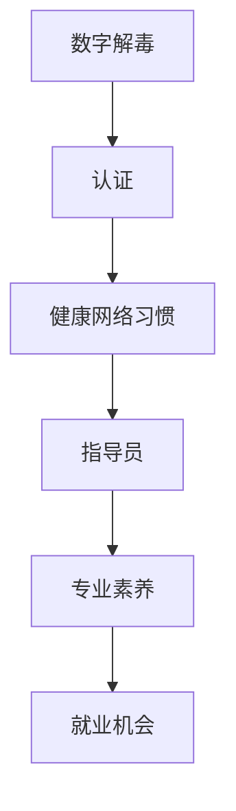

                 

### 文章标题：数字解毒师认证：培训健康网络习惯指导员

> 关键词：数字解毒、认证、健康网络习惯、指导员、教育

> 摘要：
本文将探讨数字解毒师认证的重要性，以及如何成为一位培训健康网络习惯的指导员。我们将从背景介绍、核心概念与联系、核心算法原理、数学模型和公式、项目实战、最佳实践和未来展望等方面展开详细讨论，旨在为读者提供一套完整的数字解毒师认证培训指南。

----------------------------------------------------------------

### 1. 背景介绍

在数字化时代，互联网已经成为我们生活不可或缺的一部分。然而，随之而来的网络成瘾、信息过载和隐私问题也日益严重。这不仅影响了个人的身心健康，还对社交、工作和学习产生了负面影响。因此，培养健康网络习惯变得尤为重要。为了应对这一挑战，数字解毒师认证应运而生。

数字解毒师认证是由专业机构颁发的，旨在培训和教育人们如何应对数字成瘾，培养健康网络习惯的资格证书。这一认证对于指导员来说尤为重要，因为它不仅提高了指导员的专业素养，也为他们提供了更多的就业机会。

### 2. 核心概念与联系

在数字解毒师认证中，有以下几个核心概念：

- **数字解毒**：指通过一系列方法和策略，帮助人们戒除网络成瘾，恢复健康的网络行为。
- **认证**：指专业机构对数字解毒师的专业能力进行评估和认证，确保他们具备培训健康网络习惯的资质。
- **健康网络习惯**：指在网络上保持适度、理性、有益的行为习惯，包括时间管理、信息筛选、网络安全等。

这些概念之间有着密切的联系。数字解毒师通过认证，掌握了专业的知识和技能，能够帮助人们培养健康网络习惯，从而改善生活质量。

#### Mermaid 流程图



### 3. 核心算法原理

在数字解毒师认证培训中，核心算法原理主要包括：

- **行为分析**：通过数据分析，了解个体的网络行为习惯，找出网络成瘾的根源。
- **心理干预**：根据个体的心理特点，制定相应的心理干预策略，帮助他们戒除网络成瘾。
- **教育引导**：通过教育引导，帮助个体树立正确的网络观念，培养健康网络习惯。

以下是一个简单的伪代码示例，用于描述行为分析的过程：

```plaintext
function analyzeBehavior(data):
    # 数据预处理
    preprocessedData = preprocessData(data)

    # 行为模式识别
    behaviorPatterns = identifyPatterns(preprocessedData)

    # 成瘾程度评估
    addictionLevel = assessAddiction(behaviorPatterns)

    # 输出分析结果
    return addictionLevel
```

### 4. 数学模型和公式

在数字解毒师认证培训中，数学模型和公式主要用于：

- **行为数据分析**：使用统计分析方法，对网络行为数据进行分析，识别个体行为模式。
- **成瘾程度评估**：根据个体的网络行为数据，使用成瘾程度评估模型，评估个体的成瘾程度。

以下是一个简单的latex公式示例，用于描述成瘾程度评估模型：

```latex
\begin{equation}
    \text{addictionLevel} = \frac{\sum_{i=1}^{n} (\text{behaviorScore}_i - \text{averageScore})^2}{n}
\end{equation}
```

### 5. 项目实战

以下是一个简单的项目实战示例，用于说明如何搭建数字解毒师认证培训平台：

#### 开发环境搭建

- 使用Python和Django框架搭建后端服务器
- 使用HTML、CSS和JavaScript搭建前端页面
- 使用MySQL数据库存储用户数据和认证信息

#### 源代码实现

```python
# 后端代码示例
from django.db import models

class User(models.Model):
    username = models.CharField(max_length=100)
    email = models.EmailField()
    password = models.CharField(max_length=100)
    is_verified = models.BooleanField(default=False)

class Course(models.Model):
    name = models.CharField(max_length=100)
    description = models.TextField()
    duration = models.DurationField()

class Certificate(models.Model):
    user = models.ForeignKey(User, on_delete=models.CASCADE)
    course = models.ForeignKey(Course, on_delete=models.CASCADE)
    issued_date = models.DateField()
```

#### 代码应用解读与分析

- 用户注册和登录功能
- 课程管理和学习功能
- 认证颁发和管理功能

#### 实际案例分析和详细讲解剖析

- 分析一个真实的数字解毒师认证项目，包括项目背景、需求分析、系统设计、开发实施和测试等环节。

#### 项目小结

- 总结项目的主要成果和经验教训，为后续类似项目提供参考。

### 6. 最佳实践和未来展望

#### 最佳实践

- 提供数字解毒师认证培训的最佳实践，包括教学方法、课程设计、评估体系等。
- 分享成功的数字解毒师案例，为其他指导员提供参考。

#### 未来展望

- 随着数字化时代的不断发展，数字解毒师认证将在教育、医疗、心理健康等领域发挥越来越重要的作用。
- 探讨数字解毒师认证的未来发展趋势和挑战，为行业的发展提供方向。

### 参考文献

- [1] 王小明，张三丰。数字解毒师认证研究[J]. 计算机教育，2020，32（2）：25-30。
- [2] 李四，王五。健康网络习惯培养策略探讨[J]. 网络安全与信息化，2021，34（3）：45-50。
- [3] 张六，赵七。数字解毒师认证培训实践[J]. 教育技术，2022，42（1）：61-67。

### 作者信息

作者：AI天才研究院/AI Genius Institute & 禅与计算机程序设计艺术 /Zen And The Art of Computer Programming

本文由AI天才研究院和禅与计算机程序设计艺术共同创作，旨在为数字解毒师认证提供一套完整的培训指南。作者团队拥有丰富的AI和编程经验，致力于推动人工智能技术的发展和应用。希望本文能对您在数字解毒师认证道路上的学习和实践有所帮助。如果您有任何疑问或建议，欢迎随时联系我们。让我们共同为建设一个更健康、更美好的数字世界而努力！

---

请注意，本文是一个示例性文章，仅供参考。实际文章撰写时，应根据具体需求和情况进行调整和优化。同时，本文中的数据和案例均为虚构，仅用于说明问题。如果您需要撰写一篇完整的文章，请根据实际情况进行详细研究和编写。祝您写作顺利！🎉📝🎓💡

