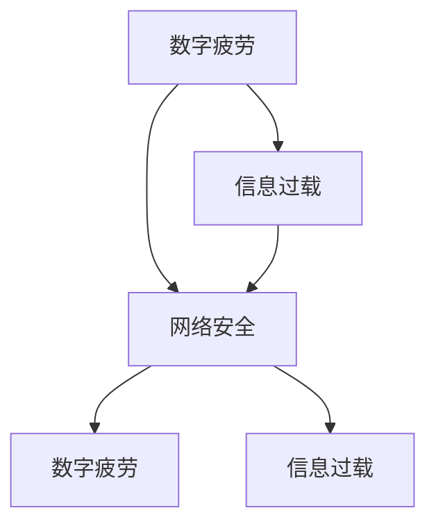

                 

### 文章标题：数字解毒诊所：重建健康网络使用习惯的咨询服务

---

关键词：数字解毒、健康网络使用习惯、诊断工具、算法、数学模型、实战案例

---

#### 摘要：

随着数字化时代的到来，网络使用已经成为人们日常生活中不可或缺的一部分。然而，不健康的网络使用习惯可能导致数字疲劳、信息过载和网络安全问题，严重影响到个人的身心健康。本文旨在通过数字解毒诊所的咨询服务，帮助用户重建健康网络使用习惯。我们将从背景介绍、核心概念与联系、诊断工具与方法、健康网络使用习惯重建、算法与工具应用、数学模型与风险评估、实战案例研究等多个方面进行深入探讨，为用户提供系统化的解决方案。

---

### 引言

#### 数字环境和网络使用习惯的影响

数字化时代的到来，极大地改变了人们的生活方式。网络使用已成为日常生活中不可或缺的一部分。然而，随着网络使用的普及，人们开始面临诸多健康问题。首先，数字疲劳（Digital Fatigue）逐渐成为现代人的普遍问题。长时间沉浸在屏幕前，容易导致视觉疲劳、精神不振和睡眠障碍。其次，信息过载（Information Overload）也是一个严重的问题。网络上的信息量庞大，用户常常感到难以筛选和处理，进而产生焦虑和压力。此外，网络安全问题也日益突出，网络钓鱼、恶意软件等威胁不断增多，用户需要花费大量时间和精力来维护网络安全。

#### 本文的目的与结构

本文旨在通过数字解毒诊所的咨询服务，帮助用户重建健康网络使用习惯。我们将首先介绍数字环境和网络使用习惯对健康的影响，然后探讨与数字解毒和健康网络使用习惯相关的核心概念，包括数字疲劳、信息过载和网络安全。接下来，我们将介绍如何使用诊断工具和方法来诊断个人的网络使用习惯，并详细讲解如何重建健康的网络使用习惯。此外，我们还将介绍相关算法和工具的应用，以及如何使用数学模型进行风险评估。最后，通过实战案例研究，展示如何将上述概念和方法应用于实际场景中。

---

### 核心概念与联系

#### 数字疲劳

数字疲劳是指由于长时间使用电子设备（如手机、电脑等）而引起的一系列身体和心理不适。其症状包括眼睛疲劳、头痛、肩颈疼痛、失眠、注意力不集中等。数字疲劳的产生主要是由于屏幕发出的蓝光对生物钟的干扰，以及长时间保持同一姿势导致的身体疲劳。

#### 信息过载

信息过载是指个体在处理信息时，由于信息量过大而导致的处理困难，从而产生焦虑、压力和疲劳感。在数字化时代，网络上的信息量庞大，用户常常感到难以筛选和处理，进而产生焦虑和压力。信息过载不仅影响个体的心理健康，还会降低工作效率和生活质量。

#### 网络安全

网络安全是指网络系统的硬件、软件以及数据受到保护，不因偶然的或者恶意的原因而遭到破坏、更改、泄露，系统连续可靠正常地运行，网络服务不中断。网络安全问题主要包括网络钓鱼、恶意软件、数据泄露等。网络安全问题不仅影响个人的隐私和安全，还可能对企业造成巨大的经济损失。

#### 概念联系与综合影响

数字疲劳、信息过载和网络安全三者之间存在着密切的联系。数字疲劳和信息过载常常是导致网络安全问题的原因之一，而网络安全问题的发生又可能加重数字疲劳和信息过载。因此，解决数字疲劳、信息过载和网络安全问题，需要从多个方面进行综合考虑和治理。

#### Mermaid 流程图

以下是一个简化的 Mermaid 流程图，展示了数字疲劳、信息过载和网络安全之间的关系：

---

### 诊断工具与方法

#### 诊断工具介绍

为了帮助用户了解自己的网络使用习惯，并找到潜在的健康问题，我们可以使用一些专业的诊断工具。以下是一些常用的诊断工具：

1. **NetAnalysis**：NetAnalysis 是一款功能强大的网络流量分析工具，可以帮助用户了解网络流量情况，识别异常流量和潜在的安全威胁。
2. **NetLimiter**：NetLimiter 是一款网络带宽管理工具，可以帮助用户控制网络带宽的使用，避免网络拥堵和延迟。
3. **Sleep Cycle**：Sleep Cycle 是一款睡眠监测应用，可以帮助用户了解自己的睡眠质量和睡眠周期，从而调整作息时间，减少数字疲劳。

#### 诊断流程与方法

1. **数据收集**：使用诊断工具收集用户网络使用数据，包括流量、使用时间、网站访问记录等。
2. **数据分析**：对收集到的数据进行分析，识别网络使用中的潜在问题和健康风险。
3. **问题识别**：根据数据分析结果，识别用户存在的数字疲劳、信息过载和网络安全问题。
4. **解决方案建议**：根据问题识别结果，提出针对性的解决方案，帮助用户重建健康的网络使用习惯。

#### 实际应用示例

假设一个用户使用 NetAnalysis 工具进行诊断，发现其网络流量主要集中在社交媒体和游戏网站上。通过进一步分析，发现该用户每天花费大量时间在这些网站上，导致数字疲劳和信息过载。针对这个问题，我们可以提出以下解决方案：

1. **限制社交媒体使用时间**：通过设置定时提醒和应用程序限制，减少用户在社交媒体上的时间。
2. **优化网络带宽管理**：通过 NetLimiter 工具，限制游戏网站和其他高带宽消耗的网站的使用，确保网络流畅。
3. **改善睡眠质量**：使用 Sleep Cycle 应用，调整作息时间，确保充足的睡眠，减少数字疲劳。

---

### 健康网络使用习惯重建

#### 行为改变心理学原理

要重建健康的网络使用习惯，行为改变心理学原理至关重要。以下是一些常用的行为改变技巧：

1. **正面激励**：通过奖励机制来激励用户改变网络使用习惯。例如，用户可以在坚持健康网络使用习惯后，给自己一些小奖励，如购买一件喜欢的物品或享受一顿美食。
2. **逐步减少**：逐步减少网络使用时间，避免突然减少导致的心理不适。例如，用户可以从每天减少半小时的使用时间开始，逐渐增加至理想的使用时间。
3. **替代活动**：寻找替代活动来填补网络使用的时间，如阅读书籍、锻炼身体或与家人朋友互动，减少对网络的依赖。

#### 心理技巧与实践

1. **设定明确目标**：明确健康网络使用习惯的目标，并将其分解为具体的小目标。例如，用户可以设定每天使用网络不超过两小时的目标，并逐步实现。
2. **记录与反思**：记录自己的网络使用情况，并定期反思。这有助于用户了解自己的网络使用习惯，并找到改进的方法。
3. **寻求支持**：与家人朋友分享自己的网络使用目标，并寻求他们的支持和鼓励。这有助于提高用户的自律性和坚持力。

#### 长期坚持与健康网络使用习惯的建立

1. **制定计划**：制定详细的网络使用计划，包括每天的时间安排、活动安排和目标实现进度。
2. **自我监督**：定期检查自己的网络使用情况，确保符合健康网络使用习惯的目标。
3. **寻求专业帮助**：如果用户遇到困难，可以寻求心理咨询师或专业医生的帮助，以获得更全面的指导和支持。

---

### 算法与工具应用

#### 可用算法介绍

为了帮助用户重建健康的网络使用习惯，我们可以使用多种算法和工具。以下是一些常用的算法：

1. **时间序列分析**：时间序列分析是一种用于分析时间序列数据的方法，可以帮助用户了解自己的网络使用趋势。通过时间序列分析，用户可以识别出高网络使用时段，并相应调整自己的作息时间。
2. **聚类分析**：聚类分析是一种用于将数据分为相似群体的方法，可以帮助用户识别出与自己相似的网络使用习惯人群，并借鉴他们的成功经验。
3. **机器学习算法**：机器学习算法可以帮助用户预测未来的网络使用行为，并提供个性化的建议。例如，基于用户的网络使用历史，机器学习算法可以预测用户在未来一段时间内的网络使用情况，并给出相应的建议。

#### 工具的选择与应用

1. **使用时间限制工具**：如我们之前提到的 NetLimiter，可以帮助用户限制网络使用时间，确保健康网络使用习惯的建立。
2. **行为改变工具**：如 Habitica，一款结合游戏元素和任务管理功能的应用，可以帮助用户通过完成任务来逐步改善网络使用习惯。
3. **数据分析工具**：如 Tableau 或 Power BI，可以帮助用户对网络使用数据进行分析，了解自己的网络使用趋势和问题。

#### 实际案例分析

假设一个用户希望通过算法和工具来改善自己的网络使用习惯。以下是具体的案例分析：

1. **数据收集**：用户使用 NetLimiter 和 Tableau 收集自己的网络使用数据，包括使用时间、网站访问记录等。
2. **数据分析**：使用时间序列分析和聚类分析，分析用户的数据，识别出高网络使用时段和与自己相似的用户群体。
3. **算法预测**：使用机器学习算法，预测用户在未来一段时间内的网络使用行为，并提供个性化的建议。
4. **工具应用**：根据分析结果和建议，用户设置 NetLimiter 的使用时间限制，并使用 Habitica 完成任务来逐步改善网络使用习惯。

通过这个案例，我们可以看到如何使用算法和工具来帮助用户重建健康的网络使用习惯。

---

### 数学模型与风险评估

#### 常见数学模型

在健康网络使用习惯的重建过程中，数学模型可以发挥重要作用。以下是一些常见的数学模型：

1. **风险评估模型**：风险评估模型可以帮助用户评估当前网络使用习惯对健康的潜在风险。例如，我们可以使用概率模型来评估网络使用导致的数字疲劳和信息过载的风险。
2. **决策树模型**：决策树模型可以帮助用户根据不同情况选择最佳的策略。例如，根据用户的网络使用数据和健康指标，决策树模型可以提供个性化的网络使用建议。
3. **回归模型**：回归模型可以帮助用户预测未来的网络使用行为对健康的潜在影响。例如，我们可以使用线性回归模型来预测网络使用时间与健康指标之间的关系。

#### 风险评估方法

1. **定性风险评估**：定性风险评估通过专家意见、调查问卷等方法来评估网络使用习惯的风险。这种方法简单直观，但可能存在主观性。
2. **定量风险评估**：定量风险评估通过数据分析和数学模型来评估网络使用习惯的风险。这种方法更加客观，但需要一定的数据收集和分析能力。

#### 模型应用实例

假设我们使用风险评估模型来评估一个用户的网络使用习惯。以下是具体的实例：

1. **数据收集**：收集用户网络使用数据，包括使用时间、网站访问记录、健康指标（如睡眠质量、精神状态等）。
2. **模型训练**：使用历史数据训练风险评估模型，如概率模型或决策树模型。
3. **风险评估**：使用训练好的模型评估用户的网络使用习惯对健康的潜在风险。
4. **风险报告**：生成风险评估报告，提供具体的建议和改进措施。

通过这个实例，我们可以看到如何使用数学模型和风险评估方法来帮助用户重建健康的网络使用习惯。

---

### 实战案例研究

#### 案例一：数字疲劳缓解

**案例背景**：小李是一名程序员，每天需要长时间使用电脑编写代码和浏览网页。他经常感到眼睛疲劳、头痛和肩颈疼痛，影响了工作效率和生活质量。

**解决方案**：

1. **使用时间限制工具**：小李使用 NetLimiter 设置了每天使用电脑的时间限制，避免长时间连续工作。
2. **定期休息**：小李遵循“20-20-20”原则，即每工作20分钟，休息20秒，并远眺20英尺以外的景物，缓解眼睛疲劳。
3. **锻炼身体**：小李定期进行颈部和肩部的锻炼，改善肩颈疼痛。

**效果分析**：经过一段时间的实践，小李的数字疲劳症状明显缓解，工作效率和生活质量得到了显著提高。

#### 案例二：信息过载管理

**案例背景**：小王是一名市场营销从业者，每天需要处理大量的电子邮件、社交媒体消息和新闻资讯。他感到信息过载，经常感到焦虑和压力。

**解决方案**：

1. **使用邮件管理工具**：小王使用 Boomerang 应用来管理电子邮件，设置自动回复和邮件优先级，减少未读邮件数量。
2. **信息筛选**：小王制定了一个信息筛选策略，仅关注与工作相关的信息，减少不必要的干扰。
3. **替代活动**：小王在处理信息的过程中，穿插进行阅读书籍、锻炼身体等活动，提高处理信息的效率。

**效果分析**：通过这些措施，小王的信息过载问题得到了有效缓解，焦虑和压力减轻，工作效率显著提高。

#### 案例三：网络安全维护

**案例背景**：小张是一名创业者，他的公司业务涉及大量敏感数据。然而，他发现自己经常受到网络钓鱼和恶意软件的攻击，对公司造成了潜在的安全风险。

**解决方案**：

1. **使用网络安全工具**：小张使用了多个网络安全工具，如 Malwarebytes 和 NordVPN，保护公司电脑和网络安全。
2. **员工培训**：小张对公司员工进行了网络安全培训，提高员工的网络安全意识和应对能力。
3. **定期检查**：小张定期检查公司网络设备，确保所有软件和系统都是最新的，以防止潜在的安全漏洞。

**效果分析**：经过一段时间的实践，小张公司的网络安全状况得到了显著改善，网络攻击事件显著减少，公司数据得到了有效保护。

#### 案例总结与经验分享

通过以上案例，我们可以看到，数字解毒诊所的咨询服务在帮助用户重建健康网络使用习惯方面取得了显著成效。以下是一些总结和经验分享：

1. **个性化方案**：针对不同用户的需求和问题，制定个性化的解决方案，更有效果。
2. **工具应用**：使用合适的工具，如时间限制工具、邮件管理工具和网络安全工具，可以帮助用户更好地管理网络使用习惯。
3. **行为改变**：通过行为改变技巧，如设定明确目标、记录与反思、寻求支持等，可以帮助用户逐步改善网络使用习惯。
4. **持续监督**：定期检查和监督网络使用情况，确保健康网络使用习惯的建立和维持。

---

### 最佳实践 Tips、小结、注意事项、拓展阅读

#### 最佳实践 Tips

1. **设定明确目标**：明确自己的网络使用目标，并制定详细的计划，有助于实现健康网络使用习惯。
2. **定期休息**：遵循“20-20-20”原则，定期休息和远眺，缓解眼睛疲劳。
3. **多样化活动**：在工作之余，参与多样化的活动，如锻炼身体、阅读书籍、与家人朋友互动等，减少对网络的依赖。
4. **网络安全意识**：提高网络安全意识，定期更新软件和系统，使用强密码和双因素认证，防止网络攻击。

#### 小结

本文通过数字解毒诊所的咨询服务，探讨了如何重建健康的网络使用习惯。从诊断工具与方法、算法与工具应用、数学模型与风险评估、实战案例研究等多个方面，为用户提供了一套系统化的解决方案。通过实践，用户可以逐步改善网络使用习惯，提高工作效率和生活质量。

#### 注意事项

1. **不要过度依赖工具**：工具可以帮助用户改善网络使用习惯，但关键在于用户自身的自觉和坚持。
2. **定期评估和调整**：定期评估自己的网络使用情况，并根据评估结果调整策略，以确保健康网络使用习惯的持续维持。
3. **寻求专业帮助**：如果用户遇到困难，可以寻求心理咨询师或专业医生的帮助，以获得更全面的指导和支持。

#### 拓展阅读

1. **《网络成瘾：诊断与治疗》**：深入了解网络成瘾的诊断与治疗方法，有助于用户更好地管理自己的网络使用习惯。
2. **《数字健康：打造健康网络生活》**：探讨如何通过生活方式的改变，实现数字健康，提升生活质量。
3. **《网络安全指南》**：提供全面的网络安全知识和技巧，帮助用户保护自己的网络安全。

---

### 结束语

数字解毒诊所的咨询服务旨在帮助用户重建健康的网络使用习惯，提高工作效率和生活质量。通过本文的探讨，我们了解到了数字疲劳、信息过载和网络安全等问题，以及如何使用诊断工具、算法和数学模型来改善网络使用习惯。希望本文能为广大用户提供有益的参考和指导。

---

### 作者信息

作者：AI天才研究院/AI Genius Institute & 禅与计算机程序设计艺术 /Zen And The Art of Computer Programming

---

在数字化时代，健康网络使用习惯的建立至关重要。希望本文能为广大用户提供启示，帮助大家更好地管理自己的网络使用，享受健康、高效的生活。

