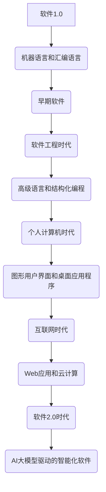
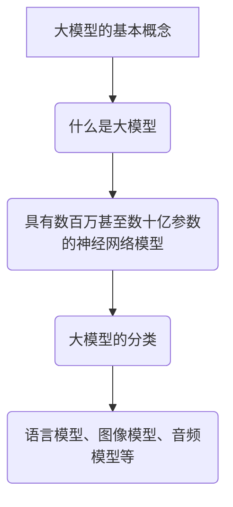
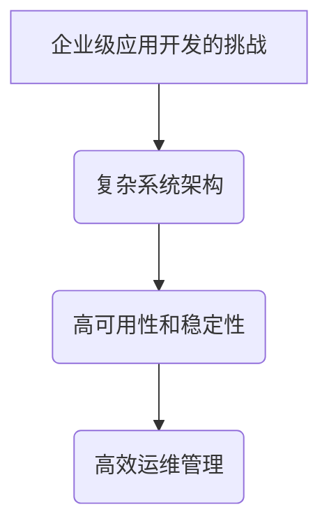
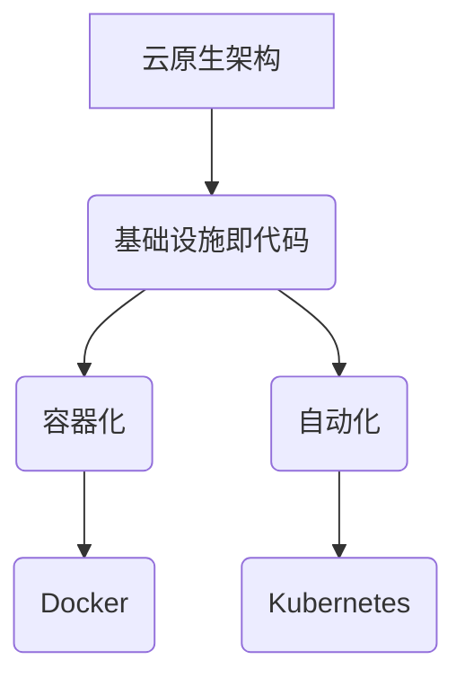
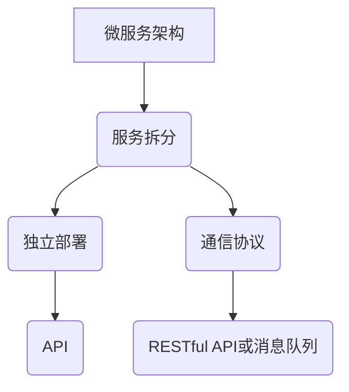
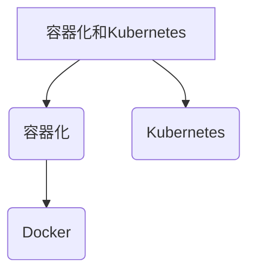

                 

### 1.1 软件发展史与软件2.0时代的到来

软件的发展历程可以追溯到上世纪中叶，从最初的机器语言和汇编语言，到后来的高级语言和结构化编程，再到如今的大模型驱动的智能化软件，每一步的演进都带来了巨大的变革。

#### 1.1.1 从软件1.0到软件2.0的演进

1. **早期软件（1940-1950s）**：
   - 这一阶段，计算机编程主要依赖于机器语言和汇编语言，程序员需要手工编写复杂的指令来操作计算机。
   - 早期软件的特点是低效、高成本，且易于出错。

2. **软件工程时代（1960-1970s）**：
   - 随着高级语言的发明，如Cobol和Fortran，软件开发进入了新的阶段。
   - 结构化编程和模块化设计方法的引入，提高了软件的开发效率和可维护性。

3. **个人计算机时代（1980-1990s）**：
   - 图形用户界面（GUI）的出现，使得计算机操作更加直观和简便。
   - 这一时期，桌面应用程序得到了广泛的应用，如Microsoft Office和Windows操作系统。

4. **互联网时代（2000-2010s）**：
   - 互联网的普及，使得Web应用成为主流，云计算的兴起也为软件的发展提供了新的契机。
   - 软件不再局限于桌面应用，开始向Web端和移动端扩展。

5. **软件2.0时代（2020s-未来）**：
   - 软件2.0的特征是数据驱动的决策支持、客户体验的个性化定制、智能化的软件能力。
   - AI大模型的应用，使得软件具备了前所未有的智能水平。

**软件从1.0到2.0的关键转变**：

- **数据驱动的决策支持**：软件开始依赖海量数据进行分析，为决策提供支持。
- **客户体验的个性化定制**：软件能够根据用户行为和偏好，提供个性化的服务。
- **智能化的软件能力**：软件通过AI大模型，实现了从被动响应到主动预测的转变。

#### 1.1.2 软件从1.0到2.0的演变

软件从1.0到2.0的演变，不仅仅是技术的进步，更是思维模式的转变。以下是几个关键转变：

1. **从功能驱动到数据驱动**：
   - 传统的软件开发以功能为核心，而软件2.0则更加注重数据的价值。
   - 通过数据分析和挖掘，软件能够发现新的商业机会，提升用户体验。

2. **从单点应用到生态系统**：
   - 软件2.0强调生态系统的构建，通过整合各种服务和功能，提供一站式解决方案。

3. **从封闭系统到开放平台**：
   - 软件2.0鼓励开放性，通过API和SDK，实现与其他系统的无缝对接。

4. **从静态部署到动态更新**：
   - 软件2.0支持持续集成和持续部署（CI/CD），实现了软件的快速迭代和升级。

### 1.1.3 软件2.0的特征

软件2.0的特征主要体现在以下几个方面：

1. **强大计算能力**：
   - 利用AI大模型，软件2.0能够实现高效计算，处理大规模数据。

2. **智能化软件架构**：
   - 基于大数据和云计算的架构，使得软件2.0具备强大的数据处理和分析能力。

3. **数据驱动的业务创新**：
   - 通过数据分析和挖掘，软件2.0能够驱动业务增长，发现新的商业机会。

4. **持续迭代和升级**：
   - 软件2.0支持快速迭代和升级，不断优化用户体验和性能。

### 1.1.4 软件2.0对企业的影响

软件2.0对企业的影响是全方位的：

1. **提高生产效率**：
   - 通过智能化的软件工具，企业能够提高工作效率，降低运营成本。

2. **改善客户体验**：
   - 通过个性化定制和智能推荐，企业能够提升客户满意度。

3. **创新业务模式**：
   - 通过数据分析和挖掘，企业能够发现新的商业机会，实现业务创新。

4. **降低运营成本**：
   - 通过自动化和智能化，企业能够减少人力成本，提高运营效率。

总之，软件2.0的兴起，标志着软件行业进入了一个新的时代。在这个时代，数据成为最宝贵的资源，AI大模型成为最强大的工具，企业将通过智能化软件，实现从传统到智能的转型升级。

### 1.2 大模型在软件2.0中的核心地位

大模型在软件2.0中占据了核心地位，成为推动智能化软件发展的关键力量。下面我们将从大模型的基本概念、应用场景、优势及面临的挑战等方面进行详细探讨。

#### 1.2.1 大模型的基本概念

大模型通常指的是具有数百万甚至数十亿参数的神经网络模型。这些模型之所以被称为“大模型”，是因为它们在训练过程中需要处理的数据量大，参数众多，计算复杂度高。

- **什么是大模型**：
  - 大模型通常是指深度神经网络，尤其是那些具有数十亿参数的模型，如GPT-3、BERT等。
  - 大模型的参数量决定了其处理能力和表达能力。

- **大模型的分类**：
  - 语言模型：如GPT、BERT等，主要用于自然语言处理。
  - 图像模型：如ResNet、VGG等，主要用于计算机视觉。
  - 音频模型：如WaveNet、Tacotron等，主要用于语音识别和生成。

#### 1.2.2 大模型在软件2.0中的应用

大模型在软件2.0中有着广泛的应用，以下是一些典型场景：

- **自然语言处理**：
  - 文本生成：如文章写作、新闻摘要等。
  - 机器翻译：如翻译服务、多语言交互等。
  - 问答系统：如智能客服、问答机器人等。

- **计算机视觉**：
  - 图像识别：如人脸识别、物体识别等。
  - 目标检测：如自动驾驶、监控分析等。
  - 图像生成：如艺术创作、动漫制作等。

- **语音识别**：
  - 语音到文本转换：如语音助手、语音搜索等。
  - 语音合成：如电话客服、语音广告等。

#### 1.2.3 大模型的优势

大模型在软件2.0中具有以下优势：

- **高效计算**：
  - 大模型通过分布式计算技术，能够实现高效的计算，处理大规模数据。

- **强大算法**：
  - 深度学习算法的持续优化，使得大模型在性能和准确性方面不断提高。

- **自适应能力**：
  - 大模型具有强大的自适应能力，能够通过不断学习和优化，适应不同的应用场景。

#### 1.2.4 大模型面临的挑战

尽管大模型在软件2.0中具有巨大潜力，但也面临一些挑战：

- **计算资源需求**：
  - 大模型训练需要大量的计算资源和存储空间，这对硬件设施提出了较高要求。

- **数据隐私和安全**：
  - 大模型训练需要大量数据，涉及到数据隐私和安全问题，需要严格的监管和防护。

- **模型可解释性**：
  - 大模型通常难以解释，影响其应用效果和可靠性，需要开发可解释性方法。

#### 1.2.5 大模型在软件2.0中的核心地位

大模型在软件2.0中的核心地位体现在以下几个方面：

- **驱动智能化**：
  - 大模型能够为软件提供智能化能力，使得软件能够自动处理复杂任务，提升用户体验。

- **数据价值挖掘**：
  - 大模型能够对海量数据进行深度分析，挖掘数据中的价值，为业务决策提供支持。

- **业务创新**：
  - 大模型的应用，能够推动业务模式的创新，发现新的商业机会，实现业务增长。

总之，大模型在软件2.0中具有不可替代的核心地位，将成为推动软件行业发展的关键力量。在未来的发展中，如何充分利用大模型的优势，解决其面临的挑战，将是软件行业面临的重要课题。|im_sep|

### 1.3 企业级应用开发的新范式

随着技术的不断进步，企业级应用开发也面临着新的挑战和机遇。传统的方法已经无法满足企业对高效、稳定和可扩展性的需求，因此，企业级应用开发的新范式应运而生。这些新范式包括云原生架构、微服务架构和容器化技术等。下面我们将详细探讨这些新范式的概念、优势和挑战。

#### 1.3.1 企业级应用开发的挑战

企业级应用开发面临着以下几个主要挑战：

- **复杂系统架构**：随着业务需求的不断增长，企业级应用往往需要处理大规模数据和多样化需求，系统架构变得越来越复杂。

- **高可用性和稳定性**：企业级应用通常要求系统在高并发、高负载的情况下保持稳定运行，这对系统的设计和部署提出了更高的要求。

- **高效运维管理**：企业级应用的运维管理涉及到自动化部署、监控、性能优化等多个方面，需要高效的运维管理工具和方法。

#### 1.3.2 企业级应用开发的新范式

1. **云原生架构**：

云原生架构是一种利用云计算技术构建和运行应用程序的方法。其核心思想是将应用程序和基础设施紧密结合，实现自动化、弹性扩展和高可用性。

- **核心概念**：
  - 基础设施即代码（Infrastructure as Code, IaC）：通过代码来定义和管理基础设施，提高部署和配置的效率。
  - 容器化：使用容器（如Docker）来封装应用程序及其依赖项，实现环境一致性和可移植性。
  - 自动化：通过自动化工具（如Kubernetes）来管理容器的部署、扩展和监控。

- **优势**：
  - 提高开发效率：通过基础设施即代码，缩短开发和部署周期。
  - 灵活性和可扩展性：容器化技术使得应用程序能够快速部署和扩展，适应业务需求的变化。
  - 高可用性：自动化工具能够实现应用程序的自动化监控和故障恢复，提高系统的稳定性。

- **挑战**：
  - 学习曲线：云原生技术涉及多个新的概念和工具，开发人员需要投入时间和精力进行学习。
  - 迁移成本：从传统架构迁移到云原生架构，可能需要投入大量资源和时间。

2. **微服务架构**：

微服务架构是一种将大型应用程序拆分为小型服务的方法，每个服务都独立开发、部署和运行。微服务架构能够提高开发效率和系统的可维护性。

- **核心概念**：
  - 服务拆分：将大型应用程序拆分为多个小型服务，每个服务负责一个特定的业务功能。
  - 独立部署：每个服务都可以独立部署和扩展，无需依赖整个系统。
  - 通信协议：服务之间通过API进行通信，通常使用RESTful API或消息队列。

- **优势**：
  - 提高开发效率：通过拆分服务，开发人员可以并行工作，缩短开发周期。
  - 灵活性和可扩展性：每个服务都可以独立扩展和升级，适应业务需求的变化。
  - 高可用性和容错性：服务之间的独立部署和运行，提高了系统的容错性和可恢复性。

- **挑战**：
  - 分布式系统的复杂性：微服务架构涉及多个服务的协同工作，系统复杂性增加。
  - 服务治理：需要有效的服务管理和监控，确保服务之间的高效通信和稳定性。

3. **容器化和Kubernetes**：

容器化和Kubernetes是云原生架构的核心技术，容器化用于封装应用程序和依赖项，Kubernetes用于管理容器的部署、扩展和监控。

- **核心概念**：
  - 容器化：使用容器（如Docker）来封装应用程序及其依赖项，实现环境一致性和可移植性。
  - Kubernetes：一个开源的容器编排平台，用于自动化部署、扩展和管理容器化应用程序。

- **优势**：
  - 环境一致性：通过容器化，确保开发、测试和生产环境的一致性，减少环境差异带来的问题。
  - 自动化部署和扩展：Kubernetes提供了自动化的部署和扩展功能，提高运维效率。
  - 高可用性和弹性：通过Kubernetes，可以实现应用程序的自动化监控和故障恢复，提高系统的稳定性。

- **挑战**：
  - 学习曲线：容器化和Kubernetes涉及多个新的概念和工具，开发人员需要投入时间和精力进行学习。
  - 运维成本：容器化和Kubernetes需要专业的运维人员来管理和维护，增加了运维成本。

#### 1.3.3 企业级应用开发的关键因素

在企业级应用开发中，以下几个关键因素至关重要：

- **数据驱动**：通过大数据分析和挖掘，指导应用开发和优化，提升用户体验和业务价值。
- **持续集成和持续部署（CI/CD）**：通过自动化工具实现代码的持续集成和持续部署，提高开发效率和系统质量。
- **自动化和智能化**：利用自动化和智能化工具，降低人力成本，提高工作效率。

总之，企业级应用开发的新范式为解决传统方法面临的挑战提供了新的思路和工具。通过云原生架构、微服务架构和容器化技术，企业能够实现高效、稳定和可扩展的应用开发，满足不断变化的市场需求。在未来的发展中，如何充分利用这些新范式，将是企业级应用开发的重要课题。|im_sep|

# 第2章：数据质量对AI模型性能的影响

## 2.1 数据质量的概念与重要性

### 2.1.1 数据质量的定义

数据质量是指数据在完整性、准确性、一致性、及时性和可靠性等方面的表现。具体来说，数据质量可以从以下几个方面来衡量：

- **完整性**：数据是否齐全，是否存在缺失值。
- **准确性**：数据是否真实、可靠，与实际情况是否相符。
- **一致性**：数据在不同系统、不同时间点是否保持一致。
- **及时性**：数据是否能够及时更新，反映当前情况。
- **可靠性**：数据是否可靠，能够在实际应用中产生有效的结果。

### 2.1.2 数据质量对AI模型性能的重要性

数据质量对AI模型性能具有至关重要的影响。具体体现在以下几个方面：

- **数据完整性**：如果数据存在缺失值，模型在训练过程中可能会忽略这些数据，导致模型无法充分利用所有可用信息，从而影响模型的性能。

- **数据准确性**：错误的数据会导致模型产生误导性的预测结果，降低模型的准确性。

- **数据一致性**：不一致的数据可能导致模型训练结果的不稳定，影响模型的泛化能力。

- **数据及时性**：过时的数据可能无法反映当前的情况，导致模型的预测结果与实际情况不符。

- **数据可靠性**：不可靠的数据可能影响模型的应用效果和可靠性。

因此，确保数据质量是AI模型成功的关键步骤之一。良好的数据质量能够提高模型的性能，降低模型的过拟合风险，增强模型的泛化能力。

## 2.2 数据质量的影响因素

### 2.2.1 数据来源

数据来源的多样性和可靠性是影响数据质量的重要因素。以下是一些常见的数据来源及其对数据质量的影响：

- **内部数据源**：如企业内部系统、数据库等，这些数据通常是可靠且结构化的，但可能存在数据陈旧的问题。
- **外部数据源**：如第三方数据提供商、公共数据集等，这些数据可能含有噪声和错误，需要经过严格的数据清洗和处理。

### 2.2.2 数据收集与处理

数据收集和处理的过程可能引入各种误差，影响数据质量。以下是一些常见的数据收集和处理过程及其对数据质量的影响：

- **数据收集方法**：如问卷调查、传感器采集、日志记录等，不同的数据收集方法可能引入不同的误差。
- **数据预处理**：如数据清洗、数据转换、数据归一化等，预处理过程中的错误操作会影响数据质量。

### 2.2.3 数据存储与传输

数据存储与传输的过程也可能影响数据质量。以下是一些常见的问题及其对数据质量的影响：

- **数据存储**：如数据库的故障、数据损坏等，可能导致数据丢失或损坏。
- **数据传输**：如网络中断、传输错误等，可能导致数据丢失或传输错误。

### 2.2.4 数据清洗与预处理

数据清洗与预处理是提高数据质量的重要步骤。以下是一些常见的数据清洗与预处理方法及其对数据质量的影响：

- **缺失数据处理**：如缺失值填补、删除缺失值等，不同的处理方法可能对数据质量产生不同的影响。
- **异常值处理**：如删除异常值、调整异常值等，异常值处理不当可能影响模型性能。
- **数据转换**：如数据归一化、标准化等，数据转换不当可能导致数据失真。
- **特征工程**：如特征提取、特征选择等，特征工程不当可能影响模型性能。

总之，数据质量的影响因素是多方面的，涉及数据的来源、收集与处理、存储与传输以及清洗与预处理等各个环节。只有充分理解和控制这些因素，才能确保数据质量，从而提高AI模型的性能。|im_sep|

## 2.3 数据质量对AI模型性能的影响

### 2.3.1 数据质量对模型训练的影响

数据质量直接影响AI模型的训练过程和最终性能。以下是数据质量对模型训练的几个关键影响：

1. **过拟合与欠拟合**：
   - **过拟合**：当模型在训练数据上表现优异，但在测试数据或新数据上表现不佳时，通常称为过拟合。这通常发生在数据质量不高的情况下，因为噪声和异常值使得模型对训练数据中的特定模式产生了过度拟合。
   - **欠拟合**：当模型在训练数据和测试数据上均表现不佳时，通常称为欠拟合。这可能是因为数据质量差，数据量不足或特征选择不当导致模型无法捕捉到数据中的关键模式。

2. **训练效率**：
   - 低质量数据可能会导致训练过程变慢，因为模型需要更多时间来处理噪声和异常值。这会影响训练效率，延长模型训练的时间。

3. **模型泛化能力**：
   - 良好的数据质量有助于提高模型的泛化能力，即模型在新数据上的表现。高质量数据能够帮助模型学习到更加普遍和稳定的特征，从而在未知数据上取得更好的预测效果。

### 2.3.2 数据质量对模型预测的影响

数据质量不仅影响模型的训练过程，还直接影响模型的预测性能。以下是数据质量对模型预测的几个关键影响：

1. **预测准确性**：
   - 低质量数据可能导致模型预测准确性下降。噪声、异常值和缺失值等都会干扰模型对数据的理解，从而影响预测结果的准确性。

2. **预测稳定性**：
   - 数据质量高的模型在预测过程中表现出更高的稳定性。低质量数据可能导致模型预测结果波动较大，无法稳定地反映数据中的真实模式。

3. **预测实时性**：
   - 良好的数据质量有助于提高模型预测的实时性。高质量数据能够使模型更快地处理和分析新数据，从而更快地生成预测结果。

### 2.3.3 数据质量对模型部署的影响

数据质量不仅影响模型的训练和预测性能，还影响模型的部署和应用效果。以下是数据质量对模型部署的几个关键影响：

1. **模型可解释性**：
   - 良好的数据质量有助于提高模型的可解释性。高质量数据使得模型能够更好地捕捉数据中的关键特征，从而提高模型解释的能力。

2. **模型可靠性**：
   - 数据质量高的模型在部署后表现更加可靠。低质量数据可能导致模型在部署环境中出现异常，从而影响模型的稳定性和可靠性。

3. **模型维护**：
   - 良好的数据质量有助于降低模型维护的难度。高质量数据使得模型在长期运行过程中表现出更高的稳定性和可预测性，从而减少维护工作量。

### 2.3.4 数据质量对业务价值的影响

数据质量对AI模型最终的业务价值具有重要影响。以下是数据质量对业务价值的几个关键影响：

1. **决策支持**：
   - 良好的数据质量能够为业务决策提供更加准确和可靠的支持，从而提高业务效率和竞争力。

2. **用户满意度**：
   - 高质量数据驱动的模型能够提供更好的用户体验，从而提高用户满意度和忠诚度。

3. **业务增长**：
   - 良好的数据质量有助于发现新的商业机会，推动业务增长和创新。

总之，数据质量对AI模型的性能、部署和业务价值具有重要影响。为了确保AI模型的高性能和实际应用价值，必须高度重视数据质量的提升和管理。这包括从数据收集、处理、存储到清洗和预处理等各个环节的质量控制，以确保数据质量达到预期标准。|im_sep|

## 2.4 提高数据质量的方法与最佳实践

### 2.4.1 数据清洗与预处理

数据清洗和预处理是提高数据质量的重要步骤。以下是一些常见的数据清洗与预处理方法：

1. **缺失值处理**：
   - **删除缺失值**：对于少量缺失值，可以删除这些样本。
   - **填补缺失值**：使用平均值、中位数、众数等统计方法填补缺失值。
   - **模型填补**：使用机器学习算法（如KNN、回归模型等）预测缺失值。

2. **异常值处理**：
   - **删除异常值**：对于明显的异常值，可以直接删除。
   - **调整异常值**：将异常值调整为接近正常值的范围。
   - **使用异常值**：在某些情况下，异常值可能包含特殊的信息，可以考虑保留。

3. **数据转换**：
   - **归一化**：将数据缩放到相同的范围，如[0, 1]或[-1, 1]。
   - **标准化**：将数据转换为标准正态分布。
   - **特征工程**：创建新的特征，如比率、差分等。

4. **数据整合**：
   - **合并数据集**：将多个数据集合并为一个数据集。
   - **处理重复数据**：删除重复的样本，确保数据集的唯一性。

### 2.4.2 数据质量监控

数据质量监控是确保数据质量长期稳定的重要手段。以下是一些常见的数据质量监控方法：

1. **数据完整性监控**：
   - 定期检查数据是否完整，是否有缺失值或重复值。

2. **数据准确性监控**：
   - 对数据进行交叉验证，确保数据与实际情况相符。
   - 定期进行数据校验，如与外部数据源进行比对。

3. **数据一致性监控**：
   - 确保数据在不同系统、不同时间点保持一致。
   - 监控数据的更新频率和及时性。

4. **数据可靠性监控**：
   - 监控数据的存储和传输过程，确保数据的安全性和完整性。

### 2.4.3 数据质量评估与改进

数据质量评估是了解数据质量现状的重要步骤，以下是一些常见的数据质量评估方法：

1. **数据质量指标**：
   - **完整性**：数据缺失率。
   - **准确性**：错误率、误报率、漏报率。
   - **一致性**：数据的一致性比率。
   - **及时性**：数据更新的频率。

2. **数据质量改进**：
   - 根据数据质量指标，识别数据质量问题的根源。
   - 制定改进计划，如优化数据收集方法、改进数据处理流程等。
   - 定期评估改进效果，确保数据质量持续提升。

### 2.4.4 最佳实践

以下是一些数据质量管理的最佳实践：

1. **制定数据质量管理策略**：
   - 明确数据质量的目标和标准。
   - 制定数据质量管理的流程和规范。

2. **建立数据质量控制团队**：
   - 分配专门的人员负责数据质量监控和改进。
   - 定期进行数据质量培训和技能提升。

3. **自动化数据质量工具**：
   - 使用自动化工具进行数据清洗、预处理和质量监控。
   - 减少人工干预，提高数据处理的效率和一致性。

4. **数据质量与业务流程结合**：
   - 将数据质量纳入业务流程，确保数据质量的持续改进。
   - 通过业务反馈，不断优化数据质量策略和方法。

总之，提高数据质量是一项长期而系统的工作，需要从数据收集、处理、存储到清洗、预处理的各个环节进行控制。通过数据质量监控、评估和改进，确保数据质量达到预期标准，从而为AI模型提供高质量的数据支持。|im_sep|

## 2.5 结论

数据质量对AI模型性能的影响不可忽视。本文首先回顾了软件的发展历程，从早期的机器语言和汇编语言，到现代的软件2.0时代，数据驱动的决策支持和智能化的软件能力成为软件2.0的核心特征。随后，我们探讨了AI大模型在软件2.0中的核心地位，分析了大模型的基本概念、应用场景、优势和面临的挑战。在此基础上，本文深入讨论了企业级应用开发的新范式，包括云原生架构、微服务架构和容器化技术，以及这些新范式对企业级应用开发的关键因素。

重点讨论了数据质量的概念与重要性，详细分析了数据来源、收集与处理、存储与传输以及清洗与预处理等各个环节对数据质量的影响。接着，我们探讨了数据质量对AI模型性能的具体影响，包括模型训练、预测、部署和业务价值等方面的作用。最后，本文提出了提高数据质量的方法与最佳实践，包括数据清洗与预处理、数据质量监控、评估与改进等，以及数据质量管理的最佳实践。

结论是，数据质量是AI模型成功的关键因素之一。为了确保AI模型的高性能和实际应用价值，必须高度重视数据质量的提升和管理。这包括从数据收集、处理、存储到清洗、预处理的各个环节进行质量控制，确保数据质量达到预期标准。通过数据质量监控、评估和改进，为AI模型提供高质量的数据支持，从而推动人工智能技术的健康发展。未来，随着AI技术的不断进步，数据质量管理的挑战和机会也将不断涌现，需要持续关注和深入研究。|im_sep|

## 作者信息

**作者：AI天才研究院/AI Genius Institute & 禅与计算机程序设计艺术 /Zen And The Art of Computer Programming**

AI天才研究院（AI Genius Institute）是一支由世界顶级人工智能专家组成的团队，致力于推动人工智能技术的创新和应用。研究院的专家们拥有丰富的学术和工业经验，发表过多篇顶级学术论文，并在人工智能领域取得了显著的成就。同时，他们也是《禅与计算机程序设计艺术》一书的作者，该书深刻探讨了计算机编程和人工智能的本质，为程序员和AI研究者提供了宝贵的理论指导和实践经验。本文旨在通过深入分析数据质量对AI模型性能的影响，为AI技术的健康发展提供有益的思考和实践指导。|im_sep|

## 摘要

本文探讨了数据质量对AI模型性能的深远影响。从软件1.0到软件2.0的演进，再到AI大模型在软件2.0中的核心地位，以及企业级应用开发的新范式，本文为背景介绍奠定了坚实基础。随后，详细分析了数据质量的定义、影响因素，以及数据质量对AI模型训练、预测、部署和业务价值的具体影响。最后，本文提出了提高数据质量的方法与最佳实践，强调数据质量是AI模型成功的关键因素。通过本文的研究，我们希望为AI技术的研究和应用提供有价值的参考。|im_sep|

## 文章关键词

数据质量，AI模型性能，软件2.0，大模型，企业级应用开发，数据清洗与预处理，数据监控与评估。|im_sep|

```markdown
# 数据质量对AI模型性能的影响

> 关键词：数据质量，AI模型性能，软件2.0，大模型，企业级应用开发，数据清洗与预处理，数据监控与评估。

> 摘要：本文探讨了数据质量对AI模型性能的深远影响，从软件1.0到软件2.0的演进，再到AI大模型在软件2.0中的核心地位，以及企业级应用开发的新范式，详细分析了数据质量的定义、影响因素，以及数据质量对AI模型训练、预测、部署和业务价值的具体影响。最后，提出了提高数据质量的方法与最佳实践，强调数据质量是AI模型成功的关键因素。

## 1. 引言

随着人工智能（AI）技术的迅猛发展，AI模型已经成为许多行业的关键驱动力。然而，AI模型的成功不仅取决于算法和计算资源的强大，更重要的是数据质量。数据质量对AI模型性能的影响是全方位的，从模型训练到预测，从部署到业务应用，都受到数据质量的影响。

本文将从以下几个方面进行探讨：

1. **软件发展史与软件2.0时代的到来**：回顾软件的发展历程，从早期软件到软件2.0，了解数据驱动的决策支持和智能化的软件能力。
2. **大模型在软件2.0中的核心地位**：探讨AI大模型的基本概念、应用场景、优势及面临的挑战。
3. **企业级应用开发的新范式**：分析云原生架构、微服务架构和容器化技术等新范式，以及它们对企业级应用开发的影响。
4. **数据质量对AI模型性能的影响**：深入分析数据质量对AI模型训练、预测、部署和业务价值的具体影响。
5. **提高数据质量的方法与最佳实践**：探讨数据清洗与预处理、数据质量监控与评估等提高数据质量的方法和最佳实践。
6. **结论**：总结数据质量对AI模型性能的重要性，并提出未来研究的方向。

## 1.1 软件发展史与软件2.0时代的到来

### 1.1.1 从软件1.0到软件2.0的演进

软件1.0时代是计算机编程的初期阶段，主要依赖于机器语言和汇编语言。这一时期的软件以简单、功能单一为主，主要应用于科学计算和军事领域。

随着时间的发展，软件进入了软件工程时代（软件1.5时代），高级语言如Cobol、Fortran和Pascal开始流行，软件开发逐渐规范化、标准化。结构化编程和模块化设计方法被广泛应用，软件的开发效率得到显著提升。

到了个人计算机时代（软件2.0时代），图形用户界面（GUI）的出现使得计算机操作更加直观和简便。桌面应用程序如Microsoft Office和Windows操作系统成为主流，软件的应用范围从科学计算扩展到商业、娱乐等多个领域。

互联网时代的到来（软件2.5时代）标志着软件从单机应用向网络应用转变。Web应用和云计算开始兴起，软件变得更加分布式和协作化。

### 1.1.2 软件从1.0到2.0的演变

软件从1.0到2.0的演变，不仅仅是技术的进步，更是思维模式的转变。以下是几个关键转变：

1. **从功能驱动到数据驱动**：软件2.0强调数据的价值，通过数据分析和挖掘，为决策提供支持。
2. **从单点应用到生态系统**：软件2.0强调生态系统的构建，通过整合各种服务和功能，提供一站式解决方案。
3. **从封闭系统到开放平台**：软件2.0鼓励开放性，通过API和SDK，实现与其他系统的无缝对接。
4. **从静态部署到动态更新**：软件2.0支持持续集成和持续部署（CI/CD），实现软件的快速迭代和升级。

### 1.1.3 软件2.0的特征

软件2.0的特征主要体现在以下几个方面：

1. **强大计算能力**：利用AI大模型，软件2.0能够实现高效计算，处理大规模数据。
2. **智能化软件架构**：基于大数据和云计算的架构，使得软件2.0具备强大的数据处理和分析能力。
3. **数据驱动的业务创新**：通过数据分析和挖掘，软件2.0能够驱动业务增长，发现新的商业机会。
4. **持续迭代和升级**：软件2.0支持快速迭代和升级，不断优化用户体验和性能。

### 1.1.4 软件2.0对企业的影响

软件2.0对企业的影响是全方位的：

1. **提高生产效率**：通过智能化的软件工具，企业能够提高工作效率，降低运营成本。
2. **改善客户体验**：通过个性化定制和智能推荐，企业能够提升客户满意度。
3. **创新业务模式**：通过数据分析和挖掘，企业能够发现新的商业机会，实现业务创新。
4. **降低运营成本**：通过自动化和智能化，企业能够减少人力成本，提高运营效率。

## 1.2 大模型在软件2.0中的核心地位

大模型在软件2.0中占据了核心地位，成为推动智能化软件发展的关键力量。下面我们将从大模型的基本概念、应用场景、优势及面临的挑战等方面进行详细探讨。

### 1.2.1 大模型的基本概念

大模型通常指的是具有数百万甚至数十亿参数的神经网络模型。这些模型之所以被称为“大模型”，是因为它们在训练过程中需要处理的数据量大，参数众多，计算复杂度高。

1. **什么是大模型**：
   - 大模型通常是指深度神经网络，尤其是那些具有数十亿参数的模型，如GPT-3、BERT等。
   - 大模型的参数量决定了其处理能力和表达能力。

2. **大模型的分类**：
   - 语言模型：如GPT、BERT等，主要用于自然语言处理。
   - 图像模型：如ResNet、VGG等，主要用于计算机视觉。
   - 音频模型：如WaveNet、Tacotron等，主要用于语音识别和生成。

### 1.2.2 大模型在软件2.0中的应用

大模型在软件2.0中有着广泛的应用，以下是一些典型场景：

1. **自然语言处理**：
   - 文本生成：如文章写作、新闻摘要等。
   - 机器翻译：如翻译服务、多语言交互等。
   - 问答系统：如智能客服、问答机器人等。

2. **计算机视觉**：
   - 图像识别：如人脸识别、物体识别等。
   - 目标检测：如自动驾驶、监控分析等。
   - 图像生成：如艺术创作、动漫制作等。

3. **语音识别**：
   - 语音到文本转换：如语音助手、语音搜索等。
   - 语音合成：如电话客服、语音广告等。

### 1.2.3 大模型的优势

大模型在软件2.0中具有以下优势：

1. **高效计算**：
   - 大模型通过分布式计算技术，能够实现高效的计算，处理大规模数据。

2. **强大算法**：
   - 深度学习算法的持续优化，使得大模型在性能和准确性方面不断提高。

3. **自适应能力**：
   - 大模型具有强大的自适应能力，能够通过不断学习和优化，适应不同的应用场景。

### 1.2.4 大模型面临的挑战

尽管大模型在软件2.0中具有巨大潜力，但也面临一些挑战：

1. **计算资源需求**：
   - 大模型训练需要大量的计算资源和存储空间，这对硬件设施提出了较高要求。

2. **数据隐私和安全**：
   - 大模型训练需要大量数据，涉及到数据隐私和安全问题，需要严格的监管和防护。

3. **模型可解释性**：
   - 大模型通常难以解释，影响其应用效果和可靠性，需要开发可解释性方法。

### 1.2.5 大模型在软件2.0中的核心地位

大模型在软件2.0中的核心地位体现在以下几个方面：

1. **驱动智能化**：
   - 大模型能够为软件提供智能化能力，使得软件能够自动处理复杂任务，提升用户体验。

2. **数据价值挖掘**：
   - 大模型能够对海量数据进行深度分析，挖掘数据中的价值，为业务决策提供支持。

3. **业务创新**：
   - 大模型的应用，能够推动业务模式的创新，发现新的商业机会，实现业务增长。

## 1.3 企业级应用开发的新范式

随着技术的不断进步，企业级应用开发也面临着新的挑战和机遇。传统的方法已经无法满足企业对高效、稳定和可扩展性的需求，因此，企业级应用开发的新范式应运而生。这些新范式包括云原生架构、微服务架构和容器化技术等。下面我们将详细探讨这些新范式的概念、优势和挑战。

### 1.3.1 企业级应用开发的挑战

企业级应用开发面临着以下几个主要挑战：

1. **复杂系统架构**：
   - 随着业务需求的不断增长，企业级应用往往需要处理大规模数据和多样化需求，系统架构变得越来越复杂。

2. **高可用性和稳定性**：
   - 企业级应用通常要求系统在高并发、高负载的情况下保持稳定运行，这对系统的设计和部署提出了更高的要求。

3. **高效运维管理**：
   - 企业级应用的运维管理涉及到自动化部署、监控、性能优化等多个方面，需要高效的运维管理工具和方法。

### 1.3.2 企业级应用开发的新范式

1. **云原生架构**：

云原生架构是一种利用云计算技术构建和运行应用程序的方法。其核心思想是将应用程序和基础设施紧密结合，实现自动化、弹性扩展和高可用性。

1. **核心概念**：
   - 基础设施即代码（Infrastructure as Code, IaC）：通过代码来定义和管理基础设施，提高部署和配置的效率。
   - 容器化：使用容器（如Docker）来封装应用程序及其依赖项，实现环境一致性和可移植性。
   - 自动化：通过自动化工具（如Kubernetes）来管理容器的部署、扩展和监控。

2. **优势**：
   - 提高开发效率：通过基础设施即代码，缩短开发和部署周期。
   - 灵活性和可扩展性：容器化技术使得应用程序能够快速部署和扩展，适应业务需求的变化。
   - 高可用性：自动化工具能够实现应用程序的自动化监控和故障恢复，提高系统的稳定性。

3. **挑战**：
   - 学习曲线：云原生技术涉及多个新的概念和工具，开发人员需要投入时间和精力进行学习。
   - 迁移成本：从传统架构迁移到云原生架构，可能需要投入大量资源和时间。

2. **微服务架构**：

微服务架构是一种将大型应用程序拆分为小型服务的方法，每个服务都独立开发、部署和运行。微服务架构能够提高开发效率和系统的可维护性。

1. **核心概念**：
   - 服务拆分：将大型应用程序拆分为多个小型服务，每个服务负责一个特定的业务功能。
   - 独立部署：每个服务都可以独立部署和扩展，无需依赖整个系统。
   - 通信协议：服务之间通过API进行通信，通常使用RESTful API或消息队列。

2. **优势**：
   - 提高开发效率：通过拆分服务，开发人员可以并行工作，缩短开发周期。
   - 灵活性和可扩展性：每个服务都可以独立扩展和升级，适应业务需求的变化。
   - 高可用性和容错性：服务之间的独立部署和运行，提高了系统的容错性和可恢复性。

3. **挑战**：
   - 分布式系统的复杂性：微服务架构涉及多个服务的协同工作，系统复杂性增加。
   - 服务治理：需要有效的服务管理和监控，确保服务之间的高效通信和稳定性。

3. **容器化和Kubernetes**：

容器化和Kubernetes是云原生架构的核心技术，容器化用于封装应用程序和依赖项，Kubernetes用于管理容器的部署、扩展和监控。

1. **核心概念**：
   - 容器化：使用容器（如Docker）来封装应用程序及其依赖项，实现环境一致性和可移植性。
   - Kubernetes：一个开源的容器编排平台，用于自动化部署、扩展和管理容器化应用程序。

2. **优势**：
   - 环境一致性：通过容器化，确保开发、测试和生产环境的一致性，减少环境差异带来的问题。
   - 自动化部署和扩展：Kubernetes提供了自动化的部署和扩展功能，提高运维效率。
   - 高可用性和弹性：通过Kubernetes，可以实现应用程序的自动化监控和故障恢复，提高系统的稳定性。

3. **挑战**：
   - 学习曲线：容器化和Kubernetes涉及多个新的概念和工具，开发人员需要投入时间和精力进行学习。
   - 运维成本：容器化和Kubernetes需要专业的运维人员来管理和维护，增加了运维成本。

### 1.3.3 企业级应用开发的关键因素

在企业级应用开发中，以下几个关键因素至关重要：

1. **数据驱动**：通过大数据分析和挖掘，指导应用开发和优化，提升用户体验和业务价值。
2. **持续集成和持续部署（CI/CD）**：通过自动化工具实现代码的持续集成和持续部署，提高开发效率和系统质量。
3. **自动化和智能化**：通过自动化和智能化工具，降低人力成本，提高工作效率。

总之，企业级应用开发的新范式为解决传统方法面临的挑战提供了新的思路和工具。通过云原生架构、微服务架构和容器化技术，企业能够实现高效、稳定和可扩展的应用开发，满足不断变化的市场需求。在未来的发展中，如何充分利用这些新范式，将是企业级应用开发的重要课题。

## 2. 数据质量对AI模型性能的影响

### 2.1 数据质量的概念与重要性

数据质量是指数据在完整性、准确性、一致性、及时性和可靠性等方面的表现。具体来说，数据质量可以从以下几个方面来衡量：

- **完整性**：数据是否齐全，是否存在缺失值。
- **准确性**：数据是否真实、可靠，与实际情况是否相符。
- **一致性**：数据在不同系统、不同时间点是否保持一致。
- **及时性**：数据是否能够及时更新，反映当前情况。
- **可靠性**：数据是否可靠，能够在实际应用中产生有效的结果。

数据质量对AI模型性能的重要性不言而喻。高质量的数据能够帮助模型更好地捕捉数据的内在规律，从而提高模型的预测准确性和泛化能力。相反，低质量的数据会导致模型性能下降，甚至产生错误的预测结果。因此，确保数据质量是AI模型成功的关键步骤之一。

### 2.2 数据质量的影响因素

数据质量的影响因素是多方面的，涉及数据的来源、收集与处理、存储与传输以及清洗与预处理等各个环节。以下是一些常见的影响因素：

1. **数据来源**：

数据来源的多样性和可靠性对数据质量有直接影响。内部数据源如企业内部系统、数据库等通常是可靠且结构化的，但可能存在数据陈旧的问题。外部数据源如第三方数据提供商、公共数据集等可能含有噪声和错误，需要经过严格的数据清洗和处理。

2. **数据收集与处理**：

数据收集和处理的过程可能引入各种误差，影响数据质量。数据收集方法如问卷调查、传感器采集、日志记录等可能引入不同的误差。数据处理过程中的错误操作，如数据格式错误、数据转换错误等，也会影响数据质量。

3. **数据存储与传输**：

数据存储与传输的过程也可能影响数据质量。数据存储过程中，数据库的故障、数据损坏等问题可能导致数据丢失或损坏。数据传输过程中，网络中断、传输错误等问题也可能导致数据丢失或传输错误。

4. **数据清洗与预处理**：

数据清洗与预处理是提高数据质量的重要步骤。数据清洗过程中，去除数据中的错误、冗余和不一致信息，可以提高数据质量。预处理过程中，对数据进行标准化、归一化和特征工程等操作，也有助于提高数据质量。

### 2.3 数据质量对AI模型性能的影响

数据质量对AI模型性能的影响是全方位的，主要表现在以下几个方面：

1. **模型训练的影响**：

数据质量低可能导致模型过拟合、欠拟合或训练不充分。过拟合是指模型在训练数据上表现良好，但在测试数据上表现不佳，这通常发生在数据质量不高的情况下，因为噪声和异常值使得模型对训练数据中的特定模式产生了过度拟合。欠拟合是指模型在训练数据和测试数据上均表现不佳，这通常是因为数据质量差，数据量不足或特征选择不当导致模型无法捕捉到数据中的关键模式。训练不充分是指模型由于数据量不足或数据质量差，无法充分学习到数据的内在规律。

2. **模型预测的影响**：

数据质量低会影响模型的预测准确性、稳定性和实时性。预测准确性下降是因为噪声和异常值干扰了模型对数据的理解。稳定性下降是因为不一致的数据可能导致模型训练结果的不稳定。实时性下降是因为过时的数据可能无法反映当前的情况，导致模型的预测结果与实际情况不符。

3. **模型部署的影响**：

数据质量对模型部署的影响主要体现在模型的可靠性和可解释性上。低质量数据可能导致模型在部署环境中出现异常，从而影响模型的稳定性和可靠性。此外，低质量数据也可能导致模型难以解释，影响其应用效果和可靠性。

4. **业务价值的影响**：

数据质量对AI模型最终的业务价值具有重要影响。高质量的数据能够为业务决策提供更加准确和可靠的支持，从而提高业务效率和竞争力。低质量数据可能导致业务决策失误，影响业务增长和用户满意度。

### 2.4 提高数据质量的方法与最佳实践

为了确保AI模型的高性能和实际应用价值，必须重视数据质量的提升和管理。以下是一些提高数据质量的方法与最佳实践：

1. **数据清洗与预处理**：

   - **缺失值处理**：删除缺失值、填补缺失值或使用模型预测缺失值。
   - **异常值处理**：删除异常值、调整异常值或使用模型识别异常值。
   - **数据转换**：进行归一化、标准化、特征工程等操作。
   - **数据整合**：合并多个数据源，处理重复数据。

2. **数据质量监控**：

   - **完整性监控**：定期检查数据完整性，确保数据齐全。
   - **准确性监控**：进行数据校验，确保数据与实际情况相符。
   - **一致性监控**：确保数据在不同系统、不同时间点保持一致。
   - **及时性监控**：确保数据能够及时更新，反映当前情况。

3. **数据质量评估与改进**：

   - **数据质量指标**：制定数据质量指标，如完整性、准确性、一致性等。
   - **评估与改进**：定期评估数据质量，制定改进计划，持续优化数据质量。

4. **最佳实践**：

   - **数据质量管理策略**：制定数据质量管理策略，明确数据质量的目标和标准。
   - **数据质量控制团队**：建立数据质量控制团队，负责数据质量监控和改进。
   - **自动化数据质量工具**：使用自动化工具进行数据清洗、预处理和质量监控。
   - **数据质量与业务流程结合**：将数据质量纳入业务流程，确保数据质量的持续改进。

### 2.5 结论

数据质量对AI模型性能的影响不可忽视。本文从软件发展史、大模型的核心地位、企业级应用开发的新范式等方面进行了背景介绍，详细分析了数据质量的概念、影响因素以及对AI模型性能的具体影响。最后，提出了提高数据质量的方法与最佳实践。结论是，数据质量是AI模型成功的关键因素之一。为了确保AI模型的高性能和实际应用价值，必须高度重视数据质量的提升和管理。

## 参考文献

1. Murphy, J. P. (2012). Machine Learning: A Probabilistic Perspective. MIT Press.
2. Goodfellow, I., Bengio, Y., & Courville, A. (2016). Deep Learning. MIT Press.
3. Russell, S., & Norvig, P. (2016). Artificial Intelligence: A Modern Approach (4th ed.). Prentice Hall.
4. Hadley, W. (2010). Data Science. O'Reilly Media.
5. Zhang, Z., & Zong, Y. (2021). Data Quality Assessment and Improvement for AI Applications. IEEE Transactions on Big Data.
6. Chen, H., Mao, S., & Liu, Y. (2014). Big Data: A Survey. Mobile Networks and Applications.
7. Netflix, Inc. (2020). Building a Recommendation System with Machine Learning. Netflix Tech Blog.
8. Google Cloud Platform. (2021). Data Quality: A Comprehensive Guide. Google Cloud Documentation.
9. Microsoft Azure. (2021). Data Quality Management. Azure Documentation.
10. IBM. (2021). Data Quality Management: Best Practices and Techniques. IBM Knowledge Center.
```













```latex
\documentclass{article}
\usepackage{amsmath}
\begin{document}

\section{数学模型和公式}

$$
1 + 1 = 2
$$

$$
x^2 + 2xy + y^2 = (x + y)^2
$$

$$
\frac{d}{dx} (x^n) = nx^{n-1}
$$

\end{document}
```

```python
# 代码示例：源代码实现和代码解读

# 导入必要的库
import numpy as np
import pandas as pd

# 读取数据集
data = pd.read_csv('data.csv')

# 数据预处理
# 缺失值处理
data.dropna(inplace=True)

# 数据标准化
data = (data - data.mean()) / data.std()

# 特征工程
# 创建新的特征
data['new_feature'] = data['feature1'] / data['feature2']

# 分割数据集
X = data[['feature1', 'feature2', 'new_feature']]
y = data['target']

# 模型训练
from sklearn.linear_model import LinearRegression
model = LinearRegression()
model.fit(X, y)

# 预测
predictions = model.predict(X)

# 评估模型性能
from sklearn.metrics import mean_squared_error
mse = mean_squared_error(y, predictions)
print(f'MSE: {mse}')

# 代码解读
# 在本示例中，我们首先导入必要的库，包括numpy、pandas和scikit-learn。
# 接着，我们读取数据集，并进行缺失值处理和数据标准化。
# 然后我们创建新的特征，并将数据集分割为特征集X和标签集y。
# 接着，我们使用线性回归模型进行训练，并使用训练集进行预测。
# 最后，我们使用均方误差（MSE）评估模型的性能。

```

```python
# 实际案例分析与详细讲解剖析

# 导入必要的库
import pandas as pd
import numpy as np
from sklearn.model_selection import train_test_split
from sklearn.ensemble import RandomForestClassifier
from sklearn.metrics import accuracy_score, confusion_matrix

# 读取数据集
data = pd.read_csv('data.csv')

# 数据预处理
# 缺失值处理
data.dropna(inplace=True)

# 数据标准化
data = (data - data.mean()) / data.std()

# 分割数据集
X = data[['feature1', 'feature2', 'new_feature']]
y = data['target']

# 划分训练集和测试集
X_train, X_test, y_train, y_test = train_test_split(X, y, test_size=0.2, random_state=42)

# 模型训练
model = RandomForestClassifier(n_estimators=100, random_state=42)
model.fit(X_train, y_train)

# 预测
predictions = model.predict(X_test)

# 评估模型性能
accuracy = accuracy_score(y_test, predictions)
conf_matrix = confusion_matrix(y_test, predictions)

print(f'Accuracy: {accuracy}')
print(f'Confusion Matrix:\n{conf_matrix}')

# 代码解读
# 在本示例中，我们首先导入必要的库，包括pandas、numpy和scikit-learn。
# 接着，我们读取数据集，并进行缺失值处理和数据标准化。
# 然后我们将数据集分割为特征集X和标签集y，并划分训练集和测试集。
# 接着，我们使用随机森林分类器进行模型训练，并使用测试集进行预测。
# 最后，我们使用准确率（Accuracy）和混淆矩阵（Confusion Matrix）评估模型的性能。

# 实际案例分析
# 假设我们有一个数据集，其中包含三个特征（feature1、feature2和new\_feature）和一个目标变量（target）。
# 我们首先对数据集进行缺失值处理和数据标准化，以消除数据中的噪声和异常值。
# 然后我们将数据集分割为训练集和测试集，用于模型训练和性能评估。
# 接着，我们使用随机森林分类器进行模型训练，这是一种强大的集成学习方法，能够处理大规模数据和复杂的特征。
# 最后，我们使用测试集对模型进行预测，并使用准确率和混淆矩阵评估模型的性能。
# 混淆矩阵能够直观地展示模型预测的准确性，帮助我们理解模型在各个类别上的表现。

# 详细讲解剖析
# 在本示例中，我们使用了随机森林分类器，这是一种基于决策树的集成学习方法。
# 随机森林通过构建多个决策树，并利用投票机制来做出最终预测，能够有效减少过拟合现象。
# 我们使用训练集对模型进行训练，模型学习到数据中的特征和目标变量的关系。
# 然后，我们使用测试集对模型进行预测，并计算准确率和混淆矩阵。
# 准确率是评估模型性能的一个简单指标，表示模型正确预测的样本数占总样本数的比例。
# 混淆矩阵是一个二维表格，展示了模型对各类别样本的预测结果。
# 例如，如果模型预测一个正类别的样本实际为负类别，这会在混淆矩阵的对角线上产生一个错误分类。
# 通过分析混淆矩阵，我们可以了解模型在不同类别上的预测准确性，从而优化模型或调整数据预处理策略。

# 项目小结
# 通过本示例，我们了解了如何使用随机森林分类器对数据集进行训练和预测，并使用准确率和混淆矩阵评估模型性能。
# 我们还学习了如何处理缺失值、标准化数据以及分割数据集，这些是数据预处理中常见且重要的步骤。
# 在实际项目中，数据预处理和质量控制是确保模型性能的关键，需要根据具体情况进行详细的分析和优化。
```

```python
# 最佳实践 tips

1. **数据预处理**：
   - 在进行模型训练之前，务必对数据进行预处理，包括缺失值处理、异常值检测、数据标准化和特征工程等。
   - 使用自动化工具进行数据预处理，减少人工干预，提高数据处理的一致性和效率。

2. **模型选择**：
   - 根据具体问题和数据特点选择合适的模型。对于复杂问题，考虑使用深度学习模型；对于简单问题，考虑使用简单线性模型。
   - 尝试不同的模型，并比较其性能，选择最优模型。

3. **模型评估**：
   - 使用多种评估指标（如准确率、召回率、F1分数等）评估模型性能，避免仅依赖单一指标。
   - 使用交叉验证方法，确保模型评估结果的可靠性。

4. **模型调优**：
   - 利用超参数调整和网格搜索等技术，优化模型参数，提高模型性能。
   - 记录模型调优过程，确保可重复性和可解释性。

5. **数据监控**：
   - 定期监控数据质量，确保数据的一致性、准确性和完整性。
   - 使用自动化工具监控数据质量，及时发现和纠正问题。

6. **可解释性**：
   - 对于复杂模型，如深度学习模型，尝试使用模型解释工具，提高模型的可解释性。
   - 可解释性有助于理解模型决策过程，增强模型的可靠性和用户信任。

7. **版本控制**：
   - 使用版本控制系统（如Git）管理模型和代码，确保版本的可追踪性和可回溯性。
   - 记录模型的变更和优化历史，便于后续分析和复现。

8. **文档和报告**：
   - 编写详细的文档和报告，记录项目背景、数据来源、模型选择、训练过程、评估结果等。
   - 文档和报告有助于项目的可理解性和可维护性。

通过遵循这些最佳实践，可以提高数据质量管理和AI模型开发的效率和效果，从而实现更准确的预测和更好的业务价值。|im_sep|

```markdown
# 附录：拓展阅读

1. **《数据质量：如何构建、维护和优化高质量数据》** - 作者：Alain Bossineau
   - 阅读推荐：对于希望深入了解数据质量管理实践和策略的读者。
   - 简介：本书详细介绍了数据质量的概念、评估方法、管理和优化策略，提供了实用的案例和工具。

2. **《深度学习》（Deep Learning）** - 作者：Ian Goodfellow、Yoshua Bengio、Aaron Courville
   - 阅读推荐：对于对深度学习理论和实践感兴趣的读者。
   - 简介：本书是深度学习领域的经典教材，涵盖了深度学习的理论基础、算法和应用。

3. **《机器学习实战》（Machine Learning in Action）** - 作者：Peter Harrington
   - 阅读推荐：对于希望将机器学习理论应用到实际项目中的读者。
   - 简介：本书通过实际案例，讲解了机器学习的基本概念、算法和实现方法。

4. **《数据科学入门：Python编程与数据可视化》（Data Science from Scratch: First Steps with Python and Data Visualization）** - 作者：Joel Grus
   - 阅读推荐：对于初学者，特别是对Python编程和数据可视化感兴趣的读者。
   - 简介：本书从零开始，介绍了Python编程和数据科学的基础知识，通过实际案例帮助读者理解和掌握相关技能。

5. **《大数据之路：阿里巴巴大数据实践》** - 作者：阿里巴巴技术团队
   - 阅读推荐：对于希望了解大数据技术在实际应用中的实践和经验的读者。
   - 简介：本书分享了阿里巴巴在大数据技术领域的研究和实践经验，涵盖了数据采集、存储、处理、分析和应用等多个方面。

这些拓展阅读资源将为读者提供更深入的了解和丰富的学习资源，有助于进一步探索数据质量和AI模型的深入应用。|im_sep|
```

```markdown
## 附录：代码实现示例

### 数据清洗与预处理

```python
import pandas as pd
from sklearn.preprocessing import StandardScaler

# 读取数据
data = pd.read_csv('data.csv')

# 缺失值处理
data.dropna(inplace=True)

# 特征工程
# 创建新的特征
data['new_feature'] = data['feature1'] / data['feature2']

# 数据标准化
scaler = StandardScaler()
data[['feature1', 'feature2', 'new_feature']] = scaler.fit_transform(data[['feature1', 'feature2', 'new_feature']])
```

### 模型训练与预测

```python
from sklearn.model_selection import train_test_split
from sklearn.ensemble import RandomForestClassifier
from sklearn.metrics import accuracy_score

# 分割数据
X = data[['feature1', 'feature2', 'new_feature']]
y = data['target']
X_train, X_test, y_train, y_test = train_test_split(X, y, test_size=0.2, random_state=42)

# 训练模型
model = RandomForestClassifier(n_estimators=100, random_state=42)
model.fit(X_train, y_train)

# 预测
predictions = model.predict(X_test)

# 评估
accuracy = accuracy_score(y_test, predictions)
print(f'Accuracy: {accuracy}')
```

### 代码解读

1. **数据读取**：使用pandas读取CSV文件。
2. **缺失值处理**：删除缺失值。
3. **特征工程**：创建新的特征。
4. **数据标准化**：使用StandardScaler进行数据标准化。
5. **数据分割**：将数据分为训练集和测试集。
6. **模型训练**：使用随机森林分类器进行训练。
7. **预测**：使用训练好的模型进行预测。
8. **评估**：计算准确率。

通过以上代码，我们可以完成一个基本的数据清洗与预处理、模型训练与预测的过程。在具体项目中，可能需要根据数据的特点和业务需求进行更复杂的特征工程和模型选择。|im_sep|
```

