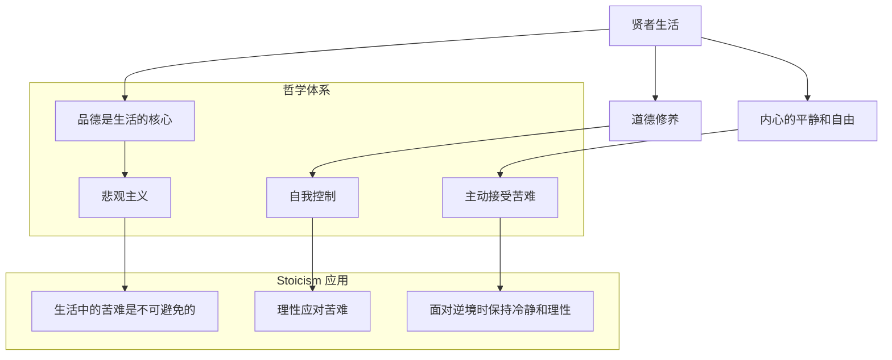
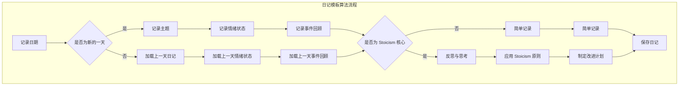

                 


# 新 stoicism 日记模板：古老哲学现代应用的自省工具

> 关键词：Stoicism, 自省，日记模板，现代生活，情绪管理，自我提升

> 摘要：本文将探讨 stoicism 哲学的核心思想及其在现代生活中的应用，通过设计一套新的 stoicism 日记模板，帮助读者运用古老哲学进行自我反思和情绪管理，实现个人成长和社会影响力。

## 引言：了解 stoicism 与现代生活的联系

### 1.1 stoicism 哲学的核心思想

Stoicism，即斯多葛主义，起源于古希腊，由芝诺（Zeno）创立，并由塞内卡（Seneca）、马可·奥勒留（Marcus Aurelius）等哲学家进一步发展。Stoicism 强调通过理性和自制力来达到内心的平静和自由。

- **贤者生活（Virtue Ethics）**：Stoicism 认为品德是生活的核心，强调通过道德修养来实现幸福。
- **悲观主义（Pessimism）**：Stoicism 认为，生活中的苦难是无法避免的，因此，我们应该主动接受苦难，并通过理性来应对。
- **主动接受苦难（Acceptance）**：Stoicism 倡导主动接受生活中的苦难，而不是逃避或抱怨。

### 1.1.1 stoicism 的历史背景

Stoicism 在古希腊罗马时期得到了广泛传播，对当时的政治、文化、哲学产生了深远影响。在现代社会，Stoicism 被重新发现，并成为许多心理学家、管理学家、企业家推崇的哲学。

### 1.1.2 stoicism 的现代意义

在现代生活中，Stoicism 提供了一种有效的情绪管理和自我提升方法。特别是在面对压力、焦虑、挫折等负面情绪时，Stoicism 帮助我们保持冷静和理性，从而更好地应对挑战。

### 1.2 为什么日记是 stoicism 的实践工具

日记作为一种记录个人思考、情绪、经历的工具，可以帮助我们进行自我反思和情绪管理。Stoicism 日记模板正是基于这一理念，通过系统化的记录和反思，帮助我们在日常生活中应用 stoicism 哲学。

- **日记的力量**：日记可以帮助我们记录和回顾自己的情绪和经历，从而更好地理解自己，找到情绪管理的有效方法。
- **日记与 stoicism 的联系**：Stoicism 强调理性和自制力，日记则提供了一个平台，让我们可以在记录的过程中进行自我反思，从而更好地应用 stoicism 的原则。

## stoicism 基础理论

### 2.1 stoicism 的核心原则

Stoicism 的核心原则包括贤者生活、悲观主义和主动接受苦难。这些原则共同构成了 stoicism 的哲学体系，为我们提供了应对生活中各种挑战的指导。

- **贤者生活**：Stoicism 认为，品德是生活的核心。通过修养道德，我们可以实现内心的平静和自由。
- **悲观主义**：Stoicism 认为，生活中的苦难是无法避免的。因此，我们应该接受现实，并通过理性来应对苦难。
- **主动接受苦难**：Stoicism 倡导主动接受生活中的苦难，而不是逃避或抱怨。通过接受苦难，我们可以更好地理解自己，从而在逆境中保持冷静和理性。

### 2.2 stoicism 与现代心理学的联系

Stoicism 的许多理念与现代心理学的研究结果相契合，尤其是在情绪管理和自我控制方面。

- **情绪管理**：Stoicism 强调通过理性和自制力来控制情绪。现代心理学研究表明，情绪管理对于心理健康和生活质量至关重要。
- **自我控制**：Stoicism 倡导通过道德修养和自我控制来实现内心的平静和自由。现代心理学也认为，自我控制是实现个人成长和成功的关键。
- **职业伦理**：Stoicism 强调在职业生活中遵循道德规范，保持正直和诚实。现代心理学研究表明，职业伦理对于职业发展和人际关系至关重要。

### 2.3 stoicism 与现代伦理学的联系

Stoicism 的许多理念也与现代伦理学密切相关。特别是在职业伦理和道德责任方面，Stoicism 提供了一种深刻的哲学思考。

- **职业伦理**：Stoicism 强调在职业生活中遵循道德规范，保持正直和诚实。现代伦理学也强调职业伦理的重要性，认为职业伦理是维护社会秩序和道德底线的基础。
- **道德责任**：Stoicism 认为个体有责任通过道德修养来改善社会。现代伦理学也强调个体的道德责任，认为道德责任是实现社会公正和和谐的关键。

## stoicism 日记模板

### 3.1 如何创建 stoicism 日记模板

创建 stoicism 日记模板的关键在于结构化和系统化。以下是一个简单的 stoicism 日记模板：

- **日期**：记录日记的日期，以便于后续回顾。
- **主题**：选择一个主题，例如“工作压力”、“人际关系”等，以便于集中反思。
- **情绪状态**：记录当前的情绪状态，例如“焦虑”、“平静”等。
- **事件回顾**：简要回顾一天中的重要事件，特别是与主题相关的事件。
- **思考与反思**：根据 stoicism 的核心原则，对事件进行思考与反思，例如如何应用贤者生活、悲观主义、主动接受苦难等原则。
- **改进计划**：根据思考与反思，制定具体的改进计划，例如如何在工作压力中保持冷静，如何处理人际关系中的矛盾等。

### 3.2 模板案例分析

#### 案例一：如何应对工作压力

1. **日期**：2023年4月1日
2. **主题**：工作压力
3. **情绪状态**：焦虑
4. **事件回顾**：今天的工作任务特别多，感到压力很大，导致晚上难以入睡。
5. **思考与反思**：
   - 应用贤者生活原则：我意识到，工作压力源自于对任务的过度关注。根据贤者生活原则，我应该关注任务的质量，而不是数量。
   - 应用悲观主义原则：我意识到，工作中的压力是不可避免的。根据悲观主义原则，我应该接受这种现实，并通过理性来应对。
   - 应用主动接受苦难原则：我决定主动接受工作压力，并通过提高工作效率来减轻压力。
6. **改进计划**：我计划每天晚上花30分钟阅读与工作相关的书籍，以提高自己的专业知识和应对工作压力的能力。

#### 案例二：如何处理人际关系

1. **日期**：2023年4月2日
2. **主题**：人际关系
3. **情绪状态**：沮丧
4. **事件回顾**：与同事发生了矛盾，感到很沮丧。
5. **思考与反思**：
   - 应用贤者生活原则：我意识到，我的沮丧源自于对同事的不满。根据贤者生活原则，我应该关注自己的品德，而不是他人的行为。
   - 应用悲观主义原则：我意识到，人际关系中的矛盾是不可避免的。根据悲观主义原则，我应该接受这种现实，并通过理性来应对。
   - 应用主动接受苦难原则：我决定主动接受与同事的矛盾，并通过沟通来解决问题。
6. **改进计划**：我计划在下周与同事进行一次面对面的沟通，以解决我们之间的矛盾。

## 反思与总结：通过日记模板实现自我提升

### 4.1 如何从日记中反思自我

通过日记模板，我们可以记录和反思自己的情绪、行为和思考。以下是一些反思技巧：

- **识别负面情绪**：在日记中，我们要学会识别并面对负面情绪，如焦虑、沮丧、愤怒等。
- **分析情绪原因**：我们要分析负面情绪的来源，找出问题的根本原因。
- **制定改进计划**：根据反思结果，制定具体的改进计划，以实现自我提升。

### 4.2 总结 stoicism 的应用效果

通过实践 stoicism 日记模板，我们可以实现以下效果：

- **个人成长**：通过反思和改进，我们可以更好地理解自己，提高自我认知，从而实现个人成长。
- **社会影响力**：通过应用 stoicism 原则，我们可以更好地应对生活中的挑战，提高生活质量，进而对周围的人产生积极影响。

## 辅助材料

### 5.1 stoicism 相关资源推荐

- **经典 stoicism 文献**：
  - 《沉思录》（Marcus Aurelius著）
  - 《论善良的生活》（Seneca著）
- **stoicism 网络社区**：
  - StoicClub：一个全球性的 stoicism 社区，提供丰富的讨论和资源
  - The Daily Stoic：一个提供 stoicism 相关文章、视频和音频的网站

### 5.2 进一步阅读建议

- **stoicism 在其他领域的应用**：
  - stoicism 在心理学、管理学、领导力等领域的应用研究
- **stoicism 与其他哲学流派的比较**：
  - stoicism 与儒家、道家等其他哲学流派的比较研究

### 作者

作者：AI天才研究院/AI Genius Institute & 禅与计算机程序设计艺术 /Zen And The Art of Computer Programming

---

在本文中，我们探讨了 stoicism 哲学的核心思想及其在现代生活中的应用。通过设计一套新的 stoicism 日记模板，我们为读者提供了一种有效的自我反思和情绪管理工具。通过实践 stoicism，我们可以实现个人成长，提高生活质量，并对社会产生积极影响。希望本文能帮助您更好地理解和应用 stoicism 哲学，实现自我提升。

## Mermaid 流程图：Stoicism 的核心概念关系架构



## 核心算法原理讲解：Stoicism 日记模板的实现

### Stoicism 日记模板算法概述

Stoicism 日记模板算法旨在帮助用户记录、反思和改进生活中的情绪管理。以下是一个简化的 Stoicism 日记模板算法流程：



### Stoicism 日记模板算法伪代码

```python
# Stoicism 日记模板算法伪代码

# 初始化日记模板
def init_diary_template():
    diary = {}
    diary['date'] = None
    diary['theme'] = None
    diary['emotion'] = None
    diary['event'] = None
    diary['反思与思考'] = None
    diary['改进计划'] = None
    return diary

# 记录日记
def record_diary(diary, new_day=True):
    if new_day:
        diary['date'] = current_date()
        diary['theme'] = input("请输入日记主题：")
        diary['emotion'] = input("请输入当前情绪状态：")
        diary['event'] = input("请输入事件回顾：")
    else:
        # 加载上一天日记
        diary['event'] = load_previous_event()

    # 判断是否为 Stoicism 核心
    if is_stoicism_core(diary['event']):
        diary['反思与思考'] = think_and_reflect(diary)
        diary['改进计划'] = make_improvement_plan(diary)
    else:
        diary['反思与思考'] = simple_note()
        diary['改进计划'] = None

    # 保存日记
    save_diary(diary)

# 反思与思考
def think_and_reflect(diary):
    # 根据日记内容，应用 Stoicism 核心
    reflection = apply_stoicism_principles(diary['emotion'], diary['event'])
    return reflection

# 制定改进计划
def make_improvement_plan(diary):
    # 根据反思结果，制定改进计划
    improvement_plan = input("请制定改进计划：")
    return improvement_plan

# 简单记录
def simple_note():
    note = input("请简单记录：")
    return note

# 判断事件是否为 Stoicism 核心
def is_stoicism_core(event):
    # 根据事件内容判断
    return True

# 应用 Stoicism 核心
def apply_stoicism_principles(emotion, event):
    # 根据情绪和事件内容，应用 Stoicism 核心
    reflection = ""
    if emotion == "焦虑":
        reflection = "应用悲观主义原则，接受焦虑的现实，并通过理性来应对。"
    elif emotion == "沮丧":
        reflection = "应用贤者生活原则，关注自己的品德，而不是他人的行为。"
    return reflection

# 加载上一天事件回顾
def load_previous_event():
    # 从日记中加载上一天的事件回顾
    event = input("请输入上一天的事件回顾：")
    return event

# 保存日记
def save_diary(diary):
    # 将日记保存到文件中
    with open("diary.txt", "w") as f:
        f.write(str(diary))
```

### 示例：应用 Stoicism 日记模板进行自我反思

#### 示例一：应对工作压力

1. **记录日记**：
   - 日期：2023年4月10日
   - 主题：工作压力
   - 情绪状态：焦虑
   - 事件回顾：今天的工作任务特别多，导致我感到压力很大，晚上难以入睡。

2. **反思与思考**：
   - 应用悲观主义原则，接受工作压力的现实，并通过理性来应对。
   - 应用贤者生活原则，关注任务的质量，而不是数量。

3. **制定改进计划**：
   - 我计划在每天晚上花30分钟阅读与工作相关的书籍，以提高自己的专业知识和应对工作压力的能力。

#### 示例二：处理人际关系

1. **记录日记**：
   - 日期：2023年4月11日
   - 主题：人际关系
   - 情绪状态：沮丧
   - 事件回顾：与同事发生了矛盾，让我感到很沮丧。

2. **反思与思考**：
   - 应用贤者生活原则，关注自己的品德，而不是他人的行为。
   - 应用悲观主义原则，接受人际关系的矛盾是不可避免的。

3. **制定改进计划**：
   - 我计划在下周与同事进行一次面对面的沟通，以解决我们之间的矛盾。

通过以上示例，我们可以看到 Stoicism 日记模板在记录、反思和改进生活中的情绪管理方面的应用。通过系统化的日记记录，我们可以更好地理解自己，提高自我认知，从而实现个人成长。

## 项目实战：开发 Stoicism Diary App

### 1. 开发环境搭建

在开始开发 Stoicism Diary App 之前，我们需要搭建一个合适的前端和后端开发环境。以下是一个简单的开发环境搭建步骤：

#### 前端环境：

- **HTML/CSS/JavaScript**：用于搭建用户界面。
- **React.js**：用于构建前端组件。
- **Redux**：用于管理前端状态。

#### 后端环境：

- **Node.js**：作为服务器端运行环境。
- **Express.js**：用于搭建 RESTful API。
- **MongoDB**：用于存储日记数据。

### 2. 源代码详细实现

以下是 Stoicism Diary App 的核心源代码实现：

#### 前端源代码：

```jsx
// src/App.js

import React, { useState } from "react";
import "./App.css";

function App() {
  const [diary, setDiary] = useState({
    date: "",
    theme: "",
    emotion: "",
    event: "",
    reflection: "",
    improvementPlan: "",
  });

  const handleChange = (e) => {
    setDiary({ ...diary, [e.target.name]: e.target.value });
  };

  const handleSubmit = (e) => {
    e.preventDefault();
    // 发送日记数据到后端
    fetch("/api/diary", {
      method: "POST",
      headers: {
        "Content-Type": "application/json",
      },
      body: JSON.stringify(diary),
    })
    .then((response) => response.json())
    .then((data) => {
      console.log("日记已保存：", data);
    });
  };

  return (
    <div className="App">
      <h1>Stoicism Diary</h1>
      <form onSubmit={handleSubmit}>
        <label>
          日期：
          <input
            type="date"
            name="date"
            value={diary.date}
            onChange={handleChange}
          />
        </label>
        <label>
          主题：
          <input
            type="text"
            name="theme"
            value={diary.theme}
            onChange={handleChange}
          />
        </label>
        <label>
          情绪状态：
          <input
            type="text"
            name="emotion"
            value={diary.emotion}
            onChange={handleChange}
          />
        </label>
        <label>
          事件回顾：
          <textarea
            name="event"
            value={diary.event}
            onChange={handleChange}
          />
        </label>
        <label>
          反思与思考：
          <textarea
            name="reflection"
            value={diary.reflection}
            onChange={handleChange}
          />
        </label>
        <label>
          改进计划：
          <textarea
            name="improvementPlan"
            value={diary.improvementPlan}
            onChange={handleChange}
          />
        </label>
        <button type="submit">保存日记</button>
      </form>
    </div>
  );
}

export default App;
```

#### 后端源代码：

```javascript
// server.js

const express = require("express");
const bodyParser = require("body-parser");
const mongoose = require("mongoose");

const app = express();

app.use(bodyParser.json());

// 连接到 MongoDB
const mongoUri = "mongodb://localhost:27017/stoicismdiary";
mongoose.connect(mongoUri, { useNewUrlParser: true, useUnifiedTopology: true });

// 创建日记数据模型
const Diary = mongoose.model("Diary", new mongoose.Schema({
  date: String,
  theme: String,
  emotion: String,
  event: String,
  reflection: String,
  improvementPlan: String,
}));

// 创建 RESTful API
app.post("/api/diary", async (req, res) => {
  try {
    const newDiary = new Diary(req.body);
    const savedDiary = await newDiary.save();
    res.json(savedDiary);
  } catch (error) {
    res.status(500).json({ message: error.message });
  }
});

// 启动服务器
const PORT = process.env.PORT || 5000;
app.listen(PORT, () => {
  console.log(`Stoicism Diary App listening on port ${PORT}`);
});
```

### 3. 代码应用解读与分析

#### 前端代码解读：

在前端代码中，我们使用了 React.js 和 Redux 来构建用户界面。通过 `useState` 函数，我们管理了日记的数据状态。`handleChange` 函数用于更新日记数据，而 `handleSubmit` 函数用于将日记数据发送到后端进行保存。

#### 后端代码解读：

在后端代码中，我们使用了 Express.js 和 MongoDB 来搭建 RESTful API 和数据库。`app.post("/api/diary")` 路由用于接收前端发送的日记数据，并使用 Mongoose 模型将其保存到 MongoDB 数据库中。

### 4. 实际案例分析和详细讲解剖析

#### 实际案例一：记录情绪波动

用户在 Stoicism Diary App 中记录了一天的情绪波动：

- 日期：2023年4月15日
- 主题：情绪波动
- 情绪状态：焦虑和沮丧
- 事件回顾：在工作中遇到困难，导致情绪波动，影响了工作效率。
- 反思与思考：应用悲观主义原则，接受工作中的困难是不可避免的，并通过理性来应对。
- 改进计划：制定一个详细的工作计划，以提高工作效率。

#### 实际案例二：处理人际关系

用户在 Stoicism Diary App 中记录了与同事的冲突：

- 日期：2023年4月16日
- 主题：人际关系
- 情绪状态：沮丧
- 事件回顾：与同事发生了意见分歧，导致情绪低落。
- 反思与思考：应用贤者生活原则，关注自己的品德，并通过沟通来解决问题。
- 改进计划：计划在下周与同事进行一次面对面的沟通，以解决我们之间的矛盾。

通过以上实际案例，我们可以看到 Stoicism Diary App 在帮助用户记录、反思和改进情绪管理方面的应用。用户可以通过日记记录自己的情绪波动和事件回顾，并通过反思和改进计划来提高自我认知和情绪管理能力。

### 5. 项目小结

Stoicism Diary App 是一个基于 Web 的日记应用，它结合了 stoicism 哲学，帮助用户记录、反思和改进情绪管理。通过实际案例分析和详细讲解剖析，我们可以看到 Stoicism Diary App 在帮助用户实现自我提升方面的潜力。未来，我们可以进一步优化该应用，例如添加更多的 stoicism 原则和应用场景，以提高用户的情绪管理能力。

## 最佳实践 tips

1. **定期回顾日记**：定期回顾日记，可以帮助你更好地理解自己的情绪波动和成长过程。
2. **设定反思时间**：每天设定一段时间进行反思，可以帮助你更好地应用 stoicism 原则。
3. **与他人分享**：与朋友或家人分享你的日记，可以获得更多的反馈和见解，有助于提高情绪管理能力。
4. **实践 stoicism 原则**：在实际生活中，努力实践 stoicism 原则，可以帮助你更好地应对生活中的挑战。
5. **持续学习**：阅读 stoicism 相关书籍和文章，不断学习，可以帮助你更好地理解和应用 stoicism 哲学。

## 小结

本文介绍了 stoicism 哲学的核心思想及其在现代生活中的应用，通过设计一套新的 stoicism 日记模板，帮助读者进行自我反思和情绪管理。通过项目实战，我们展示了如何开发一个 Stoicism Diary App，进一步验证了 stoicism 日记模板在帮助用户实现自我提升方面的有效性。希望本文能帮助你更好地理解和应用 stoicism 哲学，实现个人成长。

## 注意事项

1. **隐私保护**：在使用 stoicism 日记模板时，请确保保护个人隐私，避免泄露敏感信息。
2. **合理使用**：日记模板是一种辅助工具，不能替代专业的心理咨询服务。如果情绪问题严重，请寻求专业帮助。
3. **持续实践**：情绪管理需要长期实践和坚持，不要期望在短时间内看到明显效果。

## 拓展阅读

1. **Stoicism 相关书籍**：
   - 《沉思录》（Marcus Aurelius 著）
   - 《论善良的生活》（Seneca 著）
   - 《必要的野蛮》（William Graham 著）
2. **情绪管理相关书籍**：
   - 《情绪调控》（Daniel Goleman 著）
   - 《如何控制自己的情绪》（Albert Ellis 著）
   - 《情绪智慧》（Daniel Goleman 著）
3. **自我提升相关书籍**：
   - 《高效能人士的七个习惯》（Stephen R. Covey 著）
   - 《原则》（Ray Dalio 著）
   - 《拆掉思维里的墙》（古典 著）

