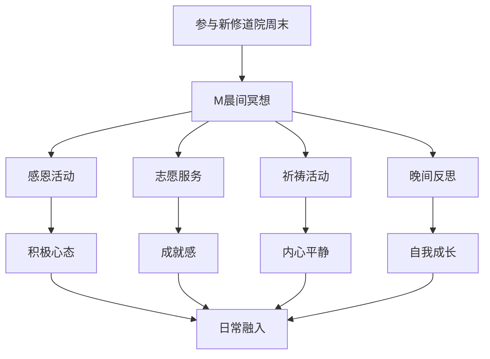

                 

### 引言

在现代社会的快节奏生活中，人们面临着诸多精神上的挑战，如焦虑、压力和心灵疲惫。这些精神问题不仅影响了人们的心理健康，还降低了工作效率和生活质量。在这样的背景下，短期精神修行活动成为了一种备受关注的应对策略。其中，“新修道院周末”便是这样一种旨在帮助现代人进行精神修养的活动。

#### 新修道院周末的定义

“新修道院周末”是一种结合了传统修行理念与现代生活方式的短期精神修养活动。它起源于西方，但随着全球化的发展，这种活动逐渐传播到世界各地，包括中国。新修道院周末通常持续两天一夜，参与者在这个时间段内将暂时远离日常生活的喧嚣，进入一个宁静的环境，全身心地投入到精神修行中。

#### 现代意义

现代社会中，人们的生活节奏加快，工作压力增大，心灵疲惫成为普遍现象。长期的心理压力会导致一系列健康问题，如焦虑症、抑郁症等。因此，寻找有效的精神修养方法，提升心理韧性，显得尤为重要。新修道院周末为现代人提供了一种简洁、实用的修行方式，帮助他们在繁忙的生活中找到片刻的宁静。

#### 目的

本文旨在探讨新修道院周末的起源、理念以及其实践方法，帮助读者理解其核心意义，并掌握如何在日常生活中融入这些修行活动。具体而言，本文将涵盖以下内容：

1. **背景介绍**：介绍新修道院周末的起源和发展，以及其在现代社会中的地位。
2. **核心概念与联系**：阐述新修道院周末中的核心概念，并使用Mermaid流程图展示这些概念之间的关系。
3. **修行方法**：详细讲解新修道院周末的修行方法，包括早晨冥想、日常活动安排、晚上的反思等。
4. **修行挑战与解决方案**：分析修行过程中可能遇到的挑战，并提出相应的解决方案。
5. **修行后的整合**：探讨修行活动结束后如何将所学应用到日常生活中，并规划长期修行路径。
6. **结语**：总结新修道院周末的价值，并鼓励读者在日常生活中实践精神修养。

通过本文的探讨，我们希望读者能够对新修道院周末有一个全面的了解，并从中受益，找到适合自己的精神修养方式，提升生活质量。

### 核心概念与联系

在新修道院周末的修行过程中，存在几个核心概念，它们相互联系，共同构成了一个完整的修行体系。为了更好地理解这些概念之间的联系，我们可以使用Mermaid流程图来展示它们之间的关系。

#### 概念介绍

1. **冥想**：冥想是新修道院周末的核心活动之一。通过冥想，参与者可以进入一种宁静的状态，减少杂念，增强专注力。
2. **感恩**：感恩是修行过程中的重要环节。通过感恩，参与者可以培养积极的心态，增强内心的满足感。
3. **志愿服务**：志愿服务是新修道院周末的一种实践活动。通过参与志愿服务，参与者不仅能够帮助他人，还能在帮助他人的过程中获得成就感和满足感。
4. **祈祷**：祈祷是一种精神沟通的方式。通过祈祷，参与者可以与更高力量沟通，寻求内心的平静和力量。
5. **自我反省**：自我反省是修行过程中的一个重要步骤。通过自我反省，参与者可以深入了解自己的内心，发现并改正自身的不足。

#### Mermaid流程图

#### 概念关系分析

1. **冥想与感恩**：冥想可以帮助参与者进入一种宁静的状态，减少杂念，从而更容易产生感恩之情。感恩则可以增强参与者的积极心态，使其更加乐观和满足。
2. **感恩与志愿服务**：感恩使参与者愿意帮助他人，从而积极参与志愿服务。通过志愿服务，参与者不仅能帮助他人，还能在帮助过程中获得成就感和满足感，进一步增强感恩的心态。
3. **祈祷与自我反省**：祈祷是一种精神沟通的方式，通过祈祷，参与者可以与更高力量沟通，寻求内心的平静和力量。自我反省则是在祈祷的基础上，更深入地了解自己的内心，发现并改正自身的不足。
4. **感恩、志愿服务、祈祷与自我反省**：这四个概念共同构成了新修道院周末的精神修行体系。感恩使心灵更加平和，志愿服务带来成就感和满足感，祈祷提供内心的平静和力量，自我反省则帮助参与者不断成长。

通过上述核心概念及其相互关系的分析，我们可以看到新修道院周末的修行活动是如何在逻辑上形成一套完整的体系，帮助参与者实现精神上的提升。

### 修行方法

新修道院周末的修行方法主要包括早晨冥想、日常活动安排、晚上的反思等。这些方法旨在帮助参与者深入内心，实现精神上的提升。下面我们将逐一介绍这些修行方法，并提供具体的步骤和实践建议。

#### 早晨冥想

早晨冥想是新修道院周末的重要环节，它帮助参与者开启一天的精神修行。以下是早晨冥想的具体步骤：

1. **准备工作**：选择一个安静、舒适的环境，保持室内光线柔和。准备一块垫子或椅子，以便于舒适地坐下来。
2. **身体放松**：坐在垫子或椅子上，保持身体正直，深呼吸几次，让身体和心灵逐渐放松。
3. **专注呼吸**：闭上眼睛，将注意力集中在呼吸上。感受每一次呼吸的进出，不要刻意调整呼吸，只需观察和感受。
4. **冥想引导**：可以听一些冥想音乐或跟随冥想引导进行，以帮助集中注意力。
5. **结束冥想**：当冥想时间结束时，缓慢地打开眼睛，保持静坐片刻，让心灵逐渐回到现实。

**实践建议**：每天早晨进行10-15分钟的冥想，可以帮助参与者培养专注力和平静心态。

#### 日常活动安排

除了早晨冥想，日常活动安排也是新修道院周末的重要组成部分。这些活动旨在通过不同的方式，帮助参与者深入修行。以下是具体的日常活动安排：

1. **感恩活动**：每天选择一个时刻，为自己生活中的小事表达感恩。可以写下感恩日记，记录自己感激的事物和感受。
2. **志愿服务**：参与社区或慈善组织的志愿服务活动，帮助他人，体验成就感和满足感。
3. **祈祷活动**：每天选择一个安静的时刻，进行祈祷，寻求内心的平静和力量。
4. **冥想实践**：在日常生活中，随时随地都可以进行短时间的冥想。例如，在等公交、喝咖啡时，闭上眼睛，专注于呼吸，放松身心。

**实践建议**：将日常活动安排融入到日常生活中，每天至少安排30分钟的时间进行感恩、志愿服务和祈祷活动，同时利用碎片时间进行冥想实践。

#### 晚上的反思

晚上的反思是新修道院周末的另一个关键环节，它帮助参与者总结一天的精神修行，并规划接下来的修行方向。以下是晚上反思的具体步骤：

1. **回顾当天活动**：回顾当天参加的冥想、感恩、志愿服务和祈祷活动，思考哪些环节做得好，哪些需要改进。
2. **记录感悟**：写下当天的感悟和体验，包括感恩的事情、志愿服务的感受、冥想中的体验等。
3. **规划未来**：根据当天的反思，制定接下来的修行计划，设定短期和长期的目标。

**实践建议**：每天晚上花30分钟时间进行反思，可以帮助参与者不断总结和提升自己的修行经验。

#### 实践中的注意事项

1. **保持专注**：在修行过程中，要尽量减少外界干扰，保持专注。可以使用耳塞或耳机，屏蔽外界噪音。
2. **调整呼吸**：呼吸是冥想的重要基础，要缓慢、深长地呼吸，感受每一次呼吸的进出。
3. **感恩心态**：感恩是修行过程中的核心，要时刻保持感恩的心态，对生活中的小事表达感激。
4. **持之以恒**：修行不是一蹴而就的，需要持之以恒。每天坚持进行冥想、感恩、志愿服务和祈祷活动，才能看到明显的效果。

通过上述修行方法的详细介绍和实践建议，参与者可以更好地在新修道院周末中实现精神上的提升，找到内心的平静和力量。

### 修行挑战与解决方案

在新修道院周末的修行过程中，参与者可能会遇到各种挑战，这些挑战既包括内在的心理问题，也包括外在的环境干扰。了解并解决这些挑战，是确保修行顺利进行的关键。

#### 内在挑战

1. **情绪波动**：修行过程中，一些人可能会经历情绪波动，如焦虑、沮丧或愤怒。这些情绪可能源于内心深处的矛盾和未解决的情感问题。
   - **解决方案**：在情绪波动时，可以尝试深呼吸和冥想，帮助自己冷静下来。此外，可以写下自己的情绪和感受，通过文字表达释放情绪。
   - **实践建议**：在修行前，可以做一些情绪管理的准备，如阅读相关书籍、观看情绪管理视频，增强自己的情绪调节能力。

2. **内在对话**：修行过程中，内心可能会出现各种声音和对话，有时甚至可能产生自我怀疑或自我批评。
   - **解决方案**：通过冥想，专注于呼吸，逐步减少内心的杂音。可以尝试跟随冥想指导，将注意力集中在呼吸上，避免被内在对话所干扰。
   - **实践建议**：在冥想过程中，如果内心对话过于强烈，可以设定一个闹钟，定时提醒自己回归呼吸，避免被内在对话所分散注意力。

3. **疲劳感**：长时间的冥想和静坐可能会导致身体疲劳，尤其是在连续多天的修行中。
   - **解决方案**：合理安排修行时间，保证充足的休息。在修行过程中，可以适当休息，进行简单的伸展运动，放松身体。
   - **实践建议**：在修行前，可以做一些身体锻炼，提高身体的耐力和灵活性，减少疲劳感。

#### 外在挑战

1. **环境干扰**：修行环境可能会受到外界干扰，如噪音、光线变化等，这些干扰可能影响冥想和静坐的效果。
   - **解决方案**：选择一个安静、舒适的环境进行修行，可以使用耳塞、遮光布等工具减少外界干扰。
   - **实践建议**：在修行前，提前安排好环境，确保环境安静、光线适中，减少不必要的干扰。

2. **社交压力**：在修行过程中，可能会遇到社交压力，如与其他参与者的互动、社交活动的安排等。
   - **解决方案**：在修行期间，尽量减少社交活动，专注于个人的修行。如果不可避免，可以提前沟通，确保双方都能理解和尊重彼此的修行需求。
   - **实践建议**：在修行前，可以与家人、朋友沟通，告知他们自己在修行期间的安排，寻求理解和支持。

3. **外界诱惑**：现代社会中，外界诱惑繁多，如手机、社交媒体等，这些诱惑可能会分散参与者的注意力。
   - **解决方案**：在修行期间，尽量远离这些诱惑，将手机调至静音或飞行模式，减少干扰。
   - **实践建议**：在修行前，可以设定一个目标，如每天进行冥想的时间，确保自己能够专注于修行。

通过上述挑战和解决方案的分析，参与者可以更好地应对修行过程中可能遇到的问题，确保修行活动的顺利进行，实现精神上的提升。

### 修行后的整合

新修道院周末的修行活动结束后，参与者需要将所学的精神修养方法融入日常生活中，以实现长期的精神提升。以下是一些具体的整合方法、注意事项以及未来修行规划的建议。

#### 整合方法

1. **养成日常修行习惯**：修行并不仅仅是周末的活动，而是需要融入日常生活的持续过程。参与者可以在每天的早晨、中午和晚上安排冥想时间，每次10-15分钟，帮助自己保持内心的平静和专注。

2. **感恩实践**：感恩是新修道院周末的核心概念之一，参与者可以将感恩实践融入到日常生活中。每天选择一个时刻，对自己生活中的小事表达感恩，如感谢家人、朋友或同事的帮助，记录在感恩日记中。

3. **志愿服务**：志愿服务不仅能够帮助他人，还能带来内心的满足感和成就感。参与者可以定期参与社区或慈善组织的志愿服务，将其作为修行的一部分。

4. **持续冥想**：冥想是修行的重要工具，参与者可以每天进行短时间的冥想，帮助自己减压、提升专注力。可以选择在早晨、午餐后或晚上睡前进行冥想，根据自己的时间安排灵活调整。

5. **祈祷和反思**：定期进行祈祷和反思，帮助自己保持与内心的联系，寻找精神上的支持。可以在睡前或早晨进行反思，回顾一天的经历，总结感悟。

#### 注意事项

1. **持之以恒**：修行不是一时的冲动，而是一种长期的习惯。参与者需要保持持之以恒的态度，每天坚持进行冥想、感恩、志愿服务和祈祷活动。

2. **适应变化**：随着时间的推移，参与者可能会面临生活中的各种变化，如工作、家庭和社交关系等。在这种情况下，需要灵活调整修行计划，确保修行活动能够适应新环境。

3. **避免完美主义**：修行过程中，可能会遇到挑战和困难，不要对自己过于苛刻。接受自己的不足，并从中学习和成长。

4. **保持开放心态**：修行不仅是一种个人实践，也是一种集体活动。参与者可以参加修行社群，与他人分享经验和感悟，共同成长。

#### 未来修行规划

1. **设定短期目标**：在修行过程中，设定短期目标可以帮助自己保持动力和方向。例如，每周进行一次冥想、每月参与一次志愿服务等。

2. **长期修行路径**：长期修行需要有一个清晰的规划。参与者可以根据自己的情况，制定一个长期修行计划，如每年参加一次新修道院周末、每两年进行一次深度冥想训练等。

3. **持续学习和成长**：修行是一个不断学习和成长的过程。参与者可以阅读相关书籍、参加线上课程、参加工作坊等，不断丰富自己的修行知识。

4. **分享和帮助他人**：通过分享自己的修行经验和帮助他人，参与者不仅可以提升自己，还能为他人带来正能量。

通过上述整合方法、注意事项和未来修行规划，参与者可以更好地将新修道院周末的精神修养融入日常生活中，实现长期的精神提升。

### 结语

新修道院周末作为一种现代人的短期精神修行活动，具有重要的价值和意义。通过早晨冥想、日常活动安排、晚上的反思等修行方法，参与者能够在短时间内体验到精神上的提升，增强心理韧性，减轻压力和焦虑。此外，感恩、志愿服务、祈祷和自我反省等核心概念，也为参与者提供了深入内心的途径，帮助他们发现并改正自身的不足。

在日常生活中，通过将新修道院周末的修行方法融入日常生活，如养成日常修行习惯、进行感恩实践、参与志愿服务和持续冥想，参与者可以持续提升自己的精神状态，实现长期的精神修养。

鼓励读者在忙碌的生活中找到片刻的宁静，尝试新修道院周末的修行活动，并持之以恒地实践。通过这样的精神修养，我们不仅能够提升自身的心理健康，还能在快节奏的现代社会中找到内心的平和与力量。记住，精神修养并非一蹴而就，而是一种持续的、逐步积累的过程。让我们一起踏上这条精神修养之路，追求更高质量的生活。

### 附录

#### A.1 常用修行资源

1. **冥想音乐与指导**：
   - **Coursera冥想课程**：提供免费冥想入门课程，涵盖呼吸冥想、正念冥想等。
   - **Headspace**：一款流行的冥想应用程序，提供多种冥想课程和音乐。

2. **感恩日记模板**：
   - **感恩日记本**：购买一本专门的感恩日记本，每天记录感恩的事物。
   - **在线感恩日记**：使用如**Gratefulness.org**等在线平台，记录并分享自己的感恩内容。

3. **祈祷与反思资源**：
   - **祷告指南**：查找各种宗教或非宗教的祷告指南，如**The Prayer App**等应用程序。
   - **反思日记模板**：下载或创建一个反思日记模板，每天记录自己的反思和感悟。

#### A.2 精神修行的常见问题解答

1. **如何开始冥想？**
   - **步骤**：找一个安静的地方，选择一个舒适的姿势，闭上眼睛，专注于呼吸。初学者可以从5分钟开始，逐渐增加时间。

2. **感恩日记有什么好处？**
   - **好处**：感恩日记可以帮助人们培养积极心态，减少焦虑和抑郁情绪，提高生活质量。

3. **如何处理修行中的情绪波动？**
   - **方法**：通过深呼吸、冥想和书写表达情绪，寻求专业指导，如心理咨询师或精神导师。

#### A.3 精神修行的最佳实践 tips

1. **持续实践**：修行需要持之以恒，每天安排固定时间进行修行。
2. **适应环境**：选择一个安静、舒适的环境进行修行，减少外界干扰。
3. **开放心态**：修行过程中保持开放心态，不断学习和调整，适应变化。

#### 注意事项

1. **合理安排时间**：确保修行活动与日常生活不冲突，合理规划时间。
2. **避免完美主义**：接受自己的不足，不要对自己过于苛刻。
3. **分享经验**：与他人分享修行经验，互相支持和鼓励。

#### 拓展阅读

1. **《冥想：一种精神修养的方法》**：作者：乔伊斯·布鲁尔（Joyce Bular）
2. **《感恩的力量》**：作者：约翰·卡迈伦（John Cammell）
3. **《祈祷的力量》**：作者：伊丽莎白·吉尔伯特（Elizabeth Gilbert）

通过这些资源、问题和最佳实践提示，参与者可以更好地理解和实践精神修行，提升生活质量。希望这些附录内容能为读者提供有价值的帮助。

