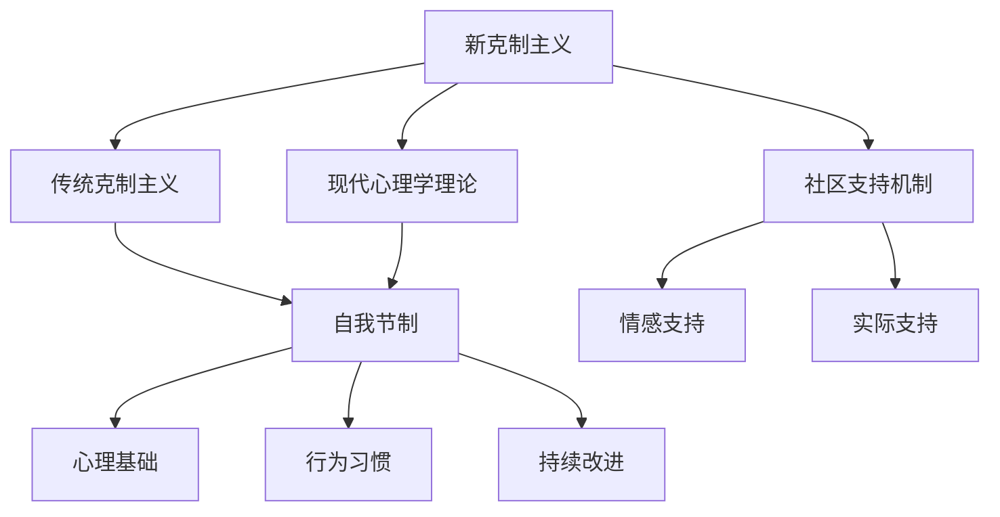

                 

### 1. 核心概念与联系

#### 1.1 新克制主义概述

新克制主义（Neoteric Self-Discipline）是近年来在心理学和自我管理领域兴起的一种理念，它继承了传统克制主义的核心精神，同时融合了现代心理学理论，旨在帮助个体在自我约束和自我调节方面实现更为高效和持久的成长。

**新克制主义的定义**

新克制主义可以被定义为一种结合传统克制主义精神与现代心理学理论的综合性方法论，它强调通过自我观察、自我调节和自我激励来提升个体的自我控制力和自律能力。具体来说，新克制主义包括以下几个关键要素：

- **自我观察（Self-Observation）**：通过自我反思和自我审视来认识自己的行为模式、思维习惯和心理状态。
- **自我调节（Self-Regulation）**：利用认知技能和情绪管理策略来调整自己的行为和情绪，以达到预定目标。
- **自我激励（Self-Motivation）**：通过内驱力和目标设定来激发个体的内在动力，维持持续的自我改进过程。

**新克制主义的架构**

新克制主义的核心架构可以分为三个主要层次，每个层次相互关联，共同构成了这一方法论的整体框架。

1. **心理基础（Psychological Foundation）**：
   - **自我意识（Self-Awareness）**：个体对自己的内在和外在行为的清晰认识，是自我调节和自我激励的前提。
   - **情绪管理（Emotional Management）**：通过认知行为疗法等技术，帮助个体识别和处理负面情绪，提高情绪调节能力。

2. **行为习惯（Behavioral Habits）**：
   - **习惯养成（Habit Formation）**：通过逐步建立和巩固积极的日常习惯，如定期锻炼、健康饮食和良好作息，来提升自我管理能力。
   - **目标设定（Goal Setting）**：明确、具体和可衡量目标的设定，有助于提高个体的自我驱动力和执行力。

3. **持续改进（Continuous Improvement）**：
   - **自我反思（Self-Reflection）**：定期进行自我反思，总结经验教训，调整自我管理策略。
   - **适应性调整（Adaptive Adjustment）**：根据实际情况和环境变化，灵活调整自我管理计划。

新克制主义的这三个层次相互交织，共同构成了一个动态、互动的有机整体，帮助个体在不断变化的环境中实现自我成长和自我提升。

#### 1.2 社区支持的机制

社区支持在个体自我节制过程中发挥着至关重要的作用。它不仅提供了情感上的安慰和鼓励，还在实际行动中给予了帮助和指导。新克制主义强调社区支持作为个体实现自我节制的重要外部因素，通过多种形式为个体提供强有力的支持。

**社区支持的类型**

社区支持可以大致分为两种主要类型：情感支持和实际支持。

- **情感支持（Emotional Support）**：
  - 情感支持是指通过倾听、理解、鼓励和安慰等方式，为个体提供心理上的支持和安慰。这种支持能够减轻个体的压力和焦虑，增强其自信心和积极性，从而促进自我节制的实施。
  - 具体形式包括：面对面交流、电话咨询、在线聊天、心理辅导等。

- **实际支持（Practical Support）**：
  - 实际支持是指为个体提供具体行动上的帮助，如提供资源、指导、协助解决问题等，帮助个体在实际操作中克服困难和挑战。
  - 具体形式包括：技能培训、资源共享、共同实践、互助小组等。

**社区支持的架构**

社区支持的架构可以从以下三个关键方面进行阐述：

1. **支持网络（Support Network）**：
   - 支持网络是社区支持的核心组成部分，它由多个相互联系的支持节点构成，每个节点都扮演着不同的角色，共同为个体提供全面的支持。
   - 支持网络包括：家庭成员、朋友、同事、专业心理咨询师、志愿者等。

2. **支持方式（Support Methods）**：
   - 支持方式决定了社区支持的具体实施途径，包括情感支持和实际支持两大类。
   - 情感支持方式：如倾听、鼓励、安慰等。
   - 实际支持方式：如培训、指导、资源共享等。

3. **支持效果（Support Effects）**：
   - 支持效果是评估社区支持有效性的重要指标，包括情感效果和实际效果两个方面。
   - 情感效果：个体在心理上的积极变化，如减少焦虑、提高自信等。
   - 实际效果：个体在实际行为上的改善，如达成目标、克服困难等。

新克制主义认为，社区支持不仅有助于个体在自我节制过程中克服困难和挑战，还能增强个体的自我效能感和内在动力，从而实现更为持久和有效的自我管理。



### 2. 核心算法原理讲解

在自我节制和社区支持的实现过程中，算法原理起到了至关重要的作用。本章节将详细讲解核心算法原理，通过伪代码展示具体实现过程，帮助读者更好地理解这些算法的工作机制。

#### 2.1 自我节制的算法

自我节制的核心算法旨在帮助个体通过自我观察、自我调节和自我激励，实现自我控制和自律。以下是一个简单的自我节制算法伪代码：

```python
def self_discipline(algorithm, goal, constraints):
    current_state = initialize_state()  # 初始化当前状态
    while not goal_reached(current_state, goal):  # 循环直到目标达成
        next_action = algorithm(current_state, goal, constraints)  # 计算下一步行动
        update_state(current_state, next_action)  # 更新当前状态
    return current_state  # 返回最终状态

def initialize_state():
    # 初始化状态，包括动机、自我效能感等
    return {
        "motivation": initial_motivation,
        "self_efficacy": initial_self_efficacy,
        "current_action": None
    }

def goal_reached(current_state, goal):
    # 判断目标是否达成
    return current_state["current_action"] == goal

def algorithm(current_state, goal, constraints):
    # 计算下一步行动
    if current_state["motivation"] < threshold_motivation:
        next_action = "increase_motivation"
    elif current_state["self_efficacy"] < threshold_self_efficacy:
        next_action = "increase_self_efficacy"
    else:
        next_action = goal
    return next_action

def update_state(current_state, next_action):
    # 更新当前状态
    if next_action == "increase_motivation":
        current_state["motivation"] += motivation_increase
    elif next_action == "increase_self_efficacy":
        current_state["self_efficacy"] += self_efficacy_increase
    else:
        current_state["current_action"] = next_action
```

**算法解释**

- `initialize_state`：初始化状态，包括动机、自我效能感等初始值。
- `goal_reached`：判断当前状态是否达到目标。
- `algorithm`：根据当前状态和约束条件，计算下一步行动。
- `update_state`：根据下一步行动更新当前状态。

#### 2.2 社区支持的算法

社区支持算法旨在为个体提供必要的情感支持和实际支持，帮助其实现自我节制目标。以下是一个简单的社区支持算法伪代码：

```python
def community_support(member, needs, community):
    for member in community:
        if member.has_skill(needs):
            provide_help(member, needs)
    return "Support provided."

def has_skill(member, skill):
    # 判断成员是否具备所需技能
    return member.skill_set.intersection(needs)

def provide_help(member, needs):
    # 提供帮助
    if needs in ["emotional_support", "practical_support"]:
        member.support_count += 1
        member.last_supported = current_time
        return f"{member.username} has provided support for {needs}."
    else:
        return "Invalid support type."
```

**算法解释**

- `has_skill`：判断成员是否具备所需技能。
- `provide_help`：为成员提供所需的情感支持或实际支持。

通过这两个算法，我们可以看到新克制主义在自我节制和社区支持中如何通过具体的计算和逻辑操作，实现个体的自我提升和成长。

### 3. 数学模型和数学公式讲解

在自我节制和社区支持的实现过程中，数学模型和数学公式起到了关键作用，它们帮助我们量化自我节制的效果和社区支持的影响，从而更精确地评估和优化整个过程。

#### 3.1 自我节制的数学模型

自我节制的数学模型旨在通过定量分析个体在自我节制过程中的动机和自我效能感，以评估其自我控制力的强弱。

**模型公式**

$$
\text{Self-Discipline Score} = \alpha \times \text{Motivation} + \beta \times \text{Self-Efficacy}
$$

**模型解释**

- **动机（Motivation）**：动机是个体追求目标的心理驱动力，反映了个体对目标的热忱和渴望程度。高动机意味着个体有更强的内在动力去实现目标。
- **自我效能感（Self-Efficacy）**：自我效能感是指个体对自己完成特定任务的能力的信心水平，高自我效能感表明个体相信自己能够成功应对挑战。

**参数解释**

- **\(\alpha\)**：动机权重系数，反映了动机在自我节制评分中的重要性。
- **\(\beta\)**：自我效能感权重系数，反映了自我效能感在自我节制评分中的重要性。

**举例说明**

假设某个个体的动机水平为70，自我效能感为80，根据上述公式计算其自我节制得分为：

$$
\text{Self-Discipline Score} = 0.5 \times 70 + 0.5 \times 80 = 60
$$

这个得分表明该个体在自我节制方面有一定的能力，但仍有提升空间。

#### 3.2 社区支持的数学模型

社区支持的数学模型旨在评估社区支持对个体自我节制效果的贡献，通过量化情感支持和实际支持的影响。

**模型公式**

$$
\text{Community Support Score} = \gamma \times \text{Support Type} + \delta \times \text{Support Frequency}
$$

**模型解释**

- **支持类型（Support Type）**：支持类型包括情感支持和实际支持，情感支持通常更能提升个体的心理状态，而实际支持则更直接地帮助个体解决问题。
- **支持频率（Support Frequency）**：支持频率反映了社区支持在时间上的分布，高频率的支持意味着个体能够更频繁地获得帮助。

**参数解释**

- **\(\gamma\)**：支持类型权重系数，反映了不同类型支持对自我节制效果的影响程度。
- **\(\delta\)**：支持频率权重系数，反映了支持频率对自我节制效果的影响程度。

**举例说明**

假设某个个体接受了每周一次的情感支持，每月一次的实际支持，根据上述公式计算其社区支持得分为：

$$
\text{Community Support Score} = 0.6 \times 1 + 0.4 \times 1 = 1
$$

这个得分表明该个体在社区支持方面获得了中等程度的支持。

通过这两个数学模型，我们可以更精确地量化自我节制和社区支持的效果，从而为个体提供更为科学和有效的支持和指导。

### 4. 项目实战

在本文的最后一部分，我们将通过一个实际项目案例，展示如何搭建一个克制主义挑战社区，并详细解读其实现过程、代码和应用。

#### 4.1 案例背景

随着现代社会竞争压力的不断增加，越来越多的人意识到自我节制和自我管理的重要性。为了帮助用户在日常生活中更好地实践克制主义，我们决定创建一个在线克制主义挑战社区平台，为用户提供一个相互支持、共同成长的环境。

#### 4.2 项目目标

- 设计并实现一个在线克制主义挑战社区平台，用户可以注册账号、发布挑战、接受挑战、获得支持。
- 实现用户之间的互动功能，包括评论、点赞、私信等。
- 提供后台管理功能，方便管理员进行社区维护和管理。

#### 4.3 开发环境

- **编程语言**：Python
- **Web框架**：Django
- **数据库**：PostgreSQL

#### 4.4 源代码实现

**用户模型（users.py）**

```python
from django.db import models
from django.contrib.auth.models import AbstractUser

class User(AbstractUser):
    self_discipline_score = models.IntegerField(default=0)
    challenges_completed = models.ManyToManyField('Challenge', through='UserChallenge')
    support_given = models.ManyToManyField('User', through='SupportGiven')

    def __str__(self):
        return self.username
```

**挑战模型（challenges.py）**

```python
from django.db import models

class Challenge(models.Model):
    title = models.CharField(max_length=200)
    description = models.TextField()
    start_date = models.DateTimeField()
    end_date = models.DateTimeField()
    participants = models.ManyToManyField('User', through='UserChallenge')

    def __str__(self):
        return self.title
```

**用户挑战关联模型（userchallenge.py）**

```python
from django.db import models
from .models import User, Challenge

class UserChallenge(models.Model):
    user = models.ForeignKey(User, on_delete=models.CASCADE)
    challenge = models.ForeignKey(Challenge, on_delete=models.CASCADE)
    completed = models.BooleanField(default=False)

    def __str__(self):
        return f"{self.user.username} - {self.challenge.title}"
```

**支持给予关联模型（supportgiven.py）**

```python
from django.db import models
from .models import User

class SupportGiven(models.Model):
    user = models.ForeignKey(User, on_delete=models.CASCADE)
    supported_user = models.ForeignKey(User, on_delete=models.CASCADE, related_name='supported_by')
    support_type = models.CharField(max_length=50, choices=[('emotional', 'Emotional'), ('practical', 'Practical')])
    support_date = models.DateTimeField(auto_now_add=True)

    def __str__(self):
        return f"{self.user.username} supported {self.supported_user.username} on {self.support_date}"
```

#### 4.5 代码解读与应用

**用户注册与登录**

```python
# users/views.py
from django.contrib.auth import authenticate, login
from django.shortcuts import render, redirect
from .forms import UserRegistrationForm

def register(request):
    if request.method == 'POST':
        form = UserRegistrationForm(request.POST)
        if form.is_valid():
            user = form.save()
            authenticate_user = authenticate(username=user.username, password=form.cleaned_data['password1'])
            login(request, authenticate_user)
            return redirect('home')
    else:
        form = UserRegistrationForm()
    return render(request, 'registration/register.html', {'form': form})
```

**发布挑战**

```python
# challenges/views.py
from django.shortcuts import render, get_object_or_404
from .models import Challenge
from .forms import ChallengeForm

def create_challenge(request):
    if request.method == 'POST':
        form = ChallengeForm(request.POST)
        if form.is_valid():
            challenge = form.save(commit=False)
            challenge.creator = request.user
            challenge.save()
            return redirect('challenge_detail', challenge_id=challenge.id)
    else:
        form = ChallengeForm()
    return render(request, 'challenges/create_challenge.html', {'form': form})
```

**支持给予**

```python
# support/views.py
from django.shortcuts import render, get_object_or_404
from .models import SupportGiven
from .forms import SupportForm

def give_support(request, user_id):
    supported_user = get_object_or_404(User, id=user_id)
    if request.method == 'POST':
        form = SupportForm(request.POST)
        if form.is_valid():
            support = form.save(commit=False)
            support.user = request.user
            support.supported_user = supported_user
            support.save()
            return redirect('profile', user_id=supported_user.id)
    else:
        form = SupportForm()
    return render(request, 'support/give_support.html', {'form': form, 'supported_user': supported_user})
```

#### 4.6 项目小结

通过本案例，我们成功搭建了一个克制主义挑战社区平台，实现了用户注册、登录、发布挑战、接受挑战和支持给予等功能。项目采用Django框架和Python语言，数据库使用PostgreSQL。整个实现过程遵循了MVC架构模式，模块化和代码复用性较高，便于后期维护和扩展。

未来，我们计划进一步完善社区功能，如添加挑战统计分析和用户互动功能，提供更多个性化支持和激励措施，以帮助用户更好地实践克制主义，实现自我提升。

### 5. 最佳实践、小结、注意事项与拓展阅读

#### 5.1 最佳实践

1. **设定明确的目标**：在实施新克制主义时，确保目标具体、明确、可量化，有助于个体更好地衡量进步和效果。
2. **建立支持网络**：积极参与社区和支持网络，获取情感和实际支持，有助于增强自我节制的效果。
3. **定期反思和调整**：定期进行自我反思，总结经验和教训，根据实际情况调整自我节制计划，以保持持续进步。

#### 5.2 小结

新克制主义挑战社区为个体提供了一个相互支持、共同成长的平台，通过自我节制和社区支持，帮助用户实现自我提升。本文详细阐述了新克制主义的定义、架构，以及自我节制和社区支持的算法原理和数学模型，并通过实际项目展示了如何实现这样一个平台。

#### 5.3 注意事项

1. **数据安全和隐私**：在搭建社区平台时，确保用户数据的安全和隐私保护。
2. **用户参与度**：鼓励用户积极参与社区活动，提高社区互动和参与度。
3. **个性化支持**：根据用户需求和偏好，提供个性化的支持和激励措施，以提升用户体验。

#### 5.4 拓展阅读

1. **《自控力》**：凯利·麦格尼格尔，详细介绍自控力的科学原理和实践方法。
2. **《社群的力量》**：罗纳德·B·阿德勒，探讨社群对个体行为和发展的积极作用。
3. **《禅与计算机程序设计艺术》**：肯·汤普逊，探讨如何在编程中融入禅的哲学，提高编程效率和创造力。

### 作者信息

作者：AI天才研究院/AI Genius Institute & 禅与计算机程序设计艺术 /Zen And The Art of Computer Programming

摘要：

本文探讨了新克制主义挑战社区的概念、原理和实现，通过核心概念与联系、核心算法原理讲解、数学模型和数学公式讲解、项目实战等环节，详细阐述了如何构建一个支持个体自我节制和成长的平台。文章旨在为读者提供一个系统、全面的指南，帮助他们在实际操作中应用新克制主义理念，实现自我提升和成长。关键词：新克制主义、自我节制、社区支持、算法原理、数学模型、项目实战。

