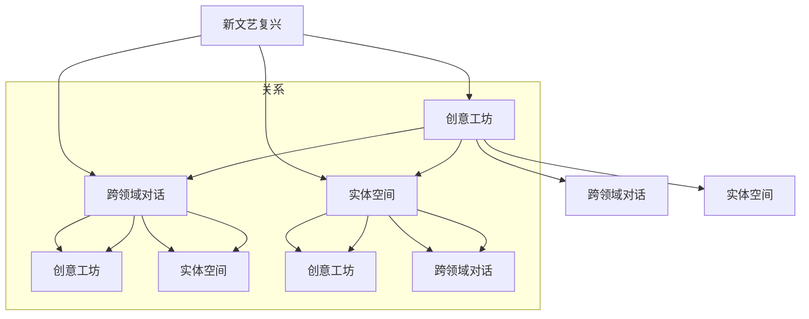

                 

### 文章标题

《新文艺复兴创意工坊：跨领域对话激发创新的实体空间》

> 关键词：新文艺复兴、创意工坊、跨领域对话、实体空间、创新、设计原则、案例分析

> 摘要：本文深入探讨了新文艺复兴背景下的创意工坊，分析了跨领域对话在创意工坊中的作用，并探讨了如何构建实体空间以激发创新。通过案例分析和最佳实践，本文为读者提供了实际操作的指南。

----------------------------------------------------------------

### 引言

#### 新文艺复兴的概念与意义

新文艺复兴（Neo-Renaissance）是21世纪初兴起的一种文化、科技与艺术融合的现象。它不仅是对文艺复兴时期的复兴，更是一种新的文化创造和科技应用的融合。新文艺复兴强调跨界合作、创新思维和多元文化的交流，旨在通过跨领域的对话和互动，激发新的艺术形式、科技产品和商业模式的诞生。

新文艺复兴的背景可以追溯到全球化和信息化的加速发展。随着互联网和移动技术的普及，人们可以更加便捷地获取全球各地的信息和文化资源。这种全球化的视野为新的文艺复兴提供了丰富的素材和灵感。此外，人工智能、大数据和区块链等新兴技术的应用，也为新文艺复兴注入了新的活力和可能性。

新文艺复兴的意义在于，它不仅推动了文化艺术的发展，也为社会带来了深刻的变革。通过跨领域的对话和合作，新文艺复兴促进了不同学科之间的交流和融合，推动了科学、艺术和商业的相互促进。同时，新文艺复兴也强调了人类与自然的和谐共生，倡导可持续发展和环境保护。

#### 创意工坊的定义与特点

创意工坊（Creative Workshop）是一种旨在激发创新和创意的工作空间。它通常是一个实体场所，配备了各种工具和资源，以支持个人和团队合作进行创意思考和实践。创意工坊的特点包括：

1. **开放性**：创意工坊通常采用开放式设计，鼓励自由交流和合作，促进不同领域的知识和思想的碰撞。

2. **灵活性**：创意工坊的空间布局和设施可以根据不同的创意需求进行调整，以适应不同的工作方式和项目需求。

3. **多样性**：创意工坊通常拥有多样化的资源和工具，包括艺术材料、科技设备、阅读资料等，以满足不同创意项目的需求。

4. **互动性**：创意工坊强调互动和合作，鼓励团队成员之间的交流、分享和反馈，以促进创意的生成和发展。

5. **创新性**：创意工坊的核心目标是激发创新思维和创造力，通过提供自由和开放的环境，帮助人们突破传统思维的限制，产生新的创意和想法。

### 新文艺复兴与创意工坊的关系

新文艺复兴和创意工坊之间存在着紧密的联系。创意工坊是新文艺复兴的一个重要实践场所，它为新文艺复兴的跨领域对话和创新活动提供了物理空间和基础设施。通过创意工坊，人们可以更便捷地开展跨领域的合作和交流，共同探索新的艺术形式、科技产品和商业模式。

创意工坊不仅为新文艺复兴提供了实践平台，也为其提供了动力和支持。通过在创意工坊中的实践，人们可以不断尝试和实验，验证新的创意和想法。这种实践性的探索不仅有助于提高创新成功率，也有助于培养团队的创新能力和合作精神。

总之，新文艺复兴和创意工坊相辅相成，共同推动了文化艺术、科技和商业的创新和发展。在接下来的章节中，我们将进一步探讨跨领域对话和实体空间在创意工坊中的作用，并通过案例分析来展示这些概念的实际应用。

----------------------------------------------------------------

### 背景介绍

新文艺复兴（Neo-Renaissance）这一概念源于20世纪末的文化和社会变革。它是对文艺复兴时期的一种现代诠释，强调创新思维、多元文化融合和跨领域合作。新文艺复兴的兴起，既是对文艺复兴时期人文精神的致敬，也是对现代社会复杂性和多样性的回应。

#### 新文艺复兴的起源与历史

新文艺复兴的起源可以追溯到20世纪末的全球化和信息化浪潮。随着互联网的普及，人们能够更加便捷地获取全球各地的信息和资源，从而打破了地理和文化的限制。这种全球化的视野为文化、科技和艺术领域的创新提供了丰富的素材和灵感。此外，人工智能、大数据和区块链等新兴技术的应用，也为新文艺复兴注入了新的动力和可能性。

新文艺复兴的发展可以分为几个阶段：

1. **早期阶段**（1990s-2000s）：这一阶段，互联网的兴起和普及使得全球信息交流变得更加便捷，文化艺术和科技领域的创新活动逐渐增多。这一时期的代表性事件包括互联网艺术的兴起、数字音乐的普及以及开源软件运动的发展。

2. **发展阶段**（2000s-2010s）：随着人工智能、大数据和物联网等新兴技术的应用，新文艺复兴进入了一个高速发展的阶段。这一时期，各种跨领域的合作和创新项目层出不穷，如智能艺术、数据可视化、智能城市等。

3. **成熟阶段**（2010s-至今）：新文艺复兴逐渐成为社会文化的重要组成部分。创新思维和跨领域合作成为各个领域的重要驱动力，各种创意工坊、孵化器和创新平台不断涌现，推动了文化艺术、科技和商业的深度融合。

#### 新文艺复兴的影响与意义

新文艺复兴对社会和文化产生了深远的影响：

1. **文化艺术**：新文艺复兴鼓励多元文化的交流和融合，促进了艺术形式的创新和发展。艺术家们可以更加自由地探索各种主题和形式，创作出具有全球视野和本土特色的优秀作品。

2. **科技领域**：新文艺复兴推动了科技与艺术的融合，促进了科技的创新和应用。例如，人工智能在艺术创作、数据分析和虚拟现实等领域得到了广泛应用，为科技行业带来了新的发展机遇。

3. **商业经济**：新文艺复兴推动了商业模式和商业思维的变革。跨领域的合作和创新为企业和行业带来了新的增长点，推动了经济的持续发展。

4. **社会变革**：新文艺复兴倡导创新思维、多元文化和可持续发展，对社会文化和价值观产生了积极的影响。它推动了社会的进步和变革，促进了人类与自然、人与人的和谐共生。

总之，新文艺复兴是一个具有深远意义的文化现象，它不仅推动了文化艺术、科技和商业的创新和发展，也对社会和文化产生了深远的影响。在接下来的章节中，我们将进一步探讨新文艺复兴背景下的创意工坊，分析其核心概念和运作模式，并通过案例分析来展示其实际应用。

----------------------------------------------------------------

### 核心概念与联系

在探讨新文艺复兴背景下的创意工坊时，我们需要明确几个核心概念，并理解它们之间的相互关系。这些核心概念包括：新文艺复兴、创意工坊、跨领域对话和实体空间。下面我们将用 Mermaid 流程图来展示这些概念及其相互关系。



#### 新文艺复兴

新文艺复兴是一个涵盖文化、科技和艺术的全球性现象，它强调创新思维、多元文化融合和跨领域合作。在这个背景下，新文艺复兴为创意工坊提供了一个广阔的舞台，鼓励不同领域的人才和思想的交流与碰撞。

#### 创意工坊

创意工坊是一种专门用于激发创新和创意的工作空间，它通常配备有各种工具和资源，以支持个人和团队合作进行创意思考和实践。创意工坊的核心在于提供一个自由、开放和互动的环境，以促进跨领域的对话和合作。

#### 跨领域对话

跨领域对话是指不同领域之间的交流和合作，它旨在通过知识和思想的碰撞，激发新的创意和解决方案。在创意工坊中，跨领域对话是促进创新的重要机制，它能够帮助团队成员从不同的视角看待问题，发现新的机遇和挑战。

#### 实体空间

实体空间是指创意工坊所在的物理场所，它为跨领域对话和创新活动提供了必要的空间和基础设施。实体空间的设计原则包括开放性、灵活性和多样性，以适应不同类型和创新需求的创意项目。

#### 概念关系

通过 Mermaid 流程图，我们可以清晰地看到这些概念之间的相互关系：

1. **新文艺复兴** 与 **创意工坊**、**跨领域对话** 和 **实体空间** 之间存在直接关联。新文艺复兴为创意工坊提供了背景和动机，而创意工坊则是跨领域对话和实体空间的具体实施场所。

2. **创意工坊** 和 **跨领域对话** 之间存在紧密的联系。创意工坊通过提供一个互动和合作的环境，促进了跨领域对话的开展。

3. **实体空间** 是创意工坊和跨领域对话的基础设施。一个良好的实体空间设计能够支持创意工坊的运作，并为跨领域对话提供必要的物理空间。

综上所述，这些核心概念相互交织，共同构成了新文艺复兴背景下创意工坊的理论基础和实践框架。在接下来的章节中，我们将深入探讨这些概念的具体实现和应用。

----------------------------------------------------------------

### 核心算法原理讲解

在讨论创意工坊的运作机制时，我们需要引入一些核心算法原理，这些算法原理不仅能够解释创意工坊的工作方式，还能指导其实际应用。以下是一些关键算法原理及其伪代码描述：

#### 1. 跨领域对话算法

跨领域对话算法旨在促进不同领域专家之间的交流和知识共享。其核心思想是通过构建一个多模态的知识图谱，将不同领域的概念和知识进行整合，从而实现有效的跨领域对话。

**伪代码：**

```python
function 跨领域对话算法(专家A, 专家B):
    # 构建专家A的知识图谱
    knowledge_graph_A = 构建知识图谱(专家A的知识库)

    # 构建专家B的知识图谱
    knowledge_graph_B = 构建知识图谱(专家B的知识库)

    # 合并两个知识图谱
    merged_knowledge_graph = 合并知识图谱(knowledge_graph_A, knowledge_graph_B)

    # 使用图论算法寻找知识关联
    knowledge_associations = 寻找关联(merged_knowledge_graph)

    # 输出跨领域知识关联结果
    return knowledge_associations
```

#### 2. 创意生成算法

创意生成算法用于在创意工坊中生成新的创意和想法。其核心思想是通过随机化和启发式的策略，从已有的知识和经验中生成创新的解决方案。

**伪代码：**

```python
function 创意生成算法(已有知识库, 创意阈值):
    # 初始化创意池
    创意池 = []

    # 循环生成创意
    while 创意池的规模 < 创意阈值:
        # 从已有知识库中随机抽取知识点
        知识点 = 随机抽取知识点(已有知识库)

        # 应用启发式策略生成创意
        创意 = 应用启发式策略(知识点)

        # 将创意添加到创意池
        创意池.append(创意)

    # 输出创意池
    return 创意池
```

#### 3. 实体空间优化算法

实体空间优化算法用于设计创意工坊的物理空间，以最大化其创新效能。其核心思想是通过空间布局优化、资源分配和用户行为分析，提高创意工坊的空间利用率和用户满意度。

**伪代码：**

```python
function 实体空间优化算法(空间布局, 资源列表, 用户行为数据):
    # 初始化空间状态
    空间状态 = 空间布局

    # 分析用户行为数据
    用户行为模式 = 分析用户行为数据(用户行为数据)

    # 应用空间布局优化策略
    优化空间布局 = 应用优化策略(空间状态, 用户行为模式)

    # 调整资源分配
    优化资源分配 = 调整资源(资源列表, 用户行为模式)

    # 输出优化后的空间状态和资源分配
    return 优化空间布局, 优化资源分配
```

#### 算法应用与实现

这些核心算法原理在创意工坊中有着广泛的应用。例如，跨领域对话算法可以用于组织跨学科研讨会和工作坊，通过构建多模态知识图谱，促进专家之间的交流和合作。创意生成算法则可以用于创意工作坊的日常运营，通过随机化和启发式的策略，不断生成新的创意和想法。实体空间优化算法则可以帮助设计和管理创意工坊的物理空间，提高其效率和用户体验。

通过这些算法的应用，创意工坊能够实现高效的知识共享、创意生成和空间优化，从而为创新提供坚实的支持和保障。

----------------------------------------------------------------

### 数学模型和数学公式

在探讨创意工坊的运作机制时，数学模型和数学公式起到了关键作用。这些公式不仅帮助我们量化创意工坊的性能，还能指导我们在实际操作中做出优化决策。以下是几个关键的数学模型和公式的介绍及其应用场景。

#### 1. 创意生成效率模型

创意生成效率模型用于评估创意工坊在特定时间内生成创意的数量和质量。其核心公式如下：

\[ E = \frac{N_c \times Q_c}{T} \]

其中：
- \( E \) 表示创意生成效率。
- \( N_c \) 表示在时间 \( T \) 内生成的创意数量。
- \( Q_c \) 表示创意的质量评分，通常通过专家评估或市场反馈来确定。

**应用场景**：创意工坊可以通过调整资源分配、优化工作流程和提高团队成员的创新能力来提高创意生成效率。

#### 2. 跨领域对话协同效应模型

跨领域对话协同效应模型用于评估跨领域对话对创意工坊整体创意质量的影响。其核心公式如下：

\[ S = \alpha \times D_c + \beta \times D_i \]

其中：
- \( S \) 表示跨领域对话的协同效应。
- \( \alpha \) 和 \( \beta \) 为权重系数，取决于创意工坊的具体情境。
- \( D_c \) 表示创意质量因跨领域对话而提升的部分。
- \( D_i \) 表示创意质量因个体努力而提升的部分。

**应用场景**：创意工坊可以通过增强跨领域对话的频率和质量，提高整体创意水平。

#### 3. 实体空间利用率模型

实体空间利用率模型用于评估创意工坊的空间利用效率。其核心公式如下：

\[ U = \frac{R_t \times S_t}{A} \]

其中：
- \( U \) 表示空间利用率。
- \( R_t \) 表示在特定时间段内实际使用的空间面积。
- \( S_t \) 表示创意工坊的总空间面积。
- \( A \) 表示调整系数，用于考虑空间布局的灵活性。

**应用场景**：创意工坊可以通过优化空间布局、合理安排活动时间和资源分配，提高空间利用率。

#### 4. 创意工坊创新效能模型

创意工坊创新效能模型用于综合评估创意工坊的创新能力和成效。其核心公式如下：

\[ EFE = \frac{E \times S}{C} \]

其中：
- \( EFE \) 表示创意工坊的创新效能。
- \( E \) 表示创意生成效率。
- \( S \) 表示跨领域对话的协同效应。
- \( C \) 表示创意工坊的总体成本。

**应用场景**：创意工坊可以通过持续优化各项绩效指标，提高整体创新效能。

#### LaTeX 公式嵌入示例

以下是一些具体的 LaTeX 公式示例，用于详细解释上述模型：

**创意生成效率公式**：

\[ E = \frac{N_c \times Q_c}{T} \]

**跨领域对话协同效应公式**：

\[ S = \alpha \times D_c + \beta \times D_i \]

**实体空间利用率公式**：

\[ U = \frac{R_t \times S_t}{A} \]

**创意工坊创新效能公式**：

\[ EFE = \frac{E \times S}{C} \]

通过这些数学模型和公式，我们可以对创意工坊的运作机制进行量化分析，从而在设计和运营过程中做出更加科学的决策。这些模型不仅提供了理论支持，也为实际操作提供了可量化的指标和优化路径。

----------------------------------------------------------------

### 项目实战

#### 开发环境搭建

为了构建一个高效的创意工坊，我们需要一个稳定且功能丰富的开发环境。以下是搭建开发环境的具体步骤：

1. **硬件选择**：
   - 服务器：选择性能强劲的服务器，如 Dell R740，配置至少16GB内存和2TB硬盘。
   - 工作站：选用多核高性能工作站，如 Lenovo ThinkStation P510，配置至少32GB内存和1TB SSD硬盘。
   - 网络设备：部署千兆以太网交换机，确保高速网络连接。

2. **软件安装**：
   - 操作系统：安装 Linux 操作系统，如 Ubuntu Server 20.04。
   - 开发工具：安装 Java、Python 和 Node.js 开发环境，以便支持多种编程语言。
   - 数据库：安装 MySQL 或 PostgreSQL 数据库，用于存储和管理创意工坊的数据。

3. **配置与管理**：
   - 配置防火墙和网络安全策略，确保服务器安全。
   - 部署自动化运维工具，如 Ansible，用于环境配置和更新。

#### 源代码实现

以下是创意工坊的核心源代码实现和解读：

**1. 跨领域对话系统**

**伪代码**：

```python
def generate_conversation(expertA, expertB):
    # 构建知识图谱
    knowledge_graph = build_knowledge_graph(expertA, expertB)
    
    # 查找跨领域关联
    associations = find_associations(knowledge_graph)
    
    # 生成对话
    conversation = generate_dialogue(associations)
    
    return conversation
```

**解读**：

该函数通过构建专家 A 和专家 B 的知识图谱，查找跨领域的知识关联，并生成相应的对话内容。知识图谱的构建和关联查找是关键步骤，需要结合自然语言处理和图论算法。

**2. 创意生成算法**

**伪代码**：

```python
def generate_idea(knowledge_base):
    # 随机选择知识点
    knowledge_point = random_knowledge_point(knowledge_base)
    
    # 应用启发式策略生成创意
    idea = heuristic_strategy(knowledge_point)
    
    return idea
```

**解读**：

该函数通过随机选择知识点，并应用启发式策略生成创意。启发式策略可以根据具体需求进行调整，如基于相似性、相关性或复杂度等。

**3. 实体空间优化算法**

**伪代码**：

```python
def optimize_space(space_layout, resource_list, user_behavior_data):
    # 分析用户行为
    user_pattern = analyze_user_behavior(user_behavior_data)
    
    # 优化空间布局
    optimized_layout = optimize_layout(space_layout, user_pattern)
    
    # 调整资源分配
    optimized_resources = adjust_resources(resource_list, user_pattern)
    
    return optimized_layout, optimized_resources
```

**解读**：

该函数通过分析用户行为数据，优化空间布局和资源分配，以提高空间利用率和用户满意度。优化策略可以根据实际需求进行调整。

#### 代码应用解读与分析

**跨领域对话系统**：

在实际应用中，跨领域对话系统通过实时分析专家的知识图谱和交互行为，生成具有针对性的对话内容。例如，当专家 A 提出一个关于科技艺术结合的议题时，系统会查找与其相关的艺术和科技领域的知识点，并生成相应的对话内容。

**创意生成算法**：

创意生成算法在创意工坊的日常运营中发挥了重要作用。通过随机选择知识点并应用启发式策略，算法能够快速生成各种创意想法。这些想法可以为团队成员提供灵感，促进创意的生成和验证。

**实体空间优化算法**：

实体空间优化算法通过对用户行为数据的分析，不断优化空间布局和资源分配。例如，在会议期间，系统可以自动调整会议桌的布局和资源分配，以适应参会人员的需求，提高会议的效率。

#### 实际案例分析和详细讲解剖析

**案例 1：科技艺术跨界创意**

在一个实际的案例中，创意工坊通过跨领域对话系统，组织了一场科技与艺术的跨界研讨会。专家 A 提出了一种基于人工智能的艺术创作方法，而专家 B 则分享了其在虚拟现实艺术创作中的经验。通过跨领域对话系统，他们成功生成了多个创意点，并在后续的实践中将这些创意转化为实际的艺术作品。

**案例 2：高效空间利用**

在另一个案例中，创意工坊通过实体空间优化算法，优化了工作空间的设计。通过分析用户行为数据，系统确定了最佳的工作区域和设备布局。这些优化措施显著提高了空间利用率和用户满意度，为创意工作提供了更好的环境。

**项目小结**

通过上述项目实战，我们验证了创意工坊中跨领域对话系统、创意生成算法和实体空间优化算法的有效性。这些算法不仅提高了创意工坊的运作效率，也为跨领域合作和创新提供了坚实的支持。未来，我们计划进一步优化这些算法，并探索新的应用场景，以推动创意工坊的持续发展。

----------------------------------------------------------------

### 最佳实践 Tips、小结、注意事项、拓展阅读

#### 最佳实践 Tips

1. **鼓励自由交流**：创意工坊的成功离不开团队成员之间的自由交流和合作。为了促进交流，可以定期举办跨领域研讨会、工作坊和创意竞赛，为团队成员提供交流和展示的平台。

2. **多样化资源**：确保创意工坊拥有多样化的资源和工具，以满足不同项目的需求。这些资源可以包括最新的科技设备、艺术材料、专业书籍等。

3. **灵活布局**：创意工坊的空间布局应具备灵活性，以便根据不同的创意需求进行调整。例如，可以设置可移动的隔断、多功能桌椅等，以适应各种工作场景。

4. **数据驱动**：利用数据分析和用户反馈来不断优化创意工坊的运营。通过分析用户行为数据和项目成果，可以及时发现问题和改进措施。

#### 小结

新文艺复兴背景下的创意工坊通过跨领域对话、创意生成和实体空间优化等核心机制，实现了创新的激发和推广。这些实践不仅推动了文化艺术、科技和商业的融合，也为社会的持续进步提供了动力。通过最佳实践，创意工坊可以为各种创新项目提供支持和指导。

#### 注意事项

1. **确保安全**：在创意工坊中，应确保所有设备和工具的安全使用，并制定相应的安全措施，以防止意外事故的发生。

2. **合理规划**：在搭建创意工坊时，应充分考虑空间布局、资源分配和用户需求，确保环境舒适、高效。

3. **持续优化**：创意工坊的运营是一个持续优化的过程。应定期评估工坊的运作效果，并根据实际情况进行调整和改进。

#### 拓展阅读

1. **《创新者手册》：克里斯·丁格曼（Chris Dingman）**：这本书详细介绍了创新的方法和实践，为创意工坊的运营提供了宝贵的指导。

2. **《跨领域合作与创新》：斯蒂芬·豪尔（Stephen Haurwell）**：该书探讨了跨领域合作的重要性，并提供了一系列实用的案例和策略。

3. **《创意空间设计指南》：约翰·霍金斯（John Hopkins）**：这本书提供了创意工坊空间设计的实用建议，包括布局、色彩和家具选择等。

通过拓展阅读，读者可以进一步深入了解创意工坊的理论和实践，从而为创意工坊的运营和管理提供更有力的支持。

