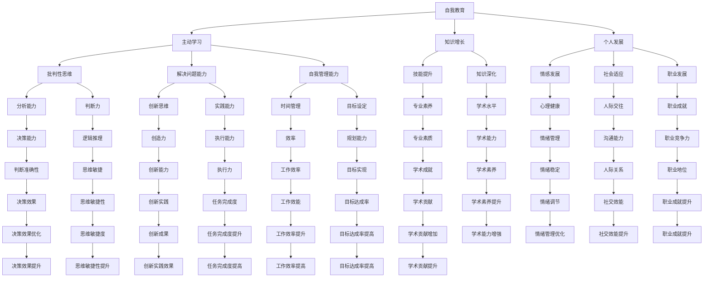

                 

### 文章标题

### 新文艺复兴自学计划：全方位发展的个人教育方案

#### 关键词

- 新文艺复兴
- 自我教育
- 全方位发展
- 教育方案
- 艺术与科学

#### 摘要

本文旨在探讨新文艺复兴背景下的自学计划，提出一个全方位发展的个人教育方案。通过分析新文艺复兴时期的背景知识、自我教育的核心概念与联系，以及实用学习资源与技巧，本文旨在为读者提供一套系统的自学指南，帮助他们在艺术、科学和人文领域实现全面的发展。

### 引言

新文艺复兴是一个充满活力和变革的时代，它不仅对艺术和科学产生了深远的影响，而且对个人教育理念也带来了深刻的启示。在这个背景下，自我教育显得尤为重要。自我教育不仅仅是一种学习方式，更是一种生活态度和价值观的体现。它强调个人主动探索和发现知识，通过自主学习实现全面发展。

本文将首先介绍新文艺复兴的背景知识，包括其起源、发展以及影响。随后，我们将探讨自我教育的核心概念与联系，通过一个Mermaid流程图来展示这些概念之间的关系架构。接下来，本文将详细介绍实用学习资源与技巧，帮助读者有效地进行自我教育。随后，我们将深入探讨个人发展理论，包括自我认知、目标设定与规划等方面。在艺术、文学与人文教育方面，本文将探讨其价值与内容，并介绍科学、技术教育与STEM的重要性。最后，本文将讨论健康与体育教育的作用，并提供项目实战的案例，以供读者参考。通过这些探讨，本文旨在为读者提供一个全方位发展的个人教育方案，帮助他们在这个新文艺复兴时代实现自我提升。

### 新文艺复兴时期的背景知识

#### 起源与发展

新文艺复兴（Renaissance）起源于14世纪的意大利，并在随后的几个世纪中逐渐扩展到整个欧洲。这个时期的背景可以追溯到中世纪的结束，以及地中海贸易的繁荣和城市经济的发展。意大利的佛罗伦萨被认为是新文艺复兴的发源地，因为它拥有丰富的文化遗产、富裕的商人和银行家，以及开放的思想氛围。

新文艺复兴时期的兴起与一系列重要的社会、经济和文化变革密切相关。首先，中世纪的封建制度逐渐瓦解，城市化进程加速，商人和工匠阶层的兴起带来了新的经济活力。其次，地中海贸易的繁荣使得意大利的城市成为贸易中心，这也促进了文化交流和知识传播。最后，基督教会的权威逐渐减弱，人们开始重新审视古典文化和人文主义思想，追求个人自由和独立思考。

#### 价值观与思想体系

新文艺复兴时期的价值观和思想体系具有深远的影响。首先，人文主义成为这一时期的核心思想。人文主义强调人的价值和尊严，主张通过个人努力实现自我完善和全面发展。与中世纪重视宗教和神学不同，人文主义更加注重人类自身的力量和智慧。

其次，新文艺复兴时期推崇科学和理性思维。这一时期出现了许多重要的科学家和发明家，如伽利略、哥白尼和牛顿等，他们的发现和理论为现代科学奠定了基础。科学方法的发展使得人们能够通过观察、实验和推理来解决问题，这与中世纪的权威主义和教条主义形成了鲜明对比。

此外，新文艺复兴时期还强调艺术的重要性。艺术家们开始追求真实、自然的艺术表现，通过绘画、雕塑和建筑等艺术形式来探索和表达人类的情感和思想。文艺复兴时期的艺术作品不仅具有高度的艺术价值，也对后来的艺术发展产生了深远影响。

#### 重要人物与作品

新文艺复兴时期涌现了许多杰出的艺术家、科学家和思想家。以下是一些重要人物及其作品：

- **达·芬奇（Leonardo da Vinci）**：作为一位多才多艺的艺术家和科学家，达·芬奇的作品涵盖了绘画、解剖学、机械学等多个领域。他的代表作包括《蒙娜丽莎》和《最后的晚餐》等。

- **米开朗基罗（Michelangelo）**：米开朗基罗是一位杰出的雕塑家、画家和建筑师。他的作品如《大卫像》和西斯廷教堂的天花板画等，展示了他在艺术上的卓越才华。

- **拉斐尔（Raphael）**：拉斐尔以其和谐的绘画风格和精湛的技巧著称，他的代表作《圣母子像》和《雅典学院》等，体现了文艺复兴时期的艺术美学。

- **伽利略（Galileo Galilei）**：伽利略是一位重要的科学家，他通过望远镜观测天体，提出了日心说的理论，对科学革命产生了深远影响。

- **马基雅维利（Niccolò Machiavelli）**：马基雅维利是一位思想家和政治家，他的著作《君主论》和《论李维》等，对政治哲学和国际关系产生了重要影响。

这些人物和作品不仅代表了新文艺复兴时期的最高成就，也为我们提供了一个了解这一时期价值观和思想体系的窗口。通过他们的作品，我们可以看到新文艺复兴时期对人类知识、艺术和思想的全面探索和追求。

### 自我教育的核心概念与联系

自我教育是一种通过个人主动学习来实现知识增长和个人发展的过程。它不仅包括获取新知识和技能，还涉及培养批判性思维、解决问题能力和自我管理能力。为了更好地理解自我教育的核心概念，我们可以通过一个Mermaid流程图来展示这些概念之间的关系架构。



通过这个流程图，我们可以清晰地看到自我教育的各个核心概念之间的关系。主动学习是自我教育的基石，它促使知识增长和个人发展。批判性思维、解决问题能力和自我管理能力是主动学习的衍生物，它们共同构成了个人发展的关键能力。

知识增长不仅包括技能提升和知识深化，还涉及情感发展、社会适应和职业发展等方面。这些方面相互关联，共同推动个人的全面发展。同时，技能提升和知识深化也为个人发展提供了坚实的基础。

在个人发展的过程中，情感发展、社会适应和职业发展相互影响。情感发展有助于提高心理健康和情绪管理能力，从而更好地适应社会环境。社会适应则有助于建立良好的人际关系，提高沟通能力和社交效能。职业发展则通过专业技能的提升和学术成就的取得，进一步推动个人的全面发展。

通过这个流程图，我们可以更好地理解自我教育的核心概念和它们之间的联系，从而为自我教育提供有效的指导。

### 实用学习资源与技巧

在自我教育的过程中，选择合适的学习资源和技巧是至关重要的。以下是一些推荐的学习资源以及使用这些资源的技巧：

#### 在线学习平台

1. **Coursera**：提供来自世界顶级大学和机构的在线课程，涵盖多个领域，如计算机科学、商业管理、医学等。

2. **edX**：由哈佛大学和麻省理工学院合作创办，提供免费和付费在线课程，涵盖科学、人文、工程等多个学科。

3. **Khan Academy**：提供免费的教育资源，包括视频课程、练习题和测试，适合各个年龄段的学习者。

4. **Udemy**：提供广泛的主题课程，包括编程、设计、市场营销等，适用于个人和职业发展。

#### 教育应用程序

1. **Duolingo**：一款流行的语言学习应用程序，通过互动练习帮助用户掌握多种语言。

2. **Quizlet**：提供学习卡片和闪卡工具，帮助用户记忆知识点和词汇。

3. **Anki**：一款强大的记忆工具，通过间隔重复算法帮助用户有效记忆。

#### 学习策略与方法

1. **分散学习**：将学习内容分散在多个时间段进行，以避免疲劳和提高记忆效果。

2. **主动学习**：不仅仅是被动地阅读或观看视频，还要积极参与，如做笔记、总结和提问。

3. **应用与实践**：将所学知识应用于实际情境中，通过实践来巩固和加深理解。

4. **反思与评估**：定期反思学习过程，评估学习效果，并根据评估结果调整学习计划。

#### 网络资源和书籍推荐

1. **MIT OpenCourseWare**：提供麻省理工学院的大量课程资料，涵盖自然科学、社会科学和工程等领域。

2. **Project Gutenberg**：提供免费电子书，涵盖文学、历史、哲学等广泛领域。

3. **Google Scholar**：一个免费资源，可以搜索学术文章和论文，适合进行深入研究。

4. **《深度学习》**（Deep Learning）by Ian Goodfellow、Yoshua Bengio和Aaron Courville：深度学习领域的经典教材，适合希望深入了解人工智能和机器学习的学习者。

5. **《人类简史》**（Sapiens: A Brief History of Humankind）by Yuval Noah Harari：通过历史视角探讨人类文明的发展，适合对人文和社会科学感兴趣的读者。

通过这些实用学习资源和技巧，学习者可以更加高效地开展自我教育，实现个人全面发展。

### 个人发展理论

个人发展理论是自我教育的重要理论基础，它探讨个体在知识、情感、社会和职业等方面的成长过程。以下是几个关键的个人发展理论，以及它们在自我教育中的应用：

#### 自我认知理论

自我认知理论认为，个人对自我认知的程度直接影响其自我教育和成长。卡尔·罗杰斯（Carl Rogers）的自我概念理论强调，个体需要建立积极的自我认知，以促进自我实现和全面发展。在自我教育中，这一理论的应用包括：

1. **自我反思**：通过定期反思自己的学习过程、情感状态和行为模式，个体可以更好地了解自己的优势和不足，从而调整学习计划。

2. **目标设定**：基于自我认知，个体可以设定具体、可实现的目标，以推动自我成长。

#### 成长发展理论

埃里克·埃里克森（Erik Erikson）的成长发展理论提出，个体在不同生命周期阶段会面临特定的心理社会危机，如信任对怀疑、自主对羞愧等。这些危机的解决有助于个体的成长和发展。在自我教育中，这一理论的应用包括：

1. **阶段性学习**：根据个体在不同生命阶段的需求和目标，设计相应的学习内容和计划。

2. **终身学习**：强调个体应持续学习，以适应不断变化的社会环境和职业要求。

#### 自我决定理论

德西和瑞恩（Deci & Ryan）的自我决定理论认为，内在动机是推动个体成长和发展的关键因素。该理论提出了三个基本心理需求：自主、能力和归属感。在自我教育中，这一理论的应用包括：

1. **自主选择**：鼓励个体根据个人兴趣和需求选择学习内容，以提高内在动机。

2. **能力培养**：通过提供挑战性和支持性的学习环境，帮助个体建立自信心和成就感。

#### 学习风格理论

彼得·霍尔（Peter Honey）和阿尔弗雷德·普雷斯顿（Alfred Pressey）的学习风格理论认为，个体有不同的学习偏好，如反思型、活跃型、理论型和经验型等。了解自己的学习风格有助于个体选择最适合自己的学习方法和策略。在自我教育中，这一理论的应用包括：

1. **个性化学习**：根据个人学习风格，选择最适合的学习资源和方法，以提高学习效果。

2. **交叉验证**：结合不同学习风格的方法，以全面掌握学习内容。

通过这些个人发展理论的应用，个体可以在自我教育中更好地了解自己，设定明确的目标，激发内在动机，并选择合适的学习策略，从而实现全面发展和成长。

### 艺术与文学教育的重要性

艺术与文学教育在新文艺复兴时期扮演了重要角色，它们不仅丰富了人类的精神世界，还推动了社会的进步和文化的发展。首先，艺术教育通过视觉和情感体验，帮助个体培养审美能力、创造力和想象力。艺术家如达·芬奇和米开朗基罗的作品，不仅展现了他们对美的追求，也反映了他们对科学和哲学的深刻理解。

文学教育则通过文字和故事，传递人类的思想、情感和文化。文学作品如莎士比亚的戏剧和荷马的史诗，不仅提供了丰富的文化知识，也培养了个体的批判性思维和情感认知能力。在自我教育中，艺术与文学教育的重要性体现在以下几个方面：

#### 艺术教育的作用

1. **审美能力培养**：通过欣赏艺术作品，个体可以提升对美的感知和欣赏能力，从而丰富自己的精神世界。

2. **创造力激发**：艺术创作过程有助于激发个体的创造力，鼓励他们大胆创新，探索未知的领域。

3. **情感表达**：艺术作品常常承载着情感和思想，通过艺术教育，个体可以更好地理解和表达自己的情感。

#### 文学教育的价值

1. **文化传承**：文学作品是文化传承的重要载体，通过阅读和学习文学作品，个体可以了解和传承人类的文化遗产。

2. **批判性思维**：文学作品通常包含复杂的社会问题和道德困境，通过分析这些作品，个体可以培养批判性思维和独立思考能力。

3. **情感认知**：文学作品通过故事和人物，帮助个体理解和体验不同的情感状态，从而提升情感认知能力。

#### 艺术与文学教育在自我教育中的应用

1. **自主学习**：个体可以通过自学艺术理论和文学批评，提高自己的专业素养。

2. **跨学科融合**：将艺术与文学知识应用于其他学科，如哲学、历史和社会科学，以实现知识的综合应用。

3. **实践创作**：通过艺术创作和文学写作，个体可以实践所学知识，提升实践能力。

总之，艺术与文学教育在自我教育中具有重要的价值和作用，它们不仅丰富了个体的人生体验，也推动了人类文化的进步和社会的发展。通过艺术与文学教育，个体可以实现全面的发展，提升自己的综合素质。

### 科学与技术教育的重要性

科学和技术教育在个人发展和社会发展中的重要性不容忽视。科学教育强调通过实验和观察来理解自然现象，培养科学思维和解决问题的能力。技术教育则侧重于掌握和应用科学技术，以解决现实问题并推动社会进步。

首先，科学教育对个人发展的影响体现在以下几个方面：

1. **批判性思维**：科学教育鼓励个体通过实证和逻辑推理来分析问题，从而培养批判性思维和独立思考能力。

2. **创新能力**：科学教育通过实验和实践，激发个体的好奇心和创造力，帮助他们探索新的解决方案。

3. **知识积累**：科学教育帮助个体建立系统的科学知识体系，为他们未来的学习和职业发展奠定基础。

其次，技术教育在现代社会中发挥着关键作用：

1. **技能培养**：技术教育帮助个体掌握各种实用技能，如编程、设计、工程等，提高他们在职场中的竞争力。

2. **适应能力**：随着科技的发展，新技术层出不穷。技术教育帮助个体保持对新技术的敏感性，提高适应变化的能力。

3. **创新实践**：技术教育鼓励个体将理论知识应用于实际项目中，从而实现知识的创新和实践。

科学和技术教育在社会发展中同样具有重要作用：

1. **科技进步**：科学技术的进步推动了工业革命和现代社会的快速发展，为人类带来了前所未有的便利和福祉。

2. **经济发展**：科技产业成为许多国家经济增长的重要驱动力，通过技术创新和产业升级，推动经济的持续增长。

3. **社会问题解决**：科学技术在环境保护、医疗健康、能源开发等领域发挥着重要作用，帮助解决人类面临的各种挑战。

综上所述，科学和技术教育不仅对个人的全面发展具有重要意义，也对社会进步和经济发展产生了深远影响。通过科学和技术教育，个体可以提升自身素质，社会可以实现持续发展和进步。

### 健康与体育教育的重要性

健康与体育教育在个人发展和社会进步中扮演着至关重要的角色。首先，健康教育关注个体的身体健康和心理状态，通过传授健康知识和技能，帮助个体建立健康的生活习惯。健康教育的核心内容包括营养、锻炼、疾病预防和心理健康等方面。例如，通过了解合理的饮食习惯和科学的锻炼方法，个体可以维持良好的身体状况，提高生活质量。

体育教育则侧重于培养个体的运动技能和团队合作精神。体育活动不仅有助于增强体质，提高体能，还能促进心理健康的全面发展。例如，参与体育活动可以帮助个体缓解压力、提高情绪管理能力，增强自信心和毅力。

在自我教育中，健康与体育教育的重要性体现在以下几个方面：

1. **综合发展**：健康与体育教育强调个体的全面发展，通过身体和精神的锻炼，提升个体的整体素质。

2. **提高学习效率**：良好的身体状况有助于提高学习效率。体育活动和锻炼能够促进大脑功能的提升，有助于更好地吸收和记忆知识。

3. **培养自律精神**：健康与体育教育培养个体的自律精神和毅力，这些品质在自我教育过程中尤为重要。

4. **增强社会适应能力**：体育活动中的团队合作和竞争经验有助于个体更好地适应社会环境，提高人际交往能力和团队合作能力。

总之，健康与体育教育不仅对个体的身体和心理健康具有积极影响，也是实现个人全面发展和社会进步的重要基石。通过重视健康与体育教育，个体可以更好地应对生活中的各种挑战，实现自我提升和全面发展。

### 项目实战

#### 开发环境搭建

为了实施一个全面的自我教育项目，我们首先需要搭建一个合适的开发环境。以下是一个基于Python的简单示例，用于自我学习和实践编程技能。

1. **安装Python**：首先，下载并安装Python。我们可以从Python的官方网站（https://www.python.org/）下载Python安装包。

    ```shell
    # 在Windows上安装Python
    python-3.10.8-amd64.exe

    # 在macOS上安装Python
    python3.10-macOS11.0-x86_64.pkg
    ```

2. **配置Python环境**：安装完成后，确保Python已正确安装。可以通过以下命令检查Python版本：

    ```shell
    python --version
    ```

3. **安装必要库**：对于Python编程，我们需要安装一些常用的库，如NumPy、Pandas和Matplotlib。可以使用pip进行安装：

    ```shell
    pip install numpy pandas matplotlib
    ```

#### 源代码实现

以下是一个简单的Python程序，用于数据分析。该程序读取一个CSV文件，分析数据并绘制一个柱状图。

```python
import pandas as pd
import matplotlib.pyplot as plt

# 读取数据
data = pd.read_csv('data.csv')

# 计算平均值
average = data.mean()

# 绘制柱状图
plt.bar(data.columns, average)
plt.xlabel('Features')
plt.ylabel('Average')
plt.title('Average of Features')
plt.show()
```

#### 代码解读与分析

1. **导入库**：首先，我们导入pandas和matplotlib两个库，用于数据分析和图表绘制。

2. **读取数据**：使用`pd.read_csv()`函数读取CSV文件。假设CSV文件名为`data.csv`。

3. **计算平均值**：使用`mean()`函数计算数据集的每个特征的平均值。

4. **绘制柱状图**：使用`plt.bar()`函数绘制柱状图，`plt.xlabel()`、`plt.ylabel()`和`plt.title()`函数分别设置X轴标签、Y轴标签和图表标题。

#### 实际案例分析

假设我们有一个包含员工年龄和薪资的数据集，我们希望分析不同年龄段员工的平均薪资。

1. **数据准备**：首先，我们将数据按年龄段分组。

    ```python
    data['AgeGroup'] = pd.cut(data['Age'], bins=[20, 30, 40, 50, 60], labels=['20-30', '30-40', '40-50', '50-60'])
    ```

2. **计算平均薪资**：然后，计算每个年龄段员工的平均薪资。

    ```python
    avg_salary = data.groupby('AgeGroup')['Salary'].mean()
    ```

3. **绘制柱状图**：最后，绘制每个年龄段的平均薪资柱状图。

    ```python
    avg_salary.plot(kind='bar')
    plt.xlabel('Age Groups')
    plt.ylabel('Average Salary')
    plt.title('Average Salary by Age Group')
    plt.show()
    ```

#### 项目小结

通过这个项目，我们学习了如何使用Python进行数据处理和可视化。这不仅帮助我们理解了数据分析的基本概念，还提升了我们的编程技能。项目实战是自我教育的重要部分，通过实际操作，我们可以将所学知识应用到实际问题中，实现知识的深化和应用。

### 最佳实践 tips

在自我教育的过程中，以下是一些实用的最佳实践和注意事项：

1. **定期复习**：学习新知识后，定期复习以巩固记忆。可以使用Anki等记忆工具进行间隔重复。

2. **设定目标**：为自己设定具体、可实现的学习目标，并制定详细的计划。

3. **主动学习**：不仅仅是被动地接受信息，还要积极参与，如做笔记、提问和讨论。

4. **多样化学习**：结合不同类型的资源，如书籍、视频和在线课程，以获取全面的知识。

5. **实践应用**：将所学知识应用到实际项目中，通过实践来加深理解。

6. **保持健康**：注意身体健康和心理健康，通过体育锻炼和健康饮食来提高学习效率。

7. **定期评估**：定期评估学习效果，根据评估结果调整学习计划。

8. **建立学习社群**：加入学习社群，与他人交流和讨论，以获得反馈和支持。

### 小结

通过本文的探讨，我们提出了一套全方位发展的个人教育方案，旨在帮助读者在新文艺复兴的背景下实现自我提升。从背景介绍、核心概念与联系、实用学习资源与技巧，到个人发展理论、艺术与文学教育、科学技术教育以及健康与体育教育，本文提供了一个系统的自学指南。通过项目实战和最佳实践 tips，读者可以更有效地实施自我教育计划。希望本文能为读者在自我提升的道路上提供有价值的指导和启示。

### 拓展阅读

为了进一步深入探讨新文艺复兴时期的教育理念和自我教育实践，以下是一些推荐阅读的书籍和资源：

1. **《新文艺复兴：历史与意义》**：作者通过详细的历史叙述，介绍了新文艺复兴的起源、发展和影响，对理解这一时期的背景知识有很大帮助。

2. **《自我教育》**：作者详细阐述了自我教育的概念、方法和应用，提供了许多实用的案例和建议，对开展自我教育有很高的参考价值。

3. **《如何阅读一本书》**：作者艾德温·布鲁克斯·威尔逊（Edwin Brook Wilson）提供了一种有效的阅读方法，帮助读者提高阅读理解和知识吸收能力。

4. **《艺术与科学的融合》**：这本书探讨了艺术与科学在自我教育中的应用，通过具体案例展示了如何将艺术与科学知识结合起来，实现全面发展。

5. **《深度学习》**：Ian Goodfellow、Yoshua Bengio和Aaron Courville合著的这本书是深度学习领域的经典教材，适合对人工智能和机器学习感兴趣的学习者。

6. **《人类简史》**：Yuval Noah Harari的《人类简史》通过历史视角探讨了人类文明的发展，为理解文化传承和个人发展提供了有益的思考。

通过阅读这些书籍和资源，读者可以更深入地理解新文艺复兴时期的教育理念和自我教育实践，为自己的全面发展提供更丰富的知识和视角。

