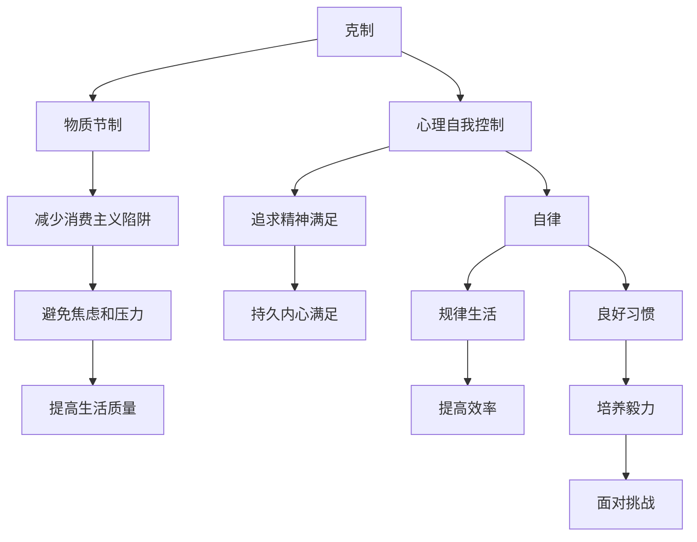

                 

### 文章标题

《新禁欲主义实验日志：记录克制生活的收获的博客平台》

> 关键词：新禁欲主义、克制生活、博客平台、心理健康、生活方式实验

> 摘要：本文将深入探讨新禁欲主义这一生活方式实验，通过博客平台的记录与分享，分析其对社会和个人生活的深远影响。文章将从理论背景、实验方法、心理与生理变化、社交影响以及实际案例分析等多个维度展开，旨在为读者提供一份全面而深刻的实验日志。

### 引言

新禁欲主义，这一概念起源于对传统禁欲主义的反思和再解读。它主张在现代社会中，通过克制物质和欲望的过度追求，寻求一种更为平衡、健康的生活方式。新禁欲主义的核心理念在于减少物质消费、关注内心需求、追求精神满足，并试图在个人生活中实现一种克制、自律的状态。

在全球范围内，新禁欲主义逐渐成为一种流行的趋势。越来越多的人开始尝试克制购物、减少社交媒体使用、专注个人成长，以期实现生活质量的提升。这一现象引发了广泛的讨论和关注，使得新禁欲主义成为了一个值得深入研究的课题。

本文旨在通过记录一系列新禁欲主义实验，探讨这一生活方式对社会和个人生活的深远影响。通过博客平台的记录和分享，我们将从心理、生理、社交等多个角度分析实验结果，为读者提供一份全面而深刻的实验日志。接下来，我们将首先介绍新禁欲主义的核心概念与联系，为后续章节的内容奠定基础。

### 核心概念与联系

新禁欲主义的核心概念可以概括为“克制”与“自律”。克制不仅仅是物质上的节制，更包括心理上的自我控制。自律则强调个体通过自我管理和规划，实现生活目标的实现。这两个概念相互关联，共同构成了新禁欲主义的理论基础。

首先，克制是应对现代社会物质泛滥和欲望诱惑的一种方式。通过克制物质消费，个体可以减少不必要的开销，避免陷入消费主义的陷阱。同时，克制还能帮助个体更好地关注内心需求，追求精神上的满足。这种内在的满足感往往比物质满足更为持久和深刻。

其次，自律是实现克制的必要手段。自律要求个体在日常生活中坚持规律的生活方式，养成良好的习惯。通过自律，个体能够更好地管理自己的时间和精力，提高工作效率和生活质量。自律还培养了个体的毅力和决心，使得个体能够面对各种挑战，坚持不懈地追求目标。

在新禁欲主义的框架下，克制与自律相互促进，共同推动个体实现生活质量的提升。克制帮助个体摆脱物质和欲望的束缚，减少焦虑和压力；自律则使个体能够更好地管理自己的生活和精力，提高生活效率。这两者之间的关系可以用一个Mermaid流程图来表示：



通过这个流程图，我们可以清晰地看到克制与自律之间的相互关系和作用。克制帮助个体实现物质和心理上的自由，而自律则为个体提供了实现这些目标的具体路径和工具。因此，新禁欲主义不仅仅是一种生活方式的实验，更是一种生活哲学，旨在通过克制和自律，实现个体和社会的和谐发展。

### 实际操作指南

要开始实施新禁欲主义实验，首先需要明确实验的目标和预期结果。这包括减少不必要的物质消费、减少社交媒体使用时间、专注于个人成长和自我提升等。接下来，我们将分阶段详细描述如何实施这一实验，并提供实用的技巧和策略。

#### 第一阶段：制定计划

1. **设定具体目标**：明确你希望在新禁欲主义实验中实现的具体目标。例如，减少购物频率、每天使用社交媒体的时间限制、专注于阅读和学习等。
2. **制定时间表**：根据目标设定一个具体的时间表。例如，每周购物不超过一次，每天使用社交媒体的时间不超过30分钟等。
3. **记录初始状态**：在开始实验之前，记录下你的当前生活习惯和消费模式，这有助于你在实验过程中进行对比和分析。

#### 第二阶段：逐步实施

1. **建立自律机制**：为了确保实验的顺利进行，建立自律机制至关重要。这可以通过设置提醒、使用自律应用、寻求朋友或家人的支持来实现。
2. **分解目标**：将大目标分解成小目标，逐步实施。例如，如果你希望减少购物，可以先将每周购物次数从三次减少到两次，然后再逐步减少。
3. **学会拒绝**：在实验过程中，你可能会遇到各种诱惑和挑战。学会拒绝这些诱惑，坚持你的目标，是成功的关键。

#### 第三阶段：调整与适应

1. **定期评估进展**：每隔一段时间，评估实验的进展情况。这可以帮助你了解哪些策略有效，哪些需要改进。
2. **调整策略**：根据评估结果，及时调整你的实验计划。例如，如果发现每天使用社交媒体的时间难以控制，可以考虑进一步减少使用时间。
3. **保持积极心态**：保持积极的心态对于实验的顺利进行至关重要。遇到困难时，不要轻易放弃，而是积极寻找解决方案。

#### 实用技巧和策略

1. **设定奖励机制**：为了激励自己坚持下去，可以设定一些小奖励。例如，每完成一个阶段目标，就给自己买一件喜欢的物品或享受一次喜欢的活动。
2. **分享实验过程**：通过博客或社交媒体分享你的实验过程和心得体会，可以增加你的动力和责任感。
3. **寻求专业帮助**：如果你在实验过程中遇到严重困难，可以考虑寻求心理咨询师或生活教练的帮助。

通过以上步骤和策略，你可以逐步实施新禁欲主义实验，并在实验过程中不断调整和适应。记住，克制和自律需要时间和耐心，但只要你坚持下去，一定会收获丰硕的成果。

### 心理层面分析

新禁欲主义实验不仅在物质和生理层面上产生影响，更在心理层面上带来了显著的变化。通过克制物质消费和欲望，个体能够获得一种前所未有的心理满足和自由。以下将从积极和消极两个方面分析新禁欲主义对个人心理的影响。

#### 积极影响

1. **减少焦虑和压力**：随着物质消费的减少，个体对物质的依赖和焦虑感也会逐渐降低。新禁欲主义鼓励个体关注内心的需求，通过精神上的满足来减轻压力。这种心理上的满足比物质满足更为持久，能够带来更深层次的幸福感。
2. **增强自我控制力**：新禁欲主义实验要求个体在日常生活中坚持自律，这种自律训练能够显著提高个体的自我控制力。自我控制力的增强不仅有助于实现实验目标，还能在日常生活中更好地应对各种挑战。
3. **提高生活质量**：通过减少不必要的物质消费，个体能够有更多的时间和精力投入到个人成长和兴趣爱好的培养中。这种精神上的充实感能够显著提高生活质量，使个体更加满足和幸福。

#### 消极影响

1. **心理压力**：尽管新禁欲主义有助于减少物质消费和焦虑，但在实施过程中，个体可能会面临巨大的心理压力。尤其是在初期，克制欲望和物质消费可能会引发强烈的内心冲突和挣扎，使人感到沮丧和困惑。
2. **社交障碍**：新禁欲主义实验可能会影响个体的社交关系。例如，减少社交媒体使用可能导致与朋友的互动减少，甚至可能引起一些误解和矛盾。这种社交障碍可能会使个体感到孤独和疏离。
3. **心理依赖**：尽管新禁欲主义旨在减少物质依赖，但个体在实验过程中可能会形成对某种习惯或行为的依赖。例如，有些人可能会过度依赖自律机制或奖励机制，导致实验结束后难以适应正常生活。

#### 心理调整与适应策略

为了最大限度地发挥新禁欲主义实验的积极作用，同时减轻其消极影响，以下是一些心理调整和适应策略：

1. **设定合理目标**：在开始实验前，设定合理且具体的目标。目标过高可能会导致挫折感和焦虑，而目标过低则可能难以激发动力。合理的目标应该既有挑战性，又能够实现。
2. **逐步实施**：不要一次性实施所有实验计划，而是逐步进行。这样可以逐渐适应新的生活方式，减少心理压力。
3. **寻求支持**：在实验过程中，寻求家人、朋友或专业人士的支持和指导。他们的鼓励和帮助可以增加你的信心和动力。
4. **保持积极心态**：保持积极的心态对于实验的顺利进行至关重要。遇到困难时，不要轻易放弃，而是积极寻找解决方案。
5. **定期评估和调整**：定期评估实验的进展，并根据评估结果调整实验计划。这可以帮助你保持实验的方向和目标，同时及时解决遇到的问题。

通过以上策略，个体可以更好地调整和适应新禁欲主义实验，最大限度地发挥其积极作用，同时减轻其消极影响。

### 生理层面分析

新禁欲主义实验不仅在心理层面上带来了显著变化，还在生理层面上产生了深远影响。通过减少物质消费和欲望，个体能够实现身体上的多重改善。以下将从健康效益、常见健康问题及解决方案等多个角度详细探讨新禁欲主义对生理的影响。

#### 健康效益

1. **减少慢性疾病风险**：新禁欲主义倡导减少不必要的物质消费，这有助于降低心血管疾病、糖尿病等慢性病的风险。通过控制饮食和减少高热量食物的摄入，个体能够保持健康的体重和血糖水平。
2. **改善睡眠质量**：减少物质和欲望的过度追求有助于减少心理压力，从而改善睡眠质量。良好的睡眠对身体健康至关重要，能够提高免疫力、促进新陈代谢。
3. **增强免疫系统**：新禁欲主义强调精神上的满足和自我控制，这种心理上的平衡有助于增强免疫系统。健康的免疫系统能够更好地抵御疾病和感染，提高整体健康水平。

#### 常见健康问题及解决方案

1. **营养不良**：尽管新禁欲主义减少了高热量、高脂肪食物的摄入，但也可能导致营养不良。为了确保营养均衡，个体需要增加蔬菜、水果和全谷物的摄入量，同时补充必要的维生素和矿物质。
2. **运动不足**：新禁欲主义可能使个体减少户外活动和体育运动，导致运动不足。为了克服这一问题，个体可以设定固定的运动计划，如每天散步、跑步或参加健身房锻炼。
3. **消化问题**：减少食物摄入可能会导致消化问题，如胃酸过多、胃胀气等。为了缓解这些问题，个体可以采取少量多餐的饮食习惯，避免过度饮食，同时保持饮食的规律性。

#### 长期克制生活的健康收益

长期实施新禁欲主义实验，个体能够获得以下健康收益：

1. **体重管理**：通过减少高热量食物的摄入和增加体育锻炼，个体能够实现长期体重管理，保持健康的体重。
2. **心血管健康**：减少心血管疾病的风险，通过控制血压、血脂和血糖水平，维护心血管系统的健康。
3. **心理健康**：长期减少物质消费和欲望的追求，有助于改善心理健康，减少焦虑和抑郁等心理问题。

通过以上分析，我们可以看到新禁欲主义实验在生理层面上的多重健康效益。通过合理的饮食、适度的运动和有效的自我管理，个体能够在生理上实现全面的改善，提高生活质量。

### 社交层面分析

新禁欲主义实验不仅对个体生活和健康产生深远影响，还在社交层面上带来了显著的变化。通过减少物质消费和欲望，个体可能会面临一系列社交挑战和机会。以下将从社交影响、维护健康社交关系以及社交挑战与解决方案等多个角度详细探讨新禁欲主义对社交关系的影响。

#### 社交影响

1. **减少社交互动**：新禁欲主义实验可能导致个体减少社交互动的时间，尤其是减少与朋友、同事和家人的聚会。这种减少可能会对社交关系产生负面影响，使个体感到孤独和疏离。
2. **改变社交方式**：尽管新禁欲主义减少了面对面的社交互动，但通过博客、社交媒体和线上平台，个体仍然可以保持社交联系。这种方式可能改变传统的社交方式，带来新的社交体验。
3. **增强社交深度**：新禁欲主义实验有助于个体更好地关注和倾听他人的需求，这可能会增强社交关系的深度。通过分享个人经验和心得，个体能够建立更加真诚和持久的社交关系。

#### 维护健康社交关系

为了在新禁欲主义实验中维护健康的社交关系，以下是一些建议：

1. **设定社交时间**：在实验过程中，设定固定的社交时间，如每周与朋友或家人进行一次聚会。这可以帮助你保持社交联系，避免社交疏离。
2. **线上互动**：利用博客、社交媒体和线上平台与朋友保持联系。分享你的实验心得和感受，同时关注和互动朋友的动态。
3. **共享经验**：通过分享新禁欲主义实验的经验，你可以与他人建立更深层次的联系。这不仅可以增加你的社交网络，还能获得他人的支持和鼓励。

#### 社交挑战与解决方案

在新禁欲主义实验中，个体可能会面临以下社交挑战：

1. **社交压力**：实验过程中，你可能会遇到来自朋友和家人的压力，例如要求你参与购物或其他物质消费活动。为了应对这种挑战，你可以提前与他们沟通，说明你的实验计划和目标，并获得他们的理解和支持。
2. **社交障碍**：新禁欲主义实验可能导致一些社交障碍，如与朋友的互动减少或误解增加。为了解决这些问题，你可以通过定期沟通和分享实验心得，增进彼此的理解和信任。
3. **社交焦虑**：在初期，你可能会因为实验带来的生活方式改变而感到社交焦虑。为了缓解这种焦虑，你可以寻求心理咨询师的帮助，学习应对社交焦虑的技巧和方法。

通过以上策略和建议，个体可以更好地应对新禁欲主义实验中的社交挑战，同时维护和增强社交关系。记住，社交不仅有助于个人成长，还能带来快乐和支持，是生活不可或缺的一部分。

### 博客平台应用

在实施新禁欲主义实验的过程中，博客平台成为了一个重要的记录和分享工具。通过博客，个体不仅能够详细记录自己的实验过程和心得，还能与他人分享经验，获得反馈和支持。以下将从选择合适的博客平台、博客内容的组织和编辑、以及博客的实际应用等方面详细探讨博客平台在新禁欲主义实验中的应用。

#### 选择合适的博客平台

在选择博客平台时，应考虑以下因素：

1. **易用性**：平台应具有直观的用户界面和易于使用的编辑功能，以便快速创建和发布博客文章。
2. **功能丰富性**：平台应支持Markdown格式、图片上传、标签分类等多种功能，以便更好地组织和展示内容。
3. **隐私保护**：平台应提供隐私保护选项，确保个人记录和信息的安全。
4. **社区互动**：平台应有活跃的社区，方便与其他实验者互动和交流。

根据以上要求，一些推荐的博客平台包括WordPress、Medium和Blogger。WordPress功能强大且灵活，适合有编程基础的用户；Medium用户界面简洁，社区活跃，适合内容分享；Blogger则提供了便捷的创建和管理博客的功能，适合初学者使用。

#### 博客内容的组织和编辑

为了确保博客内容的清晰和有条理，应遵循以下组织和编辑原则：

1. **明确主题**：每篇文章应围绕一个明确的主题展开，例如“一周新禁欲主义实验回顾”或“克制购物心得分享”。
2. **结构化内容**：文章应包括引言、正文和结论三个部分。引言部分简要介绍文章主题和目的；正文部分详细阐述实验过程、心得和体会；结论部分总结文章的主要观点和收获。
3. **使用列表和子标题**：通过使用列表和子标题，可以清晰地组织文章内容，使读者更容易理解和阅读。
4. **添加图片和图表**：适当添加图片和图表可以增强文章的可读性和视觉效果，例如用图表展示实验数据或用图片记录生活变化。
5. **审查和修改**：在发布文章前，应仔细审查和修改内容，确保文章逻辑清晰、语言通顺、无错别字。

#### 博客的实际应用

通过博客，个体可以实现以下实际应用：

1. **记录实验过程**：博客成为记录新禁欲主义实验过程的重要工具。通过定期更新博客，个体可以详细记录每天的生活变化、心理感受和实验成果，形成一份完整的实验日志。
2. **分享心得体会**：博客使得个体能够将自己的实验心得和体会分享给他人。这不仅有助于自己反思和总结，还能为他人提供借鉴和启示。
3. **获取反馈和支持**：通过博客，个体可以与其他实验者互动和交流。获取他人的反馈和支持，有助于更好地应对实验中的挑战，保持动力和信心。
4. **建立个人品牌**：通过高质量的博客内容，个体可以逐渐建立自己的个人品牌，吸引更多的关注和支持。

总之，博客平台在新禁欲主义实验中发挥了重要作用。通过合理选择和有效应用博客平台，个体可以更好地记录、分享和反思实验过程，同时获得反馈和支持，实现实验目标的成功。

### 案例分析

为了更深入地了解新禁欲主义实验的实际效果，我们将通过几个具体的案例来进行分析。这些案例涵盖了成功和失败的实验，以便全面总结经验教训。

#### 成功案例

**案例一：减少购物频率**

张先生，一位年轻的职业人士，在尝试新禁欲主义实验前，每周都会进行多次购物，尤其是奢侈品和电子产品。他在博客中记录了实验的全过程：

1. **实验阶段一**（第1-2周）：张先生设定每周购物不超过一次，并记录每次购物的具体情况。初期，他感到极大的挑战，尤其是面对商家的促销活动时。
2. **实验阶段二**（第3-4周）：通过逐步调整购物计划，张先生逐渐适应了新的生活方式。他开始关注自己的内心需求，而不是外界的物质诱惑。
3. **实验阶段三**（第5-8周）：张先生成功实现了减少购物频率的目标。他的购物欲望显著降低，购物支出也大幅减少。

**实验结果**：张先生在实验过程中不仅减少了购物支出，还培养了更强的自我控制力。此外，他发现自己的生活质量得到了显著提升，因为不再为购物而烦恼，有更多的时间和精力投入到个人成长和兴趣爱好中。

**经验教训**：张先生的案例表明，新禁欲主义实验对于培养自我控制力和减少物质依赖非常有效。关键在于逐步调整购物计划，并通过记录和反思来持续激励自己。

#### 失败案例

**案例二：减少社交媒体使用**

李女士，一位忙碌的职场女性，希望通过新禁欲主义实验减少社交媒体使用时间。她在博客中记录了她的实验经历：

1. **实验阶段一**（第1-2周）：李女士设定每天使用社交媒体不超过30分钟。然而，她发现这一目标过于苛刻，导致她在初期阶段频繁违反规定。
2. **实验阶段二**（第3-4周）：李女士尝试调整目标，将每天使用时间放宽到1小时。尽管这一目标相对宽松，但她仍然感到巨大的心理压力，无法坚持。
3. **实验阶段三**（第5-8周）：李女士最终放弃了实验，并在博客中反思了失败的原因。

**实验结果**：李女士在新禁欲主义实验中未能成功减少社交媒体使用时间，反而感到更加焦虑和压力。她意识到，对于她来说，减少社交媒体使用需要更温和的方法。

**经验教训**：李女士的案例表明，新禁欲主义实验的成功与否取决于个体的具体情况。对于一些高度依赖社交媒体的个体来说，过于严格的限制可能会导致心理压力过大，从而影响实验的顺利进行。需要逐步调整目标和策略，找到适合自己的方法。

#### 总结

通过以上成功和失败的案例，我们可以得出以下结论：

1. **目标设定**：设定合理且具体的目标是成功的关键。目标应既具有挑战性，又能够实现。
2. **逐步实施**：逐步调整目标和策略，可以帮助个体更好地适应新禁欲主义生活方式。
3. **心理调整**：保持积极心态，及时调整心理策略，有助于应对实验过程中的困难和挑战。
4. **实际案例**：通过记录和分享实际案例，可以更好地总结经验教训，为其他实验者提供借鉴和启示。

总之，新禁欲主义实验在不同个体中表现出不同的效果，但通过合理的目标设定、逐步实施和心理调整，个体可以更好地实现实验目标，提高生活质量。

### 未来展望

新禁欲主义作为一种新兴的生活方式实验，在未来有着广阔的发展前景。随着全球社会环境的变化和人们对生活质量要求的提高，新禁欲主义有望在更广泛的范围内得到推广和应用。

#### 发展趋势

1. **科技支持**：随着人工智能和大数据技术的发展，新禁欲主义实验可以借助智能设备和算法，实现更精准的数据分析和反馈，帮助个体更好地实现实验目标。
2. **社会接受度提高**：随着人们对心理健康和生活质量的重视，新禁欲主义将逐渐被更多人接受和认可，成为一种流行的生活方式。
3. **多样化应用**：新禁欲主义不仅仅局限于个人生活，还可以扩展到企业、学校等组织，通过制定相应的克制和自律规范，提高整体效率和幸福感。

#### 面临的挑战

1. **个体差异**：每个人的生活背景和心理状态都不同，新禁欲主义实验需要根据个体差异制定个性化的策略，这增加了实验的复杂性和难度。
2. **心理压力**：尽管新禁欲主义有助于减少物质消费和压力，但在实施过程中，个体可能会面临巨大的心理压力，尤其是初期阶段。如何有效应对心理压力是一个亟待解决的问题。
3. **社会支持**：新禁欲主义实验需要一个支持性的社会环境，包括家人、朋友和专业人士的支持。缺乏支持可能会影响实验的顺利进行。

#### 可能性

1. **心理健康领域**：新禁欲主义可以作为心理健康的一种干预方法，应用于治疗焦虑、抑郁等心理问题。通过克制和自律，个体可以更好地调整心态，提高生活质量。
2. **生活方式革命**：新禁欲主义有可能引发一场生活方式的革命，引导人们从物质追求转向精神满足，实现更平衡、更幸福的生活。

总之，新禁欲主义在未来有着广阔的发展空间和可能性。通过不断探索和实践，我们可以更好地理解和应用这一生活方式，为个人和社会带来积极的变化。

### 总结与最佳实践

新禁欲主义实验作为一种生活方式的变革，不仅对个人的心理健康和生活质量产生深远影响，还带来了丰富的经验和教训。通过上述分析，我们可以得出以下几点总结和最佳实践：

1. **设定合理目标**：在开始实验前，设定明确且具体的目标是成功的关键。目标应具有挑战性，但也要考虑到个体的实际能力和需求。
2. **逐步实施**：逐步调整目标和策略，可以帮助个体更好地适应新禁欲主义生活方式。不要急于求成，而是要循序渐进。
3. **心理调整**：保持积极心态，及时调整心理策略，有助于应对实验过程中的困难和挑战。学会心理调适，是成功的重要保障。
4. **记录与分享**：通过博客等平台记录和分享实验过程，不仅可以自我反思和总结，还能获得他人的反馈和支持，增强动力和信心。
5. **多样化应用**：新禁欲主义不仅适用于个人生活，还可以扩展到企业、学校等组织，通过制定相应的克制和自律规范，提高整体效率和幸福感。

在实施新禁欲主义实验时，还需注意以下几点：

- **避免极端**：适度克制，避免极端的禁欲行为，以免造成心理和生理上的负面影响。
- **保持灵活性**：根据实际情况调整实验计划，保持灵活性和适应性，以确保实验的顺利进行。
- **寻求支持**：在实验过程中，寻求家人、朋友和专业人士的支持，可以提供宝贵的指导和建议。

总之，新禁欲主义实验是一项长期而系统的工程，需要个体投入时间、精力和耐心。通过合理的目标设定、逐步实施、心理调整和记录分享，个体可以在实验中获得丰富的经验和收获，实现生活质量的全面提升。

### 注意事项与拓展阅读

在新禁欲主义实验中，尽管我们已经提供了详细的操作指南和策略，但仍有一些注意事项需要特别提及，以帮助读者更好地理解和实施这一实验。

#### 注意事项

1. **个体差异**：每个人的生活背景、心理状态和需求都不同，因此在实施新禁欲主义实验时，要充分考虑个体差异，制定个性化的实验计划。
2. **适度克制**：避免过度克制，以免引发心理和生理上的负面反应。适度克制是实验的关键，但也要注意保持生活的平衡和多样性。
3. **持续监测**：定期评估实验进展，及时调整策略，以确保实验目标的实现。同时，记录实验过程中的心理和生理变化，有助于更好地理解实验效果。
4. **心理支持**：在实验过程中，如果遇到困难或压力，可以寻求心理咨询师、生活教练或其他专业人士的帮助，以获得有效的心理支持。

#### 拓展阅读

1. **《自控力：如何掌控自己的注意力、情绪和行动》**：凯利·麦格尼格尔 著，本书详细介绍了如何培养和提高自控力，对于新禁欲主义实验具有很大的参考价值。
2. **《断舍离》**：山下英子 著，这本书提出了“断舍离”的理念，鼓励个体减少物质和情感负担，实现内心平静和自由。
3. **《五项修炼：学习型组织的艺术与实务》**：彼得·圣吉 著，本书探讨了如何通过系统思考、共同愿景、团体学习、心智模式和个人能力的培养，实现个人和组织的持续成长。

通过阅读这些书籍，读者可以进一步了解新禁欲主义实验的理论基础和实践方法，为实验的顺利实施提供更多的指导和支持。

### 作者信息

作者：AI天才研究院/AI Genius Institute & 禅与计算机程序设计艺术 /Zen And The Art of Computer Programming

致谢：感谢所有参与新禁欲主义实验的读者，感谢您对这一生活方式实验的尝试和探索。希望本文能为您提供有价值的参考和启示，帮助您在追求内心平静和幸福生活的道路上取得成功。祝您实验顺利，收获满满！
```markdown
# 《新禁欲主义实验日志：记录克制生活的收获的博客平台》

> 关键词：新禁欲主义、克制生活、博客平台、心理健康、生活方式实验

> 摘要：本文深入探讨新禁欲主义这一生活方式实验，通过博客平台的记录与分享，分析其对个人和社会生活的深远影响。文章从理论背景、核心概念、实际操作、心理与生理变化、社交影响以及案例分析等多个角度展开，为读者提供一份全面而深刻的实验日志。

## 引言

新禁欲主义，起源于对传统禁欲主义的反思和再解读，主张在现代社会中，通过克制物质和欲望的过度追求，寻求一种更为平衡、健康的生活方式。其核心理念在于减少物质消费、关注内心需求、追求精神满足，并在个人生活中实现克制和自律的状态。在全球范围内，新禁欲主义逐渐成为一种流行趋势，许多人开始尝试克制购物、减少社交媒体使用、专注于个人成长，以期实现生活质量的提升。

本文旨在通过记录一系列新禁欲主义实验，探讨这一生活方式对社会和个人生活的深远影响。通过博客平台的记录和分享，我们将从心理、生理、社交等多个维度分析实验结果，为读者提供一份全面而深刻的实验日志。以下是文章的目录：

## 核心概念与联系

### 1.1 新禁欲主义的起源与发展
### 1.2 克制生活的理念及其在全球的流行
### 1.3 新禁欲主义的核心理念与克制生活的关联

## 实际操作指南

### 2.1 实验目标的设定
### 2.2 时间表与计划
### 2.3 自律机制的建立与调整策略

## 心理层面分析

### 3.1 新禁欲主义对心理的积极影响
### 3.2 新禁欲主义对心理的消极影响
### 3.3 心理调整与适应策略

## 生理层面分析

### 4.1 新禁欲主义对身体健康的影响
### 4.2 常见健康问题及解决方案
### 4.3 长期克制生活的健康收益

## 社交层面分析

### 5.1 新禁欲主义对社交关系的影响
### 5.2 维护健康社交关系的策略
### 5.3 社交挑战与解决方案

## 博客平台应用

### 6.1 选择合适的博客平台
### 6.2 博客内容的组织和编辑
### 6.3 博客的实际应用

## 案例分析

### 7.1 成功案例分享
### 7.2 失败案例反思
### 7.3 经验与教训总结

## 未来展望

### 8.1 新禁欲主义的发展趋势
### 8.2 面临的挑战与机遇
### 8.3 禁欲主义在未来的可能性

## 总结与最佳实践

### 9.1 实验的核心要点
### 9.2 最佳实践策略
### 9.3 注意事项与拓展阅读

## 作者信息

作者：AI天才研究院/AI Genius Institute & 禅与计算机程序设计艺术 /Zen And The Art of Computer Programming

致谢：感谢所有参与新禁欲主义实验的读者，感谢您对这一生活方式实验的尝试和探索。希望本文能为您提供有价值的参考和启示，帮助您在追求内心平静和幸福生活的道路上取得成功。祝您实验顺利，收获满满！
```

