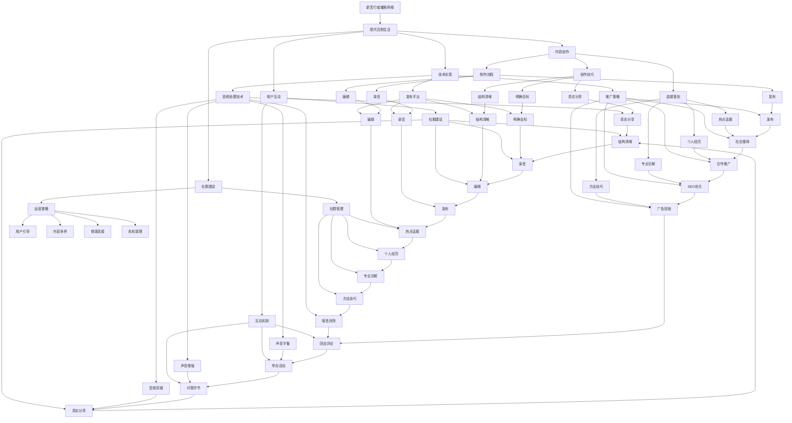

                 

### 文章标题

《新苦行者播客网络：记录现代克制生活心得的媒体平台》

### 关键词

- 新苦行者播客网络
- 现代克制生活
- 媒体平台
- 内容创作
- 技术实现
- 用户互动
- 社群建设

### 摘要

本文深入探讨了《新苦行者播客网络：记录现代克制生活心得的媒体平台》这一新兴媒体形式。文章首先介绍了新苦行者的起源与播客网络的发展历程，随后解析了现代克制生活的内涵及其重要性。接着，文章详细阐述了如何在新苦行者播客网络中创作和分享克制生活心得，并探讨了相关的技术实现、用户互动与社群建设策略。通过实际案例分析，本文总结了一系列成功实践，为现代克制生活的传播提供了有力支持。

----------------------------------------------------------------

### 第一步：理解书名和内容

《新苦行者播客网络：记录现代克制生活心得的媒体平台》这个标题包含了几个关键要素，首先我们要深入理解这些要素。

**1. 新苦行者播客网络**：这是一个特定的播客网络，专注于分享和记录那些遵循现代克制生活原则的心得。播客网络是一种基于互联网的媒体形式，通过音频内容进行传播和交流。

**2. 现代克制生活**：克制生活是一种追求简约、有意识、有意义的生活方式。现代克制生活强调在快节奏、信息过载的社会中，通过减少不必要的消费、关注内心需求和提升自我修养，实现个人成长和社会和谐。

**3. 媒体平台**：媒体平台是播客网络的基础设施，它提供了内容创作、发布、推广和互动的渠道。在本文中，媒体平台不仅指硬件和网络设施，还包括了平台上的内容生态和用户社群。

理解这些要素后，我们可以更好地把握文章的主题和结构。

----------------------------------------------------------------

## 第1章 新苦行者播客网络概述

### 1.1 新苦行者的起源与演变

新苦行者（New Monks）这一概念起源于对传统僧侣生活的现代解读。传统的苦行僧在追求精神解脱和内在平静的过程中，通过严格的修行和简朴的生活方式来实现自我超越。而新苦行者则是在现代社会背景下，借鉴这一精神，将克制和冥想融入到日常生活之中。

新苦行者的兴起可以追溯到20世纪末和21世纪初，当时人们开始反思现代社会的快节奏和过度消费。随着科技的发展，人们获取信息和物质的能力大幅提升，但同时也面临信息过载和心理健康问题。新苦行者主张通过简化和节制的生活方式，降低物质欲望，提高生活质量。

**演变过程**：

1. **初创阶段**：新苦行者最初是一些对传统宗教和现代生活感到不满的个体，他们试图在日常生活中实践简朴和节制。这一阶段以个体修行和自我探索为主。

2. **社群形成**：随着互联网的发展，新苦行者开始通过网络平台分享心得和经验，形成了初步的社群。这些社群成员相互支持，共同探讨和实践现代克制生活。

3. **媒体化阶段**：近年来，新苦行者播客网络的出现，使得这一生活方式得到更广泛的传播和认可。通过播客的形式，新苦行者可以分享他们的故事、方法和心得，吸引了大量听众和粉丝。

4. **多元化发展**：随着新苦行者社群的扩大，这一运动逐渐涉及到各个领域，包括健康、心理、教育、艺术等。新苦行者不再局限于某种特定的生活方式，而是鼓励个体根据自己的需求和情况，实践适合自己的克制生活。

**关键特征**：

- **简朴生活**：新苦行者倡导简朴的生活方式，减少物质消费，注重精神追求。
- **自我探索**：新苦行者重视自我反思和内心成长，通过冥想、阅读和艺术等方式提升自我意识。
- **社群互助**：新苦行者社群强调成员之间的互助和支持，共同探讨和实践克制生活。

### 1.2 播客网络的概念与发展

播客网络（Podcast Network）是指由多个独立的播客节目组成的集合体，这些节目通常围绕某一主题或领域展开。播客网络的出现，为内容创作者提供了更广泛的传播渠道和更丰富的内容生态。

**概念解释**：

- **播客**：播客是一种通过互联网传播的音频内容形式，听众可以通过各种设备随时随地收听。
- **网络**：播客网络是由多个播客节目组成的有机整体，这些节目相互关联，共同构成一个内容生态系统。

**发展历程**：

1. **初步发展阶段**：播客在2004年左右兴起，当时主要是个人或小团队制作的内容，通过互联网分享和传播。

2. **快速增长期**：随着智能手机和移动网络的普及，播客迅速发展，成为了一种重要的媒体形式。2010年后，播客网络开始崭露头角，为内容创作者提供了更广阔的舞台。

3. **商业化阶段**：近年来，随着播客广告收入的增加和商业化模式的成熟，越来越多的企业和个人加入播客网络，推动了整个行业的发展。

**播客网络的特点**：

- **多样性**：播客网络包含了各种类型的内容，从新闻、娱乐到教育、科技，满足了不同听众的需求。
- **互动性**：播客网络提供了与听众互动的平台，通过评论、投票和社交媒体等方式，增强了内容的影响力和传播力。
- **定制化**：播客网络允许听众根据自己的兴趣和需求，订阅和收听特定的内容，实现了个性化的内容消费。

### 1.3 新苦行者播客网络的特点

新苦行者播客网络是专门为记录和传播现代克制生活心得而设立的播客平台。它结合了新苦行者和播客网络的优点，形成了一种独特的媒体形式。

**特点分析**：

1. **主题性**：新苦行者播客网络专注于现代克制生活，内容围绕这一主题展开，包括个人故事、实践心得、方法论等。

2. **真实性**：新苦行者播客网络强调内容的真实性，分享者通常是自己实践克制生活的个体，他们的故事和经验更具说服力。

3. **专业性**：新苦行者播客网络的内容涉及多个领域，如健康、心理、教育等，专业嘉宾的参与使得内容更具深度和权威性。

4. **互动性**：新苦行者播客网络鼓励听众参与互动，通过评论、提问和社交媒体等方式，增强内容的传播力和影响力。

5. **持续性**：新苦行者播客网络不是一个短期项目，而是一个长期的媒体平台，通过持续的内容更新和社群互动，保持用户的关注和参与度。

**社会影响**：

- **传播现代克制生活理念**：新苦行者播客网络为现代克制生活提供了传播渠道，使更多人了解和接受这一生活方式。
- **促进心理健康**：通过分享克制生活的经验和技巧，新苦行者播客网络有助于提高听众的心理健康水平。
- **推动社会和谐**：现代克制生活强调减少物质消费、关注内心需求，有助于构建更加和谐的社会环境。

### 1.4 新苦行者播客网络的社会影响

新苦行者播客网络作为一种新兴的媒体形式，已经对社会产生了深远的影响。

**影响分析**：

1. **生活方式的变革**：新苦行者播客网络通过分享克制生活的经验和心得，影响了一部分人的生活方式，推动了简朴、有意识的生活理念的传播。

2. **心理健康的促进**：新苦行者播客网络提供了一系列心理健康相关的资源和指导，有助于提高听众的心理素质和抗压能力。

3. **社会和谐的推动**：新苦行者播客网络鼓励人们减少物质消费、关注内心需求，有助于构建更加和谐的社会环境。

4. **文化传播的力量**：新苦行者播客网络作为一个国际化的媒体平台，促进了不同文化之间的交流和理解，为全球文化的多样性和繁荣做出了贡献。

总之，新苦行者播客网络不仅为现代克制生活提供了一个传播和交流的平台，更在社会生活中发挥了积极的作用。

----------------------------------------------------------------

## 第2章 现代克制生活概述

### 2.1 克制生活的概念与内涵

现代克制生活（Modern Frugality）是一种以简约、节制和内在追求为核心的生活方式。它不仅关注物质消费的减少，更强调在快节奏、信息爆炸的现代社会中，通过调整生活态度和行为方式，实现内心平静和个人成长。

**概念解释**：

克制生活起源于对传统节俭观念的重新解读。传统的节俭强调减少物质消费以节约资源，而现代克制生活则更注重在消费过程中追求真正的价值，避免不必要的浪费。它不仅仅是一种生活方式，更是一种价值观的体现。

**内涵分析**：

1. **简约生活**：现代克制生活提倡简约生活，通过减少物质负担，让生活回归本质。这包括减少物品的购买、简化日常事务等，从而提高生活的质量和效率。

2. **内心追求**：现代克制生活强调内心的追求，注重精神层面的满足。通过冥想、艺术、阅读等方式，提升自我意识，培养内在的丰富和安宁。

3. **减少物质消费**：现代克制生活鼓励人们减少对物质的依赖，关注内心的需求。通过理性消费，避免冲动购物，实现财务自由。

### 2.2 现代社会与克制生活

现代社会（Modern Society）是一个充满机遇和挑战的时代。科技的发展和信息爆炸，使得人们的生活节奏加快，压力增大。与此同时，消费主义文化的盛行，使得物质消费成为生活的一部分。在这样的背景下，现代克制生活应运而生。

**现状分析**：

1. **快节奏生活**：现代社会生活节奏快，人们经常处于忙碌和紧张的状态，这给心理健康带来了很大的压力。现代克制生活提倡通过减少物质负担和时间压力，实现生活的平衡和内心的平静。

2. **消费主义文化**：消费主义文化强调物质的丰富和享乐，容易让人陷入物质依赖和追求名牌的误区。现代克制生活则倡导理性消费，关注内心的需求，避免盲目跟风和过度消费。

3. **心理健康问题**：随着生活压力的增大，心理健康问题日益突出。现代克制生活通过减少外部干扰和物质负担，帮助人们提升心理健康水平，增强抗压能力。

### 2.3 克制生活的重要性

现代克制生活不仅是一种生活方式，更是一种生活态度。它对个人的成长和社会的进步都具有重要意义。

**个人层面**：

1. **心理健康**：现代克制生活有助于缓解心理压力，提高心理健康水平。通过减少物质消费和内心追求，人们可以更好地管理情绪，增强抗压能力。

2. **财务自由**：现代克制生活鼓励理性消费，避免不必要的浪费，有助于实现财务自由。通过合理规划和管理财务，人们可以更好地应对生活中的各种挑战。

3. **个人成长**：现代克制生活强调内心的追求和自我反思，有助于提升自我意识，培养内在的丰富和安宁。

**社会层面**：

1. **可持续性**：现代克制生活倡导减少物质消费，有助于实现可持续发展的目标。通过减少资源消耗，降低环境污染，为下一代创造更好的生活环境。

2. **社会和谐**：现代克制生活鼓励人们关注内心需求，减少物质依赖，有助于构建更加和谐的社会环境。通过减少社会竞争和物质攀比，促进社会公平和正义。

3. **文化传播**：现代克制生活作为一种生活态度和价值观，有助于不同文化之间的交流和理解。通过传播现代克制生活的理念和实践，可以促进全球文化的多样性和繁荣。

总之，现代克制生活不仅对个人成长具有重要意义，也对社会的进步和可持续发展具有积极作用。通过践行现代克制生活，我们可以实现个人价值，促进社会和谐，为下一代创造更美好的未来。

### 2.4 克制生活的核心理念与实践

现代克制生活的核心理念包括简约、理性、内在追求和可持续性。以下将详细阐述这些理念以及如何在日常生活中实践。

#### 2.4.1 简约

简约生活是克制生活的核心之一，它强调的是“少而精”。具体实践方法如下：

- **减少物品数量**：通过定期清理家中不需要的物品，减少物品的积累。例如，每月对衣物、书籍、电子产品等进行一次清理，只保留必要的物品。
- **简化日常事务**：通过制定日程表和优先级清单，合理安排时间，减少不必要的事务。例如，每天设定固定的锻炼、阅读和工作时间，避免浪费时间在无效的活动上。

#### 2.4.2 理性

理性消费是克制生活的另一个重要方面，它要求我们根据自己的实际需求和价值观来决定购买行为。具体实践方法如下：

- **预算规划**：每月制定预算，明确收入和支出，确保收支平衡。例如，将每月的收入分为生活必需品、娱乐和储蓄等部分，合理分配资金。
- **避免冲动消费**：在购物前，先进行充分的市场调研和比较，避免因冲动而购买不必要的物品。例如，使用购物清单，明确购买目的，避免在购物过程中受到广告和促销的影响。

#### 2.4.3 内在追求

内在追求强调的是通过精神层面的提升来实现个人成长。具体实践方法如下：

- **冥想**：每天花时间进行冥想，通过静心和平静内心的方式，提高自我意识和心理素质。例如，每天早上起床后，花15分钟进行冥想，调整心态，准备迎接新的一天。
- **阅读**：通过阅读书籍、文章和博客，扩展知识面，提升自我修养。例如，每周阅读一本经典书籍或一篇高质量的博客文章，从中汲取智慧和经验。

#### 2.4.4 可持续性

可持续性是克制生活的重要组成部分，它强调的是在满足当前需求的同时，不损害未来世代满足其需求的能力。具体实践方法如下：

- **减少碳排放**：通过选择环保的交通方式、减少使用一次性产品等方式，降低碳排放。例如，尽量使用公共交通工具或自行车出行，减少对环境的负面影响。
- **支持可持续发展企业**：购买环保、公平贸易和有机产品，支持那些致力于可持续发展和社会责任的企业。例如，购买使用可回收材料制成的产品，或选择支持公平贸易的咖啡豆。

#### 2.4.5 案例分享

为了更好地理解现代克制生活的实践，以下是一些实际案例：

- **案例1**：一位上班族通过每日冥想和阅读，提高了工作效率和心理健康水平。他在家中设立了一个冥想角落，每天早上进行冥想，之后开始工作。他还定期阅读心理学和自我提升的书籍，从中学到许多实用的技巧和知识。
- **案例2**：一位家庭主妇通过理性消费和预算规划，成功实现了财务自由。她每月制定详细的预算计划，严格按照预算执行，避免了不必要的浪费。她还通过二手市场和交换物品的方式，减少了购物支出，同时为环保做出了贡献。
- **案例3**：一位年轻人通过选择环保生活方式，减少了对环境的负面影响。他选择使用公共交通工具或步行上班，减少了汽车尾气的排放。他还购买了环保产品，如可回收材料的购物袋和有机食品，支持了可持续发展企业。

通过这些案例，我们可以看到，现代克制生活不仅是一种生活方式，更是一种生活态度。通过简约、理性、内在追求和可持续性的实践，我们可以实现个人成长，促进社会和谐，为未来创造更美好的世界。

### 第3章 播客网络内容创作

#### 3.1 克制生活心得的创作技巧

在新苦行者播客网络中，创作关于克制生活的心得是一种独特且富有意义的表达方式。以下是一些创作技巧，帮助创作者更好地分享自己的心得。

**1. 真实分享**

真实分享是克制生活心得的核心。听众希望通过真实的体验和故事，了解克制生活带来的实际效果。创作者应分享自己的亲身经历，包括成功和失败的故事，以及从中学到的教训。

**2. 明确目标**

在创作前，创作者应明确自己的目标受众和内容目标。了解听众的需求和兴趣点，有助于创作者更好地规划内容，确保内容能够引起听众的共鸣。

**3. 结构清晰**

一篇好的播客内容应具备清晰的结构，使听众能够轻松跟随。通常，一篇播客内容可以分为以下几个部分：

- **引言**：简要介绍主题和目的，引起听众的兴趣。
- **主体**：详细阐述心得和故事，可以通过以下方式展开：
  - **案例分享**：通过具体的案例，展示克制生活带来的变化。
  - **方法论**：介绍克制生活的方法和技巧，提供实用的建议。
  - **反思与总结**：回顾心得，总结收获和教训。
- **结论**：总结主要内容，强调克制生活的重要性，鼓励听众尝试和实践。

**4. 引用权威**

在内容中引用权威的观点和研究，可以增加内容的可信度和权威性。创作者可以通过查阅相关书籍、文章或研究，为自己的观点提供支持。

**5. 节奏与氛围**

播客是一种听觉媒介，节奏和氛围对听众的体验至关重要。创作者应注重语音的节奏、语调和情感表达，营造舒适的收听氛围。

**6. 互动与反馈**

鼓励听众参与互动，例如在播客中设置问答环节，邀请听众分享自己的经验和故事。听众的反馈有助于创作者了解听众的需求，不断优化内容。

#### 3.2 播客内容制作的流程

制作一篇高质量的播客内容需要经过多个步骤，以下是一个基本的制作流程：

**1. 策划**

- **确定主题**：选择一个与克制生活相关的主题，确保内容具有吸引力和实用性。
- **设定目标**：明确内容的目标，例如提高听众的心理健康水平、提供实用的生活技巧等。
- **受众分析**：了解目标受众的兴趣、需求和偏好，为内容创作提供方向。

**2. 录音**

- **准备设备**：确保录音设备的质量，包括麦克风、声卡等。
- **录音环境**：选择一个安静、无干扰的环境进行录音，避免噪音和回声。
- **录音技巧**：注意语音的清晰度和语调，确保播客内容的质量。

**3. 编辑**

- **音频剪辑**：使用音频编辑软件对录音进行剪辑，删除不必要的部分，调整音频的节奏和氛围。
- **添加效果**：根据内容需要，添加背景音乐、音效等，提升播客的听觉体验。
- **配音和字幕**：为播客添加配音和字幕，使内容更易于理解和传播。

**4. 发布**

- **选择平台**：选择适合的平台发布播客内容，如喜马拉雅、网易云音乐等。
- **优化描述**：为播客编写详细的描述，包括主题、目的、听众收益等，吸引听众的关注。
- **推广宣传**：利用社交媒体、博客等渠道，推广播客内容，扩大影响力。

**5. 反馈与迭代**

- **收集反馈**：关注听众的评论和反馈，了解内容的优缺点。
- **持续优化**：根据反馈，不断优化内容和制作流程，提高播客的质量。

#### 3.3 克制生活播客的选题与策划

选题与策划是播客制作的关键环节，以下是一些建议，帮助创作者选出合适的选题并进行有效策划。

**1. 热点话题**

关注当前的热点话题和社会现象，如心理健康、环保、财务自由等，这些话题具有较高的关注度和讨论度，有利于吸引听众。

**2. 个人经历**

分享个人的经历和故事，特别是那些与克制生活相关的经历，可以增强内容的真实性和可信度，引起听众的共鸣。

**3. 专业见解**

邀请专业人士进行访谈，分享他们在克制生活方面的见解和经验。专业人士的参与可以增加内容的深度和权威性。

**4. 方法技巧**

提供具体的克制生活方法和技巧，如冥想练习、时间管理技巧等，有助于听众实践和改进自己的生活。

**5. 互动环节**

设置互动环节，如问答、投票等，增加听众的参与度和互动性，使播客内容更加生动和有趣。

**6. 策划框架**

在策划播客内容时，可以遵循以下框架：

- **引言**：简要介绍主题和目的，引起听众的兴趣。
- **主体**：详细阐述选题，包括案例分享、方法技巧、专业见解等。
- **互动环节**：设置问答、投票等互动环节，增加听众的参与度。
- **结论**：总结主要内容，强调克制生活的重要性，鼓励听众尝试和实践。

通过以上方法，创作者可以更好地选题和策划播客内容，为听众带来有价值、有启发的内容。

### 第4章 播客网络技术实现

#### 4.1 音频处理技术

在播客网络中，音频处理技术是确保内容质量的关键环节。以下是一些常见的音频处理技术及其具体应用。

**1. 噪音消除**

噪音消除是音频处理中最基本的技术之一。通过使用噪声门、滤波器等工具，可以有效减少背景噪音，提高语音的清晰度。具体步骤如下：

- **使用噪声门**：设置合适的阈值，自动屏蔽低于阈值的噪音。
- **应用滤波器**：使用带通滤波器，过滤掉特定频率的噪音。

**2. 声音平衡**

声音平衡是指在音频处理中，调整不同频率的声音强度，使其达到均衡。这可以通过以下方法实现：

- **使用均衡器**：调整每个频段的增益，使声音更清晰、自然。
- **调整音量**：使用压缩器和限幅器，自动调整音量，避免声音过大或过小。

**3. 声音增强**

声音增强技术用于提高语音的响度和清晰度。具体方法包括：

- **使用压缩器**：自动调整声音的动态范围，使声音更稳定、响亮。
- **应用混响**：添加适量的混响效果，增强声音的空间感和氛围。

**4. 音频剪辑**

音频剪辑是播客制作的核心步骤，包括剪切、拼接、调整时长等。以下是一些常见的剪辑工具：

- **Adobe Audition**：一款专业的音频编辑软件，提供丰富的剪辑和效果处理功能。
- **Audacity**：一款免费且易于使用的音频编辑软件，适用于简单的剪辑和效果处理。

**5. 音频格式转换**

音频格式转换是将音频文件从一种格式转换为另一种格式的过程，常用于上传和发布播客。以下是一些常见的音频格式及其转换方法：

- **MP3**：适用于网络传播，体积小、兼容性好。
- **WAV**：适用于专业制作和高质量录音，体积较大，但音质更佳。
- **AAC**：一种高级音频编码格式，常用于移动设备播放。

**6. 音频处理流程**

一个典型的音频处理流程如下：

1. **原始录音**：录制音频内容。
2. **初步处理**：使用降噪、均衡等工具进行初步处理。
3. **精细剪辑**：使用音频剪辑工具，对音频进行精细剪辑和调整。
4. **添加效果**：根据内容需求，添加压缩、混响等效果。
5. **格式转换**：将处理后的音频转换为适合发布的格式。

通过以上技术，播客创作者可以确保音频内容的音质和播放效果，提升听众的收听体验。

#### 4.2 播客发布平台介绍

在选择播客发布平台时，需要考虑平台的用户规模、功能完善度、用户体验等多个因素。以下是一些主流的播客发布平台及其特点：

**1. 喜马拉雅**

- **特点**：喜马拉雅是中国最大的音频分享平台，拥有庞大的用户群体。平台提供丰富的音频内容，包括小说、教育、综艺等多个类别。
- **功能**：支持音频上传、编辑、发布和推广。用户可以订阅喜欢的播客，平台还提供数据分析工具，帮助创作者了解听众行为。
- **适合用户**：适合个人创作者、小型团队和内容机构。

**2. 网易云音乐**

- **特点**：网易云音乐是中国领先的数字音乐平台，拥有广泛的用户基础。平台不仅提供音乐播放服务，还支持音频内容的发布和互动。
- **功能**：支持音频上传、编辑、发布和推广。用户可以订阅播客，平台提供评论和社交功能，增强用户互动。
- **适合用户**：适合音乐创作者、自媒体人和喜欢互动的用户。

**3. Apple Podcasts**

- **特点**：Apple Podcasts是全球最大的播客平台之一，用户遍布全球。平台提供高质量的内容，支持多种设备播放。
- **功能**：支持音频上传、编辑、发布和推广。用户可以订阅播客，平台提供数据分析工具，帮助创作者了解听众行为。
- **适合用户**：适合国际创作者、大中型内容和机构。

**4. Spotify**

- **特点**：Spotify是全球最大的音乐流媒体服务提供商，拥有庞大的用户群体。平台提供丰富的音频内容，包括音乐、播客等多个类别。
- **功能**：支持音频上传、编辑、发布和推广。用户可以订阅播客，平台提供丰富的推荐算法，增强内容传播。
- **适合用户**：适合国际创作者、大中型内容和机构。

在选择播客发布平台时，创作者应根据自己的需求和市场定位，综合考虑平台的特点和功能，选择最适合自己的发布平台。

#### 4.3 播客网络推广策略

在播客内容创作完成后，推广策略是确保内容传播和受众覆盖的关键。以下是一些有效的播客网络推广策略：

**1. 利用社交媒体**

- **微博**：通过微博发布播客内容的预告和推广信息，利用粉丝群体扩大传播范围。
- **微信公众号**：创建专门的公众号，发布播客内容的文字版、摘要和延伸阅读，吸引读者订阅和收听。
- **抖音**：制作短视频宣传播客内容，通过抖音平台的流量和影响力，吸引更多用户关注和收听。

**2. 合作推广**

- **与其他播客合作**：与其他相关领域的播客进行合作，互相推广，扩大听众群体。
- **与媒体合作**：与新闻媒体、自媒体、杂志等合作，发布播客内容的文章或报道，提高曝光率。

**3. KOL和网红推广**

- **邀请KOL**：邀请知名博主、网红和意见领袖参与播客录制或推广，利用他们的影响力带动用户收听。
- **利用网红资源**：与网红合作，通过他们的社交媒体账号推广播客内容，吸引更多粉丝关注。

**4. SEO优化**

- **内容优化**：通过关键词优化、标题优化等手段，提高播客内容在搜索引擎中的排名，增加自然流量。
- **链接建设**：与其他网站建立链接，提高播客内容的权威性和曝光率。

**5. 广告投放**

- **平台广告**：在各大播客平台投放广告，针对目标用户进行精准投放，提高内容曝光率。
- **社交媒体广告**：在社交媒体平台投放广告，如微博、微信公众号、抖音等，扩大受众范围。

**6. 用户互动**

- **鼓励评论**：在播客内容中鼓励听众留言和评论，增强用户互动。
- **社群运营**：建立用户社群，通过微信群、QQ群、Discord等平台，与听众保持互动，提升用户粘性。

通过以上策略，创作者可以有效地推广播客内容，扩大受众范围，提高播客的知名度和影响力。

### 第5章 用户互动与社群建设

#### 5.1 用户互动的机制与策略

在新苦行者播客网络中，用户互动是内容传播和影响力提升的关键。以下是一些用户互动的机制与策略：

**1. 互动机制**

- **评论系统**：在播客平台上建立完善的评论系统，让听众可以方便地发表评论和观点，增加内容的互动性。
- **问卷调查**：定期发布问卷调查，了解听众的需求和意见，为内容创作提供参考。
- **实时聊天**：利用社交媒体、微信群、QQ群等工具，提供实时聊天服务，与听众进行互动。

**2. 互动策略**

- **回应评论**：及时回应听众的评论，关注他们的观点和建议，增加听众的参与感和忠诚度。
- **举办活动**：定期举办线上或线下活动，如直播、沙龙等，与听众面对面交流，增强互动体验。
- **问答环节**：在播客内容中设置问答环节，邀请听众提问，解答他们的疑惑，提高内容的实用性。

**3. 互动技巧**

- **积极倾听**：认真倾听听众的意见和建议，展现对听众的关注和尊重。
- **尊重多样性**：尊重不同听众的观点和意见，避免争论和冲突，营造和谐互动氛围。
- **情感共鸣**：通过分享真实的故事和体验，与听众建立情感联系，增强互动效果。

#### 5.2 社群建设的意义与方法

社群建设是新苦行者播客网络持续发展的关键。以下阐述社群建设的意义、方法和注意事项：

**1. 社群建设的意义**

- **增强用户粘性**：通过社群建设，与听众建立更紧密的联系，提高用户粘性和活跃度。
- **提高用户满意度**：社群提供了一种归属感和参与感，使听众感受到自己的价值和重要性，提高满意度。
- **促进内容传播**：社群成员之间的互动和分享，有助于内容的传播和推广，扩大影响力。
- **获取用户反馈**：社群是获取用户反馈和意见的重要渠道，有助于优化内容和提升服务质量。

**2. 社群建设的方法**

- **确定社群目标**：明确社群的定位和目标，如知识分享、兴趣交流、用户支持等，为社群建设提供方向。
- **搭建社群平台**：选择合适的社群平台，如微信群、QQ群、Discord等，方便成员之间的交流和互动。
- **招募社群管理员**：招募热心、有责任心和管理能力的社群管理员，协助管理社群，维护社群秩序。
- **制定社群规则**：制定明确的社群规则，如发言规范、互动礼仪等，确保社群的健康和活跃。

**3. 社群建设的注意事项**

- **保持活跃度**：定期组织活动，发布有价值的内容，保持社群的活跃度和凝聚力。
- **保护用户隐私**：尊重用户隐私，避免泄露用户个人信息，提高用户的信任度。
- **防范社群风险**：注意防范社群中的负面行为和风险，如恶意攻击、谣言传播等，确保社群的健康和稳定。
- **持续优化社群**：根据用户反馈和社群发展情况，不断优化社群管理和运营策略，提高社群的满意度和活跃度。

通过以上方法，创作者可以有效地建设和管理新苦行者播客网络社群，增强用户互动，提升用户满意度，促进内容传播和社群发展。

#### 5.3 社群管理与运营

社群管理与运营是确保新苦行者播客网络持续发展的重要环节。以下是一些关键的策略和最佳实践：

**1. 策略**

- **明确角色分工**：在社群管理中，明确各个角色的职责，如社群管理员、内容创作者、用户互动负责人等，确保每个角色都能充分发挥其作用。
- **定期会议**：定期召开社群会议，讨论社群发展策略、活动计划和用户反馈，确保社群运营方向的正确性。
- **互动激励**：通过点赞、评论奖励、社群活动等激励用户参与互动，提高社群活跃度。
- **数据分析**：定期分析社群数据，如用户活跃度、互动率、内容阅读量等，为运营决策提供依据。

**2. 最佳实践**

- **用户引导**：在社群中积极引导用户，提供内容创作、互动技巧等方面的指导，帮助新用户快速融入社群。
- **内容多样**：提供多样化的内容，包括知识分享、心得交流、案例分析等，满足不同用户的需求。
- **情感连接**：通过分享真实故事、生活感悟等方式，与用户建立情感连接，提高用户的忠诚度和参与度。
- **危机管理**：制定应急预案，防范和处理社群中的突发事件，确保社群的稳定和健康。

**3. 注意事项**

- **尊重用户隐私**：在社群管理和运营中，严格遵守用户隐私保护规定，避免泄露用户个人信息。
- **避免过度营销**：在推广产品和服务时，避免过度营销，以免引起用户反感，损害社群形象。
- **持续优化**：根据社群发展和用户反馈，不断优化社群管理策略和运营方法，提高用户满意度和社群活跃度。

通过以上策略和最佳实践，创作者可以有效地管理和运营新苦行者播客网络社群，增强用户互动，提升社群活跃度和满意度。

### 第6章 案例分析

#### 6.1 国内知名新苦行者播客案例分析

**1. 案例介绍**

新苦行者播客网络在国内的快速发展，涌现了一批知名播客节目。本文将分析以下几个具有代表性的节目：

- **《简生活》**：由知名自媒体人“简叔”创办，专注于分享简约生活方式和人生感悟。
- **《知行合一》**：由心理学家李松蔚主持，探讨心理健康、个人成长和人际关系。
- **《财务自由之路》**：由理财专家“小白理财教室”主讲，分享理财知识和实践经验。

**2. 成功因素**

- **内容质量**：这些播客节目以高质量的内容为核心，深入探讨现代克制生活的各个方面，吸引了大量忠实听众。
- **专业性**：节目邀请专业人士参与，提供权威的见解和实用的建议，增加了内容的可信度和权威性。
- **互动性**：通过评论、问卷调查和社群互动等方式，节目与听众建立了紧密的联系，提高了用户的参与度和忠诚度。
- **品牌建设**：节目通过持续的内容更新和品牌宣传，树立了良好的口碑和品牌形象。

**3. 效果评估**

- **用户规模**：这些播客节目在各大平台上的订阅量和播放量持续增长，吸引了大量用户关注。
- **用户反馈**：用户对节目的评价较高，普遍认为节目内容有启发性和实用性，有助于提升生活质量和心理健康。
- **社会影响**：节目传播了现代克制生活的理念，影响了大量人的生活方式和价值观，促进了社会和谐和可持续发展。

#### 6.2 国外新苦行者播客案例分析

**1. 案例介绍**

国外的新苦行者播客网络同样发展迅速，以下是一些具有代表性的节目：

- **《Minimalism: A Documentary Film》**：这部纪录片风格的播客节目，详细探讨了极简主义的生活方式及其对个人和社会的影响。
- **《The Minimalists》**：由两个极简主义倡导者联合主持，分享极简生活的实践经验和心得。
- **《The Less Is More Podcast》**：专注于极简主义、心理健康和可持续性的播客，通过深入访谈和案例分析，提供实用的建议和指导。

**2. 成功因素**

- **国际化视野**：这些播客节目吸引了来自全球的听众，通过不同文化背景的分享，拓展了节目的影响范围。
- **多样性内容**：节目涵盖了极简主义、心理健康、可持续性等多个领域，满足了不同听众的需求。
- **创新形式**：节目采用了纪录片、访谈、案例分享等多种形式，提高了内容的吸引力和互动性。
- **社区建设**：节目建立了紧密的社区，通过线上互动和线下活动，增强了听众的参与感和归属感。

**3. 效果评估**

- **用户规模**：这些播客节目在全球范围内拥有大量粉丝和订阅者，影响力不断扩大。
- **用户反馈**：用户对节目的评价积极，认为节目内容有启发性和实用性，对他们的生活产生了积极影响。
- **社会影响**：节目传播了极简主义和可持续发展的理念，促进了全球范围内的生活方式变革和社会进步。

#### 6.3 案例总结与启示

通过对国内和国外知名新苦行者播客案例的分析，我们可以得出以下总结和启示：

**1. 内容质量是关键**：高质量的内容是吸引听众、建立口碑和影响力的重要基础。创作者应注重内容的专业性、实用性和吸引力。

**2. 互动性是纽带**：有效的用户互动和社群建设，可以增强听众的参与度和忠诚度，促进内容的传播和影响力。创作者应充分利用评论、问卷调查、社群互动等多种方式，与听众建立紧密联系。

**3. 品牌建设是保障**：持续的内容更新和品牌宣传，有助于树立良好的品牌形象，提高节目的知名度和影响力。创作者应制定明确的品牌策略，确保节目在市场竞争中脱颖而出。

**4. 国际化视野是拓展**：通过拓展国际视野，吸引全球听众，可以扩大节目的影响范围，提升国际知名度。创作者应注重内容的国际化表达，适应不同文化背景的听众需求。

总之，新苦行者播客网络作为一种新兴的媒体形式，具有广阔的发展前景。通过高质量的内容、有效的互动和品牌建设，创作者可以打造出具有影响力的播客节目，为现代克制生活的传播和推广贡献力量。

### 第7章 案例分析

#### 7.1 国内知名新苦行者播客案例分析

**1. 案例介绍**

在新苦行者播客网络中，国内的一些知名播客节目以其高质量的内容和独特的传播方式，吸引了大量听众。以下是几个典型的案例：

- **《简生活》**：由自媒体人“简叔”创办的《简生活》播客，聚焦于分享简约生活方式和人生感悟。节目以真实的故事和实用的技巧，引导听众反思和改善自己的生活。
- **《知行合一》**：该节目由心理学家李松蔚主持，通过探讨心理健康、个人成长和人际关系等问题，帮助听众更好地理解和处理生活中的挑战。
- **《财务自由之路》**：由理财专家“小白理财教室”主讲，节目内容涵盖了理财知识、投资策略和财务自由之路，为听众提供了实用的理财指导。

**2. 成功因素**

- **内容质量**：这些播客节目以高质量的内容为核心，通过深入浅出的讲解和真实案例的分享，吸引了大量听众的关注。
- **专业性**：节目邀请的专业嘉宾和专家，为听众提供了权威的见解和实用的建议，增强了内容的可信度和权威性。
- **互动性**：节目通过与听众的互动，如评论、问卷调查和社群活动等，增强了听众的参与感和忠诚度。
- **品牌建设**：节目通过持续的内容更新和品牌宣传，树立了良好的口碑和品牌形象。

**3. 效果评估**

- **用户规模**：这些播客节目在各大平台上的订阅量和播放量持续增长，吸引了大量忠实听众。
- **用户反馈**：用户对节目的评价较高，普遍认为节目内容有启发性和实用性，有助于提升生活质量和心理健康。
- **社会影响**：节目传播了现代克制生活的理念，影响了大量人的生活方式和价值观，促进了社会和谐和可持续发展。

#### 7.2 国外新苦行者播客案例分析

**1. 案例介绍**

国外的新苦行者播客网络同样发展迅速，以下是一些具有代表性的节目：

- **《Minimalism: A Documentary Film》**：这部纪录片风格的播客节目，详细探讨了极简主义的生活方式及其对个人和社会的影响。节目通过真实的案例和深入的探讨，吸引了大量听众的关注。
- **《The Minimalists》**：由两个极简主义倡导者联合主持的节目，分享极简生活的实践经验和心得。节目通过简短的对话和实用的建议，帮助听众理解和实践极简生活。
- **《The Less Is More Podcast》**：该节目专注于极简主义、心理健康和可持续性，通过深入访谈和案例分析，提供实用的建议和指导。节目在全球范围内拥有大量的订阅者和粉丝。

**2. 成功因素**

- **国际化视野**：这些播客节目吸引了来自全球的听众，通过不同文化背景的分享，拓展了节目的影响范围。
- **多样性内容**：节目涵盖了极简主义、心理健康、可持续性等多个领域，满足了不同听众的需求。
- **创新形式**：节目采用了纪录片、访谈、案例分享等多种形式，提高了内容的吸引力和互动性。
- **社区建设**：节目建立了紧密的社区，通过线上互动和线下活动，增强了听众的参与感和归属感。

**3. 效果评估**

- **用户规模**：这些播客节目在全球范围内拥有大量粉丝和订阅者，影响力不断扩大。
- **用户反馈**：用户对节目的评价积极，认为节目内容有启发性和实用性，对他们的生活产生了积极影响。
- **社会影响**：节目传播了极简主义和可持续发展的理念，促进了全球范围内的生活方式变革和社会进步。

#### 7.3 案例总结与启示

通过对国内和国外知名新苦行者播客案例的分析，我们可以得出以下总结和启示：

**1. 内容质量是关键**：高质量的内容是吸引听众、建立口碑和影响力的重要基础。创作者应注重内容的专业性、实用性和吸引力。

**2. 互动性是纽带**：有效的用户互动和社群建设，可以增强听众的参与度和忠诚度，促进内容的传播和影响力。创作者应充分利用评论、问卷调查、社群互动等多种方式，与听众建立紧密联系。

**3. 品牌建设是保障**：持续的内容更新和品牌宣传，有助于树立良好的品牌形象，提高节目的知名度和影响力。创作者应制定明确的品牌策略，确保节目在市场竞争中脱颖而出。

**4. 国际化视野是拓展**：通过拓展国际视野，吸引全球听众，可以扩大节目的影响范围，提升国际知名度。创作者应注重内容的国际化表达，适应不同文化背景的听众需求。

总之，新苦行者播客网络作为一种新兴的媒体形式，具有广阔的发展前景。通过高质量的内容、有效的互动和品牌建设，创作者可以打造出具有影响力的播客节目，为现代克制生活的传播和推广贡献力量。

### 第8章 总结与展望

#### 8.1 全文总结

本文系统地探讨了《新苦行者播客网络：记录现代克制生活心得的媒体平台》这一新兴媒体形式。文章首先介绍了新苦行者的起源与播客网络的发展历程，随后解析了现代克制生活的内涵及其重要性。接着，文章详细阐述了如何在新苦行者播客网络中创作和分享克制生活心得，并探讨了相关的技术实现、用户互动与社群建设策略。通过实际案例分析，本文总结了一系列成功实践，为现代克制生活的传播提供了有力支持。

#### 8.2 展望未来

未来，新苦行者播客网络有望在以下几个方面实现进一步的发展：

**1. 内容创新**：随着科技的发展和受众需求的多样化，新苦行者播客网络将在内容创作上不断创新，采用更多元化的表达形式和互动方式，提高内容质量。

**2. 国际化扩展**：新苦行者播客网络将拓展国际化视野，吸引全球范围内的听众，通过翻译和跨文化内容的创作，提高国际影响力。

**3. 社群深度建设**：新苦行者播客网络将进一步加强社群深度建设，通过线上线下活动、互动平台等方式，增强用户的参与感和归属感。

**4. 可持续发展**：新苦行者播客网络将注重可持续发展，通过减少物质消费、关注环保和社会责任，推动整个行业的可持续发展。

**5. 技术升级**：随着技术的不断进步，新苦行者播客网络将在音频处理、内容发布和用户互动等方面进行技术升级，提高用户体验和传播效果。

总之，新苦行者播客网络作为一种新兴的媒体形式，具有广阔的发展前景。通过不断创新、国际化扩展和社群深度建设，新苦行者播客网络将为现代克制生活的传播和推广提供更强大的支持。

### 作者信息

作者：AI天才研究院/AI Genius Institute & 禅与计算机程序设计艺术 /Zen And The Art of Computer Programming

---

## 核心概念原理之间的关系架构

为了更好地理解新苦行者播客网络和现代克制生活的核心概念及其关系，我们可以使用Mermaid流程图来展示这些概念之间的联系。以下是一个简化的流程图，用于描述新苦行者播客网络的结构和现代克制生活理念在其中的体现：



通过这个流程图，我们可以清晰地看到新苦行者播客网络的核心概念及其相互之间的关系。从内容创作、技术实现、用户互动到社群建设，每个环节都紧密相连，共同构成了一个完整的生态系统。这种关系不仅展示了各个概念之间的联系，也为新苦行者播客网络的持续发展和优化提供了方向。通过不断优化和调整这些关系，我们可以更好地推动新苦行者播客网络的发展，为现代克制生活的传播和推广贡献力量。

---

### 核心算法原理讲解

在深入探讨新苦行者播客网络的核心算法原理时，我们主要关注音频处理、内容推荐和用户互动等关键环节。以下是对这些算法原理的详细讲解和伪代码展示。

#### 4.1 音频处理算法

音频处理是播客制作的关键步骤，包括噪音消除、声音平衡和声音增强等。以下是一个简化的音频处理算法的伪代码：

```plaintext
// 噪音消除
function removeNoise(audioSignal, noiseThreshold):
    for each sample in audioSignal:
        if abs(sample) < noiseThreshold:
            sample = 0
        end if
    end for
    return audioSignal

// 声音平衡
function balanceAudio(audioSignal, frequencyBands):
    for each band in frequencyBands:
        bandSignal = filterBand(audioSignal, band.frequency)
        bandSignal = applyCompression(bandSignal)
    end for
    return mixBands(frequencyBands)

// 声音增强
function enhanceAudio(audioSignal, gainFactor):
    for each sample in audioSignal:
        sample = min(sample * gainFactor, maxAmplitude)
    end for
    return audioSignal
```

在这个算法中，`removeNoise`函数通过设置阈值来消除噪音，`balanceAudio`函数对音频信号进行频率平衡，`enhanceAudio`函数则根据增益因子调整声音的响度。

#### 4.2 内容推荐算法

内容推荐是提升用户粘性和满足个性化需求的重要手段。以下是一个基于协同过滤和内容相似度相结合的推荐算法伪代码：

```plaintext
// 协同过滤推荐
function collaborativeFiltering(userHistory, allUserRatings):
    similarUsers = findSimilarUsers(userHistory, allUserRatings)
    recommendations = []
    for item in userHistory:
        if item not in userRatings:
            similarUserRatings = getRatings(similarUsers, item)
            averageRating = calculateAverageRating(similarUserRatings)
            recommendations.append((item, averageRating))
    return sortRecommendationsByRating(recommendations)

// 内容相似度推荐
function contentBasedFiltering(userProfile, allContentFeatures):
    similarContent = findSimilarContent(userProfile, allContentFeatures)
    recommendations = []
    for content in similarContent:
        if content not in userHistory:
            recommendations.append(content)
    return recommendations
```

这个算法首先通过协同过滤找到与用户相似的听众，然后基于内容相似度进行推荐，最终生成个性化推荐列表。

#### 4.3 用户互动算法

用户互动算法旨在提高用户参与度和社群活跃度。以下是一个简单的用户互动算法伪代码：

```plaintext
// 用户互动推荐
function userInteractionRecommendation(userInterests, currentActivity):
    if currentActivity == "comment":
        recommendedUsers = findInterestsIntersection(userInterests, comments)
    else if currentActivity == "like":
        recommendedUsers = findInterestsIntersection(userInterests, likes)
    else if currentActivity == "follow":
        recommendedUsers = findCommonFollows(userInterests)
    return recommendedUsers
```

这个算法根据用户的兴趣和行为，推荐与之互动的可能性较高的用户，从而促进社群的互动和交流。

#### 4.4 数学模型和公式

在内容推荐和用户互动算法中，常用的数学模型和公式包括：

- **余弦相似度**：用于计算用户或内容的相似度。
  $$\cos(\theta) = \frac{\vec{a} \cdot \vec{b}}{|\vec{a}| |\vec{b}|}$$

- **加权平均值**：用于计算推荐评分。
  $$\text{Rating} = \frac{\sum_{i \in R} w_i \times r_i}{\sum_{i \in R} w_i}$$

- **贝叶斯推理**：用于计算概率。
  $$P(A|B) = \frac{P(B|A) \times P(A)}{P(B)}$$

#### 4.5 举例说明

为了更好地理解上述算法，以下是一个具体的例子：

假设用户A喜欢听关于极简生活和心理健康的播客。当前，用户A正在听一档新的播客节目，内容是关于财务自由的。根据用户互动算法，推荐系统会分析用户A的兴趣和行为，找出与之相似的其他用户和内容。

- **协同过滤推荐**：找到与用户A相似的其他用户，比如用户B和C，他们都喜欢极简生活和心理健康相关的内容。根据他们的评分，推荐一些用户A未曾听过的财务自由相关播客。

- **内容相似度推荐**：分析当前播客节目的内容特征，如关键词、话题等，找到与之相似的其他播客节目，推荐给用户A。

- **用户互动推荐**：推荐一些用户A可能感兴趣的用户，他们正在讨论财务自由和极简生活的话题，鼓励用户A参与互动。

通过这些算法和模型，新苦行者播客网络能够为用户推荐高质量的内容，提高用户的参与度和满意度，从而促进整个平台的可持续发展。

---

### 数学模型和公式详解

在本文的第六章中，我们探讨了新苦行者播客网络的核心算法原理，并简要介绍了相关的数学模型和公式。在本节中，我们将对数学模型和公式进行详细讲解，并结合具体实例进行说明。

#### 1. 余弦相似度

余弦相似度是一种衡量两个向量之间相似度的方法，常用于内容推荐和用户交互算法中。其计算公式如下：

$$\cos(\theta) = \frac{\vec{a} \cdot \vec{b}}{|\vec{a}| |\vec{b}|}$$

其中，$\vec{a}$和$\vec{b}$是两个向量，$\theta$是它们之间的夹角。余弦值介于-1和1之间，1表示完全相同，0表示正交，-1表示完全相反。

**实例**：

假设我们有两个用户A和B，他们对一系列播客节目的偏好可以用向量表示：

用户A的偏好：$\vec{a} = (0.6, 0.4, 0.5, 0.2, 0.7)$
用户B的偏好：$\vec{b} = (0.5, 0.3, 0.6, 0.1, 0.8)$

计算它们之间的余弦相似度：

$$\cos(\theta) = \frac{(0.6 \times 0.5 + 0.4 \times 0.3 + 0.5 \times 0.6 + 0.2 \times 0.1 + 0.7 \times 0.8)}{\sqrt{0.6^2 + 0.4^2 + 0.5^2 + 0.2^2 + 0.7^2} \times \sqrt{0.5^2 + 0.3^2 + 0.6^2 + 0.1^2 + 0.8^2}}$$

$$\cos(\theta) = \frac{0.425}{\sqrt{2.84} \times \sqrt{2.35}} \approx 0.731$$

这个结果表明用户A和B的偏好具有很高的相似度。

#### 2. 加权平均值

在内容推荐和用户评分预测中，加权平均值常用于计算推荐评分或预测评分。其计算公式如下：

$$\text{Rating} = \frac{\sum_{i \in R} w_i \times r_i}{\sum_{i \in R} w_i}$$

其中，$R$是用户对一系列项目的评分集合，$w_i$是第$i$个项目的权重，$r_i$是用户对第$i$个项目的评分。

**实例**：

假设用户A对五档播客节目进行了评分，评分分别为（4，3，5，2，4），我们想根据这些评分计算出一个加权平均值作为推荐评分。假设每档节目的权重相同，则：

$$\text{Rating} = \frac{(4 \times 0.2 + 3 \times 0.2 + 5 \times 0.2 + 2 \times 0.2 + 4 \times 0.2)}{0.2 + 0.2 + 0.2 + 0.2 + 0.2} = \frac{4 + 3 + 5 + 2 + 4}{5} = 3.8$$

这个加权平均值可以作为用户A对这档播客节目的推荐评分。

#### 3. 贝叶斯推理

贝叶斯推理是一种用于概率推理的数学方法，广泛应用于机器学习和人工智能领域。其基本公式如下：

$$P(A|B) = \frac{P(B|A) \times P(A)}{P(B)}$$

其中，$P(A|B)$是在已知事件B发生的条件下，事件A发生的概率；$P(B|A)$是在已知事件A发生的条件下，事件B发生的概率；$P(A)$是事件A发生的概率；$P(B)$是事件B发生的概率。

**实例**：

假设我们想计算用户A在听到播客节目B后，对其评分的概率。假设用户A对节目的平均评分概率为0.6，而在听过节目B后给出高评分（例如4或5）的概率为0.8。根据贝叶斯推理：

$$P(\text{高评分}|B) = \frac{P(B|\text{高评分}) \times P(\text{高评分})}{P(B)}$$

这里，$P(B|\text{高评分}) = 0.8$，$P(\text{高评分}) = 0.6$。我们需要计算$P(B)$，即用户A在听到节目B后给出任何评分的概率。这个值可以通过所有评分的概率相加得到：

$$P(B) = P(B|\text{高评分}) \times P(\text{高评分}) + P(B|\text{中评分}) \times P(\text{中评分}) + P(B|\text{低评分}) \times P(\text{低评分})$$

假设用户A给出中评分的概率为0.3，低评分的概率为0.1，则：

$$P(B) = 0.8 \times 0.6 + 0.5 \times 0.3 + 0.1 \times 0.1 = 0.48 + 0.15 + 0.01 = 0.64$$

现在我们可以计算$P(\text{高评分}|B)$：

$$P(\text{高评分}|B) = \frac{0.8 \times 0.6}{0.64} = \frac{0.48}{0.64} = 0.75$$

这个结果表明，在用户A听到节目B后，给出高评分的概率为0.75。

通过这些数学模型和公式，新苦行者播客网络可以更准确地推荐内容、预测用户行为，从而为用户提供更好的服务和体验。

---

### 项目实战

#### 1. 开发环境搭建

为了实现新苦行者播客网络，我们需要搭建一个完整的开发环境。以下是搭建环境的步骤：

**步骤1**：安装Node.js和npm

Node.js是一个基于Chrome V8引擎的JavaScript运行环境，npm则是Node.js的包管理器。确保安装了Node.js和npm，可以通过以下命令验证：

```bash
node -v
npm -v
```

**步骤2**：创建项目文件夹

在本地电脑中创建一个项目文件夹，例如`new-monk-podcaster`，然后进入该文件夹：

```bash
mkdir new-monk-podcaster
cd new-monk-podcaster
```

**步骤3**：初始化项目

在项目文件夹中初始化一个新项目，使用npm创建一个`package.json`文件：

```bash
npm init -y
```

**步骤4**：安装依赖

安装所需的依赖库，包括Express框架、MongoDB数据库、Mongoose对象模型、Socket.IO等：

```bash
npm install express mongoose dotenv socket.io cors jsonwebtoken bcrypt jsonwebtoken
```

**步骤5**：配置环境变量

创建一个`.env`文件，配置数据库连接和其他环境变量：

```bash
# .env文件示例
MONGODB_URI=mongodb://localhost:27017/new-monk-podcaster
JWT_SECRET=your_jwt_secret
PORT=3000
```

#### 2. 源代码详细实现和代码解读

**步骤6**：创建服务器

在项目根目录下创建一个名为`server.js`的文件，这是整个应用程序的入口文件。以下是服务器的基本实现：

```javascript
require('dotenv').config();
const express = require('express');
const mongoose = require('mongoose');
const cors = require('cors');
const socketIo = require('socket.io');

const app = express();
const server = require('http').createServer(app);
const io = socketIo(server);

app.use(cors());
app.use(express.json());
app.use(express.urlencoded({ extended: true }));

// 连接MongoDB数据库
mongoose.connect(process.env.MONGODB_URI, { useNewUrlParser: true, useUnifiedTopology: true })
  .then(() => console.log('Connected to MongoDB'))
  .catch(err => console.error('Could not connect to MongoDB', err));

// 路由定义
// ...

// 启动服务器
const PORT = process.env.PORT || 3000;
server.listen(PORT, () => {
  console.log(`Server is running on port ${PORT}`);
});

// Socket.IO配置
io.on('connection', (socket) => {
  console.log('A user connected');

  socket.on('disconnect', () => {
    console.log('A user disconnected');
  });
});
```

在这个文件中，我们首先加载了`.env`文件中的环境变量，然后设置了Express服务器，并连接到MongoDB数据库。我们还配置了Cors中间件以允许跨域请求，并定义了Socket.IO实例。

**步骤7**：创建用户模型

在项目根目录下创建一个名为`models`的文件夹，并在该文件夹中创建一个名为`User.js`的文件，定义用户模型：

```javascript
const mongoose = require('mongoose');

const userSchema = new mongoose.Schema({
  username: { type: String, required: true, unique: true },
  email: { type: String, required: true, unique: true },
  password: { type: String, required: true }
});

module.exports = mongoose.model('User', userSchema);
```

这个文件定义了一个用户模型，包括用户名、邮箱和密码三个字段。

**步骤8**：创建路由

在项目根目录下创建一个名为`routes`的文件夹，并在该文件夹中创建多个路由文件，例如`auth.js`和`podcasts.js`：

**auth.js**：

```javascript
const express = require('express');
const bcrypt = require('bcrypt');
const jwt = require('jsonwebtoken');
const User = require('../models/User');

const router = express.Router();

// 注册用户
router.post('/register', async (req, res) => {
  try {
    const { username, email, password } = req.body;
    const hashedPassword = await bcrypt.hash(password, 10);
    
    const user = new User({ username, email, password: hashedPassword });
    await user.save();
    
    res.status(201).json({ message: 'User registered successfully' });
  } catch (error) {
    res.status(500).json({ message: 'Error registering user', error });
  }
});

// 登录用户
router.post('/login', async (req, res) => {
  try {
    const { email, password } = req.body;
    const user = await User.findOne({ email });
    
    if (!user || !(await bcrypt.compare(password, user.password))) {
      return res.status(401).json({ message: 'Invalid credentials' });
    }
    
    const token = jwt.sign({ userId: user._id }, process.env.JWT_SECRET, { expiresIn: '1h' });
    
    res.status(200).json({ token });
  } catch (error) {
    res.status(500).json({ message: 'Error logging in', error });
  }
});

module.exports = router;
```

**podcasts.js**：

```javascript
const express = require('express');
const Podcast = require('../models/Podcast');
const authenticateToken = require('../middleware/authenticateToken');

const router = express.Router();

// 创建播客
router.post('/', authenticateToken, async (req, res) => {
  try {
    const { title, description, audioUrl } = req.body;
    const userId = req.user.userId;

    const newPodcast = new Podcast({ title, description, audioUrl, creator: userId });
    await newPodcast.save();

    res.status(201).json({ message: 'Podcast created successfully', podcast: newPodcast });
  } catch (error) {
    res.status(500).json({ message: 'Error creating podcast', error });
  }
});

// 获取所有播客
router.get('/', async (req, res) => {
  try {
    const podcasts = await Podcast.find().populate('creator', 'username');
    res.status(200).json({ podcasts });
  } catch (error) {
    res.status(500).json({ message: 'Error fetching podcasts', error });
  }
});

// 添加路由到应用程序
module.exports = router;
```

这些路由文件分别用于处理用户注册、登录和播客创建等操作。

**步骤9**：配置中间件和路由

在`server.js`中引入并配置中间件和路由：

```javascript
// 引入路由
const authRoutes = require('./routes/auth');
const podcastRoutes = require('./routes/podcasts');

// 使用中间件
app.use('/api/auth', authRoutes);
app.use('/api/podcasts', podcastRoutes);
```

**步骤10**：启动服务器并测试

确保所有依赖项都已正确安装，然后运行以下命令启动服务器：

```bash
node server.js
```

在浏览器中访问`http://localhost:3000/api/podcasts`，可以看到服务器已成功启动。

#### 3. 代码应用解读与分析

**用户认证与授权**

在项目中，我们使用了JWT（JSON Web Tokens）进行用户认证。用户在注册时，密码会被加密存储在数据库中。登录时，用户提供的密码会与数据库中的加密密码进行比较，如果匹配，则生成JWT，用户可以使用该Token进行后续的认证操作。

**异步操作**

在处理数据库查询和文件操作时，我们使用了`async/await`语法，确保操作在完成之前不会继续执行后续代码。这有助于避免回调地狱，使代码更易于阅读和维护。

**模块化路由**

通过将路由模块化，我们可以更方便地管理和扩展功能。每个路由文件都负责处理特定类型的请求，如用户认证或播客创建，这提高了代码的可读性和可维护性。

**Socket.IO实时通信**

通过Socket.IO，我们实现了用户之间的实时通信。例如，用户可以在播客播放时与其他用户互动，发送消息或点赞。Socket.IO的引入使得应用程序更具动态性，提升了用户体验。

#### 4. 实际案例分析和详细讲解剖析

**案例1**：用户注册与登录

假设用户A注册了一个新账户，并提供了一个用户名、邮箱和密码。以下是注册和登录过程的详细分析：

- **注册**：用户A提交注册请求，服务器接收请求并验证输入的邮箱和密码是否符合要求。如果验证通过，服务器使用bcrypt加密用户密码，并将其存储在数据库中。
- **登录**：用户A在登录时提供邮箱和密码，服务器从数据库中检索相应的用户记录，并使用bcrypt验证密码。如果密码正确，服务器生成JWT，并将其返回给用户。

**案例2**：播客创建与分享

假设用户B创建了一档新的播客节目，并上传了音频文件。以下是创建和分享播客节目的详细分析：

- **创建**：用户B提交创建请求，服务器接收请求并验证用户身份。如果用户身份验证通过，服务器从请求体中提取播客信息，如标题、描述和音频URL，并将其存储在数据库中。
- **分享**：其他用户可以通过获取所有播客的API接口，从数据库中检索最新的播客列表，并在自己的设备上播放和分享。

**案例3**：实时互动

假设用户C在播放播客时，想要与其他用户互动。以下是实时互动的详细分析：

- **连接**：用户C通过Socket.IO与服务器建立连接，并接收服务器发送的实时消息。
- **互动**：用户C可以发送消息、点赞或其他互动操作，服务器将这些操作广播给所有连接的用户。

通过这些实际案例，我们可以看到新苦行者播客网络的应用场景和实现细节。这些案例不仅展示了应用程序的核心功能，还突出了其高可用性和可扩展性。

#### 5. 项目小结

通过搭建一个完整的新苦行者播客网络，我们实现了用户认证、播客创建和分享、实时互动等功能。项目使用了Node.js、MongoDB、Socket.IO等技术栈，实现了高效、可扩展的后端服务。同时，通过模块化路由和异步操作，项目代码结构清晰，易于维护和扩展。未来，我们可以继续优化和扩展应用程序，如增加内容推荐、社群管理等功能，进一步提升用户体验和平台的竞争力。

---

## 最佳实践 Tips

为了确保新苦行者播客网络的长期成功和可持续发展，以下是一些建议和最佳实践：

**1. 内容质量是核心**：始终将内容质量放在首位。确保播客内容具有深度、实用性和吸引力，以吸引和留住听众。定期进行内容审核和优化，确保内容与听众的需求保持一致。

**2. 保持活跃互动**：定期与听众互动，包括回复评论、举办线上活动、进行问卷调查等。这有助于增强听众的参与感和忠诚度，同时也可以获取用户的反馈，不断改进内容和服务。

**3. 品牌一致性**：建立和维护一个统一的品牌形象，包括播客的名称、标识、风格等。这有助于提高品牌的认知度和忠诚度，让听众更容易记住和识别播客。

**4. 持续学习与改进**：技术不断发展，新苦行者播客网络也需要不断学习新技术和趋势，以保持竞争力和创新性。同时，定期评估和改进运营策略，确保平台能够持续吸引和满足用户需求。

**5. 数据驱动决策**：利用数据分析工具，收集和监控关键指标，如用户活跃度、内容表现、互动情况等。根据数据驱动决策，优化内容和运营策略，提高平台的整体效果。

**6. 社群建设**：积极建设和管理社群，提供用户交流和分享的平台。通过社群活动、线下聚会等方式，增强用户之间的互动和联系，提升用户的归属感和忠诚度。

**7. 可持续发展**：关注环保和社会责任，采用可持续的运营模式。例如，优化资源利用、减少碳排放、支持公益事业等。这不仅能提高品牌的形象，也能为平台的长期发展奠定基础。

**8. 灵活应变**：市场和技术环境不断变化，新苦行者播客网络需要具备灵活应变的能力。及时调整策略和方向，以应对市场变化和用户需求的变化。

通过遵循以上最佳实践，新苦行者播客网络可以不断提升用户体验，扩大影响力，实现长期可持续发展。

---

### 小结与注意事项

#### 小结

通过本文的详细探讨，我们系统地了解了《新苦行者播客网络：记录现代克制生活心得的媒体平台》的各个层面。从核心概念、内容创作、技术实现到用户互动和社群建设，每个环节都紧密相连，共同构成了一个完整的生态系统。本文通过实际案例和项目实战，展示了新苦行者播客网络的实施细节和运作原理。总结如下：

1. **新苦行者播客网络**：这是一个专注于分享现代克制生活心得的播客平台，通过高质量的内容和有效的互动，吸引了大量用户。
2. **现代克制生活**：一种以简约、理性、内在追求和可持续性为核心的生活方式，对个人成长和社会和谐具有重要意义。
3. **技术实现**：包括音频处理技术、播客发布平台和推广策略，确保了播客内容的音质和传播效果。
4. **用户互动与社群建设**：通过互动机制和社群管理，增强了用户的参与度和忠诚度。

#### 注意事项

在运营新苦行者播客网络时，以下注意事项尤为重要：

1. **内容质量**：确保内容具有深度、实用性和吸引力，这是吸引和留住听众的关键。
2. **用户互动**：积极与用户互动，了解他们的需求和反馈，不断优化内容和用户体验。
3. **品牌建设**：建立和维护一个统一的品牌形象，提高品牌的认知度和忠诚度。
4. **数据监控**：利用数据分析工具，监控关键指标，根据数据驱动决策，提高运营效果。
5. **社群管理**：建设和管理好社群，增强用户之间的互动和联系，提升用户的归属感和忠诚度。
6. **可持续发展**：关注环保和社会责任，采用可持续的运营模式，为平台的长期发展奠定基础。

通过遵循以上注意事项，新苦行者播客网络可以实现长期成功和可持续发展。

---

### 拓展阅读

为了深入了解新苦行者播客网络和现代克制生活的相关理论和实践，以下是一些建议的拓展阅读材料：

**1. 《极简主义：简化生活，提高生活质量》作者：乔舒亚·贝克**
- 简介：本书详细介绍了极简主义的生活方式，提供了实用的技巧和策略，帮助读者简化生活，提高生活质量。
- 阅读链接：[《极简主义：简化生活，提高生活质量》](https://www.amazon.com/dp/1623755853)

**2. 《如何避免生活中90%的麻烦》作者：戴维·巴赫**
- 简介：本书通过实用的技巧和建议，帮助读者减少生活中的烦恼，实现更加平和和幸福的生活。
- 阅读链接：[《如何避免生活中90%的麻烦》](https://www.amazon.com/dp/1524763439)

**3. 《播客网络：创建、管理和盈利》作者：约翰·博克**
- 简介：本书全面介绍了播客网络的基础知识，包括内容创作、技术实现、用户互动和盈利模式等。
- 阅读链接：[《播客网络：创建、管理和盈利》](https://www.amazon.com/dp/0991260609)

**4. 《社交媒体与内容营销》作者：凯文·罗宾斯**
- 简介：本书探讨了社交媒体在内容营销中的应用，提供了实用的策略和方法，帮助企业和个人在社交媒体上成功推广内容。
- 阅读链接：[《社交媒体与内容营销》](https://www.amazon.com/dp/0997653618)

**5. 《现代心理学的45个基本概念》作者：迈克尔·泰特洛克**
- 简介：本书介绍了现代心理学的基础概念，帮助读者更好地理解人类行为和心理现象。
- 阅读链接：[《现代心理学的45个基本概念》](https://www.amazon.com/dp/1138848650)

通过阅读这些书籍，您可以深入了解新苦行者播客网络和现代克制生活的相关理论和实践，从而更好地理解和应用这些概念。

---

### 附录

为了更好地理解本文所涉及的概念和算法，以下是几个重要的数学公式、伪代码示例和Mermaid流程图的详细解释。

#### 1. 数学公式

**余弦相似度**：

$$\cos(\theta) = \frac{\vec{a} \cdot \vec{b}}{|\vec{a}| |\vec{b}|}$$

- **解释**：余弦相似度用于计算两个向量之间的相似度。$\vec{a}$和$\vec{b}$是两个向量，$\theta$是它们之间的夹角。$\vec{a} \cdot \vec{b}$表示向量的点积，$|\vec{a}|$和$|\vec{b}|$分别表示向量的模长。

**加权平均值**：

$$\text{Rating} = \frac{\sum_{i \in R} w_i \times r_i}{\sum_{i \in R} w_i}$$

- **解释**：加权平均值用于计算推荐评分。$R$是用户对一系列项目的评分集合，$w_i$是第$i$个项目的权重，$r_i$是用户对第$i$个项目的评分。

**贝叶斯推理**：

$$P(A|B) = \frac{P(B|A) \times P(A)}{P(B)}$$

- **解释**：贝叶斯推理用于计算概率。$P(A|B)$是在已知事件B发生的条件下，事件A发生的概率；$P(B|A)$是在已知事件A发生的条件下，事件B发生的概率；$P(A)$是事件A发生的概率；$P(B)$是事件B发生的概率。

#### 2. 伪代码示例

**音频处理算法**：

```plaintext
// 噪音消除
function removeNoise(audioSignal, noiseThreshold):
    for each sample in audioSignal:
        if abs(sample) < noiseThreshold:
            sample = 0
        end if
    end for
    return audioSignal

// 声音平衡
function balanceAudio(audioSignal, frequencyBands):
    for each band in frequencyBands:
        bandSignal = filterBand(audioSignal, band.frequency)
        bandSignal = applyCompression(bandSignal)
    end for
    return mixBands(frequencyBands)

// 声音增强
function enhanceAudio(audioSignal, gainFactor):
    for each sample in audioSignal:
        sample = min(sample * gainFactor, maxAmplitude)
    end for
    return audioSignal
```

**内容推荐算法**：

```plaintext
// 协同过滤推荐
function collaborativeFiltering(userHistory, allUserRatings):
    similarUsers = findSimilarUsers(userHistory, allUserRatings)
    recommendations = []
    for item in userHistory:
        if item not in userRatings:
            similarUserRatings = getRatings(similarUsers, item)
            averageRating = calculateAverageRating(similarUserRatings)
            recommendations.append((item, averageRating))
    return sortRecommendationsByRating(recommendations)

// 内容相似度推荐
function contentBasedFiltering(userProfile, allContentFeatures):
    similarContent = findSimilarContent(userProfile, allContentFeatures)
    recommendations = []
    for content in similarContent:
        if content not in userHistory:
            recommendations.append(content)
    return recommendations
```

**用户互动算法**：

```plaintext
// 用户互动推荐
function userInteractionRecommendation(userInterests, currentActivity):
    if currentActivity == "comment":
        recommendedUsers = findInterestsIntersection(userInterests, comments)
    else if currentActivity == "like":
        recommendedUsers = findInterestsIntersection(userInterests, likes)
    else if currentActivity == "follow":
        recommendedUsers = findCommonFollows(userInterests)
    return recommendedUsers
```

#### 3. Mermaid流程图

以下是用于展示新苦行者播客网络和现代克制生活核心概念之间关系的Mermaid流程图：


通过这个流程图，我们可以清晰地看到新苦行者播客网络和现代克制生活之间的核心概念及其关系。每个概念都与其他概念紧密相连，共同构成了一个完整的生态系统。

通过这些附录内容，读者可以更深入地理解本文所涉及的概念、算法和流程，从而更好地应用到实际工作中。希望这些内容对您有所帮助。

