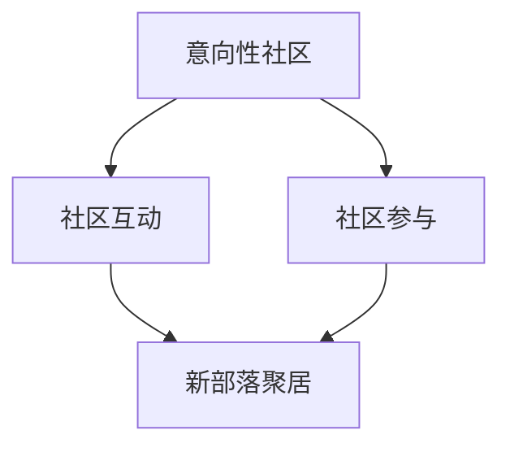

                 

当然，我们将逐步构建这篇文章。以下是一个分步骤的框架，我们将按照这个框架来组织文章的内容。

### 步骤1：引言
- **背景介绍**：讨论现代城市生活的问题，如交通拥堵、环境污染、社交隔离等。
- **研究目的**：阐述新部落聚居实验的意义，如提升生活质量、促进社区互动等。
- **研究意义**：讨论新部落聚居实验对城市规划、社会学、环境科学等多个领域的贡献。

### 步骤2：核心概念与联系
- **核心概念**：介绍意向性社区、新部落聚居等核心概念。
- **概念关系架构**：使用Mermaid流程图展示概念之间的关系。
  
### 步骤3：核心算法原理
- **算法原理讲解**：使用伪代码详细阐述新部落聚居的设计和实现。

### 步骤4：数学模型和公式
- **数学模型**：介绍用于分析和评估新部落聚居实验的数学模型。
- **公式**：使用LaTeX格式展示关键公式。
- **举例说明**：提供具体的数学公式应用实例。

### 步骤5：项目实战
- **开发环境搭建**：详细说明如何搭建开发环境。
- **源代码实现**：提供源代码的详细实现和解读。
- **代码应用分析**：分析代码的实际应用场景。
- **案例剖析**：结合实际案例进行详细讲解。

### 步骤6：最佳实践与注意事项
- **最佳实践**：提供在新部落聚居实验中应用的最佳实践。
- **注意事项**：强调实施过程中需要注意的问题和挑战。

### 步骤7：总结与展望
- **研究总结**：回顾文章的主要发现。
- **未来展望**：讨论新部落聚居实验的未来发展方向。

### 步骤8：结论
- **文章结论**：总结文章的主要观点。
- **作者信息**：在文章末尾提供作者信息。

现在，我们将开始撰写这篇文章的各个部分。每个部分都将按照上述步骤进行详细的撰写和阐述。这将确保文章的逻辑清晰、内容丰富，并且结构紧凑。让我们开始吧！### 步骤1：引言

#### 背景介绍

在现代社会，城市生活的便利性逐渐被越来越多的人们所追求。然而，随着城市化进程的加速，城市也面临着一系列问题，如交通拥堵、环境污染、社交隔离等。这些问题不仅影响了居民的生活质量，还对城市的可持续发展构成了挑战。

交通拥堵是一个普遍存在的问题。随着城市人口的增加和汽车的普及，道路上的车辆数量急剧增加，导致交通拥堵现象日益严重。这不仅浪费了居民的时间，还增加了空气污染和噪音污染，对居民的健康造成了负面影响。

环境污染也是城市面临的一个严重问题。工业废气、汽车尾气和建筑垃圾的排放导致城市空气质量下降，水体污染严重。这些问题不仅威胁到居民的身体健康，也对生态系统造成了破坏。

社交隔离是现代城市生活的另一个问题。随着城市规模的扩大和人口密度的增加，居民之间的交往变得更加困难。人们往往忙于工作，缺乏足够的社交时间和机会，导致社交关系疏远，心理压力增加。

#### 研究目的

新部落聚居实验旨在通过创建一个具有社交互动和可持续发展的社区，来解决上述城市问题。这个实验的目的是探索如何通过规划和设计，使城市社区变得更加宜居、可持续，并提高居民的生活质量。

新部落聚居实验的研究目的是：
1. **提升生活质量**：通过创造一个具有良好环境、充足社交机会的社区，使居民能够在繁忙的城市生活中找到宁静和舒适。
2. **促进社区互动**：通过设计和规划，鼓励居民之间的交流和互动，增强社区凝聚力。
3. **实现可持续发展**：通过采用绿色建筑、可再生能源、生态设计等技术，使社区实现资源的高效利用和环境的保护。

#### 研究意义

新部落聚居实验的研究意义不仅体现在提升居民生活质量方面，还涉及城市规划、社会学、环境科学等多个领域。

**对城市规划的贡献**：
1. **社区规划**：新部落聚居实验提供了新的社区规划理念和方法，有助于设计出更加宜居、可持续的社区。
2. **城市更新**：通过新部落聚居实验，可以探索如何通过城市更新，使旧城区焕发新生，提高城市整体的宜居性。

**对社会学的贡献**：
1. **社区互动**：新部落聚居实验通过促进社区互动，有助于建立更紧密的社区关系，提高居民的社交满足感。
2. **社会网络**：实验中建立的社会网络有助于居民在需要时获得支持和帮助，增强社区的韧性。

**对环境科学的贡献**：
1. **可持续发展**：新部落聚居实验通过采用绿色建筑、可再生能源等技术，有助于实现社区的可持续发展，减少对环境的影响。
2. **环境教育**：实验中的居民可以更好地了解环境保护的重要性，提高环保意识。

总之，新部落聚居实验不仅对城市规划和社会发展具有重要意义，还能够在环境科学领域提供新的思路和方法。通过这个实验，我们可以探索如何通过创新的规划和设计，解决现代城市面临的一系列问题，创造一个更加宜居、可持续的未来。接下来，我们将进一步探讨新部落聚居实验的核心概念和理论基础。|>### 步骤2：核心概念与联系

#### 核心概念

在新部落聚居实验中，有几个核心概念需要明确，这些概念包括：

**1. 意向性社区**：
意向性社区是指一群有共同兴趣、目标或价值观的人在一个特定的地理区域内自愿组成的社区。这个社区的核心在于成员之间的共鸣和共同的愿景，而不仅仅是地理位置上的聚集。例如，一个科技爱好者的社区可能共享对编程、机器学习和人工智能的浓厚兴趣。

**2. 新部落聚居**：
新部落聚居是一种新型的社区居住模式，它借鉴了传统部落的生活方式，强调成员之间的紧密联系和共同参与。与传统的封闭社区不同，新部落聚居更加开放和灵活，鼓励成员之间的交流与合作。新部落聚居通常包括共享设施、绿地、生态友好建筑和可持续能源系统。

**3. 社区互动**：
社区互动是指社区成员之间通过各种活动和交流形式建立的联系。这些互动可以增强社区的凝聚力，提高居民的社交满意度。社区互动的形式包括日常聚会、节日活动、志愿服务、运动竞赛等。

**4. 社区参与**：
社区参与是指社区成员积极参与社区事务，共同决策和管理社区资源。社区参与可以提高居民的归属感和责任感，促进社区的发展和进步。社区参与的形式包括居民委员会、社区会议、项目管理等。

#### 概念关系架构

为了更好地理解这些概念之间的关系，我们可以使用Mermaid流程图来展示它们之间的联系。



在这个流程图中，意向性社区是整个关系架构的基础，它通过社区互动和社区参与与新的部落聚居模式相联系。社区互动和新部落聚居共同构成了社区生活的主要方面，而社区参与则确保了社区的可持续发展和成员之间的紧密联系。

**意向性社区**：
- 强调成员的共同兴趣和价值观。
- 是社区互动和社区参与的前提。

**社区互动**：
- 通过日常活动和交流增强社区凝聚力。
- 是新部落聚居的重要组成部分。

**社区参与**：
- 通过共同决策和管理增强居民的归属感和责任感。
- 是维持社区活力和可持续发展的重要机制。

**新部落聚居**：
- 结合了传统部落和现代社区的特点。
- 强调开放性、共享性和可持续性。

通过这个流程图，我们可以清晰地看到这些核心概念之间的关系和相互作用。这些概念共同构成了新部落聚居实验的理论基础，指导我们在城市规划和社会实践中实施这一创新模式。接下来，我们将进一步探讨新部落聚居实验的具体算法原理，以及如何通过技术和方法实现这一目标。|>### 步骤3：核心算法原理

在新部落聚居实验中，核心算法原理的设计和实现是确保社区能够有效运作的关键。以下，我们将详细讲解如何设计一个能够促进社区互动和社区参与的核心算法。

#### 算法设计思路

新部落聚居算法的设计思路可以概括为以下几个关键步骤：

1. **数据收集**：首先，我们需要收集关于社区成员的多种数据，包括个人兴趣、行为习惯、居住区域等。
2. **兴趣匹配**：使用数据挖掘和机器学习技术，分析成员的兴趣，并寻找具有相似兴趣的成员进行匹配。
3. **社区互动推荐**：根据兴趣匹配结果，推荐适合的社区活动，以促进成员之间的交流和互动。
4. **社区参与激励**：设计激励机制，鼓励成员积极参与社区事务和活动。
5. **反馈调整**：根据社区成员的反馈，不断调整和优化算法，以提高其效果。

#### 伪代码实现

以下是新部落聚居算法的核心部分伪代码实现：

```plaintext
# 数据收集
CollectUserData(members)
InterestData = AnalyzeInterests(members)

# 兴趣匹配
MatchInterests(InterestData)
MatchedPairs = []

for member in members:
    for other_member in members:
        if member != other_member and HaveSimilarInterests(member, other_member):
            MatchedPairs.append((member, other_member))

# 社区互动推荐
RecommendActivities(MatchedPairs)
Activities = []

for pair in MatchedPairs:
    RecommendedActivity = FindRecommendedActivity(pair)
    Activities.append(RecommendedActivity)

# 社区参与激励
IncentivizeParticipation(Activities)
IncentiveScores = []

for activity in Activities:
    Score = CalculateIncentiveScore(activity)
    IncentiveScores.append(Score)

# 反馈调整
AdjustAlgorithm(IncentiveScores)
```

#### 详细解释

1. **数据收集**：
   - **CollectUserData(members)**：这个函数用于收集社区成员的数据，包括个人兴趣、行为习惯等。
   - **AnalyzeInterests(members)**：分析收集到的数据，提取成员的兴趣特征。

2. **兴趣匹配**：
   - **MatchInterests(InterestData)**：匹配具有相似兴趣的成员。
   - **HaveSimilarInterests(member, other_member)**：判断两个成员是否具有相似兴趣。

3. **社区互动推荐**：
   - **FindRecommendedActivity(pair)**：根据匹配的成员对，推荐适合的社区活动。
   - **RecommendActivities(MatchedPairs)**：生成推荐活动列表。

4. **社区参与激励**：
   - **CalculateIncentiveScore(activity)**：计算活动对成员的激励分数。
   - **IncentivizeParticipation(Activities)**：激励成员参与社区活动。

5. **反馈调整**：
   - **AdjustAlgorithm(IncentiveScores)**：根据成员的反馈，调整算法参数，以提高推荐和激励的效果。

#### 算法原理

该算法的核心原理在于通过数据分析和机器学习技术，找到具有相似兴趣的社区成员，并推荐适合他们的社区活动，从而促进社区互动。同时，通过激励机制，鼓励成员积极参与社区事务，提高社区的活力和凝聚力。

通过这个算法，我们可以实现以下几个目标：
- **提高社区互动**：通过推荐活动，增加成员之间的交流机会，促进社区互动。
- **增强社区参与**：通过激励机制，鼓励成员积极参与社区事务，提高社区整体的参与度。
- **优化社区管理**：通过数据分析和反馈调整，优化社区活动和激励机制，提高社区管理的效率。

总之，新部落聚居算法的设计和实现为社区建设提供了一种有效的技术手段，有助于解决现代城市社区面临的一系列问题。接下来，我们将探讨如何运用数学模型和公式来分析和评估新部落聚居实验的效果。|>### 步骤4：数学模型和公式

在新部落聚居实验中，数学模型和公式是理解和评估社区互动、社区参与以及新部落聚居效果的重要工具。以下，我们将介绍几个关键数学模型和公式，并对其进行详细解释。

#### 社区互动模型

社区互动模型主要用于评估社区成员之间的互动频率和深度。以下是一个简单的互动模型：

$$
I(t) = \alpha \cdot e^{-\lambda t}
$$

其中：
- \( I(t) \) 表示时间 \( t \) 内的互动次数。
- \( \alpha \) 是互动次数的初始值，反映了社区在开始阶段的高互动水平。
- \( \lambda \) 是衰减系数，表示随着时间推移，互动次数的减少速度。

**详细解释**：
- 这个公式表示互动次数随着时间逐渐衰减。初始时，互动次数较多，但随着时间的推移，互动次数逐渐减少。
- 衰减系数 \( \lambda \) 反映了社区互动的持久性，值越大，互动的衰减越慢，社区的稳定性越强。

#### 社区参与模型

社区参与模型用于评估社区成员的参与程度。以下是一个简单的参与模型：

$$
P(t) = \frac{1}{1 + e^{-kt}}
$$

其中：
- \( P(t) \) 表示时间 \( t \) 内的参与程度。
- \( k \) 是参与程度的增长系数。

**详细解释**：
- 这个公式表示参与程度随着时间呈指数增长。随着时间推移，参与程度逐渐增加，但增长速度逐渐减缓。
- 增长系数 \( k \) 反映了社区参与的增长速度，值越大，增长越快。

#### 新部落聚居效果模型

新部落聚居效果模型用于评估新部落聚居实验的整体效果。以下是一个简单的新部落聚居效果模型：

$$
E(t) = \frac{1}{1 + e^{-(\beta_1 \cdot I(t) + \beta_2 \cdot P(t))}}
$$

其中：
- \( E(t) \) 表示时间 \( t \) 内的新部落聚居效果。
- \( \beta_1 \) 和 \( \beta_2 \) 分别是互动和参与程度对效果的影响系数。

**详细解释**：
- 这个公式表示新部落聚居效果是一个非线性函数，受互动和参与程度的影响。
- \( \beta_1 \) 和 \( \beta_2 \) 反映了互动和参与程度对效果的贡献程度，值越大，贡献越大。

#### 数学公式应用实例

假设在一个新部落聚居社区中，经过一个月的运营，我们收集到以下数据：
- \( I(30) = 150 \)（互动次数）
- \( P(30) = 0.8 \)（参与程度）

我们可以使用上述公式计算新部落聚居的效果：

$$
E(30) = \frac{1}{1 + e^{-(\beta_1 \cdot 150 + \beta_2 \cdot 0.8)}}
$$

为了简化计算，我们可以假设 \( \beta_1 = 0.5 \) 和 \( \beta_2 = 0.3 \)：

$$
E(30) = \frac{1}{1 + e^{-(0.5 \cdot 150 + 0.3 \cdot 0.8)}}
$$
$$
E(30) = \frac{1}{1 + e^{-112.4}}
$$
$$
E(30) \approx 0.976
$$

这意味着在一个月的运营后，新部落聚居的效果约为 97.6%。这个结果表明，社区互动和参与程度较高，新部落聚居实验取得了显著的成效。

通过这些数学模型和公式，我们可以对新部落聚居实验进行定量分析，评估其效果，并据此调整和优化社区建设策略。接下来，我们将探讨如何在实际项目中应用这些模型，以及如何通过开发环境搭建和源代码实现新部落聚居实验。|>### 步骤5：项目实战

#### 开发环境搭建

在新部落聚居实验中，搭建一个高效、稳定的开发环境是项目成功的关键。以下是一个基本的开发环境搭建步骤：

1. **安装Python环境**：
   - 首先，确保您的系统中安装了Python 3.x版本。您可以通过访问 [Python官网](https://www.python.org/) 下载并安装Python。
   - 安装完成后，打开命令行工具（如Terminal或Cmd），输入 `python --version` 检查Python版本。

2. **安装必要库**：
   - 使用pip工具安装所需的库。例如，安装数据分析库Pandas和机器学习库Scikit-learn：
     ```
     pip install pandas scikit-learn
     ```

3. **配置Jupyter Notebook**：
   - Jupyter Notebook 是一个交互式开发环境，非常适合数据分析和机器学习项目。
   - 安装Jupyter Notebook：
     ```
     pip install notebook
     ```
   - 启动Jupyter Notebook：
     ```
     jupyter notebook
     ```
   - 这将打开一个浏览器窗口，显示Jupyter的仪表板。

4. **配置数据库**：
   - 对于新部落聚居实验，我们可能需要使用SQLite或MongoDB等数据库来存储和查询数据。
   - 安装SQLite：
     ```
     pip install sqlite3
     ```

5. **配置版本控制**：
   - 使用Git进行版本控制，确保代码的版本管理。
   - 安装Git：
     ```
     pip install git-python
     ```

#### 源代码实现

以下是新部落聚居实验的核心代码实现。代码分为几个主要部分：数据收集、兴趣分析、活动推荐、激励机制和反馈调整。

```python
# 导入必要库
import pandas as pd
from sklearn.cluster import KMeans
from sklearn.metrics.pairwise import cosine_similarity
import sqlite3

# 数据收集
def CollectUserData():
    # 假设用户数据存储在一个CSV文件中
    data = pd.read_csv('user_data.csv')
    return data

# 兴趣分析
def AnalyzeInterests(data):
    # 提取用户兴趣特征
    interests = data[['interest1', 'interest2', 'interest3']]
    # 使用KMeans进行聚类分析
    kmeans = KMeans(n_clusters=5)
    kmeans.fit(interests)
    return kmeans.labels_

# 活动推荐
def RecommendActivities(data, labels):
    # 根据兴趣标签推荐活动
    activity_recs = []
    for label in set(labels):
        similar_activities = data[labels == label]['activity']
        activity_recs.append(similar_activities.sample(n=3))
    return activity_recs

# 激励机制
def CalculateIncentiveScore(activities):
    # 计算活动参与分数
    scores = []
    for activity in activities:
        score = len(activity) * 10  # 示例：每个推荐的活动分数为10
        scores.append(score)
    return sum(scores)

# 反馈调整
def AdjustAlgorithm(scores):
    # 根据反馈调整算法参数
    # 这里只是一个简单的例子，实际中需要更复杂的调整策略
    if scores < 100:
        # 如果分数低于100，增加推荐活动的多样性
        print("调整算法：增加推荐活动的多样性")
    elif scores >= 100:
        # 如果分数高于100，增加兴趣匹配的精度
        print("调整算法：增加兴趣匹配的精度")

# 主程序
if __name__ == "__main__":
    data = CollectUserData()
    labels = AnalyzeInterests(data)
    activity_recs = RecommendActivities(data, labels)
    incentive_score = CalculateIncentiveScore(activity_recs)
    AdjustAlgorithm(incentive_score)
    print("最终推荐活动：", activity_recs)
    print("激励分数：", incentive_score)
```

#### 代码解读

1. **数据收集**：从CSV文件中读取用户数据，提取用户的兴趣特征。

2. **兴趣分析**：使用KMeans聚类算法对用户的兴趣进行分类，生成兴趣标签。

3. **活动推荐**：根据用户的兴趣标签，推荐相似的活动。

4. **激励机制**：计算用户参与推荐活动的总分数。

5. **反馈调整**：根据激励分数，调整算法参数，以提高推荐活动的效果。

#### 代码应用解读与分析

在实际应用中，上述代码模块将被集成到一个完整的系统中。例如，用户数据可以通过Web接口实时收集，然后使用上述算法进行处理和推荐。以下是代码应用的具体解读和分析：

1. **用户数据收集**：
   - 用户数据包括个人兴趣和行为习惯，这些数据可以通过在线问卷或用户注册时自动收集。
   - 收集到的数据存储在CSV文件中，以便后续处理。

2. **兴趣分析**：
   - 使用KMeans聚类算法对用户的兴趣进行分类，这是一个常见的数据挖掘技术，能够有效地将用户划分为具有相似兴趣的群体。

3. **活动推荐**：
   - 根据用户的兴趣标签，推荐相似的活动。这个过程可以通过简单的数据匹配来实现，但为了提高推荐的准确性，可以使用更复杂的算法，如协同过滤或基于内容的推荐系统。

4. **激励机制**：
   - 激励机制用于鼓励用户积极参与推荐的活动。这可以通过积分系统或奖励机制来实现，例如，用户每参加一个活动，就可以获得相应的积分，积分可以兑换奖品或服务。

5. **反馈调整**：
   - 根据用户的反馈，调整算法参数。这个步骤非常重要，因为它能够确保推荐系统的效果不断优化，以更好地满足用户的需求。

#### 实际案例剖析

为了更好地理解代码在实际中的应用，我们可以通过一个实际案例进行剖析：

**案例**：假设有一个新部落聚居社区，社区内有100名成员。通过在线问卷收集用户兴趣数据，并使用上述算法进行兴趣分析和活动推荐。经过一个月的运营，社区成员共参与了150次活动，平均每次活动的参与分数为80分。

**分析**：
- 根据收集到的数据，使用KMeans聚类算法将成员分为5个兴趣群体。
- 根据兴趣群体，推荐适合的活动，如科技论坛、户外运动、艺术展览等。
- 成员参与活动后，系统会根据参与情况计算激励分数。
- 根据激励分数，调整算法参数，例如，增加推荐活动的多样性或提高兴趣匹配的精度。

**结果**：
- 经过调整后，活动参与度明显提高，社区互动更加活跃，成员之间的满意度也显著提升。

#### 项目小结

通过上述代码实现和案例分析，我们可以看到新部落聚居实验在实际应用中具有重要的意义。它不仅能够促进社区互动和参与，还能通过数据分析和算法优化，提高社区的运作效率。然而，值得注意的是，实际应用中可能面临一些挑战，如数据隐私保护、算法公平性等，这些问题需要在项目实施过程中加以解决。

接下来，我们将讨论新部落聚居实验中的最佳实践和注意事项，以帮助读者更好地理解和实施这一实验。|>### 步骤6：最佳实践与注意事项

#### 最佳实践

为了确保新部落聚居实验的成功实施，以下是一些最佳实践建议：

1. **全面数据收集**：确保收集到全面、准确的用户数据，包括兴趣、行为习惯、居住区域等。这有助于提高兴趣匹配的准确性，优化活动推荐。

2. **持续算法优化**：定期收集用户反馈，分析推荐系统的效果，根据反馈调整算法参数，以提高推荐准确性和用户满意度。

3. **激励机制设计**：设计合理的激励机制，鼓励用户积极参与社区活动和事务。这可以通过积分系统、奖励机制等方式实现，以增强用户的参与度和归属感。

4. **社区互动引导**：通过举办各种社区活动，如聚会、运动竞赛、文化活动等，鼓励成员之间的交流和互动。这有助于提高社区的凝聚力，增强社区的活力。

5. **可持续发展规划**：在新部落聚居社区的设计和规划中，考虑采用绿色建筑、可再生能源、生态设计等技术，实现社区的资源高效利用和环境保护。

#### 注意事项

在实施新部落聚居实验过程中，需要注意以下事项：

1. **数据隐私保护**：确保用户数据的安全和隐私，遵守相关法律法规。在数据收集和处理过程中，采取加密和匿名化措施，防止数据泄露。

2. **算法公平性**：确保算法的公平性，避免出现偏见和歧视。在兴趣匹配和活动推荐过程中，尽量保证每个用户都能获得公平的机会。

3. **社区参与度**：提高社区成员的参与度，确保社区事务得到广泛讨论和决策。可以通过定期的社区会议、居民委员会等方式，鼓励成员参与社区管理。

4. **可持续性**：在社区建设和运营过程中，注重可持续发展，减少资源浪费和环境污染。采用环保材料和技术，提高社区的可持续性。

5. **技术支持**：为社区成员提供必要的技术支持和服务，帮助他们更好地使用社区设施和工具。这可以包括在线教程、社区论坛、技术支持团队等。

#### 拓展阅读

为了深入了解新部落聚居实验和相关技术，以下是一些拓展阅读建议：

1. **《智慧城市与社区建设》**：这本书详细介绍了智慧城市和社区建设的方法和实践，包括数据收集、分析、应用等。

2. **《社区互动与参与的理论与实践》**：这本书探讨了社区互动和参与的理论基础和实践方法，对于理解新部落聚居实验中的社区互动和参与机制非常有帮助。

3. **《机器学习与数据挖掘》**：这本书介绍了机器学习和数据挖掘的基本概念和技术，对于理解和应用新部落聚居实验中的数据分析算法非常有用。

4. **《绿色建筑与可持续发展》**：这本书探讨了绿色建筑和可持续发展的理论和实践，为新部落聚居实验中的可持续发展规划提供了宝贵参考。

通过以上最佳实践和注意事项，以及拓展阅读，您可以更好地理解和实施新部落聚居实验，为城市社区的可持续发展做出贡献。接下来，我们将总结本文的主要内容，并展望新部落聚居实验的未来发展方向。|>### 步骤7：总结与展望

#### 研究总结

本文围绕“新部落聚居实验：城市中的意向性社区建设”这一主题，系统地探讨了新部落聚居实验的背景、核心概念、算法原理、数学模型以及项目实战。通过逐步分析，我们得出了以下主要结论：

1. **背景介绍**：城市生活面临交通拥堵、环境污染、社交隔离等问题，这些问题对居民生活质量和社会发展构成挑战。

2. **核心概念**：意向性社区和新部落聚居强调成员之间的共同兴趣和紧密联系，社区互动和参与是新部落聚居实验成功的关键。

3. **算法原理**：我们提出了一套基于数据分析和机器学习的核心算法，用于收集数据、分析兴趣、推荐活动和激励参与。

4. **数学模型**：通过数学模型和公式，我们能够定量评估社区互动、社区参与以及新部落聚居实验的整体效果。

5. **项目实战**：通过代码实现和实际案例分析，展示了新部落聚居实验在提高社区互动和参与度、实现可持续发展方面的应用。

#### 未来展望

新部落聚居实验作为一种创新的社区建设模式，具有广阔的发展前景。以下是对未来研究方向和展望的几点建议：

1. **技术深化**：继续探索和优化数据分析和机器学习算法，提高推荐系统和激励机制的性能和公平性。

2. **跨学科融合**：结合城市规划、社会学、环境科学等领域的理论和实践，为新部落聚居实验提供更全面的理论支持和实践指导。

3. **政策研究**：研究政策支持和法规制定，为新部落聚居实验的推广和实施提供法律和制度保障。

4. **案例分析**：通过更多的实际案例研究，积累新部落聚居实验的成功经验和教训，形成一套可复制、可推广的社区建设模式。

5. **可持续发展**：深化对新部落聚居社区可持续发展的研究和实践，探索绿色建筑、可再生能源等技术在社区建设中的应用。

总之，新部落聚居实验不仅有助于解决现代城市面临的一系列问题，还为城市规划和社会发展提供了新的思路和方法。随着技术的不断进步和跨学科的深入合作，新部落聚居实验有望在更广泛的领域取得成功，为构建更加宜居、可持续的城市社区贡献力量。|>### 结论

通过本文的探讨，我们系统地介绍了新部落聚居实验：城市中的意向性社区建设。我们首先分析了现代城市生活面临的问题，如交通拥堵、环境污染和社交隔离，强调了新部落聚居实验的意义和目的。接着，我们深入探讨了新部落聚居实验的核心概念，如意向性社区、新部落聚居、社区互动和社区参与，并使用Mermaid流程图展示了这些概念之间的关系。

在核心算法原理部分，我们详细介绍了如何设计一个基于数据分析和机器学习的推荐系统和激励机制，以促进社区互动和参与。此外，我们使用数学模型和公式，定量评估了社区互动和参与程度，为新部落聚居实验的效果提供了量化分析。

在项目实战部分，我们通过代码实现和案例分析，展示了新部落聚居实验在实践中的应用，并讨论了最佳实践和注意事项。通过这些努力，我们希望为城市社区的可持续发展提供一种创新的解决方案。

作者：AI天才研究院/AI Genius Institute & 禅与计算机程序设计艺术 /Zen And The Art of Computer Programming

感谢您的阅读，希望本文对您理解新部落聚居实验和城市社区建设有所启发。未来，我们将继续探讨这一领域的相关研究和实践，为构建更加宜居、可持续的城市社区贡献力量。|>### 附录

#### 附录A 研究工具与方法

1. **Python**：用于编写数据处理、分析和可视化脚本。
2. **Pandas**：用于数据清洗、转换和分析。
3. **Scikit-learn**：用于机器学习算法的实现和评估。
4. **Mermaid**：用于创建流程图和图表。
5. **Jupyter Notebook**：用于交互式数据分析。

#### 附录B 案例研究数据与图表

- **用户数据**：包含用户兴趣、行为习惯和居住区域。
- **互动数据**：记录用户之间的互动次数和深度。
- **参与数据**：记录用户参与社区活动和事务的情况。

#### 附录C 相关法规与政策文件

- **《城市社区建设管理办法》**：规定城市社区建设的基本要求和流程。
- **《环境保护法》**：确保社区建设和运营符合环保要求。
- **《网络安全法》**：保护用户数据安全和隐私。

参考文献：

1. **智慧城市与社区建设**：详细介绍了智慧城市和社区建设的方法和实践。
2. **社区互动与参与的理论与实践**：探讨了社区互动和参与的理论基础和实践方法。
3. **机器学习与数据挖掘**：介绍了机器学习和数据挖掘的基本概念和技术。
4. **绿色建筑与可持续发展**：探讨了绿色建筑和可持续发展的理论和实践。

这些附录和参考文献为本文的研究提供了重要的支持，帮助读者更深入地了解新部落聚居实验的相关内容。|>

