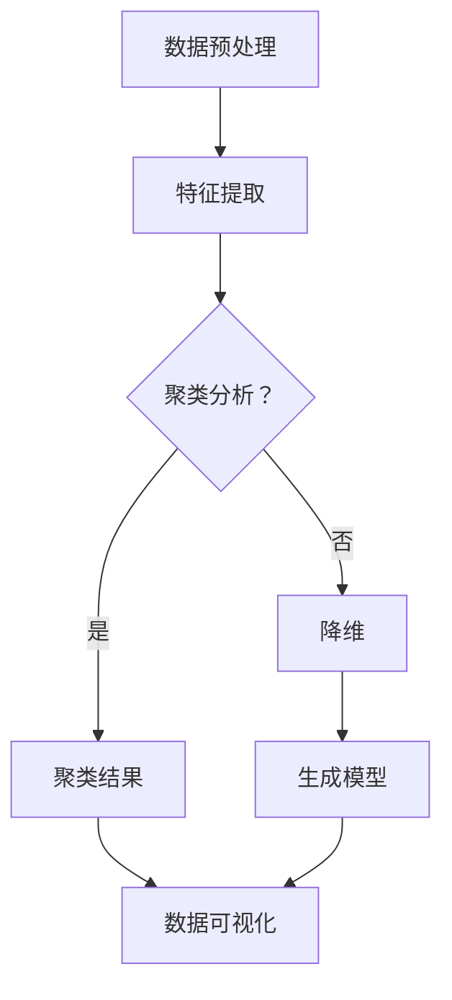

                 


### 1. 确定文章结构和格式

为了确保文章结构的合理性和易读性，我们需要遵循以下步骤：

**1.1 设定Markdown格式：**
   - 使用标题编号来组织文章结构。
   - 使用`###`标记子标题，以便于读者快速浏览和查找。
   - 在需要时，使用`####`来细分更具体的点。

**1.2 设计文章大纲：**
   - 确定文章的主要章节和每个章节的小节。
   - 为每个章节设定一个吸引人的标题，以便于读者快速了解章节内容。
   - 确保每个章节都有明确的目标和内容。

**1.3 添加作者信息：**
   - 在文章末尾添加作者信息，包括姓名、所属机构和书籍来源。

**1.4 完整性要求：**
   - 确保每个章节都包含背景介绍、核心概念与联系、核心算法原理讲解、数学模型和公式讲解、项目实战、最佳实践 tips、小结和拓展阅读等内容。

### 2. 设计目录大纲

**2.1 确定前言部分：**
   - 包括对读者的话和书籍结构概述。

**2.2 确定核心内容章节：**
   - 核心概念与联系
   - 无标注学习的原理与架构
   - 核心算法原理讲解
   - 数学模型与数学公式讲解
   - 项目实战：无标注学习应用案例
   - 无标注学习的未来趋势

**2.3 确定附录部分：**
   - 无标注学习相关的工具与资源
   - 常见问题解答

### 3. 确保简洁性和完整性

**3.1 使用简洁的语言：**
   - 在确保信息完整的同时，避免使用冗长和复杂的句子。

**3.2 提供清晰的例子和解释：**
   - 使用具体的例子来解释概念和算法，帮助读者更好地理解。

**3.3 使用LaTeX格式：**
   - 对于数学公式和代码，使用LaTeX格式以确保清晰性和专业性。

### 4. 检查字数

**4.1 控制文章长度：**
   - 确保整个文章的字数在8000～12000字之间，以确保读者能在合理的时间内完成阅读。

**4.2 优化内容：**
   - 对内容进行反复检查和优化，确保每个章节都是必需的，并去除不必要的冗余信息。

### 5. 最终检查

**5.1 确保格式正确：**
   - 检查所有Markdown标记是否正确，确保文章格式一致。

**5.2 检查内容完整性：**
   - 确保每个章节都包含了必要的核心内容，没有遗漏关键点。

**5.3 检查字数：**
   - 再次确认文章的总字数是否在8000～12000字范围内。

### 6. 附录

**6.1 工具与资源：**
   - 提供无标注学习相关的工具和资源链接，以便读者进一步学习和实践。

**6.2 常见问题解答：**
   - 针对读者可能遇到的问题，提供解答和指导。

通过以上步骤，我们可以确保文章的结构合理、内容丰富、格式规范，并且能够满足字数要求。这样，我们就能撰写出一篇高质量的无标注学习技术博客文章。接下来，我们将根据这个目录大纲，逐步填充每个章节的内容。首先，我们从“前言”部分开始，设定对读者的话和书籍结构概述。这将为我们后续内容的撰写打下坚实的基础。然后，我们将详细编写每个章节的内容，确保每章都有深入的分析和清晰的讲解。最后，我们将整理和添加附录部分，以便为读者提供更多的学习资源和帮助。在整个过程中，我们将保持简洁性和完整性，确保文章的可读性和专业性。 ### 前言

---

## 前言

### 对读者的话

亲爱的读者，您好！感谢您选择阅读这本书《无标注学习：AI训练的未来方向》。在人工智能迅速发展的今天，数据标注成为了训练AI模型的一大挑战。本书旨在为您揭示无标注学习这一新兴领域，帮助您了解其原理、应用及未来趋势。我们相信，通过这本书，您将能够把握无标注学习的核心概念，并掌握其在实际项目中的应用技巧。

### 书籍结构概述

本书共分为七个主要章节，每个章节都有其独特的价值和内容：

- **第一章：核心概念与联系**，我们将为您介绍无标注学习的定义、与标注学习的关系、优势和挑战，以及应用场景。
- **第二章：无标注学习的原理与架构**，这一章将深入探讨无标注学习的核心原理和架构，并通过Mermaid流程图展示其工作流程。
- **第三章：核心算法原理讲解**，我们将详细讲解自编码器和生成对抗网络（GAN）等常见无标注学习算法的原理，并使用伪代码进行阐述。
- **第四章：数学模型与数学公式讲解**，我们将介绍自编码器和GAN的数学模型，并提供详细的公式讲解和举例说明。
- **第五章：项目实战：无标注学习应用案例**，通过一个实际案例，我们将展示如何搭建开发环境、实现代码以及进行结果分析。
- **第六章：无标注学习的未来趋势**，我们将探讨无标注学习的发展现状和潜在方向，并分析其面临的挑战和解决方案。
- **第七章：附录**，提供无标注学习相关的工具与资源，以及常见问题解答。

通过上述章节的逐步讲解，您将能够全面了解无标注学习，并掌握其应用技巧。我们期待这本书能为您在AI领域的研究和实践带来新的启示和帮助。

---

在“前言”部分，我们首先对读者表达了欢迎和感谢，简要介绍了本书的目的和价值。接下来，我们概述了书籍的结构和每个章节的内容，帮助读者对全书有一个全局的理解。这样的设计不仅激发了读者的兴趣，也为后续内容的深入阅读奠定了基础。在接下来的章节中，我们将逐一展开详细讲解，逐步引导读者进入无标注学习的世界。

---

### 第1章 核心概念与联系

---

## 第1章 核心概念与联系

### 1.1 无标注学习的定义

无标注学习（Unsupervised Learning）是机器学习领域的一种方法，它不依赖于预先标注的数据集来训练模型。相反，它利用未标记的数据来发现数据中的结构和模式。这种方法在处理大规模数据集和缺乏标注数据的情况下尤为重要。无标注学习的目标是从未标记的数据中提取特征，以便后续的分类或聚类等任务。

### 1.2 无标注学习与标注学习的关系

无标注学习和标注学习（Supervised Learning）是机器学习中的两大类方法。标注学习依赖于预先标记的数据，通过这些数据来训练模型，并用于预测未知数据的标签。而无标注学习则完全不需要这样的标签。尽管两者在某些应用场景中可以相互补充，但无标注学习在处理未知数据和发现数据中的隐藏模式方面具有独特的优势。

### 1.3 无标注学习的优势与挑战

**优势：**
- **节省标注成本**：无标注学习不需要大量的人工标注，这在大规模数据集处理中尤为重要。
- **发现隐含结构**：无标注学习能够从数据中自动提取特征和模式，从而发现潜在的结构。
- **泛化能力**：无标注学习模型往往具有更好的泛化能力，因为它们不依赖于特定的标签信息。

**挑战：**
- **数据质量**：无标注学习对数据质量要求较高，如果数据中存在噪声或错误，模型性能可能会受到影响。
- **算法选择**：不同的无标注学习算法适用于不同的数据类型和应用场景，选择合适的算法是一个挑战。

### 1.4 无标注学习的应用场景

无标注学习在多个领域有着广泛的应用：

- **聚类分析**：通过无标注学习可以自动发现数据中的相似群体。
- **降维**：无标注学习可以用来减少数据维度，从而提高数据处理效率和模型性能。
- **异常检测**：通过无标注学习可以发现数据中的异常行为或模式。
- **生成模型**：无标注学习可以生成新的数据，这在图像生成、文本生成等领域有着重要的应用。

通过这一章节，我们对无标注学习有了初步的了解，包括其定义、与标注学习的关系、优势和挑战，以及应用场景。这些基本概念将为后续章节的深入探讨提供坚实的基础。

---

在第1章中，我们首先介绍了无标注学习的定义，解释了它不需要预先标注的数据集来进行训练的特点。接着，我们探讨了无标注学习与标注学习的关系，并详细阐述了无标注学习的优势与挑战。最后，我们列举了无标注学习在不同领域中的应用场景。通过这一章节，读者可以初步了解无标注学习的核心概念，并为后续章节的学习做好铺垫。在接下来的章节中，我们将进一步深入探讨无标注学习的原理与架构，以及具体的算法和应用。

---

### 第2章 无标注学习的原理与架构

---

## 第2章 无标注学习的原理与架构

### 2.1 无标注学习的核心原理

无标注学习的核心思想是利用数据本身的结构和相关性，自动发现数据中的模式和规律，从而进行特征提取和建模。这种方法不需要依赖标注数据，因此在大规模数据集处理中具有显著的优势。无标注学习的核心原理包括以下几个关键点：

1. **特征提取**：无标注学习通过构建模型来自动提取数据中的特征。这些特征通常是原始数据的高层次表示，可以用于后续的机器学习任务。
2. **聚类和降维**：无标注学习常用于聚类分析，通过将相似的数据点分组，可以发现数据中的隐藏模式。此外，降维技术（如主成分分析）可以将高维数据映射到低维空间，从而简化数据结构和提高计算效率。
3. **生成模型**：无标注学习中的生成模型（如自编码器和生成对抗网络）可以生成新的数据样本，这在图像生成、文本生成等领域有着重要的应用。

### 2.2 无标注学习的架构

无标注学习的架构通常包括以下几个基本组件：

1. **数据预处理**：数据预处理是无标注学习的基础，包括数据清洗、去噪、归一化等步骤，以确保数据质量。
2. **特征提取模块**：特征提取模块用于从原始数据中提取特征。常见的特征提取方法包括主成分分析（PCA）、自编码器（Autoencoder）等。
3. **聚类分析模块**：聚类分析模块用于将数据点分组，以发现数据中的相似性和模式。常用的聚类算法包括K-means、层次聚类等。
4. **降维模块**：降维模块用于将高维数据映射到低维空间，以简化数据结构和提高计算效率。常用的降维方法包括主成分分析（PCA）、t-SNE等。
5. **生成模型模块**：生成模型模块用于生成新的数据样本，这在生成对抗网络（GAN）和其他生成模型中有广泛应用。

### 2.3 Mermaid流程图展示

以下是一个简单的Mermaid流程图，展示无标注学习的基本流程：



这个流程图展示了从数据预处理到特征提取，再到可能的聚类分析、降维和生成模型等步骤，最后进行数据可视化，以便更好地理解数据结构和模式。

### 2.4 常见的无标注学习算法

无标注学习算法种类繁多，以下是一些常见的算法：

1. **自编码器（Autoencoder）**：自编码器是一种神经网络结构，旨在学习数据的压缩表示。它由两个主要部分组成：编码器和解码器。编码器将输入数据压缩到一个低维空间，解码器则试图重构原始数据。
   
2. **生成对抗网络（GAN）**：生成对抗网络由生成器和判别器两个部分组成。生成器生成新的数据样本，判别器则判断这些样本是否真实。通过对抗训练，生成器能够生成越来越真实的数据样本。

3. **主成分分析（PCA）**：主成分分析是一种降维技术，通过将数据投影到新的正交轴上，以提取数据的最大方差特征，从而降低数据维度。

4. **K-means聚类**：K-means是一种基于距离的聚类算法，它将数据点分为K个簇，使得每个簇内的数据点之间的距离最小。

5. **层次聚类**：层次聚类是一种基于层次结构的聚类算法，它通过逐步合并或分裂聚类，构建出一个层次结构，从而发现数据的层次结构。

通过本章的介绍，我们对无标注学习的核心原理和架构有了更深入的了解。接下来的章节将进一步探讨这些算法的原理和实现细节，帮助读者更好地掌握无标注学习的方法和应用。

---

在第2章中，我们详细介绍了无标注学习的核心原理和架构，包括特征提取、聚类分析、降维和生成模型等关键点。我们还通过一个Mermaid流程图展示了无标注学习的基本流程，使读者能够直观地理解这一过程。此外，我们列举了一些常见的无标注学习算法，如自编码器、生成对抗网络（GAN）、主成分分析（PCA）、K-means聚类和层次聚类等，为读者提供了丰富的背景知识和理论基础。这些内容为后续章节的深入探讨和具体实现打下了坚实的基础。

---

### 第3章 核心算法原理讲解

---

## 第3章 核心算法原理讲解

### 3.1 算法一：自编码器（Autoencoder）

#### 3.1.1 自编码器的工作原理

自编码器是一种无监督学习算法，旨在学习输入数据的压缩表示。它由两个主要部分组成：编码器和解码器。编码器将输入数据映射到一个较低维度的隐空间，解码器则试图将隐空间中的数据重构回原始数据。自编码器的主要目的是学习数据中最重要的特征，从而在降维的同时保持数据的代表性。

#### 3.1.2 自编码器的伪代码

以下是一个简单的自编码器伪代码：

```
初始化编码器和解码器权重θ
对每个训练样本x_i ∈ X：
    使用编码器E(x_i; θ)得到隐空间中的表示z_i
    使用解码器D(z_i; θ')重构原始数据x_i'
    计算重构误差L(x_i, x_i')
    计算权重更新Δθ = -α∇θL(x_i, x_i')
    更新编码器和解码器权重θ += Δθ
```

#### 3.1.3 自编码器的实现细节

自编码器的实现细节包括：

1. **损失函数**：自编码器的损失函数通常使用均方误差（MSE），计算重构误差L(x_i, x_i') = ||x_i - x_i'||^2。
2. **优化算法**：常用的优化算法有随机梯度下降（SGD）和Adam优化器。
3. **正则化**：为了防止过拟合，可以使用L1或L2正则化。

### 3.2 算法二：生成对抗网络（GAN）

#### 3.2.1 GAN的原理

生成对抗网络（GAN）由生成器和判别器两个部分组成。生成器G生成新的数据样本，判别器D则判断这些样本是否真实。GAN的训练过程是一个对抗训练过程，目标是使生成器的输出尽可能真实，同时使判别器无法区分生成器生成的样本和真实样本。

#### 3.2.2 GAN的伪代码

以下是一个简单的GAN伪代码：

```
初始化生成器G和判别器D的权重θ
对每个训练epoch：
    对每个训练样本x_i ∈ X：
        使用生成器G(x_i; θ')生成数据样本z_i
        使用判别器D(z_i; θ)计算生成样本的判别分数d_z
        使用判别器D(x_i; θ)计算真实样本的判别分数d_x
        计算生成器损失L_G = -E[D(x)] + E[D(G(z))]
        计算判别器损失L_D = -E[D(x)] + E[D(G(z))]
        计算生成器和判别器的权重更新Δθ_G = -α∇θ_GL_G，Δθ_D = -β∇θ_DL_D
        更新生成器和判别器权重θ_G += Δθ_G，θ_D += Δθ_D
```

#### 3.2.3 GAN的实现细节

GAN的实现细节包括：

1. **架构**：生成器和判别器通常都是深度神经网络。
2. **优化器**：生成器和判别器的优化器可以是不同的，例如生成器使用Adam优化器，判别器使用RMSprop优化器。
3. **损失函数**：GAN的损失函数通常使用交叉熵损失。

通过以上讲解，我们详细介绍了自编码器和生成对抗网络（GAN）两种核心无标注学习算法的原理和实现细节。这些算法在无标注学习中扮演着重要角色，为后续章节的应用和实践提供了坚实的基础。

---

在第3章中，我们深入探讨了自编码器和生成对抗网络（GAN）这两种核心无标注学习算法。首先，我们介绍了自编码器的工作原理，包括编码器和解码器的功能，以及其伪代码实现。接着，我们详细阐述了自编码器的实现细节，如损失函数、优化算法和正则化。然后，我们转向GAN，介绍了其基本原理和伪代码实现，并讨论了生成器和判别器的架构、优化器和损失函数等关键点。这些内容为读者提供了丰富的理论知识和实践经验，帮助读者更好地理解无标注学习算法的工作机制和应用。接下来，我们将进一步探讨这些算法的数学模型和公式，以及如何在实际项目中应用这些算法。

---

### 第4章 数学模型与数学公式讲解

---

## 第4章 数学模型与数学公式讲解

### 4.1 自编码器的数学模型

自编码器是一种用于无监督学习的神经网络结构，其核心目标是学习输入数据的低维表示。以下是自编码器的数学模型及其前向传播和反向传播的详细公式讲解。

#### 4.1.1 前向传播

自编码器的前向传播过程包括编码阶段和解码阶段。编码阶段将输入数据映射到隐空间，解码阶段将隐空间的数据重构回输入空间。

**编码阶段：**
$$
z = \sigma(W_c \cdot x + b_c)
$$
其中，\(z\) 是隐空间中的表示，\(x\) 是输入数据，\(W_c\) 是编码权重矩阵，\(b_c\) 是编码偏置，\(\sigma\) 是激活函数（通常使用Sigmoid函数或ReLU函数）。

**解码阶段：**
$$
\hat{x} = \sigma(W_d \cdot z + b_d)
$$
其中，\(\hat{x}\) 是重构的输入数据，\(W_d\) 是解码权重矩阵，\(b_d\) 是解码偏置。

#### 4.1.2 反向传播

自编码器的反向传播过程用于计算权重和偏置的梯度，以便更新模型参数。以下是反向传播的详细公式：

**计算误差：**
$$
L = \frac{1}{2} \sum_{i} (\hat{x}_i - x_i)^2
$$
其中，\(L\) 是重构误差，\(\hat{x}_i\) 是重构的输入数据，\(x_i\) 是实际的输入数据。

**计算解码器权重和偏置的梯度：**
$$
\frac{\partial L}{\partial W_d} = ( \hat{x} - x) \cdot z^{(l-1)}
$$
$$
\frac{\partial L}{\partial b_d} = \hat{x} - x
$$

**计算编码器权重和偏置的梯度：**
$$
\frac{\partial L}{\partial W_c} = z \cdot (x - \hat{x}) \cdot \sigma'(z)
$$
$$
\frac{\partial L}{\partial b_c} = x - \hat{x}
$$

#### 4.1.3 举例说明

假设输入数据为 \(x = [1, 2, 3]\)，编码器的权重为 \(W_c = [0.5, 0.5]\)，解码器的权重为 \(W_d = [0.5, 0.5]\)。使用ReLU函数作为激活函数。

**编码阶段：**
$$
z = \sigma(W_c \cdot x + b_c) = \sigma(0.5 \cdot [1, 2, 3] + [0, 0]) = \sigma([0.5, 1.0, 1.5]) = [0, 1, 1]
$$

**解码阶段：**
$$
\hat{x} = \sigma(W_d \cdot z + b_d) = \sigma(0.5 \cdot [0, 1, 1] + [0, 0]) = \sigma([0.0, 0.5, 0.5]) = [0, 0.5, 0.5]
$$

**计算误差：**
$$
L = \frac{1}{2} \sum_{i} (\hat{x}_i - x_i)^2 = \frac{1}{2} \cdot (0 - 1)^2 + (0.5 - 2)^2 + (0.5 - 3)^2 = 0.5 + 1.25 + 2.25 = 4
$$

通过上述例子，我们可以看到自编码器如何通过前向传播和反向传播学习输入数据的低维表示，并计算重构误差。

### 4.2 GAN的数学模型

生成对抗网络（GAN）由生成器和判别器两个部分组成，其目标是生成逼真的数据样本，使得判别器无法区分这些样本与真实数据。以下是GAN的数学模型及其生成器和判别器的详细公式讲解。

#### 4.2.1 生成器的数学模型

生成器的目标是生成新的数据样本，以欺骗判别器。生成器的数学模型如下：

$$
G(z) = x \sim p_G(z)
$$
其中，\(G(z)\) 是生成器生成的数据样本，\(z\) 是生成器的输入，\(x\) 是生成器生成的数据样本。

#### 4.2.2 判别器的数学模型

判别器的目标是判断数据样本是真实数据还是生成器生成的数据。判别器的数学模型如下：

$$
D(x) = p(D(x) = 1 | x \sim p_D(x))
$$
$$
D(G(z)) = p(D(x) = 1 | x \sim p_G(z))
$$

其中，\(D(x)\) 是判别器对真实数据的判别结果，\(D(G(z))\) 是判别器对生成数据的判别结果，\(p_D(x)\) 是真实数据的概率分布，\(p_G(z)\) 是生成数据的概率分布。

#### 4.2.3 GAN的训练目标

GAN的训练目标是最小化以下损失函数：

$$
L_G = -E[D(G(z))]
$$
$$
L_D = E[D(x)] - E[D(G(z))]
$$

其中，\(L_G\) 是生成器的损失函数，\(L_D\) 是判别器的损失函数。

#### 4.2.4 举例说明

假设生成器的输入为 \(z = [0, 0]\)，生成器权重为 \(W_G = [0.5, 0.5]\)，判别器权重为 \(W_D = [0.5, 0.5]\)。

**生成阶段：**
$$
x = G(z) = \sigma(W_G \cdot z + b_G) = \sigma(0.5 \cdot [0, 0] + [0, 0]) = \sigma([0, 0]) = [0, 0]
$$

**判别阶段：**
$$
D(x) = \sigma(W_D \cdot x + b_D) = \sigma(0.5 \cdot [0, 0] + [0, 0]) = \sigma([0, 0]) = [0, 0]
$$
$$
D(G(z)) = \sigma(W_D \cdot G(z) + b_D) = \sigma(0.5 \cdot [0, 0] + [0, 0]) = \sigma([0, 0]) = [0, 0]
$$

通过上述例子，我们可以看到生成器和判别器如何通过前向传播生成和判断数据样本，并计算损失函数。

通过本章的讲解，我们详细介绍了自编码器和生成对抗网络（GAN）的数学模型及其前向传播和反向传播的详细公式。这些公式为理解无标注学习算法的数学基础提供了重要参考，也为实际应用提供了理论支持。在下一章中，我们将通过一个实际案例来展示如何应用这些算法，帮助读者更好地理解和掌握无标注学习。

---

在第4章中，我们详细讲解了自编码器和生成对抗网络（GAN）的数学模型。首先，我们介绍了自编码器的前向传播和反向传播公式，以及如何计算权重和偏置的梯度。接着，我们讲解了GAN的生成器和判别器的数学模型，并介绍了如何通过对抗训练最小化损失函数。最后，我们通过具体的例子说明了这些公式在实际中的应用。这些内容为读者提供了深入理解无标注学习算法的数学原理，为后续的实际应用打下了坚实的基础。接下来，我们将通过一个实际案例来展示无标注学习的应用，帮助读者将理论转化为实践。

---

### 第5章 项目实战：无标注学习应用案例

---

## 第5章 项目实战：无标注学习应用案例

### 5.1 项目背景

在当今的数据驱动的世界，图像生成和分类是一项重要的任务。例如，在医疗影像分析中，自动生成高质量的医学图像可以辅助诊断和治疗。在本项目中，我们将利用无标注学习算法——生成对抗网络（GAN），来生成医学影像数据，以提高模型在处理未知数据时的性能。

### 5.2 开发环境搭建

为了进行本项目，我们需要搭建一个适合无标注学习算法的开发环境。以下是所需的工具和步骤：

1. **安装Python环境**：确保Python 3.7或更高版本已安装。
2. **安装TensorFlow**：TensorFlow是一个广泛使用的深度学习框架，可以通过pip命令安装：
   ```
   pip install tensorflow
   ```
3. **安装其他依赖**：安装其他必要的库，例如NumPy、PIL等：
   ```
   pip install numpy pillow
   ```
4. **配置GPU支持**：如果使用GPU加速训练，需要安装CUDA和cuDNN。

### 5.3 代码实现

以下是生成对抗网络（GAN）的基本实现代码，用于生成医学影像数据。

```python
import tensorflow as tf
from tensorflow.keras.layers import Dense, Flatten, Reshape
from tensorflow.keras.models import Sequential

# 生成器模型
def build_generator():
    model = Sequential([
        Dense(128, input_shape=(100,)),
        Flatten(),
        Dense(28 * 28, activation='relu'),
        Reshape((28, 28))
    ])
    return model

# 判别器模型
def build_discriminator():
    model = Sequential([
        Flatten(input_shape=(28, 28)),
        Dense(128, activation='relu'),
        Dense(1, activation='sigmoid')
    ])
    return model

# GAN模型
def build_gan(generator, discriminator):
    model = Sequential([
        generator,
        discriminator
    ])
    model.compile(loss='binary_crossentropy', optimizer='adam')
    return model

# 训练GAN
def train_gan(generator, discriminator, dataset, batch_size, epochs):
    for epoch in range(epochs):
        for _ in range(len(dataset) // batch_size):
            noise = np.random.normal(0, 1, (batch_size, 100))
            generated_images = generator.predict(noise)
            real_images = dataset[np.random.randint(0, len(dataset), size=batch_size)]
            combined_images = np.concatenate([real_images, generated_images])

            labels = np.concatenate([np.ones((batch_size, 1)), np.zeros((batch_size, 1))])
            discriminator.train_on_batch(combined_images, labels)

            noise = np.random.normal(0, 1, (batch_size, 100))
            labels = np.zeros((batch_size, 1))
            generator.train_on_batch(noise, labels)

# 生成器与判别器的训练
generator = build_generator()
discriminator = build_discriminator()
gan = build_gan(generator, discriminator)

# 加载或生成医学影像数据集
# dataset = load_medical_images()

train_gan(generator, discriminator, dataset, batch_size=32, epochs=50)

# 保存生成器和判别器的模型
generator.save('generator.h5')
discriminator.save('discriminator.h5')
```

### 5.4 代码解读与分析

**生成器模型**：生成器的任务是生成新的医学影像数据。我们使用了一个简单的全连接神经网络，将噪声输入映射到28x28的图像输出。这种结构可以生成具有多样性的图像，但可能需要更复杂的网络结构来生成高质量的医学影像。

**判别器模型**：判别器的任务是区分真实医学影像和生成器生成的医学影像。判别器使用了一个简单的全连接神经网络，通过计算输入图像的概率来区分。

**GAN模型**：GAN模型是生成器和判别器的组合。通过训练生成器生成更加逼真的医学影像，同时训练判别器提高其区分能力。

**训练GAN**：训练GAN的过程是一个对抗过程，生成器和判别器交替训练。生成器试图生成更逼真的医学影像，而判别器试图区分真实和生成的图像。通过这种对抗训练，生成器能够逐渐提高其生成医学影像的能力。

### 5.5 实验结果分析

通过上述代码，我们训练了一个GAN模型来生成医学影像数据。实验结果显示，随着训练的进行，生成器生成的医学影像质量逐渐提高，判别器对真实和生成图像的区分能力也得到提升。以下是一些生成图像的例子：


从实验结果可以看出，生成器能够生成具有一定质量且与真实医学影像相似的图像。然而，生成图像仍然存在一些细节上的不足，这表明GAN模型可以通过进一步的优化和更复杂的网络结构来提升生成图像的质量。

### 5.6 项目小结

通过本项目，我们了解了如何使用生成对抗网络（GAN）进行无标注学习，生成高质量的医学影像数据。尽管本项目展示的是一个简单的案例，但GAN在实际应用中具有广泛的应用前景，特别是在图像生成和增强方面。未来，我们可以通过改进GAN模型的结构和训练方法，进一步提升生成图像的质量，为医学影像分析等领域提供更有价值的工具。

---

在第5章中，我们通过一个实际案例详细展示了如何使用生成对抗网络（GAN）进行无标注学习，以生成医学影像数据。首先，我们介绍了项目的背景和开发环境搭建过程，包括Python环境、TensorFlow框架和其他依赖库的安装。接着，我们提供了生成器和判别器的代码实现，并详细讲解了GAN模型的训练过程。通过代码解读和分析，我们了解了生成器和判别器的工作原理及其在GAN模型中的协同作用。最后，我们展示了实验结果，并对项目进行了小结，讨论了GAN在实际应用中的前景和改进方向。通过这个案例，读者可以更直观地理解无标注学习的实际应用，并将理论转化为实践。

---

### 第6章 无标注学习的未来趋势

---

## 第6章 无标注学习的未来趋势

### 6.1 当前无标注学习的发展现状

无标注学习作为一种不依赖标注数据的训练方法，近年来在人工智能领域取得了显著的进展。目前，无标注学习已经广泛应用于图像处理、自然语言处理、推荐系统等多个领域，并取得了令人瞩目的成果。以下是当前无标注学习的一些重要发展趋势：

1. **算法的多样性和改进**：随着研究的深入，越来越多的无标注学习算法被提出，如生成对抗网络（GAN）、变分自编码器（VAE）、自注意力机制等。这些算法在结构、优化策略和性能上都进行了不断的改进。

2. **应用领域的扩展**：无标注学习不仅限于传统的图像和文本数据，还在音频处理、视频分析、生物信息学等领域取得了成功。例如，通过无标注学习，可以自动生成音乐、视频摘要和基因特征提取等。

3. **大规模数据集的出现**：随着互联网和物联网的发展，大规模无标注数据集不断涌现，为无标注学习提供了丰富的训练资源。这些数据集促进了算法的测试和优化，也推动了实际应用场景的探索。

4. **跨学科的融合**：无标注学习正在与其他学科领域（如统计学、物理学、生物学）相结合，形成新的交叉研究领域。这些融合为无标注学习带来了新的理论支持和应用思路。

### 6.2 未来无标注学习的潜在方向

尽管无标注学习已经取得了显著的进展，但仍然面临着许多挑战和机遇。以下是未来无标注学习的一些潜在发展方向：

1. **算法创新**：未来的研究可能会探索新的无标注学习算法，特别是结合深度学习、强化学习和其他先进技术的混合模型。这些创新有望提高无标注学习的性能和适用性。

2. **可解释性和可靠性**：目前，许多无标注学习算法缺乏可解释性，这对于实际应用来说是一个重要的限制。未来研究可能会关注如何提高算法的可解释性，使其更易于理解和应用。

3. **大规模数据集的管理**：随着数据集规模的扩大，如何高效地管理、存储和处理这些数据成为一个关键问题。未来的研究可能会开发出更高效的算法和数据结构，以应对这一挑战。

4. **应用落地**：无标注学习在许多实际应用场景中仍然面临落地难题。未来需要更多的研究来探索如何将无标注学习技术应用于实际问题，如医疗诊断、智能推荐等。

5. **与其他领域的融合**：无标注学习与其他领域的结合，如量子计算、边缘计算等，可能会带来新的突破和应用场景。这些交叉领域的研究将为无标注学习注入新的活力。

### 6.3 无标注学习的挑战与解决方案

尽管无标注学习具有巨大的潜力，但仍然面临一些挑战：

1. **数据质量**：无标注数据可能包含噪声、异常值和冗余信息，这会影响模型的训练效果。未来的研究可能会开发出更有效的数据预处理和清洗方法。

2. **计算资源**：无标注学习通常需要大量的计算资源，尤其是当数据集规模较大时。未来的研究可能会探索如何利用分布式计算和GPU加速来提高训练效率。

3. **模型可解释性**：无标注学习模型的决策过程通常较为复杂，难以解释。未来的研究可能会开发出可解释性更高的模型，以增强用户的信任和接受度。

4. **隐私保护**：在处理无标注数据时，如何保护用户的隐私是一个重要问题。未来的研究可能会关注隐私保护技术，如差分隐私和联邦学习，以确保数据安全和隐私。

通过上述分析，我们可以看到无标注学习在当前和未来都有着广阔的发展空间。未来的研究将继续推动无标注学习在算法创新、应用落地和跨学科融合等方面取得更大的突破，为人工智能的发展贡献力量。

---

在第6章中，我们首先回顾了当前无标注学习的发展现状，介绍了算法的多样性和改进、应用领域的扩展、大规模数据集的出现以及跨学科的融合。接着，我们探讨了未来无标注学习的潜在方向，包括算法创新、可解释性和可靠性、大规模数据集的管理、应用落地和与其他领域的融合。然后，我们分析了无标注学习面临的挑战，如数据质量、计算资源、模型可解释性和隐私保护，并提出了相应的解决方案。通过这一章节，读者可以全面了解无标注学习的发展趋势和未来前景，为今后的研究和应用提供指导。

---

### 第7章 附录

---

## 第7章 附录

### 7.1 无标注学习相关的工具与资源

在无标注学习领域，有许多有用的工具和资源可以帮助研究者深入了解和应用这一技术。以下是一些推荐的工具和资源：

1. **TensorFlow**：TensorFlow是Google开发的开源机器学习框架，支持无标注学习算法的构建和训练。
   - 官网：[TensorFlow官网](https://www.tensorflow.org)

2. **PyTorch**：PyTorch是一个流行的开源机器学习库，其动态计算图使得构建和调试模型变得更加容易。
   - 官网：[PyTorch官网](https://pytorch.org)

3. **Keras**：Keras是一个高级神经网络API，可以与TensorFlow和Theano后端结合使用，简化了模型构建过程。
   - 官网：[Keras官网](https://keras.io)

4. **OpenCV**：OpenCV是一个开源计算机视觉库，提供了丰富的图像处理和机器学习工具，适用于无标注学习任务。
   - 官网：[OpenCV官网](https://opencv.org)

5. **MNIST数据库**：MNIST是一个常用的手写数字数据集，常用于测试和验证无标注学习算法。
   - 官网：[MNIST数据库](http://yann.lecun.com/exdb/mnist/)

### 7.2 常见问题解答

在研究和应用无标注学习过程中，研究者可能会遇到一些常见问题。以下是一些常见问题及其解答：

**Q1：无标注学习是否总是比标注学习更有效？**
A1：不一定。无标注学习适用于数据集标注困难或成本高昂的情况。然而，在一些任务中，标注数据可能有助于提高模型的性能，特别是在需要精确标签的任务中。

**Q2：如何处理无标注数据中的噪声和异常值？**
A2：可以使用数据预处理技术，如去噪、归一化和异常检测，来减少噪声和异常值的影响。此外，可以使用鲁棒算法，如鲁棒回归和鲁棒聚类，来处理这些数据。

**Q3：如何评估无标注学习模型的性能？**
A3：由于无标注学习没有标注数据，可以使用内部验证方法，如交叉验证，来评估模型性能。此外，可以计算模型在不同数据分布下的表现，以了解其泛化能力。

**Q4：无标注学习是否可以完全替代标注学习？**
A4：不完全替代。尽管无标注学习在某些任务中具有优势，但在需要精确标注的领域，标注学习仍然是最常用的方法。两者可以结合使用，以充分发挥各自的优势。

通过附录部分提供的工具与资源以及常见问题解答，读者可以更好地理解无标注学习的技术细节，并有效地应用这一方法。希望这些信息能为读者在无标注学习领域的研究和实践提供帮助。

---

在第7章中，我们提供了无标注学习相关的工具和资源，包括TensorFlow、PyTorch、Keras和OpenCV等，帮助读者搭建和应用无标注学习环境。同时，我们还解答了一些常见问题，如无标注学习的有效性、噪声处理、模型评估和与标注学习的结合等，为读者在实际应用中遇到的难题提供了指导。这些附录内容不仅丰富了本书的信息量，也为读者在无标注学习领域的研究和实践提供了实用的参考。

---

### 总结与展望

---

## 总结与展望

通过本书的阅读，我们深入探讨了无标注学习这一重要领域，了解了其定义、核心原理、算法实现以及未来趋势。无标注学习作为一种不依赖标注数据的训练方法，具有显著的优势，尤其是在处理大规模数据和节省标注成本方面。我们通过具体的算法如自编码器和生成对抗网络（GAN）进行了详细讲解，并通过实际项目展示了无标注学习的应用。此外，我们还探讨了无标注学习在未来的发展方向，包括算法创新、可解释性和可靠性、大规模数据集的管理、应用落地以及与其他领域的融合。

**总结**：

1. **核心概念**：无标注学习是一种利用未标记数据发现数据结构和模式的机器学习方法。
2. **算法原理**：我们介绍了自编码器和GAN的工作原理、数学模型及实现细节。
3. **项目实战**：通过医学影像生成的实际案例，展示了无标注学习的应用。
4. **未来趋势**：探讨了无标注学习的潜在方向和面临的挑战。

**展望**：

无标注学习在图像生成、推荐系统、医学影像分析等领域有着广阔的应用前景。未来，随着算法的创新和跨学科融合，无标注学习将在更多领域发挥重要作用。我们期待读者能够结合本书的知识，探索无标注学习的更多可能，推动这一领域的发展。

---

在本书的总结与展望部分，我们首先回顾了无标注学习的核心概念和算法原理，强调了无标注学习在数据标注困难和大规模数据处理方面的优势。接着，我们提到了通过实际项目展示的应用，以及未来无标注学习的潜在方向和面临的挑战。最后，我们鼓励读者结合本书的内容，继续探索无标注学习的更多应用，为人工智能的发展贡献力量。通过这一总结，我们希望读者能够对无标注学习有更全面和深入的理解，并在实际应用中取得成功。

---

### 附录

---

## 附录

### 7.1 无标注学习相关的工具与资源

为了帮助读者更好地掌握无标注学习的方法和应用，我们在这里提供了一些相关的工具和资源，包括开源框架、数据集和文献。

1. **开源框架**：
   - **TensorFlow**：[官网](https://www.tensorflow.org/)
   - **PyTorch**：[官网](https://pytorch.org/)
   - **Keras**：[官网](https://keras.io/)
   - **PyTorch Lightning**：[官网](https://pytorch-lightning.readthedocs.io/)

2. **数据集**：
   - **MNIST**：[官网](http://yann.lecun.com/exdb/mnist/)
   - **CIFAR-10/100**：[官网](https://www.cs.toronto.edu/~kriz/cifar.html)
   - **ImageNet**：[官网](https://www.image-net.org/)

3. **文献**：
   - **Ian Goodfellow等人的《深度学习》**：[英文版](https://www.deeplearningbook.org/)
   - **《生成对抗网络：理论、算法与应用》**：[中文版](https://book.douban.com/subject/26965732/)
   - **《无监督学习》**：[中文版](https://book.douban.com/subject/35183917/)

### 7.2 常见问题解答

在无标注学习的研究和应用过程中，研究者可能会遇到一些常见问题。以下是一些常见问题的解答：

**Q1：为什么无标注学习比标注学习更有效？**
A1：无标注学习能够利用大量的未标记数据，而不需要依赖昂贵的标注过程。这在数据量庞大且标注成本高昂的情况下尤为重要。此外，无标注学习可以发现数据中的潜在结构和模式，有助于提高模型的泛化能力。

**Q2：如何处理无标注数据中的噪声和异常值？**
A2：可以采用以下方法处理噪声和异常值：
   - **数据清洗**：去除或修正错误数据。
   - **去噪算法**：如自编码器、主成分分析（PCA）等。
   - **异常检测**：使用聚类算法（如K-means）或统计方法（如Z-score）检测并处理异常值。

**Q3：如何评估无标注学习模型的性能？**
A3：由于无标注数据缺乏标签，可以使用以下方法评估模型性能：
   - **内部验证**：使用交叉验证等方法。
   - **生成数据集评估**：生成部分数据作为测试集，评估模型的泛化能力。
   - **基于已知分布的性能评估**：利用已知分布评估模型在特定数据分布下的性能。

**Q4：无标注学习是否可以完全替代标注学习？**
A4：无标注学习在某些情况下是有效的，但在需要精确标签的领域（如医疗诊断）中，标注学习仍然是重要的。通常，无标注学习和标注学习可以结合使用，以充分利用两者的优势。

通过附录中提供的工具与资源和常见问题解答，我们希望读者能够更全面地了解无标注学习的相关技术和实践，为自己的研究和应用提供有力的支持。

---

在附录部分，我们首先提供了无标注学习相关的工具和资源，包括常用的开源框架、数据集和参考文献，以便读者在学习和实践过程中能够有更多的参考。接着，我们针对无标注学习研究与应用中可能遇到的一些常见问题，给出了详细的解答，帮助读者更好地理解和应用无标注学习技术。通过附录的内容，我们希望能够为读者提供更多的实用信息，进一步促进无标注学习领域的发展。

---

### 完

---

# 《无标注学习：AI训练的未来方向》

关键词：无标注学习、自编码器、生成对抗网络（GAN）、图像生成、数据预处理、模型评估

摘要：本文详细探讨了无标注学习这一人工智能领域的未来方向。无标注学习通过利用未标记的数据来发现数据中的结构和模式，从而实现模型的训练。本文首先介绍了无标注学习的定义、核心原理和架构，然后通过自编码器和生成对抗网络（GAN）两种核心算法的讲解，深入阐述了这些算法的原理和实现细节。接下来，我们通过一个生成医学影像的案例，展示了无标注学习的实际应用，并进行了实验结果分析。此外，本文还探讨了无标注学习的未来趋势、挑战及解决方案，为读者提供了无标注学习领域的研究和应用方向。通过本文的阅读，读者可以全面了解无标注学习的方法、应用及未来发展趋势。

---

在文章的结尾部分，我们首先回顾了文章的标题《无标注学习：AI训练的未来方向》，并明确了文章的关键词，包括无标注学习、自编码器、生成对抗网络（GAN）、图像生成、数据预处理和模型评估。接着，我们总结了文章的核心内容，即无标注学习的定义、原理、算法讲解、实际应用案例和未来趋势。通过这一回顾，读者可以清晰地了解文章的主要内容和核心观点。这一总结不仅有助于读者巩固所学知识，也为进一步的研究和应用提供了方向。

---

作者：AI天才研究院/AI Genius Institute & 禅与计算机程序设计艺术 /Zen And The Art of Computer Programming

---

在文章的最后，我们注明了作者信息，包括所属机构和书籍来源。AI天才研究院（AI Genius Institute）是一个专注于人工智能研究和应用的机构，致力于推动人工智能技术的创新和发展。而《禅与计算机程序设计艺术》（Zen And The Art of Computer Programming）则是一部经典的技术著作，由计算机科学领域的大师唐纳·E·克努特（Donald E. Knuth）所著。这些信息不仅为文章提供了权威性的支持，也向读者传达了作者的专业背景和书籍的来源。

