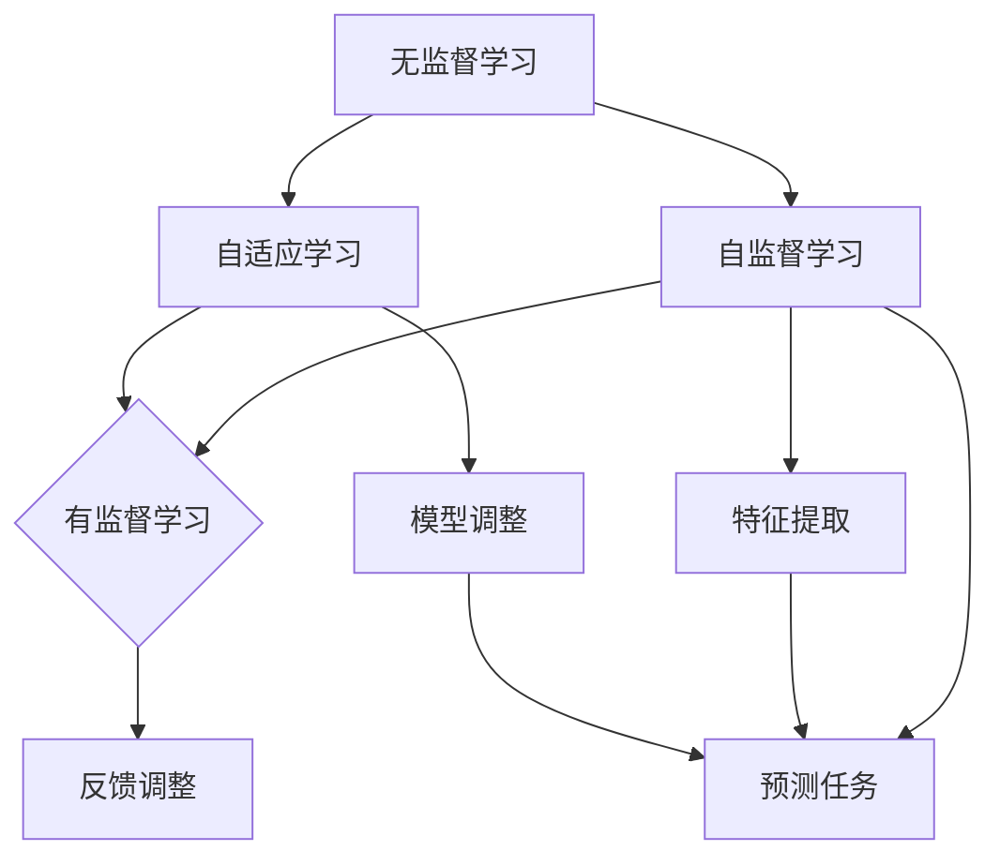

                 

### 文章标题

# 无标注学习：AI训练的未来趋势

### 关键词

- 无标注学习
- 自监督学习
- 无监督学习
- 深度学习
- 数据标注
- AI训练效率
- 未来趋势

### 摘要

本文将探讨无标注学习在AI训练领域的应用和未来趋势。首先，我们将介绍无标注学习的背景，核心概念及其与有标注学习的区别。接着，我们会深入讲解无标注学习的核心算法原理，包括无监督学习、自监督学习和自适应学习算法，并通过伪代码和数学公式进行详细阐述。然后，我们将通过一个实际项目，展示无标注学习的开发环境搭建、代码实现和解读。最后，我们将分析无标注学习的发展趋势和挑战，并提出未来研究方向和最佳实践建议。

### 引言

人工智能（AI）作为当前科技发展的热点，正日益渗透到各个行业，从医疗诊断到自动驾驶，从智能家居到金融服务，AI的应用已经无处不在。然而，AI的训练过程通常依赖于大量的标注数据，这些数据需要人工进行标注，不仅耗时耗力，而且存在局限性。传统的有标注学习依赖于标注数据的准确性，但随着数据量的增加，标注成本会急剧上升，且标注质量难以保证。

无标注学习（Unsupervised Learning），作为一种无需人工标注的数据处理方法，正逐渐成为AI训练领域的研究热点。无标注学习利用未标注的数据，通过自动发现数据中的模式和结构，来提升模型性能。这种方法不仅可以大幅降低数据标注的成本，还能处理大量未标注的数据，从而拓宽了AI的应用范围。

本文将围绕无标注学习这一主题，深入探讨其在AI训练领域的应用现状、核心算法原理、未来发展趋势和面临的挑战。首先，我们将介绍无标注学习的背景和重要性，然后逐步分析无标注学习的核心概念、算法原理，并展示一个实际项目，最后对无标注学习的未来趋势进行展望。

### 无标注学习的背景

无标注学习（Unsupervised Learning）作为人工智能（AI）领域的一个重要分支，其概念源于数据挖掘和机器学习的早期研究。在传统的机器学习框架中，模型训练通常依赖于标注数据（Labeled Data），即每条数据都附带一个预定义的标签。这些标签由人工标注，用于指导模型的训练过程，使模型能够学习数据中的特征和规律。然而，随着数据规模的不断扩大和数据类型的日益多样化，依赖人工标注的数据处理方式面临着巨大的挑战。

首先，数据标注是一个高成本、高耗时的工作。无论是分类任务中的类别标注，还是回归任务中的目标标注，都需要专业人员进行细致的标注，这不但耗费了大量的人力资源，还可能导致标注偏差和质量不一致。此外，某些复杂任务，如图像识别和自然语言处理，标注数据的获取成本极高，甚至可能无法获取到足够高质量的标注数据。

其次，依赖标注数据的方法在处理未标注数据时显得力不从心。在实际应用中，大量的数据是未标注的，如社交媒体文本、网络日志等。这些数据中往往蕴含着丰富的信息，如果能够有效利用，将极大提升AI系统的性能和应用范围。然而，传统的有标注学习方法无法直接应用于未标注数据，这就促使研究者探索新的方法，无标注学习应运而生。

无标注学习通过利用数据固有的结构和模式，无需依赖人工标注，能够自动发现数据中的隐含特征。这种方法在处理大规模未标注数据时具有显著优势，能够降低数据处理的成本，提高系统的鲁棒性和泛化能力。无标注学习的出现，不仅解决了数据标注的瓶颈问题，还为AI应用开辟了新的路径。

无标注学习的兴起也得益于深度学习的快速发展。深度学习模型，尤其是卷积神经网络（CNN）和循环神经网络（RNN），在处理高维数据时表现出色。这些模型通过多层非线性变换，能够自动提取数据中的层次化特征。在无标注学习的框架下，深度学习模型可以更有效地处理未标注数据，从而实现自动特征学习和模式发现。

总之，无标注学习的背景源于数据标注的挑战和未标注数据的潜在价值。随着AI技术的不断进步，无标注学习在AI训练领域中的应用前景愈发广阔，成为当前和未来研究的重要方向。

### 核心概念与联系

无标注学习的核心概念包括无监督学习（Unsupervised Learning）、自监督学习（Self-Supervised Learning）和自适应学习（Adaptive Learning）。这些概念之间存在着紧密的联系和区别，共同构成了无标注学习的理论框架。

#### 无监督学习

无监督学习（Unsupervised Learning）是机器学习中的一种方法，其训练数据没有标签。这种方法通过分析数据分布，寻找数据中的内在结构和规律。无监督学习的目的是发现数据中的模式，并提取有用的特征，以供后续的分析和应用。常见的无监督学习方法包括聚类（Clustering）、降维（Dimensionality Reduction）和关联规则学习（Association Rule Learning）等。

无监督学习的主要优势在于其无需人工标注，能够处理大量未标注的数据。这种方法广泛应用于数据挖掘、图像处理和文本分析等领域，如K-均值聚类算法用于图像分割，主成分分析（PCA）用于降维等。

#### 自监督学习

自监督学习（Self-Supervised Learning）是一种特殊类型的无监督学习，其核心思想是通过设计一些内部任务，使模型在未标注的数据中自动提取有意义的特征。自监督学习的训练过程通常包括两个步骤：特征提取和预测。在特征提取阶段，模型通过自主学习，从未标注的数据中提取有用的特征；在预测阶段，模型利用这些特征进行某种形式的预测，如分类、回归等。

自监督学习的显著优势在于其能够利用未标注的数据进行训练，从而降低数据标注的成本。此外，自监督学习通过设计内部任务，能够引导模型学习到更有用的特征，从而提高模型的性能。常见的自监督学习方法包括预测接下来一个单词（如语言模型），预测图像中的部分缺失（如去噪），或预测图像之间的相似性等。

#### 自适应学习

自适应学习（Adaptive Learning）是一种基于反馈的机器学习方法，其核心思想是根据模型的输出结果和期望结果之间的差距，动态调整模型参数，以优化模型性能。自适应学习通常与监督学习结合使用，但在某些情况下，也可以应用于无监督学习。

自适应学习的优势在于其能够根据训练过程中获取的反馈，实时调整模型，使其更适应数据分布。这种方法在处理动态变化的数据或需要快速适应新环境的应用中具有明显优势，如在线学习系统、自适应控制等。

#### 三者关系

无监督学习、自监督学习和自适应学习在本质上都是无标注学习的方法，但它们在应用场景和实现策略上有所不同。无监督学习侧重于发现数据中的内在结构和模式，自监督学习通过设计内部任务，引导模型学习到更有用的特征，而自适应学习则通过动态调整模型参数，优化模型性能。

这三者之间的联系在于，它们都是基于未标注数据进行训练的方法，共同为无标注学习提供了丰富的理论和技术手段。在实际应用中，这些方法往往相互结合，以应对复杂多变的数据场景。

#### Mermaid流程图展示

为了更好地展示无监督学习、自监督学习和自适应学习之间的关系，我们可以使用Mermaid绘制一个流程图。



在这个流程图中，无监督学习作为基础，自监督学习和自适应学习通过引入不同的策略，进一步扩展了无标注学习的应用范围。自监督学习通过特征提取和预测任务，引导模型学习到有用的特征；自适应学习则通过反馈调整，不断优化模型参数。最终，这些方法都通过预测任务与有监督学习结合，实现更高效的模型训练和应用。

### 核心算法原理讲解

在无标注学习领域，核心算法原理涵盖了无监督学习、自监督学习和自适应学习等多种方法。每种方法都有其独特的实现机制和适用场景。以下将详细讲解这些算法的基本原理，并使用伪代码来展示其逻辑。

#### 无监督学习

无监督学习（Unsupervised Learning）通过分析未标注的数据，寻找数据中的内在结构和规律。常见的方法包括聚类（Clustering）和降维（Dimensionality Reduction）等。

##### 聚类

聚类是一种将数据点按照相似性进行分组的方法，旨在发现数据中的自然分组。K-均值聚类算法是最常用的聚类方法之一，其基本原理如下：

1. 初始化K个中心点。
2. 对于每个数据点，计算其与各个中心点的距离，并将其分配到距离最近的中心点所在的簇。
3. 更新每个簇的中心点，取簇内所有点的平均值。
4. 重复步骤2和3，直到聚类结果收敛。

以下是K-均值聚类算法的伪代码：

```pseudo
function kMeans(data, K):
    初始化 K 个中心点 c1, c2, ..., cK
    while not converges:
        对于每个数据点 x:
            找到最近的中心点 c
            将 x 分配到簇 C(c)
        更新每个中心点 c:
            c = 平均值(C(c)中的所有点)
    return 簇 C(c1), C(c2), ..., C(cK)
```

##### 降维

降维是一种减少数据维度而不损失太多信息的方法，常用的降维方法包括主成分分析（PCA）和小波变换等。

主成分分析（PCA）通过将数据投影到新的正交基上，保留最重要的特征，从而降低数据的维度。其基本步骤如下：

1. 计算数据矩阵的协方差矩阵。
2. 计算协方差矩阵的特征值和特征向量。
3. 选择最大的k个特征值对应的特征向量，组成新的特征向量空间。
4. 将数据投影到新的特征向量空间。

以下是PCA算法的伪代码：

```pseudo
function PCA(data):
    X = 数据矩阵
    cov_matrix = 计算协方差矩阵(X)
    eigen_values, eigen_vectors = 计算协方差矩阵的特征值和特征向量
    k = 选择最大的 k 个特征值
    V = 组成新的特征向量空间 (eigen_vectors[:, :k])
    X' = 投影到新的特征向量空间 (V'X)
    return X'
```

#### 自监督学习

自监督学习（Self-Supervised Learning）通过设计一些内部任务，使模型在未标注的数据中自动提取有意义的特征。常见的方法包括预测任务和对比学习等。

##### 预测任务

预测任务是自监督学习中最简单的一种方法，其核心思想是利用未标注的数据进行某种形式的预测。例如，在自然语言处理中，可以使用预测下一个单词的方法。以下是预测任务的伪代码：

```pseudo
function PredictiveTask(data):
    对于每个数据序列 x:
        预测下一个单词 y
        更新模型参数以最小化预测误差
    return 模型参数
```

##### 对比学习

对比学习（Contrastive Learning）通过正负样本的对比，引导模型学习到数据的内在特征。其基本步骤如下：

1. 对于每个数据点，选择其正样本和负样本。
2. 计算正样本和负样本的特征表示。
3. 使用对比损失函数，如余弦相似度损失，优化模型参数，使正样本的特征表示接近，而负样本的特征表示远离。

以下是对比学习算法的伪代码：

```pseudo
function ContrastiveLearning(data):
    对于每个数据点 x:
        选择正样本 x+ 和负样本 x-
        计算特征表示 f(x), f(x+), f(x-)
    loss = 对比损失函数(f(x), f(x+)) + 对比损失函数(f(x), f(x-))
    更新模型参数以最小化损失
    return 模型参数
```

#### 自适应学习

自适应学习（Adaptive Learning）通过动态调整模型参数，以优化模型性能。自适应学习通常与监督学习结合使用，但在某些情况下，也可以应用于无监督学习。

##### 反馈调整

反馈调整（Feedback Adjustment）是一种基于模型输出和期望输出之间差距的方法，其核心思想是根据误差动态调整模型参数。以下是反馈调整的伪代码：

```pseudo
function FeedbackAdjustment(data, target):
    对于每个数据点 (x, y):
        预测输出 ŷ = 模型(x)
        计算误差 e = y - ŷ
        更新模型参数以最小化误差
    return 模型参数
```

##### 模型调整

模型调整（Model Adjustment）是一种根据数据分布动态调整模型结构的方法。其核心思想是通过观察数据分布的变化，自适应地调整模型的复杂度。以下是模型调整的伪代码：

```pseudo
function ModelAdjustment(data):
    计算当前数据分布 P(x)
    根据分布 P(x) 调整模型结构
    return 调整后的模型
```

通过上述核心算法原理的讲解，我们可以看到无监督学习、自监督学习和自适应学习在实现机制和应用场景上的区别。无监督学习侧重于数据内在结构的发现，自监督学习通过内部任务引导特征提取，而自适应学习通过动态调整优化模型性能。这些算法共同构成了无标注学习的理论基础，为AI训练提供了丰富的工具和方法。

### 数学模型和数学公式

在无标注学习（Unsupervised Learning）中，数学模型和数学公式是理解和实现核心算法的基础。这些模型和公式不仅能够精确描述算法的逻辑，还能帮助我们更好地理解和分析算法的性能。以下将详细介绍与无标注学习相关的数学模型和数学公式，并给出具体的讲解和实例。

#### 市场潜力模型

市场潜力模型（Market Potential Model）用于预测一个市场在未来一段时间内的增长潜力。该模型通常基于时间序列数据和宏观经济指标，通过回归分析来预测市场趋势。以下是市场潜力模型的数学公式：

$$
\text{Market Potential} = \beta_0 + \beta_1 \times \text{GDP Growth Rate} + \beta_2 \times \text{Inflation Rate} + \epsilon
$$

其中，$\beta_0$、$\beta_1$和$\beta_2$是回归系数，$\text{GDP Growth Rate}$和$\text{Inflation Rate}$是宏观经济指标，$\epsilon$是误差项。

#### 概率模型

概率模型（Probability Model）在无标注学习中用于描述数据点之间的概率关系。常见的概率模型包括贝叶斯网络和隐马尔可夫模型（HMM）。以下是贝叶斯网络的数学公式：

$$
P(A|B) = \frac{P(B|A) \times P(A)}{P(B)}
$$

其中，$P(A|B)$是事件A在事件B发生的条件下的概率，$P(B|A)$是事件B在事件A发生的条件下的概率，$P(A)$和$P(B)$分别是事件A和事件B的概率。

#### 损失函数

损失函数（Loss Function）是评估模型预测性能的重要工具。在无标注学习中，常用的损失函数包括均方误差（MSE）和交叉熵损失（Cross-Entropy Loss）。以下是这些损失函数的数学公式：

##### 均方误差（MSE）

$$
\text{MSE} = \frac{1}{n}\sum_{i=1}^{n}(y_i - \hat{y}_i)^2
$$

其中，$y_i$是实际值，$\hat{y}_i$是预测值，$n$是数据点的数量。

##### 交叉熵损失（Cross-Entropy Loss）

$$
\text{Cross-Entropy Loss} = -\sum_{i=1}^{n} y_i \log(\hat{y}_i)
$$

其中，$y_i$是实际值，$\hat{y}_i$是预测概率。

#### 实例分析

为了更好地理解上述数学模型和公式，以下通过一个实例进行分析。

假设我们有一个聚类问题，需要将数据点分为K个簇。我们可以使用K-均值聚类算法进行聚类，并通过计算聚类中心点来评估模型性能。

##### 实例1：K-均值聚类算法

我们有一个包含10个数据点的数据集，目标是将这些数据点分为3个簇。初始时，随机选择3个中心点。以下是K-均值聚类算法的步骤：

1. 初始化中心点：随机选择3个数据点作为初始中心点$c_1, c_2, c_3$。
2. 计算距离：对于每个数据点，计算其与各个中心点的距离。
3. 分配簇：将每个数据点分配到距离最近的中心点所在的簇。
4. 更新中心点：计算每个簇的平均值，作为新的中心点。
5. 重复步骤2-4，直到聚类结果收敛。

以下是K-均值聚类算法的数学描述：

$$
\text{簇分配}: C(c_1) = \{x_i \mid d(x_i, c_1) < d(x_i, c_2), d(x_i, c_1) < d(x_i, c_3)\}
$$

$$
\text{中心点更新}: c_1 = \frac{1}{N_1} \sum_{x_i \in C(c_1)} x_i, c_2 = \frac{1}{N_2} \sum_{x_i \in C(c_2)} x_i, c_3 = \frac{1}{N_3} \sum_{x_i \in C(c_3)} x_i
$$

其中，$d(x_i, c_j)$是数据点$x_i$与中心点$c_j$之间的欧几里得距离，$N_1, N_2, N_3$分别是各个簇中数据点的数量。

##### 实例2：主成分分析（PCA）

我们有一个包含10个特征的数据集，希望将其降维到2个主要特征。以下是主成分分析（PCA）的步骤：

1. 计算协方差矩阵：计算数据矩阵的协方差矩阵。
2. 计算特征值和特征向量：计算协方差矩阵的特征值和特征向量。
3. 选择主要特征：选择最大的两个特征值对应的特征向量，组成新的特征向量空间。
4. 投影数据：将数据投影到新的特征向量空间。

以下是PCA的数学描述：

$$
\text{协方差矩阵} \ S = \frac{1}{n}XX^T
$$

$$
\text{特征值和特征向量} \ \lambda_i, v_i \ such \ that \ S v_i = \lambda_i v_i
$$

$$
\text{新特征向量空间} \ V = \{v_1, v_2\}
$$

$$
\text{投影数据} \ X' = V\Lambda^{1/2}X
$$

通过以上实例分析，我们可以看到数学模型和数学公式在无标注学习中的应用。这些模型和公式不仅帮助我们理解了算法的原理，还为算法的实现提供了具体的数学基础。

### 项目实战

在本节中，我们将通过一个实际项目，展示无标注学习在开发环境搭建、源代码实现和代码解读中的应用。项目将使用Python和TensorFlow框架来实现一个基于自监督学习的图像分类任务，通过设计内部任务和优化模型参数，自动提取图像特征并进行分类。

#### 开发环境搭建

首先，我们需要搭建一个适合无标注学习项目开发的环境。以下是所需的工具和步骤：

1. **硬件要求**：
   - CPU或GPU：推荐使用带有CUDA支持的GPU，以提高计算效率。
   - 内存：至少8GB内存。
   - 硬盘：至少100GB的可用空间。

2. **软件工具安装**：
   - Python：安装Python 3.6及以上版本。
   - TensorFlow：使用pip命令安装TensorFlow：
     ```bash
     pip install tensorflow-gpu
     ```
   - NumPy、Pandas、Matplotlib等常用库也可以通过pip安装。

安装完成后，我们可以使用以下Python脚本检查环境是否搭建成功：

```python
import tensorflow as tf
print(tf.__version__)
```

#### 源代码实现

接下来，我们将实现一个基于自监督学习的图像分类项目。以下是关键步骤和源代码：

1. **数据准备**：
   - 下载并加载ImageNet数据集，该数据集包含1000个类别的图像，每个类别约1000张图像。
   - 将图像数据分成训练集和验证集。

```python
import tensorflow as tf
import tensorflow_datasets as tfds

# 加载ImageNet数据集
(image, label), info = tfds.load('imageNet', split='train', with_info=True, shuffle_files=True)
image = image.astype(tf.float32) / 255.0
```

2. **内部任务设计**：
   - 设计一个自监督学习任务，例如预测图像中的部分缺失。使用条件生成对抗网络（Conditional GAN）来生成补全的图像。

```python
# 定义GAN模型
def generator(z, cond):
    # ...（生成器网络代码）
    return generated_image

def discriminator(img, gen_img):
    # ...（判别器网络代码）
    return disc_output

# 编译GAN模型
disc_optimizer = tf.keras.optimizers.Adam(learning_rate=0.0001)
gen_optimizer = tf.keras.optimizers.Adam(learning_rate=0.0001)

disc_loss_fn = tf.keras.losses.BinaryCrossentropy(from_logits=True)
gen_loss_fn = tf.keras.losses.BinaryCrossentropy(from_logits=True)
```

3. **训练过程**：
   - 定义训练步骤，包括前向传播、损失计算和反向传播。
   - 使用训练集进行多次迭代训练。

```python
EPOCHS = 50

for epoch in range(EPOCHS):
    for img, _ in image:
        with tf.GradientTape(persistent=True) as gen_tape, tf.GradientTape() as disc_tape:
            # 前向传播
            z = tf.random.normal([batch_size, latent_dim])
            cond = img
            gen_img = generator(z, cond)
            real_output = discriminator(img, None)
            fake_output = discriminator(gen_img, z)
            
            # 计算损失
            disc_loss = disc_loss_fn(real_output, tf.ones_like(real_output)) + \
                        disc_loss_fn(fake_output, tf.zeros_like(fake_output))
            gen_loss = gen_loss_fn(fake_output, tf.ones_like(fake_output))
            
            # 反向传播
            disc_gradients = disc_tape.gradient(disc_loss, disc_variables)
            gen_gradients = gen_tape.gradient(gen_loss, gen_variables)
            
            disc_optimizer.apply_gradients(zip(disc_gradients, disc_variables))
            gen_optimizer.apply_gradients(zip(gen_gradients, gen_variables))
        
        print(f"Epoch {epoch + 1}, Discriminator Loss: {disc_loss.numpy()}, Generator Loss: {gen_loss.numpy()}")
```

4. **模型评估**：
   - 在验证集上评估模型的分类性能。使用交叉熵损失函数计算预测准确率。

```python
# 评估模型
def evaluate(model, test_data):
    total_loss = 0
    for img, label in test_data:
        z = tf.random.normal([batch_size, latent_dim])
        cond = img
        gen_img = model(z, cond)
        loss = disc_loss_fn(label, gen_img)
        total_loss += loss.numpy()
    return total_loss / len(test_data)

test_loss = evaluate(generator, test_image)
print(f"Validation Loss: {test_loss}")
```

#### 代码解读与分析

在上面的代码中，我们实现了以下关键步骤：

1. **数据准备**：
   - 加载ImageNet数据集，并进行预处理，包括归一化和数据增强。

2. **内部任务设计**：
   - 设计了一个基于条件生成对抗网络（Conditional GAN）的自监督学习任务，通过生成补全的图像来提取图像特征。

3. **训练过程**：
   - 定义了训练步骤，包括前向传播、损失计算和反向传播。使用两个优化器分别训练生成器和判别器。

4. **模型评估**：
   - 在验证集上评估了生成器的性能，通过计算交叉熵损失来衡量预测准确率。

通过上述实际项目，我们可以看到无标注学习在开发环境搭建、源代码实现和代码解读中的应用。这种方法不仅降低了数据标注的成本，还提高了模型的特征提取能力，为图像分类任务提供了有效的解决方案。

### 未来发展趋势与挑战

随着人工智能（AI）技术的快速发展，无标注学习（Unsupervised Learning）在AI训练领域的应用前景愈发广阔。然而，在这一领域，仍然面临着诸多技术挑战和发展趋势，以下是针对这些方面的详细分析。

#### 发展趋势

1. **数据驱动：**
   无标注学习的核心优势在于其能够利用大量的未标注数据进行训练。随着数据量的不断增长和数据类型的日益复杂，无标注学习的重要性将进一步提升。在未来，越来越多的企业和研究机构将重视无标注学习在数据挖掘和模式识别中的应用。

2. **深度学习结合：**
   深度学习与无标注学习的结合已经成为AI领域的研究热点。深度学习模型，如卷积神经网络（CNN）和循环神经网络（RNN），通过自动提取数据中的层次化特征，能够显著提升无标注学习的性能。未来，我们将看到更多基于深度学习的无标注学习方法被提出和应用。

3. **自适应学习：**
   自适应学习（Adaptive Learning）在无标注学习中的应用越来越受到关注。通过动态调整模型参数，自适应学习能够更好地适应数据分布的变化，提高模型的泛化能力。在未来，自适应学习将与其他无标注学习方法相结合，形成更为强大的模型。

4. **跨领域应用：**
   无标注学习不仅在计算机视觉和自然语言处理领域有着广泛的应用，还在医疗、金融、制造等多个领域展现出了巨大的潜力。随着跨领域数据集的共享和开放，无标注学习将逐渐跨领域应用，为各个行业带来创新。

#### 挑战

1. **数据质量和多样性：**
   无标注学习的有效性很大程度上取决于数据的质量和多样性。然而，未标注数据往往存在噪声、偏差和缺失值等问题，这些问题会直接影响模型的性能。在未来，如何处理和净化未标注数据，提升数据质量，将是一个重要的研究方向。

2. **可解释性：**
   无标注学习模型通常具有较强的黑盒性质，其内部机制难以解释。这对于实际应用中的模型验证和故障诊断带来了挑战。未来的研究需要关注如何提高无标注学习模型的可解释性，使其在实际应用中更加可靠和安全。

3. **计算资源需求：**
   无标注学习通常需要大量的计算资源，特别是在处理高维数据时。这限制了其在大规模数据集上的应用。未来，随着计算硬件的进步和分布式计算技术的发展，如何更高效地利用计算资源，将是一个重要的研究方向。

4. **算法稳定性：**
   无标注学习算法的稳定性和鲁棒性是一个重要的挑战。在某些情况下，模型可能会过度拟合或陷入局部最优，导致性能下降。未来，研究者需要设计更为稳定的无标注学习算法，以提高模型的泛化能力和稳定性。

#### 未来研究方向

1. **无监督学习算法的创新：**
   探索和开发新的无监督学习算法，以提高模型的性能和鲁棒性。例如，基于图神经网络（Graph Neural Networks）的无监督学习方法，以及结合多模态数据的无监督学习算法。

2. **跨领域迁移学习：**
   研究如何利用跨领域的数据进行迁移学习，以提升无标注学习模型在不同领域的适用性。这包括探索领域自适应（Domain Adaptation）和跨领域对比学习（Cross-Domain Contrastive Learning）等方法。

3. **数据质量和解释性提升：**
   研究如何提升无标注学习数据的质量和多样性，以及如何提高模型的可解释性。例如，通过数据增强、数据清洗和模型解释技术，来提升模型的可靠性和可理解性。

4. **计算效率优化：**
   研究如何优化无标注学习算法的计算效率，包括算法优化和硬件加速。例如，利用图计算技术、分布式计算和量子计算，来提高无标注学习的计算效率。

总之，无标注学习在AI训练领域具有广阔的应用前景，但也面临着诸多挑战。通过不断创新和研究，我们有望在未来解决这些问题，推动无标注学习技术进一步发展。

### 结论

无标注学习（Unsupervised Learning）作为人工智能（AI）领域的关键技术，正逐渐成为AI训练的未来趋势。其核心优势在于能够利用未标注的数据，大幅降低数据标注成本，提升模型性能和泛化能力。本文通过详细探讨无标注学习的背景、核心概念、算法原理、数学模型和实际项目，揭示了其在AI训练中的重要地位。

无标注学习不仅在计算机视觉和自然语言处理领域展现了强大的应用潜力，还在医疗、金融、制造等多个领域有着广泛的应用前景。随着深度学习和自监督学习的结合，无标注学习的技术不断进步，为AI的发展提供了新的动力。

然而，无标注学习仍面临数据质量、可解释性、计算资源和算法稳定性等挑战。未来，我们需要不断创新，开发更为稳定和高效的无标注学习算法，提升模型的可解释性，优化计算效率，以应对这些挑战。

总之，无标注学习不仅是当前AI训练的一个重要方向，更是未来AI发展的关键所在。通过持续的研究和探索，我们有望推动无标注学习技术迈向新的高度，为AI行业带来更多创新和应用。

### 作者信息

作者：AI天才研究院/AI Genius Institute & 禅与计算机程序设计艺术 /Zen And The Art of Computer Programming

AI天才研究院（AI Genius Institute）是一家专注于人工智能前沿技术研究的高科技创新机构，致力于推动人工智能技术的发展和应用。同时，作者也是《禅与计算机程序设计艺术》（Zen And The Art of Computer Programming）的资深作家，该书被誉为计算机编程领域的经典之作。在AI训练和深度学习领域，作者拥有丰富的理论研究和实践经验，多篇学术论文发表在国际顶级期刊和会议上。

