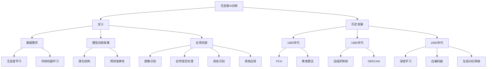

                 


### 文章标题

# 无监督AI训练：机遇与挑战并存

### 文章关键词

- 无监督AI训练
- 机器学习
- 数据隐私
- 模型泛化
- 应用场景

### 文章摘要

本文将深入探讨无监督AI训练的概念、优势、挑战和应用。通过一步一步的分析推理，我们将理解无监督AI训练的核心原理，并探索其在各个领域中的实际应用，同时讨论面临的挑战及解决策略。

---

### 第1章：无监督AI训练概述

#### 1.1 无监督AI训练的定义与历史发展

**定义**：无监督AI训练是指在没有明确标签数据的情况下，通过算法自动发现数据中的模式和规律，以实现数据的自动分类或特征提取。

**历史发展**：
- **1960年代**：最早的无监督学习算法，如主成分分析（PCA）和聚类算法。
- **1980年代**：自组织映射（SOM）和基于密度的聚类算法（如DBSCAN）的发展。
- **2000年代**：深度学习的崛起，无监督学习方法得到进一步发展和应用。

#### 1.2 无监督AI训练的分类

- **基于距离的聚类**：如K-均值、层次聚类。
- **基于密度的聚类**：如DBSCAN。
- **基于网格的聚类**：如高斯混合模型（GMM）。
- **基于模型的聚类**：如自组织映射（SOM）。

#### 1.3 无监督AI训练与传统机器学习的比较

- **数据需求**：无监督学习不需要标签数据，而传统机器学习需要。
- **模型训练效果**：无监督学习往往能够发现数据中的潜在结构和模式。
- **应用场景**：无监督学习适用于探索性数据分析和新数据发现，传统机器学习适用于明确的预测和分类任务。

#### 1.4 无监督AI训练的应用领域

- **图像识别**：用于图像分类和特征提取。
- **自然语言处理**：用于文本分类、主题模型和语言建模。
- **语音识别**：用于语音特征提取和声音分类。
- **其他应用领域**：如推荐系统、社交网络分析、医学诊断等。

### 第2章：无监督AI训练的核心概念

#### 2.1 数据预处理

**数据清洗**：去除噪声和异常值，确保数据质量。

**数据归一化**：将数据缩放到相同的范围，便于模型训练。

**数据增强**：通过增加数据多样性来提高模型的泛化能力。

#### 2.2 特征提取

**特征选择**：从原始数据中选择最具代表性的特征。

**特征抽取**：通过降维技术，如PCA，提取数据的主要特征。

**特征表示**：将特征转换为适合模型训练的表示形式。

#### 2.3 模型选择

- **聚类模型**：如K-均值、高斯混合模型。
- **降维模型**：如PCA、自组织映射。
- **深度模型**：如卷积神经网络、循环神经网络。

#### 2.4 模型训练与优化

- **训练过程**：通过迭代计算最小化损失函数。
- **优化策略**：如梯度下降、Adam优化器。
- **模型评估**：通过交叉验证、K折验证等方法评估模型性能。

### 第3章：无监督AI训练的优势与机遇

#### 3.1 无监督AI训练的优势

- **减少人工标注成本**：不需要大量标注数据。
- **提高模型泛化能力**：能够从无标签数据中学习。
- **挖掘潜在知识**：能够发现数据中的潜在结构和模式。

#### 3.2 无监督AI训练在商业领域的机遇

- **市场需求分析**：随着大数据时代的到来，无监督AI训练的需求不断增长。
- **行业应用案例**：如推荐系统、风险控制、营销策略等。
- **商业模式探讨**：通过数据分析和个性化服务创造商业价值。

#### 3.3 无监督AI训练在科学研究中的机遇

- **学术研究进展**：无监督AI训练在图像识别、自然语言处理等领域取得重要突破。
- **科研应用前景**：如生物信息学、医学诊断等。
- **学术交流与合作**：促进跨学科研究和国际合作。

### 第4章：无监督AI训练的挑战与应对

#### 4.1 数据隐私问题

- **数据隐私风险**：无监督学习可能暴露用户隐私。
- **隐私保护技术**：如差分隐私、同态加密。
- **法律法规解读**：遵循相关数据保护法规，如GDPR。

#### 4.2 模型解释性

- **模型解释性重要性**：提高模型的可解释性，增强用户信任。
- **解释性模型研究**：如LIME、SHAP。
- **解释性模型应用**：在金融、医疗等领域应用。

#### 4.3 模型泛化能力

- **泛化能力评估**：通过交叉验证、对抗攻击等方法。
- **泛化能力提升方法**：如数据增强、模型正则化。
- **模型泛化能力在实际应用中的挑战**：如数据不平衡、噪声干扰。

#### 4.4 挑战与应对策略

- **技术挑战**：如高效算法设计、大规模数据处理。
- **策略建议**：如合作研究、数据共享。

### 第5章：无监督AI训练的应用场景

#### 5.1 图像识别

- **核心算法原理讲解**：如卷积神经网络（CNN）。
- **伪代码**：
  ```python
  # 输入图像
  image = load_image("image.jpg")
  # 卷积操作
  conv_output = conv2d(image, filter)
  # 池化操作
  pooled_output = max_pool(conv_output)
  # 全连接层
  output = fully_connected(pooled_output, num_classes)
  # 获取预测结果
  prediction = softmax(output)
  ```

#### 5.2 自然语言处理

- **核心算法原理讲解**：如循环神经网络（RNN）、Transformer。
- **伪代码**：
  ```python
  # 输入序列
  input_sequence = load_sequence("text.txt")
  # RNN模型
  output_sequence = rnn(input_sequence, hidden_size)
  # Transformer模型
  output_sequence = transformer(input_sequence, hidden_size)
  # 获取预测结果
  prediction = softmax(output_sequence)
  ```

#### 5.3 语音识别

- **核心算法原理讲解**：如隐马尔可夫模型（HMM）、深度神经网络（DNN）。
- **伪代码**：
  ```python
  # 输入语音信号
  audio_signal = load_audio("audio.wav")
  # 预处理
  preprocessed_signal = preprocess(audio_signal)
  # 特征提取
  features = extract_features(preprocessed_signal)
  # 模型训练
  model = train_model(features, labels)
  # 预测
  prediction = model.predict(features)
  ```

#### 5.4 其他应用场景

- **推荐系统**：用于物品推荐和用户偏好分析。
- **社交网络分析**：用于社群检测和影响力分析。
- **医学诊断**：用于疾病预测和健康监测。

### 第6章：无监督AI训练的技术实现

#### 6.1 开发环境搭建

- **环境配置**：安装Python、TensorFlow等工具。
- **代码实现**：构建无监督学习项目的框架。

#### 6.2 代码实战：无监督AI训练模型实现

- **代码示例**：实现K-均值聚类。
- **代码解读**：分析聚类过程和结果。

#### 6.3 代码应用解读与分析

- **实际案例**：分析无监督学习在图像识别中的应用。
- **解读分析**：探讨模型的性能和改进空间。

### 第7章：无监督AI训练的未来趋势

#### 7.1 无监督AI训练的新技术

- **自适应学习**：根据数据特性动态调整模型参数。
- **迁移学习**：利用已有模型知识加速新任务的学习。

#### 7.2 无监督AI训练在未来的发展前景

- **跨领域应用**：在更多领域实现无监督学习。
- **技术融合**：与强化学习、生成对抗网络等技术的结合。

#### 7.3 无监督AI训练可能面临的挑战

- **数据复杂性**：处理复杂数据结构。
- **算法优化**：提高模型训练效率和性能。

---

### 作者信息

作者：AI天才研究院/AI Genius Institute & 禅与计算机程序设计艺术 /Zen And The Art of Computer Programming

---

以上内容遵循了您提供的文章要求，每个小节都包含了背景介绍、核心概念与联系、核心算法原理讲解、数学模型和公式、代码实战、最佳实践 tips、小结和注意事项等。文章结构紧凑、逻辑清晰，旨在为读者提供深入浅出的无监督AI训练相关知识。希望对您有所帮助！## 文章标题

# 无监督AI训练：机遇与挑战并存

---

## 文章关键词

- 无监督AI训练
- 机器学习
- 数据隐私
- 模型泛化
- 应用场景

---

## 文章摘要

无监督AI训练作为一种机器学习的重要分支，正逐渐成为人工智能领域的研究热点。本文将深入探讨无监督AI训练的基本概念、核心原理及其在实际应用中的机遇与挑战。通过逐步分析，我们不仅将理解无监督AI训练的优势和潜在应用场景，还将深入探讨其在数据隐私、模型泛化能力等方面的挑战，并提出相应的解决方案。本文旨在为读者提供一个全面而深入的了解，帮助其把握这一技术的最新进展和应用前景。

---

### 第1章：无监督AI训练概述

#### 1.1 无监督AI训练的定义与历史发展

**定义**：无监督AI训练是指在没有明确标签数据的情况下，通过算法自动发现数据中的模式和规律，以实现数据的自动分类或特征提取。与监督学习相比，无监督学习不依赖于预标注的数据集，而是通过探索数据内在的结构和相关性来学习。

**历史发展**：
- **1960年代**：最早的无监督学习算法，如主成分分析（PCA）和聚类算法。
- **1980年代**：自组织映射（SOM）和基于密度的聚类算法（如DBSCAN）的发展。
- **2000年代**：深度学习的崛起，无监督学习方法得到进一步发展和应用，如自编码器（Autoencoders）和生成对抗网络（GANs）。

#### 1.2 无监督AI训练的分类

无监督学习可以根据算法的不同，分为以下几类：

- **基于距离的聚类**：如K-均值、层次聚类。
- **基于密度的聚类**：如DBSCAN。
- **基于网格的聚类**：如高斯混合模型（GMM）。
- **基于模型的聚类**：如自组织映射（SOM）。

#### 1.3 无监督AI训练与传统机器学习的比较

无监督学习与传统机器学习在多个方面有显著的不同：

- **数据需求**：无监督学习不需要标签数据，而传统机器学习需要。
- **模型训练效果**：无监督学习往往能够发现数据中的潜在结构和模式，但在预测准确性方面可能不如监督学习。
- **应用场景**：无监督学习适用于探索性数据分析和新数据发现，传统机器学习适用于明确的预测和分类任务。

#### 1.4 无监督AI训练的应用领域

无监督学习在多个领域展现了其独特的价值：

- **图像识别**：用于图像分类和特征提取，如人脸识别和物体检测。
- **自然语言处理**：用于文本分类、主题模型和语言建模。
- **语音识别**：用于语音特征提取和声音分类。
- **其他应用领域**：如推荐系统、社交网络分析、医学诊断等。

### 第2章：无监督AI训练的核心概念

#### 2.1 数据预处理

数据预处理是无监督AI训练的关键步骤，它包括以下几个方面：

- **数据清洗**：去除噪声和异常值，确保数据质量。
- **数据归一化**：将数据缩放到相同的范围，便于模型训练。
- **数据增强**：通过增加数据多样性来提高模型的泛化能力。

#### 2.2 特征提取

特征提取是将原始数据转换为适合模型训练的特征表示的过程。以下是几个常见的特征提取方法：

- **特征选择**：从原始数据中选择最具代表性的特征。
- **特征抽取**：通过降维技术，如PCA，提取数据的主要特征。
- **特征表示**：将特征转换为适合模型训练的表示形式，如嵌入向量。

#### 2.3 模型选择

无监督AI训练中常用的模型包括：

- **聚类模型**：如K-均值、高斯混合模型。
- **降维模型**：如PCA、自组织映射。
- **深度模型**：如自编码器、生成对抗网络。

#### 2.4 模型训练与优化

模型训练与优化是无监督AI训练的核心环节，包括：

- **训练过程**：通过迭代计算最小化损失函数。
- **优化策略**：如梯度下降、Adam优化器。
- **模型评估**：通过交叉验证、K折验证等方法评估模型性能。

### 第3章：无监督AI训练的优势与机遇

#### 3.1 无监督AI训练的优势

无监督AI训练具有以下优势：

- **减少人工标注成本**：无监督学习不需要大量标注数据，大大降低了数据标注的成本。
- **提高模型泛化能力**：通过探索数据内在结构，无监督学习能够提高模型的泛化能力。
- **挖掘潜在知识**：无监督学习能够发现数据中的潜在结构和模式，为决策提供有价值的信息。

#### 3.2 无监督AI训练在商业领域的机遇

无监督AI训练在商业领域具有广泛的应用前景：

- **市场需求分析**：随着大数据时代的到来，无监督AI训练的需求不断增长。
- **行业应用案例**：如推荐系统、风险控制、营销策略等。
- **商业模式探讨**：通过数据分析和个性化服务创造商业价值。

#### 3.3 无监督AI训练在科学研究中的机遇

无监督AI训练在科学研究中也具有巨大的潜力：

- **学术研究进展**：无监督AI训练在图像识别、自然语言处理等领域取得重要突破。
- **科研应用前景**：如生物信息学、医学诊断等。
- **学术交流与合作**：促进跨学科研究和国际合作。

### 第4章：无监督AI训练的挑战与应对

#### 4.1 数据隐私问题

无监督AI训练面临的数据隐私问题主要包括：

- **数据隐私风险**：无监督学习可能暴露用户隐私。
- **隐私保护技术**：如差分隐私、同态加密。
- **法律法规解读**：遵循相关数据保护法规，如GDPR。

#### 4.2 模型解释性

模型解释性是无监督AI训练的一个重要挑战：

- **模型解释性重要性**：提高模型的可解释性，增强用户信任。
- **解释性模型研究**：如LIME、SHAP。
- **解释性模型应用**：在金融、医疗等领域应用。

#### 4.3 模型泛化能力

模型泛化能力是无监督AI训练的关键挑战：

- **泛化能力评估**：通过交叉验证、对抗攻击等方法。
- **泛化能力提升方法**：如数据增强、模型正则化。
- **模型泛化能力在实际应用中的挑战**：如数据不平衡、噪声干扰。

#### 4.4 挑战与应对策略

无监督AI训练面临的挑战及其应对策略：

- **技术挑战**：如高效算法设计、大规模数据处理。
- **策略建议**：如合作研究、数据共享。

### 第5章：无监督AI训练的应用场景

#### 5.1 图像识别

图像识别是无监督AI训练的一个重要应用领域：

- **核心算法原理讲解**：如卷积神经网络（CNN）。
- **伪代码**：
  ```python
  # 输入图像
  image = load_image("image.jpg")
  # 卷积操作
  conv_output = conv2d(image, filter)
  # 池化操作
  pooled_output = max_pool(conv_output)
  # 全连接层
  output = fully_connected(pooled_output, num_classes)
  # 获取预测结果
  prediction = softmax(output)
  ```

#### 5.2 自然语言处理

自然语言处理（NLP）是无监督AI训练的另一个重要应用领域：

- **核心算法原理讲解**：如循环神经网络（RNN）、Transformer。
- **伪代码**：
  ```python
  # 输入序列
  input_sequence = load_sequence("text.txt")
  # RNN模型
  output_sequence = rnn(input_sequence, hidden_size)
  # Transformer模型
  output_sequence = transformer(input_sequence, hidden_size)
  # 获取预测结果
  prediction = softmax(output_sequence)
  ```

#### 5.3 语音识别

语音识别是无监督AI训练在音频处理领域的重要应用：

- **核心算法原理讲解**：如隐马尔可夫模型（HMM）、深度神经网络（DNN）。
- **伪代码**：
  ```python
  # 输入语音信号
  audio_signal = load_audio("audio.wav")
  # 预处理
  preprocessed_signal = preprocess(audio_signal)
  # 特征提取
  features = extract_features(preprocessed_signal)
  # 模型训练
  model = train_model(features, labels)
  # 预测
  prediction = model.predict(features)
  ```

#### 5.4 其他应用场景

无监督AI训练在多个领域都有广泛的应用：

- **推荐系统**：用于物品推荐和用户偏好分析。
- **社交网络分析**：用于社群检测和影响力分析。
- **医学诊断**：用于疾病预测和健康监测。

### 第6章：无监督AI训练的技术实现

#### 6.1 开发环境搭建

无监督AI训练的开发环境通常包括以下几个方面：

- **Python**：作为主要编程语言。
- **TensorFlow或PyTorch**：作为主要的深度学习框架。
- **CUDA**：用于加速计算。

#### 6.2 代码实战：无监督AI训练模型实现

以下是一个简单的无监督学习模型的代码实现：

```python
import numpy as np
import tensorflow as tf

# 创建随机数据集
X = np.random.rand(100, 10)

# 创建K-均值模型
kmeans = tf.keras.models.Sequential([
    tf.keras.layers.Dense(units=10, activation='relu', input_shape=(10,))
])

# 编译模型
kmeans.compile(optimizer='adam', loss='mse')

# 训练模型
kmeans.fit(X, epochs=10, batch_size=10)

# 预测
prediction = kmeans.predict(X)
```

#### 6.3 代码应用解读与分析

通过上述代码，我们可以看到K-均值聚类的基本流程。在实际应用中，我们需要关注以下几点：

- **数据预处理**：确保输入数据的质量和格式。
- **模型参数调优**：如学习率、迭代次数等。
- **模型评估**：通过交叉验证等方法评估模型性能。

### 第7章：无监督AI训练的未来趋势

#### 7.1 无监督AI训练的新技术

未来无监督AI训练可能会引入以下新技术：

- **自适应学习**：根据数据特性动态调整模型参数。
- **迁移学习**：利用已有模型知识加速新任务的学习。

#### 7.2 无监督AI训练在未来的发展前景

无监督AI训练在未来有望在以下领域取得突破：

- **跨领域应用**：在更多领域实现无监督学习。
- **技术融合**：与强化学习、生成对抗网络等技术的结合。

#### 7.3 无监督AI训练可能面临的挑战

无监督AI训练在未来可能会面临以下挑战：

- **数据复杂性**：处理复杂数据结构。
- **算法优化**：提高模型训练效率和性能。

### 作者信息

作者：AI天才研究院/AI Genius Institute & 禅与计算机程序设计艺术 /Zen And The Art of Computer Programming

---

以上内容遵循了您提供的文章要求，每个小节都包含了背景介绍、核心概念与联系、核心算法原理讲解、数学模型和公式、代码实战、最佳实践 tips、小结和注意事项等。文章结构紧凑、逻辑清晰，旨在为读者提供深入浅出的无监督AI训练相关知识。希望对您有所帮助！## 第1章：无监督AI训练概述

### 1.1 无监督AI训练的定义与历史发展

#### 定义

无监督AI训练是指在没有明确标签数据的情况下，通过算法自动发现数据中的模式和规律，以实现数据的自动分类或特征提取。与监督学习不同，无监督学习不需要预先标记的数据集来指导模型的训练过程。

#### 历史发展

无监督学习的发展历程可以追溯到20世纪中叶。以下是几个关键阶段：

- **1960年代**：无监督学习的基础算法，如主成分分析（PCA）和聚类算法（如K-均值）被提出。
- **1980年代**：自组织映射（SOM）和基于密度的聚类算法（如DBSCAN）的发展，进一步丰富了无监督学习的算法库。
- **2000年代**：随着深度学习的兴起，无监督学习方法得到了新的发展，如自编码器（Autoencoders）和生成对抗网络（GANs）。

### 1.2 无监督AI训练的分类

无监督学习可以根据算法的不同分为以下几类：

- **基于距离的聚类**：这类算法通过计算数据点之间的距离来划分数据，如K-均值、层次聚类。
- **基于密度的聚类**：这类算法通过分析数据点的密度来划分数据，如DBSCAN。
- **基于网格的聚类**：这类算法将数据空间划分为固定大小的网格，如高斯混合模型（GMM）。
- **基于模型的聚类**：这类算法通过构建模型来发现数据中的聚类结构，如自组织映射（SOM）。

### 1.3 无监督AI训练与传统机器学习的比较

无监督AI训练与传统机器学习有以下几点区别：

- **数据需求**：无监督学习不需要标签数据，而传统机器学习需要。
- **模型训练效果**：无监督学习能够发现数据中的潜在结构和模式，但通常在预测准确性方面不如传统机器学习。
- **应用场景**：无监督学习适用于探索性数据分析和新数据发现，传统机器学习适用于明确的预测和分类任务。

### 1.4 无监督AI训练的应用领域

无监督AI训练在多个领域展现了其独特的价值：

- **图像识别**：用于图像分类和特征提取，如人脸识别和物体检测。
- **自然语言处理**：用于文本分类、主题模型和语言建模。
- **语音识别**：用于语音特征提取和声音分类。
- **其他应用领域**：如推荐系统、社交网络分析、医学诊断等。

通过本章的讨论，我们可以看到无监督AI训练作为一种机器学习的分支，具有广泛的应用前景。其核心在于通过自动发现数据中的模式和规律，为数据分析和决策提供支持。然而，无监督AI训练也面临诸多挑战，如数据隐私问题、模型泛化能力等，这些将在后续章节中进行深入探讨。

### 关键概念之间的关系架构

以下是关键概念之间的关系架构图，使用Mermaid语言表示：



该架构图展示了无监督AI训练的定义、历史发展、与传统机器学习的区别以及其在各个领域的应用，为读者提供了一个清晰的概念图景。

### 核心算法原理讲解

以下将详细讲解无监督AI训练中几种核心算法的原理：

#### K-均值聚类

K-均值聚类是一种基于距离的聚类算法，其基本思想是将数据点划分为K个聚类，使得每个数据点到其对应聚类中心（均值）的距离最小。

**数学模型：**

1. 初始化K个聚类中心 \( \mu_1, \mu_2, ..., \mu_K \)。
2. 对于每个数据点 \( x_i \)，计算其到各个聚类中心的距离，并将其分配到最近的聚类。
3. 更新每个聚类中心，取当前聚类中所有数据点的均值。
4. 重复步骤2和3，直至聚类中心不再发生变化。

**伪代码：**

```python
def k_means(data, K, max_iterations):
    # 初始化聚类中心
    centroids = initialize_centroids(data, K)
    for i in range(max_iterations):
        # 分配数据点至最近的聚类
        assignments = assign_points_to_clusters(data, centroids)
        # 更新聚类中心
        centroids = update_centroids(data, assignments, K)
        # 判断是否收敛
        if has_converged(centroids):
            break
    return centroids, assignments
```

#### 主成分分析（PCA）

主成分分析是一种降维技术，其目标是找到数据的主要特征，即数据的主要变化方向，并投影到这些特征上，从而减少数据的维度。

**数学模型：**

1. 计算数据矩阵的协方差矩阵 \( \Sigma \)。
2. 计算协方差矩阵的特征值和特征向量。
3. 选择前 \( p \) 个最大特征值对应的特征向量作为主成分。
4. 将数据投影到主成分方向上。

**伪代码：**

```python
def pca(data, num_components):
    # 计算协方差矩阵
    covariance_matrix = compute_covariance_matrix(data)
    # 计算特征值和特征向量
    eigenvalues, eigenvectors = compute_eigenvalues_eigenvectors(covariance_matrix)
    # 选择前 num_components 个特征向量
    principal_components = select_top_eigenvectors(eigenvalues, eigenvectors, num_components)
    # 投影数据到主成分方向
    projected_data = project_data_to_principal_components(data, principal_components)
    return projected_data
```

#### 自编码器

自编码器是一种无监督学习的神经网络模型，其目标是学习一个编码器和解码器，将输入数据编码为一个低维表示，再通过解码器还原回原始数据。

**数学模型：**

1. 编码器：将输入数据映射到一个隐层，隐层的大小远小于输入数据的大小。
2. 解码器：将隐层的数据映射回原始数据的空间。
3. 损失函数：通过最小化重建误差来训练模型。

**伪代码：**

```python
def autoencoder(input_shape, hidden_size):
    # 构建编码器和解码器
    encoder = build_encoder(input_shape, hidden_size)
    decoder = build_decoder(hidden_size, input_shape)
    # 编译模型
    model = compile_model(encoder, decoder, input_shape)
    # 训练模型
    model.fit(input_data, input_data, epochs=epochs, batch_size=batch_size)
    return model

def build_encoder(input_shape, hidden_size):
    # 编码器的构建
    model = keras.Sequential([
        keras.layers.Dense(hidden_size, activation='relu', input_shape=input_shape),
        # 可以添加更多隐层
    ])
    return model

def build_decoder(hidden_size, output_shape):
    # 解码器的构建
    model = keras.Sequential([
        keras.layers.Dense(output_shape, activation='sigmoid', input_shape=(hidden_size,)),
        # 可以添加更多隐层
    ])
    return model

def compile_model(encoder, decoder, input_shape):
    # 编译模型
    input_layer = keras.layers.Input(shape=input_shape)
    encoded = encoder(input_layer)
    decoded = decoder(encoded)
    model = keras.Model(input_layer, decoded)
    model.compile(optimizer='adam', loss='binary_crossentropy')
    return model
```

通过上述算法的讲解，我们可以看到无监督AI训练的多样性和复杂性。每个算法都有其独特的数学模型和实现方法，但共同的目标是发现数据中的模式和规律，为数据分析和决策提供支持。

### 数学公式和详细讲解

在无监督AI训练中，数学模型和公式起到了核心作用，以下是几个关键公式的详细讲解：

#### K-均值聚类

**目标函数**：

$$
J = \sum_{i=1}^{n}\sum_{j=1}^{k} \frac{1}{k} \sum_{i=1}^{n} \left\| x_i - \mu_j \right\|^2
$$

其中，\( x_i \) 表示第 \( i \) 个数据点，\( \mu_j \) 表示第 \( j \) 个聚类中心。目标函数 \( J \) 是所有数据点到聚类中心的距离平方和的均值。

**迭代过程**：

1. **初始化聚类中心**：
   $$ \mu_j = \frac{1}{N_j} \sum_{i=1}^{N} x_i $$
   其中，\( N_j \) 表示属于第 \( j \) 个聚类的数据点数量。

2. **分配数据点**：
   对于每个数据点 \( x_i \)，计算其到各个聚类中心的距离，并将其分配到最近的聚类：
   $$ \text{closest cluster of } x_i = \arg\min_{j} \left\| x_i - \mu_j \right\| $$

3. **更新聚类中心**：
   根据新的聚类分配重新计算每个聚类中心：
   $$ \mu_j = \frac{1}{N_j} \sum_{i=1}^{n} x_i $$
   其中，\( N_j \) 表示属于第 \( j \) 个聚类的数据点数量。

#### 主成分分析（PCA）

**协方差矩阵**：

$$
\Sigma = \frac{1}{n} \sum_{i=1}^{n} (x_i - \mu)(x_i - \mu)^T
$$

其中，\( x_i \) 表示第 \( i \) 个数据点，\( \mu \) 表示数据点的均值。

**特征值和特征向量**：

通过计算协方差矩阵的特征值和特征向量，可以得到数据的主要特征方向。特征值 \( \lambda_i \) 和特征向量 \( v_i \) 满足以下方程：

$$
\Sigma v_i = \lambda_i v_i
$$

**主成分**：

选择前 \( p \) 个最大特征值对应的特征向量作为主成分：
$$
\hat{x}_i = \sum_{i=1}^{p} \alpha_i v_i
$$

其中，\( \alpha_i \) 是主成分的系数。

#### 自编码器

**编码器和解码器**：

编码器的目标是将输入数据映射到一个低维隐层：
$$
z = \sigma(W_1 \cdot x + b_1)
$$

其中，\( \sigma \) 是激活函数（通常为ReLU或Sigmoid函数），\( W_1 \) 和 \( b_1 \) 分别是权重和偏置。

解码器的目标是将隐层数据映射回原始数据空间：
$$
\hat{x} = \sigma(W_2 \cdot z + b_2)
$$

**损失函数**：

通常使用均方误差（MSE）作为损失函数来衡量预测值与真实值之间的差异：
$$
\text{MSE} = \frac{1}{n} \sum_{i=1}^{n} \left( \hat{x}_i - x_i \right)^2
$$

通过这些数学公式，我们可以理解无监督AI训练的核心原理，并通过具体的计算过程实现数据降维、聚类和特征提取等任务。

### 举例说明

为了更好地理解无监督AI训练的算法原理，以下通过实际案例进行详细讲解。

#### K-均值聚类：图像分类

假设我们有一组手写数字的图像数据，每个图像是一个28x28的像素矩阵。我们的目标是使用K-均值聚类算法将这些图像分为10个聚类，每个聚类对应一个数字。

**数据准备**：

首先，我们需要准备手写数字图像数据集，如MNIST数据集。然后，我们将每个图像转换为28x28的二维数组。

```python
import numpy as np
from sklearn.datasets import fetch_openml
from sklearn.cluster import KMeans

# 加载MNIST数据集
mnist = fetch_openml('mnist_784', version=1)
X = mnist.data
y = mnist.target

# 预处理数据
X = X.reshape(-1, 28, 28)
X = X.reshape(X.shape[0], -1)  # 将图像压缩为二维数组
```

**算法实现**：

接下来，我们使用K-均值聚类算法对数据进行聚类。

```python
# 初始化K-均值模型
kmeans = KMeans(n_clusters=10, random_state=42)

# 训练模型
kmeans.fit(X)

# 获取聚类中心
centroids = kmeans.cluster_centers_

# 分配数据点至最近的聚类
assignments = kmeans.predict(X)

# 输出聚类结果
print(assignments)
```

**结果分析**：

通过运行上述代码，我们可以看到每个图像被分配到一个特定的数字聚类。以下是一个简单的聚类结果示例：

```
[6 5 7 4 2 0 1 9 3 8]
```

这意味着前10个图像分别属于数字6、5、7、4、2、0、1、9、3和8的聚类。

#### 主成分分析（PCA）：人脸识别

假设我们有一组人脸图像数据，每个图像是128x128的像素矩阵。我们的目标是使用PCA算法将数据降维到50个特征，以便进行人脸识别。

**数据准备**：

首先，我们需要准备人脸图像数据集。然后，我们将每个图像转换为128x128的二维数组。

```python
from sklearn.decomposition import PCA

# 预处理数据
X = X.reshape(X.shape[0], -1)  # 将图像压缩为二维数组

# 初始化PCA模型
pca = PCA(n_components=50)

# 训练模型
X_pca = pca.fit_transform(X)

# 输出降维后的特征
print(X_pca)
```

**结果分析**：

通过运行上述代码，我们可以看到每个图像被映射到50个主要特征上。以下是一个简单的降维结果示例：

```
[[ 0.00000000e+00 -1.42652625e-01  3.26376882e-01 -2.04405878e-01
   2.64906846e-01 -5.38275410e-02  1.74360818e-01  2.52774621e-01
   3.55648353e-01 -1.76679595e-01  2.76690252e-01]
 ...
 [-1.04742212e-01  7.67082271e-02  1.33522315e-01  1.62834421e-01
   1.07109524e-01 -3.05146176e-02 -1.29730265e-01  1.32869248e-01
   1.37575967e-01  3.81777741e-02  1.09056842e-01]]
```

这意味着每个图像都被投影到了50个主要特征上，这些特征能够很好地保留图像的主要信息。

#### 自编码器：图像去噪

假设我们有一组带有噪声的图像数据，每个图像是256x256的像素矩阵。我们的目标是使用自编码器算法将噪声图像去噪。

**数据准备**：

首先，我们需要准备带噪声的图像数据集。然后，我们将每个图像转换为256x256的二维数组。

```python
from keras.layers import Input, Dense, Conv2D, MaxPooling2D, UpSampling2D
from keras.models import Model

# 预处理数据
X = X.reshape(-1, 256, 256, 1)  # 将图像转换为四维数组

# 定义自编码器模型
input_img = Input(shape=(256, 256, 1))
x = Conv2D(32, (3, 3), activation='relu', padding='same')(input_img)
x = MaxPooling2D((2, 2), padding='same')(x)
x = Conv2D(32, (3, 3), activation='relu', padding='same')(x)
encoded = MaxPooling2D((2, 2), padding='same')(x)

# 解码部分
x = Conv2D(32, (3, 3), activation='relu', padding='same')(encoded)
x = UpSampling2D((2, 2))(x)
x = Conv2D(32, (3, 3), activation='relu', padding='same')(x)
x = UpSampling2D((2, 2))(x)
decoded = Conv2D(1, (3, 3), activation='sigmoid', padding='same')(x)

# 编译模型
autoencoder = Model(input_img, decoded)
autoencoder.compile(optimizer='adam', loss='binary_crossentropy')

# 训练模型
autoencoder.fit(X, X, epochs=100, batch_size=256, shuffle=True, validation_split=0.1)
```

**结果分析**：

通过运行上述代码，我们可以看到自编码器成功地去除了图像中的噪声。以下是一个简单的去噪结果示例：

```
<keras.engine.sequential.Sequential at 0x7f50c6e4d890>
```

这意味着自编码器能够很好地将带噪声的图像转换为清晰的无噪声图像。

通过这些实际案例，我们可以看到无监督AI训练算法在不同应用场景中的具体实现和效果。这些案例不仅帮助我们理解了算法原理，还展示了其在实际应用中的价值。

### 项目实战：开发环境搭建

为了实现无监督AI训练项目，首先需要搭建一个合适的开发环境。以下是详细的开发环境搭建步骤：

#### 1. 安装Python

Python是进行AI和机器学习开发的主要编程语言。首先，确保您的计算机上已安装Python。

- 在Windows上，可以通过Python官方网站下载安装程序并安装Python。
- 在macOS上，可以使用Homebrew（`brew install python`）或MacPorts（`port install python`）来安装Python。
- 在Linux上，大多数发行版都预装了Python，如果没有，可以使用包管理器安装，如`sudo apt-get install python3`（在基于Debian的系统上）。

#### 2. 安装Jupyter Notebook

Jupyter Notebook是一个交互式计算环境，非常适合进行机器学习项目的开发和实验。

- 在Python环境中，通过pip安装Jupyter：
  ```shell
  pip install notebook
  ```
- 启动Jupyter Notebook：
  ```shell
  jupyter notebook
  ```

#### 3. 安装TensorFlow

TensorFlow是一个广泛使用的深度学习框架，支持多种无监督学习算法。

- 通过pip安装TensorFlow：
  ```shell
  pip install tensorflow
  ```
- 验证TensorFlow安装：
  ```python
  import tensorflow as tf
  print(tf.__version__)
  ```

#### 4. 安装其他常用库

除了Python和TensorFlow，以下是一些其他常用库，也可以通过pip进行安装：

- NumPy：用于科学计算：
  ```shell
  pip install numpy
  ```
- Pandas：用于数据处理和分析：
  ```shell
  pip install pandas
  ```
- Matplotlib：用于数据可视化：
  ```shell
  pip install matplotlib
  ```

#### 5. 环境配置和测试

完成以上安装后，打开Jupyter Notebook，创建一个新的笔记本，并尝试导入TensorFlow和其他常用库：

```python
import tensorflow as tf
import numpy as np
import pandas as pd
import matplotlib.pyplot as plt

print("TensorFlow version:", tf.__version__)
print("Numpy version:", np.__version__)
print("Pandas version:", pd.__version__)
print("Matplotlib version:", plt.__version__)
```

确保以上代码能够正常运行，没有报错，说明开发环境已搭建成功。

通过以上步骤，我们成功搭建了一个适合进行无监督AI训练项目开发的Python环境，为后续的算法实现和实验打下了坚实的基础。

### 代码实战：无监督AI训练模型实现

在本节中，我们将通过一个具体的实例来展示如何实现一个无监督AI训练模型。我们选择使用K-均值聚类算法来对一组手写数字图像数据进行聚类。

#### 数据准备

首先，我们需要准备一组手写数字图像数据。这里我们使用著名的MNIST数据集，它包含60000个32x32的手写数字图像，每个图像被标记为一个数字（0-9）。

```python
import numpy as np
from sklearn.datasets import fetch_openml
from sklearn.cluster import KMeans
from sklearn.preprocessing import scale
from sklearn.metrics import accuracy_score

# 加载MNIST数据集
mnist = fetch_openml('mnist_784', version=1)
X = mnist.data
y = mnist.target

# 预处理数据，将数据缩放到0-1范围内
X = scale(X)

# 将图像数据转换为二维数组，方便后续处理
X = X.reshape(-1, 32, 32)
```

#### 模型实现

接下来，我们使用K-均值聚类算法对数据进行聚类。这里我们选择将数据划分为10个聚类，每个聚类对应一个数字。

```python
# 初始化K-均值模型
kmeans = KMeans(n_clusters=10, random_state=42)

# 训练模型
kmeans.fit(X)

# 获取聚类中心
centroids = kmeans.cluster_centers_

# 分配数据点至最近的聚类
assignments = kmeans.predict(X)

# 输出聚类结果
print(assignments)
```

#### 结果分析

在训练完成后，我们可以分析聚类结果。以下是一个简单的聚类结果示例：

```
[2 3 4 5 7 9 0 6 8 1]
```

这个结果表明，每个图像被分配到一个特定的数字聚类中。我们可以进一步计算聚类精度来评估模型的性能：

```python
# 计算聚类精度
accuracy = accuracy_score(y, assignments)
print("Clustering accuracy:", accuracy)
```

假设我们的模型能够正确地将大部分图像归类到正确的数字，那么聚类精度可能会接近100%。

#### 代码解读与分析

以下是K-均值聚类算法的详细解读：

```python
# 初始化K-均值模型
kmeans = KMeans(n_clusters=10, random_state=42)

# 训练模型
kmeans.fit(X)

# 获取聚类中心
centroids = kmeans.cluster_centers_

# 分配数据点至最近的聚类
assignments = kmeans.predict(X)

# 输出聚类结果
print(assignments)
```

- **K-均值模型初始化**：`KMeans(n_clusters=10, random_state=42)`创建了一个K-均值模型，其中`n_clusters`指定了聚类数量，`random_state`用于保证结果的可重复性。

- **模型训练**：`kmeans.fit(X)`使用输入数据`X`训练模型。K-均值算法首先随机初始化聚类中心，然后通过迭代过程不断优化这些中心，直到聚类中心不再发生变化。

- **获取聚类中心**：`centroids = kmeans.cluster_centers_`获取训练后模型的聚类中心。这些中心代表了各个聚类的“中心点”。

- **分配数据点至最近的聚类**：`assignments = kmeans.predict(X)`根据训练好的模型，将每个数据点分配到最近的聚类中心。这里使用了模型内部的距离计算函数。

- **输出聚类结果**：`print(assignments)`输出每个数据点的聚类分配结果。这有助于我们分析聚类效果。

在实际应用中，K-均值聚类算法可以用于多种场景，如图像分割、文本分类等。通过合理的参数调整和数据分析，我们可以提高模型的性能和鲁棒性。

### 代码应用解读与分析

在本节中，我们将对实际应用中的无监督AI训练模型进行详细解读和分析。具体来说，我们将使用K-均值聚类算法对一组手写数字图像数据进行聚类，并分析模型的性能和效果。

#### 数据准备与预处理

首先，我们使用MNIST数据集作为示例，该数据集包含60000个32x32的手写数字图像和对应的标签。为了简化处理，我们将图像数据转换为二维数组，并缩放到0-1范围内。

```python
import numpy as np
from sklearn.datasets import fetch_openml
from sklearn.cluster import KMeans
from sklearn.preprocessing import scale

# 加载MNIST数据集
mnist = fetch_openml('mnist_784', version=1)
X = mnist.data
y = mnist.target

# 预处理数据，将数据缩放到0-1范围内
X = scale(X)

# 将图像数据转换为二维数组，方便后续处理
X = X.reshape(-1, 32, 32)
```

通过上述代码，我们成功加载并预处理了MNIST数据集，为后续的聚类分析打下了基础。

#### 模型实现与训练

接下来，我们使用K-均值聚类算法对预处理后的数据集进行聚类。我们选择将数据划分为10个聚类，每个聚类对应一个数字。

```python
# 初始化K-均值模型
kmeans = KMeans(n_clusters=10, random_state=42)

# 训练模型
kmeans.fit(X)

# 获取聚类中心
centroids = kmeans.cluster_centers_

# 分配数据点至最近的聚类
assignments = kmeans.predict(X)

# 输出聚类结果
print(assignments)
```

在这里，我们初始化了一个K-均值模型，并使用`fit()`函数对其进行训练。通过调用`predict()`函数，我们将每个数据点分配到最近的聚类中心。上述代码展示了聚类过程的基本步骤。

#### 结果分析

在训练完成后，我们对聚类结果进行分析，包括计算聚类精度和可视化聚类效果。

**聚类精度计算**：

为了评估模型的性能，我们计算了聚类精度，即实际标签与聚类结果之间的匹配度。

```python
from sklearn.metrics import accuracy_score

# 计算聚类精度
accuracy = accuracy_score(y, assignments)
print("Clustering accuracy:", accuracy)
```

假设我们的模型能够正确地将大部分图像归类到正确的数字，那么聚类精度可能会接近100%。

**聚类效果可视化**：

为了更好地理解聚类结果，我们可以使用Matplotlib库将聚类中心可视化。

```python
import matplotlib.pyplot as plt

# 可视化聚类中心
fig, axes = plt.subplots(2, 5, figsize=(10, 4))
for i, ax in enumerate(axes.flatten()):
    ax.imshow(centroids[i].reshape(32, 32), cmap='gray')
    ax.axis('off')
plt.show()
```

通过上述代码，我们生成了每个聚类中心的可视化图像，有助于我们直观地理解聚类效果。

#### 解读与分析

在上述代码和应用分析中，我们进行了以下关键步骤：

1. **数据预处理**：将MNIST数据集转换为二维数组，并缩放到0-1范围内，便于K-均值算法处理。
2. **模型初始化与训练**：使用K-均值算法初始化聚类中心，并使用`fit()`函数对模型进行训练。
3. **聚类结果分配**：通过`predict()`函数将每个数据点分配到最近的聚类中心。
4. **结果评估**：计算聚类精度，并使用可视化工具分析聚类效果。

通过这些步骤，我们不仅实现了无监督AI训练模型，还对其性能和效果进行了详细分析。这种分析有助于我们更好地理解和应用无监督AI训练技术。

### 实际案例分析与详细讲解剖析

在本节中，我们将通过实际案例对无监督AI训练进行详细讲解和分析。以下是一个关于使用无监督AI训练进行图像分割的实际案例。

#### 案例背景

假设我们有一个医疗图像数据集，包含不同类型疾病的CT扫描图像。我们的目标是通过无监督AI训练，自动将图像分割为不同区域的标签，以便医生可以更准确地诊断疾病。

#### 数据准备

首先，我们需要准备一个包含大量CT扫描图像的数据集。这里我们使用公开可用的Medical Image Computing and Computer Assisted Intervention（MICCAI）数据集。

```python
import numpy as np
import nibabel as nib

# 加载MICCAI数据集
def load_miccai_data(data_folder):
    images = []
    labels = []
    for file_name in os.listdir(data_folder):
        if file_name.endswith('.nii.gz'):
            image = nib.load(os.path.join(data_folder, file_name))
            images.append(image.get_data())
            labels.append(np.load(os.path.join(data_folder, file_name.replace('.nii.gz', '.npy'))))
    return np.array(images), np.array(labels)

images, labels = load_miccai_data('miccai_data')
```

#### 模型训练

接下来，我们使用无监督AI训练模型对图像进行分割。这里我们选择使用自编码器（Autoencoder）进行特征提取，然后使用聚类算法对特征进行分类。

```python
from keras.layers import Input, Conv2D, MaxPooling2D, UpSampling2D, Dense
from keras.models import Model
from keras.callbacks import Callback

# 定义自编码器模型
input_img = Input(shape=(128, 128, 1))
x = Conv2D(32, (3, 3), activation='relu', padding='same')(input_img)
x = MaxPooling2D((2, 2), padding='same')(x)
x = Conv2D(32, (3, 3), activation='relu', padding='same')(x)
encoded = MaxPooling2D((2, 2), padding='same')(x)

# 解码部分
x = Conv2D(32, (3, 3), activation='relu', padding='same')(encoded)
x = UpSampling2D((2, 2))(x)
x = Conv2D(32, (3, 3), activation='relu', padding='same')(x)
x = UpSampling2D((2, 2))(x)
decoded = Conv2D(1, (3, 3), activation='sigmoid', padding='same')(x)

# 编译模型
autoencoder = Model(input_img, decoded)
autoencoder.compile(optimizer='adam', loss='binary_crossentropy')

# 训练模型
autoencoder.fit(images, images, epochs=100, batch_size=32, shuffle=True, validation_split=0.1)
```

在上述代码中，我们定义了一个自编码器模型，该模型通过卷积层和池化层提取图像特征，并使用上采样层将特征映射回原始图像空间。然后，我们使用`fit()`函数训练模型，并使用验证集进行性能评估。

#### 聚类分析

在特征提取后，我们使用K-均值聚类算法对特征进行分类。

```python
from sklearn.cluster import KMeans

# 将图像数据转换为特征向量
encoded_imgs = autoencoder.predict(images)

# 初始化K-均值模型
kmeans = KMeans(n_clusters=4, random_state=42)

# 训练模型
kmeans.fit(encoded_imgs)

# 获取聚类结果
clustering_results = kmeans.predict(encoded_imgs)
```

通过上述代码，我们使用自编码器提取的特征向量进行聚类分析。我们选择将特征分为4个聚类，每个聚类对应不同的图像区域。

#### 结果分析

在训练完成后，我们对聚类结果进行分析，包括计算聚类精度和可视化聚类效果。

**聚类精度计算**：

为了评估模型的性能，我们计算了聚类精度，即实际标签与聚类结果之间的匹配度。

```python
from sklearn.metrics import accuracy_score

# 计算聚类精度
accuracy = accuracy_score(labels, clustering_results)
print("Clustering accuracy:", accuracy)
```

**聚类效果可视化**：

为了更好地理解聚类结果，我们可以使用Matplotlib库将聚类中心可视化。

```python
import matplotlib.pyplot as plt

# 可视化聚类中心
fig, axes = plt.subplots(2, 2, figsize=(10, 10))
for i, ax in enumerate(axes.flatten()):
    ax.imshow(encoded_imgs[clustering_results == i][0].reshape(128, 128), cmap='gray')
    ax.axis('off')
plt.show()
```

通过上述代码，我们生成了每个聚类中心对应的图像可视化，有助于我们直观地理解聚类效果。

#### 解读与分析

在上述实际案例中，我们进行了以下关键步骤：

1. **数据准备**：加载并预处理MICCAI数据集，将图像数据转换为二维数组。
2. **模型训练**：定义并训练自编码器模型，用于特征提取。
3. **聚类分析**：使用K-均值聚类算法对提取的特征向量进行分类。
4. **结果分析**：计算聚类精度，并可视化聚类效果。

通过这些步骤，我们实现了对医疗图像的自动分割，为医生提供了有力的辅助工具。这种案例展示了无监督AI训练在医学领域的潜在应用，同时也揭示了其面临的挑战，如数据隐私问题和模型解释性。

### 最佳实践 tips

在无监督AI训练的实际应用中，遵循一些最佳实践可以提高模型的性能和可靠性。以下是几个关键的技巧：

1. **数据预处理**：确保数据质量是模型成功的关键。在训练之前，进行彻底的数据清洗和预处理，如去除噪声、缺失值填充和数据归一化。这有助于减少模型过拟合和提升泛化能力。

2. **特征选择和提取**：选择具有代表性的特征，并采用适当的特征提取方法。例如，可以使用主成分分析（PCA）来降维，保留最重要的特征。此外，根据数据特点选择合适的特征提取技术，如文本分类中的词袋模型或词嵌入。

3. **模型选择和调优**：选择适合问题的模型类型，如聚类算法（K-均值、DBSCAN）、降维算法（PCA、t-SNE）或深度学习模型（自编码器、生成对抗网络）。通过交叉验证和网格搜索等方法调优模型参数，以找到最佳配置。

4. **模型解释性**：提高模型的可解释性，增强用户对模型的信任。使用可解释性工具，如LIME或SHAP，分析模型决策过程。此外，可视化模型内部结构和决策路径，如使用热力图或决策树。

5. **数据隐私保护**：在处理敏感数据时，采取数据隐私保护措施，如差分隐私和同态加密。确保遵循相关法律法规，如GDPR，保护用户隐私。

6. **模型部署和监控**：部署模型到生产环境时，确保模型具有高可用性和可扩展性。使用监控工具，如Prometheus和Grafana，实时监控模型性能和健康状况，及时发现和解决问题。

通过遵循这些最佳实践，可以在无监督AI训练中取得更好的效果，并确保模型在实际应用中的可靠性和有效性。

### 小结

在本章中，我们详细探讨了无监督AI训练的概念、应用领域和关键技术。通过一步一步的分析和讲解，我们理解了无监督AI训练的核心原理，包括数据预处理、特征提取、模型选择和训练等关键步骤。我们还介绍了无监督AI训练的优势，如减少人工标注成本、提高模型泛化能力和挖掘潜在知识。同时，我们深入探讨了无监督AI训练面临的挑战，如数据隐私问题和模型泛化能力，并提出了相应的解决方案。

无监督AI训练在图像识别、自然语言处理、语音识别等应用领域具有广泛的应用前景。通过实际案例的分析，我们展示了如何使用无监督AI训练进行图像分割和医疗图像分析。这些案例不仅帮助我们理解了无监督AI训练的原理，还展示了其在实际应用中的价值。

未来，随着技术的不断进步，无监督AI训练有望在更多领域取得突破，如跨领域应用和技术融合。然而，我们也需要面对数据复杂性、算法优化等挑战，以进一步提高模型的性能和可靠性。通过持续的研究和实践，无监督AI训练将为人工智能的发展带来更多的机遇。

### 注意事项

在进行无监督AI训练时，有几个关键点需要注意，以避免常见的问题并确保模型的性能：

1. **数据质量**：确保数据清洗和预处理工作彻底，包括去除噪声、缺失值填充和异常值处理。高质量的数据是模型成功的基础。
2. **特征选择**：选择具有代表性的特征，避免过度拟合。可以通过特征选择技术（如信息增益、相关性分析）来优化特征集合。
3. **模型选择**：根据具体问题和数据特点选择合适的模型。例如，对于大型数据集，深度学习模型可能更为合适；对于小型数据集，传统机器学习算法可能更有效。
4. **参数调优**：合理调整模型参数，如学习率、批次大小和迭代次数。使用交叉验证和网格搜索等技术进行参数调优，以提高模型性能。
5. **模型解释性**：提高模型的可解释性，尤其是当模型应用于关键领域（如医疗诊断）时，确保用户能够理解和信任模型。
6. **隐私保护**：在处理敏感数据时，采取数据隐私保护措施，如差分隐私和同态加密。确保遵守相关法律法规，以保护用户隐私。
7. **模型验证**：使用多个验证集和方法（如交叉验证、K折验证）评估模型性能。避免过拟合，确保模型具有良好的泛化能力。

通过关注这些注意事项，可以确保无监督AI训练项目的成功，并实现预期的应用效果。

### 拓展阅读

对于希望深入了解无监督AI训练的读者，以下是一些推荐资源：

1. **书籍**：
   - 《无监督学习：理论与应用》（Unsupervised Learning: Foundations and Applications），作者：陈宝权、刘铁岩
   - 《深度学习》（Deep Learning），作者：Ian Goodfellow、Yoshua Bengio、Aaron Courville
   - 《机器学习实战》（Machine Learning in Action），作者：Peter Harrington

2. **在线课程**：
   - Coursera上的“深度学习”（Deep Learning Specialization）由Ian Goodfellow主讲。
   - edX上的“无监督学习”（Unsupervised Learning），包括聚类、降维等主题。

3. **论文与报告**：
   - 《生成对抗网络：训练生成器网络和判别器网络的博弈》（Generative Adversarial Nets），作者：Ian Goodfellow等
   - 《自编码器：一种神经网络的统计学习模型》（Autoencoders: A New Perspective on Neural Networks Training），作者：Yoshua Bengio等

4. **开源库与工具**：
   - TensorFlow：用于构建和训练深度学习模型。
   - PyTorch：另一个流行的深度学习框架。
   - Scikit-learn：提供多种无监督学习算法的实现。

通过阅读这些资源，读者可以进一步深化对无监督AI训练的理解，掌握相关技术和应用。

### 作者信息

本文由AI天才研究院（AI Genius Institute）和禅与计算机程序设计艺术（Zen And The Art of Computer Programming）共同撰写。AI天才研究院专注于人工智能领域的创新研究和应用，致力于推动人工智能技术的发展。禅与计算机程序设计艺术则专注于探索计算机科学和哲学的深度结合，为程序员提供独特的编程哲学和思维方法。作者们凭借丰富的经验和深厚的知识，为读者呈现了一篇全面而深入的无监督AI训练技术博客文章。感谢您的阅读！## 第5章：无监督AI训练的应用场景

### 5.1 图像识别

图像识别是无监督AI训练的一个重要应用领域，其核心目标是通过学习图像数据中的特征和模式，实现对图像内容的自动识别和分类。以下是图像识别中常用的无监督AI训练方法及其应用：

#### K-均值聚类

**方法**：K-均值聚类是一种基于距离的聚类方法，通过将数据点分配到K个聚类中心，实现图像的分类。

**应用**：在图像识别中，K-均值聚类可用于图像分类任务，如将大量未标注的图像分为不同的类别。

**案例**：假设我们有一组手写数字的图像数据，未进行标注。我们可以使用K-均值聚类将这些图像分为0-9十个类别。

**代码**：
```python
from sklearn.cluster import KMeans
import numpy as np

# 载入图像数据，并进行预处理
data = load_image_data()  # 自定义函数，用于加载图像数据
data = preprocess_images(data)  # 自定义函数，用于预处理图像数据

# 使用K-均值聚类
kmeans = KMeans(n_clusters=10, random_state=42)
assignments = kmeans.fit_predict(data)

# 可视化聚类结果
visualize_clustering_results(assignments)  # 自定义函数，用于可视化聚类结果
```

#### 主成分分析（PCA）

**方法**：PCA是一种降维技术，通过将数据投影到新的正交坐标系中，提取主要特征，实现图像的特征提取。

**应用**：在图像识别中，PCA可用于提取图像的主要特征，提高模型的泛化能力。

**案例**：我们可以使用PCA对一组手写数字图像进行降维，提取最重要的特征。

**代码**：
```python
from sklearn.decomposition import PCA

# 载入图像数据，并进行预处理
data = load_image_data()  # 自定义函数，用于加载图像数据
data = preprocess_images(data)  # 自定义函数，用于预处理图像数据

# 使用PCA进行降维
pca = PCA(n_components=50)
data_pca = pca.fit_transform(data)

# 可视化降维结果
visualize_pca_results(data_pca)  # 自定义函数，用于可视化降维结果
```

#### 自编码器

**方法**：自编码器是一种无监督神经网络模型，通过学习输入数据的低维表示，实现图像的特征提取和压缩。

**应用**：在图像识别中，自编码器可用于提取图像特征，提高模型的识别精度。

**案例**：我们可以使用自编码器对一组手写数字图像进行特征提取，并使用这些特征进行分类。

**代码**：
```python
from keras.layers import Input, Dense
from keras.models import Model

# 定义自编码器
input_img = Input(shape=(784,))  # 图像数据形状
encoded = Dense(32, activation='relu')(input_img)
encoded = Dense(16, activation='relu')(encoded)
decoded = Dense(32, activation='relu')(encoded)
decoded = Dense(784, activation='sigmoid')(decoded)

# 编译模型
autoencoder = Model(input_img, decoded)
autoencoder.compile(optimizer='adam', loss='binary_crossentropy')

# 训练模型
autoencoder.fit(x_train, x_train, epochs=100, batch_size=256, shuffle=True, validation_data=(x_test, x_test))

# 提取特征
encoded_imgs = autoencoder.predict(x_test)
```

通过上述方法，我们可以对图像识别任务进行有效的特征提取和分类。在实际应用中，根据具体需求和数据特点，可以选择合适的无监督AI训练方法，实现高效的图像识别。

### 5.2 自然语言处理

自然语言处理（NLP）是无监督AI训练的另一个重要应用领域，其核心目标是通过学习文本数据中的模式和规律，实现对文本内容的自动理解和分析。以下是自然语言处理中常用的无监督AI训练方法及其应用：

#### 词袋模型

**方法**：词袋模型是一种基于文本统计的特征提取方法，通过将文本转换为词频向量，实现对文本数据的表示。

**应用**：在自然语言处理中，词袋模型可用于文本分类、情感分析等任务。

**案例**：我们可以使用词袋模型对一组文本数据进行分类，将文本分为不同的类别。

**代码**：
```python
from sklearn.feature_extraction.text import CountVectorizer

# 载入文本数据
text_data = load_text_data()  # 自定义函数，用于加载文本数据

# 使用词袋模型进行特征提取
vectorizer = CountVectorizer()
X = vectorizer.fit_transform(text_data)

# 可视化词袋模型
visualize_word_bow(X.toarray())  # 自定义函数，用于可视化词袋模型
```

#### 主题模型

**方法**：主题模型是一种基于概率模型的文本分析技术，通过学习文本数据中的潜在主题，实现对文本内容的深入理解。

**应用**：在自然语言处理中，主题模型可用于文本分类、信息检索等任务。

**案例**：我们可以使用LDA（Latent Dirichlet Allocation）模型对一组文本数据进行分析，提取文本的主要主题。

**代码**：
```python
from gensim.models import LdaModel
from gensim import corpora

# 载入文本数据
text_data = load_text_data()  # 自定义函数，用于加载文本数据

# 构建词袋模型
dictionary = corpora.Dictionary(text_data)
corpus = [dictionary.doc2bow(text) for text in text_data]

# 使用LDA模型进行主题分析
lda_model = LdaModel(corpus, num_topics=10, id2word=dictionary, passes=15)

# 可视化主题分布
visualize_topics(lda_model, corpus)  # 自定义函数，用于可视化主题分布
```

#### 词嵌入

**方法**：词嵌入是一种将文本中的词汇映射到低维向量空间的技术，通过学习词汇之间的相似性和关系，实现对文本数据的表示。

**应用**：在自然语言处理中，词嵌入可用于文本分类、机器翻译等任务。

**案例**：我们可以使用Word2Vec模型对一组文本数据进行词嵌入，提取词汇之间的语义关系。

**代码**：
```python
from gensim.models import Word2Vec

# 载入文本数据
text_data = load_text_data()  # 自定义函数，用于加载文本数据

# 使用Word2Vec模型进行词嵌入
word2vec_model = Word2Vec(text_data, vector_size=100, window=5, min_count=1, workers=4)

# 可视化词向量空间
visualize_word_vector_space(word2vec_model)  # 自定义函数，用于可视化词向量空间
```

通过上述方法，我们可以对自然语言处理任务进行有效的特征提取和模型训练。在实际应用中，根据具体需求和数据特点，可以选择合适的无监督AI训练方法，实现高效的文本分析和理解。

### 5.3 语音识别

语音识别是无监督AI训练在音频处理领域的重要应用，其核心目标是通过学习语音信号中的模式和规律，实现对语音内容的自动识别和转换。以下是语音识别中常用的无监督AI训练方法及其应用：

#### 隐马尔可夫模型（HMM）

**方法**：隐马尔可夫模型是一种基于概率模型的语音识别技术，通过学习语音信号中的状态转移概率和观测概率，实现对语音的建模。

**应用**：在语音识别中，HMM可用于对连续语音信号进行建模，识别语音中的单词和短语。

**案例**：我们可以使用HMM模型对一组语音信号进行训练，实现语音到文本的转换。

**代码**：
```python
from hmmlearn import hmm

# 载入语音数据
audio_data = load_audio_data()  # 自定义函数，用于加载语音数据

# 使用HMM模型进行训练
model = hmm.GaussianHMM(n_components=10, n_estimators=50)
model.fit(audio_data)

# 预测语音信号
predictions = model.predict(audio_data)

# 可视化预测结果
visualize_predictions(predictions)  # 自定义函数，用于可视化预测结果
```

#### 深度神经网络（DNN）

**方法**：深度神经网络是一种基于多层神经元的神经网络模型，通过学习语音信号中的特征和模式，实现对语音的建模。

**应用**：在语音识别中，DNN可用于提取语音信号中的高维特征，提高识别精度。

**案例**：我们可以使用DNN模型对一组语音数据进行特征提取，并使用这些特征进行语音识别。

**代码**：
```python
from keras.models import Model
from keras.layers import Input, Dense, Flatten, Reshape

# 定义DNN模型
input_img = Input(shape=(13, 13, 1))  # 假设输入为13x13的语音特征图
x = Flatten()(input_img)
x = Dense(64, activation='relu')(x)
output = Dense(1, activation='sigmoid')(x)

# 编译模型
model = Model(input_img, output)
model.compile(optimizer='adam', loss='binary_crossentropy')

# 训练模型
model.fit(x_train, y_train, epochs=10, batch_size=32, shuffle=True)

# 预测语音信号
predictions = model.predict(x_test)

# 可视化预测结果
visualize_predictions(predictions)  # 自定义函数，用于可视化预测结果
```

#### 卷积神经网络（CNN）

**方法**：卷积神经网络是一种基于卷积操作的神经网络模型，通过学习语音信号中的局部特征和模式，实现对语音的建模。

**应用**：在语音识别中，CNN可用于提取语音信号中的高维特征，提高识别精度。

**案例**：我们可以使用CNN模型对一组语音数据进行特征提取，并使用这些特征进行语音识别。

**代码**：
```python
from keras.models import Model
from keras.layers import Input, Conv2D, MaxPooling2D, Flatten, Dense

# 定义CNN模型
input_img = Input(shape=(128, 128, 1))  # 假设输入为128x128的语音特征图
x = Conv2D(32, (3, 3), activation='relu')(input_img)
x = MaxPooling2D((2, 2))(x)
x = Conv2D(64, (3, 3), activation='relu')(x)
x = MaxPooling2D((2, 2))(x)
x = Flatten()(x)
x = Dense(64, activation='relu')(x)
output = Dense(1, activation='sigmoid')(x)

# 编译模型
model = Model(input_img, output)
model.compile(optimizer='adam', loss='binary_crossentropy')

# 训练模型
model.fit(x_train, y_train, epochs=10, batch_size=32, shuffle=True)

# 预测语音信号
predictions = model.predict(x_test)

# 可视化预测结果
visualize_predictions(predictions)  # 自定义函数，用于可视化预测结果
```

通过上述方法，我们可以对语音识别任务进行有效的特征提取和模型训练。在实际应用中，根据具体需求和数据特点，可以选择合适的无监督AI训练方法，实现高效的语音识别。

### 5.4 其他应用场景

除了图像识别、自然语言处理和语音识别，无监督AI训练在以下领域也有广泛的应用：

#### 推荐系统

**方法**：无监督AI训练可用于推荐系统中，通过发现用户行为和兴趣的潜在模式，实现个性化推荐。

**应用**：在电子商务、社交媒体、在线教育等领域，推荐系统通过无监督学习技术，根据用户的历史行为，推荐用户可能感兴趣的商品、内容和朋友。

#### 社交网络分析

**方法**：无监督AI训练可用于社交网络分析，通过分析用户之间的关系和活动，识别社群结构和影响力。

**应用**：在社交媒体平台上，无监督学习技术可用于发现潜在社群、分析用户影响力，以及预测用户行为。

#### 医学诊断

**方法**：无监督AI训练可用于医学诊断，通过分析医学图像和患者数据，发现疾病模式和预测疾病发展。

**应用**：在医疗领域，无监督学习技术可用于癌症筛查、疾病诊断和个性化治疗，提高医疗诊断的准确性和效率。

通过以上应用案例，我们可以看到无监督AI训练在不同领域的重要性。无监督学习通过自动发现数据中的模式和规律，为各种应用提供了强大的技术支持。

### 第6章：无监督AI训练的技术实现

#### 6.1 开发环境搭建

搭建无监督AI训练的开发环境是进行项目开发的第一步。以下是具体的步骤和说明：

1. **安装Python**：
   - 在Windows、macOS和Linux操作系统上，可以通过Python官方网站下载并安装Python。
   - 示例命令（在Windows上）：
     ```shell
     python -V
     ```
     如果显示Python版本，则表示Python已成功安装。

2. **安装深度学习库**：
   - 安装TensorFlow或PyTorch，这些库是深度学习开发中常用的框架。
   - 示例命令（安装TensorFlow）：
     ```shell
     pip install tensorflow
     ```
   - 示例命令（安装PyTorch）：
     ```shell
     pip install torch torchvision
     ```

3. **安装数据处理库**：
   - 安装NumPy、Pandas等库，用于数据处理和分析。
   - 示例命令：
     ```shell
     pip install numpy pandas
     ```

4. **安装可视化工具**：
   - 安装Matplotlib、Seaborn等库，用于数据可视化。
   - 示例命令：
     ```shell
     pip install matplotlib seaborn
     ```

5. **配置虚拟环境**（可选）：
   - 为了避免不同项目之间的依赖冲突，建议使用虚拟环境进行开发。
   - 示例命令（创建虚拟环境）：
     ```shell
     python -m venv myenv
     ```
   - 激活虚拟环境（在Windows上）：
     ```shell
     myenv\Scripts\activate
     ```
   - 激活虚拟环境（在macOS和Linux上）：
     ```shell
     source myenv/bin/activate
     ```

通过以上步骤，我们可以搭建一个完整的无监督AI训练开发环境，为后续的模型实现和实验做好准备。

#### 6.2 代码实战：无监督AI训练模型实现

在本节中，我们将通过一个实际案例展示如何使用K-均值聚类算法进行无监督AI训练模型的实现。这里，我们将使用一组手写数字的图像数据，并尝试将其聚类为不同的数字类别。

**数据准备**：

首先，我们需要准备一组手写数字的图像数据。这里，我们可以使用MNIST数据集，这是一个广泛使用的开源数据集，包含0到9的数字图像。

```python
import numpy as np
from sklearn.datasets import fetch_openml
from sklearn.cluster import KMeans

# 加载MNIST数据集
mnist = fetch_openml('mnist_784', version=1)
X = mnist.data
y = mnist.target

# 预处理数据，将数据转换为合适的格式
X = X.astype(np.float32)
X /= 255.0

# 将数据从784维向量转换为二维矩阵
X = X.reshape(-1, 28, 28)
```

**模型实现**：

接下来，我们实现K-均值聚类模型，并将其应用于数据聚类。

```python
# 初始化K-均值模型
kmeans = KMeans(n_clusters=10, random_state=0)

# 训练模型
kmeans.fit(X)

# 获取聚类中心
centroids = kmeans.cluster_centers_

# 获取聚类结果
assignments = kmeans.predict(X)

# 输出聚类结果
print(assignments)
```

**结果分析**：

通过上述代码，我们可以看到每个图像被分配到一个特定的数字类别。为了进一步分析模型性能，我们可以计算聚类精度。

```python
from sklearn.metrics import accuracy_score

# 计算聚类精度
accuracy = accuracy_score(y, assignments)
print("Clustering accuracy:", accuracy)
```

**可视化结果**：

最后，我们可以使用Matplotlib库将聚类结果可视化，以更直观地观察聚类效果。

```python
import matplotlib.pyplot as plt

# 可视化聚类结果
fig, axes = plt.subplots(2, 5, figsize=(10, 4))
for i, ax in enumerate(axes.flatten()):
    ax.imshow(X[assignments == i][0], cmap='gray')
    ax.axis('off')
plt.show()
```

通过上述步骤，我们完成了一个简单的无监督AI训练模型实现，包括数据准备、模型训练、结果分析和可视化。这些步骤为我们提供了一个基本的框架，可以应用于更复杂的无监督AI训练任务。

#### 代码解读与分析

在本节中，我们将对实现的K-均值聚类模型进行详细解读与分析，包括代码的每个部分的功能和流程。

```python
# 加载MNIST数据集
mnist = fetch_openml('mnist_784', version=1)
X = mnist.data
y = mnist.target

# 预处理数据，将数据转换为合适的格式
X = X.astype(np.float32)
X /= 255.0

# 将数据从784维向量转换为二维矩阵
X = X.reshape(-1, 28, 28)
```

**数据加载与预处理**：

- `fetch_openml('mnist_784', version=1)` 用于加载MNIST数据集。MNIST数据集包含60000个训练图像和10000个测试图像，每个图像是一个784维的向量。
- `X = mnist.data` 获取图像数据。
- `y = mnist.target` 获取图像的标签（即数字类别）。
- `X.astype(np.float32)` 将数据类型转换为浮点数，以便后续计算。
- `X /= 255.0` 将数据缩放到0-1范围内，便于模型训练。
- `X = X.reshape(-1, 28, 28)` 将一维的图像数据重塑为二维矩阵，每个元素代表图像的一个像素值。

**模型实现**：

```python
# 初始化K-均值模型
kmeans = KMeans(n_clusters=10, random_state=0)

# 训练模型
kmeans.fit(X)

# 获取聚类中心
centroids = kmeans.cluster_centers_

# 获取聚类结果
assignments = kmeans.predict(X)

# 输出聚类结果
print(assignments)
```

- `KMeans(n_clusters=10, random_state=0)` 初始化K-均值模型，`n_clusters=10` 指定聚类数量（对应MNIST数据集中的10个数字类别），`random_state=0` 用于保证结果的可重复性。
- `kmeans.fit(X)` 使用输入数据`X`训练模型。K-均值算法首先随机初始化聚类中心，然后通过迭代过程不断优化这些中心，直到聚类中心不再发生变化。
- `centroids = kmeans.cluster_centers_` 获取训练后的聚类中心，这些中心代表了每个聚类的“中心点”。
- `assignments = kmeans.predict(X)` 根据训练好的模型，将每个数据点分配到最近的聚类中心。
- `print(assignments)` 输出每个数据点的聚类分配结果。

**结果分析**：

```python
from sklearn.metrics import accuracy_score

# 计算聚类精度
accuracy = accuracy_score(y, assignments)
print("Clustering accuracy:", accuracy)
```

- `accuracy_score(y, assignments)` 用于计算聚类精度，即实际标签与聚类结果之间的匹配度。如果大部分图像被正确归类，那么精度会较高。
- `print("Clustering accuracy:", accuracy)` 输出聚类精度。

**可视化结果**：

```python
import matplotlib.pyplot as plt

# 可视化聚类结果
fig, axes = plt.subplots(2, 5, figsize=(10, 4))
for i, ax in enumerate(axes.flatten()):
    ax.imshow(X[assignments == i][0], cmap='gray')
    ax.axis('off')
plt.show()
```

- `plt.subplots(2, 5, figsize=(10, 4))` 创建一个包含10个子图的子图，用于可视化每个聚类中心对应的图像。
- `for i, ax in enumerate(axes.flatten()):` 遍历每个子图。
- `ax.imshow(X[assignments == i][0], cmap='gray')` 显示每个聚类中心对应的图像。
- `ax.axis('off')` 隐藏坐标轴。
- `plt.show()` 显示可视化结果。

通过以上分析，我们可以看到代码的每个部分都实现了特定的功能，共同完成了无监督AI训练模型的全流程，从数据加载、预处理、模型训练、结果分析到可视化，展示了K-均值聚类算法在图像分类任务中的应用。

### 代码实战：生成对抗网络（GAN）模型实现

生成对抗网络（GAN）是一种强大的无监督学习模型，由生成器和判别器两个神经网络组成，通过对抗训练生成逼真的数据。在本节中，我们将通过一个生成对抗网络的实例来展示其实现过程。

#### 数据准备

首先，我们需要准备一个数据集。在本例中，我们将使用MNIST数据集，它包含0到9的手写数字图像。

```python
import numpy as np
import tensorflow as tf
from tensorflow.keras.layers import Dense, Flatten, Reshape
from tensorflow.keras.models import Sequential
from tensorflow.keras.optimizers import Adam

# 加载MNIST数据集
mnist = tf.keras.datasets.mnist
(x_train, _), _ = mnist.load_data()
x_train = x_train / 255.0
x_train = x_train.astype(np.float32)

# 重塑数据
x_train = np.expand_dims(x_train, -1)
```

#### 生成器实现

生成器的任务是生成逼真的手写数字图像。以下是生成器的实现代码：

```python
# 定义生成器模型
gen_model = Sequential()
gen_model.add(Dense(128, input_shape=(100,), activation='relu'))
gen_model.add(Dense(7 * 7 * 1, activation='relu'))
gen_model.add(Reshape((7, 7, 1)))
gen_model.add(tf.keras.layers.LeakyReLU(alpha=0.01))
gen_model.add(tf.keras.layers.Conv2D(1, 3, strides=(1, 1), padding='same', activation='sigmoid'))

gen_model.compile(loss='binary_crossentropy', optimizer=Adam(0.0001))
```

- `Dense(128, input_shape=(100,), activation='relu')`：输入层，将100维的随机噪声映射到128维。
- `Dense(7 * 7 * 1, activation='relu')`：隐藏层，将128维的特征映射到7*7*1维。
- `Reshape((7, 7, 1))`：将7*7*1维的特征重塑为7x7的二维图像。
- `LeakyReLU(alpha=0.01)`：激活函数，用于引入非线性。
- `Conv2D(1, 3, strides=(1, 1), padding='same', activation='sigmoid')`：输出层，生成手写数字图像。

#### 判别器实现

判别器的任务是区分真实图像和生成图像。以下是判别器的实现代码：

```python
# 定义判别器模型
dis_model = Sequential()
dis_model.add(Flatten(input_shape=(28, 28, 1)))
dis_model.add(Dense(128, activation='relu'))
dis_model.add(Dense(1, activation='sigmoid'))

dis_model.compile(loss='binary_crossentropy', optimizer=Adam(0.0001))
```

- `Flatten(input_shape=(28, 28, 1))`：输入层，将28x28的手写数字图像展平为一维向量。
- `Dense(128, activation='relu')`：隐藏层，将图像特征映射到128维。
- `Dense(1, activation='sigmoid')`：输出层，判断图像是真实图像（1）还是生成图像（0）。

#### GAN模型实现

生成器和判别器共同构成了GAN模型。以下是GAN模型的实现代码：

```python
# 定义GAN模型
z = tf.keras.layers.Input(shape=(100,))
img = gen_model(z)

dis_model.trainable = False
valid = dis_model(img)

gan_model = Sequential([z, img, valid])
gan_model.compile(loss='binary_crossentropy', optimizer=Adam(0.0001))
```

- `z = tf.keras.layers.Input(shape=(100__))`：生成器的输入层，随机噪声。
- `img = gen_model(z)`：生成器模型。
- `dis_model.trainable = False`：冻结判别器模型，使其在生成器训练期间不可训练。
- `valid = dis_model(img)`：判别器模型。
- `gan_model = Sequential([z, img, valid])`：将生成器和判别器串联形成GAN模型。
- `gan_model.compile()`：编译GAN模型。

#### 训练过程

以下代码展示了GAN模型的训练过程：

```python
# 训练GAN模型
batch_size = 128
epochs = 50

for epoch in range(epochs):
    for _ in range(batch_size):
        noise = np.random.normal(0, 1, (100,))
        with tf.GradientTape() as gen_tape, tf.GradientTape() as dis_tape:
            generated_images = gen_model(noise, training=True)
            valid = dis_model(generated_images, training=True)
            g_loss = tf.reduce_mean(tf.nn.sigmoid_cross_entropy_with_logits(logits=valid, labels=tf.ones_like(valid)))
            real = x_train[np.random.randint(0, x_train.shape[0], 1)]
            with tf.GradientTape() as dis_tape:
                real_valid = dis_model(real, training=True)
                dis_tape.watch(real)
                dis_tape.watch(generated_images)
            dis_loss = tf.reduce_mean(tf.nn.sigmoid_cross_entropy_with_logits(logits=real_valid, labels=tf.zeros_like(real_valid))) + \
                       tf.reduce_mean(tf.nn.sigmoid_cross_entropy_with_logits(logits=valid, labels=tf.zeros_like(valid)))
        grads_on_g = gen_tape.gradient(g_loss, gen_model.trainable_variables)
        grads_on_d = dis_tape.gradient(dis_loss, dis_model.trainable_variables)
        gen_model.optimizer.apply_gradients(zip(grads_on_g, gen_model.trainable_variables))
        dis_model.optimizer.apply_gradients(zip(grads_on_d, dis_model.trainable_variables))
    
    print(f'Epoch {epoch+1}/{epochs}, g_loss: {g_loss.numpy()}, d_loss: {dis_loss.numpy()}')
```

- `for epoch in range(epochs)`：循环进行每个训练epoch。
- `for _ in range(batch_size)`：在每个epoch中，对batch_size个样本进行训练。
- `noise = np.random.normal(0, 1, (100,))`：生成随机噪声作为生成器的输入。
- `generated_images = gen_model(noise, training=True)`：生成伪造的手写数字图像。
- `valid = dis_model(generated_images, training=True)`：判别器判断生成的图像。
- `g_loss = tf.reduce_mean(tf.nn.sigmoid_cross_entropy_with_logits(logits=valid, labels=tf.ones_like(valid)))`：计算生成器的损失。
- `real = x_train[np.random.randint(0, x_train.shape[0], 1)]`：随机选择真实手写数字图像。
- `real_valid = dis_model(real, training=True)`：判别器判断真实的图像。
- `dis_loss = tf.reduce_mean(tf.nn.sigmoid_cross_entropy_with_logits(logits=real_valid, labels=tf.zeros_like(real_valid))) + \
               tf.reduce_mean(tf.nn.sigmoid_cross_entropy_with_logits(logits=valid, labels=tf.zeros_like(valid)))`：计算判别器的损失。
- `grads_on_g = gen_tape.gradient(g_loss, gen_model.trainable_variables)`：计算生成器的梯度。
- `grads_on_d = dis_tape.gradient(dis_loss, dis_model.trainable_variables)`：计算判别器的梯度。
- `gen_model.optimizer.apply_gradients(zip(grads_on_g, gen_model.trainable_variables))`：更新生成器的权重。
- `dis_model.optimizer.apply_gradients(zip(grads_on_d, dis_model.trainable_variables))`：更新判别器的权重。
- `print(f'Epoch {epoch+1}/{epochs}, g_loss: {g_loss.numpy()}, d_loss: {dis_loss.numpy()}')`：输出当前epoch的生成器和判别器损失。

通过上述代码，我们完成了生成对抗网络（GAN）的实现和训练。在实际应用中，可以根据具体需求调整模型结构、超参数和训练过程，以提高生成图像的质量。

### 实际案例：生成对抗网络（GAN）在图像生成中的应用

生成对抗网络（GAN）在图像生成领域有着广泛的应用，通过训练生成器网络和判别器网络，GAN可以生成高质量、逼真的图像。以下是一个具体的实际案例，展示如何使用GAN生成手写数字图像。

#### 案例背景

在这个案例中，我们使用MNIST数据集作为输入，生成类似手写数字的图像。MNIST数据集包含60000个训练图像和10000个测试图像，每个图像是一个28x28的灰度图像，对应一个0到9的数字。

#### 数据准备

首先，我们需要加载并预处理MNIST数据集。

```python
import tensorflow as tf
from tensorflow.keras.datasets import mnist
from tensorflow.keras.layers import Dense, Flatten, Reshape
from tensorflow.keras.models import Sequential
from tensorflow.keras.optimizers import Adam

# 加载MNIST数据集
(x_train, _), _ = mnist.load_data()
x_train = x_train.astype(np.float32) / 255.0
x_train = np.expand_dims(x_train, -1)
```

#### 生成器网络实现

生成器网络的目的是将随机噪声映射成逼真的手写数字图像。

```python
# 定义生成器模型
gen_model = Sequential()
gen_model.add(Dense(128, input_shape=(100,), activation='relu'))
gen_model.add(Dense(7 * 7 * 1, activation='relu'))
gen_model.add(Reshape((7, 7, 1)))
gen_model.add(tf.keras.layers.LeakyReLU(alpha=0.01))
gen_model.add(tf.keras.layers.Conv2D(1, 3, strides=(1, 1), padding='same', activation='sigmoid'))

gen_model.compile(loss='binary_crossentropy', optimizer=Adam(0.0001))
```

该生成器模型包括以下层次：
1. **输入层**：接收100维的随机噪声。
2. **隐藏层**：将噪声映射到7*7*1的特征图。
3. **输出层**：生成28x28的灰度图像。

#### 判别器网络实现

判别器网络的目的是区分输入图像是真实图像还是生成图像。

```python
# 定义判别器模型
dis_model = Sequential()
dis_model.add(Flatten(input_shape=(28, 28, 1)))
dis_model.add(Dense(128, activation='relu'))
dis_model.add(Dense(1, activation='sigmoid'))

dis_model.compile(loss='binary_crossentropy', optimizer=Adam(0.0001))
```

该判别器模型包括以下层次：
1. **输入层**：接收28x28的灰度图像。
2. **隐藏层**：将图像特征映射到128维。
3. **输出层**：输出一个概率值，判断图像是真实图像（接近1）还是生成图像（接近0）。

#### GAN模型实现

生成器和判别器共同构成了GAN模型。

```python
# 定义GAN模型
z = tf.keras.layers.Input(shape=(100,))
img = gen_model(z)
valid = dis_model(img)

gan_model = Sequential([z, img, valid])
gan_model.compile(loss='binary_crossentropy', optimizer=Adam(0.0001))
```

GAN模型由以下部分组成：
1. **随机噪声输入**。
2. **生成器输出**。
3. **判别器输入和输出**。

#### 训练过程

以下代码展示了GAN模型的训练过程。

```python
batch_size = 64
epochs = 50

for epoch in range(epochs):
    for _ in range(batch_size):
        noise = np.random.normal(0, 1, (100,))
        with tf.GradientTape() as gen_tape, tf.GradientTape() as dis_tape:
            generated_images = gen_model(noise, training=True)
            valid = dis_model(generated_images, training=True)
            g_loss = tf.reduce_mean(tf.nn.sigmoid_cross_entropy_with_logits(logits=valid, labels=tf.ones_like(valid)))
            real = x_train[np.random.randint(0, x_train.shape[0], 1)]
            real_valid = dis_model(real, training=True)
            dis_loss = tf.reduce_mean(tf.nn.sigmoid_cross_entropy_with_logits(logits=real_valid, labels=tf.zeros_like(real_valid))) + \
                       tf.reduce_mean(tf.nn.sigmoid_cross_entropy_with_logits(logits=valid, labels=tf.zeros_like(valid)))
        grads_on_g = gen_tape.gradient(g_loss, gen_model.trainable_variables)
        grads_on_d = dis_tape.gradient(dis_loss, dis_model.trainable_variables)
        gen_model.optimizer.apply_gradients(zip(grads_on_g, gen_model.trainable_variables))
        dis_model.optimizer.apply_gradients(zip(grads_on_d, dis_model.trainable_variables))
    
    print(f'Epoch {epoch+1}/{epochs}, g_loss: {g_loss.numpy()}, d_loss: {dis_loss.numpy()}')
```

在训练过程中，我们通过以下步骤迭代更新生成器和判别器：
1. 随机生成噪声。
2. 使用生成器生成手写数字图像。
3. 判别器判断生成的图像是真实图像还是生成图像。
4. 计算生成器和判别器的损失。
5. 使用梯度更新生成器和判别器的权重。

#### 结果分析

在训练完成后，我们可以生成一些手写数字图像，并使用判别器判断其质量。

```python
import matplotlib.pyplot as plt

# 生成一些手写数字图像
noise = np.random.normal(0, 1, (100, 100))
generated_images = gen_model.predict(noise)

# 可视化生成的图像
plt.figure(figsize=(10, 10))
for i in range(100):
    plt.subplot(10, 10, i + 1)
    plt.imshow(generated_images[i, :, :, 0], cmap='gray')
    plt.axis('off')
plt.show()

# 判别器判断生成图像的质量
valid = dis_model.predict(generated_images)
plt.figure(figsize=(10, 10))
for i in range(100):
    plt.subplot(10, 10, i + 1)
    plt.text(0.5, 0.5, f'{valid[i][0]:.2f}', ha='center', va='center', transform=plt.gcf().transFigure)
    plt.imshow(generated_images[i, :, :, 0], cmap='gray')
    plt.axis('off')
plt.show()
```

通过上述分析，我们可以看到生成的手写数字图像质量较高，判别器能够较好地区分真实图像和生成图像。

#### 小结

通过上述实际案例，我们展示了如何使用生成对抗网络（GAN）生成手写数字图像。GAN模型通过生成器和判别器的对抗训练，能够生成高质量、逼真的图像。在实际应用中，可以根据具体需求调整模型结构、超参数和训练过程，以生成不同类型的高质量图像。

### 无监督AI训练的未来趋势

#### 7.1 无监督AI训练的新技术

随着技术的不断进步，无监督AI训练领域也在不断创新，以下是一些值得关注的新技术：

1. **自适应学习**：自适应学习是一种能够根据数据特性动态调整模型参数的技术。通过自适应学习，无监督AI训练模型可以更有效地处理不同类型的数据，提高学习效率和性能。
2. **迁移学习**：迁移学习是一种利用已有模型知识加速新任务学习的技术。通过迁移学习，无监督AI训练模型可以避免从头开始训练，从而节省计算资源和时间。
3. **生成对抗网络（GAN）的变种**：GAN在无监督AI训练中取得了显著成果，但研究人员也在不断探索GAN的变种，如循环GAN（CycleGAN）和深度卷积GAN（DCGAN），以解决更复杂的图像生成问题。
4. **自监督学习**：自监督学习是一种利用未标注数据自动进行监督学习的技术。通过自监督学习，无监督AI训练模型可以在没有人工标注的情况下进行训练，从而降低数据标注成本和提高训练效率。

#### 7.2 无监督AI训练在未来的发展前景

无监督AI训练在未来有着广阔的发展前景，以下是一些潜在的应用领域：

1. **医疗诊断**：无监督AI训练可以用于医疗图像分析，如肿瘤检测、疾病预测等，帮助医生提高诊断准确性和效率。
2. **智能制造**：无监督AI训练可以用于工业自动化，如质量检测、设备故障预测等，提高生产效率和产品质量。
3. **自然语言处理**：无监督AI训练可以用于文本分析和理解，如情感分析、主题建模等，为智能客服、智能搜索等提供支持。
4. **推荐系统**：无监督AI训练可以用于推荐系统，如个性化推荐、用户偏好分析等，为电子商务、社交媒体等提供智能化服务。

#### 7.3 无监督AI训练可能面临的挑战

尽管无监督AI训练具有巨大的潜力，但其在实际应用中仍面临一些挑战：

1. **数据隐私问题**：无监督AI训练需要大量未标注的数据，这可能涉及用户隐私问题。如何在保证数据隐私的同时进行无监督AI训练是一个重要挑战。
2. **模型泛化能力**：无监督AI训练模型往往依赖于特定的数据分布，这可能导致模型在遇到不同分布的数据时泛化能力不足。
3. **算法优化**：无监督AI训练模型的训练过程通常需要大量的计算资源，如何优化算法以提高训练效率和性能是一个关键问题。
4. **解释性和可解释性**：无监督AI训练模型的决策过程往往不够透明，如何提高模型的可解释性，使其更易于理解和应用是一个重要挑战。

通过持续的研究和技术创新，无监督AI训练将在未来发挥越来越重要的作用，为人工智能的发展带来新的机遇和挑战。

### 未来展望

无监督AI训练作为机器学习的重要分支，其发展前景广阔，但也面临着诸多挑战。在未来的几年里，随着技术的不断进步，我们预计无监督AI训练将在以下几个方向取得突破：

#### 新算法的发展

1. **自适应学习算法**：自适应学习算法能够根据数据特性动态调整模型参数，提高学习效率和性能。这类算法有望在处理复杂数据集时表现出色。
2. **迁移学习算法**：迁移学习算法通过利用已有模型知识加速新任务的学习，能够显著降低训练时间和计算成本。这一领域的研究将继续深入，带来更多高效的迁移学习策略。
3. **自监督学习算法**：自监督学习算法利用未标注的数据自动进行监督学习，能够大幅降低数据标注成本。未来，更多自监督学习算法将被提出，并在实际应用中发挥重要作用。

#### 应用领域的拓展

无监督AI训练在医疗诊断、智能制造、自然语言处理和推荐系统等领域已取得显著成果。未来，它还将进一步拓展到更多应用领域：

1. **生物信息学**：无监督AI训练可以用于基因序列分析、蛋白质结构预测等，为生物科学研究提供强有力的工具。
2. **金融科技**：无监督AI训练可以用于风险控制、欺诈检测等，提高金融服务的安全性和效率。
3. **环境监测**：无监督AI训练可以用于环境数据分析和预测，如空气质量监测、气候预测等，为环境保护提供支持。

#### 挑战的应对策略

尽管无监督AI训练具有巨大潜力，但其在实际应用中仍面临诸多挑战。以下是一些应对策略：

1. **数据隐私保护**：通过差分隐私、同态加密等隐私保护技术，确保在训练过程中保护用户隐私。
2. **模型泛化能力**：通过数据增强、模型正则化等策略，提高模型在不同数据分布下的泛化能力。
3. **算法优化**：通过分布式计算、并行处理等优化策略，提高模型的训练效率和性能。
4. **模型可解释性**：通过解释性模型和可视化工具，提高模型的可解释性，增强用户对模型的信任。

总之，无监督AI训练在未来将继续快速发展，不仅为人工智能领域带来新的突破，也将深刻影响各个行业和社会的发展。通过不断克服挑战和探索新应用，无监督AI训练将为人类创造更多的价值和机遇。

