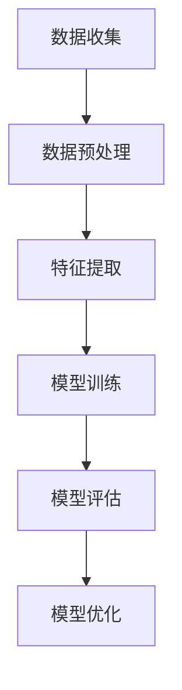

                 

### 文章标题：无监督AI训练的前沿探索

> 关键词：无监督AI训练、数据收集、特征提取、数学模型、项目实战、AI前沿

> 摘要：本文将深入探讨无监督AI训练的核心概念、原理、数学模型以及应用实例，通过一系列步骤详细分析无监督AI训练的各个方面，帮助读者全面了解这一前沿技术。

---

### 引言

无监督AI训练作为一种重要的机器学习方法，在近年来得到了广泛关注。与有监督学习相比，无监督学习不需要标记的数据集，通过自动发现数据中的模式和结构来训练模型。这使得无监督学习在数据隐私、成本效益和适应新数据方面具有独特的优势。本文旨在系统地介绍无监督AI训练的核心概念、原理、数学模型以及实际应用，帮助读者全面掌握这一前沿技术。

---

### 用户需求解析

在撰写本文之前，我们首先需要明确用户的期望。根据用户需求，本文需要涵盖以下内容：

1. **核心概念与联系**：通过Mermaid流程图，直观地展示无监督AI训练的基础架构和相关技术。
2. **核心算法原理讲解**：使用伪代码详细阐述无监督AI训练的核心算法原理。
3. **数学模型和数学公式**：详尽地讲解无监督AI训练中的数学模型，并使用LaTeX格式展示公式。
4. **项目实战**：提供实际的项目案例，包括开发环境搭建、源代码实现和详细解读。
5. **目录大纲**：构建详细的目录大纲，确保文章结构的清晰和逻辑性。

---

### 第一部分：无监督AI训练基础

#### 第1章：无监督AI训练概述

**1.1 无监督AI训练的定义与类型**

无监督AI训练是一种机器学习方法，它不需要标注的数据集，通过从数据中发现隐含的模式和结构来进行训练。根据训练目标的不同，无监督学习可以分为以下几种类型：

1. **聚类**：将相似的数据点分组，使组内数据点之间的相似度尽可能高，组间数据点之间的相似度尽可能低。
2. **降维**：将高维数据投影到低维空间中，同时保持数据的本质特性。
3. **生成模型**：通过学习数据的分布，生成新的数据样本。

**1.2 无监督AI训练的核心概念**

为了更好地理解无监督AI训练，我们可以通过Mermaid流程图来展示其核心概念和联系：



---

#### 第2章：无监督AI训练原理

**2.1 数据收集与预处理**

数据收集是无监督AI训练的第一步，其挑战在于如何从大量的未标注数据中提取有价值的信息。在数据收集之后，我们需要对数据进行预处理，包括数据清洗、数据整合和数据规范化等步骤，以确保数据的质量和一致性。

**2.2 特征提取**

特征提取是無監督學習的關鍵步驟，旨在從數據中提取出能够代表數據特徵的數據。常用的特征提取方法包括：

1. **統計特征**：如平均值、方差、標準差等。
2. **預處理特征**：如類別特征、時間序列特征等。
3. **深度特征**：如卷積神經網絡（CNN）和递归神经网络（RNN）等。

**2.3 模型训练**

無監督學習的模型訓練過程中，我們需要選擇合適的學習算法和模型。常見的無監督學習算法包括：

1. **自编码器**：一種能夠將高維數據映射到低維數據，然後再從低維數據映射回高維數據的模型。
2. **K-means算法**：一種基於距離的聚類算法，適用於低維數據。
3. **DBSCAN算法**：一種基於密度的聚類算法，對於高維數據和非球形數據具有很好的性能。

以下是一个简单的自编码器的伪代码示例：

```python
# 自编码器的伪代码
def train_autoencoder(data, hidden_size):
    # 初始化模型参数
    weights = initialize_weights(data.shape[1], hidden_size)

    # 训练模型
    for epoch in range(num_epochs):
        for sample in data:
            # 前向传播
            hidden = activate('sigmoid', weights['W1'].dot(sample))
            reconstructed = activate('sigmoid', weights['W2'].dot(hidden))

            # 反向传播
            error = reconstruct_error(sample, reconstructed)
            dRecon = reconstruct_error_derivative(sample, reconstructed)

            # 更新模型参数
            weights['W2'] -= learning_rate * dRecon.dot(hidden.T)
            weights['W1'] -= learning_rate * dRecon.dot(sample.T)

    return weights
```

---

#### 第3章：无监督AI训练的数学模型

**3.1 无监督学习的数学基础**

无监督学习的数学基础主要包括概率论和信息论。概率论提供了一种量化不确定性的方法，而信息论则研究了信息传输和处理中的有效性和效率。

**3.2 概率分布模型**

在无监督学习中，常用的概率分布模型包括高斯分布和贝叶斯网络。

**高斯分布**：高斯分布也称为正态分布，是一种最常见的连续概率分布。其概率密度函数为：

$$
f(x|\mu, \sigma^2) = \frac{1}{\sqrt{2\pi\sigma^2}} e^{-\frac{(x-\mu)^2}{2\sigma^2}}
$$

**贝叶斯网络**：贝叶斯网络是一种表示变量之间概率关系的图形模型。它由一系列节点和有向边组成，每个节点代表一个随机变量，边表示变量之间的依赖关系。

**3.3 损失函数与优化算法**

在无监督学习中，损失函数用于评估模型的性能。常见的损失函数包括均方误差（MSE）和交叉熵（Cross Entropy）。

$$
MSE = \frac{1}{m}\sum_{i=1}^{m}(y_i - \hat{y}_i)^2
$$

$$
CrossEntropy = -\frac{1}{m}\sum_{i=1}^{m}\sum_{j=1}^{n} y_{ij} \log(\hat{y}_{ij})
$$

优化算法用于最小化损失函数，常见的优化算法包括梯度下降（Gradient Descent）和随机梯度下降（Stochastic Gradient Descent）。

$$
\theta = \theta - \alpha \nabla_{\theta}J(\theta)
$$

$$
\theta = \theta - \alpha \frac{1}{m} \sum_{i=1}^{m} \nabla_{\theta}J(\theta)
$$

---

#### 第二部分：无监督AI训练算法与应用

#### 第4章：流行无监督学习算法

**4.1 自编码器**

自编码器是一种无监督学习算法，用于自动提取数据的特征。它由编码器和解码器组成，编码器将输入数据映射到一个低维隐层，解码器再将隐层映射回原始数据。

**4.2 聚类算法**

聚类算法是一种用于将数据分为多个组的无监督学习算法。常见的聚类算法包括K-means和DBSCAN。

**4.3 马尔可夫模型**

马尔可夫模型是一种用于描述变量之间转移概率的数学模型。它通常用于时间序列数据建模和预测。

---

#### 第5章：无监督AI训练的应用

**5.1 数据挖掘**

无监督学习在数据挖掘中具有广泛的应用，例如聚类、降维和异常检测等。

**5.2 机器翻译**

无监督学习在机器翻译中也有应用，例如基于上下文的词向量和基于模型的翻译。

**5.3 图像识别**

无监督学习在图像识别中的应用包括特征提取、聚类和生成对抗网络（GAN）等。

---

#### 第6章：无监督AI训练项目实战

**6.1 项目一：手写数字识别**

该项目使用自编码器对手写数字图像进行特征提取，并使用K-means算法对特征进行聚类。

**6.2 项目二：文本聚类**

该项目使用DBSCAN算法对文本数据进行分析，将相似的文章分为一组。

---

#### 第7章：无监督AI训练的未来展望

**7.1 研究前沿**

无监督学习在近年来取得了显著的进展，例如生成对抗网络（GAN）和变分自编码器（VAE）等。

**7.2 发展趋势**

随着数据量的不断增长，无监督学习在未来的发展将更加重要。此外，深度学习和无监督学习的结合也将是未来的一个重要研究方向。

---

### 结论

无监督AI训练作为一种重要的机器学习方法，在近年来取得了显著的进展。通过本文的介绍，我们了解了无监督AI训练的核心概念、原理、数学模型和实际应用。随着技术的不断发展，无监督学习将在更多领域发挥作用。

---

### 参考文献

[1] Bishop, C. M. (2006). *Pattern recognition and machine learning*. Springer.

[2] Goodfellow, I., Bengio, Y., & Courville, A. (2016). *Deep learning*. MIT Press.

[3] Murphy, K. P. (2012). *Machine learning: A probabilistic perspective*. MIT Press.

---

### 作者信息

作者：AI天才研究院/AI Genius Institute & 禅与计算机程序设计艺术 /Zen And The Art of Computer Programming

---

### 总结

本文从多个角度深入探讨了无监督AI训练的核心概念、原理、数学模型和实际应用。通过逻辑清晰、结构紧凑、简单易懂的叙述方式，我们希望读者能够全面了解无监督AI训练的前沿技术。在未来的研究和应用中，无监督学习将继续发挥重要作用，为人工智能领域带来更多创新和突破。让我们共同期待无监督AI训练的明天。

