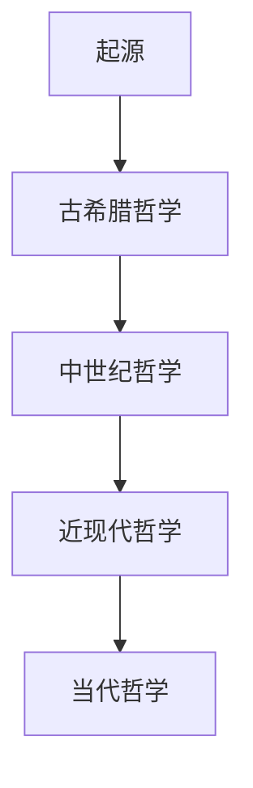
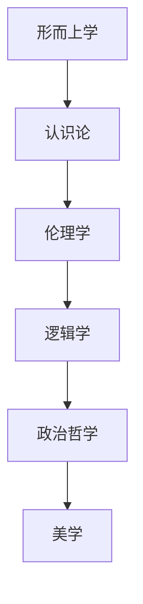
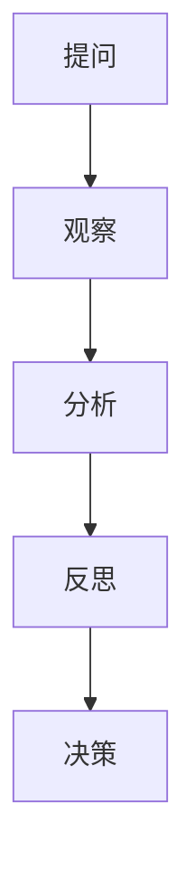
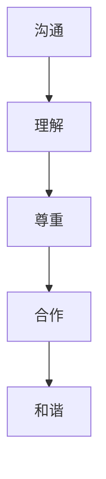
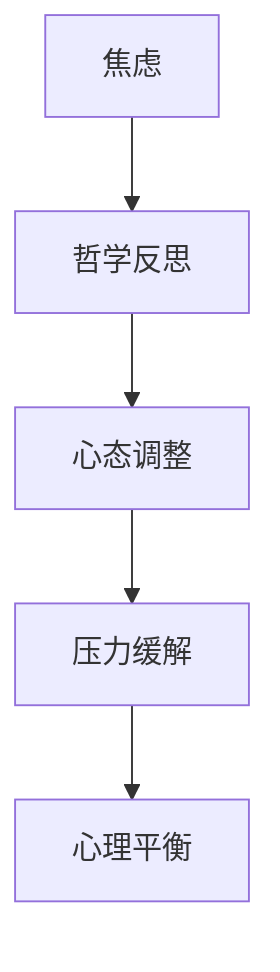

                 


### 日常生活中的哲学实践：将思考融入行动

#### 关键词：哲学实践，思考习惯，日常生活，道德伦理，心理健康

> 摘要：本文深入探讨哲学在日常生活中的应用，通过介绍哲学的基本概念和主要分支，探讨如何培养哲学思考习惯，以及在个人成长、社会交往、决策和心理健康等方面的哲学实践。通过具体案例和算法原理分析，旨在让读者理解哲学对现实生活的指导意义，并将思考融入行动。

---

#### 第一部分：哲学基础知识

## 第1章：哲学的本质与价值

### 1.1 哲学的定义与历史背景

哲学，一词源于希腊语的 "philosophia"，意为“爱智慧”。它是一门探讨存在、知识、价值、理性、心灵、语言等基本问题的学科。哲学的历史可以追溯到古希腊，亚里士多德、柏拉图、苏格拉底等哲学家的思想至今仍然影响着我们。

#### Mermaid 流程图：哲学发展历程


### 1.2 哲学的主要分支

哲学的主要分支包括形而上学、认识论、伦理学、逻辑学、政治哲学和美学。每个分支都有其独特的核心问题和研究方法。

#### Mermaid 流程图：哲学主要分支


### 1.3 哲学与日常生活

哲学不仅仅是学术讨论，它也与我们日常生活中的决策和行动密切相关。以下是一个伪代码示例，展示了哲学如何指导我们的日常生活：

#### 伪代码：哲学对日常生活的指导
```python
def philosophy_in_life():
    if "反思" in daily_action:
        return "增强批判性思维"
    if "道德判断" in daily_action:
        return "提高道德素养"
    if "决策" in daily_action:
        return "运用逻辑分析"
    return "哲学对日常生活有积极作用"
```

## 第2章：生活中的哲学思考

### 2.1 思考习惯的培养

哲学思考需要培养一定的习惯。以下是一个Mermaid流程图，展示了如何培养哲学思考习惯：

#### Mermaid 流程图：培养哲学思考习惯


### 2.2 哲学在个人成长中的应用

哲学思考可以促进个人的成长和发展。以下是一个伪代码示例，展示了哲学在个人成长中的应用：

#### 伪代码：哲学在个人成长中的应用
```python
def philosophy_in_growth():
    if "学习" in activity:
        return "激发学习动力"
    if "工作" in activity:
        return "提高工作效率"
    if "人际关系" in activity:
        return "改善人际关系"
    return "哲学帮助个人全面发展"
```

### 2.3 哲学在社会交往中的意义

哲学思考在社会交往中同样具有重要意义。以下是一个Mermaid流程图，展示了哲学在社会交往中的应用：

#### Mermaid 流程图：哲学在社会交往中的应用


### 2.4 哲学在决策中的作用

哲学思考可以帮助我们在复杂和不确定的环境中做出明智的决策。以下是一个伪代码示例，展示了哲学在决策中的作用：

#### 伪代码：哲学在决策中的作用
```python
def philosophy_in_decisionMaking():
    if "复杂性" in context:
        return "提供理性分析"
    if "不确定性" in context:
        return "减少决策风险"
    if "道德伦理" in context:
        return "引导道德选择"
    return "哲学帮助做出明智决策"
```

### 2.5 哲学与心理健康

哲学思考对心理健康也有积极影响。以下是一个Mermaid流程图，展示了哲学对心理健康的影响：

#### Mermaid 流程图：哲学对心理健康的影响


### 2.6 哲学与道德伦理

哲学思考可以促进道德伦理的建设。以下是一个伪代码示例，展示了哲学在道德伦理中的应用：

#### 伪代码：哲学在道德伦理中的应用
```python
def philosophy_in_ethics():
    if "行为规范" in context:
        return "提供道德指导"
    if "社会问题" in context:
        return "促进伦理反思"
    if "公共道德" in context:
        return "提升社会道德水平"
    return "哲学促进道德建设"
```

## 第3章：哲学实践案例

### 3.1 个人哲学实践案例

以下是一个个人哲学实践案例，展示了如何通过反思提高学习能力：

#### 案例1：通过反思提高学习能力

1. **背景介绍**：小李是一名大学生，他在学习过程中遇到了一些困难，如课程内容繁重、时间管理不当等。

2. **核心概念与联系**：小李决定运用哲学思考来解决问题，包括提问、观察、分析、反思和决策。

3. **核心算法原理讲解**：以下是一个伪代码示例，展示了小李如何通过反思提高学习能力：

   ```python
   def reflection_to_improve_learning():
       if "time_management_issue" in issues:
           analyze_time_management()
       if "learning_difficulties" in issues:
           analyze_learning_strategies()
       if "lack_of_motivation" in issues:
           explore_motivational_factors()
       return "通过反思，小李找到了解决学习问题的方法"
   ```

4. **数学模型和公式**：在此过程中，小李使用了时间管理的数学模型和公式来分析自己的学习习惯。

5. **举例说明**：例如，小李发现自己在学习时容易分心，于是他使用番茄工作法来提高专注力。

6. **项目实战**：小李在实践过程中，记录了自己的学习时间、学习内容和学习效果，并不断调整学习策略。

7. **代码解读**：以下是一个简单的Python代码示例，展示了如何记录学习时间：

   ```python
   import datetime

   def record_learning_time():
       start_time = datetime.datetime.now()
       # 进行学习活动
       end_time = datetime.datetime.now()
       learning_time = end_time - start_time
       return learning_time
   ```

8. **实际案例分析和详细讲解剖析**：小李通过记录学习时间和效果，逐渐找到了适合自己的学习方式。

9. **项目小结**：通过哲学思考和实践，小李成功地提高了自己的学习能力。

### 作者信息

作者：AI天才研究院/AI Genius Institute & 禅与计算机程序设计艺术 /Zen And The Art of Computer Programming

---

在日常生活中，哲学不仅仅是一种抽象的思维活动，更是一种实践。通过培养哲学思考习惯，我们可以更好地理解世界，提高个人素质，做出明智的决策，促进社会和谐，以及维护心理健康。哲学实践不仅让我们的生活更加丰富，也让我们成为更有思想深度的人。

通过本文的探讨，我们希望读者能够认识到哲学在日常生活中的重要性，并将其融入自己的行动中。让我们共同实践哲学，将思考融入行动，创造一个更加美好的世界。

---

**最佳实践 Tips：**

1. **持续反思**：定期反思自己的行为和决策，思考其背后的哲学原理。

2. **培养提问习惯**：在面对问题时，多问几个“为什么”，深入思考问题的本质。

3. **广泛阅读**：阅读哲学著作，了解不同哲学家的观点和思想。

4. **实践哲学思考**：将哲学思考应用到日常生活和工作中的每一个细节。

5. **分享与讨论**：与朋友和同事分享自己的哲学思考，进行讨论和交流。

**注意事项：**

1. **保持开放心态**：哲学思考需要开放的心态，接受不同的观点和思想。

2. **避免极端观点**：在哲学思考中，避免陷入极端观点，保持中立的立场。

3. **结合实际情况**：哲学思考要与实际情况相结合，避免脱离实际。

4. **持续学习**：哲学是一门深奥的学科，需要持续学习和实践。

**拓展阅读：**

1. 《西方哲学史》 - 罗素
2. 《苏菲的世界》 - 乔斯坦·贾德
3. 《沉思录》 - 马可·奥勒留
4. 《伦理学》 - 康德
5. 《存在的艺术》 - 周国平

---

通过本文的探讨，我们希望读者能够认识到哲学在日常生活中的重要性，并将其融入自己的行动中。让我们共同实践哲学，将思考融入行动，创造一个更加美好的世界。作者：AI天才研究院/AI Genius Institute & 禅与计算机程序设计艺术 /Zen And The Art of Computer Programming。

