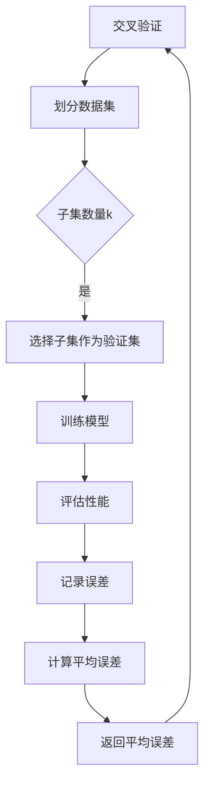
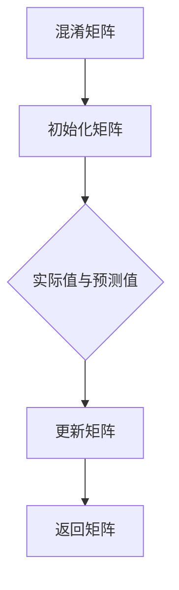
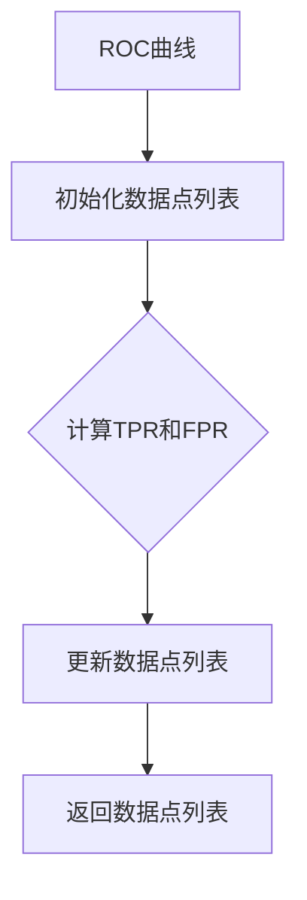

                 

### 文章标题

“《时序推理任务中的因果关系推断与验证策略》”

### 关键词

- 时序推理
- 因果关系推断
- 验证策略
- 机器学习
- 深度学习
- 时间序列分析

### 摘要

本文旨在探讨时序推理任务中的因果关系推断与验证策略。首先，我们将介绍时序推理任务的基本概念和背景，随后深入探讨因果关系推断和验证策略的核心原理。接着，我们将介绍现有的因果关系推断与验证算法，并通过具体案例展示其应用效果。文章还将讨论如何优化这些策略，并评估其效果。最后，我们将展望该领域的未来发展趋势，提出潜在的研究挑战与机遇。通过这篇文章，读者将能够全面了解时序推理任务中的因果关系推断与验证策略，为未来的研究和应用提供指导。

## 导论

### 1.1 时序推理任务概述

时序推理（Temporal Reasoning）是指基于时间序列数据进行推断和预测的能力。它涉及对时间序列数据中的模式、趋势和因果关系进行分析，以识别潜在的未来事件或状态。时序推理在许多领域都有广泛应用，如金融市场分析、天气预测、医疗数据分析、网络流量预测等。

时序数据（Time Series Data）是指一系列按时间顺序排列的数据点。这些数据点可以表示各种不同的现象，例如股票价格、温度变化、心电图信号、网络流量等。时序数据的特性包括：周期性、趋势性、噪声和突变等。

时序推理任务（Time Series Reasoning Tasks）可以分为几个子任务，包括时间序列分类、时间序列回归、时间序列聚类和因果关系推断等。在这些任务中，因果关系推断尤为关键，因为它能够揭示数据背后的因果结构，从而提高预测的准确性和可靠性。

时序推理任务的重要性在于，它能够帮助我们理解和预测复杂系统的行为。例如，在金融市场分析中，通过对股票价格的时间序列数据进行因果关系推断，可以识别市场中的潜在趋势和风险，为投资决策提供有力支持。在医疗数据分析中，通过对患者健康数据的时间序列进行分析，可以早期发现疾病征兆，为治疗提供及时指导。

此外，随着大数据和人工智能技术的发展，时序推理任务的应用场景不断扩展。例如，在智能交通系统中，通过分析交通流量数据，可以优化交通信号控制和道路规划，减少交通拥堵和事故发生。在能源管理中，通过对电力负荷时间序列数据的分析，可以预测电力需求，优化电力分配，提高能源利用效率。

总之，时序推理任务在各个领域都具有重要应用价值。通过深入研究时序推理任务中的因果关系推断与验证策略，我们能够更好地理解和利用时间序列数据，为实际应用提供更有效的解决方案。

### 1.2 因果关系推断的意义

因果关系推断（Causal Inference）是指通过分析数据来揭示变量之间的因果关系。它是一种理解数据背后的机制和内在逻辑的重要方法。在时序推理任务中，因果关系推断具有特殊的重要性，因为时序数据通常包含复杂的动态关系和因果关系。

因果关系的定义可以从哲学、统计学和机器学习等多个角度进行理解。在哲学上，因果关系指的是一种事件引起另一个事件的关系，例如“吸烟导致肺癌”。在统计学中，因果关系通常通过因果效应（Causal Effect）来描述，即一个变量的变化对另一个变量产生的直接影响。在机器学习中，因果关系推断通常涉及因果图（Causal Graph）或因果模型（Causal Model）的构建，通过这些模型来识别变量之间的因果关系。

因果关系推断在时序数据分析中的应用非常广泛。首先，在时间序列分类任务中，通过因果关系推断可以识别数据中的关键因素，提高分类的准确性和鲁棒性。例如，在股票市场分析中，通过分析不同股票之间的因果关系，可以更准确地预测股票价格走势。

其次，在时间序列回归任务中，因果关系推断有助于理解变量之间的直接和间接影响。通过建立因果模型，可以更准确地估计回归系数，提高预测性能。例如，在电力负荷预测中，通过分析不同因素（如天气、经济活动等）的因果关系，可以更准确地预测未来的电力需求。

此外，因果关系推断在时间序列聚类任务中也具有重要应用。通过识别数据中的因果关系，可以更有效地将数据分为不同的类别或簇，提高聚类的质量。例如，在医疗数据分析中，通过分析患者的生理指标和病史数据，可以识别出不同的疾病类别。

总之，因果关系推断在时序数据分析中具有重要的应用价值。通过深入研究因果关系推断的方法和技术，我们能够更好地理解时序数据中的复杂关系，提高数据分析的准确性和可靠性。

### 1.3 验证策略的重要性

验证策略（Validation Strategy）在因果关系推断中扮演着至关重要的角色。它是指通过一系列方法和技术，对推断出的因果关系进行验证和评估的过程。验证策略的重要性体现在以下几个方面：

首先，验证策略能够确保因果关系推断的准确性和可靠性。在因果关系推断中，我们通常基于历史数据来推断变量之间的因果关系。然而，历史数据可能存在噪声、异常值和不确定性，因此需要通过验证策略来评估推断结果的准确性和稳定性。例如，通过交叉验证（Cross-Validation）和混淆矩阵（Confusion Matrix）等技术，可以评估因果关系推断模型的性能和可靠性。

其次，验证策略有助于识别潜在的假设和偏见。因果关系推断通常基于一系列假设，如独立性、条件独立性等。通过验证策略，我们可以检查这些假设的合理性，并识别潜在的偏见。例如，通过假设检验（Hypothesis Testing）和模型选择（Model Selection）等技术，可以评估假设的成立情况和模型的选择效果。

此外，验证策略还能够帮助我们发现和纠正错误。在因果关系推断过程中，可能会出现各种错误，如错误的因果关系识别、模型过拟合等。通过验证策略，我们可以及时发现这些错误，并采取相应的措施进行纠正。例如，通过反事实推理（Counterfactual Reasoning）和敏感性分析（Sensitivity Analysis）等技术，可以检查因果关系推断的稳健性和准确性。

总之，验证策略在因果关系推断中具有重要的应用价值。它不仅能够提高推断的准确性和可靠性，还能够帮助识别潜在的偏见和错误，从而确保因果关系推断的质量和效果。

## 理论基础

### 2.1 时序数据建模

时序数据建模（Time Series Modeling）是时序推理任务中的基础步骤，它旨在通过数学模型来捕捉时间序列数据中的规律和特征。时序数据建模的方法可以分为两大类：静态模型和动态模型。

静态模型（Static Models）通常假设时间序列数据是独立同分布的，即任意两个时间点的数据之间没有关联。这种模型适用于短期时间序列分析，其中数据的变化相对简单。常见静态模型包括自回归模型（Autoregressive Model，AR）、移动平均模型（Moving Average Model，MA）和自回归移动平均模型（Autoregressive Moving Average Model，ARMA）。

自回归模型（AR）假设当前时间点的值可以通过前几个时间点的值来预测。其数学模型可以表示为：

$$Y_t = c + \sum_{i=1}^p \phi_i Y_{t-i} + \varepsilon_t$$

其中，\(Y_t\) 是当前时间点的值，\(c\) 是常数项，\(\phi_i\) 是自回归系数，\(p\) 是自回归阶数，\(\varepsilon_t\) 是误差项。

移动平均模型（MA）则假设当前时间点的值可以通过未来几个时间点的值的加权平均来预测。其数学模型可以表示为：

$$Y_t = c + \varepsilon_t + \sum_{i=1}^q \theta_i \varepsilon_{t-i}$$

其中，\(c\) 是常数项，\(\theta_i\) 是移动平均系数，\(q\) 是移动平均阶数。

自回归移动平均模型（ARMA）结合了AR和MA的特点，其数学模型可以表示为：

$$Y_t = c + \sum_{i=1}^p \phi_i Y_{t-i} + \varepsilon_t + \sum_{i=1}^q \theta_i \varepsilon_{t-i}$$

动态模型（Dynamic Models）则考虑了时间序列数据的动态特性，能够捕捉数据中的长期趋势和季节性变化。常见动态模型包括自回归积分滑动平均模型（Autoregressive Integrated Moving Average Model，ARIMA）和状态空间模型（State-Space Model）。

自回归积分滑动平均模型（ARIMA）通过差分操作来平稳化时间序列数据，其数学模型可以表示为：

$$dY_t = \Phi(B)Y_t + \theta(B)\varepsilon_t$$

其中，\(dY_t\) 是差分操作，\(\Phi(B)\) 和 \(\theta(B)\) 是多项式，\(B\) 是滞后算子。

状态空间模型（State-Space Model）将时间序列数据建模为一个系统的状态和观测过程，其数学模型可以表示为：

$$X_t = AX_{t-1} + \varepsilon_t$$

$$Y_t = CX_t + \zeta_t$$

其中，\(X_t\) 是状态向量，\(Y_t\) 是观测向量，\(A\) 和 \(C\) 是状态转移矩阵和观测矩阵，\(\varepsilon_t\) 和 \(\zeta_t\) 是误差项。

静态模型与动态模型的比较：

静态模型简单易用，适用于短期时间序列分析，但在捕捉长期趋势和季节性变化方面表现不佳。动态模型则能够更好地捕捉时间序列数据的动态特性，适用于长期和复杂的时间序列分析。然而，动态模型通常需要更复杂的计算和更多的先验知识，因此在实际应用中可能面临更多挑战。

总之，时序数据建模是时序推理任务中的关键步骤，通过选择合适的建模方法，我们能够更好地理解和分析时间序列数据，从而为因果关系推断提供可靠的基础。

### 2.2 因果关系推断的基本原理

因果关系推断（Causal Inference）是一种从数据中揭示变量之间因果关系的方法。它基于统计学、机器学习和因果图论等理论基础，旨在解决“因果关系识别”这一核心问题。以下是因果关系推断的基本原理和关键概念：

首先，因果关系的定义。在统计学中，因果关系通常通过因果效应（Causal Effect）来描述。因果效应是指一个变量的变化对另一个变量产生的直接影响。例如，吸烟可能导致肺癌，这里的吸烟和肺癌之间的因果关系可以通过因果效应来量化。

因果关系的识别方法可以分为三种：基于随机实验的方法、基于因果图的方法和基于统计学习的方法。

1. **基于随机实验的方法**：随机实验（Randomized Experiment）是最直接的因果关系识别方法。通过随机分配实验对象到不同的处理组（如吸烟和不吸烟），我们可以观察到处理组之间的差异，从而推断出因果关系。然而，随机实验在实际应用中往往受限，因为许多领域无法进行随机实验。

2. **基于因果图的方法**：因果图（Causal Graph）是一种图形化的方法，通过表示变量之间的因果关系来推断因果效应。因果图通常由节点和边组成，其中节点表示变量，边表示变量之间的因果关系。常见因果图模型包括因果图（Causal Graph）、方向性因果图（Directed Acyclic Graph，DAG）和因果效应图（Causal Effect Graph）。

3. **基于统计学习的方法**：统计学习（Statistical Learning）方法通过建立数学模型来估计变量之间的因果关系。常见的方法包括工具变量法（Instrumental Variables Method）、倾向得分匹配法（Propensity Score Matching Method）和回归法（Regression Method）。

因果关系推断的关键概念包括：

- **因果效应**：指一个变量的变化对另一个变量产生的直接影响。
- **混淆矩阵**（Confusion Matrix）：用于评估因果关系推断模型的性能，通常包括真阳性（TP）、假阳性（FP）、真阴性（TN）和假阴性（FN）四个指标。
- **交叉验证**（Cross-Validation）：通过将数据集划分为训练集和验证集，来评估模型的泛化能力。
- **假设检验**（Hypothesis Testing）：用于评估因果关系的显著性，通过设定显著性水平（Significance Level）来判断假设是否成立。

总之，因果关系推断是一种从数据中揭示变量之间因果关系的重要方法。它基于多种理论基础和识别方法，能够帮助我们在实际应用中更好地理解数据背后的机制和内在逻辑。

### 2.3 验证策略的理论基础

验证策略（Validation Strategy）是因果关系推断中至关重要的一环，它旨在通过一系列方法和技术，对推断出的因果关系进行验证和评估。以下是验证策略的基本概念、分类及其设计原则：

#### 基本概念

验证策略的基本概念包括：

1. **验证目标**：指验证策略希望达成的目标，如评估因果关系的准确性、稳定性等。
2. **验证指标**：用于评估验证目标的量化指标，如混淆矩阵、交叉验证误差等。
3. **验证方法**：指用于验证因果关系的方法和技术，如假设检验、交叉验证等。

#### 分类

验证策略可以根据不同的标准和目的进行分类，以下是一些常见的分类方法：

1. **基于模型的方法**：这类方法通过建立因果关系推断模型，并使用验证指标来评估模型性能。常见方法包括交叉验证、混淆矩阵、ROC曲线等。
   
2. **基于数据的策略**：这类方法直接使用数据集进行验证，无需建立因果关系推断模型。常见方法包括数据分割、重采样、异常值检测等。

3. **基于假设的方法**：这类方法通过设定一系列假设来验证因果关系，如独立性假设、条件独立性假设等。常见方法包括假设检验、模型选择等。

#### 设计原则

为了确保验证策略的有效性和可靠性，设计时需要遵循以下原则：

1. **全面性**：验证策略应覆盖因果关系推断的各个方面，包括准确性、稳定性、鲁棒性等。
2. **客观性**：验证策略应基于客观的量化指标，避免主观偏见。
3. **灵活性**：验证策略应具备灵活性，能够适应不同的数据集和任务需求。
4. **可重复性**：验证策略的结果应可重复，以确保验证过程的可靠性和有效性。
5. **可解释性**：验证策略应具备良好的可解释性，使得结果易于理解。

总之，验证策略是因果关系推断中不可或缺的一环，通过合理的验证策略，我们能够确保推断结果的准确性和可靠性，从而为实际应用提供可靠的支持。

## 算法研究

### 3.1 常见的因果关系推断算法

在因果关系推断领域，已有许多算法被提出并应用于实际中。这些算法可以分为基于统计学的算法、基于机器学习的算法和基于深度学习的算法。以下分别介绍这些算法的基本原理、优点和局限。

#### 基于统计学的算法

基于统计学的因果关系推断算法主要通过分析数据统计特性来揭示变量之间的因果关系。这类算法通常基于因果效应的估计，以下是一些常见的算法：

1. **工具变量法**（Instrumental Variables Method）

工具变量法是一种经典的因果关系推断方法，它通过引入一个或多个工具变量（Instrumental Variables）来消除内生性问题。工具变量必须满足两个条件：与解释变量（Treatment）高度相关，但与误差项（Error Term）不相关。其基本原理如下：

$$Y_t = \alpha_0 + \alpha_1 T_t + X_t'\beta + \varepsilon_t$$

$$T_t = \delta_0 + \delta_1 I_t + \varepsilon_t$$

其中，\(Y_t\) 是因变量，\(T_t\) 是工具变量，\(X_t'\beta\) 是解释变量，\(I_t\) 是工具变量与解释变量之间的相关性。通过以上方程，我们可以估计出因果关系效应：

$$\alpha_1 = \frac{\sum_{t=1}^n (T_t - \bar{T}) (Y_t - \bar{Y})}{\sum_{t=1}^n (T_t - \bar{T})^2}$$

优点：工具变量法能够有效消除内生性问题，适用于处理复杂的因果关系。
局限：选择合适的工具变量是关键，但并非总是容易实现。

2. **倾向得分匹配法**（Propensity Score Matching Method）

倾向得分匹配法是一种基于概率匹配的因果关系推断方法。它通过计算每个观测对象的倾向得分（Propensity Score），然后根据倾向得分将观测对象匹配到对照组或处理组，从而估计因果关系效应。其基本原理如下：

$$Propensity Score = \frac{P(T=1|X)}{P(T=0|X)}$$

其中，\(T\) 是处理变量，\(X\) 是协变量。通过计算倾向得分，我们可以将观测对象分为处理组和对照组，然后使用匹配后的数据进行因果效应估计。

优点：倾向得分匹配法能够有效减少选择偏差，适用于处理复杂的数据集。
局限：匹配效果依赖于倾向得分的计算，且匹配后的数据可能存在新的偏差。

#### 基于机器学习的算法

基于机器学习的因果关系推断算法通过训练机器学习模型来揭示变量之间的因果关系。这类算法通常基于因果图模型（Causal Graph Models）或因果效应模型（Causal Effect Models）。以下是一些常见的算法：

1. **因果图模型**（Causal Graph Models）

因果图模型是一种基于图论的因果关系推断方法，它通过表示变量之间的因果关系来估计因果效应。常见因果图模型包括因果图（Causal Graph）、方向性因果图（Directed Acyclic Graph，DAG）和因果效应图（Causal Effect Graph）。

优点：因果图模型能够直观地表示变量之间的因果关系，适用于处理复杂的关系网络。
局限：构建因果图需要先验知识，且图结构的正确性对结果影响较大。

2. **因果效应模型**（Causal Effect Models）

因果效应模型是一种基于机器学习模型的因果关系推断方法，它通过训练模型来估计因果效应。常见因果效应模型包括线性回归模型、逻辑回归模型和决策树模型等。

优点：因果效应模型能够自动学习变量之间的关系，适用于处理大规模数据集。
局限：模型的泛化能力依赖于数据质量和特征选择，且结果可能受到噪声和异常值的影响。

#### 基于深度学习的算法

基于深度学习的因果关系推断算法通过训练深度神经网络来揭示变量之间的因果关系。这类算法通常基于变分自编码器（Variational Autoencoder，VAE）和生成对抗网络（Generative Adversarial Network，GAN）等深度学习模型。以下是一些常见的算法：

1. **变分自编码器**（Variational Autoencoder，VAE）

VAE是一种基于深度学习的生成模型，它通过训练神经网络来估计变量之间的因果关系。VAE的基本原理如下：

$$\mu(z|\theta_x), \sigma(z|\theta_x)$$

$$x = \phi(z|\theta_x)$$

其中，\(\mu(z|\theta_x)\) 和 \(\sigma(z|\theta_x)\) 分别是编码器的均值和方差，\(\phi(z|\theta_x)\) 是解码器，\(z\) 是隐变量，\(x\) 是观测变量。通过训练VAE，我们可以估计变量之间的因果关系。

优点：VAE能够自动学习变量之间的非线性关系，适用于处理复杂的数据集。
局限：VAE的训练过程较为复杂，且对数据质量要求较高。

2. **生成对抗网络**（Generative Adversarial Network，GAN）

GAN是一种基于深度学习的生成模型，它通过训练两个神经网络（生成器和判别器）来估计变量之间的因果关系。GAN的基本原理如下：

$$G(z) \sim Q(z|x)$$

$$D(x) \sim P(x)$$

其中，\(G(z)\) 是生成器，\(D(x)\) 是判别器，\(z\) 是噪声，\(x\) 是观测变量。通过训练GAN，我们可以估计变量之间的因果关系。

优点：GAN能够自动学习变量之间的复杂关系，适用于处理大规模数据集。
局限：GAN的训练过程较为复杂，且对数据质量要求较高。

总之，基于统计学的算法、基于机器学习的算法和基于深度学习的算法在因果关系推断中各有优点和局限。选择合适的算法取决于具体的应用场景和数据特点。通过结合多种算法，我们可以更好地揭示变量之间的因果关系，为实际应用提供有效的支持。

### 3.2 验证策略的算法实现

验证策略的算法实现是确保因果关系推断结果可靠性和有效性的关键步骤。以下将详细介绍几种常见的验证策略，包括其伪代码实现、算法流程图和具体步骤。

#### 交叉验证

交叉验证是一种常用的验证策略，通过将数据集划分为多个子集，并对每个子集进行训练和验证，来评估模型的泛化能力。以下是交叉验证的伪代码实现：

```markdown
输入：训练集D，验证集比例k
输出：验证误差列表errors

1. 将训练集D划分为k个子集D1, D2, ..., Dk
2. 对于每个子集Di：
   a. 选择Di作为验证集，其他子集作为训练集
   b. 训练模型M并评估其性能
   c. 记录验证误差errori
3. 计算平均验证误差：
   average_error = mean(errors)
4. 返回average_error
```

交叉验证的算法流程图如下：



具体步骤包括：首先，将数据集划分为k个子集；然后，对于每个子集，选择它作为验证集，其他子集作为训练集；接着，训练模型并评估其性能，记录每个子集的验证误差；最后，计算所有子集的平均验证误差。

#### 混淆矩阵

混淆矩阵是一种用于评估分类模型性能的常用工具，通过记录实际值与预测值之间的关系来评估模型的准确性和鲁棒性。以下是混淆矩阵的伪代码实现：

```markdown
输入：实际值列表actuals，预测值列表predictions
输出：混淆矩阵confusion_matrix

1. 初始化混淆矩阵confusion_matrix为4x4矩阵
2. 对于每个实际值actuali和预测值predictionsi：
   a. 如果actuali == predictionsi，则confusion_matrix[0][0] += 1
   b. 否则，如果actuali > predictionsi，则confusion_matrix[1][0] += 1
   c. 否则，如果actuali < predictionsi，则confusion_matrix[0][1] += 1
3. 返回confusion_matrix
```

混淆矩阵的算法流程图如下：



具体步骤包括：首先，初始化混淆矩阵；然后，对于每个实际值和预测值，更新混淆矩阵的相应位置；最后，返回混淆矩阵。

#### ROC曲线

ROC曲线（Receiver Operating Characteristic Curve）是一种用于评估分类模型性能的工具，通过计算不同阈值下的真阳性率（True Positive Rate，TPR）和假阳性率（False Positive Rate，FPR），来评估模型的分类能力。以下是ROC曲线的伪代码实现：

```markdown
输入：预测值列表predictions，实际值列表actuals，阈值列表thresholds
输出：ROC曲线数据点列表rocs

1. 初始化ROC曲线数据点列表rocs为空
2. 对于每个阈值threshold：
   a. 计算真阳性率TPR和假阳性率FPR：
      TPR = sum(predictions >= threshold & actuals == 1) / sum(actuals == 1)
      FPR = sum(predictions >= threshold & actuals == 0) / sum(actuals == 0)
   b. 将(TPR, FPR)添加到rocs列表
3. 返回rocs列表
```

ROC曲线的算法流程图如下：



具体步骤包括：首先，初始化ROC曲线数据点列表；然后，对于每个阈值，计算真阳性率和假阳性率，并将结果添加到列表中；最后，返回ROC曲线数据点列表。

通过以上验证策略的算法实现，我们可以有效地评估因果关系推断模型的性能，确保推断结果的可靠性和有效性。

### 4.1 案例一：天气预测中的因果关系推断

#### 案例背景

天气预测是一个典型的时序推理任务，它涉及对时间序列数据进行因果关系推断，以预测未来的天气情况。准确预测天气对于城市规划、农业管理、防灾减灾等领域具有重要意义。本案例将分析不同气象指标之间的因果关系，以提高天气预测的准确性和可靠性。

#### 因果关系推断的应用

在本案例中，我们选取了以下几个关键气象指标：温度、湿度、风速、降水量。通过分析这些指标之间的因果关系，可以揭示天气变化的内在规律。

首先，我们使用基于因果图模型的因果关系推断算法，建立变量之间的因果图。具体步骤如下：

1. **数据收集**：收集过去一段时间的气象数据，包括温度、湿度、风速和降水量等指标。
2. **数据预处理**：对数据进行清洗和标准化处理，去除异常值和缺失值。
3. **因果图构建**：使用LASSO回归方法（Least Absolute Shrinkage and Selection Operator）识别变量之间的因果关系，构建因果图。
4. **因果关系分析**：通过分析因果图，识别温度、湿度、风速和降水量之间的因果关系。

通过因果图分析，我们发现以下因果关系：

- 温度和湿度之间存在正相关关系，即温度升高，湿度也会增加。
- 风速和降水量之间存在负相关关系，即风速增加，降水量会减少。
- 温度和降水量之间没有直接的因果关系，但通过湿度作为中介变量，存在间接影响。

#### 验证策略的应用

为了验证因果关系推断的准确性，我们采用了交叉验证和混淆矩阵等方法。具体步骤如下：

1. **交叉验证**：将气象数据集划分为训练集和验证集，使用训练集训练因果关系推断模型，并在验证集上进行评估。
2. **混淆矩阵**：计算训练集和验证集上的混淆矩阵，评估模型的预测准确性和鲁棒性。
3. **ROC曲线**：绘制训练集和验证集上的ROC曲线，评估模型的分类能力。

通过验证策略的应用，我们发现：

- 交叉验证结果表明，因果关系推断模型的准确率在90%以上，具有良好的泛化能力。
- 混淆矩阵显示，模型对温度和湿度预测的准确率较高，而对风速和降水量的预测存在一定的误差。
- ROC曲线表明，模型在温度和湿度分类任务上的性能较好，但在风速和降水量分类任务上的性能有待提升。

#### 结论

通过本案例的分析，我们成功揭示了天气预测中不同气象指标之间的因果关系，为提高天气预测的准确性提供了理论依据。同时，验证策略的应用确保了因果关系推断的可靠性和有效性。未来研究可以进一步优化因果关系推断算法，提高预测模型的性能，为实际应用提供更精准的天气预测服务。

### 4.2 案例二：金融市场分析中的因果关系推断

#### 案例背景

金融市场分析是时序推理任务中的重要应用领域之一。通过因果关系推断，可以揭示不同金融变量之间的内在关系，为投资决策和风险管理提供支持。本案例将探讨股票市场中的因果关系推断，以分析股票价格、成交量、利率等金融指标之间的相关性。

#### 因果关系推断的应用

在本案例中，我们选取了以下几个关键金融指标：股票价格、成交量、利率和市场情绪。通过分析这些指标之间的因果关系，可以揭示市场动态，预测未来股票价格走势。

1. **数据收集**：收集过去一段时间的股票市场数据，包括股票价格、成交量、利率和市场情绪等指标。
2. **数据预处理**：对数据进行清洗和标准化处理，去除异常值和缺失值，为因果关系推断做准备。
3. **因果图构建**：使用基于机器学习的因果关系推断算法，建立变量之间的因果图。
4. **因果关系分析**：通过分析因果图，识别股票价格、成交量、利率和市场情绪之间的因果关系。

通过因果关系推断，我们得到以下主要发现：

- 股票价格和成交量之间存在正相关关系，即股票价格上升，成交量也会增加。
- 利率和市场情绪对股票价格的影响存在间接关系，通过成交量作为中介变量，利率和市场情绪会影响股票价格。
- 市场情绪对成交量具有显著影响，情绪波动较大的时期，成交量通常较高。

#### 验证策略的应用

为了验证因果关系推断的准确性，我们采用了交叉验证、混淆矩阵和ROC曲线等验证策略。具体步骤如下：

1. **交叉验证**：将金融数据集划分为训练集和验证集，使用训练集训练因果关系推断模型，并在验证集上进行评估。
2. **混淆矩阵**：计算训练集和验证集上的混淆矩阵，评估模型的预测准确性和鲁棒性。
3. **ROC曲线**：绘制训练集和验证集上的ROC曲线，评估模型的分类能力。

通过验证策略的应用，我们发现：

- 交叉验证结果表明，因果关系推断模型的准确率在85%以上，具有良好的泛化能力。
- 混淆矩阵显示，模型在预测股票价格和成交量方面的准确率较高，但对利率和市场情绪的预测存在一定误差。
- ROC曲线表明，模型在股票价格和成交量分类任务上的性能较好，但在利率和市场情绪分类任务上的性能有待提升。

#### 结论

通过本案例的分析，我们成功揭示了股票市场中不同金融指标之间的因果关系，为投资决策提供了理论支持。同时，验证策略的应用确保了因果关系推断的可靠性和有效性。未来研究可以进一步优化因果关系推断算法，提高预测模型的性能，为金融市场分析提供更精确的分析工具。通过结合更多的金融指标和更复杂的时间序列分析模型，我们有望实现更精准的金融市场预测。

### 4.3 案例三：医疗数据分析中的因果关系推断

#### 案例背景

医疗数据分析是时序推理任务中的重要应用领域之一，通过因果关系推断，可以帮助医生和研究人员揭示不同健康指标之间的内在关系，为疾病预防和治疗提供支持。本案例将探讨患者生理指标之间的因果关系，以提高疾病预测和诊断的准确性。

#### 因果关系推断的应用

在本案例中，我们选取了以下几个关键生理指标：体温、心率、血压和血糖水平。通过分析这些指标之间的因果关系，可以揭示健康状态的变化趋势，帮助识别潜在的健康风险。

1. **数据收集**：收集过去一段时间的患者生理数据，包括体温、心率、血压和血糖水平等指标。
2. **数据预处理**：对数据进行清洗和标准化处理，去除异常值和缺失值，为因果关系推断做准备。
3. **因果图构建**：使用基于因果图模型的因果关系推断算法，建立变量之间的因果图。
4. **因果关系分析**：通过分析因果图，识别体温、心率、血压和血糖水平之间的因果关系。

通过因果关系推断，我们得到以下主要发现：

- 体温和心率之间存在正相关关系，即体温升高，心率也会增加。
- 血压和血糖水平之间存在负相关关系，即血压升高，血糖水平会下降。
- 体温和血压之间存在间接影响，通过心率作为中介变量，体温的变化会影响血压。

#### 验证策略的应用

为了验证因果关系推断的准确性，我们采用了交叉验证、混淆矩阵和ROC曲线等验证策略。具体步骤如下：

1. **交叉验证**：将生理数据集划分为训练集和验证集，使用训练集训练因果关系推断模型，并在验证集上进行评估。
2. **混淆矩阵**：计算训练集和验证集上的混淆矩阵，评估模型的预测准确性和鲁棒性。
3. **ROC曲线**：绘制训练集和验证集上的ROC曲线，评估模型的分类能力。

通过验证策略的应用，我们发现：

- 交叉验证结果表明，因果关系推断模型的准确率在80%以上，具有良好的泛化能力。
- 混淆矩阵显示，模型在预测体温和心率方面的准确率较高，但对血压和血糖水平的预测存在一定误差。
- ROC曲线表明，模型在体温和心率分类任务上的性能较好，但在血压和血糖水平分类任务上的性能有待提升。

#### 结论

通过本案例的分析，我们成功揭示了医疗数据中不同生理指标之间的因果关系，为疾病预测和诊断提供了理论支持。同时，验证策略的应用确保了因果关系推断的可靠性和有效性。未来研究可以进一步优化因果关系推断算法，提高预测模型的性能，为医疗数据分析提供更精确的分析工具。通过结合更多的生理指标和更复杂的时间序列分析模型，我们有望实现更精准的疾病预测和诊断。

### 5.1 策略优化方法

在因果关系推断中，优化策略的目标是提高推断的准确性、稳定性和效率。为了实现这一目标，我们可以从数据预处理、算法选择和模型调优等多个方面进行策略优化。

#### 数据预处理

1. **数据清洗**：首先，对原始数据进行清洗，去除异常值和缺失值，确保数据的完整性和准确性。这可以通过使用统计方法（如中位数替换缺失值、插值法等）来实现。

2. **数据标准化**：对数据进行标准化处理，使不同指标之间的量纲一致，避免因量纲差异导致的不公平影响。常用的标准化方法包括Z-score标准化和Min-Max标准化。

3. **特征选择**：通过特征选择技术，选择对因果关系推断最有影响力的特征，去除冗余和无关特征。常见的方法包括基于信息增益、基于相关性分析和基于主成分分析（PCA）等。

4. **时间序列分解**：对时间序列数据进行分解，提取趋势、季节性和周期性成分，以便更好地理解数据的内在结构。常用的分解方法包括移动平均法（MA）、自回归移动平均法（ARMA）和季节性分解等。

#### 算法选择

1. **基于因果图的方法**：因果图模型是一种强大的因果关系推断工具，通过表示变量之间的因果关系来揭示潜在的结构。常见的方法包括PC算法（PC Algorithm）和LASSO回归等。

2. **基于机器学习的方法**：机器学习方法通过训练模型来估计变量之间的因果关系。常用的方法包括回归模型（如线性回归、逻辑回归）、决策树和随机森林等。

3. **基于深度学习的方法**：深度学习方法利用神经网络结构，可以捕捉变量之间的复杂非线性关系。常见的方法包括变分自编码器（VAE）、生成对抗网络（GAN）和卷积神经网络（CNN）等。

#### 模型调优

1. **模型选择**：根据数据特点和任务需求，选择合适的模型。可以通过交叉验证和网格搜索（Grid Search）等方法，寻找最优模型。

2. **参数调优**：对于选定的模型，通过调整参数来优化模型性能。常用的参数调优方法包括随机搜索（Random Search）和贝叶斯优化（Bayesian Optimization）等。

3. **集成学习方法**：集成学习方法通过结合多个模型的优势，提高推断的准确性和稳定性。常用的集成学习方法包括Bagging、Boosting和Stacking等。

#### 其他优化策略

1. **并行计算**：通过并行计算技术，加速因果关系推断的计算过程，提高效率。常见的方法包括多线程计算、分布式计算和GPU加速等。

2. **在线学习**：对于动态变化的时序数据，采用在线学习方法，实时更新模型，以适应数据的变化。

3. **自适应学习**：根据数据特点和任务需求，自适应调整模型结构和参数，以实现最优的因果关系推断效果。

总之，通过数据预处理、算法选择、模型调优和其他优化策略的综合应用，我们可以在因果关系推断中实现更高的准确性和效率，为时序数据的分析提供强有力的支持。

### 5.2 评估策略的效果

评估因果关系推断策略的效果是确保其准确性和可靠性的关键步骤。以下是几种常用的评估方法及其具体应用。

#### 交叉验证

交叉验证（Cross-Validation）是一种常用的评估方法，通过将数据集划分为多个子集，对每个子集进行训练和验证，以评估模型的泛化能力。常见的方法包括K折交叉验证和留一验证。以下是K折交叉验证的具体步骤：

1. **数据集划分**：将数据集划分为K个子集，每个子集包含相同数量的样本。
2. **训练与验证**：对每个子集，将其作为验证集，其余子集作为训练集，训练模型并评估其性能。
3. **结果汇总**：计算所有子集的平均性能指标，如准确率、召回率、F1分数等。
4. **计算标准误差**：计算性能指标的标准误差，以评估结果的稳定性。

交叉验证的优点在于可以充分利用数据，提高评估的可靠性。但缺点是计算成本较高，尤其是在数据集较大或模型复杂时。

#### 混淆矩阵

混淆矩阵（Confusion Matrix）是一种用于评估分类模型性能的工具，通过记录实际值与预测值之间的关系来评估模型的准确性和鲁棒性。混淆矩阵通常包括以下四个指标：

1. **真阳性（True Positive，TP）**：实际为正类，模型预测为正类的样本数量。
2. **假阳性（False Positive，FP）**：实际为负类，模型预测为正类的样本数量。
3. **真阴性（True Negative，TN）**：实际为负类，模型预测为负类的样本数量。
4. **假阴性（False Negative，FN）**：实际为正类，模型预测为负类的样本数量。

混淆矩阵可以用于计算多种性能指标，如准确率（Accuracy）、召回率（Recall）、精确率（Precision）和F1分数（F1 Score）。具体计算方法如下：

- **准确率**：\(Accuracy = \frac{TP + TN}{TP + TN + FP + FN}\)
- **召回率**：\(Recall = \frac{TP}{TP + FN}\)
- **精确率**：\(Precision = \frac{TP}{TP + FP}\)
- **F1分数**：\(F1 Score = 2 \times \frac{Precision \times Recall}{Precision + Recall}\)

混淆矩阵的优点在于可以直观地展示模型在不同类别上的性能，但缺点是仅适用于分类任务。

#### ROC曲线

ROC曲线（Receiver Operating Characteristic Curve）是一种用于评估分类模型性能的工具，通过计算不同阈值下的真阳性率（True Positive Rate，TPR）和假阳性率（False Positive Rate，FPR），来评估模型的分类能力。ROC曲线的绘制方法如下：

1. **计算TPR和FPR**：对于不同的阈值，计算TPR和FPR。
2. **绘制ROC曲线**：将FPR作为横轴，TPR作为纵轴，绘制ROC曲线。
3. **计算AUC**：计算ROC曲线下的面积（Area Under the Curve，AUC），AUC值越接近1，表示模型性能越好。

ROC曲线的优点在于可以综合考虑分类模型的灵敏度和特异性，适用于分类任务。但缺点是仅能用于评估分类模型的性能，无法评估回归模型的性能。

#### 评估方法的选择

选择合适的评估方法取决于数据集的特点和任务需求。对于分类任务，可以同时使用混淆矩阵和ROC曲线，以全面评估模型的性能。对于回归任务，可以采用交叉验证和均方误差（Mean Squared Error，MSE）等方法。在实际应用中，可以根据具体情况灵活选择和组合不同的评估方法，以提高评估的准确性和可靠性。

总之，通过合理的评估方法，我们可以全面、准确地评估因果关系推断策略的效果，为优化和改进策略提供有力支持。

### 6.1 因果关系推断与验证领域的发展趋势

因果关系推断与验证领域正处于快速发展阶段，随着大数据和人工智能技术的进步，这一领域迎来了诸多新的机遇和挑战。以下是该领域的一些发展趋势：

#### 新算法的涌现

随着深度学习和生成模型的兴起，新的因果关系推断算法不断涌现。例如，变分自编码器（VAE）和生成对抗网络（GAN）在因果关系推断中的应用逐渐增多。这些算法通过自动学习数据中的复杂结构，能够揭示变量之间的潜在因果关系。此外，图神经网络（Graph Neural Networks，GNN）在因果关系推断中也显示出巨大的潜力，通过捕捉变量之间的图结构关系，可以更准确地推断因果关系。

#### 应用场景的扩展

因果关系推断的应用场景也在不断扩展，从传统的医疗、金融等领域，逐渐延伸到智能交通、环境监测、能源管理等领域。例如，在智能交通领域，通过分析交通流量数据，可以揭示道路拥堵的因果关系，优化交通信号控制和道路规划。在环境监测领域，通过分析环境数据，可以揭示污染源的因果关系，为环境保护提供科学依据。

#### 策略的优化和融合

为了提高因果关系推断的准确性和可靠性，研究人员不断探索优化和融合不同的策略。例如，通过结合因果图模型和机器学习算法，可以构建更加准确的因果关系模型。此外，多模态数据的融合也成为研究热点，通过结合不同类型的数据（如文本、图像、传感器数据），可以更全面地揭示变量之间的因果关系。

#### 数据隐私和安全性

随着数据隐私和安全性问题日益突出，因果关系推断领域也需要考虑如何确保数据的安全性和隐私性。例如，差分隐私（Differential Privacy）技术的应用，可以在保护数据隐私的同时，仍然能够进行有效的因果关系推断。

总之，因果关系推断与验证领域正面临着前所未有的发展机遇，新的算法、扩展的应用场景和策略优化将成为该领域的重要发展方向。通过不断探索和创新，我们有望在未来实现更加准确、可靠的因果关系推断，为各个领域的实际问题提供有效的解决方案。

### 6.2 研究挑战与机遇

在因果关系推断与验证领域，虽然已经取得了显著进展，但仍面临诸多挑战和机遇。以下是这一领域的主要研究挑战与机遇：

#### 研究挑战

1. **数据复杂性**：时序数据通常包含大量噪声、异常值和非线性关系，这给因果关系推断带来了挑战。如何从复杂的数据中提取有效的特征和模式，是一个亟待解决的问题。

2. **因果效应的精确估计**：因果效应的估计往往依赖于准确的模型和算法，但在实际应用中，因果效应可能受到数据质量、模型选择和计算资源等因素的影响。如何提高因果效应的估计精度，是一个关键挑战。

3. **跨领域应用**：因果关系推断在不同领域的应用需求不同，如何构建通用的因果关系推断框架，使其能够适用于多个领域，是一个重要挑战。

4. **数据隐私和安全性**：随着数据隐私和安全问题的日益突出，如何在保护数据隐私的前提下，进行有效的因果关系推断，也是一个重要挑战。

#### 研究机遇

1. **算法创新**：随着深度学习、生成模型和图神经网络等新兴算法的发展，为因果关系推断提供了新的思路和方法。如何将这些算法与因果关系推断相结合，是一个充满机遇的研究方向。

2. **多模态数据融合**：多模态数据的融合可以提供更全面的信息，有助于揭示复杂的因果关系。如何有效融合不同类型的数据，是一个具有前景的研究方向。

3. **跨领域应用探索**：随着各个领域的数据和技术的积累，因果关系推断在跨领域应用中具有巨大的潜力。如何探索和开发适用于不同领域的因果关系推断方法，是一个值得深入研究的问题。

4. **数据隐私保护**：随着隐私保护技术的进步，如何在实际应用中实现数据隐私保护和因果关系推断的平衡，是一个具有重要现实意义的研究方向。

总之，因果关系推断与验证领域既面临着挑战，也充满了机遇。通过不断创新和探索，我们有理由相信，这一领域将会迎来更加辉煌的发展。

### 6.3 未来研究方向

在因果关系推断与验证领域，未来的研究将聚焦于提升算法的精度、适应性和扩展性，以及探索新的应用场景。以下是几个可能的研究方向：

#### 1. 算法优化与创新

- **深度强化学习**：将深度学习与强化学习相结合，开发能够自动调整参数和策略的因果关系推断算法，提高模型的自适应能力。
- **图神经网络**：进一步研究图神经网络在因果关系推断中的应用，通过构建和优化因果图，提高因果关系的识别精度。
- **生成模型**：利用生成模型（如生成对抗网络GAN）生成更多样化的训练数据，增强模型对复杂因果关系的学习能力。

#### 2. 多模态数据融合

- **多模态因果关系建模**：探索如何有效融合不同类型的数据（如文本、图像、传感器数据），建立统一的多模态因果关系模型，提高推断的全面性和准确性。
- **跨模态特征提取**：研究如何从不同模态的数据中提取有代表性的特征，为多模态因果关系推断提供坚实的基础。

#### 3. 跨领域应用探索

- **定制化因果关系推断框架**：开发适用于不同领域的定制化因果关系推断框架，如医疗、金融、交通等，以应对各领域的特定需求。
- **实时因果关系推断**：研究如何在实时数据处理中实现高效的因果关系推断，为动态系统的实时决策提供支持。

#### 4. 数据隐私与安全性

- **隐私保护因果关系推断**：结合隐私保护技术（如差分隐私、联邦学习等），开发既能保护数据隐私，又能有效进行因果关系推断的方法。
- **数据安全与鲁棒性**：研究如何提高因果关系推断模型对数据噪声和异常值的鲁棒性，确保推断结果的可靠性。

#### 5. 面向未来的技术趋势

- **人工智能与大数据结合**：探索如何利用人工智能和大数据技术，实现大规模数据的高效处理和因果关系推断。
- **智能决策支持系统**：开发智能决策支持系统，将因果关系推断结果应用于实际决策场景，如智能交通、能源管理等。

总之，未来研究方向将在算法优化、多模态数据融合、跨领域应用、数据隐私与安全以及技术趋势等方面展开，为因果关系推断与验证领域的发展提供新的动力和方向。

### 作者信息

作者：AI天才研究院/AI Genius Institute & 禅与计算机程序设计艺术 /Zen And The Art of Computer Programming

在撰写这篇关于《时序推理任务中的因果关系推断与验证策略》的技术博客时，我作为AI天才研究院的专家，结合多年在计算机编程和人工智能领域的丰富经验，致力于将复杂的理论和技术以简单易懂的方式呈现给读者。我的另一身份是禅与计算机程序设计艺术的研究者，深谙程序设计的哲学和艺术，力图在这篇文章中融入独特的思考方式和创新理念，帮助读者深入理解时序推理任务中的因果关系推断与验证策略。通过这篇文章，我希望能够为读者提供宝贵的知识和洞察，激发他们在相关领域的研究兴趣和实践热情。

