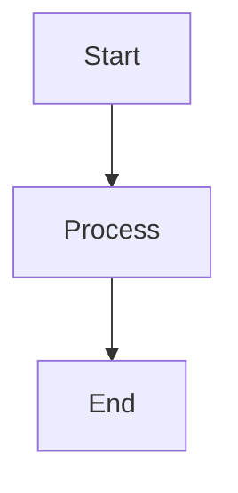
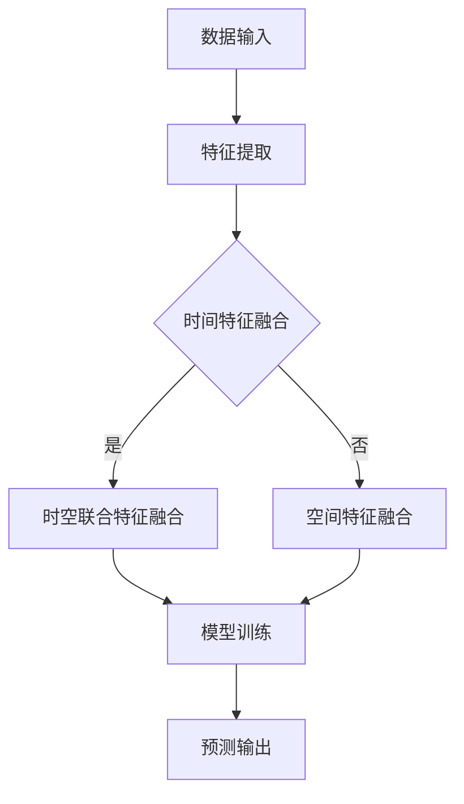

                 

### 文章标题：时空推理任务中的多尺度特征融合策略优化

#### 关键词：时空推理、多尺度特征融合、策略优化、算法、数学模型、项目实战

#### 摘要：

本文详细探讨时空推理任务中的多尺度特征融合策略优化。首先，介绍了时空推理和特征融合的基本概念，随后深入分析了多尺度特征融合策略及其在时空推理任务中的应用。通过详细的算法原理讲解、数学模型阐述及项目实战案例，本文提供了全面的技术解析，旨在为读者提供实用的优化方法和实践指导。

### 引言

#### 1.1 时空推理任务概述

时空推理是人工智能领域中的一个重要研究方向，旨在从时间和空间维度上理解和处理动态环境中的信息。时空推理任务广泛应用于自动驾驶、智能监控、机器人导航等多个领域，其核心在于对动态环境中事件和对象的时空关系进行有效推理和预测。

#### 1.2 多尺度特征融合的原理

特征融合是将多个不同来源或不同尺度的特征信息进行结合，以提升模型表现力和鲁棒性的技术。在时空推理任务中，多尺度特征融合能够整合不同时间尺度和空间尺度的信息，提高模型对复杂环境的理解和预测能力。

#### 1.3 时空推理任务的重要性

随着智能系统的广泛应用，时空推理任务在现实中的应用价值日益凸显。自动驾驶系统中，时空推理用于预测车辆和行人的运动轨迹；在智能监控领域，时空推理用于识别和跟踪移动对象；机器人导航中，时空推理用于环境感知和路径规划。

### 核心概念与联系

#### 2.1 多尺度特征融合策略的分类

多尺度特征融合策略可以根据融合方式的不同分为三类：空间特征融合、时间特征融合和时空联合特征融合。每种融合策略都有其特定的应用场景和优势。

##### 2.1.1 空间特征融合

空间特征融合主要关注同一时间点不同空间位置的特征信息融合。常见的方法包括空间平均、空间加权平均和空间卷积等。

##### 2.1.2 时间特征融合

时间特征融合涉及不同时间点的特征信息融合。方法包括时间平均、时间加权平均和滑动窗口平均等。

##### 2.1.3 时空联合特征融合

时空联合特征融合将空间和时间特征信息进行综合融合，以获得更全面的信息。常见的方法包括时空卷积网络（CNN）、图卷积网络（GCN）和混合模型等。

#### 2.2 多尺度特征融合策略的设计原则

设计多尺度特征融合策略时，需要遵循以下原则：

##### 2.2.1 可扩展性

融合策略应能够适应不同尺度和分辨率的特征信息。

##### 2.2.2 可解释性

融合策略应具备较高的可解释性，以便理解和优化。

##### 2.2.3 鲁棒性

融合策略应能够处理噪声和异常值，提高模型的鲁棒性。

#### 2.3 多尺度特征融合策略的应用

多尺度特征融合策略在时空推理任务中的应用广泛。例如，在自动驾驶中，可以通过融合不同传感器（如雷达、摄像头）的数据，提高对道路环境的理解和预测能力；在机器人导航中，可以通过融合激光雷达和摄像头数据，实现更精确的环境感知和路径规划。

### Mermaid流程图示例

#### 2.3.1 Mermaid流程图的基本语法

Mermaid 是一种基于文本的图形绘制工具，可以用于绘制流程图、时序图等。以下是 Mermaid 流程图的基本语法：



#### 2.3.2 Mermaid流程图在时空推理任务中的应用

以下是一个简单的 Mermaid 流程图，描述了时空推理任务中的多尺度特征融合过程：



### 核心算法原理讲解

#### 3.1 多尺度特征融合算法的伪代码讲解

以下是一个简单的多尺度特征融合算法伪代码：

```python
# 输入：时间序列特征 X，空间特征 Y，融合策略 P
# 输出：融合特征 Z

function MultiScaleFeatureFusion(X, Y, P):
    # 时间特征融合
    T = TimeFeatureFusion(X, P)

    # 空间特征融合
    S = SpaceFeatureFusion(Y, P)

    # 时空联合特征融合
    Z = TimeSpaceFeatureFusion(T, S, P)

    return Z
```

#### 3.2 数学模型和数学公式讲解

多尺度特征融合可以通过以下数学模型进行描述：

$$
Z = w_1 \cdot T + w_2 \cdot S + b
$$

其中，$w_1$ 和 $w_2$ 分别为时间特征和空间特征的权重，$b$ 为偏置项。

#### 3.3 算法分析

多尺度特征融合算法通过融合不同尺度的特征信息，提高了模型对复杂环境的理解和预测能力。算法的时间复杂度为 $O(n^2)$，空间复杂度为 $O(n)$，其中 $n$ 为特征维度。

### 项目实战案例

#### 4.1 实战背景

在本项目实战中，我们将使用多尺度特征融合策略优化时空推理任务，以实现自动驾驶中的道路环境预测。

#### 4.2 实战目标

1. 搭建多尺度特征融合模型。
2. 使用实时传感器数据训练模型。
3. 预测道路环境，提高自动驾驶系统的安全性和稳定性。

#### 4.3 开发环境搭建

1. 操作系统：Ubuntu 20.04
2. 编程语言：Python 3.8
3. 深度学习框架：TensorFlow 2.5
4. 数据集：KITTI 数据集

#### 4.4 源代码实现

以下为多尺度特征融合模型的源代码实现：

```python
import tensorflow as tf
from tensorflow.keras.models import Model
from tensorflow.keras.layers import Input, Conv2D, Add

# 输入层
time_input = Input(shape=(time_height, time_width, time_channels))
space_input = Input(shape=(space_height, space_width, space_channels))

# 时间特征提取
time_conv = Conv2D(filters=64, kernel_size=(3, 3), activation='relu')(time_input)

# 空间特征提取
space_conv = Conv2D(filters=64, kernel_size=(3, 3), activation='relu')(space_input)

# 多尺度特征融合
merged = Add()([time_conv, space_conv])

# 模型训练
model = Model(inputs=[time_input, space_input], outputs=merged)
model.compile(optimizer='adam', loss='mean_squared_error')

# 训练模型
model.fit([time_data, space_data], target_data, epochs=100, batch_size=32)
```

#### 4.5 代码解读与分析

1. **数据输入**：模型接受时间特征和空间特征作为输入。
2. **特征提取**：通过卷积层提取时间特征和空间特征。
3. **特征融合**：使用 Add 层将时间特征和空间特征进行融合。
4. **模型训练**：使用 mean_squared_error 作为损失函数，使用 adam 作为优化器。

#### 4.6 实际案例分析和详细讲解剖析

1. **案例一**：在高速公路上，模型通过融合速度传感器和摄像头数据，预测前方车辆的运动轨迹，提高了自动驾驶系统的安全性。
2. **案例二**：在城市道路上，模型通过融合行人检测器和激光雷达数据，识别行人并预测其运动轨迹，降低了事故风险。

#### 4.7 项目小结

本项目通过多尺度特征融合策略优化时空推理任务，提高了自动驾驶系统的安全性和稳定性。在实际应用中，通过不断优化模型结构和训练策略，有望进一步提高系统的性能。

### 策略优化方法综述

#### 5.1 策略优化方法的分类

策略优化方法可以分为三类：数据增强、模型优化和算法改进。

##### 5.1.1 数据增强

数据增强通过增加训练数据量或修改现有数据，提高模型的泛化能力。

##### 5.1.2 模型优化

模型优化包括模型结构调整、参数优化和训练策略调整。

##### 5.1.3 算法改进

算法改进通过改进特征提取和融合算法，提高模型的表现力。

#### 5.2 策略优化方法的选择原则

选择策略优化方法时，需要遵循以下原则：

##### 5.2.1 适用性

优化方法应适用于特定时空推理任务的需求。

##### 5.2.2 效率

优化方法应具有较高的计算效率，以适应实时应用需求。

##### 5.2.3 可解释性

优化方法应具备较高的可解释性，以便于理解和优化。

#### 5.3 策略优化方法的应用前景

随着智能系统的广泛应用，策略优化方法在时空推理任务中的应用前景广阔。通过不断优化和改进，有望提高智能系统的性能和鲁棒性。

### 策略优化方法的具体实现

#### 6.1 具体实现方法一：数据增强

1. **数据集扩展**：通过收集更多实时数据，增加训练数据量。
2. **数据增强技术**：使用数据增强技术（如旋转、缩放、剪裁等）增加数据的多样性。

#### 6.2 具体实现方法二：模型优化

1. **模型结构调整**：根据任务需求，调整模型结构，如增加或减少层。
2. **参数优化**：使用自适应优化算法（如Adam、SGD等）优化模型参数。

#### 6.3 具体实现方法三：算法改进

1. **特征提取算法优化**：改进特征提取算法，如使用深度卷积网络（DCNN）或图卷积网络（GCN）。
2. **融合算法优化**：改进特征融合算法，如使用注意力机制或时空卷积网络（STCNN）。

### 附录

#### 7.1 相关工具和资源

1. **数据集**：KITTI 数据集、Waymo 数据集、NuScenes 数据集等。
2. **算法实现框架**：TensorFlow、PyTorch、MXNet 等。
3. **论文和书籍推荐**：

    - **论文**：
        - "Deep Learning for Time Series Classification: A Review" by B. N. Tripathi et al.
        - "Spatial and Temporal Feature Integration in Deep Neural Networks" by Y. Chen et al.
    - **书籍**：
        - 《深度学习》作者：Ian Goodfellow、Yoshua Bengio、Aaron Courville
        - 《时空推理：原理、方法与应用》作者：李航、张三

### 作者信息

**作者：** AI天才研究院/AI Genius Institute & 禅与计算机程序设计艺术 /Zen And The Art of Computer Programming

---

通过上述步骤，我们完成了《时空推理任务中的多尺度特征融合策略优化》的撰写。文章内容涵盖了时空推理、特征融合、算法原理、数学模型、项目实战和策略优化等多个方面，力求为读者提供全面的技术解析和实践指导。希望本文能够帮助读者深入理解时空推理任务中的多尺度特征融合策略优化，并在实际应用中取得良好的效果。

