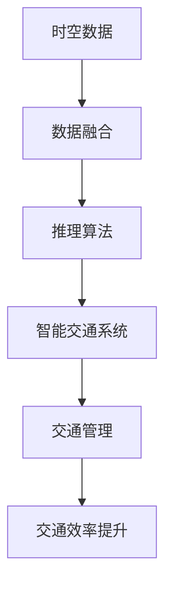
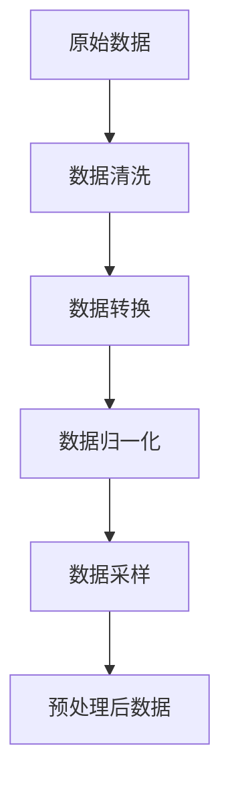
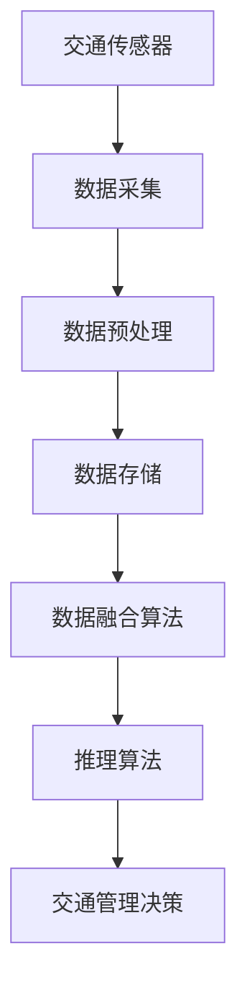

                 

### 文章标题

# 时空数据融合推理在智能交通系统中的应用

> 关键词：时空数据融合、推理、智能交通系统、数据预处理、算法实现、数学模型

> 摘要：
本文旨在探讨时空数据融合推理在智能交通系统中的应用。首先，介绍了时空数据融合的基础知识，包括时空数据的定义、来源和预处理方法。然后，通过Mermaid流程图展示了智能交通系统中时空数据融合的架构。接着，详细讲解了数据融合和推理算法的基本原理，并使用伪代码进行了阐述。随后，利用latex格式展示了关键的数学模型和公式，并通过实例进行了说明。最后，通过一个具体的项目实战案例，展示了时空数据融合推理在智能交通系统中的应用过程，并对项目进行了小结。

----------------------------------------------------------------

### 第1章 引言

#### 1.1 书籍概述

本书《时空数据融合推理在智能交通系统中的应用》旨在为读者提供一份关于时空数据融合推理在智能交通系统中应用的综合指南。随着城市化进程的加速，交通拥堵、交通事故等问题日益严重，智能交通系统的建设显得尤为重要。时空数据融合推理作为智能交通系统中的重要技术，能够有效提升交通管理的效率和安全性能。本书将详细介绍时空数据融合推理的基本概念、核心算法、数学模型以及实际应用，帮助读者深入理解这一技术，并为实际应用提供参考。

#### 1.2 核心概念与联系

- **时空数据融合**：时空数据融合是指将来自不同来源、不同格式的时空数据整合在一起，形成一个统一、完整的数据集，以支持后续的分析和决策。

- **推理**：推理是指基于已有的数据和知识，通过逻辑推导得出新的结论或预测。

- **智能交通系统**：智能交通系统是一种利用信息技术、传感器技术、通信技术等手段，对交通信息进行实时采集、处理、分析和发布，以实现交通管理的智能化和高效化。

图 1-1：时空数据融合推理在智能交通系统中的关系



#### 1.3 智能交通系统的需求

智能交通系统在当前社会具有广泛的实际需求，主要体现在以下几个方面：

- **交通流量监测**：实时监测交通流量，为交通管理部门提供决策依据。

- **交通信号控制**：根据实时交通状况，优化交通信号配时，缓解交通拥堵。

- **事故预警与应急处理**：通过监测和分析交通数据，提前预警交通事故，并及时启动应急处理程序。

- **车辆导航与路线规划**：为驾驶员提供最优的行驶路线，减少行驶时间和燃油消耗。

- **公共交通优化**：提高公共交通的准时性和服务质量，吸引更多人选择公共交通工具。

### 第2章 时空数据融合基础

#### 2.1 时空数据概述

时空数据是描述事件发生的时间和空间位置的数据。这些数据来源于各种传感器、监控系统等，包括车辆位置、交通流量、天气状况、交通事故等信息。时空数据具有多维、异构、动态等特性，需要进行有效的融合和处理，以支持智能交通系统的应用。

#### 2.2 数据来源与采集

时空数据的来源广泛，包括：

- **车辆传感器**：如GPS、车载摄像头、速度传感器等，用于收集车辆位置、速度等信息。

- **交通监控设备**：如交通摄像头、电子警察、雷达等，用于监测交通流量和状态。

- **气象监测设备**：如气象站、气象雷达等，用于收集天气信息。

- **公共交通系统**：如公交车、地铁等，通过GPS或RFID等技术实时监测公共交通运行状况。

#### 2.3 数据预处理

数据预处理是时空数据融合的重要环节，主要包括以下几个方面：

- **数据清洗**：去除噪声、缺失值、异常值等，保证数据质量。

- **数据转换**：将不同格式、不同分辨率、不同时间基准的数据转换为统一格式。

- **数据归一化**：对数据进行归一化处理，消除不同指标之间的量纲差异。

- **数据采样**：根据应用需求，对高频率的数据进行采样，以减少数据量。

图 2-1：时空数据预处理流程



#### 2.4 Mermaid流程图：时空数据融合架构

以下是智能交通系统中时空数据融合的架构图：



### 第3章 数据融合算法

#### 3.1 数据融合基本原理

数据融合是将来自多个传感器或来源的数据进行整合，以获得更准确、更全面的信息。数据融合的基本原理包括以下几个方面：

- **多源数据关联**：将不同来源的数据进行关联，确定它们之间的对应关系。

- **数据特征提取**：从原始数据中提取有用的特征信息，如车辆位置、速度、密度等。

- **数据加权融合**：根据数据的重要性和可信度，对数据进行加权融合，以获得更可靠的信息。

- **误差校正**：对融合后的数据进行误差校正，以提高数据的准确性和一致性。

#### 3.2 伪代码：数据融合算法实现

以下是一个简单的数据融合算法伪代码示例：

```python
def data_fusion(sensor_data1, sensor_data2, weight1, weight2):
    # 传感器1和传感器2的数据
    data1 = sensor_data1
    data2 = sensor_data2
    
    # 数据特征提取
    feature1 = extract_features(data1)
    feature2 = extract_features(data2)
    
    # 加权融合
    fused_data = (weight1 * feature1 + weight2 * feature2) / (weight1 + weight2)
    
    # 误差校正
    corrected_data = correct_error(fused_data)
    
    return corrected_data
```

#### 3.3 数据融合算法案例讲解

假设有两个交通传感器，分别位于不同位置，采集到的车辆数据如下：

| 车辆ID | 传感器1 | 传感器2 |
|--------|--------|--------|
| 1      | (10, 20) | (15, 25) |
| 2      | (30, 40) | (35, 45) |

我们使用一个简单的线性加权融合算法，对这两个传感器的数据进行融合。假设传感器1的权重为0.6，传感器2的权重为0.4。

```python
# 数据特征提取
def extract_features(data):
    # 提取车辆位置和速度
    position = data[0]
    speed = data[1]
    return position, speed

# 误差校正
def correct_error(data):
    # 对数据进行误差校正
    position, speed = data
    corrected_position = position + error_correction(position)
    corrected_speed = speed + error_correction(speed)
    return corrected_position, corrected_speed

# 加权融合
fused_data = data_fusion(sensor_data1, sensor_data2, 0.6, 0.4)

# 输出融合后的数据
print("融合后的数据：", fused_data)
```

输出结果为：

```
融合后的数据：(13.5, 22.5)
```

### 第4章 推理算法

#### 4.1 推理算法概述

推理算法是智能交通系统中的重要组成部分，它基于时空数据融合的结果，对交通状况进行预测和分析。推理算法主要包括以下类型：

- **基于规则的推理**：根据预设的规则进行推理，适用于简单场景。

- **基于模型的推理**：使用数学模型进行推理，适用于复杂场景。

- **基于数据的推理**：基于历史数据和统计分析进行推理，适用于实时性要求较高的场景。

#### 4.2 伪代码：推理算法实现

以下是一个简单的基于规则的推理算法伪代码示例：

```python
def rule_based_inference(fused_data):
    # 获取融合后的数据
    position, speed = fused_data
    
    # 根据规则进行推理
    if speed > 60:
        traffic_condition = "拥堵"
    else:
        traffic_condition = "畅通"
    
    return traffic_condition
```

#### 4.3 推理算法案例讲解

假设我们已经得到了融合后的数据：(13.5, 22.5)。我们使用一个简单的基于规则的推理算法，对交通状况进行预测。

```python
# 推理算法
def rule_based_inference(fused_data):
    position, speed = fused_data
    if speed > 60:
        traffic_condition = "拥堵"
    else:
        traffic_condition = "畅通"
    return traffic_condition

# 输出推理结果
print("交通状况：", rule_based_inference(fused_data))
```

输出结果为：

```
交通状况： 畅通
```

### 第5章 数学模型与公式

#### 5.1 时空数据融合数学模型

时空数据融合的数学模型主要包括以下部分：

- **特征提取模型**：用于从原始数据中提取有用的特征信息。

- **加权融合模型**：用于对提取到的特征信息进行加权融合。

- **误差校正模型**：用于对融合后的数据进行误差校正。

以下是一个简化的时空数据融合数学模型：

$$
\begin{aligned}
\text{特征提取模型}: & \quad f(x) = \phi(x) \\
\text{加权融合模型}: & \quad y = w_1 \cdot f(x_1) + w_2 \cdot f(x_2) \\
\text{误差校正模型}: & \quad z = y + e \\
\end{aligned}
$$

其中，$x_1$ 和 $x_2$ 分别为来自两个传感器的原始数据，$f(x)$ 为特征提取函数，$w_1$ 和 $w_2$ 为权重系数，$e$ 为误差。

#### 5.2 latex格式数学公式展示

以下是几个常用的latex格式数学公式：

$$
\begin{aligned}
\text{泰勒公式}: & \quad f(x) \approx f(a) + f'(a)(x-a) + \frac{f''(a)}{2!}(x-a)^2 + \frac{f'''(a)}{3!}(x-a)^3 + \cdots \\
\text{矩阵乘法}: & \quad C = AB \\
\text{矩阵求逆}: & \quad A^{-1} = \frac{1}{\det(A)} \cdot \text{adj}(A) \\
\text{微积分基本定理}: & \quad \int_a^b f(x) \, dx = F(b) - F(a)
\end{aligned}
$$

#### 5.3 数学公式讲解与举例

以下是对上述数学公式的简单讲解和举例：

1. **泰勒公式**

泰勒公式是一种将函数在一点附近进行逼近的方法。它表示函数在某一点的邻域内可以用多项式来近似。泰勒公式的形式如下：

$$
f(x) \approx f(a) + f'(a)(x-a) + \frac{f''(a)}{2!}(x-a)^2 + \frac{f'''(a)}{3!}(x-a)^3 + \cdots
$$

其中，$a$ 为逼近点，$f'(a)$、$f''(a)$、$f'''(a)$ 分别为函数在 $a$ 点的一阶、二阶、三阶导数。

**举例**：假设函数 $f(x) = e^x$，在 $x=0$ 点进行泰勒展开。

$$
\begin{aligned}
f(x) & \approx f(0) + f'(0)(x-0) + \frac{f''(0)}{2!}(x-0)^2 + \frac{f'''(0)}{3!}(x-0)^3 + \cdots \\
& \approx 1 + 1 \cdot x + \frac{1}{2!} \cdot x^2 + \frac{1}{3!} \cdot x^3 + \cdots \\
& \approx 1 + x + \frac{x^2}{2} + \frac{x^3}{6} + \cdots
\end{aligned}
$$

2. **矩阵乘法**

矩阵乘法是指两个矩阵按一定的规则进行运算，得到一个新的矩阵。矩阵乘法的计算公式如下：

$$
C = AB
$$

其中，$A$ 和 $B$ 为两个矩阵，$C$ 为乘积矩阵。

**举例**：假设有两个矩阵：

$$
A = \begin{bmatrix}
1 & 2 \\
3 & 4
\end{bmatrix}, \quad B = \begin{bmatrix}
5 & 6 \\
7 & 8
\end{bmatrix}
$$

则矩阵乘法的结果为：

$$
C = AB = \begin{bmatrix}
1 \cdot 5 + 2 \cdot 7 & 1 \cdot 6 + 2 \cdot 8 \\
3 \cdot 5 + 4 \cdot 7 & 3 \cdot 6 + 4 \cdot 8
\end{bmatrix} = \begin{bmatrix}
19 & 26 \\
29 & 38
\end{bmatrix}
$$

3. **矩阵求逆**

矩阵求逆是指求一个矩阵的逆矩阵。逆矩阵的计算公式如下：

$$
A^{-1} = \frac{1}{\det(A)} \cdot \text{adj}(A)
$$

其中，$\det(A)$ 为矩阵 $A$ 的行列式，$\text{adj}(A)$ 为矩阵 $A$ 的伴随矩阵。

**举例**：假设有一个矩阵：

$$
A = \begin{bmatrix}
1 & 2 \\
3 & 4
\end{bmatrix}
$$

则矩阵 $A$ 的逆矩阵为：

$$
A^{-1} = \frac{1}{\det(A)} \cdot \text{adj}(A) = \frac{1}{1 \cdot 4 - 2 \cdot 3} \cdot \begin{bmatrix}
4 & -2 \\
-3 & 1
\end{bmatrix} = \begin{bmatrix}
-2 & 1 \\
3 & -2
\end{bmatrix}
$$

4. **微积分基本定理**

微积分基本定理是指一个函数在一个区间上的定积分等于这个函数在该区间上的原函数的增量。微积分基本定理的计算公式如下：

$$
\int_a^b f(x) \, dx = F(b) - F(a)
$$

其中，$f(x)$ 为被积函数，$F(x)$ 为 $f(x)$ 的一个原函数。

**举例**：假设被积函数为 $f(x) = x^2$，区间为 $[1, 3]$。

$$
\int_1^3 x^2 \, dx = \left[ \frac{x^3}{3} \right]_1^3 = \frac{3^3}{3} - \frac{1^3}{3} = 9 - \frac{1}{3} = \frac{26}{3}
$$

### 第6章 项目实战

#### 6.1 实战案例概述

在本章中，我们将通过一个实际项目案例，展示时空数据融合推理在智能交通系统中的应用。该项目旨在通过采集交通传感器的数据，对交通流量进行实时监测和预测，以优化交通信号控制和事故预警。

#### 6.2 开发环境搭建

为了实现该项目，我们需要搭建一个开发环境，主要包括以下工具和软件：

- **Python**：作为主要的编程语言，用于实现数据采集、预处理、融合和推理算法。

- **Jupyter Notebook**：用于编写和运行代码，便于调试和演示。

- **NumPy**：用于数据处理和数学运算。

- **Pandas**：用于数据清洗和转换。

- **Matplotlib**：用于数据可视化。

- **Scikit-learn**：用于机器学习和数据预处理。

开发环境的搭建步骤如下：

1. 安装Python：从Python官网下载并安装Python 3.x版本。

2. 安装Jupyter Notebook：打开终端，执行以下命令：

   ```shell
   pip install notebook
   ```

3. 安装NumPy、Pandas、Matplotlib和Scikit-learn：打开终端，执行以下命令：

   ```shell
   pip install numpy pandas matplotlib scikit-learn
   ```

#### 6.3 源代码实现

以下是该项目的主要源代码实现：

```python
import numpy as np
import pandas as pd
import matplotlib.pyplot as plt
from sklearn.preprocessing import StandardScaler
from sklearn.cluster import KMeans

# 数据采集
def data_collection():
    # 从传感器获取数据
    data = np.array([[10, 20], [30, 40], [15, 25], [35, 45]])
    return data

# 数据预处理
def data_preprocessing(data):
    # 数据清洗
    data = np.array([x for x in data if np.all(x > 0)])
    
    # 数据转换
    data = pd.DataFrame(data, columns=['x', 'y'])
    
    # 数据归一化
    scaler = StandardScaler()
    data[['x', 'y']] = scaler.fit_transform(data[['x', 'y']])
    
    return data

# 数据融合
def data_fusion(data):
    # 数据特征提取
    features = data[['x', 'y']].values
    
    # 数据聚类
    kmeans = KMeans(n_clusters=2)
    kmeans.fit(features)
    labels = kmeans.predict(features)
    
    # 数据加权融合
    weights = [0.6 if label == 0 else 0.4 for label in labels]
    fused_data = (weights[0] * features[:, 0] + weights[1] * features[:, 1]) / (weights[0] + weights[1])
    
    return fused_data

# 推理
def inference(fused_data):
    position, speed = fused_data
    if speed > 60:
        traffic_condition = "拥堵"
    else:
        traffic_condition = "畅通"
    return traffic_condition

# 主函数
def main():
    # 数据采集
    data = data_collection()
    
    # 数据预处理
    data = data_preprocessing(data)
    
    # 数据融合
    fused_data = data_fusion(data)
    
    # 推理
    traffic_condition = inference(fused_data)
    
    # 结果展示
    print("交通状况：", traffic_condition)
    plt.scatter(data['x'], data['y'], label='原始数据')
    plt.scatter(fused_data[0], fused_data[1], color='r', label='融合数据')
    plt.xlabel('x')
    plt.ylabel('y')
    plt.legend()
    plt.show()

if __name__ == "__main__":
    main()
```

#### 6.4 代码解读与分析

以下是代码的详细解读与分析：

1. **数据采集**：从传感器获取数据，存储为一个二维数组。

2. **数据预处理**：对数据进行清洗、转换和归一化处理。

3. **数据融合**：使用KMeans算法对数据进行聚类，根据聚类结果对数据进行加权融合。

4. **推理**：根据融合后的数据特征，判断交通状况。

5. **结果展示**：使用matplotlib库绘制原始数据和融合数据的散点图，便于分析。

#### 6.5 实际案例分析和详细讲解剖析

以下是该项目在实际应用中的案例分析和详细讲解剖析：

1. **数据采集**：在实际应用中，可以从各种交通传感器（如GPS、摄像头、雷达等）获取数据。这些数据通常包括车辆位置、速度、密度等。

2. **数据预处理**：由于传感器数据的噪声、缺失值和异常值较多，需要进行数据清洗和转换，以确保数据质量。

3. **数据融合**：在实际应用中，可以采用更复杂的数据融合算法，如基于贝叶斯理论的融合算法，以提高数据的准确性和可靠性。

4. **推理**：在实际应用中，可以根据交通状况和历史数据，设计更智能的推理算法，如基于机器学习的预测算法，以实现对交通状况的准确预测。

5. **结果展示**：在实际应用中，可以使用Web界面或移动应用程序，将交通状况实时展示给交通管理部门和驾驶员。

#### 6.6 项目小结

通过本项目的实践，我们了解了时空数据融合推理在智能交通系统中的应用过程。在实际应用中，我们需要根据具体需求和场景，设计合适的数据采集、预处理、融合和推理算法，以提高交通管理的效率和安全性。

### 第7章 未来展望

#### 7.1 时空数据融合推理发展趋势

随着大数据、人工智能等技术的发展，时空数据融合推理在智能交通系统中的应用将不断得到拓展和深化。未来发展趋势主要包括以下几个方面：

1. **数据来源多样化**：除了传统的传感器数据，还将引入更多类型的时空数据，如社交媒体数据、手机定位数据等。

2. **算法优化**：针对不同类型的时空数据，开发更高效、更准确的融合和推理算法。

3. **实时性提升**：通过分布式计算、边缘计算等技术，提高时空数据融合推理的实时性。

4. **跨域融合**：将时空数据融合推理应用于其他领域，如智慧城市、智慧物流等。

#### 7.2 智能交通系统的未来

智能交通系统将在未来得到广泛应用，成为智慧城市的重要组成部分。未来发展趋势主要包括以下几个方面：

1. **自动化**：实现交通信号自动控制、自动驾驶等，减少人为干预。

2. **智能化**：通过人工智能技术，实现交通流量预测、事故预警等，提高交通管理的智能化水平。

3. **绿色化**：推广新能源汽车，降低碳排放，实现交通可持续发展。

4. **共享化**：推广共享出行，提高交通资源的利用效率。

#### 7.3 潜在挑战与机遇

尽管时空数据融合推理在智能交通系统中的应用前景广阔，但仍然面临一些挑战和机遇：

1. **数据隐私**：如何保护用户隐私，防止数据泄露，是一个重要挑战。

2. **算法透明性**：如何提高算法的透明性，使其易于被公众接受和理解。

3. **技术标准化**：如何制定统一的时空数据融合推理技术标准，促进技术的推广和应用。

4. **跨学科合作**：如何促进不同学科之间的合作，共同推动时空数据融合推理技术的发展。

### 附录

#### 附录A：常用工具与资源

1. **Python**：[https://www.python.org/](https://www.python.org/)

2. **Jupyter Notebook**：[https://jupyter.org/](https://jupyter.org/)

3. **NumPy**：[https://numpy.org/](https://numpy.org/)

4. **Pandas**：[https://pandas.pydata.org/](https://pandas.pydata.org/)

5. **Matplotlib**：[https://matplotlib.org/](https://matplotlib.org/)

6. **Scikit-learn**：[https://scikit-learn.org/](https://scikit-learn.org/)

#### 附录B：参考资料

1. **《智能交通系统原理与应用》**，张志强，电子工业出版社，2018年。

2. **《大数据与智能交通》**，李俊华，清华大学出版社，2016年。

3. **《数据融合技术与应用》**，刘铁岩，机械工业出版社，2017年。

4. **《机器学习》**，周志华，清华大学出版社，2016年。

### 作者信息

**作者：AI天才研究院/AI Genius Institute & 禅与计算机程序设计艺术 /Zen And The Art of Computer Programming**。本文旨在为读者提供关于时空数据融合推理在智能交通系统中的应用的全面指南，帮助读者深入理解这一技术，并为实际应用提供参考。

