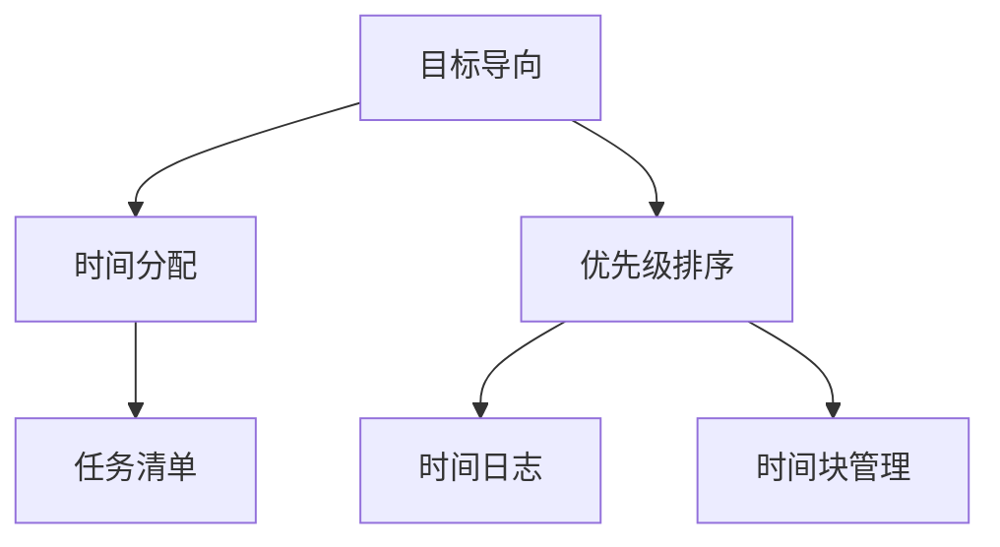

                 

### 文章标题：时间管理：有限生命中的效率与意义

### 关键词：时间管理、效率、意义、有限生命、个人成长、团队协作

### 摘要：

在当今快节奏的生活中，时间管理已经成为提高效率和实现人生意义的必备技能。本文旨在深入探讨时间管理的理论基础与实践方法，为读者提供系统化的时间管理指南。文章首先解释了时间管理的重要性，然后从个人和团队两个角度，详细阐述了时间管理的核心概念、实践技巧、心理障碍及其克服方法。最后，文章讨论了时间管理工具的运用以及如何在时间管理中找到生命的意义。通过本文，读者将能够更好地理解时间管理，并在有限的生命中实现更高的效率与意义。

## 引言：时间管理的重要性

时间管理是每个人都需要面对的课题。在有限的生命中，如何合理安排时间，最大化利用每一刻，已经成为现代生活的一个重要议题。对于个人而言，有效的时间管理不仅能够提高工作效率，还能带来更深层次的满足感和成就感。对于团队而言，时间管理是实现共同目标、提高协作效率的关键。因此，时间管理不仅关乎个人的成长，也影响着整个团队的绩效和氛围。

### 个人成长

在个人层面，时间管理是实现自我成长和目标实现的重要手段。通过科学的时间管理，个人能够更好地规划自己的学习、工作和生活，减少无效时间的浪费，提高专注度和执行力。例如，通过时间日志记录，个人可以清晰地了解自己在哪些方面花费了过多时间，从而进行有针对性的调整。此外，设定明确的目标和优先级排序，能够帮助个人更加专注地投入到重要任务中，从而提高工作效率和成就感。

### 团队协作

在团队层面，时间管理是提高团队协作效率和实现共同目标的基础。通过合理的时间分配和任务管理，团队可以避免资源的浪费，确保每个人都能在最佳状态下发挥自己的优势。例如，团队时间管理策略可以帮助团队成员明确各自的责任和任务，避免重复工作或任务延误。此外，通过有效的沟通和协作，团队可以更好地应对突发情况，提高整体应对能力。

### 时间管理的重要性总结

综上所述，时间管理在个人和团队层面都具有重要的意义。对于个人而言，它能够帮助实现自我成长和目标实现；对于团队而言，它能够提高协作效率和实现共同目标。因此，掌握有效的时间管理方法，不仅能够提高生活和工作中的效率，还能为人生带来更多的意义和价值。

## 第一部分：时间管理的理论基础与原理

### 时间管理的重要性

时间管理是一种科学的方法论，旨在通过合理分配和利用时间，实现个人和团队的目标。对于个人而言，有效的时间管理能够帮助实现自我成长、提升工作效率和生活质量。以下是时间管理对个人的几个关键影响：

1. **目标实现**：通过设定明确的目标和优先级，时间管理有助于个人明确自己的方向和重点，从而更有针对性地分配时间和精力。

2. **效率提升**：合理的时间分配能够减少无效时间的浪费，提高专注度和执行力，从而提升整体工作效率。

3. **生活质量**：通过有效管理时间，个人能够更好地平衡工作与生活，减少压力和焦虑，提高生活质量。

4. **自我成长**：时间管理是一种自我管理的能力，通过不断反思和调整，个人能够逐步提升自己的时间管理能力和综合素质。

### 时间管理的基本原理

时间管理的基本原理包括以下几个核心概念：

1. **目标导向**：时间管理的核心是明确目标。设定明确的目标是时间管理的起点，它为后续的时间分配和任务执行提供方向和依据。

2. **优先级排序**：在明确目标的基础上，对任务进行优先级排序是确保时间管理有效性的关键。通过优先级排序，个人可以确保将有限的时间和精力投入到最重要和最紧急的任务中。

3. **时间分配**：时间分配是时间管理的具体执行过程。通过合理的时间分配，个人可以确保各项任务得到充分的时间和资源支持，从而提高整体工作效率。

4. **反馈与调整**：时间管理是一个动态的过程，需要不断地进行反馈和调整。通过定期反思和总结，个人可以及时发现问题并进行优化，从而提高时间管理的有效性。

### 时间管理的核心概念

时间管理的核心概念包括：

1. **时间日志**：时间日志是记录个人时间使用情况的工具。通过时间日志，个人可以清晰地了解自己在哪些方面花费了时间，从而进行有针对性的调整。

2. **任务清单**：任务清单是记录和跟踪任务的工具。通过任务清单，个人可以确保各项任务得到及时完成，从而提高工作效率。

3. **优先级排序法**：优先级排序法是确定任务优先级的工具。常见的优先级排序法包括紧急-重要矩阵和四象限法等。

4. **时间块管理**：时间块管理是将时间分成若干固定时间段，并在每个时间段内专注于特定任务的方法。通过时间块管理，个人可以减少任务切换的干扰，提高专注度和工作效率。

### 时间管理中的理论基础架构

为了更好地理解时间管理的理论基础，我们可以使用Mermaid流程图来展示时间管理中的核心概念及其相互关系：



通过上述流程图，我们可以看到时间管理中的核心概念是如何相互关联和作用的。目标导向为时间管理提供了方向，时间分配、优先级排序、任务清单和时间块管理则是实现目标的具体手段。

### 时间管理的基本原理讲解与伪代码示例

为了深入理解时间管理的基本原理，我们可以通过一个简单的伪代码示例来展示时间管理的流程：

```pseudo
function timeManagement():
    // 设定目标
    setGoals()

    // 记录时间日志
    logTime()

    // 确定优先级
    prioritizeTasks()

    // 分配时间
    allocateTime()

    // 执行任务
    executeTasks()

    // 反馈与调整
    feedbackAndAdjust()
```

在这个伪代码示例中，`setGoals()` 代表设定目标，`logTime()` 代表记录时间日志，`prioritizeTasks()` 代表确定优先级，`allocateTime()` 代表时间分配，`executeTasks()` 代表执行任务，`feedbackAndAdjust()` 代表反馈与调整。这些步骤构成了一个完整的时间管理流程。

### 数学模型与公式

在时间管理中，数学模型和公式可以用于量化时间分配和任务优先级。以下是一个简单的数学模型，用于计算任务完成时间：

$$
T_c = \frac{T_p}{P}
$$

其中，$T_c$ 表示任务完成时间，$T_p$ 表示任务所需时间，$P$ 表示任务优先级。优先级越高，任务完成时间越短。

通过上述公式，我们可以根据任务的优先级来调整任务完成时间，从而确保高优先级的任务得到优先处理。

### 实例说明

为了更好地理解时间管理的原理和应用，我们可以通过一个实际案例来讲解。假设一位程序员需要在两天内完成三个任务：编写代码、测试代码和撰写技术文档。

1. **设定目标**：程序员的目标是确保三个任务都在规定时间内完成。

2. **记录时间日志**：程序员记录了每个任务所需的时间，分别为：编写代码（4小时），测试代码（3小时），撰写技术文档（2小时）。

3. **确定优先级**：根据任务的紧急程度和重要性，程序员将任务分为三个优先级：编写代码（最高优先级，1），测试代码（中等优先级，2），撰写技术文档（最低优先级，3）。

4. **时间分配**：程序员将时间分成两天，每天8小时。根据优先级，首先完成编写代码（4小时），然后测试代码（3小时），最后撰写技术文档（2小时）。

5. **执行任务**：程序员按照预定计划完成所有任务。

6. **反馈与调整**：完成任务后，程序员评估任务完成的质量和效率，并根据反馈进行必要的调整。

通过这个案例，我们可以看到时间管理在任务完成过程中的关键作用。合理的时间分配和优先级排序能够确保任务高效、有序地完成。

### 时间管理的重要性总结

综上所述，时间管理是一种科学的方法论，对个人和团队都有着重要的意义。通过明确目标、优先级排序、时间分配和反馈调整，个人和团队可以更好地利用时间，提高工作效率和生活质量。掌握时间管理的基本原理和方法，不仅能够帮助个人实现自我成长，还能为团队协作和共同目标的实现提供有力支持。

## 第二部分：个人时间管理实践方法

### 时间日志记录

时间日志记录是个人时间管理的重要基础。通过记录每天的时间使用情况，个人可以清晰地了解自己的时间分配情况，从而发现时间浪费的环节，并作出相应的调整。

### 步骤：

1. **选定时间日志工具**：可以选择纸质笔记本、电子表格或专业的时间管理应用程序。例如，可以使用Toggl或RescueTime等工具来记录和跟踪时间。

2. **每天记录**：在每天结束时，记录当天的所有活动，包括工作、学习、娱乐、休息等。确保记录的时间准确无误，并标注每个活动的具体时间。

3. **定期回顾**：每周或每月对时间日志进行回顾，分析时间使用情况，识别哪些活动占据了过多的时间，哪些活动效率不高。

### 实例：

假设一位程序员每天的工作时间是从早上9点到下午5点，工作时长为8小时。通过时间日志记录，他发现自己每天有2小时的邮件处理时间，这让他感到时间被大量浪费。经过分析，他决定将邮件处理时间限制在30分钟以内，并将剩余时间用于更重要的任务。

### 目标设定

设定明确的目标是时间管理的关键。SMART法则（具体、可衡量、可实现、相关、有时限）是设定目标的有效方法。

### SMART法则：

1. **具体（Specific）**：目标要明确具体，避免模糊不清。例如，设定“增加每月收入”的目标不如设定“增加每月收入2000元”的目标具体。

2. **可衡量（Measurable）**：目标要有明确的衡量标准，以便评估进展和完成情况。例如，设定“每天学习编程3小时”的目标是可衡量的。

3. **可实现（Achievable）**：目标要实际可行，避免设定过高或过低的目标。例如，设定“每天学习编程10小时”的目标可能不切实际。

4. **相关（Relevant）**：目标要与个人目标和生活规划相关，避免分散精力。例如，设定“提升身体健康”的目标与学习编程的目标相关。

5. **有时限（Time-bound）**：目标要有明确的时限，避免拖延。例如，设定“在六个月内通过编程考试”的目标是有时限的。

### 实例：

一位大学生希望提升编程技能，他设定了一个具体、可衡量、可实现、相关且有时限的目标：“在接下来三个月内，通过每天学习编程2小时，掌握Python编程基础。”

### 优先级排序

优先级排序是确保时间管理有效性的关键。通过优先级排序，个人可以确保将有限的时间和精力投入到最重要和最紧急的任务中。

### 方法：

1. **紧急-重要矩阵**：将任务分为四个象限，分别是紧急且重要、紧急但不重要、不紧急但重要、不紧急且不重要。重点处理紧急且重要的任务，尽量减少紧急但不重要的任务，同时关注不紧急但重要的任务，避免不紧急也不重要的任务。

2. **四象限法**：与紧急-重要矩阵类似，但更注重任务的重要性和紧急性。紧急且重要的任务放在第一象限，不紧急但重要的任务放在第二象限，紧急但不重要的任务放在第三象限，不紧急也不重要的任务放在第四象限。

### 实例：

假设一位职场新人有以下任务：

- 完成项目报告（紧急且重要）
- 参加公司会议（紧急但不重要）
- 学习新技能（不紧急但重要）
- 清理办公桌（不紧急也不重要）

根据紧急-重要矩阵，他首先完成项目报告，然后参加会议，接着学习新技能，最后清理办公桌。

### 时间块管理

时间块管理是一种将时间分成若干固定时间段，并在每个时间段内专注于特定任务的方法。通过时间块管理，个人可以减少任务切换的干扰，提高专注度和工作效率。

### 步骤：

1. **设定时间块**：将一天分成若干时间块，每个时间块为1小时或30分钟。例如，可以将一天分为上午8点到12点、下午1点到5点两个大时间块。

2. **专注任务**：在每个时间块内，专注于一项任务，尽量避免中断。例如，在上午8点到10点的时间块内专注于编写代码，10点到11点专注于测试代码，11点到12点专注于邮件处理。

3. **休息与调整**：在每个时间块结束后，进行短暂的休息和调整，以保持精力充沛。

### 实例：

假设一位销售人员的一天分为三个时间块：

- 上午8点到10点：准备销售报告
- 下午1点到3点：与客户会议
- 下午3点到5点：跟进潜在客户

通过时间块管理，销售人员能够在每个时间块内专注于特定的任务，从而提高工作效率。

### 建立时间管理习惯

建立时间管理习惯是确保时间管理持续有效的重要手段。通过以下方法，个人可以逐步培养时间管理习惯：

1. **从小事做起**：从简单的事务开始，例如每天记录时间日志、设定小目标等，逐步养成时间管理习惯。

2. **持续监督**：通过定期回顾时间日志和目标完成情况，持续监督和调整时间管理策略。

3. **寻求支持**：与他人分享时间管理经验，寻求支持和反馈，共同进步。

4. **设定奖励**：为完成时间管理目标设定奖励，激励自己坚持。

### 实例：

一位学生通过记录时间日志发现，每天有2小时的时间被浪费在社交媒体上。他决定将这2小时用于学习新技能。通过持续监督和调整，他成功地将学习时间从每周2小时增加到每周4小时。

### 个人时间管理实践方法总结

通过时间日志记录、目标设定、优先级排序、时间块管理和建立时间管理习惯，个人可以更好地管理自己的时间，提高工作效率和生活质量。掌握这些实践方法，不仅有助于实现个人目标，还能为未来的职业发展奠定坚实基础。

## 第三部分：团队时间管理策略

### 团队时间管理的重要性

在团队工作中，时间管理不仅是个人的需求，更是团队协作和项目成功的关键。有效的团队时间管理能够提高整体工作效率，减少资源浪费，确保项目按时完成，同时提升团队成员的工作满意度和团队凝聚力。

### 团队时间管理的基本原理

团队时间管理的基本原理与个人时间管理类似，但更注重团队协作和资源整合。以下是团队时间管理的关键原则：

1. **明确目标**：团队需要共同明确项目目标和里程碑，确保所有成员对目标有清晰的理解和认同。

2. **任务分配**：根据团队成员的能力和职责，合理分配任务，确保每个人都能在最佳状态下发挥自己的优势。

3. **优先级排序**：团队需要共同确定任务的优先级，确保资源优先投入到最重要和最紧急的任务中。

4. **时间跟踪**：通过工具或方法，记录和跟踪团队时间使用情况，及时发现和解决时间浪费的问题。

5. **定期回顾**：团队需要定期回顾时间管理的效果，评估项目进度和资源利用情况，并根据反馈进行必要的调整。

### 团队时间管理的具体方法

为了确保团队时间管理的有效性，可以采取以下具体方法：

1. **工作计划会议**：定期召开工作计划会议，讨论项目进展、任务分配和优先级排序，确保团队成员对项目有清晰的认识和行动计划。

2. **任务分解**：将大型任务分解成小任务，并为每个任务设定明确的完成时间和责任人，从而提高任务的执行效率和透明度。

3. **使用项目管理工具**：使用如Jira、Trello等项目管理工具，可以更好地跟踪任务进度、资源利用和时间管理。

4. **时间块管理**：团队可以采用时间块管理方法，将工作时间分成多个时间段，并在每个时间段内专注于特定的任务，减少任务切换的干扰。

5. **定期进度报告**：团队成员需要定期提交进度报告，总结工作成果、遇到的问题和需要支持的地方，确保团队及时调整和优化时间管理策略。

### 团队时间管理案例

以下是一个团队时间管理的实际案例：

**项目背景**：一个软件开发团队需要在一个季度内完成一个新产品的开发。

**步骤**：

1. **明确目标**：团队确定了项目的总体目标，包括产品功能、发布日期和性能指标。

2. **任务分解**：将项目分解成多个子任务，如需求分析、设计、编码、测试等，并为每个子任务设定明确的完成时间和责任人。

3. **工作计划会议**：每周召开工作计划会议，讨论任务进展、资源分配和时间管理策略。

4. **使用项目管理工具**：团队使用Jira进行任务跟踪和进度管理，确保每个任务都有明确的负责人和进度。

5. **时间块管理**：团队采用时间块管理方法，将工作时间分为上午、下午和晚上三个时间块，每个时间块专注于特定的任务。

6. **定期进度报告**：团队成员每周提交进度报告，总结工作成果和遇到的问题，团队负责人根据报告进行项目调整和资源分配。

**结果**：通过有效的团队时间管理，团队在一个季度内成功完成了新产品的开发，并在预定时间内发布了产品。团队成员的工作满意度和团队凝聚力也得到了显著提升。

### 团队时间管理的重要性总结

团队时间管理对于项目成功和团队协作至关重要。通过明确目标、任务分解、使用项目管理工具和时间块管理，团队可以确保资源高效利用，任务按时完成，从而提高整体工作效率和团队满意度。有效的团队时间管理不仅有助于实现项目目标，还能为团队成员的个人成长和职业发展提供有力支持。

## 第四部分：时间管理心理学

### 时间管理中的心理障碍

时间管理不仅需要方法和技术，还需要克服各种心理障碍。这些障碍往往是我们有效管理时间的最大阻碍，因此理解并克服这些障碍至关重要。

#### 1. 时间幻觉

时间幻觉是指人们对时间的感知与实际时间不一致的现象。例如，人们往往感觉时间过得很快，尤其是在忙碌或愉快的时刻。时间幻觉会导致时间管理失效，因为人们无法准确判断任务所需的时间。

**解决方法**：

- **使用定时器**：设定定时器来提醒自己任务的时间限制，增强时间感知。
- **记录时间日志**：通过记录时间日志，了解任务的实际耗时，逐渐纠正时间幻觉。

#### 2. 拖延症

拖延症是指人们推迟或延迟完成任务的现象。拖延不仅会浪费大量时间，还会导致任务质量下降和压力增加。

**解决方法**：

- **设定明确的目标和截止日期**：明确的目标和截止日期有助于激发动力，减少拖延。
- **使用番茄工作法**：将工作时间分成25分钟的工作周期和5分钟的休息时间，有助于提高专注力和减少拖延。

#### 3. 优先级混乱

优先级混乱是指人们在任务繁多时无法准确判断哪些任务更重要或更紧急。这会导致时间和资源的不合理分配，影响整体工作效率。

**解决方法**：

- **使用紧急-重要矩阵**：将任务分为紧急且重要、紧急但不重要、不紧急但重要、不紧急且不重要四个象限，有针对性地处理不同类型的任务。
- **设定明确的优先级**：为每个任务设定优先级，确保优先处理最重要和最紧急的任务。

#### 4. 多任务处理

多任务处理是指同时处理多个任务的现象。虽然看似提高了效率，但实际上会导致注意力分散，降低任务质量和速度。

**解决方法**：

- **专注单一任务**：在一段时间内专注于单一任务，提高专注度和工作效率。
- **使用时间块管理**：将时间分成若干固定时间段，在每个时间段内专注于特定任务，减少任务切换的干扰。

### 时间感知的影响

时间感知对时间管理有着重要影响。人们对时间的感知不同，会导致时间管理策略的效果差异。以下因素会影响时间感知：

#### 1. 任务复杂度

复杂任务往往需要更多时间，而且人们对其耗时估计也往往较为保守。这会导致任务完成后产生满足感，但同时也可能低估其他任务的时间需求。

**解决方法**：

- **分解任务**：将复杂任务分解成小任务，逐步完成，减少对时间的低估。
- **设定时间限制**：为每个任务设定时间限制，提高时间管理的效率。

#### 2. 心理压力

心理压力会影响时间感知。在高压力环境下，人们往往感觉时间过得很慢，这会降低时间管理的效果。

**解决方法**：

- **放松身心**：通过运动、冥想或休息来缓解压力，提高时间感知的准确性。
- **设定合理的期望**：设定合理的目标和期望，避免过度压力和时间感知误差。

### 心理学在时间管理中的应用

心理学在时间管理中的应用包括多种方法和工具，旨在帮助人们更好地理解和管理时间。

#### 1. 目标设定理论

目标设定理论认为，明确、具体和有挑战性的目标能够提高个体的自我管理和执行力。通过设定目标，个体可以明确自己的方向，提高时间管理的效率和效果。

#### 2. 自我监控与反馈

自我监控与反馈是一种通过记录和反思自己的行为，来调整和优化时间管理策略的方法。通过定期回顾时间日志和任务完成情况，个体可以及时发现和解决问题，提高时间管理能力。

#### 3. 情绪调节

情绪调节在时间管理中至关重要。通过调节情绪，个体可以保持积极的心态，提高专注力和工作效率。方法包括深呼吸、冥想和积极心态的培养。

### 心理学在时间管理中的实例

以下是一个心理学在时间管理中的实际案例：

**案例背景**：一位职场新人经常感到时间不够用，任务完成质量也较低。

**步骤**：

1. **设定目标**：明确每周的工作目标和时间分配，例如每天完成一定的任务量，每周完成一定的项目进度。

2. **自我监控与反馈**：每天记录工作时间和任务完成情况，每周进行回顾和总结，识别时间浪费和任务完成质量较低的原因。

3. **情绪调节**：通过冥想和深呼吸来缓解工作压力，保持积极心态。

4. **调整策略**：根据自我监控和反馈的结果，调整时间管理和任务优先级排序策略，提高工作效率和质量。

**结果**：通过以上方法，职场新人的时间管理能力得到了显著提升，任务完成质量也提高了，工作满意度也随之增加。

### 时间管理心理学总结

时间管理心理学关注人们在时间管理中的心理障碍、时间感知的影响以及如何通过心理学方法提高时间管理能力。通过理解这些心理学因素，个体可以更有效地管理时间，提高工作效率和生活质量。掌握心理学在时间管理中的应用，不仅有助于解决实际问题，还能为个人的长期发展和职业成长提供有力支持。

## 第五部分：时间管理技术与工具

### 常见的时间管理工具

在现代工作中，有许多时间管理工具可以帮助个人和团队提高效率。以下是一些常见的时间管理工具及其特点：

#### 1. 日历工具

**特点**：日历工具可以帮助个人和团队安排日程、设置提醒和跟踪重要事件。

**常用工具**：Google Calendar、Microsoft Outlook、Apple Calendar

**优势**：方便快捷，易于操作，可以与手机、电脑和其他设备同步。

#### 2. 事务管理工具

**特点**：事务管理工具可以帮助个人和团队记录任务、分配任务和跟踪进度。

**常用工具**：Trello、Asana、Jira

**优势**：任务可视化，便于团队协作，可以设置提醒和截止日期。

#### 3. 时间跟踪工具

**特点**：时间跟踪工具可以帮助个人和团队记录工作时间和任务耗时，分析时间使用情况。

**常用工具**：Toggl、RescueTime、Harvest

**优势**：提高时间透明度，帮助发现时间浪费点，优化时间管理策略。

#### 4. 时间块管理工具

**特点**：时间块管理工具可以帮助个人和团队将时间分成若干固定时间段，并专注于特定任务。

**常用工具**：Focus@Will、Tomato Timer、Pomodoro Timer

**优势**：减少任务切换的干扰，提高专注度和工作效率。

### 工具使用技巧和最佳实践

为了最大化地利用时间管理工具，以下是一些使用技巧和最佳实践：

#### 1. 选择合适的工具

根据个人或团队的需求，选择最适合的工具。例如，对于需要高度协作的团队，可以选择Trello或Asana；对于需要详细时间记录的个人，可以选择Toggl或RescueTime。

#### 2. 完善工具设置

在开始使用工具之前，确保工具的设置符合个人或团队的需求。例如，设置任务优先级、提醒和截止日期等。

#### 3. 定期更新和回顾

定期更新工具中的任务和日程，确保信息的准确性和及时性。同时，定期回顾工具使用情况，分析时间管理效果，并作出相应的调整。

#### 4. 与其他工具集成

将时间管理工具与其他工具（如电子邮件、日历、文档编辑等）集成，以便更高效地管理任务和工作流程。

#### 5. 提供培训和指导

为团队成员提供时间管理工具的培训和指导，确保他们能够熟练使用工具，并充分发挥其优势。

### 时间管理工具的示例

以下是一个时间管理工具的示例：

**工具**：Trello

**应用场景**：团队项目管理和任务分配

**步骤**：

1. **创建项目看板**：在Trello中创建一个项目看板，包括任务列表、看板列表和看板卡片。

2. **分配任务**：将任务分配给团队成员，并设置任务优先级和截止日期。

3. **跟踪进度**：团队成员在完成任务后，将任务卡片拖动到相应的完成状态。

4. **定期回顾**：每周或每月回顾项目进展和任务完成情况，分析时间管理效果。

**结果**：通过Trello，团队可以清晰地了解项目进度和任务状态，提高协作效率和工作透明度。

### 工具使用技巧和最佳实践总结

掌握时间管理工具的使用技巧和最佳实践，可以帮助个人和团队更高效地管理时间和任务。选择合适的工具、完善工具设置、定期更新和回顾、与其他工具集成以及提供培训和指导，都是实现高效时间管理的重要手段。通过这些方法和工具，个人和团队可以更好地实现目标，提高工作效率和生活质量。

## 第六部分：案例分析与讨论

### 案例背景

某初创公司计划在三个月内开发一款移动应用。团队成员包括项目经理、前端开发人员、后端开发人员、UI设计师和测试工程师。由于时间和资源有限，公司决定通过有效的团队时间管理策略，确保项目按时完成。

### 案例步骤

1. **目标设定**：
   - 项目目标：在三个月内完成移动应用的开发，包括功能实现、UI设计、测试和发布。
   - 团队目标：确保每个成员明确自己的任务和责任，提高协作效率。

2. **任务分解**：
   - 将项目分解为多个子任务，如需求分析、设计、前端开发、后端开发、测试和发布。
   - 为每个子任务设定明确的完成时间和责任人。

3. **使用项目管理工具**：
   - 使用Trello进行任务跟踪和进度管理，确保每个任务都有明确的负责人和进度。
   - 使用Jira记录和跟踪Bug，确保测试环节的顺利进行。

4. **时间块管理**：
   - 采用时间块管理方法，将工作时间分成若干固定时间段，每个时间段内专注于特定任务。
   - 每个团队成员按照时间块安排任务，确保工作的高效进行。

5. **定期进度报告**：
   - 每周召开团队会议，讨论任务进展、资源利用和时间管理效果。
   - 团队成员提交进度报告，总结工作成果和遇到的问题。

6. **反馈与调整**：
   - 根据进度报告和团队反馈，及时调整任务分配和时间管理策略。
   - 处理项目中出现的问题，确保项目进度不受影响。

### 结果

通过有效的团队时间管理策略，该公司成功地在三个月内完成了移动应用的开发。团队成员的工作效率得到了显著提升，任务完成质量也达到了预期。以下是具体的案例结果：

1. **任务完成情况**：
   - 需求分析、设计、前端开发、后端开发和测试等任务均按时完成。
   - 发布后的用户反馈良好，应用获得了较高的用户满意度。

2. **资源利用**：
   - 合理分配了团队成员的时间和精力，避免了资源浪费。
   - 通过时间块管理，减少了任务切换的干扰，提高了专注度和工作效率。

3. **团队协作**：
   - 团队成员之间的协作更加顺畅，信息传递更加高效。
   - 定期进度报告和团队会议，确保了项目进度的透明度和可控性。

4. **个人成长**：
   - 通过项目实践，团队成员的时间管理能力和协作能力得到了显著提升。
   - 每个成员都能够在项目中发挥自己的优势，实现个人价值和职业成长。

### 案例总结

通过这个案例，我们可以看到有效的团队时间管理策略在项目成功中的关键作用。通过明确目标、任务分解、使用项目管理工具、时间块管理和定期反馈，团队不仅能够提高工作效率和资源利用，还能增强团队协作和个人成长。这个案例为我们提供了一个实用的团队时间管理模型，值得其他团队借鉴和推广。

## 第七部分：时间管理与人生意义

### 时间管理与人生意义的关系

时间管理不仅是提高效率和实现目标的工具，更是实现人生意义的途径。在有限的生命中，通过有效的时间管理，个人可以更好地发现和追求自己的目标和价值观，从而找到生命的意义。

#### 1. 目标实现与自我价值

时间管理有助于明确个人目标和规划，通过合理分配时间，个人可以专注于实现自己的目标，从而实现自我价值。例如，一位热衷于编程的年轻人，通过设定学习目标、制定计划和时间管理，不断提升自己的编程技能，最终实现自己的职业梦想。

#### 2. 时间平衡与生活质量

时间管理不仅关注工作效率，还关注生活质量。通过有效管理时间，个人可以更好地平衡工作与生活，减少压力和焦虑，提高生活质量。例如，一位职场人士通过时间管理，合理规划工作时间和休息时间，不仅完成了工作任务，还享受到了家庭生活和个人爱好，实现了工作与生活的平衡。

#### 3. 时间投资与未来规划

时间管理是一种对未来的投资。通过合理规划时间，个人可以提前做好准备，为未来的挑战和机遇做好准备。例如，一位年轻人通过时间管理，提前学习投资知识，为未来的财务自由打下基础。

#### 4. 时间奉献与人生意义

时间管理还可以帮助个人实现对他人的奉献，从而找到生命的意义。通过参与志愿活动、帮助他人、为社会贡献力量，个人可以在时间管理中实现更深层次的人生意义。例如，一位医生通过时间管理，合理安排工作时间，积极参与志愿服务，为社会健康事业贡献自己的力量。

### 时间管理与人生意义的实践方法

为了在时间管理中找到人生意义，个人可以采取以下实践方法：

#### 1. 确定自己的人生目标

明确的人生目标是时间管理的基础。通过设定长期和短期目标，个人可以更好地规划时间和资源，为实现人生意义而努力。

#### 2. 建立时间价值观

根据自己的价值观和生活目标，建立适合自己的时间价值观。例如，注重工作与生活平衡的人可以选择更多时间陪伴家人，注重个人成长的人可以选择更多时间学习和发展自己。

#### 3. 设定优先级

在日常生活中，根据优先级排序任务和活动。将时间和精力投入到最重要和最有意义的事情上，从而实现人生价值。

#### 4. 培养自律和习惯

自律和习惯是有效时间管理的关键。通过培养自律和习惯，个人可以更好地控制自己的时间，减少拖延和浪费时间的情况。

#### 5. 反思和调整

定期反思和调整自己的时间管理策略，确保其与自己的目标和价值观保持一致。通过反思，个人可以更好地发现和实现人生意义。

### 人生意义的时间管理案例

以下是一个在时间管理中实现人生意义的案例：

**案例背景**：一位年过四十的职场人士，意识到自己多年来一直在追求事业上的成功，却忽略了家庭和健康。为了找到人生意义，他决定重新规划自己的时间和生活。

**步骤**：

1. **确定人生目标**：设定了长期目标，包括在职业上实现更高的成就、陪伴家人、保持健康和参与志愿活动。

2. **建立时间价值观**：将家庭和健康放在首位，将职业发展视为实现人生意义的手段。

3. **设定优先级**：重新安排工作时间和家庭时间，确保每周有足够的家庭互动时间和锻炼时间。

4. **培养自律和习惯**：通过设定每天的时间计划，保持工作与生活的平衡。

5. **反思和调整**：定期反思自己的时间管理策略，根据实际情况进行调整。

**结果**：通过重新规划时间和生活，这位职场人士不仅实现了职业上的更高成就，还建立了更加和谐的家庭关系，保持了良好的健康状况，并在社区中积极参与志愿活动。他找到了自己人生的意义，实现了工作与生活的平衡。

### 时间管理与人生意义总结

时间管理不仅是提高效率和实现目标的工具，更是实现人生意义的途径。通过明确人生目标、建立时间价值观、设定优先级、培养自律和习惯以及反思和调整，个人可以在有限的生命中找到更深层次的人生意义。有效的时间管理不仅有助于实现个人目标，还能为家庭、社会和人类文明做出贡献，从而实现更高层次的人生价值。

## 结论

通过本文的探讨，我们可以看到时间管理在有限生命中的重要性。无论是个人还是团队，有效的时间管理都是提高效率和实现目标的关键。本文从理论基础、实践方法、心理学应用、技术工具、案例分析以及人生意义等多个角度，深入阐述了时间管理的各个方面。掌握时间管理的方法和技巧，不仅能够帮助我们在快节奏的生活中保持平衡，还能为我们的职业生涯和个人成长提供坚实的基础。

### 作者信息

作者：AI天才研究院/AI Genius Institute & 禅与计算机程序设计艺术 /Zen And The Art of Computer Programming

### 拓展阅读

- 《高效能人士的七个习惯》史蒂芬·柯维
- 《时间管理手册》盖瑞·凯尔索
- 《时间管理的艺术》戴维·艾伦
- 《深度工作》卡尔·纽波特

通过阅读这些书籍，读者可以进一步深入理解时间管理的本质，并在实践中不断提升自己的时间管理能力。希望本文能够为您的职业生涯和生活带来启发和帮助。

