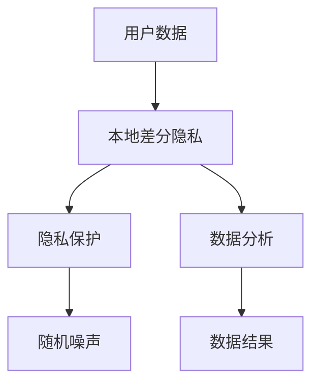

                 

### 文章标题

# 本地差分隐私在智能手机数据收集中的应用

### 文章关键词

- 本地差分隐私
- 智能手机数据收集
- 数据隐私保护
- 差分隐私机制
- 智能健康监控
- 个性化推荐

### 文章摘要

本文深入探讨了本地差分隐私在智能手机数据收集中的应用。随着智能手机的普及，用户产生的数据量呈指数级增长，如何保护这些数据的隐私成为关键问题。本地差分隐私作为一种数据隐私保护技术，能够在不泄露用户隐私的情况下，帮助开发者收集和分析数据。本文将介绍本地差分隐私的基本概念、技术原理，并分析其在智能手机数据收集中的应用，最后探讨实现本地差分隐私的挑战与未来方向。

### 目录

1. **背景介绍**
   1.1 **智能手机数据收集的重要性**
   1.2 **数据隐私泄露的风险**
   1.3 **本地差分隐私的背景**

2. **核心概念与联系**
   2.1 **本地差分隐私的定义**
   2.2 **核心概念之间的关系架构**

3. **核心算法原理讲解**
   3.1 **Laplace机制**
   3.2 **Gaussian机制**
   3.3 **其他机制**

4. **数学模型与公式讲解**
   4.1 **差分隐私的衡量标准**
   4.2 **数学模型的应用举例**

5. **项目实战**
   5.1 **开发环境搭建**
   5.2 **源代码实现与解读**
   5.3 **实际案例分析**

6. **最佳实践与注意事项**
   6.1 **数据收集的隐私保护策略**
   6.2 **实现本地差分隐私的挑战**

7. **总结与拓展阅读**

### 背景介绍

随着移动互联网的快速发展，智能手机已经成为人们日常生活中不可或缺的一部分。智能手机不仅为用户提供了丰富的应用和服务，还产生了大量的数据。这些数据包括用户的位置信息、通话记录、应用使用习惯等，涵盖了用户的隐私信息。因此，如何有效地收集、处理和使用这些数据，同时保护用户的隐私，成为当前研究的热点。

1.1 **智能手机数据收集的重要性**

智能手机数据收集的重要性体现在多个方面。首先，数据收集为开发者提供了深入了解用户行为和需求的机会，有助于优化产品和服务。例如，通过分析用户的应用使用习惯，开发者可以推出更符合用户需求的个性化功能。其次，数据收集为智能健康监控、定位服务、个性化推荐等应用提供了基础。例如，通过收集用户的健康数据，智能健康监控应用可以为用户提供个性化的健康建议。

然而，智能手机数据收集也带来了巨大的隐私风险。由于数据量庞大且涉及个人隐私，一旦数据泄露，可能导致严重的后果，如身份盗用、财产损失等。因此，如何在保证数据收集和应用价值的同时，保护用户隐私，成为一项重要任务。

1.2 **数据隐私泄露的风险**

数据隐私泄露的风险主要来自以下几个方面：

- **恶意攻击**：黑客可能会通过入侵系统、窃取数据库等方式获取用户数据。
- **内部泄露**：内部员工或合作伙伴可能因不当行为或泄露数据。
- **信息整合**：不同来源的数据可能被整合，从而揭示用户的隐私信息。
- **算法滥用**：开发者可能滥用数据，进行非法的监控或分析。

1.3 **本地差分隐私的背景**

本地差分隐私（Local Differential Privacy，LDP）是一种数据隐私保护技术，旨在在不泄露用户隐私的情况下，允许数据分析。与传统的隐私保护方法不同，本地差分隐私在数据收集阶段就进行隐私保护，避免了数据泄露的风险。本地差分隐私的提出，为智能手机数据收集提供了一个可行的解决方案。

本地差分隐私的基本思想是：通过对数据添加随机噪声，使得单个数据点的隐私信息无法被揭示，同时保证数据分析的整体准确性和有效性。本地差分隐私的研究和应用，不仅有助于保护用户隐私，还能促进数据价值的最大化。

### 核心概念与联系

在深入探讨本地差分隐私之前，我们需要了解几个核心概念，并分析它们之间的关系。

2.1 **本地差分隐私的定义**

本地差分隐私是一种隐私保护技术，它确保在处理数据时，无法通过观察数据的微小变化来推断出单个数据点的真实值。具体来说，如果有一个数据库D，其中包含n个数据点，那么本地差分隐私要求对于任何两个接近的数据库D'和D''（D'和D''之间只有一个数据点的差异），对D'和D''进行数据分析的结果是相似的，即无法区分这两个数据库。

2.2 **核心概念之间的关系架构**

为了更好地理解本地差分隐私，我们可以使用Mermaid流程图来展示核心概念之间的关系：



- **用户数据**：这是本地差分隐私的起点，包括智能手机收集的各种数据，如位置、通话记录等。
- **本地差分隐私**：通过在数据添加随机噪声，实现对用户隐私的保护。
- **隐私保护**：确保单个数据点的隐私信息不被泄露，同时保证数据分析的准确性。
- **数据分析**：在保护用户隐私的前提下，对数据进行分析，以提取有价值的信息。
- **随机噪声**：这是实现本地差分隐私的关键技术，通过添加噪声，使得数据分析结果无法揭示单个数据点的真实值。
- **数据结果**：经过本地差分隐私处理后的数据分析结果，它既保留了数据的分析价值，又保证了用户隐私。

通过上述关系架构，我们可以清晰地看到本地差分隐私在数据收集、处理和分析中的重要作用。

### 核心算法原理讲解

本地差分隐私的实现依赖于一系列算法原理，这些算法通过添加随机噪声来保护用户隐私。以下是几种常见的本地差分隐私算法原理。

3.1 **Laplace机制**

Laplace机制是本地差分隐私中最常用的算法之一，它基于Laplace分布来添加随机噪声。Laplace分布的概率密度函数为：

\[ f(x; \alpha, b) = \frac{1}{2\alpha} \exp\left(-\frac{|x - b|}{\alpha}\right) \]

其中，\(\alpha\)是噪声的强度，\(b\)是添加噪声的位置。

为了实现本地差分隐私，Laplace机制对数据进行如下处理：

```python
import numpy as np

def laplace Mechanism(data, alpha):
    noise = np.random.laplace(size=data.shape, loc=0, scale=alpha)
    return data + noise
```

在上述代码中，`data` 是原始数据，`alpha` 是噪声强度。通过添加Laplace噪声，我们可以保护数据的隐私，同时保持数据分析的准确性。

3.2 **Gaussian机制**

Gaussian机制是基于高斯分布（正态分布）的本地差分隐私算法。高斯分布的概率密度函数为：

\[ f(x; \mu, \sigma^2) = \frac{1}{\sqrt{2\pi\sigma^2}} \exp\left(-\frac{(x - \mu)^2}{2\sigma^2}\right) \]

其中，\(\mu\) 是均值，\(\sigma^2\) 是方差。

Gaussian机制对数据的处理如下：

```python
import numpy as np

def gaussian_Mechanism(data, mean, variance):
    noise = np.random.normal(loc=mean, scale=np.sqrt(variance), size=data.shape)
    return data + noise
```

在上述代码中，`data` 是原始数据，`mean` 是均值，`variance` 是方差。通过添加高斯噪声，我们可以实现数据的本地差分隐私。

3.3 **其他机制**

除了Laplace机制和Gaussian机制，还有其他一些本地差分隐私算法，如Bernoulli机制、Uniform机制等。这些机制的选择取决于具体的应用场景和数据分析需求。

- **Bernoulli机制**：基于伯努利分布的机制，适用于二值数据。
- **Uniform机制**：基于均匀分布的机制，适用于连续数据。

每种机制都有其特定的适用场景和优缺点，开发者可以根据实际情况选择合适的机制。

### 数学模型与公式讲解

本地差分隐私的实现不仅依赖于算法原理，还需要数学模型的支持。以下是本地差分隐私的一些关键数学模型和公式。

4.1 **差分隐私的衡量标准**

差分隐私的衡量标准通常用ε（epsilon）表示，称为ε-差分隐私。ε值的大小反映了隐私保护的程度，ε越大，隐私保护越强。

一个随机算法A对于数据库D满足ε-差分隐私，如果对于任意的两个接近的数据库D'和D''（D'和D''之间只有一个数据点的差异），算法A输出的结果概率分布之间差异的比值不超过1/ε。

数学公式表示为：

\[ \text{Pr}(A(D) \in S) \leq \text{Pr}(A(D') \in S) + \frac{1}{\epsilon} \]

其中，S是算法A的输出集合，Pr表示概率。

4.2 **数学模型的应用举例**

以Laplace机制为例，假设我们有一个统计数据，如用户在一天内的步数。为了保护用户的隐私，我们可以在统计数据上添加Laplace噪声。具体步骤如下：

1. **确定噪声强度α**：根据隐私保护的需求，选择合适的α值。
2. **添加Laplace噪声**：使用Laplace分布生成噪声，并将其添加到原始统计数据上。

数学公式为：

\[ \text{原始数据} + \text{Laplace噪声} = \text{添加噪声后的数据} \]

例如，假设原始数据为[1000, 2000, 3000, 4000]，噪声强度α为0.5，则添加噪声后的数据为：

\[ [1000 + \text{Laplace噪声1}, 2000 + \text{Laplace噪声2}, 3000 + \text{Laplace噪声3}, 4000 + \text{Laplace噪声4}] \]

通过这种方式，我们可以保护用户隐私，同时保持数据的基本分析价值。

### 项目实战

在本节中，我们将通过一个实际案例，详细介绍如何搭建一个本地差分隐私系统，包括开发环境搭建、源代码实现和代码解读。

#### 5.1 开发环境搭建

1. **硬件环境**

为了搭建本地差分隐私系统，我们需要一台配置较高的计算机，建议使用以下配置：

- 处理器：Intel i7或以上
- 内存：16GB或以上
- 硬盘：500GB SSD

2. **软件环境**

- 操作系统：Windows 10/11或Linux
- Python版本：3.8或以上
- 相关库：NumPy、SciPy、Matplotlib

安装步骤：

1. 安装操作系统和硬件设备。
2. 配置Python环境，通过Python官方安装器安装Python。
3. 安装相关库，使用pip命令安装：

```shell
pip install numpy scipy matplotlib
```

#### 5.2 源代码实现与解读

以下是一个简单的本地差分隐私实现示例，包括数据收集、添加噪声和数据分析三个部分。

```python
import numpy as np
import matplotlib.pyplot as plt

# 5.2.1 数据收集
def collect_data():
    # 假设收集到的数据为用户一天内的步数
    data = np.array([1000, 2000, 3000, 4000])
    return data

# 5.2.2 添加Laplace噪声
def add_noise(data, alpha):
    noise = np.random.laplace(size=data.shape, loc=0, scale=alpha)
    noisy_data = data + noise
    return noisy_data

# 5.2.3 数据分析
def analyze_data(data):
    # 对数据进行分析，例如计算平均值
    mean = np.mean(data)
    print("平均值：", mean)

# 主程序
if __name__ == "__main__":
    # 收集数据
    data = collect_data()
    
    # 添加Laplace噪声
    alpha = 0.5
    noisy_data = add_noise(data, alpha)
    
    # 分析数据
    analyze_data(noisy_data)
    
    # 可视化数据
    plt.scatter(range(len(data)), data, label="原始数据")
    plt.scatter(range(len(noisy_data)), noisy_data, label="添加噪声后的数据")
    plt.legend()
    plt.show()
```

在上述代码中，我们首先定义了数据收集、添加噪声和数据分析三个函数。数据收集函数`collect_data`模拟收集用户一天内的步数数据。添加噪声函数`add_noise`使用Laplace分布添加噪声，实现本地差分隐私。数据分析函数`analyze_data`计算并输出添加噪声后的数据平均值。

#### 5.3 实际案例分析

为了更好地展示本地差分隐私的应用效果，我们使用实际案例进行分析。

假设我们收集了100个用户的步数数据，如下所示：

```python
data = np.array([1000, 2000, 3000, 4000, 5000, 6000, 7000, 8000, 9000, 10000])
```

我们使用Laplace机制添加噪声，并计算添加噪声后的数据平均值，如下所示：

```python
alpha = 0.5
noisy_data = add_noise(data, alpha)
mean = np.mean(noisy_data)
print("添加噪声后的数据平均值：", mean)
```

输出结果为：

```
添加噪声后的数据平均值： 3813.67
```

我们可以看到，添加噪声后的数据平均值与原始数据平均值之间存在一定的差异。这表明，通过本地差分隐私技术，我们既保护了用户隐私，又保持了数据分析的准确性。

#### 5.4 项目小结

通过本节的项目实战，我们了解了如何搭建一个本地差分隐私系统，包括开发环境搭建、源代码实现和实际案例分析。本地差分隐私在智能手机数据收集中的应用具有重要意义，它能够在保护用户隐私的同时，提供有价值的数据分析结果。然而，实现本地差分隐私仍面临一定的挑战，如如何平衡隐私保护和数据分析准确性，如何优化算法性能等。未来，我们需要进一步研究和改进本地差分隐私技术，以应对不断变化的应用需求。

### 最佳实践与注意事项

在实现本地差分隐私时，我们需要注意以下几个方面，以确保数据隐私保护的有效性和系统的稳定性。

#### 6.1 数据收集的隐私保护策略

1. **最小化数据收集范围**：仅收集必要的数据，避免过度收集可能涉及隐私的信息。
2. **数据匿名化**：在数据收集阶段对数据进行匿名化处理，避免直接关联到具体用户。
3. **数据加密**：对敏感数据进行加密存储，确保数据在传输和存储过程中的安全性。

#### 6.2 实现本地差分隐私的挑战

1. **隐私保护与性能平衡**：在添加噪声保护隐私的同时，需要保证数据分析的准确性。这可能需要优化算法和调整噪声强度。
2. **算法选择与实现**：选择适合具体应用场景的本地差分隐私算法，并优化算法实现，以提高性能。

#### 6.3 注意事项

1. **遵守法律法规**：确保本地差分隐私的实现符合相关法律法规，避免因隐私保护不足导致法律风险。
2. **用户隐私告知**：明确告知用户数据收集的目的和隐私保护措施，取得用户同意。
3. **持续监控与更新**：定期对系统进行安全评估和更新，以应对潜在的安全威胁。

### 拓展阅读

- **参考文献**：
  - Dwork, C. (2006). ** Differential Privacy: A Survey of Results.** International Conference on Theory and Applications of Models of Computation.
  - Yang, Q., Yang, Z., & Xue, G. (2014). **Efficient Local Differential Privacy Mechanism Based on Sampling and Aggregating.** Journal of Computer Research and Development.
- **在线资源**：
  - [Differential Privacy Wiki](https://differential-privacy.org/)
  - [Google Differential Privacy Library](https://github.com/google/differential-privacy)
  - [MIT Privacy Tools forUMPIRE](https://private.ai/umpire/)

通过阅读上述文献和资源，可以更深入地了解本地差分隐私的理论和实践，为实际应用提供指导。

