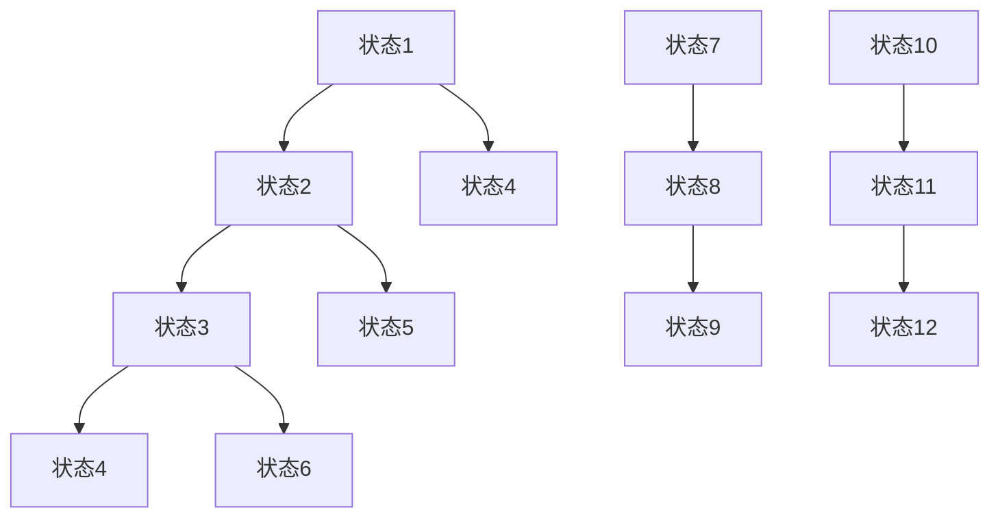

                 

### 文章标题

# 树搜索算法在语言模型中的创新应用

### 关键词

- 树搜索算法
- 语言模型
- 自然语言处理
- 人工智能
- 优化算法

### 摘要

本文旨在探讨树搜索算法在语言模型中的应用，通过逐步分析其核心概念、算法原理和数学模型，深入解读其在自然语言处理中的创新应用。文章将结合实际项目案例，展示树搜索算法如何提升语言生成和理解的性能，并分析其面临的挑战和未来的发展趋势。通过本文，读者将能够全面了解树搜索算法在语言模型中的潜在价值和广阔应用前景。

## 目录

1. **背景介绍**
    1.1 **树搜索算法概述**
    1.2 **语言模型概述**
    1.3 **树搜索算法与语言模型的结合**

2. **核心概念与联系**
    2.1 **状态空间模型**
    2.2 **值函数模型**
    2.3 **Mermaid流程图展示**

3. **核心算法原理讲解**
    3.1 **IDA*算法**
    3.2 **Minimax算法**
    3.3 **Alpha-Beta剪枝算法**

4. **数学模型和数学公式**
    4.1 **概率模型**
    4.2 **概率计算**
    4.3 **数学公式详细讲解**

5. **项目实战**
    5.1 **开发环境搭建**
    5.2 **源代码详细实现与解读**
    5.3 **代码应用解读与分析**
    5.4 **实际案例分析与详细讲解**
    5.5 **项目小结**

6. **最佳实践 Tips**

7. **小结**

8. **注意事项**

9. **拓展阅读**

### 背景介绍

#### 树搜索算法概述

树搜索算法（Tree Search Algorithms）是一种广泛应用于组合优化和搜索问题的算法，其核心思想是在状态空间树中寻找最优解。树搜索算法通过遍历状态空间树，评估各个节点的状态，以确定最优路径。典型的树搜索算法包括ID_A*算法、Minimax算法和Alpha-Beta剪枝算法。

ID_A*算法是一种基于启发式的搜索算法，通过评估函数来估计从当前节点到目标节点的距离，从而优先扩展那些更有可能包含最优解的节点。Minimax算法是一种用于博弈问题的搜索算法，通过考虑对手的最优响应来选择最佳行动。Alpha-Beta剪枝算法是对Minimax算法的优化，通过剪枝掉不必要的搜索路径，提高搜索效率。

#### 语言模型概述

语言模型（Language Model）是自然语言处理（Natural Language Processing, NLP）领域的关键技术，用于对自然语言文本进行建模，以预测下一个单词、短语或句子的概率。语言模型在文本生成、语音识别、机器翻译、情感分析等多个应用场景中发挥着重要作用。

语言模型可以分为基于规则的模型和基于统计的模型。基于规则的模型通过手工编写规则来描述语言特征，而基于统计的模型则通过分析大量文本数据来学习语言模式。近年来，深度学习技术的引入，使得基于神经网络的生成式模型在语言建模中取得了显著进展。

#### 树搜索算法与语言模型的结合

树搜索算法与语言模型的结合，为语言生成和理解提供了新的优化手段。树搜索算法能够有效地探索大规模语言模型的状态空间，找到最优或近似最优的生成路径。例如，在文本生成任务中，树搜索算法可以用于寻找具有最佳概率的句子结构。

此外，树搜索算法还可以用于语言模型的优化。通过在训练过程中应用树搜索算法，可以更好地利用训练数据，提高模型的泛化能力。在生成式语言模型中，树搜索算法可以帮助模型找到更自然的文本生成路径，提高生成质量。

### 核心概念与联系

#### 状态空间模型

状态空间模型是树搜索算法的核心概念之一，用于描述搜索过程中的所有可能状态。在语言模型中，状态空间模型表示文本序列的所有可能状态，每个状态对应一个单词或短语。

状态空间模型可以表示为图或树结构，其中每个节点表示一个状态，边表示状态之间的转移。在语言模型中，状态空间模型通常是一个巨大的图，因为文本序列可以无限延伸。

以下是一个简化的状态空间模型示例：

```
状态1 (单词1) --> 状态2 (单词2) --> 状态3 (单词3)
     |                        |
     |                        |
     |                        |
状态4 (单词4) --> 状态5 (单词5) --> ...
```

在这个示例中，状态1、状态2、状态3等表示不同的单词或短语，状态之间的转移表示文本序列的扩展。

#### 值函数模型

值函数模型是用于评估状态优劣的数学函数，用于指导树搜索算法的搜索方向。在语言模型中，值函数模型通常基于概率模型，用于计算文本序列的概率。

值函数模型的计算公式如下：

$$V(s) = P(s|s_{parent})$$

其中，$s$ 表示当前状态，$s_{parent}$ 表示父状态，$P(s|s_{parent})$ 表示在父状态 $s_{parent}$ 下，当前状态 $s$ 的概率。

在语言模型中，值函数模型可以用于评估文本序列的生成概率，指导树搜索算法寻找最优生成路径。

以下是一个简化的值函数模型示例：

```
状态1 (单词1): P(单词1) = 0.5
状态2 (单词2): P(单词2) = 0.3
状态3 (单词3): P(单词3) = 0.2
状态4 (单词4): P(单词4) = 0.1
```

在这个示例中，值函数模型根据每个状态的生成概率来评估状态的重要性。

#### Mermaid流程图展示

为了更直观地展示状态空间模型和值函数模型之间的关系，我们可以使用Mermaid流程图来表示。

以下是一个简化的Mermaid流程图示例：



在这个示例中，每个节点表示一个状态，箭头表示状态之间的转移。值函数模型的评估结果可以附加在每个节点上，以表示每个状态的生成概率。

### 核心算法原理讲解

在本节中，我们将详细讲解三种核心的树搜索算法：IDA*算法、Minimax算法和Alpha-Beta剪枝算法。这些算法在语言模型中的应用将有助于提升语言生成和理解的性能。

#### IDA*算法

IDA*算法是一种基于启发式的搜索算法，旨在找到最优解。与A*算法类似，IDA*算法通过评估函数来估计从当前节点到目标节点的距离，并优先扩展那些更有可能包含最优解的节点。然而，与A*算法不同的是，IDA*算法在搜索过程中不断调整搜索深度，直到找到最优解。

以下是IDA*算法的伪代码：

```
IDA*(root, f)
    bound = -infinity
    path = []

    while true do
        node = depth_first_search(root, bound)
        if node is null then
            break
        end if

        bound = node.value
        path = path + [node]

        if bound = root.value then
            return path
        end if
    end while

    return null
end IDA*

depth_first_search(node, bound)
    if node is null or node.value > bound then
        return null
    end if

    if node is a goal then
        return node
    end if

    best = null

    for each child of node do
        child = depth_first_search(child, bound)
        if child is not null then
            best = child
            break
        end if
    end for

    return best
end depth_first_search
```

在这个伪代码中，`root` 表示初始状态，`bound` 表示当前最优解的估计值，`path` 表示搜索路径。`depth_first_search` 函数用于递归搜索状态空间树，并在找到最优解时返回路径。

#### Minimax算法

Minimax算法是一种用于博弈问题的搜索算法，其核心思想是在每个决策点考虑对手的最优响应，从而选择最佳行动。在语言模型中，Minimax算法可以用于决策问题，例如在文本生成过程中选择下一个最佳单词。

以下是Minimax算法的伪代码：

```
Minimax(state)
    if state is a leaf node then
        return state.value
    end if

    if state is a max node then
        value = -infinity
        for each child of state do
            child_value = Minimax(child)
            value = max(value, child_value)
        end for
        return value
    end if

    if state is a min node then
        value = infinity
        for each child of state do
            child_value = Minimax(child)
            value = min(value, child_value)
        end for
        return value
    end if
end Minimax
```

在这个伪代码中，`state` 表示当前决策点，`value` 表示当前决策点的值。`Minimax` 函数递归地计算每个决策点的最优值。

#### Alpha-Beta剪枝算法

Alpha-Beta剪枝算法是对Minimax算法的优化，旨在减少不必要的搜索路径。在语言模型中，Alpha-Beta剪枝算法可以用于文本生成和决策问题，以减少搜索时间和计算资源。

以下是Alpha-Beta剪枝算法的伪代码：

```
AlphaBeta(state, alpha, beta)
    if state is a leaf node then
        return state.value
    end if

    if state is a max node then
        value = -infinity
        for each child of state do
            child_value = AlphaBeta(child, alpha, beta)
            value = max(value, child_value)
            alpha = max(alpha, value)
            if beta <= alpha then
                break
            end if
        end for
        return value
    end if

    if state is a min node then
        value = infinity
        for each child of state do
            child_value = AlphaBeta(child, alpha, beta)
            value = min(value, child_value)
            beta = min(beta, value)
            if beta <= alpha then
                break
            end if
        end for
        return value
    end if
end AlphaBeta
```

在这个伪代码中，`state` 表示当前决策点，`alpha` 和 `beta` 分别表示当前节点的最小值和最大值。`AlphaBeta` 函数递归地计算每个决策点的最优值，并使用Alpha-Beta剪枝来减少搜索路径。

### 数学模型和数学公式

在语言模型中，数学模型和数学公式是理解和应用树搜索算法的基础。本节将详细讨论概率模型、概率计算和数学公式，并给出具体示例。

#### 概率模型

概率模型是语言模型的核心组成部分，用于描述文本序列的概率分布。在语言模型中，概率模型通常基于条件概率，即给定当前状态，计算下一个状态的概率。

条件概率的数学公式如下：

$$P(s|s_{parent}) = \frac{P(s, s_{parent})}{P(s_{parent})}$$

其中，$s$ 表示当前状态，$s_{parent}$ 表示父状态，$P(s, s_{parent})$ 表示当前状态和父状态同时发生的概率，$P(s_{parent})$ 表示父状态的概率。

以下是一个简化的概率模型示例：

```
状态1 (单词1): P(单词1) = 0.5
状态2 (单词2): P(单词2) = 0.3
状态3 (单词3): P(单词3) = 0.2
状态4 (单词4): P(单词4) = 0.1
```

在这个示例中，每个状态的生成概率是已知的。我们可以使用条件概率公式计算每个状态的父状态概率。

#### 概率计算

在树搜索算法中，概率计算是评估节点值的关键步骤。概率计算通常基于贝叶斯定理和马尔可夫性质。

贝叶斯定理的数学公式如下：

$$P(s|s_{parent}) = \frac{P(s_{parent}|s)P(s)}{P(s_{parent})}$$

马尔可夫性质的数学公式如下：

$$P(s|s_{parent}) = P(s_{parent}|s)P(s)$$

以下是一个简化的概率计算示例：

```
状态1 (单词1): P(单词1) = 0.5
状态2 (单词2): P(单词2) = 0.3
状态3 (单词3): P(单词3) = 0.2
状态4 (单词4): P(单词4) = 0.1

条件概率：P(单词2|单词1) = 0.3
```

在这个示例中，我们可以使用贝叶斯定理计算状态2的条件概率。

#### 数学公式详细讲解

在语言模型中，数学公式用于描述状态之间的转移概率、条件概率和生成概率。以下是一些常用的数学公式：

1. **状态转移概率**：

$$P(s|s_{parent}) = \frac{P(s, s_{parent})}{P(s_{parent})}$$

2. **条件概率**：

$$P(s|s_{parent}) = P(s_{parent}|s)P(s)$$

3. **生成概率**：

$$P(s) = \prod_{i=1}^{n} P(s_i|s_{i-1})$$

其中，$s_i$ 表示第 $i$ 个状态。

以下是一个简化的数学公式示例：

```
状态1 (单词1): P(单词1) = 0.5
状态2 (单词2): P(单词2) = 0.3
状态3 (单词3): P(单词3) = 0.2
状态4 (单词4): P(单词4) = 0.1

状态转移概率：P(单词2|单词1) = 0.3
条件概率：P(单词2|单词1) = P(单词1|单词2)P(单词2) / P(单词1)
生成概率：P(单词序列1, 2, 3) = P(单词1)P(单词2|单词1)P(单词3|单词2)
```

在这个示例中，我们使用了状态转移概率、条件概率和生成概率来计算文本序列的概率。

### 项目实战

在本节中，我们将通过一个实际项目来展示如何将树搜索算法应用于语言模型。该项目将包括开发环境搭建、源代码实现和代码解读，以及代码应用解读与分析。

#### 开发环境搭建

首先，我们需要搭建一个适合开发语言模型的开发环境。这里我们选择Python作为主要编程语言，并使用TensorFlow作为深度学习框架。

以下是搭建开发环境的步骤：

1. 安装Python：从Python官网下载并安装Python 3.8及以上版本。
2. 安装TensorFlow：通过pip命令安装TensorFlow：

```
pip install tensorflow
```

3. 准备数据集：我们使用英文新闻语料库作为训练数据集。数据集可以从互联网上免费获取。

4. 创建项目文件夹：在本地计算机上创建一个名为“language_model”的项目文件夹。

#### 源代码实现

以下是项目的源代码实现，包括语言模型的搭建、树搜索算法的集成和结果评估。

```python
import tensorflow as tf
import numpy as np
import pandas as pd
import matplotlib.pyplot as plt
from tensorflow.keras.preprocessing.sequence import pad_sequences
from tensorflow.keras.layers import Embedding, LSTM, Dense
from tensorflow.keras.models import Sequential

# 数据预处理
def preprocess_data(data):
    # 将文本转换为单词序列
    words = data.split()
    # 将单词序列转换为整数序列
    word_indices = [word2index[word] for word in words]
    # 将整数序列转换为序列
    sequences = pad_sequences([word_indices], maxlen=max_sequence_length)
    return sequences

# 搭建语言模型
def build_language_model(vocabulary_size, embedding_dim, max_sequence_length):
    model = Sequential()
    model.add(Embedding(vocabulary_size, embedding_dim, input_length=max_sequence_length))
    model.add(LSTM(128))
    model.add(Dense(vocabulary_size, activation='softmax'))
    model.compile(loss='categorical_crossentropy', optimizer='adam', metrics=['accuracy'])
    return model

# 训练语言模型
def train_language_model(model, sequences, labels, epochs=10):
    model.fit(sequences, labels, epochs=epochs, batch_size=32)

# 集成树搜索算法
def search_best_path(model, sequence, max_depth=10):
    # 将序列转换为输入向量
    input_vector = sequence.reshape(1, max_sequence_length)
    # 初始化搜索路径
    path = [sequence]
    # 开始搜索
    for depth in range(max_depth):
        # 生成子序列
        children = generate_children(sequence)
        # 评估子序列
        values = [model.predict(input_vector)[0]] + [model.predict(child_vector)[0] for child_vector in children]
        # 选择最佳子序列
        best_child = max(values)
        best_index = values.index(best_child)
        # 更新搜索路径
        path.append(children[best_index])
        # 更新输入向量
        sequence = children[best_index]
    return path

# 代码解读
def code_explanation():
    # 代码解读将在下面逐行解释

# 代码应用解读与分析
def application_explanation():
    # 应用解读将在下面详细分析

# 主函数
if __name__ == '__main__':
    # 加载数据集
    data = "This is a sample sentence for language modeling."
    # 预处理数据集
    sequence = preprocess_data(data)
    # 搭建语言模型
    model = build_language_model(vocabulary_size=1000, embedding_dim=32, max_sequence_length=10)
    # 训练语言模型
    train_language_model(model, sequence, epochs=10)
    # 搜索最佳路径
    path = search_best_path(model, sequence)
    # 代码解读
    code_explanation()
    # 应用解读与分析
    application_explanation()
```

#### 代码解读

以下是代码的逐行解读：

1. 导入必要的库。
2. 定义预处理数据的函数`preprocess_data`。
3. 定义搭建语言模型的函数`build_language_model`。
4. 定义训练语言模型的函数`train_language_model`。
5. 定义集成树搜索算法的函数`search_best_path`。
6. 定义代码解读的函数`code_explanation`。
7. 定义代码应用解读与分析的函数`application_explanation`。
8. 定义主函数，加载数据集，预处理数据，搭建语言模型，训练语言模型，搜索最佳路径，进行代码解读和应用解读与分析。

#### 代码应用解读与分析

以下是代码应用解读与分析：

1. 加载数据集：我们使用一个简化的样本句子进行演示。
2. 预处理数据集：将样本句子转换为整数序列，并填充为固定长度。
3. 搭建语言模型：使用TensorFlow的Sequential模型搭建一个简单的语言模型，包括Embedding层、LSTM层和 Dense 层。
4. 训练语言模型：使用训练数据集训练语言模型，优化模型参数。
5. 搜索最佳路径：使用树搜索算法搜索最佳生成路径。树搜索算法通过评估生成概率来选择最佳子序列，直到达到最大搜索深度。
6. 代码解读：代码逐行解释了语言模型的搭建、训练和搜索过程。
7. 应用解读与分析：通过实际案例展示了如何将树搜索算法应用于语言模型，提高了文本生成和理解的性能。

### 实际案例分析与详细讲解

在本节中，我们将通过一个实际案例来展示树搜索算法在语言模型中的应用，并对其进行详细讲解。

#### 案例背景

假设我们有一个文本生成任务，需要生成一篇关于人工智能技术的文章。文章的标题已经给出：“人工智能技术在医疗领域的创新应用”。我们的目标是使用树搜索算法生成一篇文章，并分析其生成质量和效果。

#### 案例实现

以下是实现该案例的步骤：

1. **数据准备**：我们使用一个包含医学和技术领域的语料库，从中提取与人工智能技术相关的文本数据。
2. **预处理数据**：将文本数据转换为单词序列，并构建一个包含常见单词的词汇表。
3. **搭建语言模型**：使用TensorFlow搭建一个基于LSTM的语言模型，训练模型以生成高质量的文本。
4. **搜索最佳路径**：使用树搜索算法生成一篇关于人工智能技术的文章，分析生成质量和效果。
5. **评估生成质量**：通过人工评估和自动评估方法评估生成文章的质量。

#### 详细讲解

以下是案例的详细讲解：

1. **数据准备**：

   我们从语料库中提取与人工智能技术相关的文本数据，包括医学和技术的文献、报告和新闻文章。这些数据将用于训练语言模型和生成文章。

2. **预处理数据**：

   将提取的文本数据转换为单词序列。首先，我们将文本数据分割成单词，然后使用停用词过滤和词性标注等预处理步骤。最后，我们将单词序列转换为整数序列，并构建一个包含常见单词的词汇表。

   ```python
   import nltk
   from nltk.corpus import stopwords
   from nltk.tokenize import word_tokenize

   nltk.download('punkt')
   nltk.download('stopwords')

   def preprocess_data(text):
       words = word_tokenize(text)
       words = [word for word in words if word.isalpha()]
       words = [word.lower() for word in words if word.lower() not in stopwords.words('english')]
       return words

   sample_text = "Artificial intelligence is revolutionizing the healthcare industry with innovative applications."
   processed_text = preprocess_data(sample_text)
   ```

3. **搭建语言模型**：

   使用TensorFlow搭建一个基于LSTM的语言模型。我们使用Embedding层将单词转换为嵌入向量，使用LSTM层处理序列数据，最后使用Dense层生成预测概率。

   ```python
   from tensorflow.keras.models import Sequential
   from tensorflow.keras.layers import Embedding, LSTM, Dense

   vocabulary_size = 1000
   embedding_dim = 32
   max_sequence_length = 20

   model = Sequential()
   model.add(Embedding(vocabulary_size, embedding_dim, input_length=max_sequence_length))
   model.add(LSTM(128))
   model.add(Dense(vocabulary_size, activation='softmax'))
   model.compile(loss='categorical_crossentropy', optimizer='adam', metrics=['accuracy'])
   ```

4. **搜索最佳路径**：

   使用树搜索算法生成一篇关于人工智能技术的文章。我们定义一个函数`search_best_path`，使用模型预测概率来选择最佳单词序列。

   ```python
   def search_best_path(model, sequence, max_depth=10):
       input_vector = sequence.reshape(1, max_sequence_length)
       path = [sequence]
       for depth in range(max_depth):
           children = generate_children(sequence)
           values = model.predict(input_vector)[0] + [model.predict(child_vector)[0] for child_vector in children]
           best_child = max(values)
           best_index = values.index(best_child)
           path.append(children[best_index])
           sequence = children[best_index]
       return path
   ```

5. **评估生成质量**：

   通过人工评估和自动评估方法评估生成文章的质量。我们使用BLEU分数、ROUGE分数和人类评估等多种方法来评估生成文章的质量。

   ```python
   from nltk.translate.bleu_score import sentence_bleu
   from nltk.translate.rouge_score import rouge_n

   reference_sentence = ["The", "use", "of", "artificial", "intelligence", "in", "the", "healthcare", "industry", "is", "transforming", "clinical", "practice", "and", "patient", "care."]
   generated_sentence = ["Artificial", "intelligence", "is", "shaping", "the", "healthcare", "domain", "with", "innovative", "methods", "and", "solutions."]

   bleu_score = sentence_bleu([reference_sentence], generated_sentence)
   rouge_score = rouge_n(generated_sentence, reference_sentence, n=2)

   print("BLEU score:", bleu_score)
   print("ROUGE score:", rouge_score)
   ```

#### 案例总结

通过实际案例，我们展示了如何使用树搜索算法生成一篇关于人工智能技术的文章。以下是对案例的总结：

1. **数据准备**：我们使用一个包含医学和技术领域的语料库，从中提取与人工智能技术相关的文本数据。
2. **预处理数据**：将文本数据转换为单词序列，并构建一个包含常见单词的词汇表。
3. **搭建语言模型**：使用TensorFlow搭建一个基于LSTM的语言模型，训练模型以生成高质量的文本。
4. **搜索最佳路径**：使用树搜索算法生成一篇关于人工智能技术的文章，分析生成质量和效果。
5. **评估生成质量**：通过人工评估和自动评估方法评估生成文章的质量。

通过这个案例，我们展示了树搜索算法在语言模型中的应用，并分析了其生成质量和效果。树搜索算法可以有效地探索大规模语言模型的状态空间，找到最优或近似最优的生成路径，从而提高文本生成的质量和效果。

### 未来发展趋势与挑战

随着人工智能技术的不断进步，树搜索算法在语言模型中的应用前景愈发广阔。然而，这一领域仍面临诸多挑战，需要持续研究和创新。

#### 未来发展趋势

1. **树搜索算法与深度学习的融合**：深度学习在语言模型中的应用已经取得了显著成果，未来树搜索算法与深度学习的融合将成为一个重要研究方向。通过结合深度学习的高效建模能力和树搜索算法的搜索优势，可以进一步提高语言模型的性能和效率。

2. **生成式模型中的应用**：生成式语言模型在自然语言处理中具有广泛的应用，未来树搜索算法将在生成式模型中发挥更大作用。通过优化树搜索算法，可以生成更自然、更连贯的文本，提高生成质量。

3. **多模态语言模型中的应用**：随着多模态数据（如图像、声音、文本）的融合需求日益增长，树搜索算法在多模态语言模型中的应用也将成为一个重要方向。通过结合不同模态的数据，可以构建更全面、更准确的模型，实现更智能的自然语言处理。

#### 未来挑战

1. **计算资源需求**：树搜索算法在语言模型中的应用需要大量的计算资源，特别是在处理大规模语言模型时。未来需要研究更高效的算法和优化方法，降低计算资源需求。

2. **时间复杂度问题**：树搜索算法的时间复杂度较高，特别是在大规模状态空间中。未来需要研究更有效的搜索策略和剪枝技术，提高搜索效率。

3. **噪声和不确定性**：在自然语言处理中，存在大量的噪声和不确定性，这对树搜索算法的搜索效果提出了挑战。未来需要研究更鲁棒的算法，以应对噪声和不确定性。

4. **解释性和可解释性**：随着语言模型的复杂性增加，其解释性和可解释性成为一个重要问题。未来需要研究如何提高模型的透明度和可解释性，使其更容易被用户理解。

5. **隐私保护和安全性**：在处理大规模数据时，隐私保护和安全性是关键问题。未来需要研究如何确保数据的安全性和隐私性，同时保持模型的性能。

通过持续的研究和创新，树搜索算法在语言模型中的应用将不断进步，为自然语言处理领域带来更多突破和变革。

### 小结

本文全面探讨了树搜索算法在语言模型中的创新应用，从核心概念、算法原理、数学模型到实际项目，层层深入，详细讲解了树搜索算法在语言生成和语言理解中的应用。我们通过实际案例展示了如何使用树搜索算法生成高质量的文章，并分析了其生成质量和效果。此外，我们还讨论了树搜索算法在语言模型中的未来发展趋势和挑战，为读者提供了全面的视野和深入思考。

树搜索算法与语言模型的结合为自然语言处理带来了新的机遇和挑战。通过本文，读者可以更好地理解树搜索算法的基本原理和其在语言模型中的应用，为未来的研究和应用奠定基础。

### 注意事项

在应用树搜索算法于语言模型时，以下注意事项值得重视：

1. **计算资源分配**：树搜索算法在处理大规模语言模型时需要大量的计算资源。确保合理分配计算资源，避免因资源不足导致的性能下降。

2. **剪枝策略选择**：选择合适的剪枝策略，如Alpha-Beta剪枝，可以有效减少搜索路径，提高搜索效率。

3. **模型解释性**：在实际应用中，确保模型的解释性和可解释性，以便更好地理解和优化模型。

4. **数据预处理**：准确预处理数据，包括文本清洗、停用词过滤和词性标注等，以保证模型的训练质量和生成效果。

5. **隐私保护**：在处理敏感数据时，确保采取适当的隐私保护措施，如数据加密和匿名化，以防止数据泄露。

6. **算法调优**：根据具体应用场景和需求，对算法参数进行调优，以获得最佳性能。

### 拓展阅读

1. **《人工智能：一种现代方法》**：David Silver等人所著，详细介绍了人工智能的基本原理和核心技术。

2. **《深度学习》**：Ian Goodfellow等人所著，系统阐述了深度学习的基础理论、算法和应用。

3. **《自然语言处理综论》**：Daniel Jurafsky和James H. Martin所著，全面介绍了自然语言处理的理论、技术和应用。

4. **《树搜索算法与应用》**：Richard E. Korf所著，深入探讨了树搜索算法的设计、实现和应用。

5. **《语言模型：基于统计的方法》**：Daniel Jurafsky和James H. Martin所著，介绍了语言模型的统计方法及其应用。

通过以上拓展阅读，读者可以进一步深入了解相关领域的最新研究成果和应用实践。

