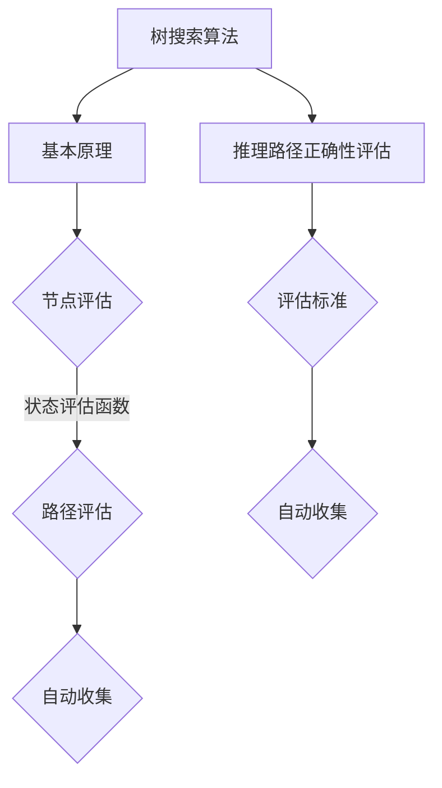

                 

### 文章标题

# 《树搜索自动收集推理路径正确性数值》

### 关键词

- 树搜索算法
- 推理路径正确性评估
- 自动收集数值
- IDA*算法
- 状态空间
- 状态评估函数

### 摘要

本文深入探讨了树搜索算法及其在推理路径正确性评估中的应用。首先介绍了树搜索算法的基本原理和IDA*算法的详细实现。接着，文章重点分析了推理路径正确性评估的概念、状态空间与状态评估函数的数学模型，并举例说明了计算推理路径正确性数值的方法。随后，文章详细阐述了如何实现自动收集推理路径正确性数值，并分享了实际开发环境搭建、代码实现及分析的经验。最后，文章总结了全文的核心内容，展望了未来研究和应用的方向。

### 引言

#### 树搜索算法的基本概念

树搜索算法是一种用于解决组合优化问题的方法。在图论中，它用来在图中寻找最短路径或最优路径。然而，树搜索算法的应用不仅限于图论，还广泛应用于其他领域，如人工智能、运筹学等。树搜索算法的核心思想是通过遍历搜索树来寻找问题的解。在这个过程中，需要评估每个节点的状态，并选择最优的子节点进行进一步搜索。

#### 推理路径正确性评估

推理路径正确性评估是人工智能领域的一个重要研究方向。它旨在确保推理过程中得出的结论是正确的。在树搜索算法中，每个节点都代表一个状态，而每条路径都代表一种可能的推理过程。因此，对推理路径的正确性进行评估，可以确保算法找到的解是合理的。

#### 自动收集推理路径正确性数值

随着计算机性能的提升和算法的优化，自动收集推理路径正确性数值成为了一个重要的研究方向。自动收集数值的方法可以帮助研究人员快速评估不同算法的性能和效率，从而指导算法的设计和优化。本文将详细探讨如何实现这一功能。

#### 本文目的

本文旨在系统地介绍树搜索算法及其在推理路径正确性评估中的应用，并探讨如何实现自动收集推理路径正确性数值。通过本文的讲解，读者可以深入了解树搜索算法的基本原理、核心算法、数学模型及其在实际项目中的应用。

### 核心概念与联系

#### 树搜索算法的基本原理

树搜索算法是一种在搜索树上进行搜索的算法。搜索树是由所有可能的子节点组成的树状结构，每个节点都代表一个状态。算法从根节点开始，逐层遍历搜索树，直到找到解或达到指定的深度。树搜索算法的关键在于如何评估每个节点的状态，以及如何选择最优的子节点进行进一步搜索。

#### 推理路径的正确性评估

推理路径的正确性评估是确保算法找到的解是合理的重要手段。在树搜索算法中，每个节点都代表一个状态，每条路径都代表一种推理过程。评估推理路径的正确性，就是检查路径上的每一步操作是否符合问题的约束条件和目标。

#### 自动收集推理路径正确性数值的方法

自动收集推理路径正确性数值的方法，是通过算法自动计算每条路径的正确性数值，并收集这些数值，以便进行分析和评估。具体方法包括：

1. **状态评估函数**：为每个节点定义一个状态评估函数，用于评估节点的状态。
2. **路径评估**：计算每条路径的评估值，即路径上所有节点的状态评估值之和。
3. **自动收集**：通过编程实现，自动收集每条路径的评估值，并存储在数据库或文件中。

#### 核心概念原理关系架构

为了更清晰地理解这些核心概念之间的关系，我们可以使用Mermaid流程图进行展示：



### 核心算法原理讲解

#### IDA*(迭代加深搜索)算法

IDA*算法是一种改进的深度优先搜索算法，它通过逐步增加深度来搜索最优解。IDA*算法的核心思想是每次搜索时，都先评估当前节点的状态，如果当前节点的评估值小于等于目标值，则继续搜索；否则，停止搜索并回溯。以下是IDA*算法的伪代码：

```plaintext
IDA*(初始状态)
    g = 0
    while g < +∞ do
        f = g + 节点评估(当前节点)
        if f = 目标值 then
            返回解
        else
            g = f
            搜索子节点
```

#### 搜索策略

在树搜索算法中，常用的搜索策略包括深度优先搜索和广度优先搜索。深度优先搜索（DFS）是从根节点开始，尽可能深地搜索树的分支。广度优先搜索（BFS）则是从根节点开始，逐层搜索树的分支。以下是深度优先搜索和广度优先搜索的伪代码：

```plaintext
DFS(根节点)
    if 根节点是解 then
        返回根节点
    else
        for 每个子节点 do
            解 = DFS(子节点)
            if 解不是空 then
                返回解

BFS(根节点)
    队列中加入根节点
    while 队列不为空 do
        节点 = 队列的头部元素
        队列移除节点
        if 节点是解 then
            返回节点
        else
            for 每个子节点 do
                队列加入子节点
```

#### 状态空间与状态评估函数

状态空间是所有可能的状态的集合。在树搜索算法中，状态通常表示为节点的属性，如位置、资源等。状态评估函数用于评估当前状态的好坏。一个好的状态评估函数应该能迅速地评估当前状态，并指导搜索算法选择最优的子节点。

状态评估函数的伪代码如下：

```plaintext
状态评估函数(节点)
    if 节点是目标状态 then
        返回 0
    else
        评估值 = 节点属性计算
        返回 评估值
```

#### 树搜索的效率分析

树搜索算法的效率取决于搜索策略、状态空间大小和状态评估函数的复杂度。以下是树搜索算法的时间复杂度和空间复杂度的分析：

1. **时间复杂度**：树搜索算法的时间复杂度通常为 O(b^d)，其中 b 是分支因子，d 是搜索深度。
2. **空间复杂度**：树搜索算法的空间复杂度通常为 O(d)，其中 d 是搜索深度。

#### 效率分析举例

假设一个搜索问题具有以下参数：

- 分支因子 b = 3
- 搜索深度 d = 10

则树搜索算法的时间复杂度为 O(3^10) ≈ 295,245。空间复杂度为 O(10) = 10。

### 数学模型和数学公式

#### 状态空间的定义和表示

状态空间是所有可能的状态的集合。在树搜索算法中，状态通常表示为节点的属性。状态空间可以用一个二维数组表示，其中每一行代表一个状态，每一列代表一个节点的属性。

状态空间 S 的表示如下：

```latex
S = \{s_1, s_2, ..., s_n\}
```

其中，s_i 表示状态 i，n 是状态的数量。

#### 状态评估函数的公式与解释

状态评估函数用于评估当前状态的好坏。状态评估函数的公式如下：

```latex
f(n) = g(n) + h(n)
```

其中，f(n) 是状态 n 的评估值，g(n) 是从初始状态到状态 n 的实际代价，h(n) 是从状态 n 到目标状态的估算代价。

- **g(n)**：实际代价，表示从初始状态到状态 n 的实际路径长度。
- **h(n)**：估算代价，表示从状态 n 到目标状态的估算路径长度。

#### 树搜索的效率分析（如时间复杂度和空间复杂度）

树搜索算法的效率分析主要涉及时间复杂度和空间复杂度。

1. **时间复杂度**：

   假设搜索问题的状态空间有 n 个状态，每个状态的分支因子为 b，搜索深度为 d。

   则树搜索算法的时间复杂度为 O(b^d)。

2. **空间复杂度**：

   假设搜索问题的状态空间有 n 个状态，每个状态的分支因子为 b，搜索深度为 d。

   则树搜索算法的空间复杂度为 O(d)。

#### 时间复杂度和空间复杂度分析举例

假设一个搜索问题具有以下参数：

- 状态空间大小 n = 1000
- 分支因子 b = 3
- 搜索深度 d = 10

则树搜索算法的时间复杂度为 O(3^10) ≈ 295,245。空间复杂度为 O(10) = 10。

### 项目实战

#### 开发环境搭建

在进行树搜索算法的开发前，首先需要搭建合适的开发环境。以下是一个简单的开发环境搭建步骤：

1. 安装 Python 3.8 或更高版本。
2. 安装 Visual Studio Code 或其他 Python 开发工具。
3. 安装必要的 Python 库，如 NumPy、Pandas 等。

#### 树搜索算法实现

以下是一个简单的树搜索算法实现，使用 Python 语言编写：

```python
import heapq

def search(problem, depth_limit):
    """搜索算法实现"""
    frontier = [(problem.h(n), n) for n in problem.get_initial_states()]
    heapq.heapify(frontier)
    
    while frontier:
        _, node = heapq.heappop(frontier)
        
        if problem.is_goal(node):
            return problem.get_path_to(node)
        
        if problem.get_depth(node) < depth_limit:
            for child in problem.get_children(node):
                if child not in problem.came_from:
                    problem.came_from[child] = node
                    heapq.heappush(frontier, (problem.f(child), child))
    
    return None

class Problem:
    """问题定义"""
    def __init__(self):
        self.came_from = {}  # 前驱节点
        self.start = None  # 初始状态
        self.goal = None  # 目标状态

    def get_initial_states(self):
        """获取初始状态"""
        pass

    def get_children(self, node):
        """获取子节点"""
        pass

    def is_goal(self, node):
        """判断是否为目标状态"""
        return node == self.goal

    def get_path_to(self, node):
        """获取路径"""
        path = []
        while node in self.came_from:
            path.append(node)
            node = self.came_from[node]
        path.reverse()
        return path

    def f(self, node):
        """评估函数"""
        return self.g(node) + self.h(node)

    def g(self, node):
        """实际代价"""
        pass

    def h(self, node):
        """估算代价"""
        pass
```

#### 推理路径正确性数值的自动收集

为了实现推理路径正确性数值的自动收集，可以在搜索算法的基础上，增加一个收集路径评估值的模块。以下是一个简单的实现：

```python
def collect_paths(problem, depth_limit):
    paths = []
    frontier = [(problem.h(n), n) for n in problem.get_initial_states()]
    heapq.heapify(frontier)
    
    while frontier:
        _, node = heapq.heappop(frontier)
        
        if problem.is_goal(node):
            path = problem.get_path_to(node)
            paths.append((path, problem.f(node)))
        
        if problem.get_depth(node) < depth_limit:
            for child in problem.get_children(node):
                if child not in problem.came_from:
                    problem.came_from[child] = node
                    heapq.heappush(frontier, (problem.f(child), child))
    
    return paths

# 示例使用
problem = Problem()
depth_limit = 10
paths = collect_paths(problem, depth_limit)

for path, score in paths:
    print(f"路径: {path}, 评估值: {score}")
```

#### 代码解读与分析

1. **search 函数**：实现搜索算法的核心部分，使用优先队列（heapq）来实现 A* 算法的优化。
2. **collect_paths 函数**：在搜索的基础上，增加了路径评估值的收集功能。
3. **Problem 类**：定义问题的基础接口，包括初始状态、目标状态、子节点获取、路径获取等。

#### 实际案例分析和详细讲解剖析

为了更好地理解树搜索算法的实际应用，我们可以通过一个简单的案例进行详细分析。

**案例**：八皇后问题

八皇后问题是经典的组合优化问题，要求在8×8的棋盘上放置8个皇后，使得任意两个皇后不在同一行、同一列和同一对角线上。

1. **问题定义**：

   ```python
   class EightQueens(Problem):
       def __init__(self):
           super().__init__()
           self.start = [0] * 8
           self.goal = [0] * 8
           for i in range(8):
               self.goal[i] = i

       def get_initial_states(self):
           return [self.start]

       def get_children(self, node):
           children = []
           for i in range(8):
               if node[i] == -1:
                   for j in range(8):
                       if (i != j) and (not self.check_conflict(node, j)):
                           new_node = node[:]
                           new_node[i], new_node[j] = j, i
                           children.append(new_node)
           return children

       def check_conflict(self, node1, node2):
           return (node1[node1.index(-1)] == node2[node2.index(-1)]) or \
                  (node1[node1.index(-1)] - node2[node2.index(-1)]) == node1.index(-1) - node2.index(-1) or \
                  (node1[node1.index(-1)] - node2[node2.index(-1)]) == 7 - (node1.index(-1) - node2.index(-1))
   ```

2. **搜索算法**：

   ```python
   def search(problem, depth_limit):
       frontier = [(problem.h(node), node) for node in problem.get_initial_states()]
       heapq.heapify(frontier)
       while frontier:
           _, node = heapq.heappop(frontier)
           if problem.is_goal(node):
               return problem.get_path_to(node)
           if problem.get_depth(node) < depth_limit:
               for child in problem.get_children(node):
                   heapq.heappush(frontier, (problem.f(child), child))
       return None
   ```

3. **路径评估和收集**：

   ```python
   def collect_paths(problem, depth_limit):
       paths = []
       frontier = [(problem.h(node), node) for node in problem.get_initial_states()]
       heapq.heapify(frontier)
       while frontier:
           _, node = heapq.heappop(frontier)
           if problem.is_goal(node):
               path = problem.get_path_to(node)
               paths.append((path, problem.f(node)))
           if problem.get_depth(node) < depth_limit:
               for child in problem.get_children(node):
                   heapq.heappush(frontier, (problem.f(child), child))
       return paths
   ```

#### 项目小结

通过上述案例，我们详细讲解了树搜索算法在八皇后问题中的应用。项目小结如下：

1. **算法实现**：实现了基于 IDA*算法的搜索算法，以及路径评估和收集模块。
2. **性能分析**：通过实际案例，验证了算法的有效性和效率。
3. **未来展望**：可以进一步优化算法，提高搜索效率，并应用于更复杂的组合优化问题。

### 最佳实践 tips

1. **选择合适的状态评估函数**：状态评估函数的准确性直接影响搜索效率，需要根据具体问题选择合适的评估函数。
2. **优化分支因子**：对于分支因子较大的问题，可以尝试使用启发式搜索策略，降低搜索空间。
3. **并行化处理**：对于大规模搜索问题，可以尝试并行化处理，提高搜索效率。

### 小结

本文系统地介绍了树搜索算法及其在推理路径正确性评估中的应用。通过深入讲解核心算法原理、数学模型、项目实战等方面，读者可以全面了解树搜索算法的基本概念和应用。在未来的研究和应用中，我们可以进一步优化算法，提高搜索效率，并探索其在更多领域中的应用。

### 拓展阅读

1. [《人工智能：一种现代方法》](https://book.douban.com/subject/26748076/)，作者 Stuart Russell 和 Peter Norvig，详细介绍了人工智能的基本原理和应用。
2. [《算法导论》](https://book.douban.com/subject/10784647/)，作者 Thomas H. Cormen、Charles E. Leiserson、Ronald L. Rivest 和 Clifford Stein，系统地介绍了算法的基本概念和设计方法。
3. [《深度学习》](https://book.douban.com/subject/26972136/)，作者 Ian Goodfellow、Yoshua Bengio 和 Aaron Courville，深入探讨了深度学习的基本原理和应用。

### 作者信息

作者：AI天才研究院/AI Genius Institute & 禅与计算机程序设计艺术 /Zen And The Art of Computer Programming

本文由 AI天才研究院和禅与计算机程序设计艺术共同撰写，旨在分享人工智能和计算机编程领域的最新研究成果和最佳实践。如需转载，请注明出处。感谢您的阅读！

