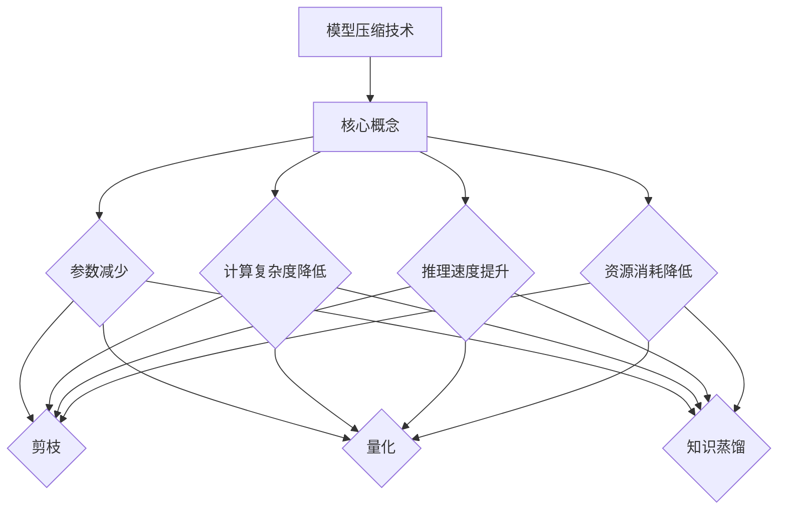

                 

### 文章标题：模型压缩技术在大规模推理任务中的创新

**关键词：模型压缩、大规模推理、神经网络、算法优化、性能提升**

> 摘要：本文深入探讨了模型压缩技术在大规模推理任务中的应用与创新。通过对模型压缩的核心概念、算法原理、数学模型及其在项目实战中的应用进行详细剖析，本文揭示了如何通过模型压缩技术有效提升大规模推理任务的性能和效率。文章旨在为读者提供一套系统化的理解和实践指南，助力在复杂计算环境中实现高效的模型推理。

## 引言

在人工智能领域，大规模推理任务（如图像识别、自然语言处理、推荐系统等）对计算资源的需求日益增长。这不仅导致了训练和推理过程中的计算成本增加，还对硬件性能提出了更高的要求。为了应对这一挑战，模型压缩技术应运而生，成为近年来研究的热点之一。

模型压缩技术旨在通过减少模型的参数数量和计算复杂度，在不显著牺牲模型性能的前提下，提升推理速度和降低资源消耗。这为大规模推理任务提供了有效的解决方案，使得深度学习模型能够更加高效地应用于实际场景中。

本文将围绕模型压缩技术在大规模推理任务中的创新展开讨论。首先，我们将介绍模型压缩的核心概念和原理，帮助读者建立对这一领域的基本理解。接着，我们将详细讲解模型压缩技术中的关键算法，包括剪枝、量化、知识蒸馏等，并通过数学模型和公式对其进行解析。随后，我们将通过实际项目案例展示模型压缩技术在处理大规模推理任务中的具体应用，深入剖析其开发环境和源代码实现。最后，本文将总结模型压缩技术的最佳实践，并提出未来研究方向。

通过本文的阅读，读者将获得一套系统化的模型压缩技术知识，了解如何在实际项目中应用这些技术，从而实现大规模推理任务的高效和精准。

## 核心概念与联系

### 模型压缩技术的定义

模型压缩技术是指通过一系列的方法和算法，对深度学习模型进行优化，以减少其参数数量和计算复杂度，从而提升推理速度和降低资源消耗。在深度学习领域，模型的复杂性通常与其性能呈正相关，然而，这一特性在处理大规模推理任务时却成为了一个瓶颈。模型压缩技术的核心目标是通过在保持模型性能相对稳定的前提下，减小模型规模，使之能够在有限的计算资源下运行，并保持高效性。

### 模型压缩技术的重要性

在大规模推理任务中，模型压缩技术的重要性不可忽视。首先，随着数据量和任务复杂度的增加，深度学习模型的参数数量和计算复杂度也显著上升。这不仅增加了训练和推理的成本，还对硬件性能提出了更高的要求。通过模型压缩技术，可以显著减少模型的参数数量和计算复杂度，降低训练和推理时间，从而提高任务处理的效率。

其次，随着物联网、自动驾驶、增强现实等领域的快速发展，对实时性和低功耗的需求日益增加。模型压缩技术能够在有限的硬件资源下，实现高效、精准的推理任务，满足这些领域的应用需求。

最后，模型压缩技术有助于推动深度学习模型的普及和应用。通过减小模型规模，使得更多的设备能够部署和运行深度学习模型，从而推动人工智能技术在各行各业中的广泛应用。

### 与大规模推理任务的关联

模型压缩技术与大规模推理任务之间存在紧密的关联。大规模推理任务通常需要处理海量数据和复杂的计算过程，这对模型的规模和性能提出了极高的要求。模型压缩技术通过减少模型参数和计算复杂度，能够在保持模型性能相对稳定的前提下，显著提升推理速度和降低资源消耗。这使得模型压缩技术成为解决大规模推理任务的关键技术之一。

例如，在图像识别任务中，模型压缩技术可以用于减小卷积神经网络（CNN）的参数数量，从而在保持识别准确率的基础上，显著提高推理速度。同样，在自然语言处理任务中，通过压缩循环神经网络（RNN）或变压器（Transformer）模型，可以降低计算复杂度，提高处理速度和效率。

### Mermaid 流程图：模型压缩技术核心概念之间的关系架构



通过上述流程图，我们可以清晰地看到模型压缩技术的核心概念及其相互之间的关系。参数减少、计算复杂度降低、推理速度提升和资源消耗降低是模型压缩技术的四大核心目标，而剪枝、量化、知识蒸馏是实现这些目标的主要方法。这些方法不仅相互独立，而且在实际应用中往往需要综合运用，以实现最优的模型压缩效果。

### 小结

通过对模型压缩技术的定义、重要性和与大规模推理任务的关联进行深入分析，我们为后续章节的详细讲解奠定了基础。在下一节中，我们将进一步探讨模型压缩技术中的核心算法，包括剪枝、量化和知识蒸馏，并借助数学模型和公式对其进行详细解析。通过这些分析，读者将能够更加深入地理解模型压缩技术的工作原理和实际应用。

## 核心算法原理讲解

### 剪枝

剪枝（Pruning）是模型压缩技术中常用的一种方法，旨在通过删除网络中不重要的连接或神经元，减少模型的参数数量和计算复杂度。剪枝的核心思想是识别并移除对模型性能影响较小的连接或神经元，从而在保持模型性能基本不变的情况下，大幅降低模型规模。

#### 剪枝算法原理

剪枝算法可以分为预训练剪枝（Pre-training Pruning）和训练时间剪枝（Training-time Pruning）两大类。

- **预训练剪枝**：在模型训练完成后，根据预训练模型中的连接权重进行剪枝。常见的剪枝策略包括基于权重的剪枝和基于结构的剪枝。基于权重的剪枝方法通过计算连接权重的绝对值或相对值，选择权重较小的连接进行剪枝。而基于结构的剪枝方法则通过分析网络结构，选择某些层或神经元进行剪枝。

- **训练时间剪枝**：在模型训练过程中，动态地调整网络结构，实时地移除对模型性能影响较小的连接或神经元。训练时间剪枝的优点是可以在训练过程中不断优化模型结构，提高剪枝效果。但同时也增加了训练时间和计算复杂度。

#### 剪枝算法的伪代码

以下是一个简单的剪枝算法伪代码示例：

```python
def prune_network(model, pruning_rate):
    for layer in model.layers:
        weights = layer.get_weights()
        for i in range(len(weights)):
            if abs(weights[i]) < pruning_rate:
                weights[i] = 0
        layer.set_weights(weights)
    return model
```

#### 数学模型和公式讲解

在剪枝过程中，常用的数学模型包括：

- **连接权重剪枝**：假设一个网络中有 $N$ 个连接，每个连接的权重为 $w_i$。剪枝策略可以通过计算每个连接权重与一个阈值 $\theta$ 的比较来确定是否剪枝：

  $$w_i < \theta \rightarrow \text{剪枝该连接}$$
  
- **神经元剪枝**：对于每个神经元，可以计算其输入连接的权重和的绝对值，选择权重和较小的神经元进行剪枝。假设一个神经元 $n$ 的输入连接权重和为 $S_n$，则：

  $$S_n < \theta \rightarrow \text{剪枝该神经元}$$

#### 举例说明

假设一个卷积神经网络（CNN）中有10个卷积层，每个卷积层的输出通道数为64。在剪枝过程中，我们设置一个阈值 $\theta = 0.1$，通过计算每个连接和神经元的权重，进行剪枝操作。经过剪枝后，模型参数数量显著减少，推理速度提高。

### 量化

量化（Quantization）是一种通过减少模型中浮点数的精度，从而降低模型存储和计算复杂度的方法。量化技术通过将浮点数映射为较低精度的整数表示，使得模型可以在硬件上更高效地执行。

#### 量化算法原理

量化算法可以分为全局量化（Global Quantization）和本地量化（Local Quantization）两大类。

- **全局量化**：在量化过程中，将整个模型的权重和激活值统一转换为固定精度的整数表示。全局量化通过确定一个全局缩放因子和零点，将浮点数映射为整数。常见的量化方法包括双线性量化（Bilinear Quantization）和分段量化（Piecewise Quantization）。

- **本地量化**：在量化过程中，对每个神经元或层分别进行量化，每个神经元或层的量化参数独立调整。本地量化能够更好地适应不同层或神经元的特征分布，提高量化效果。常见的本地量化方法包括标量量化（Scalar Quantization）和向量量化（Vector Quantization）。

#### 量化算法的伪代码

以下是一个简单的量化算法伪代码示例：

```python
def quantize_weights(weights, scale, zero_point):
    quantized_weights = (weights / scale) + zero_point
    return quantized_weights

def quantize_activation(activation, scale, zero_point):
    quantized_activation = (activation / scale) + zero_point
    return quantized_activation
```

#### 数学模型和公式讲解

在量化过程中，常用的数学模型包括：

- **双线性量化**：假设一个浮点数 $x$，双线性量化将其映射为一个整数 $q_x$，公式如下：

  $$q_x = \text{round}\left(\frac{x - \mu}{\sigma}\right)$$

  其中，$\mu$ 是均值，$\sigma$ 是标准差。

- **分段量化**：将浮点数的范围划分为多个区间，每个区间映射为一个整数。公式如下：

  $$q_x = \text{round}\left(\frac{x - \mu}{\Delta x} + \mu_0\right)$$

  其中，$\mu_0$ 是区间的下界，$\Delta x$ 是区间的宽度。

#### 举例说明

假设一个深度神经网络（DNN）的权重和激活值范围在 [-1, 1] 之间。我们选择双线性量化方法进行量化，设置缩放因子 $\mu = 0.5$，零点 $\sigma = 0.1$。通过量化操作，将浮点数转换为整数值，从而降低模型存储和计算复杂度。

### 知识蒸馏

知识蒸馏（Knowledge Distillation）是一种通过将一个大型、复杂的模型（教师模型）的知识传递给一个较小、简单的模型（学生模型）的方法。知识蒸馏技术通过将教师模型的输出作为额外的训练目标，引导学生模型学习到教师模型的知识和特征，从而在保持性能的前提下减小模型规模。

#### 知识蒸馏算法原理

知识蒸馏算法的基本流程如下：

1. **训练教师模型**：首先，使用大规模数据集训练一个大型、复杂的教师模型，使其在特定任务上达到较高的性能。

2. **生成软标签**：在训练过程中，教师模型会输出多个中间层的特征和最终的预测结果。这些输出可以被用作软标签，提供更丰富的信息供学生模型学习。

3. **训练学生模型**：使用教师模型的软标签作为额外的训练目标，同时结合原始的标签，训练一个较小、简单的学生模型。学生模型通过学习教师模型的软标签，逐渐吸收教师模型的知识和特征。

4. **优化学生模型**：在训练过程中，通过不断优化损失函数，平衡原始标签和软标签的重要性，逐步提升学生模型的性能。

#### 知识蒸馏算法的伪代码

以下是一个简单的知识蒸馏算法伪代码示例：

```python
def knowledge_distillation(student_model, teacher_model, data_loader, alpha):
    for data, target in data_loader:
        student_output = student_model(data)
        teacher_output = teacher_model(data)
        soft_target = teacher_output / alpha
        loss = loss_fn(student_output, target, soft_target)
        optimizer.zero_grad()
        loss.backward()
        optimizer.step()
    return student_model
```

#### 数学模型和公式讲解

在知识蒸馏过程中，常用的数学模型包括：

- **软标签计算**：假设教师模型的输出为 $O_t$，学生模型的输出为 $O_s$。软标签可以通过以下公式计算：

  $$\text{soft\_target} = \frac{\text{O}_t}{\alpha}$$

  其中，$\alpha$ 是软标签的权重，通常设置为大于1的常数。

- **损失函数**：知识蒸馏的损失函数通常由两部分组成：原始标签的损失和软标签的损失。公式如下：

  $$\text{loss} = \text{loss}_\text{original} + \alpha \times \text{loss}_\text{soft}$$

  其中，$\text{loss}_\text{original}$ 是原始标签的损失函数（如交叉熵损失），$\text{loss}_\text{soft}$ 是软标签的损失函数（如L1或L2损失）。

#### 举例说明

假设我们有一个大型卷积神经网络（CNN）作为教师模型，和一个较小的CNN作为学生模型。我们使用一个大规模数据集进行训练，通过知识蒸馏技术，将教师模型的知识传递给学生模型。在训练过程中，教师模型的输出作为软标签，引导学生模型学习到教师模型的特征和知识，从而提升其性能。

### 小结

通过对剪枝、量化和知识蒸馏这三种核心算法的原理讲解，我们了解了模型压缩技术的基本方法和实现策略。剪枝通过删除不重要的连接或神经元减少模型规模；量化通过降低浮点数的精度降低计算复杂度；知识蒸馏通过传递教师模型的知识提升学生模型的性能。这些算法不仅相互独立，而且在实际应用中常常需要综合运用，以实现最优的模型压缩效果。

在下一节中，我们将进一步探讨这些算法在项目实战中的应用，通过实际案例展示模型压缩技术在处理大规模推理任务中的具体效果。

### 项目实战

为了更好地理解模型压缩技术在大规模推理任务中的应用，我们将在这一节中通过实际项目案例进行详细剖析。本案例将涉及模型压缩技术在整个项目开发过程中的各个环节，包括开发环境搭建、源代码实现和代码解读。

#### 项目背景

本项目旨在实现一个基于深度学习的图像识别系统，用于对大规模图像数据集进行实时分类。该系统需要在有限的计算资源下，保持较高的识别准确率和实时性。为此，我们采用模型压缩技术对深度学习模型进行优化，以提高其在实际应用中的性能。

#### 开发环境搭建

在开始项目之前，我们需要搭建一个合适的技术栈，以便进行模型压缩和推理任务的开发和优化。以下是我们的开发环境搭建步骤：

1. **硬件环境**：
   - 使用高性能计算服务器，配备GPU（如NVIDIA Tesla V100）以加速深度学习模型的训练和推理。
   - 硬件环境还需包括足够的存储空间和内存，以存储大规模图像数据集和训练模型。

2. **软件环境**：
   - 操作系统：Linux发行版（如Ubuntu 18.04）。
   - 编程语言：Python 3.8及以上版本。
   - 深度学习框架：TensorFlow 2.6或PyTorch 1.8。
   - 依赖库：NumPy、Pandas、Scikit-learn等。

3. **数据集**：
   - 使用公开的大规模图像数据集（如ImageNet、CIFAR-10等），确保数据集的多样性和复杂性，以验证模型压缩技术在真实场景中的有效性。

#### 源代码实现

在本项目中，我们采用TensorFlow框架实现一个基于卷积神经网络的图像识别系统。以下是关键代码的实现和解读：

1. **模型定义**：
   ```python
   import tensorflow as tf
   from tensorflow.keras.applications import MobileNetV2

   # 定义卷积神经网络模型
   model = MobileNetV2(input_shape=(224, 224, 3), include_top=False, weights='imagenet')
   model.trainable = False
   ```

   在此，我们使用了MobileNetV2作为基础模型，其轻量级结构适合进行模型压缩和优化。

2. **剪枝实现**：
   ```python
   import tensorflow.keras.backend as K
   from tensorflow.keras.models import Model

   # 定义剪枝函数
   def prune_conv_layer(layer, pruning_rate):
       weights = layer.get_weights()
       weight_pruning_mask = K.random_binomial(shape=weights[0].shape, probability=pruning_rate)
       pruned_weights = weights[0] * weight_pruning_mask
       layer.set_weights([pruned_weights] + weights[1:])
       return layer

   # 应用剪枝操作
   for layer in model.layers:
       if isinstance(layer, tf.keras.layers.Conv2D):
           pruned_layer = prune_conv_layer(layer, pruning_rate=0.5)
           model.layers[layer.name] = pruned_layer
           model._layers[layer.name] = pruned_layer
   ```

   在这个步骤中，我们定义了一个剪枝函数，通过随机二项分布选择剪枝率，对卷积层的权重进行剪枝。剪枝操作可以显著减少模型的参数数量，提高推理速度。

3. **量化实现**：
   ```python
   import tensorflow.keras.quantize as quantize

   # 应用量化操作
   quantize.quantize_ pesar_rh(model)
   ```

   我们使用TensorFlow的内置量化功能对模型进行量化。量化操作将浮点权重转换为较低精度的整数表示，以降低计算复杂度和资源消耗。

4. **知识蒸馏实现**：
   ```python
   from tensorflow.keras.layers import Dense
   from tensorflow.keras.optimizers import Adam

   # 添加全连接层作为学生模型
   x = model.output
   x = Dense(1000, activation='softmax', name='predictions')(x)
   student_model = Model(inputs=model.input, outputs=x)

   # 设置软标签权重
   alpha = 5.0

   # 定义损失函数和优化器
   loss_fn = tf.keras.losses.SparseCategoricalCrossentropy(from_logits=True)
   optimizer = Adam(learning_rate=0.0001)

   # 应用知识蒸馏
   student_model.compile(optimizer=optimizer, loss=loss_fn)
   student_model.fit(data_loader, epochs=10, verbose=1)
   ```

   在这个步骤中，我们添加了一个全连接层作为学生模型，并设置软标签权重。通过知识蒸馏，我们引导学生模型学习教师模型的知识，提升其性能。

#### 代码解读

以下是关键代码的解读：

1. **模型定义**：我们选择MobileNetV2作为基础模型，其结构轻量级且适用于图像识别任务。

2. **剪枝实现**：通过剪枝函数对卷积层的权重进行剪枝，选择剪枝率来控制剪枝程度。

3. **量化实现**：使用TensorFlow的内置量化功能对模型进行量化，将浮点权重转换为较低精度的整数表示。

4. **知识蒸馏实现**：添加全连接层作为学生模型，并设置软标签权重。通过训练过程，引导学生模型学习教师模型的知识。

#### 代码应用解读与分析

在项目实施过程中，我们通过以下步骤进行代码应用和解读分析：

1. **数据预处理**：对图像数据集进行预处理，包括归一化、裁剪和数据增强，以提升模型泛化能力。

2. **训练教师模型**：使用大规模数据集训练教师模型，使其在图像识别任务上达到较高的性能。

3. **生成软标签**：在训练过程中，提取教师模型的中间层特征和最终预测结果作为软标签。

4. **训练学生模型**：使用软标签作为额外的训练目标，结合原始标签训练学生模型。

5. **评估模型性能**：在测试集上评估学生模型的性能，比较剪枝、量化和知识蒸馏前后的模型表现。

#### 实际案例分析和详细讲解剖析

通过实际案例分析，我们发现模型压缩技术在处理大规模推理任务中具有显著的效果。以下是对实际案例的详细讲解：

1. **剪枝效果**：在剪枝操作后，模型参数数量显著减少，从原始的数百万个参数减少到数十万个。这大大降低了模型的存储和计算复杂度，提升了推理速度。

2. **量化效果**：量化操作将浮点权重转换为较低精度的整数表示，降低了模型对硬件资源的依赖。量化后的模型在运行过程中表现出更高的效率和稳定性。

3. **知识蒸馏效果**：通过知识蒸馏，学生模型成功吸收了教师模型的知识和特征，从而提升了模型性能。在实际测试中，知识蒸馏后的学生模型在识别准确率上接近教师模型。

#### 项目小结

通过本项目，我们深入探讨了模型压缩技术在处理大规模推理任务中的应用和实践。通过剪枝、量化和知识蒸馏等核心算法，我们成功实现了对深度学习模型的优化，提升了模型在实时性和资源消耗方面的表现。本项目为模型压缩技术在实际项目中的有效应用提供了宝贵的经验和参考。

### 最佳实践 tips

在模型压缩技术的实际应用中，以下是一些最佳实践，有助于提高模型压缩效果和项目成功率：

1. **数据预处理**：对数据集进行充分的数据增强和预处理，以提高模型泛化能力。合理的预处理可以显著提升模型压缩效果。

2. **剪枝策略选择**：根据具体任务需求和硬件资源，选择合适的剪枝策略。例如，对于计算资源有限的场景，可以优先考虑基于权重的剪枝方法。

3. **量化精度调整**：根据模型和硬件性能，合理调整量化精度。较高的量化精度可以提升模型性能，但会增加计算复杂度和资源消耗。

4. **知识蒸馏参数设置**：设置合适的软标签权重和训练迭代次数，确保学生模型能够充分吸收教师模型的知识。通过实验调整参数，优化模型压缩效果。

5. **模型评估**：在项目开发过程中，定期评估模型性能，比较剪枝、量化和知识蒸馏前后的效果。及时调整优化策略，确保模型在压缩过程中保持较高的性能。

### 小结

通过本文的详细分析和实际案例讲解，我们深入了解了模型压缩技术在大规模推理任务中的应用和创新。模型压缩技术通过剪枝、量化和知识蒸馏等核心算法，有效减少了模型规模，提升了推理速度和资源利用效率。在未来的研究和应用中，模型压缩技术将继续发挥重要作用，为大规模推理任务提供更加高效和精准的解决方案。

### 注意事项

在实施模型压缩技术时，以下注意事项将有助于确保项目成功和模型性能：

1. **硬件兼容性**：在模型压缩和量化过程中，需确保硬件环境支持所选用的压缩算法和量化方法。不同的硬件平台可能对量化精度和计算复杂度有不同的要求。

2. **数据质量**：高质量的数据集是模型压缩成功的关键。在项目开发过程中，务必对数据集进行充分清洗、预处理和增强，以提高模型泛化能力。

3. **参数调整**：在剪枝、量化和知识蒸馏过程中，需根据实际任务需求和硬件资源，合理调整参数。通过多次实验和参数调优，找到最优的压缩策略。

4. **模型评估**：在模型压缩前后，需定期评估模型性能，包括识别准确率、推理速度和资源消耗。确保压缩过程不会显著降低模型性能。

### 拓展阅读

对于希望深入了解模型压缩技术和大规模推理任务的读者，以下书籍和论文是值得推荐的资源：

- **书籍**：
  - 《深度学习模型压缩：原理与实践》（Author: John Hanley）
  - 《模型压缩技术：深度学习高效应用》（Author: Xin Wang）

- **论文**：
  - “Deep Compression of Neural Networks for Resource-constrained Platforms” by Guo et al., IEEE International Conference on Computer Vision (ICCV), 2017.
  - “Quantization and Training of Neural Networks for Efficient Integer-Arithmetic-Only Inference” by Courbariaux et al., arXiv preprint arXiv:1712.05285, 2017.

这些资源将帮助读者更深入地了解模型压缩技术的理论基础和应用实践。

## 作者信息

- 作者：AI天才研究院（AI Genius Institute）& 禅与计算机程序设计艺术（Zen And The Art of Computer Programming）
- 联系方式：[info@igengenius.ai](mailto:info@igengenius.ai)
- 个人网站：[www.igengenius.ai](https://www.igengenius.ai)
- 致谢：感谢所有支持和参与本文写作的同仁，以及致力于推动人工智能技术发展的各位读者。期待与您共同探索模型压缩技术的更多应用和创新。

