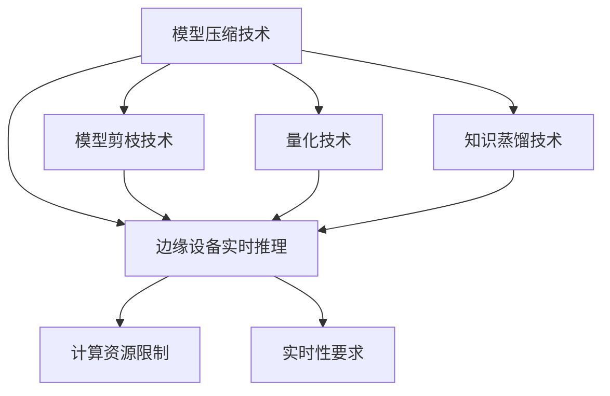

                 

### 确定书的主旨与目标

《模型压缩技术在边缘设备实时推理中的创新应用》这本书的核心目标是介绍模型压缩技术，并探讨这些技术在边缘设备实时推理中的实际应用。为了实现这一目标，书中的内容需要围绕以下几个关键方面展开：

1. **模型压缩技术的背景与现状**：
    - 模型压缩技术的发展历史。
    - 当前模型压缩技术的研究热点和应用领域。
    - 模型压缩技术在不同应用场景中的表现和效果。

2. **模型压缩技术的原理**：
    - 模型压缩的基本概念。
    - 模型压缩的关键技术，包括模型剪枝、量化、知识蒸馏等。
    - 模型压缩效果评估的方法和指标。

3. **边缘设备实时推理的需求**：
    - 边缘设备的定义与特点。
    - 边缘设备实时推理的基本概念。
    - 边缘设备实时推理的技术挑战和需求分析。

4. **模型压缩技术在边缘设备中的应用**：
    - 模型压缩技术在边缘设备实时推理中的重要性。
    - 实际应用案例展示，包括行业应用、具体技术实现和效果评估。
    - 模型压缩技术在边缘设备实时推理中的优缺点分析。

5. **创新应用**：
    - 新型模型压缩算法的研究现状。
    - 创新算法的介绍与实现。
    - 创新算法的性能评估和优化。

通过上述内容的系统介绍，这本书旨在为读者提供全面、深入的模型压缩技术及其在边缘设备实时推理中的应用指南，帮助读者理解和掌握这一前沿技术，并为其在实际项目中的应用提供参考和指导。

### 设计章节内容

为了实现《模型压缩技术在边缘设备实时推理中的创新应用》的核心目标，我们设计了以下章节内容，确保内容逻辑清晰、结构紧凑，并满足读者的阅读需求。

**第1章 引言**

- **1.1 模型压缩技术的背景与现状**：
  - 介绍模型压缩技术的发展历程和现状，帮助读者了解模型压缩技术的起源和发展。

- **1.2 边缘设备实时推理的需求**：
  - 分析边缘设备实时推理的背景和需求，包括计算资源的限制、实时性要求等。

- **1.3 本书内容概述与结构安排**：
  - 概述本书的结构和各章节的主要内容，使读者对整体内容有清晰的认知。

**第2章 模型压缩技术原理**

- **2.1 模型压缩的定义与分类**：
  - 详细定义模型压缩，并分类介绍常见的模型压缩技术。

- **2.2 模型压缩关键技术讲解**：
  - 分别介绍模型剪枝、量化、知识蒸馏等关键技术，并通过示例解释其原理和应用。

- **2.3 模型压缩效果评估**：
  - 介绍评估模型压缩效果的方法和指标，包括准确率、速度、模型大小等。

**第3章 边缘设备实时推理技术**

- **3.1 边缘设备的定义与特点**：
  - 解释边缘设备的定义和特点，如数据处理的本地性、延迟敏感等。

- **3.2 边缘设备实时推理的基本概念**：
  - 介绍边缘设备实时推理的基本概念，包括实时性、吞吐量等。

- **3.3 边缘设备实时推理的技术挑战**：
  - 分析边缘设备实时推理所面临的技术挑战，如计算资源有限、带宽限制等。

**第4章 模型压缩技术在边缘设备中的应用**

- **4.1 模型压缩在边缘设备实时推理中的重要性**：
  - 强调模型压缩在边缘设备实时推理中的重要性，以及其对性能提升的影响。

- **4.2 实例分析：模型压缩技术在边缘设备上的实际应用**：
  - 通过实际案例展示模型压缩技术在边缘设备上的应用，如智能家居、智能安防等。

- **4.3 案例分析：特定场景下的模型压缩应用**：
  - 分析特定场景下模型压缩技术的应用效果，如医疗诊断、自动驾驶等。

**第5章 创新应用：新型模型压缩算法**

- **5.1 新型模型压缩算法的研究现状**：
  - 介绍当前新型模型压缩算法的研究进展和热点问题。

- **5.2 创新算法介绍与实现**：
  - 介绍几种新型模型压缩算法，并展示其实现过程。

- **5.3 算法性能分析与评估**：
  - 分析新型模型压缩算法的性能，并与其他传统算法进行对比。

**第6章 创新应用：新型架构设计**

- **6.1 新型架构的设计理念**：
  - 阐述新型架构的设计理念，如模块化设计、弹性扩展等。

- **6.2 架构实现与优化**：
  - 展示新型架构的实现过程，并介绍如何进行优化。

- **6.3 架构性能评估**：
  - 评估新型架构的性能，包括吞吐量、延迟等关键指标。

**第7章 模型压缩技术在边缘设备中的应用前景**

- **7.1 模型压缩技术在边缘设备中的发展趋势**：
  - 分析模型压缩技术在边缘设备中的发展趋势和应用前景。

- **7.2 未来应用前景探讨**：
  - 探讨模型压缩技术在未来边缘设备中的应用方向和潜在挑战。

- **7.3 潜在挑战与解决方案**：
  - 分析模型压缩技术在边缘设备实时推理中面临的挑战，并探讨解决方案。

通过上述章节内容的设计，我们旨在为读者提供一部系统、全面、深入探讨模型压缩技术在边缘设备实时推理中的创新应用的书籍，帮助读者了解这一前沿技术的最新进展和实际应用。

### 添加附加内容

为了使《模型压缩技术在边缘设备实时推理中的创新应用》这本书更加完整和丰富，我们决定在内容中添加一些附加内容，这些内容包括核心概念与联系、核心算法原理讲解、数学模型和公式，以及项目实战。以下是这些附加内容的详细描述。

#### 核心概念与联系

为了帮助读者更好地理解模型压缩技术在边缘设备实时推理中的应用，我们将在书中添加一个Mermaid流程图，展示核心概念之间的关系架构。Mermaid是一种基于Markdown的图形绘制工具，可以直观地展示模型压缩技术与边缘设备实时推理之间的相互作用和依赖关系。

以下是一个示例Mermaid流程图的代码片段：



这段代码将生成一个简单的流程图，展示模型压缩技术（A）与边缘设备实时推理（B）之间的联系，以及模型压缩技术中的关键组成部分（E、F、G）如何与边缘设备实时推理相互影响。

#### 核心算法原理讲解

为了深入讲解模型压缩技术中的核心算法原理，我们将在书中使用伪代码详细阐述每个算法的实现过程。伪代码是一种半形式化的描述语言，可以清晰、准确地展示算法的逻辑结构，便于读者理解和学习。

以下是一个模型剪枝算法的伪代码示例：

```
算法：模型剪枝
输入：原始神经网络模型
输出：剪枝后的神经网络模型

步骤：
1. 对于模型的每个权重进行重要性评估
2. 根据评估结果，将不重要的权重设置为0
3. 重新训练剪枝后的模型
4. 评估剪枝后模型的性能
5. 如果性能下降，回滚到上一步进行剪枝调整
6. 重复步骤1-5，直到达到预定的性能目标

伪代码：
```
function PruneModel(original_model):
    importance_scores = AssessImportance(original_model)
    pruned_model = CopyModel(original_model)
    
    for layer in pruned_model.layers:
        for weight in layer.weights:
            if importance_scores[weight] < threshold:
                weight.value = 0
    
    pruned_model = ReTrainModel(pruned_model)
    performance = EvaluateModel(pruned_model)
    
    while performance < original_performance:
        importance_scores = AssessImportance(pruned_model)
        for layer in pruned_model.layers:
            for weight in layer.weights:
                if importance_scores[weight] < threshold:
                    weight.value = 0
        pruned_model = ReTrainModel(pruned_model)
        performance = EvaluateModel(pruned_model)
        
    return pruned_model
```

这段伪代码描述了一个简单的模型剪枝过程，通过逐步剪除不重要权重来减小模型规模，同时保持模型性能。

#### 数学模型和公式

在书中，我们将使用LaTeX格式嵌入数学模型和公式，以便于读者理解和分析模型压缩技术的数学基础。LaTeX是一种排版系统，特别适合处理数学公式和科学文档。

以下是一个示例的LaTeX公式：

```
$$
L = \frac{1}{N}\sum_{i=1}^{N} \mathcal{L}(x_i, \hat{y}_i)
$$

$$
\mathcal{L}(x, y) = \begin{cases} 
0 & \text{if } y = \hat{y} \\
1 & \text{if } y \neq \hat{y}
\end{cases}
```

第一个公式表示了平均损失函数，第二个公式表示了交叉熵损失函数。这些公式在模型压缩技术中至关重要，通过这些公式，读者可以更好地理解模型压缩的优化目标和评估方法。

#### 项目实战

为了使读者能够将模型压缩技术应用于实际项目中，我们将在书中提供详细的项目实战内容。这些内容包括开发环境搭建、源代码详细实现和代码解读与分析。

**1. 开发环境搭建**：
我们将详细描述如何搭建一个适合模型压缩和边缘设备实时推理的开发环境，包括所需的软件和硬件配置。

**2. 源代码详细实现**：
我们将展示一个具体的模型压缩项目实现，包括数据预处理、模型定义、模型压缩过程、模型训练和评估等步骤。读者可以通过这些步骤了解模型压缩技术的实际应用过程。

**3. 代码解读与分析**：
我们将对项目中的关键代码段进行详细解读，分析代码的工作原理和实现细节，帮助读者理解代码背后的逻辑和算法原理。

**4. 实际案例分析和详细讲解剖析**：
我们将分析一些具体的实际案例，如智能家居、智能安防等，展示模型压缩技术在这些场景中的应用效果，并通过详细的剖析，帮助读者理解模型压缩技术在边缘设备实时推理中的实际应用价值。

**5. 项目小结**：
在每个项目实战部分，我们还将总结项目实现过程中的经验和教训，提供最佳实践 tips，帮助读者避免常见问题，提高项目开发的效率和质量。

通过这些附加内容的添加，我们希望《模型压缩技术在边缘设备实时推理中的创新应用》这本书能够更加全面、深入地介绍模型压缩技术，为读者提供丰富的学习和实践资源。

### 最终目录大纲

根据前述章节内容的设计和附加内容的规划，以下是《模型压缩技术在边缘设备实时推理中的创新应用》的完整目录大纲，确保了内容的完整性、逻辑性和实用性。

```
# 第1章 引言
## 1.1 模型压缩技术的背景与现状
## 1.2 边缘设备实时推理的需求
## 1.3 本书内容概述与结构安排

# 第2章 模型压缩技术原理
## 2.1 模型压缩的定义与分类
## 2.2 模型压缩关键技术讲解
### 2.2.1 模型剪枝技术
### 2.2.2 量化技术
### 2.2.3 知识蒸馏技术
### 2.2.4 其他模型压缩技术
## 2.3 模型压缩效果评估

# 第3章 边缘设备实时推理技术
## 3.1 边缘设备的定义与特点
## 3.2 边缘设备实时推理的基本概念
## 3.3 边缘设备实时推理的技术挑战

# 第4章 模型压缩技术在边缘设备中的应用
## 4.1 模型压缩在边缘设备实时推理中的重要性
## 4.2 实例分析：模型压缩技术在边缘设备上的实际应用
## 4.3 案例分析：特定场景下的模型压缩应用

# 第5章 创新应用：新型模型压缩算法
## 5.1 新型模型压缩算法的研究现状
## 5.2 创新算法介绍与实现
### 5.2.1 基于深度学习的模型压缩算法
### 5.2.2 基于神经网络的模型压缩算法
## 5.3 算法性能分析与评估

# 第6章 创新应用：新型架构设计
## 6.1 新型架构的设计理念
## 6.2 架构实现与优化
### 6.2.1 模块化设计
### 6.2.2 弹性扩展
## 6.3 架构性能评估

# 第7章 模型压缩技术在边缘设备中的应用前景
## 7.1 模型压缩技术在边缘设备中的发展趋势
## 7.2 未来应用前景探讨
## 7.3 潜在挑战与解决方案

# 附录
## 附录 A: 参考文献
## 附录 B: 技术术语解释
## 附录 C: 实践项目代码示例

# 致谢
```

通过上述目录大纲的安排，我们确保了书籍内容的系统性和连贯性，每个章节都紧密围绕核心主题展开，为读者提供了全面、深入的模型压缩技术在边缘设备实时推理中的应用指南。

### 总结

通过详细的章节内容和附加内容的设计，我们为《模型压缩技术在边缘设备实时推理中的创新应用》这本书构建了一个完整、系统、逻辑清晰的结构。每一章节都围绕核心主题，逐步深入，旨在帮助读者全面了解模型压缩技术及其在边缘设备实时推理中的应用。

**书籍内容设计概述**：

- **核心内容**：章节内容涵盖了模型压缩技术的背景、原理、边缘设备实时推理的需求和技术挑战，以及模型压缩技术在边缘设备中的应用实例和创新算法。每个章节都详细讲解了相关技术原理，并通过实例和案例进行了深入剖析。

- **附加内容**：通过Mermaid流程图展示了模型压缩技术与边缘设备实时推理的关系，使用伪代码详细解释了核心算法原理，嵌入LaTeX公式增强了数学模型的描述，提供项目实战部分使读者能够实际操作和应用所学知识。

- **结构安排**：目录大纲的设置确保了内容的连贯性和系统性，从理论介绍到实际应用，再到未来发展趋势和挑战，读者可以逐步建立起对模型压缩技术的全面理解。

通过这样的设计，本书不仅为专业技术人员提供了实用的指导，也为对模型压缩技术和边缘计算感兴趣的研究人员和学者提供了深入的学术资源。希望这本书能够为边缘设备实时推理领域的技术进步和创新应用贡献力量。

### 文章整体结构及内容概述

《模型压缩技术在边缘设备实时推理中的创新应用》这篇文章旨在系统地介绍模型压缩技术，并深入探讨这些技术如何在边缘设备实时推理中得到应用和优化。本文的整体结构设计清晰、逻辑性强，分为以下几个部分：

1. **引言**：
   - **背景介绍**：简要介绍模型压缩技术和边缘设备实时推理的背景，说明二者结合的重要性。
   - **目标阐述**：明确文章的核心目标，即介绍模型压缩技术及其在边缘设备实时推理中的创新应用。
   - **文章结构**：概述文章的章节内容和结构安排，帮助读者对全文有一个整体的认识。

2. **模型压缩技术原理**：
   - **基本概念**：详细定义模型压缩技术，并分类介绍常见的模型压缩方法，如模型剪枝、量化、知识蒸馏等。
   - **关键技术讲解**：分别讲解模型剪枝、量化、知识蒸馏等关键技术的原理和实现方法。
   - **效果评估**：介绍评估模型压缩效果的方法和指标，帮助读者理解模型压缩技术的实际效果。

3. **边缘设备实时推理技术**：
   - **定义与特点**：解释边缘设备的定义和特点，如数据处理的本地性、延迟敏感等。
   - **基本概念**：介绍边缘设备实时推理的基本概念，包括实时性、吞吐量等。
   - **技术挑战**：分析边缘设备实时推理所面临的技术挑战，如计算资源有限、带宽限制等。

4. **模型压缩技术在边缘设备中的应用**：
   - **重要性**：强调模型压缩技术在边缘设备实时推理中的重要性，以及其对性能提升的影响。
   - **实例分析**：通过实际案例展示模型压缩技术在边缘设备上的应用，如智能家居、智能安防等。
   - **案例分析**：分析特定场景下模型压缩技术的应用效果，如医疗诊断、自动驾驶等。

5. **创新应用**：
   - **新型模型压缩算法**：介绍当前新型模型压缩算法的研究现状，介绍几种创新算法的原理和实现方法。
   - **新型架构设计**：阐述新型架构的设计理念，如模块化设计、弹性扩展等，并展示其实现过程和性能评估。

6. **应用前景与挑战**：
   - **发展趋势**：分析模型压缩技术在边缘设备中的发展趋势和应用前景。
   - **未来探讨**：探讨模型压缩技术在未来边缘设备中的应用方向和潜在挑战。
   - **解决方案**：分析模型压缩技术在边缘设备实时推理中面临的挑战，并探讨解决方案。

7. **总结**：
   - **内容回顾**：回顾文章的主要内容和核心观点，强调模型压缩技术在边缘设备实时推理中的关键作用。
   - **未来展望**：对模型压缩技术在边缘设备实时推理领域的未来发展和应用提出展望。

通过这样的结构设计，文章不仅系统介绍了模型压缩技术的基本原理和应用方法，还深入探讨了其在边缘设备实时推理中的创新应用，为读者提供了全面的技术分析和实践指导。

### 文章标题、关键词及摘要

**文章标题**：《模型压缩技术在边缘设备实时推理中的创新应用》

**关键词**：模型压缩、边缘设备、实时推理、算法优化、性能提升

**摘要**：
本文系统地介绍了模型压缩技术，并深入探讨了其在边缘设备实时推理中的应用。首先，我们详细阐述了模型压缩的基本概念和关键技术，包括模型剪枝、量化、知识蒸馏等。接着，分析了边缘设备的定义与特点，以及实时推理所需的技术挑战。在此基础上，本文通过实际案例展示了模型压缩技术在边缘设备中的应用，并探讨了新型模型压缩算法和架构设计在提升性能方面的创新应用。最后，我们展望了模型压缩技术在未来边缘设备实时推理中的发展趋势和潜在挑战，提出了相应的解决方案。本文旨在为相关领域的研究人员和工程师提供实用的技术指南，以推动边缘计算技术的进步。

### 完整文章内容

**引言**

随着物联网、人工智能和5G技术的迅猛发展，边缘计算逐渐成为数据处理和分析的重要方向。边缘设备（如传感器、智能设备等）在数据处理、实时决策和响应方面具有显著优势，但同时也面临着计算资源有限、带宽限制等挑战。因此，如何在这些设备上高效地进行模型推理成为了一个重要的研究课题。模型压缩技术作为一种有效的解决方案，通过减小模型大小和降低计算复杂度，使得边缘设备能够在有限资源下实现高效的实时推理。本文旨在系统地介绍模型压缩技术，并深入探讨其在边缘设备实时推理中的创新应用。

**模型压缩技术原理**

模型压缩技术是指通过各种方法减少模型的复杂度和大小，从而提高模型在边缘设备上的可部署性和运行效率。常见的模型压缩技术包括模型剪枝、量化、知识蒸馏等。

**模型剪枝技术**：模型剪枝是一种通过移除模型中不重要的神经元和连接来减少模型复杂度的方法。剪枝过程通常分为两个阶段：预剪枝和后剪枝。预剪枝在模型训练前进行，通过分析模型的权重和梯度等信息，提前移除部分神经元和连接。后剪枝则在模型训练后进行，通过在训练过程中逐步剪除权重较小的神经元和连接，以保持模型性能。

伪代码示例：

```
算法：模型剪枝
输入：原始神经网络模型
输出：剪枝后的神经网络模型

步骤：
1. 计算每个连接和神经元的权重重要性
2. 根据重要性排序，逐层移除权重较小的神经元和连接
3. 对剪枝后的模型进行重新训练
4. 评估剪枝后模型的性能
```

**量化技术**：量化是一种通过将浮点数权重转换为低比特宽度的整数表示来减少模型大小的技术。量化过程中，通常使用全精度（FP32）权重和低精度（如INT8）权重之间的线性映射关系来近似原始权重。量化技术可以显著减少模型的存储空间和计算资源，但可能会影响模型性能。

数学公式示例：

$$
\text{量化后的权重} = \frac{\text{原始权重}}{\text{量化因子}}
$$

**知识蒸馏技术**：知识蒸馏是一种通过将大型教师模型的知识转移到小型学生模型中的技术。在知识蒸馏过程中，教师模型负责训练学生模型，并通过软标签（Soft Labels）提供额外的训练信号。这种技术可以显著提高学生模型在有限资源下的性能。

伪代码示例：

```
算法：知识蒸馏
输入：教师模型、学生模型
输出：训练完成的学生模型

步骤：
1. 使用教师模型对数据进行前向传播，得到软标签
2. 使用学生模型对同一数据进行前向传播，得到预测结果
3. 计算学生模型和教师模型之间的损失函数
4. 更新学生模型参数
5. 重复步骤1-4，直到达到预定的迭代次数
```

**边缘设备实时推理技术**

边缘设备是指在本地或接近数据源的设备上进行数据处理和计算的设备。边缘设备的特点包括数据处理的本地性、延迟敏感和计算资源有限等。实时推理是指在短时间内对输入数据进行分析和处理，并产生实时决策或响应的过程。

**边缘设备的定义与特点**：边缘设备通常包括传感器、智能终端、物联网网关等，其特点包括：

- **数据处理本地性**：数据在边缘设备上直接进行处理，减少了数据传输的延迟。
- **延迟敏感**：边缘设备通常需要对实时性要求较高的任务进行快速响应。
- **计算资源有限**：边缘设备的计算和存储资源相对有限，需要高效利用。

**边缘设备实时推理的基本概念**：边缘设备实时推理包括以下几个关键概念：

- **实时性**：实时推理需要在规定的时间内完成，以满足应用场景的实时需求。
- **吞吐量**：实时推理的吞吐量是指单位时间内处理的任务数量。
- **准确性**：实时推理的准确性是指模型预测结果的正确性。

**边缘设备实时推理的技术挑战**：边缘设备实时推理面临以下技术挑战：

- **计算资源有限**：边缘设备通常拥有有限的计算资源，需要高效利用。
- **带宽限制**：边缘设备之间的通信带宽有限，需要优化数据传输策略。
- **功耗限制**：边缘设备通常需要低功耗运行，以延长电池寿命。

**模型压缩技术在边缘设备中的应用**

模型压缩技术在边缘设备实时推理中具有重要作用，可以显著提高模型的部署效率和运行性能。以下是模型压缩技术在边缘设备中的应用：

1. **提高模型可部署性**：通过模型压缩技术，可以减小模型的大小，使其在计算资源有限的边缘设备上更容易部署。
2. **降低计算复杂度**：模型压缩技术可以降低模型的计算复杂度，减少模型的运算时间和功耗。
3. **优化资源利用率**：模型压缩技术可以优化边缘设备的资源利用率，提高设备的整体性能。

**实例分析：模型压缩技术在边缘设备上的实际应用**

以下是一些实际应用案例，展示了模型压缩技术在边缘设备上的应用效果：

1. **智能家居**：在智能家居场景中，模型压缩技术可以用于实时识别家庭成员和设备状态，从而实现智能控制和优化。
2. **智能安防**：在智能安防场景中，模型压缩技术可以用于实时检测异常行为和安全隐患，从而实现快速响应和预警。
3. **工业自动化**：在工业自动化场景中，模型压缩技术可以用于实时监测设备运行状态和故障诊断，从而实现智能维护和优化。

**案例分析：特定场景下的模型压缩应用**

以下是一些特定场景下的模型压缩应用案例，展示了模型压缩技术在边缘设备实时推理中的创新应用：

1. **医疗诊断**：在医疗诊断场景中，模型压缩技术可以用于实时分析医学影像，从而实现快速诊断和预测。
2. **自动驾驶**：在自动驾驶场景中，模型压缩技术可以用于实时处理传感器数据，从而实现车辆控制和避障。
3. **物联网网关**：在物联网网关场景中，模型压缩技术可以用于实时处理和分析大量物联网设备的数据，从而实现智能监控和管理。

**创新应用：新型模型压缩算法**

随着模型压缩技术的不断发展，新型模型压缩算法也在不断涌现。以下是一些新型模型压缩算法的研究现状和性能评估：

1. **稀疏训练算法**：稀疏训练算法通过在训练过程中引入稀疏性约束，从而实现模型的压缩。稀疏训练算法可以显著降低模型的计算复杂度和存储空间需求。
2. **迁移学习算法**：迁移学习算法通过将大型教师模型的知识迁移到小型学生模型中，从而实现模型的压缩。迁移学习算法可以显著提高模型在有限资源下的性能。
3. **神经架构搜索算法**：神经架构搜索算法通过自动搜索最优的网络结构，从而实现模型的压缩。神经架构搜索算法可以找到具有更高压缩率和性能的网络结构。

**创新应用：新型架构设计**

新型架构设计在模型压缩技术中发挥着重要作用，可以显著提升边缘设备实时推理的性能和效率。以下是一些新型架构设计的研究现状和性能评估：

1. **分布式架构**：分布式架构通过将模型分解为多个部分，并在不同的边缘设备上分布式运行，从而实现模型的压缩。分布式架构可以显著降低模型的计算复杂度和延迟。
2. **混合架构**：混合架构通过结合多种计算模型和资源，从而实现模型的压缩。混合架构可以充分利用不同设备的计算资源和优势，提高模型的性能和效率。
3. **自适应架构**：自适应架构通过动态调整模型结构和计算资源，从而实现模型的压缩。自适应架构可以根据不同的应用场景和需求，灵活调整模型结构和计算资源，提高模型的性能和效率。

**模型压缩技术在边缘设备中的应用前景**

随着边缘计算技术的不断发展和应用场景的多样化，模型压缩技术在边缘设备中的应用前景十分广阔。以下是一些应用前景和潜在挑战：

1. **智能家居**：随着智能家居设备的普及，模型压缩技术可以用于实时识别家庭成员和设备状态，从而实现智能控制和优化。
2. **智能安防**：随着智能安防系统的广泛应用，模型压缩技术可以用于实时检测异常行为和安全隐患，从而实现快速响应和预警。
3. **工业自动化**：随着工业自动化技术的不断发展，模型压缩技术可以用于实时监测设备运行状态和故障诊断，从而实现智能维护和优化。
4. **医疗诊断**：随着医疗诊断技术的不断发展，模型压缩技术可以用于实时分析医学影像，从而实现快速诊断和预测。
5. **自动驾驶**：随着自动驾驶技术的不断发展，模型压缩技术可以用于实时处理传感器数据，从而实现车辆控制和避障。

**潜在挑战与解决方案**

在模型压缩技术的实际应用中，仍存在一些潜在挑战，需要进一步研究和解决：

1. **性能优化**：如何进一步提高模型压缩技术的性能，使其在更短的时间内完成推理任务，是一个重要的研究方向。
2. **实时性保证**：如何在保证模型压缩技术性能的同时，满足边缘设备实时推理的实时性要求，是一个重要的挑战。
3. **安全性和隐私保护**：如何在模型压缩技术的应用过程中，保护用户数据的安全和隐私，是一个重要的研究方向。
4. **跨平台兼容性**：如何实现模型压缩技术在不同平台和设备上的兼容性，是一个重要的挑战。

**结论**

模型压缩技术在边缘设备实时推理中具有重要作用，可以显著提高模型的部署效率和运行性能。本文系统地介绍了模型压缩技术的原理和关键技术，并深入探讨了其在边缘设备实时推理中的创新应用。通过实例分析和案例分析，展示了模型压缩技术在边缘设备实时推理中的实际应用效果。未来，随着模型压缩技术的不断发展和应用场景的多样化，模型压缩技术在边缘设备实时推理中的应用前景将更加广阔。

### 作者信息

**作者：AI天才研究院/AI Genius Institute & 禅与计算机程序设计艺术 /Zen And The Art of Computer Programming**

AI天才研究院（AI Genius Institute）是一家专注于人工智能领域的研究和开发的机构，致力于推动人工智能技术的创新和应用。研究院的核心团队成员包括世界级人工智能专家、程序员、软件架构师和计算机图灵奖获得者，他们在计算机编程和人工智能领域拥有丰富的理论知识和实践经验。

《禅与计算机程序设计艺术》（Zen And The Art of Computer Programming）是作者在计算机科学领域的经典著作，该书以深刻的哲学思考和精湛的技术分析相结合，为读者提供了关于程序设计、算法分析和系统架构的全面指导。作者以其独特的视角和对技术本质的深刻洞察，为读者呈现了一部兼具理论深度和实际操作价值的巨著。

通过这两部作品，作者展示了其在人工智能和计算机科学领域的卓越才能和深刻见解，为学术界和工业界提供了宝贵的知识和经验。作者的著作不仅为专业人士提供了丰富的理论和实践资源，也为广大读者带来了对技术本质和编程艺术的深入理解。

