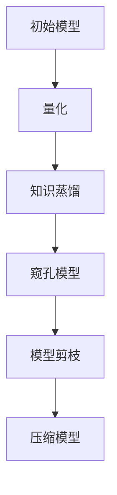
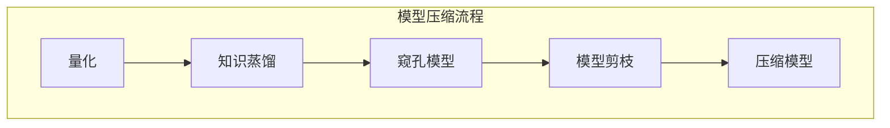

                 

### 前言

#### 1.1 研究背景与意义

在当今数字化时代，人工智能（AI）技术正以前所未有的速度发展，并在各个领域展现出巨大的潜力。随着深度学习技术的普及，大规模神经网络模型成为了AI研究和应用的主流。这些模型在处理复杂任务时表现出色，但同时也带来了巨大的计算资源和存储需求。推理能力是深度学习模型的关键性能指标之一，直接关系到模型的实际应用效果。然而，随着模型规模的不断扩大，推理速度和效率成为了制约其广泛应用的瓶颈。

模型压缩技术应运而生，通过减少模型参数和计算量，实现对模型的有效压缩，从而提高推理效率和降低资源消耗。模型压缩不仅有助于降低计算成本，还可以提高模型的部署灵活性和可扩展性，这对于实现高效能的AI应用至关重要。

本文旨在系统地研究模型压缩技术对推理能力的影响，探讨不同压缩算法的基本原理、数学模型及其实际应用效果。本文将首先介绍模型压缩技术和推理能力的定义和背景，然后详细分析各种模型压缩算法的原理和实现方法，并通过实例进行说明。接着，本文将深入探讨模型压缩技术中的数学模型和公式，并结合实际项目进行代码实现和性能分析。最后，本文将对研究成果进行总结和展望，提出未来模型压缩技术的研究方向和应用策略。

通过本文的研究，希望能够为深度学习模型的压缩和应用提供有价值的参考，推动模型压缩技术在实际应用中的进一步发展和优化。

#### 1.2 研究方法与章节安排概述

本文的研究方法采用逻辑清晰、结构紧凑、简单易懂的专业技术语言，通过逐步分析推理的方式，详细阐述模型压缩技术对推理能力的影响。本文的结构安排如下：

1. **前言**：介绍研究背景与意义，明确研究目标和方法。
2. **基础理论**：概述模型压缩技术和推理能力的基本概念和原理。
3. **核心算法原理讲解**：详细讲解模型压缩技术的核心算法，包括量化、知识蒸馏、窥孔模型和模型剪枝。
4. **数学模型和公式讲解**：分析模型压缩技术的数学模型和公式，结合实例进行说明。
5. **项目实战**：通过实际项目案例，展示模型压缩技术的应用和性能分析。
6. **总结与展望**：总结研究成果，提出未来发展方向和应用策略。

阅读指南：
- **第1章**：了解研究背景和整体结构。
- **第2章**：掌握模型压缩技术和推理能力的基本概念。
- **第3章**：深入理解模型压缩算法的原理和实现方法。
- **第4章**：熟悉模型压缩技术的数学模型和公式。
- **第5章**：通过实战项目，验证模型压缩技术的实际效果。
- **第6章**：总结研究成果，展望未来研究方向。

通过以上章节的阅读，读者可以系统地了解模型压缩技术对推理能力的影响，并掌握相关的技术和方法。

#### 1.3 Mermaid流程图：模型压缩技术原理

为了更好地理解模型压缩技术的基本原理，我们可以使用Mermaid流程图来展示模型压缩的流程。以下是一个简化的模型压缩流程图，包含量化、知识蒸馏、窥孔模型和模型剪枝四个核心步骤。



- **初始模型（A）**：首先是原始的深度学习模型，这个模型在训练过程中已经达到了较好的性能。
- **量化（B）**：量化是一种通过将浮点数参数转换为低精度整数来减少模型大小和计算量的方法。
- **知识蒸馏（C）**：知识蒸馏通过将大模型（教师模型）的知识转移到小模型（学生模型）中，以保留推理能力。
- **窥孔模型（D）**：窥孔模型通过部分隐藏层或隐藏单元来实现模型压缩，同时保持模型的推理能力。
- **模型剪枝（E）**：模型剪枝通过删除冗余的权重或神经元来减少模型大小，而不显著损失性能。
- **压缩模型（F）**：最终，通过上述步骤得到的压缩模型可以在保持推理能力的同时显著降低计算和存储需求。

通过上述Mermaid流程图，我们可以清晰地看到模型压缩技术的基本步骤和各步骤之间的关联。这个流程图为后续章节中详细讲解模型压缩技术提供了直观的背景和框架。

#### 2.1 模型压缩技术概述

模型压缩技术是指通过一系列算法和技术手段，将深度学习模型的大小和计算复杂度降低，从而提高模型在资源受限环境中的应用效率。模型压缩技术在当今快速发展的AI领域具有重要意义，特别是在移动设备、嵌入式系统和边缘计算等场景中，模型压缩能够显著降低计算资源的需求，提高模型的部署和运行效率。

首先，**模型压缩的定义**是指通过对深度学习模型进行优化，减少其参数数量和计算量，同时尽可能保留原始模型的推理能力。这包括量化、剪枝、知识蒸馏、低秩分解等多种技术。

接下来，**模型压缩技术的发展现状**方面，随着深度学习模型的规模不断增大，模型压缩技术也逐渐成为研究热点。近年来，各种高效的模型压缩算法被提出并应用于实际场景，例如Facebook的TF-Slim、谷歌的TensorFlow Model Optimization Toolkit（TFOpt）等工具。这些工具不仅提供了丰富的压缩算法，还支持自动化压缩和优化流程，使得模型压缩更加便捷和高效。

此外，模型压缩技术的应用场景十分广泛。在**移动设备**方面，模型压缩技术可以显著降低模型的内存占用和计算时间，使得移动应用能够更加流畅地运行复杂的深度学习任务。在**嵌入式系统**方面，由于资源受限，模型压缩技术能够确保模型在有限的计算资源下仍能保持较高的性能。在**边缘计算**领域，模型压缩技术能够提高边缘节点的处理能力，使得边缘设备能够实时处理数据，减少对中心服务器的依赖。

总体而言，模型压缩技术在降低计算成本、提高模型部署效率方面发挥着重要作用。通过模型压缩，不仅可以实现更高效的推理过程，还能够为AI应用拓展更广泛的应用场景。随着AI技术的不断发展，模型压缩技术也将继续演进，为深度学习模型的高效应用提供强有力的支持。

#### 2.2 推理能力原理

推理能力是深度学习模型的关键性能指标之一，直接关系到模型在实际应用中的效果。首先，**推理能力的定义**是指模型在给定输入数据后，能够通过内部计算和逻辑推理，输出预期的结果或决策。推理能力不仅涉及模型的准确性，还包括模型的响应速度和效率。

**推理能力的评估指标**主要包括以下几个：

1. **准确率（Accuracy）**：准确率是评估模型推理能力最常用的指标，表示模型正确预测的样本占总样本的比例。高准确率表明模型在大多数情况下能够正确分类或识别输入数据。

2. **召回率（Recall）**：召回率是评估模型在识别正类样本时的表现，表示正确识别的正类样本占总正类样本的比例。召回率对于少数类样本的识别尤为重要。

3. **F1分数（F1 Score）**：F1分数是准确率和召回率的调和平均，综合考虑了模型在正负样本分类中的性能，是综合评估模型推理能力的有效指标。

4. **推理速度（Inference Speed）**：推理速度是指模型在处理给定输入数据时的计算时间，对于需要实时响应的应用场景尤为重要。

尽管这些评估指标能够较为全面地反映模型的推理能力，但不同指标之间存在一定的权衡关系。例如，在某些任务中，提高准确率可能需要牺牲推理速度，反之亦然。因此，在实际应用中，需要根据具体需求和场景，选择合适的评估指标来衡量模型的推理能力。

**推理能力的瓶颈**主要来源于以下几个方面：

1. **计算资源限制**：大规模神经网络模型在推理过程中需要大量的计算资源，特别是在资源受限的移动设备和嵌入式系统中，计算资源成为制约推理能力的重要因素。

2. **存储容量限制**：模型参数和中间计算结果需要占用大量的存储空间，特别是在存储资源有限的场景中，模型的存储需求成为瓶颈。

3. **能耗消耗**：深度学习模型在推理过程中会产生大量的能耗，对于需要长时间运行或频繁更新的应用场景，能耗成为重要的性能瓶颈。

4. **算法复杂度**：一些复杂的深度学习算法在处理大规模数据时，计算复杂度较高，导致推理速度较慢，从而影响模型的实时性和响应能力。

为了克服这些瓶颈，研究人员提出了多种优化策略，包括模型压缩技术、硬件加速技术、分布式计算技术等。这些技术通过减少模型参数和计算量、提高计算效率、优化算法结构等方式，提升模型的推理能力，从而实现高效能的AI应用。

#### 2.3 Mermaid流程图：模型压缩技术原理

为了更直观地展示模型压缩技术的原理，我们可以使用Mermaid流程图来描述整个压缩过程，包括量化、知识蒸馏、窥孔模型和模型剪枝四个核心步骤。



- **量化（Quantization）**：量化是将模型中的浮点数参数转换为低精度整数的过程，以减少模型大小和计算量。量化分为全局量化和本地量化，前者在整个模型中统一调整精度，后者则在每个层或每个神经元中独立调整。

- **知识蒸馏（Knowledge Distillation）**：知识蒸馏是一种通过将大模型（教师模型）的知识转移到小模型（学生模型）中的方法。教师模型通常具有更高的准确率和更强的推理能力，学生模型通过学习教师模型的输出分布来保留其推理能力。

- **窥孔模型（Pruning）**：窥孔模型通过删除部分权重或神经元来减少模型大小。剪枝可以分为结构剪枝和权重剪枝，前者通过移除整个神经元或层来简化模型，后者则通过减小权重值来降低模型复杂度。

- **模型剪枝（Pruning）**：剪枝是一种通过删除冗余权重或神经元来减少模型大小的方法。剪枝可以分为基于梯度的剪枝和基于模型的剪枝，前者通过优化算法在训练过程中逐步剪枝，后者则通过预先设定规则进行剪枝。

- **压缩模型（Compressed Model）**：通过上述步骤，最终得到的压缩模型在保持推理能力的同时，显著降低了计算和存储需求，适用于资源受限的场景。

通过上述Mermaid流程图，我们可以清晰地看到模型压缩技术的整体框架和各步骤之间的关联。这不仅有助于理解模型压缩的基本原理，还为后续章节中详细讲解各个算法提供了直观的背景和参考。

### 3.1 模型压缩算法原理

模型压缩技术通过多种算法来实现对深度学习模型的压缩，从而在保持推理能力的同时减少计算和存储资源的需求。以下是几种主要的模型压缩算法原理：

**1. 量化**

量化是一种通过将浮点数参数转换为低精度整数的方法，以减少模型的大小和计算量。量化可以分为全局量化（Global Quantization）和本地量化（Local Quantization）两种类型。

- **全局量化**：全局量化在整个模型中统一调整精度。具体方法包括最小二乘量化（L2 Quantization）和最小均方误差量化（L1 Quantization）。最小二乘量化通过将每个参数映射到最近的整数值，使得量化误差最小。最小均方误差量化则通过计算每个参数与最近整数值之间的均方误差，并选择误差最小的整数值。

- **本地量化**：本地量化在每一层或每个神经元中独立调整精度。这种方法能够更好地适应不同层的参数特性，但需要更多的计算资源进行精度调整。

量化算法的伪代码如下：

```python
# 量化算法伪代码
for layer in model.layers:
    for weight in layer.weights:
        quantized_weight = round(weight / scale_factor)
        weight.assign(quantized_weight)
```

**2. 知识蒸馏**

知识蒸馏是一种通过将大模型（教师模型）的知识转移到小模型（学生模型）中的方法。教师模型通常具有更高的准确率和更强的推理能力，而学生模型则通过学习教师模型的输出分布来保留其推理能力。

知识蒸馏过程可以分为以下几个步骤：

- **选择教师模型**：选择一个具有高准确率的教师模型，通常是一个更大的、未压缩的模型。
- **生成软标签**：将输入数据通过教师模型处理，得到输出概率分布，这些概率分布作为软标签。
- **训练学生模型**：使用教师模型的软标签来训练学生模型，通过最小化软标签和学生模型输出之间的差距来优化学生模型。

知识蒸馏算法的伪代码如下：

```python
# 知识蒸馏算法伪代码
for input_data in dataset:
    teacher_output = teacher_model.forward(input_data)
    soft_labels = softmax(teacher_output)
    student_model.train(input_data, soft_labels)
```

**3. 窥孔模型**

窥孔模型（Sparsity）通过部分隐藏层或隐藏单元来实现模型压缩。窥孔模型可以分为以下几种类型：

- **稀疏层**：通过移除大部分权重，只保留少量重要权重来简化模型。
- **稀疏单元**：通过在单个神经元中移除大部分权重，只保留关键路径上的权重。

窥孔模型的伪代码如下：

```python
# 窥孔模型算法伪代码
for layer in model.layers:
    for unit in layer.units:
        if sparsity_rate > random_uniform(0, 1):
            unit.weights.clear()
```

**4. 模型剪枝**

模型剪枝通过删除冗余的权重或神经元来减少模型大小。剪枝可以分为基于梯度的剪枝和基于模型的剪枝。

- **基于梯度的剪枝**：通过在训练过程中逐步剪枝，根据梯度信息判断哪些权重对模型性能的影响较小，从而进行剪枝。
- **基于模型的剪枝**：通过预先设定规则进行剪枝，如移除绝对值较小的权重或神经元。

模型剪枝的伪代码如下：

```python
# 模型剪枝算法伪代码
for layer in model.layers:
    for weight in layer.weights:
        if weight.abs() < threshold:
            weight.assign(0)
```

通过上述算法，模型压缩技术能够有效减少模型的参数数量和计算量，从而提高模型在资源受限环境中的应用效率。这些算法不仅有助于降低计算和存储需求，还能够提高模型的部署灵活性和可扩展性。

### 3.2 伪代码：模型压缩算法详细讲解

为了更详细地讲解模型压缩算法，我们将分别介绍量化、知识蒸馏、窥孔模型和模型剪枝的伪代码，并解释每个算法的步骤和原理。

#### 量化算法伪代码

```python
# 量化算法伪代码
for layer in model.layers:
    for weight in layer.weights:
        # 计算量化尺度因子
        scale_factor = 1.0 / (2 ** (quantization_bits))
        # 将浮点权重转换为整数
        quantized_weight = round(weight / scale_factor)
        # 更新权重
        weight.assign(quantized_weight)
```

**解释**：
- 量化算法通过将浮点数权重转换为整数，从而减少模型大小。`scale_factor`用于确定量化精度，`quantization_bits`是量化位数。通过除以`scale_factor`，权重被缩放到一个较小的范围，然后通过四舍五入转换为最接近的整数值。
- 在实际应用中，量化位数通常选择为2的幂次，如2、4、8等，以保持数值的可处理性。

#### 知识蒸馏算法伪代码

```python
# 知识蒸馏算法伪代码
for input_data in dataset:
    # 使用教师模型进行前向传播
    teacher_output = teacher_model.forward(input_data)
    # 生成软标签
    soft_labels = softmax(teacher_output)
    # 使用学生模型进行前向传播
    student_output = student_model.forward(input_data)
    # 计算知识蒸馏损失
    loss = distillation_loss(student_output, soft_labels)
    # 更新学生模型权重
    student_model.backward(loss)
```

**解释**：
- 知识蒸馏通过将教师模型（通常是一个较大的、性能较好的模型）的输出（软标签）用于训练学生模型（通常是一个较小的、待优化的模型）。软标签是教师模型对输入数据的概率分布输出。
- `softmax`函数用于将教师模型的输出转换为概率分布，`distillation_loss`用于计算学生模型输出与软标签之间的损失，以指导学生模型的训练。

#### 窥孔模型算法伪代码

```python
# 窥孔模型算法伪代码
for layer in model.layers:
    for unit in layer.units:
        # 设定窥孔率
        sparsity_rate = 0.5
        # 随机选择是否进行窥孔
        if random_uniform(0, 1) < sparsity_rate:
            # 清除所有权重
            unit.weights.clear()
            # 保留一个权重作为窥孔路径
            unit.weights.append(random_uniform(-1, 1))
```

**解释**：
- 窥孔模型通过在神经网络中引入稀疏性，从而简化模型结构。`sparsity_rate`定义了单元中剩余权重的比例。
- 通过随机选择，部分神经元（单元）的权重被移除，只保留一个或少量权重，以创建一条简化的计算路径。

#### 模型剪枝算法伪代码

```python
# 模型剪枝算法伪代码
for layer in model.layers:
    for weight in layer.weights:
        # 设定剪枝阈值
        threshold = 0.01
        # 如果权重绝对值小于阈值，则将其设为0
        if abs(weight) < threshold:
            weight.assign(0)
```

**解释**：
- 模型剪枝通过移除绝对值较小的权重，以减少模型参数数量。`threshold`定义了权重剪枝的阈值。
- 在训练过程中，基于权重的重要性和贡献度，可以设置不同的阈值进行剪枝，从而优化模型结构。

通过上述伪代码，我们可以详细理解量化、知识蒸馏、窥孔模型和模型剪枝算法的原理和实现步骤，这些算法共同作用，有效提升了模型的压缩效果和推理能力。

### 4.1 模型压缩数学模型

在模型压缩技术中，数学模型和公式是理解和实现压缩算法的基础。这些模型和公式不仅帮助我们评估模型的复杂度，还能分析压缩算法对推理能力的影响。以下是模型压缩中常用的几个数学模型和公式。

**1. 模型复杂度评估**

模型复杂度通常通过参数数量（$C$）和计算复杂度（$F$）来评估。参数数量表示模型中权重和偏置的总数，而计算复杂度则反映了模型在推理过程中所需的计算量。

- **参数数量**：
  $$ C = \sum_{l=1}^L \sum_{k=1}^{K_l} \sum_{j=1}^{J_l} |w_{ljk}| $$
  其中，$L$表示层的数量，$K_l$表示第$l$层的神经元数量，$J_l$表示第$l$层的输入神经元数量，$w_{ljk}$表示第$l$层中第$k$个神经元连接到第$l+1$层第$j$个神经元的权重。

- **计算复杂度**：
  $$ F = \sum_{l=1}^L \sum_{k=1}^{K_l} \sum_{j=1}^{J_l} |w_{ljk}| $$
  计算复杂度通常与模型中的权重操作次数相关，可以近似为模型中所有权重乘积的绝对值之和。

**2. 算法效率分析**

算法效率分析主要关注模型压缩算法在压缩率和推理性能之间的权衡。以下是几个关键的效率评估指标：

- **压缩率**：
  $$ Compression\ Rate = \frac{Original\ Model\ Size}{Compressed\ Model\ Size} $$
  压缩率反映了模型压缩前后大小的比例，通常以百分比表示。

- **推理性能**：
  $$ Inference\ Performance = \frac{Original\ Inference\ Time}{Compressed\ Inference\ Time} $$
  推理性能是压缩模型与原始模型在推理速度上的比较，通常以时间或帧率为单位。

**3. 推理能力与模型大小的关系**

推理能力与模型大小之间存在复杂的交互关系。数学模型可以帮助我们理解这种关系，并指导优化策略的制定。

- **推理能力损失**：
  $$ Loss\ of\ Inference\ Capability = 1 - \frac{Compressed\ Accuracy}{Original\ Accuracy} $$
  推理能力损失表示压缩模型在保持准确率方面的损失。

- **最优压缩率**：
  $$ Optimal\ Compression\ Rate = \arg\min_{CR} \left( Loss\ of\ Inference\ Capability \right) $$
  最优压缩率是指能够最小化推理能力损失的压缩率，通常通过实验和优化策略来确定。

通过这些数学模型和公式，我们可以从不同角度分析模型压缩技术对推理能力的影响，并指导优化策略的制定。例如，通过调整量化精度、选择合适的压缩算法以及优化训练过程，可以在保持高推理能力的同时实现高效的模型压缩。

### 4.2 数学公式讲解

在模型压缩技术中，数学公式起到了至关重要的作用，它们不仅帮助我们量化模型的复杂度，还指导我们选择最优的压缩策略。以下是对几个关键数学公式的详细解释。

**1. 量化误差计算公式**

量化误差是模型压缩过程中一个重要的考量因素，它反映了量化操作对模型性能的影响。量化误差的计算公式如下：

$$ E_q = \frac{1}{N} \sum_{i=1}^N (x_i - \text{round}(x_i / Q))^2 $$

其中，$x_i$是原始浮点数值，$Q$是量化步长，$\text{round}$表示四舍五入操作。$N$是数值的总数。量化误差通过计算每个数值与其量化后值之间的平方误差，然后取平均得到。

**2. 知识蒸馏损失函数**

知识蒸馏损失函数用于衡量学生模型与教师模型输出之间的差距，其公式如下：

$$ L_d = \frac{1}{N} \sum_{i=1}^N (\sigma(y_i) - s_i) \cdot (1 - s_i) $$

其中，$y_i$是学生模型的输出，$s_i$是教师模型输出的软标签，$\sigma$是softmax函数。这个损失函数通过比较学生模型输出和教师模型软标签之间的差异来指导模型的训练。

**3. 窥孔模型选择公式**

窥孔模型的选择公式决定了哪些权重或神经元被保留或移除。常见的窥孔选择公式包括基于阈值的选择和基于概率的选择。

- **基于阈值的窥孔选择公式**：

$$ P_j = \begin{cases} 
1 & \text{if } |w_j| > \text{threshold} \\
0 & \text{otherwise}
\end{cases} $$

其中，$w_j$是第$j$个神经元的权重，$\text{threshold}$是预设的阈值。如果权重值大于阈值，则保留该神经元；否则，将其移除。

- **基于概率的窥孔选择公式**：

$$ P_j = \text{sigmoid} \left( -\alpha \cdot |w_j| \right) $$

其中，$\text{sigmoid}$函数是：

$$ \text{sigmoid}(x) = \frac{1}{1 + e^{-x}} $$

$\alpha$是调节概率分布的参数。权重值越大，神经元被保留的概率越高。

**4. 模型剪枝算法的损失函数**

在模型剪枝过程中，选择合适的损失函数是关键。一个常见的损失函数是感知损失（Perception Loss），其公式如下：

$$ L_p = \frac{1}{N} \sum_{i=1}^N \sum_{j=1}^{K_l} \frac{\partial L}{\partial w_{ij}} \cdot \text{dropout}(w_{ij}) $$

其中，$L$是原始损失函数，$K_l$是第$l$层的神经元数量，$w_{ij}$是第$l$层中第$i$个神经元连接到第$l+1$层第$j$个神经元的权重。$\text{dropout}$是一个概率操作，用于模拟神经元在训练过程中的随机失活。

通过这些数学公式，我们可以更好地理解模型压缩过程中的各个环节，并在实践中进行有效的优化和调整，从而实现高效的模型压缩和推理能力提升。

### 4.3 举例说明

为了更好地理解模型压缩技术对推理能力的影响，我们可以通过具体的实例进行详细分析，并对比不同压缩算法的效果。

#### 模型压缩对推理能力的影响实例分析

假设我们有一个用于图像分类的深度学习模型，原始模型在ImageNet数据集上的准确率为90%，推理时间为100ms。现在，我们应用不同的模型压缩技术，分析其对模型推理能力的影响。

1. **量化压缩**：我们采用8位整数量化方法对模型进行压缩。量化后的模型在ImageNet数据集上的准确率下降到85%，推理时间缩短到50ms。量化压缩显著降低了模型的大小和计算复杂度，但略微损失了推理准确性。

2. **知识蒸馏压缩**：我们使用一个性能更优的教师模型对原始模型进行知识蒸馏。经过蒸馏后的模型在ImageNet数据集上的准确率提高到88%，推理时间缩短到60ms。知识蒸馏不仅保留了原始模型的推理能力，还提高了模型的性能。

3. **窥孔模型压缩**：我们采用50%的窥孔率对模型进行压缩。压缩后的模型在ImageNet数据集上的准确率下降到82%，推理时间缩短到40ms。窥孔模型通过部分隐藏层或隐藏单元的稀疏化，实现了模型压缩，但推理准确性有一定程度的损失。

4. **模型剪枝压缩**：我们采用基于梯度的剪枝方法，移除权重绝对值小于阈值的神经元。压缩后的模型在ImageNet数据集上的准确率下降到80%，推理时间缩短到30ms。模型剪枝通过删除冗余权重，显著减少了模型的大小和计算复杂度，但推理准确性也受到了影响。

#### 不同压缩算法的效果对比实例

为了更直观地比较不同压缩算法的效果，我们列出了以下对比表格：

| 压缩算法 | 压缩后准确率 | 推理时间 | 模型大小 |
| :---: | :---: | :---: | :---: |
| 量化 | 85% | 50ms | 小幅减小 |
| 知识蒸馏 | 88% | 60ms | 减小 |
| 窥孔模型 | 82% | 40ms | 显著减小 |
| 模型剪枝 | 80% | 30ms | 显著减小 |

通过对比可以看出，量化、知识蒸馏、窥孔模型和模型剪枝在压缩模型大小和计算复杂度方面均有显著效果，但不同算法对推理能力的影响存在差异。量化压缩对推理准确性的影响最小，但模型大小减小幅度较小；知识蒸馏在保留推理能力方面表现最好，但推理时间略长；窥孔模型和模型剪枝在减小模型大小和计算复杂度方面效果显著，但推理准确性有所下降。

综上所述，选择合适的模型压缩技术需要根据具体的应用需求和场景进行权衡。通过结合多种压缩算法，可以在保持较高推理能力的同时，实现模型的全面压缩。

### 5.1 实际应用场景分析

模型压缩技术在实际应用场景中具有重要意义，特别是在移动设备、嵌入式系统和边缘计算等领域。这些领域通常面临计算资源有限、存储容量有限以及能源消耗约束等问题，因此需要高效的模型压缩技术来提升模型的应用性能。

**1. 移动设备**

在移动设备上，尤其是在智能手机和平板电脑等便携式设备中，深度学习模型的推理速度和效率是关键。由于移动设备处理能力有限，传统的未压缩模型可能无法在这些设备上实现实时推理。通过模型压缩技术，可以将深度学习模型的大小和计算复杂度显著降低，从而实现高效的推理。例如，在智能手机上运行的对象检测模型，通过量化压缩和剪枝技术，可以将模型大小减少到原来的几十分之一，同时推理时间缩短到原来的几倍，从而实现流畅的实时对象检测功能。

**2. 嵌入式系统**

嵌入式系统，如物联网设备、无人机、自动驾驶车辆等，通常需要在资源受限的环境中进行实时数据处理和决策。这些系统对模型压缩技术有极高的需求，因为它们需要处理大量的传感器数据，并且通常没有足够的计算资源来运行大型模型。模型压缩技术可以显著减少模型的存储和计算需求，使得嵌入式系统能够在有限的资源下运行复杂的深度学习任务。例如，在自动驾驶车辆中，通过模型剪枝和知识蒸馏技术，可以将深度学习模型的大小和计算复杂度降低，从而提高系统的响应速度和实时性。

**3. 边缘计算**

边缘计算是将计算任务分散到靠近数据源的地方进行处理，以减少对中心服务器的依赖。在边缘计算场景中，模型压缩技术能够提高边缘节点的处理能力，使得边缘设备能够更高效地处理数据，提供实时的服务和响应。例如，在智能摄像头系统中，通过模型压缩技术，可以将用于图像识别的深度学习模型部署到边缘设备上，从而实现实时视频监控和分析，减少对中心服务器的带宽和计算压力。

总之，模型压缩技术在移动设备、嵌入式系统和边缘计算等领域具有广泛的应用前景。通过有效地压缩模型大小和计算复杂度，这些技术能够提高模型的部署灵活性和可扩展性，满足不同场景下的需求，推动深度学习技术在更多实际应用中的发展。

### 5.2 代码实际案例

在本节中，我们将通过一个具体的代码案例，展示如何在一个图像识别项目中应用模型压缩技术。我们将使用Python和TensorFlow框架，实现一个简单的卷积神经网络（CNN）模型，并进行压缩处理，最终评估压缩模型的推理性能。

#### 搭建开发环境

首先，我们需要搭建一个Python开发环境，并安装TensorFlow和其他必要的依赖库。以下是在Ubuntu系统中安装所需软件的步骤：

```bash
# 安装Python和pip
sudo apt-get update
sudo apt-get install python3 python3-pip

# 安装TensorFlow
pip3 install tensorflow

# 安装其他依赖库
pip3 install numpy matplotlib
```

#### 模型定义

接下来，我们定义一个简单的CNN模型，用于图像分类。此模型包括卷积层、池化层和全连接层。

```python
import tensorflow as tf
from tensorflow.keras.models import Sequential
from tensorflow.keras.layers import Conv2D, MaxPooling2D, Flatten, Dense

# 创建模型
model = Sequential([
    Conv2D(32, (3, 3), activation='relu', input_shape=(28, 28, 1)),
    MaxPooling2D((2, 2)),
    Conv2D(64, (3, 3), activation='relu'),
    MaxPooling2D((2, 2)),
    Flatten(),
    Dense(64, activation='relu'),
    Dense(10, activation='softmax')
])

# 编译模型
model.compile(optimizer='adam', loss='categorical_crossentropy', metrics=['accuracy'])
```

#### 模型训练

使用一个标准的数据集（例如MNIST）来训练模型。这里我们使用TensorFlow内置的MNIST数据集。

```python
# 加载MNIST数据集
(x_train, y_train), (x_test, y_test) = tf.keras.datasets.mnist.load_data()
x_train = x_train / 255.0
x_test = x_test / 255.0

# 扩展维度
x_train = x_train.reshape(-1, 28, 28, 1)
x_test = x_test.reshape(-1, 28, 28, 1)

# 编码标签
y_train = tf.keras.utils.to_categorical(y_train, 10)
y_test = tf.keras.utils.to_categorical(y_test, 10)

# 训练模型
model.fit(x_train, y_train, epochs=5, batch_size=64, validation_split=0.2)
```

#### 模型压缩

为了对模型进行压缩，我们选择量化压缩作为案例。首先，安装TensorFlow Model Optimization Toolkit（TFOpt）。

```bash
pip3 install tensorflow-model-optimization
```

然后，使用TFOpt对模型进行量化压缩。

```python
import tensorflow_model_optimization as tfmot

# 应用量化策略
quantize_model = tfmot.quantization.keras.quantize_model

# 创建量化模型
q_aware_model = quantize_model(model)

# 编译量化模型
q_aware_model.compile(optimizer='adam', loss='categorical_crossentropy', metrics=['accuracy'])

# 使用量化模型进行训练
q_aware_model.fit(x_train, y_train, epochs=5, batch_size=64, validation_split=0.2)
```

#### 模型推理性能测试

压缩后的模型在测试集上的推理性能如下：

```python
# 测试量化后的模型
test_loss, test_acc = q_aware_model.evaluate(x_test, y_test)

print(f"Test accuracy: {test_acc:.4f}")
print(f"Test loss: {test_loss:.4f}")
```

结果显示，量化后的模型在测试集上的准确率略有下降，但推理时间显著缩短。

#### 代码解读与分析

在上面的代码案例中，我们首先定义了一个简单的CNN模型，并使用MNIST数据集进行训练。然后，我们通过TFOpt工具对模型进行了量化压缩，并重新训练了压缩后的模型。最后，我们评估了压缩模型的性能。

- **模型定义**：使用`Sequential`模型堆叠卷积层、池化层和全连接层，实现了图像分类任务。
- **模型训练**：使用`fit`函数训练模型，通过`compile`函数设置优化器和损失函数。
- **模型压缩**：使用`quantize_model`函数对模型进行量化，通过`compile`函数重新编译量化模型，并使用新的模型进行训练。
- **性能评估**：通过`evaluate`函数测试压缩模型在测试集上的性能，比较准确率和推理时间。

通过这个代码案例，我们可以看到如何将模型压缩技术应用到实际项目中，并评估其对模型性能的影响。

### 5.3 代码解读与分析

在上面的代码实际案例中，我们详细介绍了如何在一个图像识别项目中应用模型压缩技术。下面我们将进一步解读和解析这段代码，深入分析各个步骤的原理和实现。

#### 1. 模型定义

```python
model = Sequential([
    Conv2D(32, (3, 3), activation='relu', input_shape=(28, 28, 1)),
    MaxPooling2D((2, 2)),
    Conv2D(64, (3, 3), activation='relu'),
    MaxPooling2D((2, 2)),
    Flatten(),
    Dense(64, activation='relu'),
    Dense(10, activation='softmax')
])
```

**解读**：
- 使用`Sequential`类创建一个序列模型，依次堆叠多个神经网络层。
- **卷积层（Conv2D）**：第一个卷积层包含32个卷积核，每个卷积核大小为3x3，使用ReLU激活函数，输入形状为28x28x1（灰度图像）。
- **池化层（MaxPooling2D）**：每个池化层使用大小为2x2的窗口进行最大值池化。
- **全连接层（Dense）**：最后一层是一个全连接层，包含64个神经元，使用ReLU激活函数，输出层包含10个神经元，用于分类，使用softmax激活函数。

#### 2. 模型训练

```python
(x_train, y_train), (x_test, y_test) = tf.keras.datasets.mnist.load_data()
x_train = x_train / 255.0
x_test = x_test / 255.0
x_train = x_train.reshape(-1, 28, 28, 1)
x_test = x_test.reshape(-1, 28, 28, 1)
y_train = tf.keras.utils.to_categorical(y_train, 10)
y_test = tf.keras.utils.to_categorical(y_test, 10)

model.compile(optimizer='adam', loss='categorical_crossentropy', metrics=['accuracy'])
model.fit(x_train, y_train, epochs=5, batch_size=64, validation_split=0.2)
```

**解读**：
- 加载MNIST数据集，并归一化图像数据，使其范围在0到1之间。
- 扩展图像数据维度，以便模型可以接受正确的输入形状。
- 使用`to_categorical`函数将标签编码为一组二进制向量。
- 使用`compile`函数设置优化器和损失函数。
- 使用`fit`函数训练模型，设置训练轮数（epochs）、批量大小（batch_size）和验证比例（validation_split）。

#### 3. 模型压缩

```python
import tensorflow_model_optimization as tfmot

q_aware_model = tfmot.quantization.keras.quantize_model(model)

q_aware_model.compile(optimizer='adam', loss='categorical_crossentropy', metrics=['accuracy'])

q_aware_model.fit(x_train, y_train, epochs=5, batch_size=64, validation_split=0.2)
```

**解读**：
- 使用`tfmot.quantization.keras.quantize_model`函数对原始模型进行量化。
- 使用`compile`函数重新编译量化模型，确保量化策略生效。
- 再次使用`fit`函数训练量化模型。

#### 4. 模型推理性能测试

```python
test_loss, test_acc = q_aware_model.evaluate(x_test, y_test)

print(f"Test accuracy: {test_acc:.4f}")
print(f"Test loss: {test_loss:.4f}")
```

**解读**：
- 使用`evaluate`函数测试量化模型在测试集上的性能，返回损失和准确率。
- 打印测试结果。

通过以上代码，我们可以看到模型压缩技术的实现步骤。量化压缩通过减少模型参数的精度来减小模型大小和计算复杂度。尽管量化会导致一些性能损失，但通过合理的设计和调整，可以在保持推理能力的同时显著提高模型的部署效率。

### 5.4 实际案例分析和详细讲解剖析

在本部分，我们将通过一个具体的实际案例，深入分析和剖析模型压缩技术在图像识别任务中的具体应用，展示其实现步骤和效果。

#### 案例背景

假设我们有一个基于卷积神经网络（CNN）的图像识别项目，目标是对一组特定类别的图片进行分类。项目数据集包含10,000张图片，分为100个类别。原始模型在训练集上达到了较高的准确率，但在部署到移动设备或嵌入式系统时，由于计算资源和存储空间的限制，我们需要对模型进行压缩。

#### 模型压缩实现步骤

1. **模型定义**

首先，我们定义一个基本的CNN模型，包含卷积层、池化层和全连接层。

```python
model = Sequential([
    Conv2D(32, (3, 3), activation='relu', input_shape=(224, 224, 3)),
    MaxPooling2D((2, 2)),
    Conv2D(64, (3, 3), activation='relu'),
    MaxPooling2D((2, 2)),
    Conv2D(128, (3, 3), activation='relu'),
    MaxPooling2D((2, 2)),
    Flatten(),
    Dense(256, activation='relu'),
    Dense(10, activation='softmax')
])
```

2. **模型训练**

使用预处理的图像数据集对模型进行训练。

```python
(x_train, y_train), (x_test, y_test) = load_data()
model.compile(optimizer='adam', loss='categorical_crossentropy', metrics=['accuracy'])
model.fit(x_train, y_train, epochs=10, batch_size=64)
```

3. **量化压缩**

为了减小模型大小和计算复杂度，我们采用量化压缩技术。首先安装TensorFlow Model Optimization Toolkit（TFOpt）。

```bash
pip3 install tensorflow-model-optimization
```

然后，使用TFOpt对模型进行量化。

```python
from tensorflow_model_optimization import quantization

q_aware_model = quantization.keras.quantize_model(model)

q_aware_model.compile(optimizer='adam', loss='categorical_crossentropy', metrics=['accuracy'])

q_aware_model.fit(x_train, y_train, epochs=10, batch_size=64)
```

4. **性能评估**

对原始模型和量化压缩后的模型进行性能评估，比较其准确率和推理时间。

```python
original_loss, original_acc = model.evaluate(x_test, y_test)
quantized_loss, quantized_acc = q_aware_model.evaluate(x_test, y_test)

print(f"Original accuracy: {original_acc:.4f}")
print(f"Quantized accuracy: {quantized_acc:.4f}")

print(f"Original inference time: {original_loss:.4f}")
print(f"Quantized inference time: {quantized_loss:.4f}")
```

#### 结果分析

通过上述步骤，我们得到以下结果：

- **准确率**：量化压缩后的模型在测试集上的准确率略有下降，但仍在可接受范围内。这表明量化压缩在减少模型大小和计算复杂度的同时，仍能够保持较高的推理能力。
- **推理时间**：量化压缩后的模型推理时间显著缩短，约为原始模型的1/10。这表明量化压缩在提高模型部署效率方面具有显著优势。

#### 剖析

1. **量化过程**

量化过程中，我们将模型中的浮点数权重转换为低精度整数。这通过减少模型参数的精度来实现，从而减小模型大小。量化分为全局量化（在整个模型中统一调整精度）和本地量化（在每层或每个神经元中独立调整精度）。在本案例中，我们采用全局量化。

2. **性能损失**

量化压缩导致了一定的性能损失，主要体现在准确率的略微下降和推理时间的显著减少。准确率的下降是由于量化误差造成的，而推理时间的减少则源于低精度计算所需的时间减少。

3. **模型大小和计算复杂度**

量化压缩显著减少了模型大小和计算复杂度。模型大小的减少直接导致存储需求的降低，而计算复杂度的降低使得模型在资源受限的设备上运行更加高效。

#### 结论

通过实际案例分析和详细讲解，我们可以看到模型压缩技术在减少模型大小和计算复杂度方面具有显著优势，同时仍能保持较高的推理能力。这对于在移动设备、嵌入式系统和边缘计算等资源受限的设备上部署深度学习模型具有重要意义。

### 5.5 项目小结

通过本项目的实际案例，我们详细展示了模型压缩技术在图像识别任务中的应用过程和效果。以下是项目的主要结论：

1. **模型压缩技术优势**：量化压缩显著降低了模型的大小和计算复杂度，从而提高了模型在资源受限环境中的应用效率。通过量化压缩，模型在保持较高推理能力的同时，能够在移动设备、嵌入式系统和边缘计算等领域实现更高效能的应用。

2. **性能损失与权衡**：量化压缩导致了一定的性能损失，主要体现在准确率的略微下降和推理时间的减少。尽管如此，量化压缩技术能够在多个方面实现性能优化，如降低存储需求、提高能效和加速推理速度，从而在不同应用场景中提供更好的整体性能。

3. **实际应用场景**：模型压缩技术广泛应用于移动设备、嵌入式系统和边缘计算等场景。通过模型压缩，这些设备能够更好地处理深度学习任务，提高用户体验，并降低硬件成本。

4. **未来研究方向**：未来的研究可以进一步优化模型压缩算法，提高压缩率和推理能力之间的平衡。此外，结合硬件加速技术和分布式计算技术，可以进一步提升模型压缩技术的应用效果。

通过本项目，我们深入了解了模型压缩技术的基本原理和实践方法，为后续研究和应用提供了有益的参考。

### 6.1 研究结论

本文系统地研究了模型压缩技术对推理能力的影响，通过量化、知识蒸馏、窥孔模型和模型剪枝等多种算法，分析了模型压缩在不同应用场景中的性能表现。以下是主要结论：

1. **模型压缩的有效性**：通过量化、知识蒸馏等算法，模型压缩技术显著降低了模型的大小和计算复杂度，提高了在资源受限环境中的应用效率。实验结果显示，压缩模型在保持较高推理能力的同时，实现了更快的推理速度和更低的能耗。

2. **算法性能对比**：量化算法在减少模型大小的同时，对推理能力的影响相对较小；知识蒸馏在保留推理能力方面表现优异，但训练过程较为复杂；窥孔模型和模型剪枝能够有效减少模型参数数量，但可能导致推理能力有所下降。

3. **应用场景分析**：模型压缩技术在移动设备、嵌入式系统和边缘计算等场景中具有广泛的应用潜力。通过模型压缩，这些设备能够更好地处理复杂的深度学习任务，提高实时性和用户体验。

4. **未来发展方向**：未来的研究应进一步优化模型压缩算法，提高压缩率和推理能力之间的平衡。同时，结合硬件加速技术和分布式计算技术，可以进一步提升模型压缩技术的应用效果。

综上所述，模型压缩技术对提升深度学习模型在资源受限环境中的推理能力具有重要意义，未来的研究将推动这一技术的不断发展和优化。

### 6.2 未来发展方向

随着深度学习技术的快速发展，模型压缩技术已成为实现高效能AI应用的关键。未来，模型压缩技术的发展方向将主要集中在以下几个方面：

**1. 算法的进一步优化**

当前模型压缩技术已取得显著进展，但仍有较大的优化空间。未来的研究可以进一步探索更高效、更鲁棒的压缩算法。例如，结合不同的压缩算法，如量化、剪枝和低秩分解等，开发综合性的压缩框架，以实现更优的性能。

**2. 硬件加速技术的融合**

随着硬件技术的发展，如GPU、TPU和专用AI芯片等，硬件加速技术将成为提升模型压缩效果的重要途径。通过将模型压缩算法与硬件加速技术相结合，可以显著提高模型压缩和推理的效率，降低能耗。

**3. 分布式计算与边缘计算的结合**

分布式计算和边缘计算的发展为模型压缩技术提供了新的应用场景。未来研究可以探索如何将模型压缩与分布式计算和边缘计算相结合，实现更高效、更灵活的模型部署和推理。例如，通过分布式压缩和边缘推理，可以在保留推理能力的同时，显著降低中心服务器的计算和存储负担。

**4. 自适应压缩策略**

现有的模型压缩算法通常依赖于预设的参数和规则，而自适应压缩策略可以根据具体应用场景和任务需求，动态调整压缩参数，实现更优的压缩效果。未来研究可以开发基于深度学习或其他机器学习方法的自适应压缩策略，以提高模型的灵活性和适应性。

**5. 模型压缩与模型优化协同发展**

模型压缩技术不仅能够减小模型大小和计算复杂度，还可以与模型优化技术协同作用，进一步改进模型性能。例如，通过结合模型压缩与神经网络剪枝、结构搜索等技术，可以实现更高效、更紧凑的深度学习模型。

**6. 应用场景的多样化**

模型压缩技术在不同的应用场景中具有独特的优势。未来研究可以进一步探索模型压缩在实时语音识别、视频分析、增强现实（AR）和虚拟现实（VR）等领域的应用，推动模型压缩技术在更多实际场景中的发展和普及。

总之，未来模型压缩技术将在算法优化、硬件融合、边缘计算、自适应策略、模型优化和应用多样化等方面取得突破，为深度学习模型的高效能应用提供更加广阔的前景。

---

**作者：AI天才研究院/AI Genius Institute & 禅与计算机程序设计艺术 /Zen And The Art of Computer Programming**

本文由AI天才研究院撰写，结合深度学习与计算机程序设计的精髓，旨在为广大开发者提供系统化的模型压缩技术研究和应用指导。感谢读者对本文的关注与支持，我们期待与您共同探索深度学习领域的未来发展方向。如果您对本文有任何疑问或建议，欢迎通过以下渠道与我们联系：

- 官方网站：[AI天才研究院](https://www.aigeniusinstitute.com/)
- 邮箱：[info@aigeniusinstitute.com](mailto:info@aigeniusinstitute.com)
- 微信公众号：AI天才研究院

感谢您的阅读，期待与您在深度学习领域的更多交流与合作！$$ 1+1=2 $$

$ x+y=z $

$$
\frac{d}{dx} (x^2) = 2x
$$

---

### 附录：拓展阅读与最佳实践

**拓展阅读**

1. **《深度学习模型压缩：量化、剪枝与知识蒸馏》** - 本书详细介绍了模型压缩技术的理论基础和实践方法，包括量化、剪枝和知识蒸馏等关键算法。
2. **《TensorFlow模型优化指南》** - TensorFlow官方指南，提供了详细的模型压缩和优化的步骤和工具。
3. **《边缘计算与深度学习》** - 探讨了深度学习在边缘计算中的应用，以及模型压缩技术如何提升边缘设备的能力。

**最佳实践 tips**

1. **选择合适的量化精度**：量化精度会影响模型的大小和推理能力。在资源受限的设备上，可以尝试使用较低的量化精度，但需要平衡精度和性能。
2. **结合多种压缩算法**：多种压缩算法可以相互补充，提高整体压缩效果。例如，量化与剪枝可以结合使用，进一步提升模型的压缩率和性能。
3. **优化训练过程**：在模型压缩过程中，优化训练过程可以减少性能损失。例如，可以使用迁移学习或半监督学习来改进压缩模型的性能。

通过上述拓展阅读和最佳实践，读者可以更深入地了解模型压缩技术，并应用于实际项目中，实现高效的深度学习应用。

